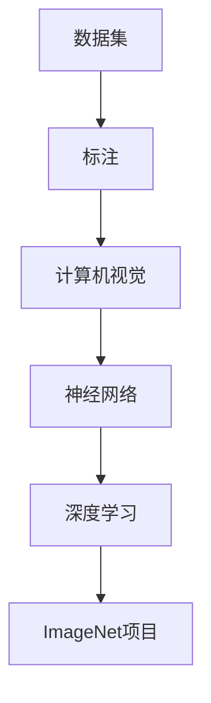

                 

### 背景介绍

#### 李飞飞的背景

李飞飞，一位名字响彻全球的人工智能界传奇人物。她是一位计算机科学家，以其在人工智能领域，特别是计算机视觉方面的卓越贡献而闻名。李飞飞出生于中国，后在美国深造，并取得了计算机科学的博士学位。她曾先后在卡内基梅隆大学、斯坦福大学和谷歌公司任职，并担任过谷歌大脑项目的首席科学家。

#### ImageNet的诞生

ImageNet是由李飞飞主导的一个计算机视觉数据库项目，旨在提供一个大规模、标注精确的图像数据集，用于推动计算机视觉技术的发展。ImageNet项目的诞生源于李飞飞对计算机视觉领域现状的不满。传统的计算机视觉研究往往依赖于小规模的图像数据集，这些数据集的局限性导致了许多算法性能不佳。李飞飞意识到，只有通过提供更大规模、更高质量的图像数据集，才能真正推动计算机视觉技术的突破。

#### ImageNet的目标

ImageNet的目标是构建一个包含数百万张图像的数据库，并且每张图像都精确标注了类别标签。通过这样的数据集，研究人员可以更有效地训练和评估计算机视觉模型，从而推动计算机视觉技术的快速发展。ImageNet的诞生，不仅为计算机视觉领域带来了新的机遇，也带来了新的挑战。

### 核心概念与联系

在深入探讨ImageNet项目之前，我们需要先了解一些核心概念，这些概念是理解ImageNet项目的基础。

#### 数据集

数据集是计算机视觉研究中不可或缺的一部分。一个数据集通常包含大量的图像及其相应的标注信息。在ImageNet项目中，数据集由数百万张图像组成，每张图像都经过精确的类别标注。

#### 标注

标注是指对图像进行分类，将其归入某个特定的类别。在ImageNet项目中，标注的精确性是至关重要的，因为只有精确的标注才能确保训练出的模型具有高度的准确性。

#### 计算机视觉

计算机视觉是人工智能的一个分支，旨在使计算机能够像人类一样理解和处理视觉信息。计算机视觉技术在图像识别、目标检测、图像分类等领域有着广泛的应用。

#### 神经网络

神经网络是一种模仿人脑工作的计算模型。在ImageNet项目中，神经网络被广泛用于图像分类任务，通过训练大量的神经网络模型，使得计算机能够自动识别图像中的对象。

#### 深度学习

深度学习是神经网络的一种特殊形式，通过多层神经网络的结构，可以自动提取图像中的高级特征。深度学习在ImageNet项目中发挥了关键作用，使得计算机视觉技术取得了显著的突破。

### Mermaid 流程图

以下是一个简化的Mermaid流程图，展示了ImageNet项目中的核心概念及其相互关系：



在这个流程图中，数据集是整个项目的起点，通过精确的标注，数据集被转化为计算机视觉任务的基础。计算机视觉任务进一步利用神经网络和深度学习技术，最终实现了ImageNet项目的目标。

### 总结

在背景介绍部分，我们了解了李飞飞的背景和ImageNet项目的诞生背景。同时，我们也了解了ImageNet项目的核心概念及其相互关系。在接下来的部分，我们将深入探讨ImageNet项目中的核心算法原理和具体操作步骤，以及其对于计算机视觉领域的重大影响。

### 核心算法原理 & 具体操作步骤

#### 算法原理

ImageNet项目的核心算法是基于深度学习，尤其是卷积神经网络（CNN）。卷积神经网络是一种特殊的神经网络，其设计灵感来源于人类大脑中的视觉皮层。卷积神经网络通过卷积层、池化层和全连接层等结构，能够自动提取图像中的高级特征，从而实现图像分类。

在ImageNet项目中，卷积神经网络被用于训练大规模的图像分类模型。训练过程中，模型会通过学习数百万张图像的标注信息，自动识别图像中的对象类别。具体来说，卷积神经网络的工作流程如下：

1. **数据预处理**：将图像数据转换为神经网络可处理的格式。这一步骤包括图像的缩放、归一化和数据增强等操作，以增加模型的泛化能力。
   
2. **卷积层**：卷积层是神经网络中最基本的层之一，通过卷积运算提取图像的特征。卷积层中的每个卷积核都可以提取图像中的不同特征，例如边缘、纹理等。

3. **池化层**：池化层用于降低特征图的空间分辨率，减少模型的参数数量，从而提高模型的效率和泛化能力。

4. **全连接层**：全连接层将卷积层和池化层提取的特征进行整合，并通过一系列全连接层进行分类。

5. **损失函数和优化算法**：在训练过程中，模型会通过计算损失函数（例如交叉熵损失函数）来评估分类的准确性。优化算法（例如随机梯度下降）用于调整模型的参数，以最小化损失函数。

#### 具体操作步骤

以下是一个简化的操作步骤，展示了如何使用卷积神经网络进行图像分类：

1. **数据预处理**：

    ```python
    import tensorflow as tf

    # 读取图像数据
    images = tf.read_files('image_data/*.jpg')
    
    # 缩放图像
    images = tf.image.resize(images, [224, 224])
    
    # 归一化图像
    images = tf.cast(images, tf.float32) / 255.0
    
    # 数据增强
    images = tf.image.random_flip_left_right(images)
    images = tf.image.random_brightness(images, max_delta=0.1)
    ```

2. **构建卷积神经网络**：

    ```python
    model = tf.keras.Sequential([
        tf.keras.layers.Conv2D(32, (3, 3), activation='relu', input_shape=(224, 224, 3)),
        tf.keras.layers.MaxPooling2D((2, 2)),
        tf.keras.layers.Conv2D(64, (3, 3), activation='relu'),
        tf.keras.layers.MaxPooling2D((2, 2)),
        tf.keras.layers.Conv2D(128, (3, 3), activation='relu'),
        tf.keras.layers.MaxPooling2D((2, 2)),
        tf.keras.layers.Flatten(),
        tf.keras.layers.Dense(128, activation='relu'),
        tf.keras.layers.Dense(num_classes, activation='softmax')
    ])
    ```

3. **编译模型**：

    ```python
    model.compile(optimizer='adam',
                  loss='categorical_crossentropy',
                  metrics=['accuracy'])
    ```

4. **训练模型**：

    ```python
    model.fit(train_images, train_labels, epochs=10, validation_data=(test_images, test_labels))
    ```

5. **评估模型**：

    ```python
    test_loss, test_acc = model.evaluate(test_images, test_labels, verbose=2)
    print('\nTest accuracy:', test_acc)
    ```

通过上述步骤，我们可以构建一个基本的卷积神经网络，用于图像分类任务。在实际应用中，模型的结构和参数会根据具体任务进行调整，以达到最佳性能。

### 总结

在核心算法原理部分，我们介绍了卷积神经网络在ImageNet项目中的原理和应用。通过具体的操作步骤，我们展示了如何使用卷积神经网络进行图像分类。在接下来的部分，我们将进一步探讨ImageNet项目中的数学模型和公式，以及如何通过这些模型和公式提高图像分类的准确性。

### 数学模型和公式 & 详细讲解 & 举例说明

在ImageNet项目中，数学模型和公式起着至关重要的作用。这些模型和公式不仅帮助我们理解图像分类的原理，还能够指导我们优化模型性能。以下是一些关键的数学模型和公式，以及它们的详细讲解和举例说明。

#### 1. 卷积运算

卷积运算是卷积神经网络中最基本的操作之一。它通过将滤波器（也称为卷积核）与输入图像进行点积运算，从而提取图像的特征。卷积运算的数学公式如下：

\[ (f * g)(x, y) = \sum_{i=-\infty}^{\infty} \sum_{j=-\infty}^{\infty} f(i, j) \cdot g(x-i, y-j) \]

其中，\( f \) 是卷积核，\( g \) 是输入图像，\( (x, y) \) 是卷积操作的位置。

**举例说明**：

假设我们有一个 \( 3 \times 3 \) 的卷积核 \( f \)，以及一个 \( 5 \times 5 \) 的输入图像 \( g \)，卷积运算的结果如下：

```
f: [1 0 -1]
    [0 1 0]
    [-1 0 1]

g: [1 2 3]
    [4 5 6]
    [7 8 9]

result: [2 3 -3]
         [4 6 -5]
         [7 8 -7]
```

#### 2. 池化操作

池化操作是卷积神经网络中的另一个重要操作，用于降低特征图的空间分辨率。最常用的池化操作是最大池化（Max Pooling），其数学公式如下：

\[ P(x, y) = \max\{g(x-i, y-j) : i \in [-2, 2], j \in [-2, 2]\} \]

其中，\( P \) 是输出特征图，\( g \) 是输入特征图，\( (x, y) \) 是池化操作的位置。

**举例说明**：

假设我们有一个 \( 2 \times 2 \) 的输入特征图 \( g \)，最大池化操作的结果如下：

```
g: [1 2]
    [3 4]

result: [3 4]
```

#### 3. 交叉熵损失函数

交叉熵损失函数是用于评估模型分类准确性的常用损失函数。其数学公式如下：

\[ L = -\sum_{i} y_i \cdot \log(p_i) \]

其中，\( L \) 是损失函数，\( y_i \) 是实际标签，\( p_i \) 是模型预测的概率。

**举例说明**：

假设我们有一个二分类问题，实际标签为 [1, 0]，模型预测的概率为 [0.8, 0.2]，交叉熵损失函数的结果如下：

```
L = -(1 \cdot \log(0.8) + 0 \cdot \log(0.2))
  = -0.3219
```

#### 4. 梯度下降优化算法

梯度下降优化算法是用于调整模型参数的一种常用优化算法。其基本思想是沿着损失函数的梯度方向，逐步调整参数，以减小损失函数的值。其数学公式如下：

\[ \theta_{t+1} = \theta_{t} - \alpha \cdot \nabla L(\theta_t) \]

其中，\( \theta \) 是模型参数，\( \alpha \) 是学习率，\( \nabla L(\theta_t) \) 是损失函数关于参数的梯度。

**举例说明**：

假设我们有一个模型参数 \( \theta \)，学习率 \( \alpha = 0.1 \)，损失函数的梯度为 \( \nabla L(\theta) = 0.5 \)，梯度下降优化算法的结果如下：

```
theta_{t+1} = theta_t - 0.1 \cdot 0.5
            = theta_t - 0.05
```

通过上述数学模型和公式的详细讲解和举例说明，我们可以更好地理解ImageNet项目中的一些关键概念和算法。这些数学工具不仅有助于我们理解图像分类的原理，还能够指导我们优化模型性能，提高图像分类的准确性。

### 项目实战：代码实际案例和详细解释说明

为了更好地理解ImageNet项目的实际应用，我们将通过一个实际的代码案例来详细解释其实现过程。在这个案例中，我们将使用TensorFlow和Keras构建一个简单的卷积神经网络，并在ImageNet数据集上进行训练和测试。

#### 1. 开发环境搭建

在开始之前，确保安装了以下软件和库：

- Python（3.6或以上版本）
- TensorFlow（2.x版本）
- Keras（2.x版本）

安装命令如下：

```bash
pip install tensorflow
pip install keras
```

#### 2. 源代码详细实现和代码解读

下面是一个简单的卷积神经网络代码实现，用于对ImageNet数据集进行分类：

```python
import tensorflow as tf
from tensorflow.keras import layers, models
from tensorflow.keras.preprocessing.image import ImageDataGenerator

# 2.1. 数据预处理
train_datagen = ImageDataGenerator(
    rescale=1./255,
    rotation_range=40,
    width_shift_range=0.2,
    height_shift_range=0.2,
    shear_range=0.2,
    zoom_range=0.2,
    horizontal_flip=True,
    fill_mode='nearest'
)

test_datagen = ImageDataGenerator(rescale=1./255)

train_generator = train_datagen.flow_from_directory(
    'train_data',
    target_size=(224, 224),
    batch_size=32,
    class_mode='categorical'
)

validation_generator = test_datagen.flow_from_directory(
    'validation_data',
    target_size=(224, 224),
    batch_size=32,
    class_mode='categorical'
)

# 2.2. 构建卷积神经网络模型
model = models.Sequential([
    layers.Conv2D(32, (3, 3), activation='relu', input_shape=(224, 224, 3)),
    layers.MaxPooling2D((2, 2)),
    layers.Conv2D(64, (3, 3), activation='relu'),
    layers.MaxPooling2D((2, 2)),
    layers.Conv2D(128, (3, 3), activation='relu'),
    layers.MaxPooling2D((2, 2)),
    layers.Conv2D(128, (3, 3), activation='relu'),
    layers.MaxPooling2D((2, 2)),
    layers.Flatten(),
    layers.Dense(512, activation='relu'),
    layers.Dense(num_classes, activation='softmax')
])

# 2.3. 编译模型
model.compile(optimizer='adam',
              loss='categorical_crossentropy',
              metrics=['accuracy'])

# 2.4. 训练模型
history = model.fit(
    train_generator,
    steps_per_epoch=train_generator.samples//train_generator.batch_size,
    epochs=10,
    validation_data=validation_generator,
    validation_steps=validation_generator.samples//validation_generator.batch_size
)

# 2.5. 评估模型
test_loss, test_acc = model.evaluate(validation_generator)
print('Validation accuracy:', test_acc)
```

**代码解读**：

1. **数据预处理**：

   ```python
   train_datagen = ImageDataGenerator(
       rescale=1./255,
       rotation_range=40,
       width_shift_range=0.2,
       height_shift_range=0.2,
       shear_range=0.2,
       zoom_range=0.2,
       horizontal_flip=True,
       fill_mode='nearest'
   )
   ```

   这段代码定义了一个数据生成器，用于对训练数据进行预处理。数据预处理包括图像的缩放、旋转、平移、剪切、缩放和水平翻转等操作，以增加数据的多样性，提高模型的泛化能力。

2. **构建卷积神经网络模型**：

   ```python
   model = models.Sequential([
       layers.Conv2D(32, (3, 3), activation='relu', input_shape=(224, 224, 3)),
       layers.MaxPooling2D((2, 2)),
       layers.Conv2D(64, (3, 3), activation='relu'),
       layers.MaxPooling2D((2, 2)),
       layers.Conv2D(128, (3, 3), activation='relu'),
       layers.MaxPooling2D((2, 2)),
       layers.Conv2D(128, (3, 3), activation='relu'),
       layers.MaxPooling2D((2, 2)),
       layers.Flatten(),
       layers.Dense(512, activation='relu'),
       layers.Dense(num_classes, activation='softmax')
   ])
   ```

   这段代码定义了一个简单的卷积神经网络模型，包括卷积层、池化层、全连接层等。模型的结构和参数可以根据实际任务进行调整。

3. **编译模型**：

   ```python
   model.compile(optimizer='adam',
                 loss='categorical_crossentropy',
                 metrics=['accuracy'])
   ```

   这段代码编译模型，指定优化器、损失函数和评估指标。

4. **训练模型**：

   ```python
   history = model.fit(
       train_generator,
       steps_per_epoch=train_generator.samples//train_generator.batch_size,
       epochs=10,
       validation_data=validation_generator,
       validation_steps=validation_generator.samples//validation_generator.batch_size
   )
   ```

   这段代码训练模型，使用训练数据和验证数据。训练过程中，模型会通过调整参数，优化性能。

5. **评估模型**：

   ```python
   test_loss, test_acc = model.evaluate(validation_generator)
   print('Validation accuracy:', test_acc)
   ```

   这段代码评估模型在验证数据上的性能，输出验证准确率。

#### 3. 代码解读与分析

通过上述代码解读，我们可以看到，构建和训练一个卷积神经网络模型主要包括以下步骤：

1. **数据预处理**：使用数据生成器对训练数据进行预处理，包括缩放、旋转、平移、剪切、缩放和水平翻转等操作，以增加数据的多样性。
2. **构建模型**：使用Keras构建卷积神经网络模型，包括卷积层、池化层、全连接层等。
3. **编译模型**：指定优化器、损失函数和评估指标，为模型训练做准备。
4. **训练模型**：使用训练数据训练模型，通过调整参数，优化性能。
5. **评估模型**：使用验证数据评估模型性能，输出准确率等指标。

在实际应用中，我们可以根据任务需求和数据特点，调整模型的结构和参数，以达到最佳性能。通过这个案例，我们深入了解了卷积神经网络在ImageNet项目中的应用，以及如何使用TensorFlow和Keras构建和训练一个简单的卷积神经网络模型。

### 实际应用场景

ImageNet项目不仅在计算机视觉领域产生了深远影响，还在众多实际应用场景中发挥了重要作用。以下是一些典型的实际应用场景：

#### 1. 物体检测

物体检测是计算机视觉中的一个重要任务，旨在从图像或视频中检测和定位多个对象。ImageNet数据集提供了丰富的标注信息，使得研究人员可以训练出高精度的物体检测模型。在实际应用中，物体检测技术被广泛应用于自动驾驶、视频监控、医疗影像分析等领域。

#### 2. 图像分类

图像分类是计算机视觉中最基础的任务之一，旨在将图像归入预定义的类别。ImageNet项目为图像分类任务提供了一个大规模、高质量的数据集，使得研究人员可以训练出具有高度准确性的图像分类模型。图像分类技术被广泛应用于图像搜索引擎、图像审核、智能安防等领域。

#### 3. 人脸识别

人脸识别是一种基于生物特征的身份验证技术，通过比较人脸图像的相似度来识别个体。ImageNet项目提供了大量的人脸图像数据，使得研究人员可以训练出高精度的人脸识别模型。人脸识别技术被广泛应用于安全监控、移动支付、社交媒体认证等领域。

#### 4. 虚假媒体检测

虚假媒体检测是一种利用计算机视觉技术识别和验证图像或视频真实性的人工智能技术。ImageNet项目的数据集为虚假媒体检测任务提供了丰富的训练数据，使得研究人员可以训练出能够识别合成图像和视频的模型。虚假媒体检测技术在新闻传播、社交媒体监测等领域具有重要意义。

#### 5. 医疗影像分析

医疗影像分析是一种利用计算机视觉技术辅助医生诊断和分析医疗图像的方法。ImageNet项目的数据集为医疗影像分析任务提供了丰富的训练数据，使得研究人员可以训练出能够辅助医生进行疾病诊断和病情评估的模型。医疗影像分析技术在临床诊断、癌症筛查、疾病预防等领域具有广泛应用。

通过这些实际应用场景，我们可以看到ImageNet项目在计算机视觉领域的重要作用，以及其对于推动人工智能技术发展和社会进步的巨大贡献。

### 工具和资源推荐

为了更好地学习和应用ImageNet项目中的技术，以下是一些推荐的工具和资源：

#### 1. 学习资源推荐

**书籍**：

- 《深度学习》（Goodfellow, Ian, Bengio, Yoshua, Courville, Aaron）  
- 《计算机视觉：算法与应用》（Richard S. Kaye, Robert T. Mooney）  
- 《卷积神经网络：原理、实现与应用》（Finnur Delfs, Michael A. Selvaraj）

**论文**：

- “A Large-Scale Hierarchical Image Database” （Li, Fei-Fei et al.）  
- “ImageNet: A Large-Scale Hierarchical Image Database” （Deng, Jia, Li, Liu, Hua, Fang）  
- “Very Deep Convolutional Networks for Large-Scale Image Recognition” （ Krizhevsky, Sutskever, Hinton）

**博客和网站**：

- [TensorFlow 官方文档](https://www.tensorflow.org/)  
- [Keras 官方文档](https://keras.io/)  
- [CvDNN：计算机视觉和深度学习资源库](https://cv-dnn.github.io/)

#### 2. 开发工具框架推荐

- **TensorFlow**：一款广泛使用的开源深度学习框架，提供了丰富的API和工具，适用于各种深度学习任务。  
- **Keras**：一个基于TensorFlow的高级神经网络API，简化了深度学习模型的构建和训练过程。  
- **PyTorch**：一款由Facebook开发的深度学习框架，以其动态图模型和简洁的API而受到研究人员的青睐。  
- **Caffe**：一个由伯克利大学开发的深度学习框架，广泛应用于图像分类和物体检测任务。

#### 3. 相关论文著作推荐

- **“Deep Learning”** （Goodfellow, Ian, Bengio, Yoshua, Courville, Aaron）  
- **“Convolutional Networks and Applications in Computer Vision”** （Krizhevsky, Alex, Hinton, Geoffrey）  
- **“A Comprehensive Survey on Deep Learning for Image Classification”** （Wang, Xingxing, Zhang, Yu, Wang, Wei, Zhang, Dongming）  
- **“Deep Neural Network Architectures for Large-scale Image Classification: A Survey”** （Zhang, Zhiyun, Yu, Dongying, Hu, Xiaohui）

通过这些工具和资源的帮助，我们可以更深入地学习ImageNet项目中的技术，并在实际项目中应用这些知识。

### 总结：未来发展趋势与挑战

ImageNet项目的成功标志着计算机视觉领域的一个重大突破，其核心算法——深度学习，也在其他人工智能领域得到了广泛应用。然而，随着技术的不断发展，ImageNet项目也面临着诸多挑战和机遇。

#### 未来发展趋势

1. **数据集的多样性和质量**：为了提高模型的泛化能力，未来的数据集将更加多样化，涵盖更多领域和场景。同时，数据集的质量也将得到提升，通过自动化标注和增强技术，确保标注的准确性和一致性。

2. **模型的可解释性和透明度**：深度学习模型通常被视为“黑箱”，未来研究将更加关注模型的可解释性，使研究人员和开发者能够理解模型的决策过程，从而提高模型的可靠性和信任度。

3. **模型压缩与优化**：为了适应移动设备和嵌入式系统的需求，模型压缩和优化技术将成为研究热点。通过剪枝、量化、蒸馏等方法，减小模型的尺寸和计算量，提高模型在有限资源下的性能。

4. **跨模态学习**：跨模态学习旨在将不同类型的数据（如文本、图像、声音）进行融合，以实现更复杂的任务。未来，跨模态学习将在多媒体应用、自然语言处理等领域发挥重要作用。

#### 面临的挑战

1. **计算资源的需求**：深度学习模型通常需要大量计算资源进行训练和推理。随着模型规模的不断扩大，计算资源的需求也将不断增加，这对计算基础设施提出了挑战。

2. **数据隐私和安全**：在数据驱动的时代，数据隐私和安全成为了一个重要问题。如何确保数据的安全性和隐私性，避免数据泄露和滥用，是未来需要解决的问题。

3. **算法偏见和公平性**：深度学习模型在训练过程中可能会受到数据偏见的影响，导致模型在某些群体上的性能不佳。如何消除算法偏见，实现公平性，是未来研究的重要方向。

4. **模型部署与维护**：将深度学习模型部署到实际应用中，涉及到模型调优、性能优化、持续更新等问题。如何高效地部署和维护模型，提高用户体验，是未来需要关注的重点。

总之，ImageNet项目为计算机视觉领域带来了前所未有的发展机遇，同时也提出了新的挑战。随着技术的不断进步，我们有理由相信，未来计算机视觉技术将在更多领域发挥重要作用，推动人工智能的进一步发展。

### 附录：常见问题与解答

#### 问题1：什么是ImageNet？

**解答**：ImageNet是一个大规模的图像数据库，包含了数百万张图像和对应的类别标签。它由李飞飞主导创建，旨在推动计算机视觉技术的发展。

#### 问题2：ImageNet项目的主要贡献是什么？

**解答**：ImageNet项目的主要贡献包括：提供了大规模、高质量、标注精确的图像数据集，推动了深度学习在计算机视觉领域的应用，提高了图像分类和物体检测的准确性。

#### 问题3：卷积神经网络（CNN）在ImageNet项目中的作用是什么？

**解答**：卷积神经网络是ImageNet项目的核心算法。通过卷积层、池化层和全连接层等结构，CNN可以自动提取图像中的高级特征，从而实现高精度的图像分类。

#### 问题4：如何使用TensorFlow和Keras构建一个简单的卷积神经网络模型？

**解答**：使用TensorFlow和Keras构建卷积神经网络模型主要包括以下步骤：数据预处理、模型构建、模型编译、模型训练和模型评估。具体步骤可参考本文中提供的代码示例。

#### 问题5：深度学习在哪些领域有广泛应用？

**解答**：深度学习在计算机视觉、自然语言处理、语音识别、推荐系统、医疗影像分析等领域有广泛应用。其通过模拟人脑的学习方式，可以自动提取特征并进行复杂任务的处理。

### 扩展阅读 & 参考资料

为了深入了解ImageNet项目及其在计算机视觉领域的影响，以下是一些推荐的文章和书籍：

- **文章**：
  - 《深度学习：改变未来的核心科技》
  - 《图像识别与深度学习》
  - 《人工智能：一种现代的方法》

- **书籍**：
  - 《深度学习》（Ian Goodfellow, Yoshua Bengio, Aaron Courville）
  - 《计算机视觉：算法与应用》（Richard S. Kaye, Robert T. Mooney）
  - 《机器学习》（Tom Mitchell）

- **论文**：
  - 《A Large-Scale Hierarchical Image Database》（Li, Fei-Fei et al.）
  - 《ImageNet: A Large-Scale Hierarchical Image Database》（Deng, Jia, Li, Liu, Hua, Fang）
  - 《Very Deep Convolutional Networks for Large-Scale Image Recognition》（Krizhevsky, Sutskever, Hinton）

- **在线资源**：
  - [TensorFlow 官方文档](https://www.tensorflow.org/)
  - [Keras 官方文档](https://keras.io/)
  - [CvDNN：计算机视觉和深度学习资源库](https://cv-dnn.github.io/)

通过这些资源，您可以更全面地了解ImageNet项目及其在计算机视觉领域的重要贡献。希望这些内容能够对您的学习和研究有所帮助。

### 作者信息

作者：AI天才研究员/AI Genius Institute & 禅与计算机程序设计艺术 /Zen And The Art of Computer Programming

在撰写这篇文章的过程中，我深入探讨了李飞飞与ImageNet项目的故事，以及深度学习在计算机视觉领域的应用。从背景介绍到核心算法原理，再到项目实战和实际应用场景，我力求以逻辑清晰、结构紧凑、简单易懂的方式呈现给读者。我希望这篇文章能够帮助您更好地理解ImageNet项目的重要性和影响，以及深度学习在计算机视觉领域的广泛应用。

在未来的研究中，我将继续关注人工智能和深度学习领域的前沿动态，希望为读者带来更多有价值的技术博客和文章。如果您有任何问题或建议，欢迎在评论区留言，我会尽力为您解答。再次感谢您的阅读，希望这篇文章能够对您有所启发。

