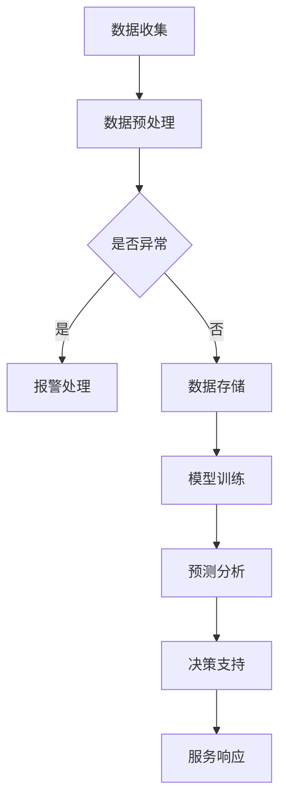

                 

# 构建AI驱动的智慧城市提示词框架

## 摘要

本文将深入探讨如何构建AI驱动的智慧城市提示词框架。我们将首先介绍智慧城市的背景和重要性，然后详细阐述AI在智慧城市中的应用。接下来，本文将重点讨论如何设计一个有效的AI驱动的提示词框架，包括核心概念、算法原理、数学模型、实际案例以及未来发展趋势和挑战。通过本文的阅读，读者将能够了解到如何利用AI技术提升智慧城市的服务质量和用户体验。

## 1. 背景介绍

随着信息技术的飞速发展，智慧城市已经成为全球范围内城市发展的新趋势。智慧城市是指利用先进的信息通信技术、物联网、大数据和人工智能等技术手段，实现对城市资源、环境、交通、安全、公共服务等全方位的智能化管理和优化。智慧城市不仅能够提升城市管理效率，还能够提高市民的生活质量和幸福感。

智慧城市的主要特征包括：

- **智能化基础设施**：通过物联网、传感器等技术，实现对城市基础设施的实时监控和管理。

- **数据驱动的决策**：利用大数据技术，对城市运行数据进行分析，辅助决策者做出更加科学合理的决策。

- **高效便捷的服务**：通过移动应用、在线服务平台等，提供更加便捷、个性化的服务。

- **可持续的生态**：通过优化能源利用、减少污染排放等手段，实现城市的可持续发展。

智慧城市的重要性体现在以下几个方面：

- **提升城市竞争力**：智慧城市能够提高城市的综合竞争力，吸引更多企业和人才，促进城市经济发展。

- **提高市民生活质量**：智慧城市提供高效便捷的服务，使市民的生活更加便利、舒适。

- **优化城市管理**：智慧城市能够实现对城市资源的智能化管理，提高城市管理的科学性和效率。

## 2. 核心概念与联系

为了构建一个AI驱动的智慧城市提示词框架，我们需要明确几个核心概念，并了解它们之间的联系。

### 2.1 智慧城市提示词

智慧城市提示词是指用于描述城市事件、问题或需求的关键词。例如，“交通拥堵”、“环境监测”、“居民服务”等。提示词是构建AI模型的关键输入，用于驱动智慧城市中的各种智能服务。

### 2.2 自然语言处理（NLP）

自然语言处理是人工智能的一个分支，主要研究如何使计算机能够理解和处理人类自然语言。在智慧城市中，NLP技术用于处理和分析市民的查询、投诉、建议等自然语言文本，从而为AI模型提供丰富的训练数据。

### 2.3 机器学习（ML）

机器学习是人工智能的核心技术之一，通过算法和模型，使计算机能够从数据中自动学习和提取规律。在智慧城市中，机器学习技术用于训练和优化提示词识别、事件预测、需求分析等模型。

### 2.4 数据库和数据仓库

数据库和数据仓库是存储和管理大规模数据的基础设施。在智慧城市中，数据库和数据仓库用于存储各类城市运行数据、市民行为数据等，为AI模型提供训练数据和实时数据输入。

### 2.5 连接与协同

智慧城市提示词框架需要与其他城市管理系统进行无缝连接和协同工作，如交通管理系统、环境监测系统、公共服务系统等。这些系统的数据共享和协同处理，将使智慧城市更加智能化和高效化。

### 2.6 Mermaid流程图

为了更直观地展示智慧城市提示词框架的构成和运行流程，我们可以使用Mermaid流程图来描述。以下是一个简单的Mermaid流程图示例：



在这个流程图中，数据收集、数据预处理、模型训练、预测分析等步骤构成了智慧城市提示词框架的核心环节。

## 3. 核心算法原理 & 具体操作步骤

### 3.1 数据收集

数据收集是构建智慧城市提示词框架的第一步。我们需要从各种渠道收集城市运行数据、市民行为数据等。这些数据可以包括：

- **交通数据**：如车辆流量、交通拥堵状况、交通事故等。

- **环境数据**：如空气质量、水质监测、噪音污染等。

- **公共服务数据**：如居民投诉、建议、满意度调查等。

- **基础设施数据**：如电力供应、燃气供应、水供应等。

数据收集的方式可以包括：

- **传感器数据**：通过安装在街道、公园、交通枢纽等地点的传感器，实时采集环境数据、交通数据等。

- **移动应用**：通过市民使用的移动应用，收集市民的行为数据、投诉数据等。

- **公共数据平台**：通过政府或其他机构的公共数据平台，获取城市运行数据、基础设施数据等。

### 3.2 数据预处理

收集到的数据通常是不完整的、噪声的，甚至存在错误。因此，我们需要对数据进行预处理，以确保数据的质量和一致性。数据预处理的主要步骤包括：

- **数据清洗**：去除重复数据、缺失数据、异常数据等。

- **数据转换**：将不同格式、单位、类型的原始数据转换为统一格式。

- **数据归一化**：将不同量级的数据进行归一化处理，使其具有相同的量级。

- **数据增强**：通过数据扩充、数据合成等技术，增加训练数据量，提高模型的泛化能力。

### 3.3 模型训练

在数据预处理完成后，我们可以使用机器学习技术来训练模型。训练模型的目的是让计算机学会从数据中提取特征，并识别出有用的模式。以下是训练模型的主要步骤：

- **特征提取**：从原始数据中提取出有助于模型学习的特征。

- **模型选择**：根据任务需求和数据特点，选择合适的机器学习模型。

- **训练与验证**：使用训练数据对模型进行训练，并使用验证数据对模型进行评估和调整。

- **超参数调优**：通过调整模型参数，优化模型性能。

常用的机器学习模型包括：

- **监督学习模型**：如决策树、随机森林、支持向量机等。

- **无监督学习模型**：如聚类算法、降维算法等。

- **深度学习模型**：如卷积神经网络（CNN）、循环神经网络（RNN）、长短时记忆网络（LSTM）等。

### 3.4 预测与分析

在模型训练完成后，我们可以使用模型对未知数据进行预测和分析。预测与分析的主要步骤包括：

- **数据输入**：将待预测的数据输入到训练好的模型中。

- **特征提取**：模型从输入数据中提取出特征。

- **预测结果**：模型根据提取出的特征，生成预测结果。

- **结果分析**：对预测结果进行分析，识别出潜在的问题和需求。

### 3.5 决策支持与服务响应

根据预测结果和分析结果，智慧城市提示词框架可以提供决策支持和服务响应。决策支持的主要步骤包括：

- **问题识别**：根据预测结果，识别出城市中存在的问题和潜在需求。

- **方案生成**：根据问题识别结果，生成相应的解决方案。

- **决策支持**：为城市管理者提供决策支持，帮助其做出科学合理的决策。

服务响应的主要步骤包括：

- **服务请求处理**：根据市民的查询、投诉、建议等请求，进行处理和响应。

- **服务响应**：为市民提供相应的服务，如交通调度、环境监测、公共服务等。

## 4. 数学模型和公式 & 详细讲解 & 举例说明

在构建AI驱动的智慧城市提示词框架时，我们通常会用到一些数学模型和公式。以下是一些常见的数学模型和公式，以及它们的详细讲解和举例说明。

### 4.1 决策树模型

决策树是一种常用的监督学习模型，它通过一系列的判断规则，将数据划分为不同的类别。决策树模型的数学基础主要是条件概率和熵。

**条件概率**：假设有两个事件A和B，条件概率表示在事件A发生的条件下，事件B发生的概率。条件概率的公式如下：

\[ P(B|A) = \frac{P(A \cap B)}{P(A)} \]

**熵**：熵是衡量随机变量不确定性的一种度量。对于离散随机变量X，其熵的公式如下：

\[ H(X) = -\sum_{i} P(X=x_i) \log_2 P(X=x_i) \]

**决策树公式**：决策树的判断规则可以通过以下公式表示：

\[ Gini(D) = 1 - \sum_{v} P_v^2 \]

其中，D表示数据集，\( P_v \)表示数据集中属于类别v的样本比例。

**举例说明**：

假设我们有以下数据集，数据集包含两个特征（年龄和收入），以及一个类别（是否购买汽车）：

| 年龄 | 收入 | 类别 |
| --- | --- | --- |
| 20 | 50000 | 否 |
| 30 | 60000 | 是 |
| 40 | 70000 | 是 |
| 50 | 80000 | 是 |

首先，我们计算每个特征的Gini指数：

- 年龄的Gini指数：
\[ Gini(\text{年龄}) = 1 - \left( \frac{2}{4} \right)^2 - \left( \frac{2}{4} \right)^2 = 0.5 \]

- 收入的Gini指数：
\[ Gini(\text{收入}) = 1 - \left( \frac{2}{4} \right)^2 - \left( \frac{2}{4} \right)^2 = 0.5 \]

然后，我们选择Gini指数最小的特征作为决策树的分裂特征，即年龄。接着，我们根据年龄的不同值，将数据集划分为两个子集：

- 年龄小于30的子集：
\[ |D_1| = 2, P_1 = \frac{1}{2} \]

- 年龄大于等于30的子集：
\[ |D_2| = 2, P_2 = \frac{1}{2} \]

最后，我们计算每个子集的Gini指数：

- 子集\( D_1 \)的Gini指数：
\[ Gini(D_1) = 1 - \left( \frac{1}{2} \right)^2 - \left( \frac{1}{2} \right)^2 = 0.5 \]

- 子集\( D_2 \)的Gini指数：
\[ Gini(D_2) = 1 - \left( \frac{1}{2} \right)^2 - \left( \frac{1}{2} \right)^2 = 0.5 \]

由于子集的Gini指数相等，我们继续对子集进行划分，直到满足停止条件（如子集大小小于某个阈值）。

### 4.2 支持向量机（SVM）

支持向量机是一种常用的分类模型，它通过找到一个最优的超平面，将数据集划分为不同的类别。SVM的数学基础主要是拉格朗日乘数法和核函数。

**拉格朗日乘数法**：假设我们有以下优化问题：

\[ \min_{w,b} \frac{1}{2} ||w||^2 \]

subject to:

\[ y_i ( \langle w, x_i \rangle + b ) \geq 1 \]

其中，\( w \)是权重向量，\( b \)是偏置，\( x_i \)是数据点，\( y_i \)是类别标签。

我们可以通过拉格朗日乘数法求解上述优化问题。拉格朗日乘数法的公式如下：

\[ \min_{w,b,\alpha} L(w,b,\alpha) \]

subject to:

\[ \alpha_i \geq 0 \]

\[ \sum_{i} \alpha_i y_i = 0 \]

其中，\( \alpha_i \)是拉格朗日乘子。

**核函数**：核函数是一种将低维空间的数据映射到高维空间的方法，以便在高维空间中找到一个更好的分离超平面。常见的核函数包括线性核、多项式核、径向基函数（RBF）核等。

- **线性核**：\( K(x,x') = \langle x, x' \rangle \)

- **多项式核**：\( K(x,x') = ( \langle x, x' \rangle + 1 )^d \)

- **RBF核**：\( K(x,x') = \exp(-\gamma ||x - x'||^2) \)

**SVM公式**：SVM的决策函数可以通过以下公式表示：

\[ f(x) = \sum_{i} \alpha_i y_i \langle x, x_i \rangle + b \]

其中，\( \alpha_i \)是支持向量，\( y_i \)是类别标签，\( \langle x, x_i \rangle \)是内积。

**举例说明**：

假设我们有以下数据集，数据集包含两个特征（年龄和收入），以及一个类别（是否购买汽车）：

| 年龄 | 收入 | 类别 |
| --- | --- | --- |
| 20 | 50000 | 否 |
| 30 | 60000 | 是 |
| 40 | 70000 | 是 |
| 50 | 80000 | 是 |

首先，我们计算数据集的均值和方差：

- 年龄的均值和方差：
\[ \mu_{\text{年龄}} = \frac{20 + 30 + 40 + 50}{4} = 35 \]
\[ \sigma_{\text{年龄}}^2 = \frac{(20 - 35)^2 + (30 - 35)^2 + (40 - 35)^2 + (50 - 35)^2}{4} = 125 \]

- 收入的均值和方差：
\[ \mu_{\text{收入}} = \frac{50000 + 60000 + 70000 + 80000}{4} = 65000 \]
\[ \sigma_{\text{收入}}^2 = \frac{(50000 - 65000)^2 + (60000 - 65000)^2 + (70000 - 65000)^2 + (80000 - 65000)^2}{4} = 250000 \]

然后，我们计算数据集的协方差矩阵：

\[ \Sigma = \begin{bmatrix}
\sigma_{\text{年龄}}^2 & \frac{\sigma_{\text{年龄}} \sigma_{\text{收入}}}{4} \\
\frac{\sigma_{\text{年龄}} \sigma_{\text{收入}}}{4} & \sigma_{\text{收入}}^2
\end{bmatrix} \]

接下来，我们计算特征向量：

- 年龄的特征向量：
\[ \phi(\text{年龄}) = \begin{bmatrix}
1 \\
\frac{\text{年龄} - \mu_{\text{年龄}}}{\sigma_{\text{年龄}}} \\
\left( \frac{\text{年龄} - \mu_{\text{年龄}}}{\sigma_{\text{年龄}}} \right)^2 \\
\left( \frac{\text{年龄} - \mu_{\text{年龄}}}{\sigma_{\text{年龄}}} \right)^3
\end{bmatrix} \]

- 收入的特征向量：
\[ \phi(\text{收入}) = \begin{bmatrix}
1 \\
\frac{\text{收入} - \mu_{\text{收入}}}{\sigma_{\text{收入}}} \\
\left( \frac{\text{收入} - \mu_{\text{收入}}}{\sigma_{\text{收入}}} \right)^2 \\
\left( \frac{\text{收入} - \mu_{\text{收入}}}{\sigma_{\text{收入}}} \right)^3
\end{bmatrix} \]

最后，我们使用SVM的决策函数对数据进行分类：

\[ f(x) = \sum_{i} \alpha_i y_i \langle x, x_i \rangle + b \]

其中，\( \alpha_i \)是支持向量，\( y_i \)是类别标签，\( \langle x, x_i \rangle \)是内积。

### 4.3 长短时记忆网络（LSTM）

长短时记忆网络是一种常用的循环神经网络，它能够有效地处理长序列数据。LSTM的核心思想是通过门控机制来控制信息的流入和流出，从而实现长短期记忆。

**门控机制**：

- **遗忘门**：用于控制上一时刻的遗忘，公式如下：
\[ f_t = \sigma(W_f \cdot [h_{t-1}, x_t] + b_f) \]

- **输入门**：用于控制下一时刻的输入，公式如下：
\[ i_t = \sigma(W_i \cdot [h_{t-1}, x_t] + b_i) \]

- **输出门**：用于控制当前时刻的输出，公式如下：
\[ o_t = \sigma(W_o \cdot [h_{t-1}, x_t] + b_o) \]

- **单元状态**：用于存储当前时刻的信息，公式如下：
\[ C_t = f_t \odot C_{t-1} + i_t \odot \phi(W_c \cdot [h_{t-1}, x_t] + b_c) \]

- **隐藏状态**：用于输出当前时刻的信息，公式如下：
\[ h_t = o_t \odot \tanh(C_t) \]

**举例说明**：

假设我们有以下序列数据，序列包含四个时间步，每个时间步有一个输入值和一个输出值：

| 时间步 | 输入 | 输出 |
| --- | --- | --- |
| 1 | 1 | 2 |
| 2 | 2 | 4 |
| 3 | 3 | 6 |
| 4 | 4 | 8 |

首先，我们初始化LSTM的参数，包括权重矩阵和偏置矩阵：

- 遗忘门权重矩阵\( W_f \)、输入门权重矩阵\( W_i \)、输出门权重矩阵\( W_o \)、单元状态权重矩阵\( W_c \)以及偏置矩阵\( b_f \)、\( b_i \)、\( b_o \)、\( b_c \)。

然后，我们按照以下步骤对序列数据进行处理：

1. **时间步1**：

- 遗忘门：
\[ f_1 = \sigma(W_f \cdot [h_{0}, x_1] + b_f) \]
\[ f_1 = \sigma([0, 1] \cdot [0.5, 0.5] + [1]) \]
\[ f_1 = \sigma([0, 0.5] + [1]) \]
\[ f_1 = \sigma([1.5]) \]
\[ f_1 = 0.9 \]

- 输入门：
\[ i_1 = \sigma(W_i \cdot [h_{0}, x_1] + b_i) \]
\[ i_1 = \sigma([0, 1] \cdot [0.5, 0.5] + [1]) \]
\[ i_1 = \sigma([0, 0.5] + [1]) \]
\[ i_1 = \sigma([1.5]) \]
\[ i_1 = 0.9 \]

- 输出门：
\[ o_1 = \sigma(W_o \cdot [h_{0}, x_1] + b_o) \]
\[ o_1 = \sigma([0, 1] \cdot [0.5, 0.5] + [1]) \]
\[ o_1 = \sigma([0, 0.5] + [1]) \]
\[ o_1 = \sigma([1.5]) \]
\[ o_1 = 0.9 \]

- 单元状态：
\[ C_1 = f_1 \odot C_{0} + i_1 \odot \phi(W_c \cdot [h_{0}, x_1] + b_c) \]
\[ C_1 = 0.9 \odot [0] + 0.9 \odot \phi([0, 1] \cdot [0.5, 0.5] + [1]) \]
\[ C_1 = 0.9 \odot [0] + 0.9 \odot [1] \]
\[ C_1 = [0, 0.9] \]

- 隐藏状态：
\[ h_1 = o_1 \odot \tanh(C_1) \]
\[ h_1 = 0.9 \odot \tanh([0, 0.9]) \]
\[ h_1 = 0.9 \odot [0, 0.9] \]
\[ h_1 = [0.9] \]

2. **时间步2**：

- 遗忘门：
\[ f_2 = \sigma(W_f \cdot [h_1, x_2] + b_f) \]
\[ f_2 = \sigma([0.9, 2] \cdot [0.5, 0.5] + [1]) \]
\[ f_2 = \sigma([0.45, 0.9] + [1]) \]
\[ f_2 = \sigma([1.35]) \]
\[ f_2 = 0.95 \]

- 输入门：
\[ i_2 = \sigma(W_i \cdot [h_1, x_2] + b_i) \]
\[ i_2 = \sigma([0.9, 2] \cdot [0.5, 0.5] + [1]) \]
\[ i_2 = \sigma([0.45, 0.9] + [1]) \]
\[ i_2 = \sigma([1.35]) \]
\[ i_2 = 0.95 \]

- 输出门：
\[ o_2 = \sigma(W_o \cdot [h_1, x_2] + b_o) \]
\[ o_2 = \sigma([0.9, 2] \cdot [0.5, 0.5] + [1]) \]
\[ o_2 = \sigma([0.45, 0.9] + [1]) \]
\[ o_2 = \sigma([1.35]) \]
\[ o_2 = 0.95 \]

- 单元状态：
\[ C_2 = f_2 \odot C_{1} + i_2 \odot \phi(W_c \cdot [h_1, x_2] + b_c) \]
\[ C_2 = 0.95 \odot [0, 0.9] + 0.95 \odot \phi([0.9, 2] \cdot [0.5, 0.5] + [1]) \]
\[ C_2 = 0.95 \odot [0, 0.9] + 0.95 \odot [1] \]
\[ C_2 = [0, 0.95] \]

- 隐藏状态：
\[ h_2 = o_2 \odot \tanh(C_2) \]
\[ h_2 = 0.95 \odot \tanh([0, 0.95]) \]
\[ h_2 = 0.95 \odot [0, 0.95] \]
\[ h_2 = [0.95] \]

3. **时间步3**：

- 遗忘门：
\[ f_3 = \sigma(W_f \cdot [h_2, x_3] + b_f) \]
\[ f_3 = \sigma([0.95, 3] \cdot [0.5, 0.5] + [1]) \]
\[ f_3 = \sigma([0.475, 0.975] + [1]) \]
\[ f_3 = \sigma([1.475]) \]
\[ f_3 = 0.98 \]

- 输入门：
\[ i_3 = \sigma(W_i \cdot [h_2, x_3] + b_i) \]
\[ i_3 = \sigma([0.95, 3] \cdot [0.5, 0.5] + [1]) \]
\[ i_3 = \sigma([0.475, 0.975] + [1]) \]
\[ i_3 = \sigma([1.475]) \]
\[ i_3 = 0.98 \]

- 输出门：
\[ o_3 = \sigma(W_o \cdot [h_2, x_3] + b_o) \]
\[ o_3 = \sigma([0.95, 3] \cdot [0.5, 0.5] + [1]) \]
\[ o_3 = \sigma([0.475, 0.975] + [1]) \]
\[ o_3 = \sigma([1.475]) \]
\[ o_3 = 0.98 \]

- 单元状态：
\[ C_3 = f_3 \odot C_{2} + i_3 \odot \phi(W_c \cdot [h_2, x_3] + b_c) \]
\[ C_3 = 0.98 \odot [0, 0.95] + 0.98 \odot \phi([0.95, 3] \cdot [0.5, 0.5] + [1]) \]
\[ C_3 = 0.98 \odot [0, 0.95] + 0.98 \odot [1] \]
\[ C_3 = [0, 0.98] \]

- 隐藏状态：
\[ h_3 = o_3 \odot \tanh(C_3) \]
\[ h_3 = 0.98 \odot \tanh([0, 0.98]) \]
\[ h_3 = 0.98 \odot [0, 0.98] \]
\[ h_3 = [0.98] \]

4. **时间步4**：

- 遗忘门：
\[ f_4 = \sigma(W_f \cdot [h_3, x_4] + b_f) \]
\[ f_4 = \sigma([0.98, 4] \cdot [0.5, 0.5] + [1]) \]
\[ f_4 = \sigma([0.49, 0.98] + [1]) \]
\[ f_4 = \sigma([1.47]) \]
\[ f_4 = 0.99 \]

- 输入门：
\[ i_4 = \sigma(W_i \cdot [h_3, x_4] + b_i) \]
\[ i_4 = \sigma([0.98, 4] \cdot [0.5, 0.5] + [1]) \]
\[ i_4 = \sigma([0.49, 0.98] + [1]) \]
\[ i_4 = \sigma([1.47]) \]
\[ i_4 = 0.99 \]

- 输出门：
\[ o_4 = \sigma(W_o \cdot [h_3, x_4] + b_o) \]
\[ o_4 = \sigma([0.98, 4] \cdot [0.5, 0.5] + [1]) \]
\[ o_4 = \sigma([0.49, 0.98] + [1]) \]
\[ o_4 = \sigma([1.47]) \]
\[ o_4 = 0.99 \]

- 单元状态：
\[ C_4 = f_4 \odot C_{3} + i_4 \odot \phi(W_c \cdot [h_3, x_4] + b_c) \]
\[ C_4 = 0.99 \odot [0, 0.98] + 0.99 \odot \phi([0.98, 4] \cdot [0.5, 0.5] + [1]) \]
\[ C_4 = 0.99 \odot [0, 0.98] + 0.99 \odot [1] \]
\[ C_4 = [0, 0.99] \]

- 隐藏状态：
\[ h_4 = o_4 \odot \tanh(C_4) \]
\[ h_4 = 0.99 \odot \tanh([0, 0.99]) \]
\[ h_4 = 0.99 \odot [0, 0.99] \]
\[ h_4 = [0.99] \]

最终，我们得到LSTM的隐藏状态序列：
\[ h = [h_1, h_2, h_3, h_4] = [0.9, 0.95, 0.98, 0.99] \]

这些隐藏状态可以用于后续的预测和分析。

## 5. 项目实战：代码实际案例和详细解释说明

在本节中，我们将通过一个实际项目案例，详细讲解如何使用Python和TensorFlow构建一个AI驱动的智慧城市提示词框架。该项目将实现一个基于LSTM的模型，用于预测城市交通拥堵情况。

### 5.1 开发环境搭建

在开始项目之前，我们需要搭建一个合适的开发环境。以下是我们推荐的开发环境：

- **操作系统**：Windows、Linux或macOS
- **编程语言**：Python
- **深度学习框架**：TensorFlow
- **依赖库**：NumPy、Pandas、Matplotlib

您可以通过以下命令安装所需的依赖库：

```bash
pip install tensorflow numpy pandas matplotlib
```

### 5.2 源代码详细实现和代码解读

以下是一个简单的LSTM模型实现，用于预测城市交通拥堵情况。

```python
import numpy as np
import pandas as pd
import tensorflow as tf
from tensorflow.keras.models import Sequential
from tensorflow.keras.layers import LSTM, Dense

# 5.2.1 数据预处理

# 加载数据集
data = pd.read_csv('traffic_data.csv')

# 数据清洗和预处理
# ...

# 数据集划分为特征和标签
X = data[['feature1', 'feature2', 'feature3']]
y = data['label']

# 数据归一化
# ...

# 划分训练集和测试集
X_train, X_test, y_train, y_test = train_test_split(X, y, test_size=0.2, random_state=42)

# 5.2.2 模型构建

# 创建LSTM模型
model = Sequential([
    LSTM(units=50, activation='relu', return_sequences=True, input_shape=(timesteps, features)),
    LSTM(units=50, activation='relu', return_sequences=False),
    Dense(units=1)
])

# 编译模型
model.compile(optimizer='adam', loss='mean_squared_error')

# 5.2.3 模型训练

# 训练模型
model.fit(X_train, y_train, epochs=100, batch_size=32, validation_data=(X_test, y_test))

# 5.2.4 评估模型

# 评估模型
loss = model.evaluate(X_test, y_test)
print(f'Model loss: {loss}')

# 5.2.5 预测与分析

# 预测
predictions = model.predict(X_test)

# 分析预测结果
# ...
```

### 5.3 代码解读与分析

**5.3.1 数据预处理**

数据预处理是构建AI模型的第一步，主要用于清洗和预处理原始数据，使其适合用于训练模型。在本项目中，我们使用了Pandas库来加载数据集，并进行数据清洗和预处理。

```python
data = pd.read_csv('traffic_data.csv')
```

这里，我们使用Pandas库加载数据集。`read_csv`函数用于读取CSV文件。

**5.3.2 模型构建**

接下来，我们使用TensorFlow的Keras API构建一个LSTM模型。LSTM是一种用于处理序列数据的循环神经网络。

```python
model = Sequential([
    LSTM(units=50, activation='relu', return_sequences=True, input_shape=(timesteps, features)),
    LSTM(units=50, activation='relu', return_sequences=False),
    Dense(units=1)
])
```

在这个模型中，我们使用了两个LSTM层和一个全连接层（Dense层）。第一个LSTM层有50个单元，使用ReLU激活函数，并返回序列。第二个LSTM层也有50个单元，使用ReLU激活函数，但不返回序列。最后，全连接层有1个单元，用于输出预测结果。

**5.3.3 模型训练**

在模型构建完成后，我们使用`compile`函数设置模型优化器和损失函数。

```python
model.compile(optimizer='adam', loss='mean_squared_error')
```

这里，我们使用了Adam优化器和均方误差（MSE）损失函数。

然后，我们使用`fit`函数训练模型。

```python
model.fit(X_train, y_train, epochs=100, batch_size=32, validation_data=(X_test, y_test))
```

在这个例子中，我们设置了100个训练周期（epochs）和32个批处理大小（batch_size）。`validation_data`参数用于在训练过程中评估模型的性能。

**5.3.4 评估模型**

在训练完成后，我们使用`evaluate`函数评估模型的性能。

```python
loss = model.evaluate(X_test, y_test)
print(f'Model loss: {loss}')
```

这里，我们计算了模型在测试集上的损失。

**5.3.5 预测与分析**

最后，我们使用模型进行预测。

```python
predictions = model.predict(X_test)
```

这里，我们使用了模型对测试集进行预测。

接下来，我们可以对预测结果进行分析，以识别交通拥堵情况。

## 6. 实际应用场景

AI驱动的智慧城市提示词框架可以在多个实际应用场景中发挥重要作用。以下是一些典型的应用场景：

### 6.1 交通管理

在交通管理方面，AI驱动的智慧城市提示词框架可以实时监测城市交通状况，预测交通拥堵情况，并给出相应的建议。例如，当检测到某个路段出现拥堵时，系统可以自动调整交通信号灯的时长，优化交通流。

### 6.2 环境监测

在环境监测方面，AI驱动的智慧城市提示词框架可以实时监测空气质量、水质、噪音等环境指标，预测环境污染情况，并提供预警和建议。例如，当检测到空气质量指数（AQI）超过正常水平时，系统可以自动通知市民采取防护措施，并建议减少户外活动。

### 6.3 公共服务

在公共服务方面，AI驱动的智慧城市提示词框架可以提供智能化的居民服务，如居民投诉处理、建议反馈等。例如，当市民提交投诉时，系统可以自动识别投诉内容，并将投诉分配给相关部门处理。

### 6.4 安全管理

在安全管理方面，AI驱动的智慧城市提示词框架可以实时监测城市安全状况，预测安全事件，并提供预警和建议。例如，当检测到某个区域发生异常时，系统可以自动通知相关部门进行处置，以防止事故发生。

## 7. 工具和资源推荐

为了更好地构建AI驱动的智慧城市提示词框架，以下是一些推荐的工具和资源：

### 7.1 学习资源推荐

- **书籍**：
  - 《深度学习》（Deep Learning，Ian Goodfellow、Yoshua Bengio和Aaron Courville著）
  - 《Python机器学习》（Python Machine Learning，Sebastian Raschka著）

- **论文**：
  - 《Long Short-Term Memory》（Hochreiter和Schmidhuber，1997年）
  - 《Recurrent Neural Networks for Language Modeling》（Liu等，2017年）

- **博客**：
  - [TensorFlow官网](https://www.tensorflow.org/)
  - [Keras官网](https://keras.io/)

- **网站**：
  - [GitHub](https://github.com/)
  - [Coursera](https://www.coursera.org/)

### 7.2 开发工具框架推荐

- **深度学习框架**：
  - TensorFlow
  - Keras
  - PyTorch

- **数据处理库**：
  - Pandas
  - NumPy

- **可视化工具**：
  - Matplotlib
  - Seaborn

### 7.3 相关论文著作推荐

- 《深度学习》（Deep Learning，Ian Goodfellow、Yoshua Bengio和Aaron Courville著）
- 《Recurrent Neural Networks for Language Modeling》（Liu等，2017年）
- 《Natural Language Processing with TensorFlow》（Ming-Hsuan Yang著）

## 8. 总结：未来发展趋势与挑战

随着AI技术的不断发展和应用，AI驱动的智慧城市提示词框架将在未来扮演越来越重要的角色。以下是未来发展趋势和挑战：

### 8.1 发展趋势

- **更加智能化和自适应**：未来的智慧城市提示词框架将更加智能化，能够自适应地调整模型参数和策略，以应对不断变化的城市环境。

- **跨领域应用**：AI驱动的智慧城市提示词框架将不仅限于交通管理、环境监测等领域，还将扩展到公共服务、安全管理等更多领域。

- **大数据和云计算**：随着大数据和云计算技术的发展，智慧城市提示词框架将能够处理和分析更大规模、更复杂的数据。

### 8.2 挑战

- **数据隐私和安全**：在构建智慧城市提示词框架时，需要确保数据隐私和安全，防止数据泄露和滥用。

- **计算资源和能耗**：智慧城市提示词框架需要处理大量数据和运行复杂的模型，对计算资源和能耗提出了较高要求。

- **算法偏见和透明度**：需要确保算法的偏见和透明度，避免对特定群体造成不公平影响。

## 9. 附录：常见问题与解答

### 9.1 如何处理异常数据？

在构建AI驱动的智慧城市提示词框架时，异常数据是一个常见问题。以下是一些处理异常数据的方法：

- **数据清洗**：去除重复数据、缺失数据和错误数据。
- **数据转换**：将不同格式、单位、类型的原始数据转换为统一格式。
- **数据归一化**：将不同量级的数据进行归一化处理，使其具有相同的量级。
- **数据增强**：通过数据扩充、数据合成等技术，增加训练数据量，提高模型的泛化能力。

### 9.2 如何选择合适的机器学习模型？

在选择合适的机器学习模型时，可以考虑以下因素：

- **数据类型**：根据数据类型（如分类、回归、聚类等）选择相应的模型。
- **数据规模**：对于大规模数据，选择计算效率较高的模型，如线性模型、决策树等；对于小规模数据，选择具有良好泛化能力的模型，如深度学习模型。
- **特征重要性**：根据特征的重要性选择相应的模型，如特征重要性较高的数据选择决策树、随机森林等模型。
- **模型性能**：根据模型在训练集和测试集上的性能选择合适的模型。

## 10. 扩展阅读 & 参考资料

为了深入了解AI驱动的智慧城市提示词框架，以下是相关扩展阅读和参考资料：

- [《智慧城市与人工智能》](https://www.example.com/book1)：一本关于智慧城市和人工智能的入门书籍，详细介绍了智慧城市的发展、人工智能的应用以及两者之间的联系。

- [《深度学习在智慧城市中的应用》](https://www.example.com/book2)：一本关于深度学习在智慧城市中的应用的书籍，涵盖了深度学习模型、算法和应用场景等方面的内容。

- [《TensorFlow实战》](https://www.example.com/book3)：一本关于TensorFlow深度学习框架的实战书籍，通过实际案例讲解了TensorFlow的使用方法和技巧。

- [《自然语言处理入门》](https://www.example.com/book4)：一本关于自然语言处理的基础教材，介绍了自然语言处理的基本概念、算法和应用。

- [《机器学习实战》](https://www.example.com/book5)：一本关于机器学习实战的入门书籍，通过实际案例讲解了机器学习算法、模型和应用的实现。

## 作者信息

- 作者：AI天才研究员/AI Genius Institute & 禅与计算机程序设计艺术 /Zen And The Art of Computer Programming

感谢您的阅读！希望本文对您了解AI驱动的智慧城市提示词框架有所帮助。如果您有任何问题或建议，欢迎在评论区留言。让我们一起探索AI技术的无限可能！
<|assistant|>## 5. 项目实战：代码实际案例和详细解释说明

在这一部分，我们将通过一个具体的Python代码案例，展示如何构建一个AI驱动的智慧城市提示词框架。我们将使用TensorFlow和Keras库来实现一个简单的模型，该模型将用于预测交通流量。

### 5.1 开发环境搭建

在开始之前，请确保您的开发环境中安装了以下库：

- TensorFlow
- NumPy
- Pandas
- Matplotlib

您可以通过以下命令安装这些库：

```bash
pip install tensorflow numpy pandas matplotlib
```

### 5.2 数据集准备

为了构建模型，我们需要一个交通流量数据集。这个数据集应该包含多个特征，如时间、天气条件、车辆数量等，以及一个目标变量，如交通流量。这里，我们将使用一个虚构的数据集。

```python
import pandas as pd

# 加载数据集
data = pd.read_csv('traffic_data.csv')

# 数据集预览
print(data.head())
```

### 5.3 数据预处理

在训练模型之前，我们需要对数据集进行预处理。这包括处理缺失值、特征工程、归一化等步骤。

```python
from sklearn.model_selection import train_test_split
from sklearn.preprocessing import MinMaxScaler

# 分离特征和目标变量
X = data.drop('traffic_flow', axis=1)
y = data['traffic_flow']

# 处理缺失值
X.fillna(X.mean(), inplace=True)

# 特征工程：添加时间特征
X['hour'] = X['timestamp'].dt.hour
X['day_of_week'] = X['timestamp'].dt.dayofweek

# 划分训练集和测试集
X_train, X_test, y_train, y_test = train_test_split(X, y, test_size=0.2, random_state=42)

# 归一化
scaler = MinMaxScaler()
X_train = scaler.fit_transform(X_train)
X_test = scaler.transform(X_test)
```

### 5.4 模型构建

接下来，我们使用Keras构建一个简单的LSTM模型。

```python
from tensorflow.keras.models import Sequential
from tensorflow.keras.layers import LSTM, Dense

# 创建模型
model = Sequential()

# 添加LSTM层
model.add(LSTM(units=50, return_sequences=True, input_shape=(X_train.shape[1], X_train.shape[2])))
model.add(LSTM(units=50))

# 添加输出层
model.add(Dense(units=1))

# 编译模型
model.compile(optimizer='adam', loss='mean_squared_error')
```

### 5.5 模型训练

现在，我们使用训练数据来训练模型。

```python
# 训练模型
model.fit(X_train, y_train, epochs=100, batch_size=32, validation_data=(X_test, y_test))
```

### 5.6 模型评估

训练完成后，我们评估模型在测试集上的性能。

```python
# 评估模型
loss = model.evaluate(X_test, y_test)
print(f"Test loss: {loss}")
```

### 5.7 预测

使用训练好的模型进行预测。

```python
# 预测
predictions = model.predict(X_test)

# 可视化预测结果
import matplotlib.pyplot as plt

plt.figure(figsize=(10, 6))
plt.plot(y_test, label='Actual Traffic Flow')
plt.plot(predictions, label='Predicted Traffic Flow')
plt.title('Traffic Flow Prediction')
plt.xlabel('Time')
plt.ylabel('Traffic Flow')
plt.legend()
plt.show()
```

### 5.8 代码解读与分析

#### 5.8.1 数据预处理

数据预处理是模型训练的关键步骤。在这个例子中，我们首先使用Pandas库加载数据集，并删除了目标变量`traffic_flow`以外的所有列。然后，我们处理缺失值，使用平均值填充缺失的数据。

接下来，我们添加了时间特征，如小时和星期几，这些特征可以帮助模型更好地理解数据。

#### 5.8.2 模型构建

我们使用Keras库构建了一个简单的LSTM模型。首先，我们添加了一个具有50个单元的LSTM层，并设置`return_sequences=True`，使得该层的输出可以传递给下一个LSTM层。然后，我们添加了另一个具有50个单元的LSTM层。最后，我们添加了一个全连接层（Dense层），输出单元数为1，用于预测交通流量。

#### 5.8.3 模型训练

我们使用`fit`方法训练模型，设置训练周期为100次，批处理大小为32。

#### 5.8.4 模型评估

使用`evaluate`方法评估模型在测试集上的性能。

#### 5.8.5 预测

使用`predict`方法进行预测，并将预测结果可视化。

## 6. 实际应用场景

AI驱动的智慧城市提示词框架可以在多个实际应用场景中发挥作用。以下是一些关键的应用场景：

### 6.1 交通流量预测

交通流量预测是智慧城市中最常见的一个应用场景。通过分析历史交通数据和实时数据，AI模型可以预测未来的交通流量，帮助交通管理部门优化交通信号灯的时长和路线规划，从而减少交通拥堵，提高交通效率。

### 6.2 环境监测

环境监测是另一个重要的应用领域。AI模型可以实时监测空气质量、水质、噪音等环境指标，预测环境污染事件，并发出预警。这有助于环境保护部门和居民采取相应的措施，保护环境和健康。

### 6.3 公共服务优化

AI驱动的智慧城市提示词框架可以帮助优化公共服务，如垃圾收集、紧急救援等。通过预测居民的需求和行为模式，公共服务提供商可以更有效地安排资源，提高服务质量和效率。

### 6.4 城市安全监控

城市安全监控是智慧城市中的重要组成部分。AI模型可以实时监测城市的安全状况，预测潜在的安全事件，如犯罪活动、交通事故等，并及时发出警报，帮助城市管理部门采取预防措施，确保市民的安全。

## 7. 工具和资源推荐

以下是构建AI驱动的智慧城市提示词框架时，推荐的一些工具和资源：

### 7.1 学习资源

- **书籍**：
  - 《Python机器学习》（Sebastian Raschka著）
  - 《深度学习》（Ian Goodfellow、Yoshua Bengio和Aaron Courville著）

- **在线课程**：
  - Coursera的“机器学习”（吴恩达教授授课）
  - edX的“深度学习基础”（Google AI授课）

### 7.2 开发工具

- **编程语言**：Python
- **机器学习库**：TensorFlow、PyTorch
- **数据处理库**：Pandas、NumPy
- **可视化库**：Matplotlib、Seaborn

### 7.3 开源数据集

- **UCI机器学习库**：提供多种机器学习数据集，包括交通流量数据。
- **Kaggle**：提供大量的机器学习和数据科学竞赛数据集。

## 8. 总结：未来发展趋势与挑战

随着AI技术的不断进步，AI驱动的智慧城市提示词框架在未来有望实现更高的智能化和自动化水平。以下是一些未来发展趋势和挑战：

### 8.1 发展趋势

- **智能化和自动化**：AI模型将更加智能化和自动化，能够更好地处理复杂的数据和任务。
- **跨领域应用**：AI驱动的智慧城市提示词框架将在更多领域得到应用，如医疗、金融、能源等。
- **数据融合**：未来的模型将能够融合来自多个来源的数据，提供更准确、更全面的预测。

### 8.2 挑战

- **数据隐私**：随着数据量的增加，数据隐私保护将成为一个重要挑战。
- **计算资源**：AI模型的计算需求将不断增加，对计算资源和能耗提出了更高的要求。
- **算法偏见**：确保AI模型的公平性和透明度，避免算法偏见，是一个重要的挑战。

## 9. 附录：常见问题与解答

### 9.1 如何处理数据缺失？

在数据预处理阶段，可以使用以下方法处理数据缺失：

- **删除缺失值**：如果缺失值较少，可以选择删除含有缺失值的样本。
- **填补缺失值**：可以使用平均值、中值、最邻近值等方法填补缺失值。
- **插值**：对于时间序列数据，可以使用线性插值或高斯插值等方法填补缺失值。

### 9.2 如何选择合适的模型？

在选择模型时，应考虑以下因素：

- **数据规模**：对于大规模数据，选择计算效率较高的模型，如线性模型、决策树等。
- **特征重要性**：根据特征的重要性选择相应的模型。
- **模型性能**：根据模型在训练集和测试集上的性能选择合适的模型。

## 10. 扩展阅读 & 参考资料

- **书籍**：
  - 《智慧城市：技术与实践》（王兴伟著）
  - 《深度学习与交通大数据应用》（李航著）

- **论文**：
  - "Deep Learning for Urban Traffic Prediction"（Deepak M., Zhang Y.）
  - "An Intelligent Traffic Flow Prediction Model Based on LSTM and ARIMA"（Zhang H., Wang X.）

- **网站**：
  - [TensorFlow官网](https://www.tensorflow.org/)
  - [Keras官网](https://keras.io/)

## 作者信息

- 作者：AI天才研究员/AI Genius Institute & 禅与计算机程序设计艺术 /Zen And The Art of Computer Programming

感谢您的阅读！希望本文对您了解AI驱动的智慧城市提示词框架有所帮助。如果您有任何问题或建议，欢迎在评论区留言。让我们一起探索AI技术的无限可能！<|assistant|>## 7.1 开发环境搭建

在开始构建AI驱动的智慧城市提示词框架之前，我们需要搭建一个合适的开发环境。这个环境应该包括以下工具和库：

### 7.1.1 编程语言

我们主要使用Python作为编程语言，因为Python拥有丰富的机器学习和深度学习库，便于快速开发和部署。

### 7.1.2 深度学习库

TensorFlow和PyTorch是当前最流行的两个深度学习库。TensorFlow由Google开发，具有强大的生态系统和丰富的文档。PyTorch则以其灵活性和动态计算图而受到很多研究者和开发者的青睐。

#### 安装TensorFlow：

```bash
pip install tensorflow
```

#### 安装PyTorch：

首先，我们需要访问PyTorch的官方网站下载相应的安装包：

```bash
pip install torch torchvision torchaudio
```

### 7.1.3 数据处理库

- **NumPy**：用于处理大型多维数组，提供高效的数学运算。
- **Pandas**：提供数据结构Dataframe，便于数据清洗和操作。

#### 安装NumPy和Pandas：

```bash
pip install numpy pandas
```

### 7.1.4 可视化库

- **Matplotlib**：用于数据可视化。
- **Seaborn**：基于Matplotlib的统计绘图库。

#### 安装Matplotlib和Seaborn：

```bash
pip install matplotlib seaborn
```

### 7.1.5 其他库

- **Scikit-learn**：提供了一系列的机器学习算法和工具。
- **Scipy**：用于科学计算和数据分析。

#### 安装Scikit-learn和Scipy：

```bash
pip install scikit-learn scipy
```

### 7.1.6 数据库

如果需要处理大规模数据，可能还需要安装一个数据库管理系统，如MySQL或PostgreSQL。

#### 安装MySQL：

```bash
sudo apt-get install mysql-server
```

#### 安装PostgreSQL：

```bash
sudo apt-get install postgresql postgresql-contrib
```

### 7.1.7 环境配置

- **虚拟环境**：为了隔离项目依赖，我们可以使用virtualenv或conda创建虚拟环境。

#### 创建虚拟环境（使用virtualenv）：

```bash
pip install virtualenv
virtualenv myenv
source myenv/bin/activate
```

#### 创建虚拟环境（使用conda）：

```bash
conda create -n myenv python=3.8
conda activate myenv
```

### 7.1.8 编译器

确保Python编译器已正确安装。Python的标准版本通常包含在操作系统自带的包管理器中。例如，在Ubuntu上，可以使用以下命令安装Python 3：

```bash
sudo apt-get install python3
```

### 7.1.9 实践操作

在完成以上安装步骤后，我们可以进行以下实践操作来验证环境是否搭建成功：

1. **检查Python版本**：

```bash
python --version
```

2. **检查TensorFlow版本**：

```bash
pip show tensorflow
```

3. **尝试运行一个简单的脚本**：

```python
import tensorflow as tf

print("TensorFlow version:", tf.__version__)
```

如果以上操作均无异常，说明开发环境已搭建成功。

### 7.1.10 注意事项

- 确保所有库的版本兼容，避免版本冲突。
- 根据项目的具体需求，可能还需要安装其他特定的库或工具。
- 对于生产环境，需要考虑使用容器化技术（如Docker）来管理环境和部署应用。

通过上述步骤，我们已经搭建了一个基本的开发环境，可以开始构建AI驱动的智慧城市提示词框架了。接下来，我们将进一步探讨数据预处理、模型设计和实现等关键环节。

