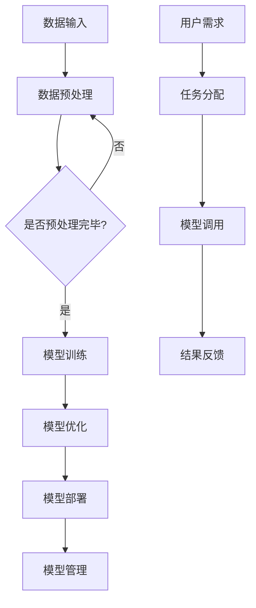

                 

# 构建下一代AI平台：LLM操作系统的愿景

## 关键词：下一代AI平台、LLM操作系统、人工智能、机器学习、神经网络、深度学习、AI架构设计、算法优化

## 摘要

本文探讨了构建下一代AI平台的愿景，特别是LLM（大型语言模型）操作系统的概念。我们将深入探讨这一新型AI平台的背景、核心概念、算法原理、数学模型、实际应用场景以及未来发展。通过本文，读者将了解到LLM操作系统如何引领AI技术的发展，并面对的挑战和机遇。

## 1. 背景介绍

人工智能（AI）作为计算机科学的一个重要分支，已经走过了数十年的发展历程。从最初的规则基系统（Rule-Based Systems）到基于模型的系统（Model-Based Systems），再到当前的深度学习（Deep Learning）和神经网络（Neural Networks），AI技术不断进步，应用领域也越来越广泛。随着数据量的爆发式增长和计算能力的提升，AI在图像识别、自然语言处理、语音识别、推荐系统等多个领域取得了显著的成果。

然而，现有的AI平台在处理大规模语言模型（如GPT系列、LLaMA等）时，仍然面临诸多挑战。例如，模型训练时间长、资源消耗大、可解释性差等问题。因此，构建下一代AI平台，特别是专门为大型语言模型设计的操作系统（LLM操作系统），成为当前研究的热点。

## 2. 核心概念与联系

### 2.1. 大型语言模型（Large Language Model，LLM）

大型语言模型（LLM）是一种基于深度学习技术的自然语言处理（NLP）模型，具有数十亿甚至千亿级别的参数量。LLM通过对海量文本数据进行训练，可以学习到语言的内在规律，并在文本生成、问答系统、机器翻译等多个任务中表现出色。

### 2.2. 语言模型操作系统（Language Model Operating System，LLM OS）

语言模型操作系统是一种专门为大型语言模型设计的软件平台，它集成了模型训练、优化、部署和管理等功能。LLM OS的目标是提供高效、灵活、可扩展的AI基础设施，以支持各种语言处理任务的开发和部署。

### 2.3. 核心概念原理和架构

下面是一个简单的Mermaid流程图，展示了LLM操作系统的核心概念和架构：



### 2.4. 大型语言模型操作系统与传统AI平台的比较

与传统AI平台相比，LLM操作系统具有以下优势：

- **高效性**：LLM操作系统通过优化模型训练、加载、推理等环节，大幅提高了AI任务的执行效率。
- **灵活性**：LLM操作系统支持多种语言模型和任务类型，能够灵活应对不同的应用场景。
- **可扩展性**：LLM操作系统采用模块化设计，易于扩展和升级，以适应未来的技术发展。
- **可解释性**：LLM操作系统提供了一种新的方法来分析和解释大型语言模型的决策过程，提高了模型的可解释性和透明度。

## 3. 核心算法原理 & 具体操作步骤

### 3.1. 大型语言模型训练原理

大型语言模型训练的核心是使用大量的文本数据来优化模型的参数。具体步骤如下：

1. **数据收集与预处理**：收集大量的文本数据，并进行分词、去噪、去重等预处理操作。
2. **构建词汇表**：将预处理后的文本数据转换为词汇表，用于表示文本中的单词和符号。
3. **输入编码**：将词汇表中的单词和符号编码为向量表示，用于输入到模型中。
4. **模型训练**：使用反向传播算法和优化器（如Adam）来优化模型参数。
5. **评估与调整**：在验证集上评估模型性能，并根据评估结果调整模型参数。

### 3.2. 大型语言模型优化原理

大型语言模型优化主要包括以下几个方面：

1. **模型剪枝**：通过剪枝方法减少模型参数数量，降低模型复杂度，从而提高模型效率。
2. **量化**：将模型中的浮点数参数转换为低比特位表示，减少模型大小和计算资源消耗。
3. **蒸馏**：使用一个大型模型（Teacher）训练一个较小的模型（Student），从而保留Teacher模型的知识和性能。

### 3.3. 大型语言模型部署原理

大型语言模型部署主要包括以下几个方面：

1. **模型加载**：将训练好的模型加载到目标设备上，包括CPU、GPU和TPU等。
2. **推理优化**：通过矩阵运算优化、并行计算等技术来提高模型推理速度和效率。
3. **服务部署**：将模型部署到服务器或云平台上，提供API接口供其他应用程序调用。

## 4. 数学模型和公式 & 详细讲解 & 举例说明

### 4.1. 深度学习中的反向传播算法

反向传播算法是深度学习中优化模型参数的一种常用方法。其基本原理如下：

$$
\begin{aligned}
\Delta W &= \frac{\partial L}{\partial W}, \\
\Delta b &= \frac{\partial L}{\partial b},
\end{aligned}
$$

其中，$L$ 表示损失函数，$W$ 和 $b$ 分别表示模型参数。

### 4.2. 语言模型中的词嵌入

词嵌入（Word Embedding）是将单词转换为向量的技术。一个简单的词嵌入公式如下：

$$
\mathbf{v}_w = \text{softmax}(\mathbf{W} \mathbf{u}_w),
$$

其中，$\mathbf{v}_w$ 表示单词 $w$ 的词向量，$\mathbf{u}_w$ 表示单词 $w$ 的编码向量，$\mathbf{W}$ 是词向量矩阵。

### 4.3. 举例说明

假设我们有一个二元分类问题，目标是用一个深度神经网络来判断一个句子是否表示否定。以下是这个问题的具体实现步骤：

1. **数据预处理**：收集带有否定标记的句子数据，进行分词、去噪等预处理操作。
2. **构建词汇表**：根据数据构建词汇表，并将句子转换为词汇表中的单词编码。
3. **输入编码**：将词汇表中的单词编码为向量表示。
4. **模型训练**：使用反向传播算法和优化器来优化模型参数。
5. **评估与调整**：在验证集上评估模型性能，并根据评估结果调整模型参数。

通过以上步骤，我们可以训练出一个能够判断句子是否表示否定的深度神经网络。

## 5. 项目实战：代码实际案例和详细解释说明

### 5.1. 开发环境搭建

为了实现大型语言模型操作系统，我们需要搭建一个高效的开发环境。以下是一个简单的环境搭建步骤：

1. **安装操作系统**：选择一个合适的操作系统，如Ubuntu 20.04。
2. **安装Python环境**：安装Python 3.8及以上版本。
3. **安装深度学习框架**：安装TensorFlow 2.5及以上版本。
4. **安装其他依赖库**：安装NVIDIA CUDA 11.0及以上版本，用于GPU加速。

### 5.2. 源代码详细实现和代码解读

以下是实现大型语言模型操作系统的一个简单示例代码：

```python
import tensorflow as tf
from tensorflow.keras.layers import Embedding, LSTM, Dense

# 构建模型
model = tf.keras.Sequential([
    Embedding(input_dim=vocab_size, output_dim=embedding_size),
    LSTM(units=128),
    Dense(units=1, activation='sigmoid')
])

# 编译模型
model.compile(optimizer='adam', loss='binary_crossentropy', metrics=['accuracy'])

# 训练模型
model.fit(train_data, train_labels, epochs=10, batch_size=32, validation_split=0.2)
```

### 5.3. 代码解读与分析

1. **模型构建**：首先，我们使用Keras构建一个简单的序列模型，包括一个嵌入层（Embedding Layer）、一个LSTM层（LSTM Layer）和一个全连接层（Dense Layer）。
2. **编译模型**：然后，我们使用`compile`方法来编译模型，指定优化器、损失函数和评估指标。
3. **训练模型**：最后，我们使用`fit`方法来训练模型，在训练集上训练10个周期，每次批量处理32个样本。

通过以上步骤，我们可以实现一个简单的深度学习模型，用于二元分类任务。

## 6. 实际应用场景

LLM操作系统在多个实际应用场景中具有广泛的应用前景，包括但不限于以下领域：

- **自然语言处理（NLP）**：如文本分类、情感分析、机器翻译等。
- **推荐系统**：如个性化推荐、商品推荐等。
- **智能客服**：如自动问答、智能客服机器人等。
- **语音识别**：如语音转文字、语音助手等。
- **图像识别**：如物体检测、图像分类等。

## 7. 工具和资源推荐

### 7.1. 学习资源推荐

- **书籍**：《深度学习》（Goodfellow, Bengio, Courville）、《神经网络与深度学习》（邱锡鹏）。
- **论文**：《A Theoretical Framework for Hierarchical DRM》（Hinton et al.）、《Attention Is All You Need》（Vaswani et al.）。
- **博客**：[TensorFlow 官方博客](https://www.tensorflow.org/blog/)、[Keras 官方文档](https://keras.io/)。
- **网站**：[GitHub](https://github.com/)、[ArXiv](https://arxiv.org/)。

### 7.2. 开发工具框架推荐

- **深度学习框架**：TensorFlow、PyTorch、Keras。
- **模型训练工具**：Hugging Face Transformers、TensorFlow Model Optimization Toolkit。
- **模型部署工具**：TensorFlow Serving、TensorFlow Lite。

### 7.3. 相关论文著作推荐

- **论文**：《Deep Learning for Natural Language Processing》（D-li

