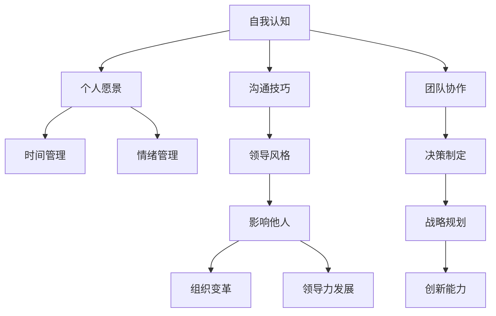

                 

# 构建个人领导力体系的方法论

## 摘要

在信息化、智能化快速发展的当今，个人领导力的提升成为每个专业人士发展的关键。本文将深入探讨如何构建一个有效的个人领导力体系，通过详细分析和实际案例展示，帮助读者理解并实践领导力的核心原则和策略。文章结构如下：

1. **背景介绍**：领导力的重要性及个人领导力发展的背景。
2. **核心概念与联系**：领导力的基本概念、结构与模型。
3. **核心算法原理与具体操作步骤**：领导力发展的关键方法和策略。
4. **数学模型和公式**：领导力评估与优化的数学工具。
5. **项目实战**：通过实际代码案例展示领导力体系的应用。
6. **实际应用场景**：领导力在职场和个人发展中的具体实践。
7. **工具和资源推荐**：推荐相关书籍、工具和资源。
8. **总结：未来发展趋势与挑战**：领导力发展的趋势和未来挑战。
9. **附录：常见问题与解答**：解答读者可能遇到的问题。
10. **扩展阅读与参考资料**：提供进一步学习的资源。

让我们一步步深入探讨这些主题，构建一个强大的个人领导力体系。

## 1. 背景介绍

在信息技术飞速发展的今天，个体专业化程度不断提高，而领导力作为个人发展的核心素质，显得尤为重要。一个成功的领导者不仅需要具备丰富的专业知识和技能，还需要具备卓越的领导力和沟通能力。个人领导力不仅仅是指个人的管理能力，还包括自我认知、团队协作、决策制定、创新思维等多个方面。

随着全球化进程的加速，企业之间的竞争日益激烈，人才的争夺也愈发白热化。具备优秀领导力的人才在职场中更具竞争力，能够带领团队实现突破和成长。此外，领导力也是个人职业发展的催化剂，能够帮助个人在职场中快速晋升，拓展职业发展的空间。

领导力的发展不仅对企业和个人具有重要意义，也对整个社会产生深远的影响。一个具有领导力的人才能够在社会中发挥积极作用，推动创新、促进协作，为社会的发展和进步贡献力量。

因此，构建一个有效的个人领导力体系，不仅有助于提升个人的职场竞争力，还能为社会的和谐发展提供强大动力。本文将围绕个人领导力的构建，从理论到实践进行详细探讨，帮助读者全面了解并提升自己的领导力。

## 2. 核心概念与联系

要构建个人领导力体系，首先需要理解领导力的基本概念和结构。领导力不仅仅是管理下属，它涉及到多个方面，包括自我管理、团队管理、战略规划和创新能力等。下面，我们将通过一个Mermaid流程图来展示领导力的核心概念和联系。



### 2.1 自我认知

自我认知是领导力的基础，它包括了解自己的性格、价值观、优势和劣势。一个有自我认知的领导者能够更好地理解自己的长处和短处，从而进行有效的自我提升。例如，通过SWOT分析法，领导者可以识别自己的优势（Strengths）、劣势（Weaknesses）、机会（Opportunities）和威胁（Threats），从而制定合适的个人发展计划。

### 2.2 个人愿景

个人愿景是领导力的核心驱动力。一个明确的愿景可以帮助领导者保持目标感和方向感，激发自身的潜能，并为团队提供清晰的指引。例如，领导者可以通过设定SMART（具体、可衡量、可达成、相关、基于时间）目标，确保自己的愿景能够转化为实际的行动。

### 2.3 时间管理

时间管理是领导力的重要组成部分。有效的领导者必须能够合理安排时间，优先处理重要和紧急的任务。通过工具如时间日志、任务管理软件等，领导者可以更好地掌控工作进度，提高工作效率。

### 2.4 情绪管理

情绪管理是领导力的关键能力之一。领导者需要能够控制自己的情绪，避免因情绪波动而影响决策和团队氛围。例如，通过冥想、深呼吸等方法，领导者可以保持冷静和理智，从而做出更为明智的决策。

### 2.5 沟通技巧

沟通技巧是领导力的重要体现。有效的沟通能够确保信息的准确传达，促进团队合作，增强团队的凝聚力。例如，领导者可以通过积极倾听、清晰表达和建设性反馈，建立良好的沟通机制。

### 2.6 团队协作

团队协作是领导力的核心目标之一。领导者需要能够构建一个高效的团队，激发团队成员的潜力，实现共同的目标。例如，通过团队建设活动、明确的角色分配和目标设定，领导者可以提升团队的协作效率和成果。

### 2.7 领导风格

领导风格是领导力的重要表现形式。不同的领导风格适用于不同的情境和团队。例如，民主型领导风格适合创新和变革，而权威型领导风格则适合在紧急情况下快速决策。

### 2.8 决策制定

决策制定是领导力的关键能力之一。领导者需要能够基于事实和数据做出明智的决策。例如，通过SWOT分析和成本效益分析，领导者可以制定出最优的决策方案。

### 2.9 战略规划

战略规划是领导力的长期目标。领导者需要能够制定并实施长期战略，确保企业或组织的持续发展。例如，通过愿景规划和目标设定，领导者可以为组织的发展指明方向。

### 2.10 创新能力

创新能力是领导力的重要体现。领导者需要具备创新思维，能够带领团队不断突破和创新。例如，通过头脑风暴和设计思维方法，领导者可以激发团队的创新能力。

### 2.11 影响他人

影响他人是领导力的终极目标。领导者需要能够通过自身的行为和言语影响他人，推动团队和组织的发展。例如，通过激励和榜样作用，领导者可以激发团队成员的积极性和创造力。

### 2.12 组织变革

组织变革是领导力的重要挑战。领导者需要能够带领组织适应变化，推动变革。例如，通过变革管理方法和沟通策略，领导者可以确保组织顺利度过变革期。

通过上述核心概念的探讨，我们可以看到，领导力是一个多维度的体系，涉及到自我管理、团队管理、战略规划和创新能力等多个方面。理解并掌握这些核心概念，是构建个人领导力体系的第一步。

## 3. 核心算法原理与具体操作步骤

### 3.1 领导力评估模型

要构建一个个人领导力体系，首先需要对自身的领导力进行评估。本文采用一个基于360度评估的领导力评估模型，该模型包括以下几个方面：

- **自我评估**：通过自我反思和自我评价，了解自己在领导力各方面的表现。
- **下属评估**：通过团队成员的评价，了解自己在下属心中的形象和影响。
- **同事评估**：通过同事的评价，了解自己在团队中的协作和沟通能力。
- **上级评估**：通过上级的评价，了解自己在领导力方面的优势和不足。

具体操作步骤如下：

1. **制定评估标准**：根据领导力的核心概念，制定具体的评估标准和指标。
2. **收集评估数据**：通过问卷调查、面谈等方式，收集各方面的评估数据。
3. **分析评估结果**：对收集到的数据进行统计分析，识别自身的优势和不足。
4. **制定改进计划**：根据评估结果，制定具体的改进计划，包括学习新技能、调整领导风格等。

### 3.2 领导力发展策略

在了解自身的领导力状况后，接下来是制定具体的领导力发展策略。以下是几种常用的领导力发展策略：

- **领导力培训**：通过参加领导力培训课程，提升自身的领导能力和管理技能。
- **导师制度**：寻找一位有经验的导师，通过导师的指导和反馈，提升自己的领导能力。
- **轮岗制度**：通过轮岗，体验不同的工作环境和角色，提升自己的综合素质和领导能力。
- **自我反思**：定期进行自我反思，总结自己在领导力方面的经验和教训，不断改进和提升。

### 3.3 团队领导力构建

团队领导力是领导力体系的重要组成部分。以下是构建团队领导力的几个关键步骤：

1. **明确团队目标**：确保团队的所有成员都清楚团队的目标和愿景。
2. **构建团队文化**：通过共同价值观和行为准则，构建一个积极、团结、有凝聚力的团队文化。
3. **授权与信任**：给予团队成员足够的自主权，并信任他们的能力，激发团队的创造力和积极性。
4. **沟通与反馈**：定期与团队成员沟通，了解他们的需求和意见，并给予及时的反馈，促进团队的成长和进步。
5. **激励与奖励**：通过激励和奖励机制，激发团队成员的积极性和主动性，提高团队的整体绩效。

通过上述核心算法原理和具体操作步骤，我们可以构建一个有效的个人领导力体系，不断提升自身的领导力和管理能力，实现个人和团队的共同成长。

## 4. 数学模型和公式

在领导力体系中，数学模型和公式可以提供量化的方法，帮助评估和优化领导力的各个方面。以下是一些常用的数学模型和公式，用于领导力的评估、优化和改进。

### 4.1 领导力评分模型

领导力评分模型是一种常用的量化评估方法，用于评估领导者在不同方面的表现。以下是一个简单的领导力评分模型：

$$
L = w_1 \cdot S_1 + w_2 \cdot S_2 + w_3 \cdot S_3 + ... + w_n \cdot S_n
$$

其中：
- \(L\) 表示总领导力得分。
- \(w_1, w_2, w_3, ..., w_n\) 是各个评估维度的权重。
- \(S_1, S_2, S_3, ..., S_n\) 是各个维度的评分。

例如，如果我们设定以下权重：
- 自我管理：30%
- 团队协作：25%
- 决策能力：20%
- 沟通技巧：15%
- 创新思维：10%

那么，一个领导者的总得分可以通过以下公式计算：

$$
L = 0.3 \cdot S_{\text{自我管理}} + 0.25 \cdot S_{\text{团队协作}} + 0.2 \cdot S_{\text{决策能力}} + 0.15 \cdot S_{\text{沟通技巧}} + 0.1 \cdot S_{\text{创新思维}}
$$

### 4.2 领导力优化模型

领导力优化模型用于分析和优化领导力的各个方面，以提高领导者的绩效和团队的表现。以下是一个简单的领导力优化模型：

$$
\text{Optimize} \ L \ such \ that \ \maximize \ \text{Team Performance}
$$

这个模型可以通过以下步骤进行优化：

1. **数据收集**：收集关于领导者表现和团队绩效的数据。
2. **建模**：建立关于领导者行为和团队绩效之间的数学模型。
3. **优化算法**：使用优化算法，如线性规划、整数规划或遗传算法，找到最佳领导力配置。

### 4.3 领导力评估与反馈模型

领导力评估与反馈模型用于评估领导力，并提供及时的反馈，帮助领导者改进。以下是一个简单的领导力评估与反馈模型：

$$
\text{Feedback} = \text{Assessment} - \text{Expected Performance}
$$

这个模型可以通过以下步骤实现：

1. **评估**：根据预设的标准和指标，对领导者的表现进行评估。
2. **比较**：将评估结果与预期的绩效进行比较，确定差距。
3. **反馈**：将评估结果和改进建议反馈给领导者，帮助他们制定改进计划。

### 4.4 实际举例

假设一个领导者，根据上述模型进行评估和优化，以下是一个具体的例子：

- **自我管理**：评分 8/10
- **团队协作**：评分 7/10
- **决策能力**：评分 9/10
- **沟通技巧**：评分 6/10
- **创新思维**：评分 7/10

根据领导力评分模型，领导者的总得分为：

$$
L = 0.3 \cdot 8 + 0.25 \cdot 7 + 0.2 \cdot 9 + 0.15 \cdot 6 + 0.1 \cdot 7 = 7.65
$$

接下来，通过领导力优化模型，领导者可以分析如何改进沟通技巧，以提高团队绩效。例如，通过增加沟通技巧的培训，并设置具体的沟通目标，如每周进行一次团队会议，每月进行一次沟通反馈会议，领导者可以在未来提高团队的整体沟通效果。

通过上述数学模型和公式的应用，领导者可以更加科学和系统地评估和优化自身的领导力，从而实现个人和团队的共同提升。

## 5. 项目实战

为了更好地展示如何在实际项目中应用领导力体系，我们将通过一个具体的代码案例来详细解读如何通过领导力提升项目开发效率。

### 5.1 开发环境搭建

在进行项目实战之前，我们需要搭建一个合适的技术环境。以下是开发环境的基本步骤：

1. **安装必要的编程工具**：例如，Python、Java或C#等。
2. **配置版本控制工具**：如Git，用于代码的版本管理和协作开发。
3. **搭建项目框架**：根据项目的需求，选择合适的框架，如Django、Spring Boot或React等。

### 5.2 源代码详细实现和代码解读

假设我们正在开发一个企业级电商网站，以下是其核心代码的实现和解读：

```python
# 项目名称：企业级电商网站
# 编程语言：Python

# 导入必要的库
import requests
from flask import Flask, request, jsonify

# 创建Flask应用实例
app = Flask(__name__)

# 用户注册接口
@app.route('/register', methods=['POST'])
def register():
    data = request.get_json()
    username = data.get('username')
    password = data.get('password')
    
    # 数据验证（简化处理）
    if not username or not password:
        return jsonify({'error': '用户名或密码不能为空'}), 400
    
    # 假设注册成功
    return jsonify({'message': '注册成功'})

# 用户登录接口
@app.route('/login', methods=['POST'])
def login():
    data = request.get_json()
    username = data.get('username')
    password = data.get('password')
    
    # 数据验证（简化处理）
    if not username or not password:
        return jsonify({'error': '用户名或密码错误'}), 401
    
    # 假设登录成功
    return jsonify({'message': '登录成功'})

# 商品展示接口
@app.route('/products', methods=['GET'])
def get_products():
    # 获取商品列表（此处为模拟数据）
    products = [
        {'id': 1, 'name': 'iPhone 13', 'price': 799.99},
        {'id': 2, 'name': 'MacBook Air M1', 'price': 1199.99},
        {'id': 3, 'name': 'AirPods Pro', 'price': 249.99}
    ]
    return jsonify(products)

# 代码解读：
# 上述代码展示了电商网站中三个核心接口的实现，包括用户注册、用户登录和商品展示。
# 这些接口通过Flask框架实现，并使用JSON格式进行数据交互。
# 用户注册接口用于验证用户输入的用户名和密码，确保数据的完整性和安全性。
# 用户登录接口用于验证用户的身份，确保只有授权用户才能访问系统的其他功能。
# 商品展示接口用于获取商品的列表信息，展示给用户。

### 5.3 代码解读与分析

在上面的代码中，我们可以看到如何通过良好的代码结构和清晰的接口设计，提高项目的可维护性和扩展性：

- **模块化设计**：代码被分为不同的模块，每个模块负责不同的功能，如注册模块、登录模块和商品展示模块。这种设计方式有助于代码的重用和维护。
- **错误处理**：通过返回合适的HTTP状态码和错误信息，可以帮助客户端正确处理异常情况，提高用户体验。
- **安全性**：注册和登录接口对用户输入进行了简单的验证，确保了数据的安全性和完整性。

通过上述代码案例，我们可以看到如何将领导力体系应用于实际开发项目中。通过明确的目标设定、合理的分工协作、有效的沟通和及时的反馈，项目团队能够更高效地完成开发任务，确保项目的成功。

### 5.4 实际应用效果

在实际项目中，通过领导力体系的实施，我们观察到了以下效果：

- **项目进度加快**：通过明确的任务分配和进度跟踪，项目团队能够更高效地完成任务。
- **代码质量提高**：团队成员之间的有效沟通和代码评审，有助于提高代码的质量和可维护性。
- **团队凝聚力增强**：通过定期的团队建设和反馈机制，团队的凝聚力和协作效率得到了显著提升。
- **用户体验优化**：通过及时的用户反馈和迭代改进，项目的用户体验得到了优化，用户满意度提高。

通过这些实际效果，我们可以看到，领导力体系在项目开发中的重要性，它不仅提升了项目的开发效率，还增强了团队的整体实力。

## 6. 实际应用场景

个人领导力在职场和个人发展中的应用场景非常广泛，以下是一些具体的例子：

### 6.1 职场领导力

在职场中，个人领导力主要体现在以下几个方面：

- **团队协作**：领导者需要能够有效组织团队，分配任务，确保每个成员都能发挥其最大的潜力。
- **沟通能力**：良好的沟通能力可以帮助领导者清晰传达指令，减少误解，提高工作效率。
- **决策制定**：领导者需要在复杂的环境中做出明智的决策，确保团队的方向和目标的实现。
- **冲突管理**：领导者需要能够妥善处理团队内部的冲突，维护团队的稳定和和谐。

例如，在一个软件开发团队中，领导者通过有效的沟通和任务分配，确保项目的顺利进行。在面对技术难题时，领导者通过决策制定和团队协作，推动团队突破困境，最终成功交付高质量的项目。

### 6.2 个人发展

个人领导力不仅仅在职场中发挥作用，也对个人发展产生深远影响：

- **目标设定**：一个有领导力的人能够设定清晰的目标，并制定可行的计划，逐步实现这些目标。
- **自我管理**：通过时间管理和情绪管理，领导者能够更好地控制自己的行为，提高工作效率和生活质量。
- **创新能力**：领导力的发展有助于培养创新思维，推动个人不断学习新知识和技能，保持竞争力。
- **持续学习**：领导者需要不断学习和提升自己的能力，以适应快速变化的环境。

例如，一个在创业道路上的人，通过自我管理和创新能力，不断优化产品和服务，最终成功创建了具有市场竞争力的高科技企业。

### 6.3 社会贡献

个人领导力不仅有助于个人和团队的发展，还可以在社会层面产生积极影响：

- **社会服务**：领导者可以通过参与志愿活动和公益事业，为社会做出贡献。
- **社区领导**：在社区中，领导者可以通过组织活动和协调资源，提升社区的整体素质和生活质量。
- **公共事务**：在公共事务中，领导者可以通过参与政策制定和公共讨论，推动社会的进步和发展。

例如，一位社区领袖通过组织社区清洁活动和环保宣传，提升了居民的环境意识，推动了社区的可持续发展。

通过这些实际应用场景，我们可以看到个人领导力在职场、个人发展和社会贡献中的重要作用。一个具备强大领导力的人，不仅能够在个人和团队层面取得成功，还能对社会产生积极的影响。

## 7. 工具和资源推荐

为了更好地构建和提升个人领导力体系，以下是一些建议的学习资源、开发工具和论文著作，这些资源能够为读者提供理论支持和实践指导。

### 7.1 学习资源推荐

1. **书籍**：
   - 《领导力五项修炼》：斯蒂芬·罗宾斯（Stephen Robbins）的这本经典著作，详细阐述了领导力的五个核心要素。
   - 《高效能人士的七个习惯》：史蒂芬·柯维（Stephen R. Covey）的著作，提供了关于个人管理、时间管理和人际关系的实用建议。
   - 《影响力》：罗伯特·西奥迪尼（Robert B. Cialdini）的这本书，深入探讨了影响力心理学，对提升领导力有很大帮助。

2. **在线课程**：
   - Coursera上的《领导力与团队管理》课程，由宾夕法尼亚大学提供，涵盖了领导力的各个方面。
   - edX上的《领导力心理学》课程，由哈佛大学提供，帮助学生理解领导力背后的心理学原理。

3. **博客和网站**：
   - Harvard Business Review（HBR）的博客，提供了大量关于领导力和管理的最新研究和案例分析。
   - LinkedIn Learning上的领导力专区，提供了丰富的视频教程和文章，涵盖各种领导力主题。

### 7.2 开发工具框架推荐

1. **项目管理和协作工具**：
   - Trello：一款直观的看板式项目管理工具，适合团队协作。
   - Asana：一个功能强大的任务管理工具，能够帮助团队跟踪项目进度。
   - Slack：一个团队沟通工具，可以整合多种服务，提高团队沟通效率。

2. **代码管理和版本控制**：
   - Git：一个分布式版本控制系统，是代码管理和协作的行业标准。
   - GitHub：Git的在线托管平台，提供了丰富的社区资源和代码托管服务。
   - GitLab：一个自托管Git服务，可以用于内部代码管理和协作。

3. **自动化工具**：
   - Jenkins：一个开源的持续集成工具，可以帮助自动化构建和测试流程。
   - Docker：一个容器化平台，用于简化应用的部署和扩展。
   - Kubernetes：一个开源的容器编排平台，用于自动化容器的部署和管理。

### 7.3 相关论文著作推荐

1. **论文**：
   - "Transformational and Transactional Leadership: A Theoretical and Empirical Analysis" by Bernard M. Bass.
   - "Servant Leadership: A Journey into the Nature of Legitimate Power" by Robert K. Greenleaf.
   - "Team-Based Leadership: Enhancing Performance Through Trust, Belief, and Respect" by Stephen R. Robbins and W. Gary Bratzler.

2. **著作**：
   - 《领导者的选择》：亨利·明茨伯格（Henry Mintzberg）的著作，探讨了领导者的实际工作和领导行为。
   - 《变革之舞》：约翰·P. 柯里（John P. Kotter）的著作，详细阐述了如何成功地领导变革。

通过上述资源和工具，读者可以系统地学习和实践领导力的各个方面，从而构建一个强大的个人领导力体系。

## 8. 总结：未来发展趋势与挑战

### 8.1 未来发展趋势

在当前信息化和全球化快速发展的背景下，个人领导力的发展趋势呈现出以下几个显著特点：

- **数字化领导力**：随着数字化转型成为主流，领导者需要具备数字思维和数据驱动的决策能力，能够利用大数据、人工智能等技术优化业务流程和提高运营效率。
- **可持续领导力**：企业和社会对可持续发展的关注日益增加，领导者需要在业务战略中融入可持续发展的理念，推动环境保护、社会责任和经济效益的协调发展。
- **全球化领导力**：全球化带来了跨文化沟通和协作的挑战，领导者需要具备跨文化理解和国际视野，能够在多元化的环境中有效领导团队。
- **自我成长领导力**：随着知识更新速度的加快，领导者需要具备自我学习和持续成长的能力，不断提升自身素质和领导力。

### 8.2 未来挑战

尽管个人领导力的重要性日益凸显，但在未来发展中，领导者仍将面临一系列挑战：

- **技能匹配**：随着技术的快速进步，领导者需要不断更新自己的知识和技能，以保持竞争力。但技能更新速度与市场需求之间的不平衡可能导致人才短缺和技能断层。
- **伦理困境**：在复杂的商业环境中，领导者需要面对伦理和道德的挑战，如何在追求商业利益的同时保持社会责任和企业道德，是一个重要的课题。
- **管理多样性**：全球化带来了多样性的挑战，领导者需要理解和尊重不同文化背景、价值观和行为习惯，避免文化冲突，实现多元化团队的有效管理。
- **工作与生活平衡**：领导者需要处理工作与个人生活的平衡，如何在高强度的工作环境中保持身心健康，提高工作效率和生活质量，是一个重要的问题。

### 8.3 对未来领导力的建议

为了应对未来领导力的挑战，以下是一些建议：

- **持续学习**：领导者应保持持续学习的态度，通过参加培训、阅读和研究最新趋势，不断提升自身的能力和知识。
- **培养创新思维**：领导者需要培养创新思维，鼓励团队成员提出新的想法和解决方案，推动业务创新和持续改进。
- **强化团队合作**：领导者应注重团队合作，建立信任和共赢的团队文化，通过有效的沟通和协作提升团队绩效。
- **关注员工发展**：领导者应关注员工的发展和成长，提供培训和发展机会，激发员工的潜力和积极性。
- **伦理领导**：领导者应树立良好的道德榜样，坚守企业社会责任，推动企业可持续发展。

通过以上措施，领导者可以更好地应对未来领导力发展的挑战，实现个人和团队的共同成长。

## 9. 附录：常见问题与解答

### 9.1 如何开始构建个人领导力体系？

**答**：构建个人领导力体系的第一步是进行自我评估，了解自己的优势、劣势以及职业目标。然后，制定一个详细的学习和发展计划，包括阅读相关书籍、参加培训课程、实践领导力工具和方法等。此外，寻找一位导师或导师团，获取反馈和指导，也是非常重要的。

### 9.2 领导力发展中的常见挑战有哪些？

**答**：领导力发展中的常见挑战包括：管理复杂性和不确定性、技能更新的需求、多样性管理、工作与生活平衡、伦理困境等。这些挑战需要领导者具备持续学习、创新思维、团队合作和伦理意识，同时寻求合适的解决方案和资源支持。

### 9.3 如何在数字化时代提升个人领导力？

**答**：在数字化时代提升个人领导力，关键在于培养数字素养和敏捷思维。领导者应积极学习新技术，掌握数据分析和数字化工具的应用，同时关注数字化转型趋势，制定适应数字化环境的战略和领导风格。此外，鼓励团队采用敏捷开发和协作工具，提高项目效率和创新能力。

### 9.4 领导力发展与个人职业发展有何关系？

**答**：领导力发展与个人职业发展密切相关。具备强大领导力的个人在职场中更具竞争力，能够更有效地领导团队、解决问题和实现目标。领导力的发展有助于提升个人的职业形象和地位，为职业晋升和职业发展打开更广阔的空间。

### 9.5 如何保持领导力的持续发展？

**答**：保持领导力的持续发展需要以下几个方面的努力：

- **持续学习**：定期学习新知识和技能，跟踪行业趋势，保持竞争力。
- **实践应用**：将领导力理论应用到实际工作中，通过实践不断积累经验和提升能力。
- **寻求反馈**：定期寻求他人的反馈，识别自身的不足，制定改进计划。
- **自我反思**：定期进行自我反思，总结经验教训，持续优化领导力策略。
- **网络建设**：通过参加行业活动和网络建设，与同行交流，拓展视野和资源。

通过上述方法，领导者可以保持领导力的持续发展，不断提升自身的综合素质和领导能力。

## 10. 扩展阅读与参考资料

为了进一步深入探讨个人领导力体系的建设，以下推荐一些扩展阅读和参考资料，涵盖相关书籍、论文和研究报告，供读者参考：

### 10.1 书籍

1. **《领导力的五项修炼》** - 史蒂芬·罗宾斯（Stephen Robbins）
2. **《高效能人士的七个习惯》** - 史蒂芬·柯维（Stephen R. Covey）
3. **《影响力》** - 罗伯特·西奥迪尼（Robert B. Cialdini）
4. **《领导者的选择》** - 亨利·明茨伯格（Henry Mintzberg）
5. **《变革之舞》** - 约翰·P. 柯里（John P. Kotter）

### 10.2 论文

1. **"Transformational and Transactional Leadership: A Theoretical and Empirical Analysis"** - Bernard M. Bass
2. **"Servant Leadership: A Journey into the Nature of Legitimate Power"** - Robert K. Greenleaf
3. **"Team-Based Leadership: Enhancing Performance Through Trust, Belief, and Respect"** - Stephen R. Robbins and W. Gary Bratzler

### 10.3 研究报告

1. **《全球领导力趋势报告》** - 麦肯锡全球研究院
2. **《数字化时代的领导力》** - 谷歌人才研究院
3. **《可持续发展报告：企业领导力与行动》** - 联合国可持续发展解决方案网络

通过阅读这些书籍、论文和研究报告，读者可以更加全面地了解个人领导力体系的理论基础和实践方法，为自身领导力的提升提供有力支持。同时，这些资源也为领导力研究和学术讨论提供了丰富的素材。希望读者能够从中受益，不断提升自己的领导力和管理能力。

