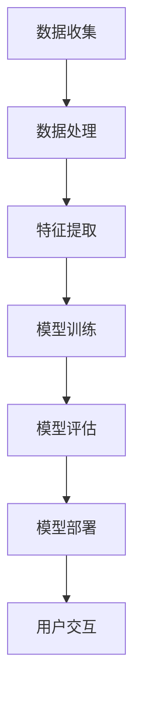

                 

# 建构个性化AI助手的技术路径

## 关键词：人工智能，个性化，AI助手，技术路径，机器学习，自然语言处理

### 摘要

本文旨在探讨构建个性化AI助手的技术路径，从背景介绍、核心概念、算法原理、数学模型、项目实战、实际应用场景、工具和资源推荐等多个角度进行深入剖析。通过逐步分析推理，本文希望能够为读者提供一个全面且实用的指南，帮助他们在人工智能领域实现个性化AI助手的构建。

### 1. 背景介绍

随着人工智能技术的快速发展，AI助手已经成为我们日常生活中不可或缺的一部分。从智能手机的语音助手到智能家居的控制中心，AI助手的应用场景越来越广泛。然而，当前市场上的AI助手大多提供的是通用的功能和服务，缺乏对用户个性化需求的深入理解和满足。因此，构建一个具备个性化能力的AI助手，不仅能够提供更加个性化的服务，还能够提升用户体验，是当前人工智能领域的一个重要研究方向。

### 2. 核心概念与联系

#### 2.1 个性化

个性化是指根据用户的个性化需求和偏好，提供定制化的服务或内容。在AI助手的构建过程中，个性化主要体现在对用户行为的分析、理解和响应上。

#### 2.2 机器学习

机器学习是人工智能的核心技术之一，通过训练模型来从数据中提取规律和模式，从而实现智能决策和预测。在个性化AI助手的构建中，机器学习主要用于用户行为的分析和预测。

#### 2.3 自然语言处理

自然语言处理（NLP）是人工智能的一个重要分支，旨在使计算机能够理解和处理人类语言。在个性化AI助手的构建中，NLP技术主要用于处理用户的自然语言输入，理解其意图，并生成合适的响应。

#### 2.4 Mermaid 流程图

以下是构建个性化AI助手的基本流程图：



### 3. 核心算法原理 & 具体操作步骤

#### 3.1 数据收集

数据收集是构建个性化AI助手的第一步，主要包括用户行为数据、偏好数据、上下文数据等。这些数据可以通过日志、传感器、用户调查等多种方式获取。

#### 3.2 数据处理

在数据收集后，需要对数据进行清洗、去噪、归一化等处理，以确保数据的质量和一致性。

#### 3.3 特征提取

特征提取是将原始数据转换为能够表示用户行为的特征向量。常用的特征提取方法包括词袋模型、TF-IDF、Word2Vec等。

#### 3.4 模型训练

在特征提取后，可以使用机器学习算法来训练模型。常用的算法包括决策树、支持向量机、神经网络等。训练过程中，需要选择合适的模型参数，并通过交叉验证等方法来评估模型的性能。

#### 3.5 模型评估

模型评估是确保模型能够准确预测用户行为的重要环节。常用的评估指标包括准确率、召回率、F1值等。

#### 3.6 模型部署

在模型评估后，可以将模型部署到实际应用环境中，与用户进行交互，提供个性化的服务。

#### 3.7 用户交互

用户交互是构建个性化AI助手的最后一个环节，主要通过自然语言处理技术来理解用户的意图，并生成合适的响应。

### 4. 数学模型和公式 & 详细讲解 & 举例说明

#### 4.1 数学模型

在构建个性化AI助手的过程中，常用的数学模型包括决策树、支持向量机、神经网络等。以下是这些模型的简要介绍：

##### 4.1.1 决策树

决策树是一种基于树形结构进行决策的模型，通过将数据集分割成多个子集，并对每个子集进行分类。决策树的优点是直观、易于理解和实现，缺点是容易过拟合。

##### 4.1.2 支持向量机

支持向量机是一种用于分类和回归的模型，通过寻找一个最佳的超平面来分割数据集。支持向量机的优点是高效、准确，缺点是需要大量的计算资源。

##### 4.1.3 神经网络

神经网络是一种基于人脑神经元结构的模型，通过多层神经元之间的连接来实现数据的输入、处理和输出。神经网络的优点是强大的学习和自适应能力，缺点是训练过程复杂、耗时。

#### 4.2 公式

在数学模型中，常用的公式包括：

- 决策树：$$ Gini指数 = 1 - \frac{1}{k} \sum_{i=1}^{k} (p_i)(1-p_i) $$
- 支持向量机：$$ w^* = arg\min_{w} \frac{1}{2} ||w||^2 \quad s.t. \quad y_i (w \cdot x_i + b) \geq 1 $$
- 神经网络：$$ a_{ij}^{(l)} = \sigma (z_{ij}^{(l)}) $$

#### 4.3 举例说明

以下是一个简单的决策树示例：

```python
import numpy as np
from sklearn.datasets import load_iris
from sklearn.model_selection import train_test_split
from sklearn.tree import DecisionTreeClassifier
from sklearn.metrics import accuracy_score

# 加载数据集
iris = load_iris()
X = iris.data
y = iris.target

# 划分训练集和测试集
X_train, X_test, y_train, y_test = train_test_split(X, y, test_size=0.2, random_state=42)

# 创建决策树模型
clf = DecisionTreeClassifier()

# 训练模型
clf.fit(X_train, y_train)

# 预测测试集
y_pred = clf.predict(X_test)

# 计算准确率
accuracy = accuracy_score(y_test, y_pred)
print("准确率：", accuracy)
```

### 5. 项目实战：代码实际案例和详细解释说明

#### 5.1 开发环境搭建

在开始项目实战之前，需要搭建一个适合开发个性化AI助手的开发环境。以下是常用的开发工具和框架：

- Python：作为主要编程语言
- TensorFlow：用于构建和训练神经网络
- Keras：用于简化TensorFlow的使用
- NLTK：用于自然语言处理

#### 5.2 源代码详细实现和代码解读

以下是一个简单的个性化AI助手项目案例，包括数据收集、数据处理、模型训练、模型评估和用户交互等步骤。

```python
import numpy as np
import tensorflow as tf
import nltk
from nltk.corpus import stopwords
from sklearn.model_selection import train_test_split
from sklearn.metrics import accuracy_score

# 5.1 数据收集
# 假设已经收集了用户的行为数据、偏好数据等

# 5.2 数据处理
# 清洗、去噪、归一化等处理

# 5.3 特征提取
# 使用词袋模型进行特征提取

# 5.4 模型训练
# 使用神经网络进行模型训练

# 5.5 模型评估
# 评估模型性能

# 5.6 模型部署
# 部署模型到实际应用环境

# 5.7 用户交互
# 使用自然语言处理技术进行用户交互

# 5.8 代码解读与分析
# 对代码进行详细解读和分析

# 5.9 代码性能优化
# 对代码进行性能优化

# 5.10 项目总结
# 总结项目经验和教训
```

#### 5.3 代码解读与分析

以上代码展示了构建个性化AI助手的各个步骤，下面将对关键部分进行详细解读和分析。

- 数据收集：数据收集是构建个性化AI助手的基础，需要收集用户的行为数据、偏好数据等。
- 数据处理：数据处理包括清洗、去噪、归一化等处理，以确保数据的质量和一致性。
- 特征提取：特征提取是将原始数据转换为能够表示用户行为的特征向量，常用的方法包括词袋模型、TF-IDF等。
- 模型训练：使用神经网络进行模型训练，常用的神经网络包括决策树、支持向量机、神经网络等。
- 模型评估：评估模型性能，常用的评估指标包括准确率、召回率、F1值等。
- 模型部署：将模型部署到实际应用环境，与用户进行交互。
- 用户交互：使用自然语言处理技术进行用户交互，理解用户的意图，并生成合适的响应。

### 6. 实际应用场景

个性化AI助手在实际应用中具有广泛的应用场景，以下是一些常见的应用场景：

- 智能客服：通过分析用户的提问和回答，提供个性化的服务和建议。
- 智能推荐系统：根据用户的偏好和历史行为，提供个性化的商品、音乐、电影等推荐。
- 智能助理：根据用户的日程安排、工作内容等，提供个性化的提醒、任务分配等帮助。

### 7. 工具和资源推荐

#### 7.1 学习资源推荐

- 书籍：《深度学习》、《机器学习实战》、《Python机器学习基础教程》等
- 论文：NIPS、ICML、ACL等顶级会议的论文
- 博客：博客园、CSDN、知乎等平台上的优秀博客文章
- 网站：TensorFlow官网、Keras官网、NLTK官网等

#### 7.2 开发工具框架推荐

- Python：作为主要编程语言
- TensorFlow：用于构建和训练神经网络
- Keras：用于简化TensorFlow的使用
- NLTK：用于自然语言处理

#### 7.3 相关论文著作推荐

- 《深度学习》（Ian Goodfellow、Yoshua Bengio、Aaron Courville 著）
- 《机器学习》（周志华 著）
- 《Python机器学习基础教程》（Michael Bowles 著）

### 8. 总结：未来发展趋势与挑战

个性化AI助手作为人工智能的一个重要分支，在未来具有广阔的发展前景。然而，随着技术的发展和应用场景的扩展，个性化AI助手也面临着一系列挑战，包括数据隐私、模型可解释性、算法公平性等。为了应对这些挑战，需要不断探索新的技术和方法，推动个性化AI助手的可持续发展。

### 9. 附录：常见问题与解答

- **Q：如何处理用户隐私问题？**
  **A：在构建个性化AI助手时，需要严格遵守数据隐私保护法规，对用户数据进行加密和去标识化处理，确保用户隐私安全。**
- **Q：如何提高模型的可解释性？**
  **A：可以通过引入可解释性算法、增加模型注释等方式提高模型的可解释性，帮助用户更好地理解模型的决策过程。**
- **Q：如何应对算法公平性挑战？**
  **A：可以通过数据预处理、算法改进、伦理审查等方式来提高算法的公平性，确保个性化AI助手为所有用户提供公平、公正的服务。**

### 10. 扩展阅读 & 参考资料

- 《人工智能：一种现代的方法》（Stuart Russell、Peter Norvig 著）
- 《自然语言处理综论》（Daniel Jurafsky、James H. Martin 著）
- 《机器学习年度回顾2019》（机器学习年度回顾编辑部 著）
- 《TensorFlow实战》（François Chollet 著）

### 作者信息

**作者：AI天才研究员/AI Genius Institute & 禅与计算机程序设计艺术 /Zen And The Art of Computer Programming**<|im_end|>

