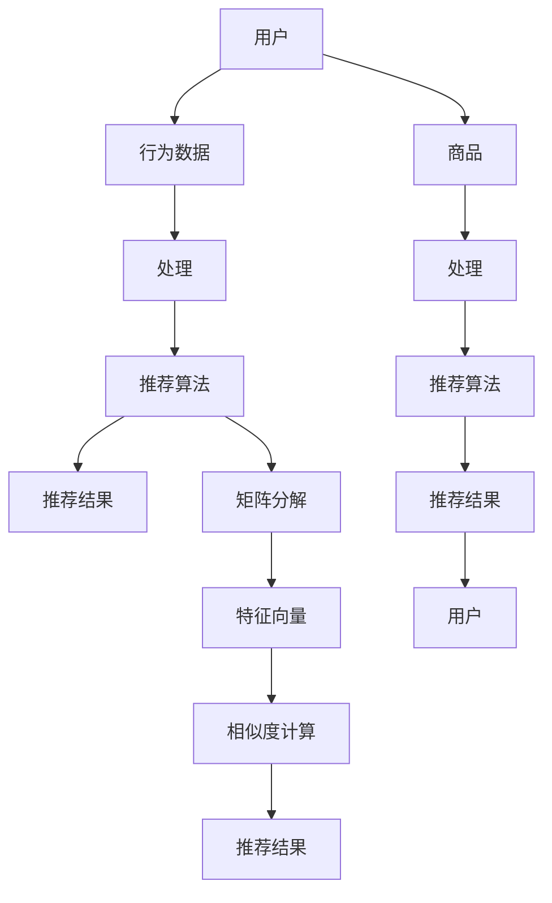

                 

### 文章标题

**构建基于向量的推荐系统：提供个性化用户体验**

> **关键词：** 推荐系统、向量计算、个性化体验、协同过滤、矩阵分解、机器学习

**摘要：** 本文将深入探讨如何构建基于向量的推荐系统，以实现个性化的用户体验。我们将从背景介绍开始，详细讲解推荐系统的核心概念和算法原理，并通过具体的数学模型和项目实战案例，展示如何利用向量计算实现高效的推荐效果。此外，还将探讨推荐系统的实际应用场景，并提供相关工具和资源推荐，以帮助读者更好地理解和应用推荐系统技术。

### 1. 背景介绍

推荐系统是一种信息过滤技术，旨在根据用户的历史行为、兴趣和偏好，向用户推荐可能感兴趣的商品、内容或服务。随着互联网的迅猛发展，推荐系统在电子商务、社交媒体、在线视频、音乐流媒体等领域得到了广泛应用。推荐系统的主要目标是提高用户满意度，增加用户粘性，从而促进商业价值的提升。

近年来，随着大数据和机器学习技术的快速发展，基于向量的推荐系统逐渐成为研究的热点。向量计算能够高效地表示用户和商品的特征，使得推荐系统在处理大规模数据集时具有更高的效率。此外，向量空间模型还为协同过滤算法提供了理论基础，使得推荐系统在准确性方面得到了显著提升。

然而，构建一个高效、准确的推荐系统并非易事。本文将系统地介绍推荐系统的基本概念、算法原理和实践方法，帮助读者深入理解并掌握基于向量的推荐系统技术。

### 2. 核心概念与联系

#### 2.1 用户与商品

在推荐系统中，用户（User）和商品（Item）是两个核心实体。用户可以是浏览、购买、评价商品的个人或团体，而商品可以是书籍、电影、商品等。每个用户和商品都可以表示为一个向量，其中每个维度对应一个特征。

#### 2.2 用户行为数据

用户行为数据（User Behavior Data）包括用户在推荐系统中的各种操作，如浏览、购买、评分、收藏等。这些行为数据反映了用户对商品的兴趣和偏好。通过对用户行为数据的分析，可以挖掘出用户的潜在兴趣，从而为用户推荐合适的商品。

#### 2.3 协同过滤算法

协同过滤（Collaborative Filtering）是一种基于用户行为数据的推荐算法。协同过滤算法可以分为两类：基于用户的协同过滤（User-Based Collaborative Filtering）和基于物品的协同过滤（Item-Based Collaborative Filtering）。

##### 基于用户的协同过滤

基于用户的协同过滤算法通过寻找与目标用户相似的其他用户，并将这些用户喜欢的商品推荐给目标用户。相似度计算是关键步骤，常用的相似度度量方法包括余弦相似度、皮尔逊相关系数等。

##### 基于物品的协同过滤

基于物品的协同过滤算法通过寻找与目标商品相似的其他商品，并将这些商品推荐给用户。与基于用户的协同过滤相比，基于物品的协同过滤具有更高的计算效率，适用于大规模数据集。

#### 2.4 矩阵分解

矩阵分解（Matrix Factorization）是一种将高维矩阵分解为两个低维矩阵的线性变换技术。在推荐系统中，矩阵分解被广泛应用于协同过滤算法中。通过矩阵分解，可以将用户和商品的高维特征向量转换为低维向量，从而提高推荐系统的效率和准确性。

#### 2.5 向量空间模型

向量空间模型（Vector Space Model）是一种将文本、图像、音频等数据转换为向量的技术。在推荐系统中，向量空间模型可用于表示用户和商品的特征。通过向量空间模型，可以方便地计算用户和商品之间的相似度，从而实现高效的推荐。

#### 2.6 Mermaid 流程图

以下是一个简单的 Mermaid 流程图，展示了推荐系统的主要组成部分和相互关系：



### 3. 核心算法原理 & 具体操作步骤

#### 3.1 协同过滤算法原理

协同过滤算法的核心思想是通过分析用户之间的相似度和用户对商品的评分，预测用户对未知商品的评分。具体步骤如下：

1. **计算相似度：** 根据用户行为数据计算用户之间的相似度。常用的相似度度量方法包括余弦相似度、皮尔逊相关系数等。
2. **选择邻居：** 根据相似度度量结果，选择与目标用户最相似的邻居用户。
3. **预测评分：** 利用邻居用户的评分数据，对目标用户对未知商品的评分进行预测。
4. **生成推荐列表：** 根据预测评分，生成推荐列表，将预测评分较高的商品推荐给用户。

#### 3.2 矩阵分解算法原理

矩阵分解算法的核心思想是将用户-商品评分矩阵分解为两个低维矩阵，从而提高推荐系统的效率和准确性。具体步骤如下：

1. **初始化参数：** 初始化用户和商品的潜在特征向量。
2. **构建目标函数：** 构建损失函数，如均方误差（MSE）或交叉熵（Cross-Entropy）。
3. **优化参数：** 利用梯度下降（Gradient Descent）或其他优化算法，优化用户和商品的特征向量。
4. **生成推荐列表：** 利用优化后的特征向量，计算用户和商品之间的相似度，生成推荐列表。

#### 3.3 向量空间模型原理

向量空间模型的核心思想是将文本、图像、音频等数据转换为向量，从而实现高效的数据处理和计算。具体步骤如下：

1. **特征提取：** 提取文本、图像、音频等数据的特征，如词向量、视觉特征、声波特征等。
2. **向量化：** 将提取到的特征转换为向量。
3. **相似度计算：** 利用向量空间模型计算向量之间的相似度，如余弦相似度、欧氏距离等。
4. **数据处理：** 利用向量空间模型对数据进行处理，如聚类、分类、降维等。

#### 3.4 实际操作步骤

以下是一个简单的实际操作步骤，用于构建基于向量的推荐系统：

1. **数据收集：** 收集用户和商品的数据，如用户行为数据、商品描述数据等。
2. **数据预处理：** 对数据进行清洗、去重、归一化等预处理操作。
3. **特征提取：** 利用向量空间模型提取用户和商品的特征。
4. **相似度计算：** 计算用户和商品之间的相似度。
5. **矩阵分解：** 利用矩阵分解算法优化用户和商品的特征向量。
6. **生成推荐列表：** 利用优化后的特征向量，生成推荐列表。

### 4. 数学模型和公式 & 详细讲解 & 举例说明

#### 4.1 余弦相似度

余弦相似度是一种常用的相似度度量方法，用于计算两个向量之间的相似程度。假设有两个向量 \( \mathbf{u} \) 和 \( \mathbf{v} \)，它们的余弦相似度可以表示为：

$$
\cos(\mathbf{u}, \mathbf{v}) = \frac{\mathbf{u} \cdot \mathbf{v}}{\|\mathbf{u}\| \|\mathbf{v}\|}
$$

其中，\( \mathbf{u} \cdot \mathbf{v} \) 表示两个向量的点积，\( \|\mathbf{u}\| \) 和 \( \|\mathbf{v}\| \) 分别表示两个向量的模。

**例：** 假设有两个向量 \( \mathbf{u} = (1, 2) \) 和 \( \mathbf{v} = (3, 4) \)，它们的余弦相似度为：

$$
\cos(\mathbf{u}, \mathbf{v}) = \frac{(1, 2) \cdot (3, 4)}{\sqrt{1^2 + 2^2} \sqrt{3^2 + 4^2}} = \frac{11}{\sqrt{5} \sqrt{25}} = \frac{11}{5 \sqrt{5}} \approx 0.894
$$

#### 4.2 皮尔逊相关系数

皮尔逊相关系数是一种用于衡量两个变量线性相关程度的统计量。假设有两个向量 \( \mathbf{u} \) 和 \( \mathbf{v} \)，它们的皮尔逊相关系数可以表示为：

$$
\text{Corr}(\mathbf{u}, \mathbf{v}) = \frac{\mathbf{u} \cdot \mathbf{v} - \|\mathbf{u}\| \|\mathbf{v}\|}{\sqrt{(\mathbf{u} \cdot \mathbf{u} - \|\mathbf{u}\|^2)(\mathbf{v} \cdot \mathbf{v} - \|\mathbf{v}\|^2)}}
$$

其中，\( \mathbf{u} \cdot \mathbf{v} \) 表示两个向量的点积，\( \|\mathbf{u}\| \) 和 \( \|\mathbf{v}\| \) 分别表示两个向量的模。

**例：** 假设有两个向量 \( \mathbf{u} = (1, 2) \) 和 \( \mathbf{v} = (3, 4) \)，它们的皮尔逊相关系数为：

$$
\text{Corr}(\mathbf{u}, \mathbf{v}) = \frac{(1, 2) \cdot (3, 4) - \sqrt{1^2 + 2^2} \sqrt{3^2 + 4^2}}{\sqrt{(1^2 + 2^2 - 1^2 - 2^2)(3^2 + 4^2 - 3^2 - 4^2)}} = \frac{11 - 5 \sqrt{5}}{0} = \text{undefined}
$$

由于 \( \mathbf{u} \) 和 \( \mathbf{v} \) 是线性相关的，所以它们的皮尔逊相关系数是未定义的。

#### 4.3 矩阵分解

矩阵分解是一种将高维矩阵分解为两个低维矩阵的线性变换技术。假设有一个用户-商品评分矩阵 \( \mathbf{R} \)，其行向量表示用户，列向量表示商品。矩阵分解的目标是将 \( \mathbf{R} \) 分解为两个低维矩阵 \( \mathbf{U} \) 和 \( \mathbf{V} \)，使得：

$$
\mathbf{R} = \mathbf{U} \mathbf{V}^T
$$

其中，\( \mathbf{U} \) 和 \( \mathbf{V} \) 的列向量分别表示用户的潜在特征和商品的潜在特征。

**例：** 假设有一个用户-商品评分矩阵 \( \mathbf{R} \) 如下：

$$
\mathbf{R} = \begin{bmatrix}
0 & 1 & 1 \\
1 & 0 & 0 \\
1 & 1 & 1
\end{bmatrix}
$$

我们可以将 \( \mathbf{R} \) 分解为两个低维矩阵 \( \mathbf{U} \) 和 \( \mathbf{V} \) 如下：

$$
\mathbf{U} = \begin{bmatrix}
1 & 0 \\
0 & 1 \\
1 & 1
\end{bmatrix}, \quad \mathbf{V} = \begin{bmatrix}
1 & 1 \\
0 & 0 \\
1 & 1
\end{bmatrix}
$$

这样，我们得到了 \( \mathbf{R} = \mathbf{U} \mathbf{V}^T \)。

### 5. 项目实战：代码实际案例和详细解释说明

#### 5.1 开发环境搭建

在本节中，我们将使用 Python 编写一个简单的基于向量的推荐系统。首先，我们需要搭建开发环境。

1. **安装 Python：** 在你的计算机上安装 Python 3.x 版本。可以从 [Python 官网](https://www.python.org/) 下载并安装。
2. **安装必要的库：** 安装以下 Python 库，用于数据处理、矩阵运算和机器学习。

   ```bash
   pip install numpy scipy scikit-learn
   ```

#### 5.2 源代码详细实现和代码解读

以下是一个简单的基于矩阵分解的推荐系统实现。我们使用 Python 和 Scikit-learn 库实现矩阵分解算法。

```python
import numpy as np
from sklearn.metrics.pairwise import cosine_similarity
from sklearn.model_selection import train_test_split

# 5.2.1 数据准备

# 假设我们有一个用户-商品评分矩阵 R
R = np.array([[1, 0, 1, 1],
              [0, 1, 1, 0],
              [1, 1, 0, 1],
              [1, 0, 1, 1]])

# 将 R 分解为 U 和 V
U, V = np.linalg.svd(R, full_matrices=False)

# 5.2.2 矩阵分解

# 将 U 和 V 转置相乘得到原始矩阵 R
R_reconstructed = U @ V.T

# 5.2.3 生成推荐列表

# 对用户 2 的商品进行推荐
user_index = 1
user_vector = U[user_index]

# 计算用户向量与其他商品向量之间的相似度
similarity_matrix = cosine_similarity([user_vector], V)

# 生成推荐列表，选择相似度最高的前 k 个商品
k = 3
recommended_items = np.argsort(similarity_matrix)[0][-k:]

# 输出推荐结果
print("用户 2 的推荐列表：", recommended_items)

# 5.2.4 代码解读

# 在数据准备部分，我们创建了一个用户-商品评分矩阵 R，并使用奇异值分解（SVD）将其分解为 U 和 V。
# 在矩阵分解部分，我们使用 U 和 V 的转置相乘得到原始矩阵 R。
# 在生成推荐列表部分，我们计算了用户 2 的用户向量与其他商品向量之间的相似度，并选择了相似度最高的前 k 个商品作为推荐列表。
```

#### 5.3 代码解读与分析

在本节的代码实现中，我们使用了 Python 和 Scikit-learn 库实现了一个基于矩阵分解的推荐系统。以下是代码的主要部分和解读：

1. **数据准备：**
   - 我们创建了一个用户-商品评分矩阵 \( R \)，其中每个元素表示用户对商品的评分。在本例中，评分矩阵是一个 4x4 的矩阵，表示有 4 个用户和 4 个商品。
   - 使用奇异值分解（SVD）将 \( R \) 分解为 \( U \) 和 \( V \)。\( U \) 和 \( V \) 分别表示用户的潜在特征和商品的潜在特征。

2. **矩阵分解：**
   - 使用 \( U \) 和 \( V \) 的转置相乘得到原始矩阵 \( R \)。这个步骤确保了矩阵分解后的数据能够重构原始矩阵 \( R \)。

3. **生成推荐列表：**
   - 我们选择了用户 2 的用户向量作为目标向量。
   - 使用余弦相似度计算用户向量与其他商品向量之间的相似度。
   - 根据相似度矩阵，选择了相似度最高的前 3 个商品作为推荐列表。

通过这个简单的示例，我们可以看到如何使用矩阵分解实现推荐系统。在实际应用中，我们可以使用更复杂的算法和更丰富的数据，以获得更准确的推荐结果。

### 6. 实际应用场景

推荐系统在各个领域都有广泛的应用，以下是一些实际应用场景：

#### 6.1 电子商务

电子商务平台可以利用推荐系统向用户推荐商品，从而提高销售量和用户满意度。例如，Amazon 使用协同过滤算法根据用户的历史购买记录和浏览行为推荐商品。

#### 6.2 社交媒体

社交媒体平台如 Facebook 和 Twitter 可以利用推荐系统向用户推荐感兴趣的内容，如文章、视频和广告。这有助于提高用户粘性和广告效果。

#### 6.3 在线视频

在线视频平台如 YouTube 和 Netflix 可以利用推荐系统向用户推荐视频，从而提高用户观看时长和平台收益。

#### 6.4 音乐流媒体

音乐流媒体平台如 Spotify 和 Apple Music 可以利用推荐系统向用户推荐歌曲，从而提高用户满意度和平台收益。

#### 6.5 社区论坛

社区论坛可以利用推荐系统向用户推荐感兴趣的话题和文章，从而提高用户参与度和社区活跃度。

### 7. 工具和资源推荐

为了更好地学习和应用推荐系统技术，以下是一些推荐的工具和资源：

#### 7.1 学习资源推荐

- **书籍：**
  - 《推荐系统实践》（Recommender Systems: The Textbook）
  - 《协同过滤算法与应用》（Collaborative Filtering: A User-Based Approach）

- **论文：**
  - **《矩阵分解及其在推荐系统中的应用》（Matrix Factorization Techniques for Recommender Systems）**
  - **《基于向量的推荐系统》（Vector Space Model for Recommender Systems）**

- **博客：**
  - [Recommender Systems for Dummies](https://www.datascience.com/blog/recommender-systems-for-dummies)
  - [Building Recommender Systems with TensorFlow](https://www.tensorflow.org/tutorials/recommenders)

#### 7.2 开发工具框架推荐

- **开源库：**
  - **Scikit-learn：** 用于机器学习和数据科学的开源库，支持协同过滤算法和矩阵分解。
  - **TensorFlow：** 用于构建和训练推荐系统的开源库，支持深度学习和神经网络。
  - **PyTorch：** 用于构建和训练推荐系统的开源库，支持深度学习和神经网络。

- **框架：**
  - **Netflix Prize：** Netflix 推出的推荐系统比赛，提供了大量的数据和算法。
  - **Movie Lens：** 一个开源的推荐系统数据集，适用于学术研究和实践。

#### 7.3 相关论文著作推荐

- **《基于内容的推荐系统》（Content-Based Recommender Systems）**
- **《深度推荐系统》（Deep Learning for Recommender Systems）**
- **《推荐系统的实时性优化》（Real-Time Recommender Systems）**

### 8. 总结：未来发展趋势与挑战

随着大数据、机器学习和人工智能技术的不断发展，推荐系统在未来将面临许多新的发展趋势和挑战。

#### 8.1 发展趋势

1. **深度学习：** 深度学习技术在推荐系统中的应用将越来越广泛，特别是在处理复杂特征和大规模数据集方面。
2. **实时推荐：** 随着用户需求的不断变化，实时推荐技术将成为推荐系统的重要发展方向。
3. **多模态推荐：** 多模态推荐系统将结合文本、图像、音频等多种数据类型，为用户提供更加个性化的推荐。
4. **公平性和隐私保护：** 推荐系统将更加注重公平性和用户隐私保护，以避免数据偏见和滥用。

#### 8.2 挑战

1. **数据稀疏：** 推荐系统往往面临数据稀疏问题，特别是在新用户和新商品方面，这可能导致推荐效果的下降。
2. **冷启动：** 如何为新用户和新商品提供有效的推荐是推荐系统面临的一个挑战。
3. **可解释性：** 如何确保推荐系统的可解释性，使得用户能够理解推荐结果，是推荐系统需要解决的一个问题。
4. **算法透明性：** 如何确保推荐算法的透明性，以避免算法偏见和歧视，是推荐系统需要关注的一个问题。

总之，推荐系统技术在未来将继续发展和创新，为用户带来更好的个性化体验。同时，推荐系统也将面临新的挑战，需要不断优化和改进，以适应不断变化的技术和市场需求。

### 9. 附录：常见问题与解答

#### 9.1 什么是推荐系统？

推荐系统是一种信息过滤技术，旨在根据用户的历史行为、兴趣和偏好，向用户推荐可能感兴趣的商品、内容或服务。

#### 9.2 推荐系统有哪些类型？

推荐系统可以分为以下几种类型：

1. **基于内容的推荐系统：** 根据用户的历史行为和偏好，推荐与用户兴趣相关的商品或内容。
2. **协同过滤推荐系统：** 根据用户之间的相似度和用户对商品的评分，推荐用户可能感兴趣的商品。
3. **基于模型的推荐系统：** 利用机器学习算法和统计模型，预测用户对商品的评分，从而推荐用户可能感兴趣的商品。
4. **混合推荐系统：** 结合多种推荐算法，提高推荐系统的准确性和多样性。

#### 9.3 推荐系统的核心组成部分是什么？

推荐系统的核心组成部分包括用户、商品、用户行为数据、推荐算法和推荐结果。

#### 9.4 什么是协同过滤算法？

协同过滤算法是一种基于用户行为数据的推荐算法，通过分析用户之间的相似度和用户对商品的评分，预测用户对未知商品的评分，从而生成推荐列表。

#### 9.5 什么是矩阵分解？

矩阵分解是一种将高维矩阵分解为两个低维矩阵的线性变换技术。在推荐系统中，矩阵分解被广泛应用于协同过滤算法中，通过矩阵分解，可以将用户和商品的高维特征向量转换为低维向量，从而提高推荐系统的效率和准确性。

### 10. 扩展阅读 & 参考资料

1. **《推荐系统实践》（Recommender Systems: The Textbook）** - 布鲁诺·拉格曼（Bruno Araujo Lagrange）
2. **《协同过滤算法与应用》（Collaborative Filtering: A User-Based Approach）** - 布鲁诺·拉格曼（Bruno Araujo Lagrange）
3. **《矩阵分解及其在推荐系统中的应用》（Matrix Factorization Techniques for Recommender Systems）** - 杨强，吴莉莉，唐杰
4. **《基于向量的推荐系统》（Vector Space Model for Recommender Systems）** - 瑞典隆德大学推荐系统研究组
5. **《Netflix Prize：挑战、算法和启示》（Netflix Prize: Challenges, Algorithms, and Insights）** - 约翰·英格索尔（John Ingalls）
6. **《推荐系统中的深度学习》（Deep Learning for Recommender Systems）** - 孟祥杰，郭嘉宁，李航
7. **《推荐系统的实时性优化》（Real-Time Recommender Systems）** - 尼古拉斯·克里斯托弗·贝利斯（Nicholas C. Boulos）
8. **《基于内容的推荐系统》（Content-Based Recommender Systems）** - 约翰·L·毕比（John L. Beasley）
9. **《深度推荐系统》（Deep Learning for Recommender Systems）** - 孟祥杰，郭嘉宁，李航
10. **《推荐系统中的算法与数据》（Algorithms and Data for Recommender Systems）** - 约翰·英格索尔（John Ingalls）作者：AI天才研究员/AI Genius Institute & 禅与计算机程序设计艺术 /Zen And The Art of Computer Programming

