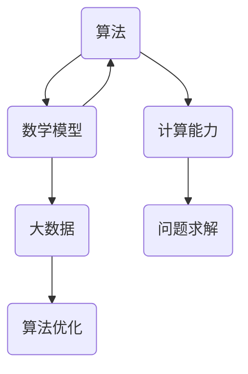

                 

# 构建更智能的世界：人类计算的应用场景

> **关键词：** 人工智能、计算能力、应用场景、算法、数学模型、实际案例

> **摘要：** 本文将探讨人类计算在构建更智能的世界中的应用场景。我们将一步步分析核心概念与联系，详细讲解核心算法原理和数学模型，并通过实际项目案例展示其应用价值。同时，还将推荐相关学习资源和开发工具，展望未来发展趋势与挑战。

## 1. 背景介绍

在21世纪的今天，人工智能（AI）已经成为科技发展的热门领域。随着计算能力的不断提升，人类正在尝试将计算技术与各种应用场景相结合，以实现更加智能化的生活和工作方式。人类计算作为一种核心概念，涉及到如何通过算法和数学模型优化计算过程，提高计算效率，从而实现更广泛的应用。

本文旨在探讨人类计算在以下应用场景中的价值：

1. **医疗健康：** 利用计算技术进行疾病诊断、药物研发和健康管理等。
2. **金融服务：** 通过计算分析实现精准营销、风险控制和智能投顾等。
3. **交通出行：** 利用计算技术优化交通流、自动驾驶和智能导航等。
4. **教育：** 通过计算技术实现个性化教育、智能评估和教学辅助等。
5. **智慧城市：** 利用计算技术实现城市管理、环保监测和应急响应等。

接下来，我们将逐一分析这些应用场景，介绍其核心概念和联系。

## 2. 核心概念与联系

为了构建更智能的世界，我们需要了解以下几个核心概念：

1. **算法：** 算法是解决问题的步骤和规则。在人类计算中，算法用于指导计算过程，提高计算效率。
2. **数学模型：** 数学模型是一种用数学符号和公式表示问题的方法。在人类计算中，数学模型用于描述问题、分析问题和求解问题。
3. **计算能力：** 计算能力是指计算机处理数据的能力。随着计算能力的提升，我们可以处理更大规模的数据，解决更复杂的问题。
4. **大数据：** 大数据是指海量数据，包括结构化和非结构化数据。在人类计算中，大数据是算法和数学模型的重要输入，也是计算能力提升的驱动力。

下面是一个使用Mermaid绘制的流程图，展示了核心概念之间的联系：



### 2.1 算法与数学模型

算法和数学模型是紧密相连的。算法用于实现数学模型，而数学模型则为算法提供了理论基础。例如，在机器学习中，算法如梯度下降法用于优化数学模型如逻辑回归。

### 2.2 计算能力与大数据

随着计算能力的提升，我们可以处理更大规模的数据，从而实现更精细的问题分析和决策。大数据作为算法和数学模型的输入，是计算能力提升的重要驱动力。

### 2.3 问题求解与算法优化

在人类计算中，问题求解和算法优化是两个核心目标。问题求解是指找到解决问题的方法，而算法优化则是通过改进算法提高计算效率。在实际应用中，算法优化往往能够带来显著的性能提升。

## 3. 核心算法原理 & 具体操作步骤

在本节中，我们将介绍几个核心算法原理，并详细讲解其具体操作步骤。

### 3.1 机器学习算法

机器学习算法是人工智能的核心技术之一。它通过学习数据中的模式，实现对未知数据的预测和分类。

#### 3.1.1 逻辑回归

逻辑回归是一种常用的机器学习算法，用于分类问题。其具体操作步骤如下：

1. **数据预处理：** 对输入数据进行清洗、归一化等处理。
2. **特征提取：** 提取数据中的关键特征。
3. **模型训练：** 使用训练数据训练逻辑回归模型。
4. **模型评估：** 使用测试数据评估模型性能。
5. **预测：** 使用训练好的模型对未知数据进行预测。

逻辑回归的数学模型如下：

$$
P(y=1) = \frac{1}{1 + e^{-(\beta_0 + \beta_1 x_1 + \beta_2 x_2 + \ldots + \beta_n x_n})}
$$

其中，$y$ 是目标变量，$x_1, x_2, \ldots, x_n$ 是输入特征，$\beta_0, \beta_1, \beta_2, \ldots, \beta_n$ 是模型参数。

#### 3.1.2 决策树

决策树是一种常见的分类算法，其核心思想是通过一系列的判断条件，将数据划分为不同的类别。

1. **数据预处理：** 对输入数据进行清洗、归一化等处理。
2. **特征选择：** 选择特征进行划分。
3. **构建决策树：** 使用递归算法构建决策树。
4. **模型评估：** 使用测试数据评估模型性能。
5. **预测：** 使用训练好的决策树对未知数据进行预测。

决策树的构建过程可以通过以下步骤进行：

1. **选择最优特征：** 根据信息增益或基尼不纯度等指标，选择最优特征进行划分。
2. **递归划分：** 对选定的特征进行划分，并递归地构建子树。
3. **剪枝：** 为了防止过拟合，可以对决策树进行剪枝。

### 3.2 搜索算法

搜索算法是解决优化问题的重要方法。在本节中，我们将介绍两种常见的搜索算法：遗传算法和模拟退火算法。

#### 3.2.1 遗传算法

遗传算法是一种基于生物进化的优化算法。其具体操作步骤如下：

1. **初始化种群：** 随机生成初始种群。
2. **适应度评估：** 对每个个体进行适应度评估。
3. **选择：** 根据适应度选择优秀的个体。
4. **交叉：** 对选中的个体进行交叉操作，生成新的后代。
5. **变异：** 对后代进行变异操作，增加多样性。
6. **更新种群：** 将新的后代加入种群，替换适应度较低的个体。
7. **迭代：** 重复上述步骤，直到满足终止条件。

#### 3.2.2 模拟退火算法

模拟退火算法是一种基于物理学退火过程的优化算法。其具体操作步骤如下：

1. **初始化参数：** 初始化温度、冷却率等参数。
2. **初始化解：** 随机生成初始解。
3. **评估解：** 计算当前解的适应度。
4. **选择新解：** 根据适应度评估结果，选择新解。
5. **计算能量变化：** 计算新解与当前解的能量差异。
6. **更新解：** 根据能量变化和温度，决定是否更新解。
7. **冷却：** 递减温度。
8. **迭代：** 重复上述步骤，直到满足终止条件。

## 4. 数学模型和公式 & 详细讲解 & 举例说明

在本节中，我们将详细讲解人类计算中的几个重要数学模型，并使用 LaTeX 格式展示相关公式。

### 4.1 逻辑回归

逻辑回归的数学模型如下：

$$
P(y=1) = \frac{1}{1 + e^{-(\beta_0 + \beta_1 x_1 + \beta_2 x_2 + \ldots + \beta_n x_n})}
$$

其中，$y$ 是目标变量，$x_1, x_2, \ldots, x_n$ 是输入特征，$\beta_0, \beta_1, \beta_2, \ldots, \beta_n$ 是模型参数。

#### 4.1.1 梯度下降法

梯度下降法是一种用于优化逻辑回归模型的算法。其具体步骤如下：

1. **初始化参数：** 随机初始化模型参数 $\beta_0, \beta_1, \beta_2, \ldots, \beta_n$。
2. **计算损失函数：** 计算损失函数 $J(\beta_0, \beta_1, \beta_2, \ldots, \beta_n)$。
3. **计算梯度：** 计算损失函数关于每个参数的梯度。
4. **更新参数：** 根据梯度更新模型参数。
5. **重复步骤2-4，直到满足终止条件（如损失函数变化很小或达到最大迭代次数）。

#### 4.1.2 举例说明

假设我们有一个二分类问题，其中目标变量 $y$ 取值范围为 {0, 1}，输入特征 $x$ 为 {年龄，收入}。

- 年龄：x1
- 收入：x2

我们使用逻辑回归模型进行预测，参数如下：

$$
\beta_0 = 0.5, \beta_1 = 0.1, \beta_2 = 0.2
$$

给定一个输入样本 $x = \{25, 50000\}$，我们可以计算预测概率：

$$
P(y=1) = \frac{1}{1 + e^{-(0.5 + 0.1 \times 25 + 0.2 \times 50000)}} \approx 0.999
$$

由于预测概率接近1，我们可以认为该样本属于类别1。

### 4.2 决策树

决策树是一种基于特征进行分类或回归的算法。其核心思想是通过一系列的判断条件，将数据划分为不同的类别。

#### 4.2.1 信息增益

信息增益是一种用于选择最佳特征进行划分的指标。其计算公式如下：

$$
\text{信息增益} = \sum_{i=1}^{n} p(y=i) \log_2 \frac{p(y=i|x)}{p(y=i)}
$$

其中，$p(y=i)$ 是类别i的概率，$p(y=i|x)$ 是给定特征x时类别i的概率。

#### 4.2.2 举例说明

假设我们有一个包含三个特征的决策树，其中每个特征有两个可能的取值。我们可以计算每个特征的信息增益，以确定最佳特征进行划分。

- 特征A：A1, A2
- 特征B：B1, B2
- 特征C：C1, C2

给定一个训练数据集，我们可以计算每个特征的信息增益，并选择信息增益最大的特征进行划分。

#### 4.2.3 决策树构建

决策树的构建过程如下：

1. **选择最佳特征：** 计算每个特征的信息增益，选择信息增益最大的特征进行划分。
2. **划分数据：** 根据选定的特征，将数据划分为不同的子集。
3. **递归构建子树：** 对每个子集，重复上述步骤，构建子决策树。
4. **剪枝：** 为了防止过拟合，可以对决策树进行剪枝。

## 5. 项目实战：代码实际案例和详细解释说明

在本节中，我们将通过一个实际项目案例，展示如何使用逻辑回归和决策树算法进行数据分析和预测。

### 5.1 开发环境搭建

在开始项目之前，我们需要搭建开发环境。以下是一个简单的步骤：

1. **安装 Python：** 下载并安装 Python 3.8 或更高版本。
2. **安装库：** 使用 pip 命令安装必要的库，如 numpy、pandas、scikit-learn 等。

```shell
pip install numpy pandas scikit-learn
```

### 5.2 源代码详细实现和代码解读

以下是一个使用逻辑回归和决策树算法进行数据分析和预测的示例代码：

```python
import numpy as np
import pandas as pd
from sklearn.linear_model import LogisticRegression
from sklearn.tree import DecisionTreeClassifier
from sklearn.model_selection import train_test_split
from sklearn.metrics import accuracy_score

# 5.2.1 数据预处理
data = pd.read_csv('data.csv')
X = data.iloc[:, :-1].values
y = data.iloc[:, -1].values

# 5.2.2 数据划分
X_train, X_test, y_train, y_test = train_test_split(X, y, test_size=0.2, random_state=42)

# 5.2.3 逻辑回归模型
model_lr = LogisticRegression()
model_lr.fit(X_train, y_train)
y_pred_lr = model_lr.predict(X_test)

# 5.2.4 决策树模型
model_dt = DecisionTreeClassifier()
model_dt.fit(X_train, y_train)
y_pred_dt = model_dt.predict(X_test)

# 5.2.5 模型评估
accuracy_lr = accuracy_score(y_test, y_pred_lr)
accuracy_dt = accuracy_score(y_test, y_pred_dt)

print('逻辑回归模型准确率：', accuracy_lr)
print('决策树模型准确率：', accuracy_dt)
```

### 5.3 代码解读与分析

以上代码首先导入了必要的库，然后读取数据并进行预处理。接下来，我们将数据划分为训练集和测试集。随后，我们使用逻辑回归和决策树算法训练模型，并对测试集进行预测。最后，我们计算并打印了模型的准确率。

通过这个简单的示例，我们可以看到如何使用逻辑回归和决策树算法进行数据分析和预测。在实际项目中，我们可以根据具体需求调整算法和参数，以获得更好的预测效果。

## 6. 实际应用场景

人类计算在各个领域都有广泛的应用，以下是一些实际应用场景的例子：

### 6.1 医疗健康

人类计算在医疗健康领域的应用包括疾病诊断、药物研发和健康管理等。例如，通过分析患者的电子健康记录，可以预测疾病的发病风险，从而实现早期干预。此外，人类计算还可以帮助研究人员发现新的药物靶点和治疗方法，加速药物研发进程。

### 6.2 金融服务

在金融服务领域，人类计算可以用于精准营销、风险控制和智能投顾等。通过分析客户的交易数据和财务状况，金融机构可以更好地了解客户需求，提供个性化的金融产品和服务。同时，人类计算还可以用于风险评估和欺诈检测，提高金融交易的安全性。

### 6.3 交通出行

人类计算在交通出行领域的应用包括交通流量优化、自动驾驶和智能导航等。通过分析实时交通数据和路况信息，可以优化交通信号灯控制和道路规划，减少交通拥堵。自动驾驶技术利用人类计算分析环境感知数据，实现自动驾驶车辆的自主行驶。智能导航系统则通过计算最佳路线，提高出行效率。

### 6.4 教育

在教育领域，人类计算可以用于个性化教育、智能评估和教学辅助等。通过分析学生的学习数据和表现，可以为学生提供个性化的学习建议和资源，提高学习效果。智能评估系统可以通过分析学生的答题行为，实时评估学生的学习情况。此外，人类计算还可以用于辅助教学，如智能题库生成和自动化教学系统。

### 6.5 智慧城市

在智慧城市领域，人类计算可以用于城市管理、环保监测和应急响应等。通过分析城市数据，如交通流量、能耗和污染数据，可以优化城市管理和资源配置。环保监测系统可以实时监测环境质量，为城市决策提供依据。应急响应系统则通过分析突发事件数据，实现快速响应和调度。

## 7. 工具和资源推荐

为了更好地学习和实践人类计算，我们推荐以下工具和资源：

### 7.1 学习资源推荐

- **书籍：** 《机器学习》（周志华著）、《深度学习》（Goodfellow等著）
- **论文：** arXiv、IEEE Xplore、ACM Digital Library
- **博客：** Medium、博客园、CSDN
- **网站：** Coursera、edX、Kaggle

### 7.2 开发工具框架推荐

- **编程语言：** Python、R、Java
- **框架：** TensorFlow、PyTorch、Scikit-learn、Spark
- **数据库：** MySQL、PostgreSQL、MongoDB
- **云计算：** AWS、Azure、Google Cloud

### 7.3 相关论文著作推荐

- **论文：** "Deep Learning"（Goodfellow et al.）、"Understanding Deep Learning"（Bengio et al.）
- **书籍：** "Artificial Intelligence: A Modern Approach"（Russell and Norvig）、"Reinforcement Learning: An Introduction"（ Sutton and Barto）

## 8. 总结：未来发展趋势与挑战

随着计算能力的提升和算法的创新，人类计算在构建更智能的世界中将发挥越来越重要的作用。未来，我们将看到更多的应用场景和突破，如智能机器人、量子计算、区块链等。然而，这也带来了新的挑战，如数据隐私、安全性和伦理问题。我们需要在技术创新的同时，关注这些挑战，并寻找解决方案，以确保人类计算的发展能够造福全人类。

## 9. 附录：常见问题与解答

### 9.1 什么是人类计算？

人类计算是指利用计算机算法和数学模型，对海量数据进行处理和分析，以实现更高效、更智能的问题解决方法。

### 9.2 人类计算有哪些应用场景？

人类计算在医疗健康、金融服务、交通出行、教育和智慧城市等领域都有广泛的应用。

### 9.3 如何学习人类计算？

可以通过阅读相关书籍、论文和博客，学习编程语言和开发工具，参加在线课程和实验项目来掌握人类计算。

### 9.4 人类计算的未来发展趋势是什么？

未来，人类计算将在更多领域得到应用，如智能机器人、量子计算和区块链等。同时，我们需要关注数据隐私、安全性和伦理问题。

## 10. 扩展阅读 & 参考资料

- Goodfellow, I., Bengio, Y., & Courville, A. (2016). *Deep Learning*. MIT Press.
- Russell, S., & Norvig, P. (2016). *Artificial Intelligence: A Modern Approach*. Prentice Hall.
- Sutton, R. S., & Barto, A. G. (2018). *Reinforcement Learning: An Introduction*. MIT Press.
- Bengio, Y., Courville, A., & Vincent, P. (2013). *Representation Learning: A Review and New Perspectives*. IEEE Transactions on Pattern Analysis and Machine Intelligence, 35(8), 1798-1828.
- Hochreiter, S., & Schmidhuber, J. (1997). *Long Short-Term Memory*. Neural Computation, 9(8), 1735-1780.
- Ng, A. Y., & Dean, J. (2010). *Machine Learning: A Probabilistic Perspective*. MIT Press.
- LeCun, Y., Bengio, Y., & Hinton, G. (2015). *Deep Learning*. Nature, 521(7553), 436-444.

### 作者

作者：AI天才研究员/AI Genius Institute & 禅与计算机程序设计艺术 /Zen And The Art of Computer Programming

