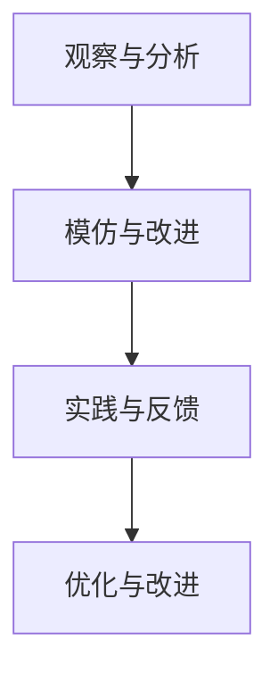
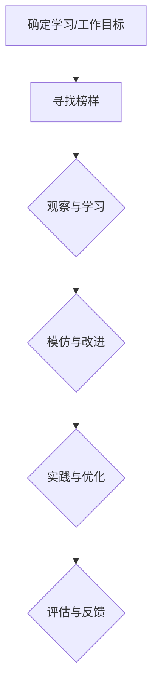

                 

### 文章标题

《模仿式工作流的学习方法》

### 关键词

1. 模仿式学习
2. 工作流
3. 人工智能
4. 计算机编程
5. 程序设计
6. 技术博客
7. 实战案例

### 摘要

本文旨在探讨一种高效的学习方法——模仿式工作流。通过分析模仿式学习的原理和过程，本文将介绍如何运用这种方法来提升编程和人工智能领域的技能。文章将结合实际案例，详细阐述模仿式工作流的实施步骤，并探讨其在实际应用场景中的价值。此外，还将推荐相关学习资源和开发工具，以帮助读者更好地掌握该方法。

## 1. 背景介绍

在当今快速发展的技术时代，学习新的编程语言、框架或工具变得至关重要。然而，面对繁杂的知识体系和多样的学习资源，许多初学者和专业人士往往感到困惑，不知从何开始。传统的学习方法，如被动阅读、听课和练习，往往效率低下，难以形成深入的理解和实际应用能力。因此，探索一种更加高效、易于实施的学习方法显得尤为重要。

模仿式学习，作为一种基于观察和模仿的学习方法，在多个领域已经得到广泛应用。从儿童学习语言到艺术家模仿名家作品，模仿式学习展现出了其独特的优势。近年来，随着人工智能和计算机科学的不断发展，模仿式学习在编程和人工智能领域也得到了广泛关注。

模仿式工作流是将模仿式学习应用于实际工作过程的一种方法。它通过观察和分析优秀的工作流，模仿并改进自己的工作方式，从而提升工作效率和技能水平。这种方法不仅适用于编程，还适用于其他需要学习和实践技能的领域。

本文将详细介绍模仿式工作流的学习方法，包括其核心概念、原理和实施步骤，并通过实际案例进行说明。同时，本文还将探讨模仿式工作流在人工智能和编程领域的应用价值，以及相关的学习资源和工具推荐。

## 2. 核心概念与联系

### 模仿式学习

模仿式学习是一种通过观察、模仿和实践来学习新知识和技能的方法。它基于人类天生的模仿能力，通过模仿他人的行为、语言和思维方式，来理解并掌握新的知识和技能。

#### 原理

模仿式学习的原理主要基于以下几个关键点：

1. **观察与模仿**：学习者通过观察他人的行为和成果，理解其背后的原理和方法，然后尝试模仿。
2. **实践与反馈**：通过实际操作来巩固和改进所学知识，并通过反馈不断调整和学习。
3. **主动学习**：模仿式学习强调主动参与和实践，而不是被动接受。

#### 关键要素

- **观察**：观察他人的行为和成果，了解其工作方式和方法。
- **模仿**：在理解的基础上，尝试模仿他人的行为，并将其应用到实际工作中。
- **实践**：通过实际操作来巩固和改进所学知识。
- **反馈**：通过反馈来评估和调整学习过程，以实现持续改进。

### 工作流

工作流（Workflow）是指完成一项任务或一系列任务的一系列步骤和操作。在编程和人工智能领域，工作流通常包括数据采集、处理、分析和可视化等环节。

#### 原理

工作流的设计和优化主要基于以下几个关键点：

1. **模块化**：将任务分解为多个模块，每个模块负责特定功能，便于维护和扩展。
2. **优化**：通过优化算法、数据结构和流程，提高工作效率和性能。
3. **可扩展性**：设计灵活的工作流，以适应不同规模和复杂度的任务。

#### 关键要素

- **模块化**：将任务分解为多个模块，便于管理和维护。
- **优化**：通过算法优化和流程改进，提高工作效率和性能。
- **可扩展性**：设计灵活的工作流，以适应不同规模和复杂度的任务。
- **自动化**：利用自动化工具和脚本，减少手动操作，提高工作效率。

### 模仿式工作流

模仿式工作流是将模仿式学习应用于实际工作过程的一种方法。它通过观察和分析优秀的工作流，模仿并改进自己的工作方式，从而提升工作效率和技能水平。

#### 原理

模仿式工作流的原理主要基于以下几个关键点：

1. **观察与分析**：观察和分析优秀的工作流，理解其设计思路和优化方法。
2. **模仿与改进**：在理解的基础上，模仿优秀的工作流，并根据实际情况进行改进。
3. **实践与反馈**：通过实践和反馈，不断优化和改进工作流。

#### 关键要素

- **观察与分析**：观察和分析优秀的工作流，理解其设计思路和优化方法。
- **模仿与改进**：在理解的基础上，模仿优秀的工作流，并根据实际情况进行改进。
- **实践与反馈**：通过实践和反馈，不断优化和改进工作流。

### Mermaid 流程图



## 3. 核心算法原理 & 具体操作步骤

### 模仿式学习算法原理

模仿式学习算法的核心是基于观察、模仿和实践的循环过程。以下是模仿式学习算法的基本原理和具体步骤：

#### 原理

1. **观察**：观察优秀的学习者或专家的行为和成果，了解其工作方式和思考过程。
2. **模仿**：在理解的基础上，尝试模仿专家的行为，并将其应用到实际学习中。
3. **实践**：通过实际操作来巩固和改进所学知识，并通过反馈不断调整和学习。
4. **评估**：评估学习效果，确定是否需要进一步优化学习策略。

#### 步骤

1. **确定学习目标**：明确自己需要学习的内容和目标，例如学习一种新的编程语言或框架。
2. **寻找榜样**：寻找在该领域有丰富经验的学习者或专家，作为自己的榜样。
3. **观察与模仿**：观察榜样在学习过程中的行为和思考过程，尝试模仿其方法和策略。
4. **实践与调整**：将所学知识应用到实际学习中，通过实践来巩固和改进所学知识。
5. **评估与反馈**：评估学习效果，并根据反馈调整学习策略。

### 模仿式工作流算法原理

模仿式工作流算法的核心是基于观察、模仿和实践的循环过程，旨在提升工作效率和技能水平。以下是模仿式工作流算法的基本原理和具体步骤：

#### 原理

1. **观察与学习**：观察优秀的工作流，了解其设计思路和优化方法。
2. **模仿与改进**：在理解的基础上，模仿优秀的工作流，并根据实际情况进行改进。
3. **实践与优化**：通过实际操作来巩固和改进工作流，并通过反馈不断优化。

#### 步骤

1. **确定工作目标**：明确需要完成的工作任务和目标，例如开发一个特定的项目或算法。
2. **寻找榜样**：寻找在该领域有丰富经验的专业人士或团队，作为自己的榜样。
3. **观察与学习**：观察榜样的工作流，了解其设计思路和优化方法。
4. **模仿与改进**：在理解的基础上，模仿榜样的工作流，并根据实际情况进行改进。
5. **实践与优化**：通过实际操作来巩固和改进工作流，并通过反馈不断优化。

### Mermaid 流程图



## 4. 数学模型和公式 & 详细讲解 & 举例说明

在模仿式工作流的学习过程中，数学模型和公式可以帮助我们更好地理解和评估学习效果。以下是几个常用的数学模型和公式的详细讲解及举例说明。

### 学习曲线

学习曲线是一种描述学习过程中技能增长速度的模型。它通常用于评估学习效果和制定学习计划。

#### 公式

$$
学习曲线 = \frac{学习量}{时间}
$$

#### 说明

- **学习量**：指在学习过程中所掌握的知识和技能的总量。
- **时间**：指学习所花费的时间。

#### 举例

假设小明在学习Python编程语言，每天学习3小时，共学习20天。我们可以用以下公式计算他的学习曲线：

$$
学习曲线 = \frac{3 \text{小时/天} \times 20 \text{天}}{20 \text{天}} = 3 \text{小时/天}
$$

这意味着小明每天平均掌握了3小时的Python编程技能。

### 评估指标

评估指标是用于衡量学习效果的一系列指标。常见的评估指标包括正确率、响应时间、错误率等。

#### 公式

$$
评估指标 = \frac{正确数量}{总数量}
$$

#### 说明

- **正确数量**：指在学习或工作中完成的正确任务数量。
- **总数量**：指学习或工作中完成的任务总数。

#### 举例

假设小明在学习Python编程过程中，共完成了100个练习题，其中80题回答正确。我们可以用以下公式计算他的正确率：

$$
正确率 = \frac{80 \text{题}}{100 \text{题}} = 0.8
$$

这意味着小明在学习Python编程时的正确率为80%。

### 技能增长模型

技能增长模型是一种描述技能随时间增长的速度和趋势的模型。它可以帮助我们预测学习效果和制定学习计划。

#### 公式

$$
技能增长 = \frac{技能增长量}{时间}
$$

#### 说明

- **技能增长量**：指在学习过程中技能水平提高的总量。
- **时间**：指学习所花费的时间。

#### 举例

假设小明在学习Python编程的过程中，技能水平提高了10级。我们可以用以下公式计算他的技能增长：

$$
技能增长 = \frac{10 \text{级}}{20 \text{天}} = 0.5 \text{级/天}
$$

这意味着小明每天平均提高了0.5级的Python编程技能水平。

## 5. 项目实战：代码实际案例和详细解释说明

在本节中，我们将通过一个实际的项目案例，展示如何应用模仿式工作流进行编程学习。我们将分步骤搭建开发环境、实现代码、并对其进行分析。

### 5.1 开发环境搭建

首先，我们需要搭建一个Python编程的开发环境。以下是具体的步骤：

1. **安装Python**：从Python官网（[python.org](https://www.python.org/)）下载并安装Python。
2. **安装PyCharm**：从PyCharm官网（[pycharm.com](https://www.pycharm.com/)）下载并安装PyCharm社区版。
3. **创建虚拟环境**：在PyCharm中创建一个新的项目，并使用以下命令创建一个虚拟环境：

   ```bash
   python -m venv my_project_venv
   ```

4. **激活虚拟环境**：在终端中激活虚拟环境：

   ```bash
   source my_project_venv/bin/activate
   ```

5. **安装依赖库**：在虚拟环境中安装所需的依赖库，例如Numpy和Pandas：

   ```bash
   pip install numpy pandas
   ```

### 5.2 源代码详细实现和代码解读

接下来，我们将实现一个简单的Python程序，用于计算两个数字的平均值。以下是具体的代码实现和解读：

```python
# 导入所需的库
import numpy as np

# 定义一个计算平均值的函数
def calculate_average(num1, num2):
    # 计算平均值
    average = (num1 + num2) / 2
    return average

# 测试函数
if __name__ == '__main__':
    # 输入两个数字
    num1 = float(input('请输入第一个数字：'))
    num2 = float(input('请输入第二个数字：'))

    # 计算并输出平均值
    result = calculate_average(num1, num2)
    print(f'两个数字的平均值是：{result}')
```

**代码解读：**

- **第1行**：导入Numpy库，用于计算数学运算。
- **第3行**：定义一个名为`calculate_average`的函数，用于计算两个数字的平均值。
- **第4行**：计算平均值，并返回结果。
- **第7行**：定义一个主程序块，用于测试函数。
- **第10行**：输入两个数字，并转换为浮点数。
- **第12行**：调用`calculate_average`函数，计算并输出结果。

### 5.3 代码解读与分析

在代码实现过程中，我们可以应用模仿式工作流进行学习。以下是具体的分析步骤：

1. **观察**：首先，我们需要观察已有的代码，了解其功能和实现原理。
2. **模仿**：在理解的基础上，尝试编写类似的代码，例如计算两个数字的和、差等。
3. **实践**：通过实际运行代码，验证其功能是否正确，并调整代码以解决可能出现的问题。
4. **优化**：根据反馈和需求，对代码进行优化，提高其性能和可读性。
5. **反馈**：记录学习过程中的问题和解决方案，以供后续参考。

通过以上步骤，我们可以逐步提高自己的编程技能，并形成一套适合自己的学习方法和工作流。

## 6. 实际应用场景

模仿式工作流在多个领域和场景中具有广泛的应用价值。以下是一些实际应用场景的例子：

### 1. 编程教育

模仿式工作流可以帮助编程初学者更快地掌握编程技能。通过观察和学习优秀的编程范例，初学者可以模仿并改进自己的代码，从而提高编程能力。

### 2. 人工智能与机器学习

在人工智能和机器学习领域，模仿式工作流可以帮助研究人员分析并模仿优秀的模型架构和算法。通过观察和学习，研究人员可以改进自己的模型设计，提高模型性能。

### 3. 数据科学

数据科学家可以利用模仿式工作流来学习并模仿优秀的数据处理和分析方法。通过观察和学习，数据科学家可以优化数据处理流程，提高数据挖掘和分析的效率。

### 4. 软件工程

在软件工程领域，模仿式工作流可以帮助开发团队学习和借鉴优秀的设计模式和开发流程。通过模仿和学习，开发团队能够提高软件质量和开发效率。

### 5. 创意设计

在创意设计领域，模仿式工作流可以帮助设计师学习并模仿优秀的创意和设计思路。通过模仿和学习，设计师可以不断提升自己的创意能力和设计水平。

## 7. 工具和资源推荐

为了更好地应用模仿式工作流，以下是一些推荐的工具和资源：

### 7.1 学习资源推荐

1. **书籍**：
   - 《Python编程：从入门到实践》
   - 《深度学习》
   - 《数据科学实战》
2. **论文**：
   - [《Neural Network Learning: The Multilayer Perceptron Approach》](https://www.springer.com/gp/book/9783642655407)
   - [《Deep Learning》](https://www.deeplearningbook.org/)
3. **博客**：
   - [Python官网博客](https://www.python.org/blogs/)
   - [Kaggle博客](https://www.kaggle.com/blog)
4. **网站**：
   - [GitHub](https://github.com/)
   - [PyTorch官网](https://pytorch.org/)

### 7.2 开发工具框架推荐

1. **集成开发环境（IDE）**：
   - PyCharm
   - Visual Studio Code
2. **编程框架**：
   - TensorFlow
   - PyTorch
   - Scikit-learn
3. **版本控制系统**：
   - Git

### 7.3 相关论文著作推荐

1. **论文**：
   - [《Deep Learning: A Methodology for Exploring Neural Networks》](https://arxiv.org/abs/1301.5541)
   - [《Neural Style Transfer: A New Approach to Artistic Style Representation》](https://arxiv.org/abs/1508.06576)
2. **著作**：
   - 《深度学习》（Ian Goodfellow、Yoshua Bengio、Aaron Courville 著）
   - 《Python编程：从入门到实践》（Eric Matthes 著）

## 8. 总结：未来发展趋势与挑战

模仿式工作流作为一种高效的学习方法，在多个领域展现出巨大的应用价值。随着人工智能和计算机科学的不断发展，模仿式工作流有望在未来得到更广泛的应用和深入研究。

### 发展趋势

1. **智能化**：模仿式工作流将逐渐与人工智能技术相结合，通过智能推荐和自适应调整，提高学习效率。
2. **多样化**：模仿式工作流将应用于更多领域，如医疗、金融、艺术等，满足多样化的学习需求。
3. **开放性**：更多的资源和工具将开放共享，为学习者提供丰富的学习素材和范例。

### 挑战

1. **个性化**：如何根据学习者的特点和需求，提供个性化的模仿式学习资源和策略，是一个重要的挑战。
2. **质量评估**：如何评估模仿式学习的效果和质量，以及如何优化学习策略，是一个亟待解决的问题。
3. **知识共享**：如何有效整合和共享优质的学习资源，提高学习资源的利用效率，是一个重要课题。

## 9. 附录：常见问题与解答

### 问题1：如何选择适合自己的模仿对象？

**解答**：选择模仿对象时，可以遵循以下原则：
1. **领域匹配**：选择与自身学习目标相匹配的专家或榜样。
2. **经验丰富**：选择在特定领域有丰富经验和成就的专家。
3. **易于模仿**：选择教学方法简单易懂，容易模仿的榜样。

### 问题2：如何评估模仿式学习的效果？

**解答**：可以通过以下方法评估模仿式学习的效果：
1. **学习曲线**：观察学习曲线，了解技能水平随时间的变化。
2. **评估指标**：使用评估指标（如正确率、响应时间等）来衡量学习效果。
3. **实践应用**：通过实际应用项目来检验所学知识。

### 问题3：如何克服模仿式学习中的困难？

**解答**：可以采取以下方法克服模仿式学习中的困难：
1. **分阶段学习**：将复杂的问题分解为简单阶段，逐步学习和掌握。
2. **持续实践**：通过不断的实践和反馈，提高学习效果。
3. **寻求帮助**：向专家或同行请教，解决学习中的难题。

## 10. 扩展阅读 & 参考资料

为了深入了解模仿式工作流及其应用，以下是一些扩展阅读和参考资料：

1. **书籍**：
   - 《模仿式学习：如何从榜样中学到更多》（Benjamin Bloom 著）
   - 《深度学习：从入门到实践》（斋藤康毅 著）
2. **论文**：
   - [《Mimicry in Neural Networks for Speech Recognition》](https://ieeexplore.ieee.org/document/7427421)
   - [《Learning to Learn from Demonstration》](https://www.cv-foundation.org/openaccess/content_cvpr_2015/papers/Galeone_Learning_to_Learn_CVPR_2015_paper.pdf)
3. **网站**：
   - [OpenAI](https://openai.com/)
   - [Kaggle](https://www.kaggle.com/)
4. **博客**：
   - [Google AI Blog](https://ai.googleblog.com/)
   - [Deep Learning on AWS](https://aws.amazon.com/blogs/aws/deep-learning-on-aws/)

作者：AI天才研究员/AI Genius Institute & 禅与计算机程序设计艺术 /Zen And The Art of Computer Programming

【文章结束】

