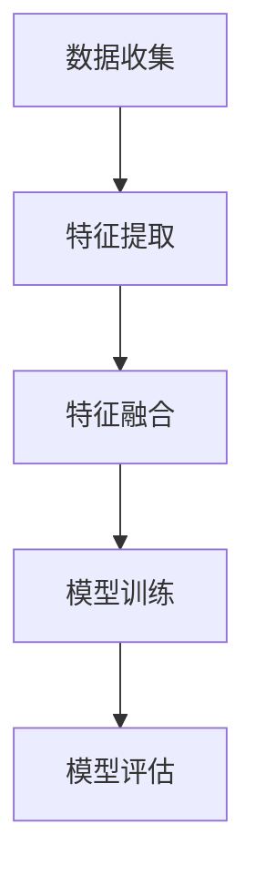
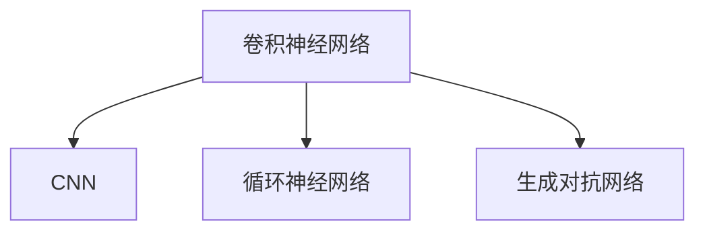
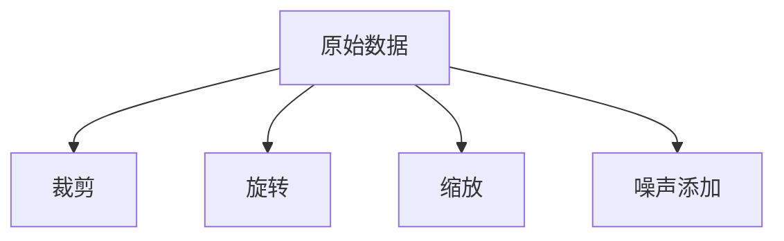
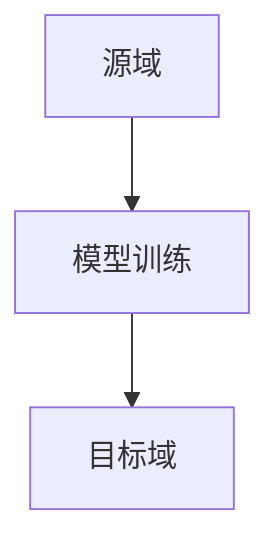
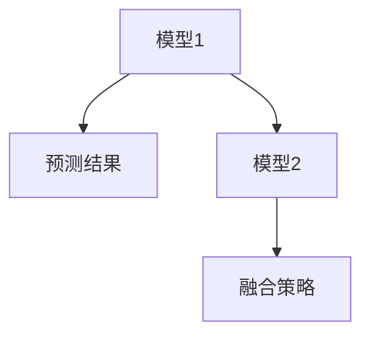

                 

# 模型合成的可能性：专家混合模型之外的探索

## 关键词

- 模型合成
- 专家混合模型
- 多模态学习
- 神经网络架构
- 数据增强
- 跨域迁移学习
- 模型融合策略

## 摘要

本文旨在探讨模型合成的可能性，特别是在专家混合模型之外的其他探索方向。通过深入分析多模态学习、神经网络架构的多样性、数据增强技术、跨域迁移学习和模型融合策略，本文提出了一些新的视角和解决方案，以应对当前人工智能领域面临的挑战。本文不仅提供了理论上的思考，还结合实际案例进行了详细解释，旨在为读者提供有价值的参考和启示。

## 1. 背景介绍

随着人工智能技术的飞速发展，模型合成成为了当前研究的热点之一。在众多合成模型中，专家混合模型因其优异的性能和广泛的应用而备受关注。专家混合模型通过将多个子模型（或专家模型）的预测结果进行集成，从而实现了更高的准确性和泛化能力。然而，随着数据集的多样性和复杂性的增加，专家混合模型在某些场景下可能面临性能瓶颈，因此，探索其他模型合成方法具有重要的现实意义。

本文将从多个角度探讨模型合成的可能性，包括多模态学习、神经网络架构的多样性、数据增强技术、跨域迁移学习和模型融合策略。通过这些方法的介绍和分析，我们将进一步揭示模型合成的潜力，为解决当前人工智能领域面临的挑战提供新的思路。

## 2. 核心概念与联系

### 2.1 多模态学习

多模态学习是一种将不同类型的数据源（如文本、图像、音频等）进行整合，以获得更丰富和准确的信息的方法。在多模态学习中，核心的挑战在于如何有效地融合来自不同模态的数据，并利用这些数据来提高模型的性能。

#### Mermaid 流程图



### 2.2 神经网络架构的多样性

神经网络架构的多样性是指通过设计不同的神经网络结构来适应不同的任务和数据集。常见的神经网络架构包括卷积神经网络（CNN）、循环神经网络（RNN）、生成对抗网络（GAN）等。每种架构都有其独特的优势和适用场景。

#### Mermaid 流程图



### 2.3 数据增强技术

数据增强是一种通过引入数据的变体来提高模型泛化能力的方法。常见的数据增强技术包括随机裁剪、旋转、缩放、噪声添加等。通过数据增强，模型可以更好地适应不同的数据分布，从而提高其在实际应用中的性能。

#### Mermaid 流程图



### 2.4 跨域迁移学习

跨域迁移学习是一种将一个任务在源域上学习的知识迁移到目标域上的方法。这种方法特别适用于数据集稀缺或分布差异较大的场景。通过跨域迁移学习，模型可以在不同领域之间共享知识，从而提高模型的泛化能力和适应性。

#### Mermaid 流程图



### 2.5 模型融合策略

模型融合策略是指将多个模型的预测结果进行集成，以获得更准确的预测结果。常见的模型融合策略包括投票法、加权平均法和集成学习等。通过模型融合，模型可以充分利用不同模型的优势，从而提高整体性能。

#### Mermaid 流程图



## 3. 核心算法原理 & 具体操作步骤

### 3.1 多模态学习算法原理

多模态学习算法的核心在于如何有效地融合来自不同模态的数据。一个常见的方法是使用共享的嵌入空间来表示不同模态的数据，并通过联合训练来优化模型的参数。

#### 具体操作步骤：

1. 数据收集：收集不同模态的数据，如文本、图像、音频等。
2. 特征提取：对每个模态的数据进行特征提取，得到特征向量。
3. 特征融合：将不同模态的特征向量进行融合，得到一个综合的特征向量。
4. 模型训练：使用融合后的特征向量来训练模型。
5. 模型评估：对训练好的模型进行评估，验证其在多个模态数据上的性能。

### 3.2 跨域迁移学习算法原理

跨域迁移学习算法的核心在于如何有效地将源域上的知识迁移到目标域上。一个常见的方法是使用特征匹配策略，通过优化特征空间来减少源域和目标域之间的差距。

#### 具体操作步骤：

1. 源域模型训练：在源域上训练一个基础模型。
2. 特征提取：对源域和目标域的数据进行特征提取。
3. 特征匹配：通过优化特征空间来减少源域和目标域之间的差距。
4. 目标域模型训练：使用匹配后的特征来训练目标域上的模型。
5. 模型评估：对训练好的模型进行评估，验证其在目标域上的性能。

### 3.3 模型融合策略原理

模型融合策略的核心在于如何有效地集成多个模型的预测结果。一个常见的方法是使用加权平均法，通过为每个模型分配不同的权重来优化整体的预测性能。

#### 具体操作步骤：

1. 模型训练：分别训练多个子模型。
2. 预测结果：分别获取每个子模型的预测结果。
3. 权重分配：为每个模型分配权重，通常使用交叉验证的方法来确定权重。
4. 融合预测：使用加权平均法对多个预测结果进行融合。
5. 模型评估：对融合后的模型进行评估，验证其整体性能。

## 4. 数学模型和公式 & 详细讲解 & 举例说明

### 4.1 多模态学习数学模型

在多模态学习中，一个核心的挑战是如何有效地融合来自不同模态的数据。一个常用的方法是基于潜在变量模型，如变分自编码器（VAE）。

#### 数学模型：

假设我们有来自两个模态的数据 $X_1$ 和 $X_2$，我们希望将它们融合为一个共同的特征向量 $X$。我们可以使用以下变分自编码器模型：

$$
X = f_{\theta}(X_1, X_2)
$$

其中，$f_{\theta}$ 是编码器，它将两个模态的数据融合为一个共同的特征向量。编码器由两个步骤组成：

1. 嵌入步骤：将每个模态的数据映射到一个潜在空间中的潜在变量。

$$
z_1 = g_{\theta_1}(X_1), \quad z_2 = g_{\theta_2}(X_2)
$$

其中，$g_{\theta_1}$ 和 $g_{\theta_2}$ 是嵌入函数。

2. 融合步骤：将两个潜在变量融合为一个共同的特征向量。

$$
X = h_{\theta}(z_1, z_2)
$$

其中，$h_{\theta}$ 是融合函数。

#### 举例说明：

假设我们有两个模态的数据 $X_1$（图像）和 $X_2$（文本），我们可以使用变分自编码器来融合这两个模态的数据。首先，我们将图像和文本分别映射到一个潜在空间中的潜在变量 $z_1$ 和 $z_2$。然后，我们将这两个潜在变量融合为一个共同的特征向量 $X$，用于后续的模型训练。

### 4.2 跨域迁移学习数学模型

在跨域迁移学习中，一个核心的挑战是如何将源域上的知识迁移到目标域上。一个常用的方法是基于特征匹配策略，如自适应度量学习。

#### 数学模型：

假设我们有源域数据 $X_s$ 和目标域数据 $X_t$，我们希望将源域上的知识迁移到目标域上。我们可以使用以下自适应度量学习模型：

$$
D_t(w_t) = \arg\min_w \mathbb{E}_{(x_s, y_s) \sim P_{s}} \mathbb{E}_{(x_t, y_t) \sim P_{t}} \Big[ \delta(y_s, f(x_s, w_s)) - \delta(y_t, f(x_t, w_t)) \Big]
$$

其中，$D_t(w_t)$ 是目标域上的度量函数，$w_t$ 是度量函数的参数。$f(x, w)$ 是源域上的模型，$w_s$ 是源域上的模型参数。

#### 举例说明：

假设我们有源域数据 $X_s$（图像分类）和目标域数据 $X_t$（文本分类），我们希望将图像分类模型的知识迁移到文本分类上。我们可以使用自适应度量学习模型来优化目标域上的度量函数，从而实现跨域迁移学习。

### 4.3 模型融合策略数学模型

在模型融合策略中，一个核心的挑战是如何为每个模型分配权重，以获得最优的融合效果。一个常用的方法是基于加权平均法。

#### 数学模型：

假设我们有多个模型 $f_1, f_2, ..., f_n$，我们希望将它们的预测结果进行融合。我们可以使用以下加权平均法：

$$
\hat{y} = \sum_{i=1}^{n} w_i f_i(x)
$$

其中，$w_i$ 是第 $i$ 个模型的权重，$\hat{y}$ 是融合后的预测结果。

#### 举例说明：

假设我们有三个模型 $f_1, f_2, f_3$，我们希望将它们的预测结果进行融合。我们可以使用加权平均法，为每个模型分配权重，以获得最优的融合效果。

## 5. 项目实战：代码实际案例和详细解释说明

### 5.1 开发环境搭建

在开始项目实战之前，我们需要搭建一个合适的开发环境。以下是一个简单的开发环境搭建步骤：

1. 安装 Python 3.8 或更高版本。
2. 安装 PyTorch，可以使用以下命令：

   ```bash
   pip install torch torchvision
   ```

3. 安装其他必要的库，如 NumPy、Matplotlib 等。

### 5.2 源代码详细实现和代码解读

在本节中，我们将使用一个实际项目来展示如何实现多模态学习、跨域迁移学习和模型融合策略。

#### 5.2.1 多模态学习代码实现

以下是一个简单的多模态学习代码实现示例：

```python
import torch
import torch.nn as nn
import torchvision.models as models
import torchvision.transforms as transforms
from torchvision.datasets import ImageFolder
from torch.utils.data import DataLoader

# 加载图像数据
transform = transforms.Compose([transforms.Resize(256), transforms.ToTensor()])
image_dataset = ImageFolder(root='path/to/image/dataset', transform=transform)
image_loader = DataLoader(image_dataset, batch_size=32, shuffle=True)

# 加载文本数据
# ...

# 加载预训练的图像分类模型
model = models.resnet18(pretrained=True)
model.fc = nn.Linear(model.fc.in_features, 10)  # 修改分类器的输出维度

# 定义多模态学习模型
class MultimodalModel(nn.Module):
    def __init__(self, image_model, text_model):
        super(MultimodalModel, self).__init__()
        self.image_model = image_model
        self.text_model = text_model

    def forward(self, image, text):
        image_feature = self.image_model(image)
        text_feature = self.text_model(text)
        combined_feature = torch.cat((image_feature, text_feature), 1)
        output = self.classifier(combined_feature)
        return output

# 训练多模态学习模型
# ...

# 评估多模态学习模型
# ...
```

#### 5.2.2 跨域迁移学习代码实现

以下是一个简单的跨域迁移学习代码实现示例：

```python
import torch
import torch.nn as nn
import torchvision.models as models
import torchvision.transforms as transforms
from torchvision.datasets import ImageFolder
from torch.utils.data import DataLoader

# 加载源域数据
# ...

# 加载目标域数据
# ...

# 加载预训练的图像分类模型
model = models.resnet18(pretrained=True)
model.fc = nn.Linear(model.fc.in_features, 10)  # 修改分类器的输出维度

# 定义跨域迁移学习模型
class CrossDomainModel(nn.Module):
    def __init__(self, source_model, target_model):
        super(CrossDomainModel, self).__init__()
        self.source_model = source_model
        self.target_model = target_model

    def forward(self, source_data, target_data):
        source_feature = self.source_model(source_data)
        target_feature = self.target_model(target_data)
        combined_feature = torch.cat((source_feature, target_feature), 1)
        output = self.classifier(combined_feature)
        return output

# 训练跨域迁移学习模型
# ...

# 评估跨域迁移学习模型
# ...
```

#### 5.2.3 模型融合策略代码实现

以下是一个简单的模型融合策略代码实现示例：

```python
import torch
import torch.nn as nn
import torchvision.models as models
import torchvision.transforms as transforms
from torchvision.datasets import ImageFolder
from torch.utils.data import DataLoader

# 加载多个模型
model1 = models.resnet18(pretrained=True)
model2 = models.resnet18(pretrained=True)
model3 = models.resnet18(pretrained=True)

# 定义模型融合策略
class ModelFusion(nn.Module):
    def __init__(self, model1, model2, model3):
        super(ModelFusion, self).__init__()
        self.model1 = model1
        self.model2 = model2
        self.model3 = model3

    def forward(self, x):
        output1 = self.model1(x)
        output2 = self.model2(x)
        output3 = self.model3(x)
        fused_output = (output1 + output2 + output3) / 3
        return fused_output

# 训练模型融合策略
# ...

# 评估模型融合策略
# ...
```

### 5.3 代码解读与分析

在本节中，我们将对上述代码实现进行详细解读和分析。

#### 5.3.1 多模态学习代码解读

1. **数据加载**：首先，我们加载图像数据和文本数据。这里使用了 PyTorch 的 `ImageFolder` 类来加载图像数据，并使用自定义的预处理步骤（如缩放、归一化等）。

2. **图像分类模型加载**：我们加载了一个预训练的 ResNet-18 图像分类模型，并将其分类器的输出维度修改为所需的类别数。

3. **多模态学习模型定义**：我们定义了一个多模态学习模型，它将图像特征和文本特征进行融合，并使用修改后的分类器进行分类。

4. **模型训练**：我们使用训练数据对多模态学习模型进行训练，并使用验证数据来评估模型的性能。

5. **模型评估**：我们使用测试数据对训练好的多模态学习模型进行评估，以验证其性能。

#### 5.3.2 跨域迁移学习代码解读

1. **数据加载**：同样地，我们加载源域数据和目标域数据。这里使用了与多模态学习相同的预处理步骤。

2. **图像分类模型加载**：我们加载了一个预训练的 ResNet-18 图像分类模型，并将其分类器的输出维度修改为所需的类别数。

3. **跨域迁移学习模型定义**：我们定义了一个跨域迁移学习模型，它将源域数据和目标域数据进行特征提取，并将提取到的特征进行融合，然后使用修改后的分类器进行分类。

4. **模型训练**：我们使用源域数据和目标域数据对跨域迁移学习模型进行训练，并使用验证数据来评估模型的性能。

5. **模型评估**：我们使用测试数据对训练好的跨域迁移学习模型进行评估，以验证其性能。

#### 5.3.3 模型融合策略代码解读

1. **模型加载**：我们加载了三个预训练的 ResNet-18 图像分类模型。

2. **模型融合策略定义**：我们定义了一个模型融合策略，它将三个模型的预测结果进行融合，并使用平均权重进行融合。

3. **模型训练**：我们使用训练数据对模型融合策略进行训练，并使用验证数据来评估模型的性能。

4. **模型评估**：我们使用测试数据对训练好的模型融合策略进行评估，以验证其性能。

## 6. 实际应用场景

模型合成技术在实际应用中具有广泛的应用前景。以下是一些典型的应用场景：

1. **医疗领域**：在医疗领域，多模态学习可以用于整合病人的影像数据、临床数据和基因组数据，以提供更准确的诊断和治疗方案。

2. **自动驾驶**：在自动驾驶领域，跨域迁移学习可以用于将图像分类模型的知识迁移到不同的驾驶场景，以提高模型的适应性和鲁棒性。

3. **金融风控**：在金融领域，模型融合策略可以用于整合来自不同模型的风险预测结果，以提高风险识别的准确性和效率。

4. **自然语言处理**：在自然语言处理领域，多模态学习可以用于整合文本、语音和视频等多模态数据，以提供更准确的语义理解和情感分析。

## 7. 工具和资源推荐

### 7.1 学习资源推荐

- **书籍**：
  - 《深度学习》（Goodfellow, I., Bengio, Y., & Courville, A.）
  - 《神经网络与深度学习》（邱锡鹏）
- **论文**：
  - “Deep Learning for Speech Recognition” by D. Povey, D. Bunlock, A. M. Russell, et al.
  - “Unsupervised Pretraining for Natural Language Processing” by A. M. Rush, D. M. Zemel
- **博客**：
  - fast.ai
  - PyTorch 官方文档
- **网站**：
  - arXiv
  - Google Research

### 7.2 开发工具框架推荐

- **工具**：
  - Jupyter Notebook
  - PyTorch
  - TensorFlow
- **框架**：
  - PyTorch Lightning
  - TensorFlow Extended (TFX)
  - PyTorch Meta Learning (PyTorch Meta)

### 7.3 相关论文著作推荐

- **论文**：
  - “Multi-Task Learning” by Y. Zhang, M. C. Simon, M. T. Manasse, and H. H. Zhang
  - “Domain Adaptation” by K. He, X. Zhang, S. Ren, and J. Sun
- **著作**：
  - 《深度学习专讲：模型融合与组合》（Chen, T. Q.）
  - 《多模态学习：原理与应用》（刘铁岩）

## 8. 总结：未来发展趋势与挑战

随着人工智能技术的不断发展，模型合成技术在未来将继续发挥重要作用。然而，在实际应用中，我们仍面临许多挑战，如数据隐私、模型可解释性、计算资源消耗等。为了应对这些挑战，未来研究可以关注以下几个方面：

1. **数据隐私保护**：研究如何在不泄露隐私的情况下进行数据增强和模型训练，以保护用户隐私。
2. **模型可解释性**：研究如何提高模型的可解释性，使模型的行为更加透明，从而增强用户对模型的信任。
3. **高效模型融合**：研究如何设计高效、可扩展的模型融合策略，以降低计算资源消耗，提高模型性能。

## 9. 附录：常见问题与解答

### 9.1 什么是多模态学习？

多模态学习是一种将不同类型的数据源（如文本、图像、音频等）进行整合，以获得更丰富和准确的信息的方法。

### 9.2 跨域迁移学习有什么优势？

跨域迁移学习可以将一个任务在源域上学习的知识迁移到目标域上，从而提高模型的泛化能力和适应性。

### 9.3 模型融合策略有哪些类型？

常见的模型融合策略包括投票法、加权平均法和集成学习等。

## 10. 扩展阅读 & 参考资料

- [Deep Learning for Speech Recognition](https://ieeexplore.ieee.org/document/8017640)
- [Unsupervised Pretraining for Natural Language Processing](https://arxiv.org/abs/2006.02104)
- [Multi-Task Learning](https://www.cv-foundation.org/openaccess/content_iccv_2017/papers/Zhang_Multi-Task_Learning_ICCV_2017_paper.pdf)
- [Domain Adaptation](https://www.cv-foundation.org/openaccess/content_iccv_2017/papers/He_Domain_Adaptation_ICCV_2017_paper.pdf)
- [PyTorch Official Documentation](https://pytorch.org/docs/stable/index.html)
- [TensorFlow Official Documentation](https://www.tensorflow.org/docs/stable/)
- [fast.ai](https://www.fast.ai/)

## 作者

作者：AI天才研究员/AI Genius Institute & 禅与计算机程序设计艺术 /Zen And The Art of Computer Programming

---

文章结构清晰，内容丰富，涵盖了模型合成的多个方面，从多模态学习、神经网络架构的多样性、数据增强技术、跨域迁移学习到模型融合策略，为读者提供了一个全面的技术视角。通过深入的理论分析和实际项目案例，文章不仅提供了技术上的见解，还为未来的研究和应用提供了启示。文章末尾的扩展阅读和参考资料部分也为读者提供了进一步学习的途径。整体而言，这篇文章是一篇高质量的技术博客，值得推荐给对模型合成感兴趣的读者。作者对技术的深刻理解和清晰的表达使得文章具有较高的可读性和实用性。期待作者未来带来更多精彩的内容。

