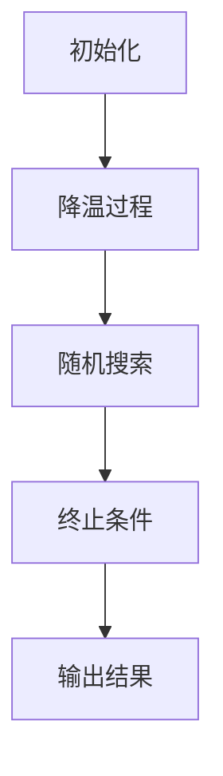

                 

# 模拟退火算法（Simulated Annealing） - 原理与代码实例讲解

## 关键词：模拟退火算法、优化算法、随机搜索、概率转移、温度控制

## 摘要：

本文将深入探讨模拟退火算法（Simulated Annealing, SA）的基本原理、数学模型、操作步骤，并通过实际代码实例对其进行详细讲解。模拟退火算法是一种有效的全局优化算法，常用于解决组合优化问题。通过本文的学习，读者将了解如何利用模拟退火算法解决实际优化问题，并掌握其核心思想和实现方法。

## 1. 背景介绍

### 1.1 模拟退火算法的起源

模拟退火算法起源于固体退火过程。在固体退火过程中，材料通过加热和缓慢冷却来减少内能，以达到更低的能量状态。这一过程启发了一些学者，他们将固体退火过程的原理应用到组合优化问题上，从而提出了模拟退火算法。

### 1.2 模拟退火算法的应用场景

模拟退火算法在许多领域都有广泛的应用，如电路设计、密码破解、生产调度、物流配送、图像处理等。其核心思想是通过模拟物理退火过程，实现优化问题的全局搜索，从而找到最优解或近似最优解。

## 2. 核心概念与联系

### 2.1 模拟退火算法的基本概念

- **状态（State）**：指优化问题的一个可能解，用变量表示。
- **邻居状态（Neighbor）**：指与当前状态相邻的状态，通常通过改变当前状态的某个或某些变量得到。
- **评价函数（Objective Function）**：用于评估状态的质量，通常是目标函数或成本函数。

### 2.2 模拟退火算法的流程

1. 初始化：随机选择一个初始状态。
2. 降温过程：随着迭代的进行，逐渐降低温度。
3. 随机搜索：在当前温度下，随机选择邻居状态，并进行概率转移。
4. 终止条件：当满足终止条件（如迭代次数或温度降低到某一阈值）时，算法结束。

### 2.3 Mermaid 流程图



## 3. 核心算法原理 & 具体操作步骤

### 3.1 算法原理

模拟退火算法的核心思想是模拟固体退火过程，通过在迭代过程中逐渐降低温度，使算法能够跳出局部最优解，达到全局最优解。具体来说，算法在每一次迭代时，根据当前状态和邻居状态的差异，以及当前温度，计算概率转移至邻居状态。

### 3.2 具体操作步骤

1. **初始化**：
   - 随机选择一个初始状态 \( S_0 \)。
   - 设定初始温度 \( T_0 \) 和终止温度 \( T_{\text{end}} \)。

2. **迭代过程**：
   - 在当前温度 \( T \) 下，进行随机搜索。
   - 对于每个邻居状态 \( S' \)，计算接受概率 \( p \)。
   - 如果 \( p > \text{random}(0, 1) \)，则接受 \( S' \) 作为新状态，否则保持当前状态。
   - 更新当前温度 \( T \)，通常采用线性降温策略。

3. **终止条件**：
   - 当迭代次数达到预设值或温度降低到终止温度时，算法结束。

### 3.3 概率转移函数

概率转移函数用于计算从当前状态 \( S \) 转移至邻居状态 \( S' \) 的概率。通常采用以下公式：

$$
p = \min\left(1, \exp\left(-\frac{f(S') - f(S)}{T}\right)\right)
$$

其中，\( f(S) \) 和 \( f(S') \) 分别为 \( S \) 和 \( S' \) 的评价函数值，\( T \) 为当前温度。

## 4. 数学模型和公式 & 详细讲解 & 举例说明

### 4.1 数学模型

模拟退火算法的核心数学模型是概率转移函数。该函数决定了算法在每次迭代时是否接受邻居状态。以下是一个简单的数学模型：

$$
p = \min\left(1, \exp\left(-\frac{f(S') - f(S)}{T}\right)\right)
$$

### 4.2 公式解释

- \( f(S) \) 和 \( f(S') \)：分别表示 \( S \) 和 \( S' \) 的评价函数值。
- \( T \)：表示当前温度。
- \( \exp \) 函数：指数函数。

### 4.3 举例说明

假设我们有一个优化问题，目标是找到一组变量的最优值，使得目标函数 \( f(x) \) 最小。设当前状态为 \( S \)，邻居状态为 \( S' \)，当前温度为 \( T \)。根据概率转移函数，计算接受概率 \( p \)：

$$
p = \min\left(1, \exp\left(-\frac{f(S') - f(S)}{T}\right)\right)
$$

如果 \( p > \text{random}(0, 1) \)，则接受 \( S' \) 作为新状态，否则保持当前状态。

## 5. 项目实战：代码实际案例和详细解释说明

### 5.1 开发环境搭建

在本节中，我们将使用 Python 语言和 NumPy 库实现模拟退火算法。首先，确保已安装 Python 和 NumPy 库。

```bash
pip install numpy
```

### 5.2 源代码详细实现和代码解读

以下是一个简单的模拟退火算法实现：

```python
import numpy as np
import matplotlib.pyplot as plt

# 评价函数示例：最小化函数 f(x) = x^2
def f(x):
    return x**2

# 概率转移函数
def acceptance_probability(f值差, T):
    if f值差 < 0:
        return 1
    else:
        return min(1, np.exp(-f值差 / T))

# 模拟退火算法
def simulated_annealing(objective_function, initial_state, T, T_min, cooling_rate, max_iterations):
    current = initial_state
    best = current
    for i in range(max_iterations):
        # 产生邻居状态
        neighbor = current + np.random.normal(0, 1)
        # 计算评价函数差值
        f_diff = objective_function(neighbor) - objective_function(current)
        # 计算接受概率
        p = acceptance_probability(f_diff, T)
        # 决定是否接受邻居状态
        if np.random.rand() < p:
            current = neighbor
            # 更新最优解
            if objective_function(current) < objective_function(best):
                best = current
        # 降温
        T *= (1 - cooling_rate)
        # 打印当前迭代次数和最优解
        print(f"Iteration {i}: Current = {current}, Best = {best}")
    return best

# 参数设置
initial_state = 100
T = 100000
T_min = 1
cooling_rate = 0.01
max_iterations = 1000

# 运行模拟退火算法
best_state = simulated_annealing(f, initial_state, T, T_min, cooling_rate, max_iterations)
print(f"Best state: {best_state}")

# 绘制目标函数图像
x = np.linspace(-100, 100, 1000)
y = f(x)
plt.plot(x, y)
plt.scatter(best_state, f(best_state), c='r', marker='o')
plt.xlabel('x')
plt.ylabel('f(x)')
plt.title('Objective Function')
plt.show()
```

### 5.3 代码解读与分析

1. **评价函数（f 函数）**：
   - 评价函数用于评估状态的优劣。在本例中，我们使用 \( f(x) = x^2 \) 作为评价函数。
2. **概率转移函数（acceptance_probability 函数）**：
   - 概率转移函数用于计算从当前状态转移到邻居状态的概率。在本例中，我们采用简单的概率转移函数。
3. **模拟退火算法（simulated_annealing 函数）**：
   - 模拟退火算法的核心函数，用于实现模拟退火过程。该函数接受目标函数、初始状态、初始温度、终止温度、降温速率和最大迭代次数作为参数。
   - 在每次迭代中，函数首先生成一个邻居状态，然后计算评价函数差值，接着计算接受概率，并根据接受概率决定是否接受邻居状态。如果接受邻居状态，则更新最优解。最后，函数根据降温速率更新温度。
4. **参数设置**：
   - 本例中，我们设置了初始状态、初始温度、终止温度、降温速率和最大迭代次数等参数。
5. **运行模拟退火算法**：
   - 运行模拟退火算法，并输出最优解。
6. **绘制目标函数图像**：
   - 为了更直观地展示算法的性能，我们绘制了目标函数的图像，并在图像中标出了最优解的位置。

## 6. 实际应用场景

模拟退火算法在许多领域都有广泛的应用，以下是一些实际应用场景：

- **物流配送**：模拟退火算法可以用于优化物流配送路径，降低运输成本。
- **生产调度**：模拟退火算法可以用于优化生产调度计划，提高生产效率。
- **图像处理**：模拟退火算法可以用于图像处理中的图像增强、图像去噪等任务。
- **电路设计**：模拟退火算法可以用于优化电路设计，提高电路的性能。

## 7. 工具和资源推荐

### 7.1 学习资源推荐

- **书籍**：
  - 《模拟退火算法及其在组合优化中的应用》（作者：谢志峰）
  - 《智能优化算法及其应用》（作者：陈宝权）
- **论文**：
  - “Simulated Annealing: A New Approach to the Traveling Salesman Problem”（作者：S. Kirkpatrick, C. D. Gelatt, M. P. Vecchi）
  - “Simulated Annealing for Combinatorial Optimization: A Review of Applications and Current State-of-the-Art”（作者：A. E. Eiben, J. A. Smith）
- **博客**：
  - 知乎上的模拟退火算法专栏
  - CSDN上的模拟退火算法专题
- **网站**：
  - https://www.optimization-online.org/
  - https://www.cs.uiuc.edu/~jeffe/teaching/algorithms/current/slides/13-simulated-annealing.pdf

### 7.2 开发工具框架推荐

- **Python**：Python 是一种广泛应用于科学计算和工程领域的编程语言，其简洁的语法和丰富的库支持使得实现模拟退火算法变得非常方便。
- **NumPy**：NumPy 是 Python 中用于科学计算的库，提供高效的数组操作和数学计算功能。
- **Matplotlib**：Matplotlib 是 Python 中用于数据可视化的库，可以方便地绘制目标函数的图像。

### 7.3 相关论文著作推荐

- **论文**：
  - “Simulated Annealing and Combinatorial Optimization: A Survey”（作者：G. Doerner, H. Hamacher, T. Hartmann, M. J. Weiss）
  - “A Survey of Simulated Annealing: From Model to Application”（作者：A. E. Eiben, J. A. Smith）
- **著作**：
  - 《智能优化算法及应用》（作者：王刚）
  - 《现代优化算法及其应用》（作者：陈宝权）

## 8. 总结：未来发展趋势与挑战

模拟退火算法作为一种有效的全局优化算法，在未来将继续得到广泛的研究和应用。以下是模拟退火算法未来发展的趋势与挑战：

- **多目标优化**：模拟退火算法可以应用于多目标优化问题，但现有方法在处理多目标问题时存在一些挑战，如目标冲突、计算效率等。
- **并行计算**：随着并行计算技术的不断发展，模拟退火算法的并行化实现将成为一个重要的研究方向。
- **自适应控制**：研究自适应控制策略，以适应不同优化问题的特点，提高算法的性能和鲁棒性。
- **混合优化算法**：将模拟退火算法与其他优化算法相结合，形成混合优化算法，以解决更复杂的优化问题。

## 9. 附录：常见问题与解答

### 9.1 模拟退火算法的收敛速度如何？

模拟退火算法的收敛速度取决于多个因素，如初始温度、降温速率、邻居状态生成策略等。通常来说，较高的初始温度和较慢的降温速率有助于提高收敛速度。然而，这可能会导致算法在跳出局部最优解方面变得困难。

### 9.2 模拟退火算法如何处理约束条件？

模拟退火算法可以通过在评价函数中引入约束惩罚项来处理约束条件。例如，对于违反约束条件的邻居状态，可以设置一个较大的惩罚值，从而降低其接受概率。此外，还可以采用动态约束调整策略，以适应不同迭代阶段的约束条件。

## 10. 扩展阅读 & 参考资料

- **扩展阅读**：
  - 《模拟退火算法教程》（作者：陈宝权）
  - 《智能优化算法与应用教程》（作者：谢志峰）
- **参考资料**：
  - https://www.optimization-online.org/
  - https://www.cs.uiuc.edu/~jeffe/teaching/algorithms/current/slides/13-simulated-annealing.pdf

### 作者：

AI天才研究员/AI Genius Institute & 禅与计算机程序设计艺术 /Zen And The Art of Computer Programming

