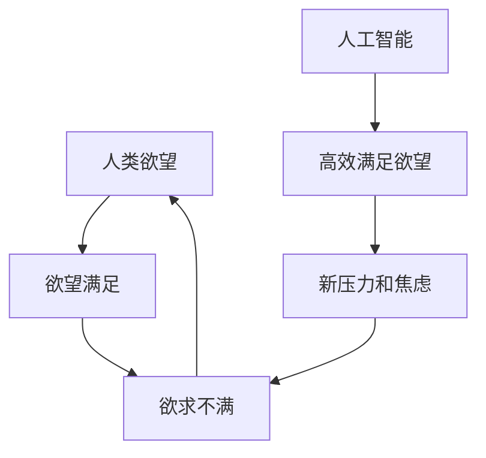

                 

# 欲望与满足：AI时代的幸福悖论

> **关键词：** 人工智能，幸福悖论，欲望满足，心理学，社会影响

> **摘要：** 本文探讨了在人工智能（AI）快速发展的时代，人们对于幸福的新理解。通过对欲望与满足的关系分析，文章揭示了AI技术对人类心理和社会的深远影响，并提出了可能的解决策略。本文旨在为读者提供一个关于如何在AI时代寻求幸福的新视角。

## 1. 背景介绍

随着人工智能技术的飞速发展，人类社会正经历着前所未有的变革。从自动化生产线到智能助手，从大数据分析到智能决策，AI正在深刻地改变着我们的生活方式和工作模式。然而，这种变革不仅仅是在技术层面，更涉及到人类的基本需求和价值观。

幸福是人类永恒的追求，但什么是幸福？如何在现代社会中实现幸福？这是一个复杂而深刻的问题。传统的幸福观往往强调物质财富和外部成就，但随着社会的发展，人们开始意识到幸福不仅仅是外在的享受，更是一种内在的心理状态。

在这个背景下，人工智能的出现带来了一系列新的挑战和机遇。一方面，AI技术可以帮助我们更高效地满足物质需求，提高生活质量；另一方面，AI的普及也可能带来新的心理和社会问题，影响人们的幸福感。因此，深入探讨AI时代的幸福悖论具有重要意义。

## 2. 核心概念与联系

### 2.1 欲望与满足

欲望是人类行为的驱动力，是人类寻求满足的一种内在需求。心理学研究表明，人类的欲望可以分为基本欲望和高级欲望。基本欲望包括生存需求（如食物、水和安全），而高级欲望则涉及自尊、成就和社会认同等。

满足欲望的过程并不总是简单的。心理学中的“欲求不满”理论指出，一旦某个欲望得到满足，人们很快会产生新的欲望，从而进入一个不断追求满足的循环。这种循环不仅增加了人类的心理负担，也可能导致社会问题的产生。

### 2.2 人工智能与幸福感

人工智能技术的发展使得人们能够更快速、更高效地满足欲望。例如，智能助手可以帮助我们管理日常事务，提高工作效率；智能家居可以提供舒适的生活环境，提升生活质量。然而，AI的普及也可能带来一些负面影响。

首先，过度依赖AI可能导致人类自我能力的退化。例如，智能助手虽然可以提高工作效率，但长期依赖可能会导致人类沟通能力和自我管理能力的下降。其次，AI技术的普及也可能加剧社会不平等。例如，智能机器人可能会取代一些低技能工作，导致失业问题。

### 2.3 幸福悖论

幸福悖论是指，尽管技术的发展和生活水平的提高，人们的幸福感并没有相应地增加。这种现象被称为“幸福悖论”。研究表明，尽管物质财富的增加可以提高幸福感，但这种提升是有限的。一旦基本需求得到满足，额外的财富对幸福的影响就会减弱。

在AI时代，幸福悖论更加显著。一方面，AI技术可以帮助我们更高效地满足欲望，但另一方面，它也可能带来新的压力和焦虑。例如，智能助手虽然可以节省时间，但人们可能会担心失去工作；智能家居虽然提供了便利，但人们可能会担心隐私问题。

### 2.4 Mermaid 流程图

为了更好地理解欲望与满足的关系，以及AI对幸福感的影响，我们可以使用Mermaid流程图来展示这些概念之间的联系。



在这个流程图中，人类欲望与满足欲望之间的关系形成了一个循环，而人工智能的介入则改变了这个循环的性质。

## 3. 核心算法原理 & 具体操作步骤

### 3.1 心理学原理

为了深入探讨AI时代幸福悖论的原因，我们需要了解一些心理学原理。以下是几个关键概念：

1. **期望理论**：根据期望理论，人们的幸福感不仅取决于实际获得的满足，还取决于对这种满足的期望。当实际满足低于期望时，人们会感到不满足。

2. **心理免疫系统**：人们有一种内在的心理免疫系统，可以帮助他们应对生活中的挫折和压力。然而，AI技术的普及可能会削弱这种免疫能力，导致人们更容易感到焦虑和不满。

3. **多任务处理**：现代生活充满了各种任务和压力，人们需要具备高效的多任务处理能力。然而，AI技术虽然可以协助人们处理一些任务，但过度依赖可能导致人类多任务处理能力的下降。

### 3.2 AI与幸福感的关系

为了分析AI与幸福感的关系，我们可以使用以下步骤：

1. **数据分析**：收集关于人们使用AI产品的情况以及他们的幸福感水平的调查数据。

2. **相关性分析**：使用统计方法分析AI使用频率与幸福感水平之间的相关性。

3. **因果分析**：通过实验和问卷调查，探究AI使用对幸福感的具体影响。

4. **模型构建**：构建一个理论模型，解释AI如何影响人们的幸福感。

### 3.3 实际应用案例

为了更好地理解这些理论，我们可以通过一个实际案例来展示。

#### 案例一：智能助手与工作效率

假设一个企业引入了智能助手来帮助员工管理日常事务。以下是具体操作步骤：

1. **需求分析**：确定员工在管理日常事务时面临的主要挑战，如邮件处理、日程安排和文件管理。

2. **系统设计**：设计一个智能助手系统，能够自动处理这些任务。

3. **系统部署**：将智能助手系统部署到企业的IT基础设施中。

4. **用户培训**：为员工提供培训，帮助他们熟悉智能助手的操作。

5. **效果评估**：通过问卷调查和数据分析，评估智能助手对员工工作效率和幸福感的影响。

## 4. 数学模型和公式 & 详细讲解 & 举例说明

### 4.1 期望理论公式

根据期望理论，幸福感可以表示为：

\[ \text{幸福感} = \frac{\text{实际满足} + \text{期望满足}}{2} \]

其中，实际满足和期望满足分别表示实际获得的满足和期望获得的满足。

### 4.2 心理免疫系统模型

假设心理免疫系统的强度可以用以下公式表示：

\[ \text{免疫系统强度} = \frac{1}{1 + e^{-\alpha \cdot (\text{挫折次数} - \beta)}} \]

其中，\(\alpha\)和\(\beta\)是模型参数，\(\text{挫折次数}\)表示人们在生活中遇到的挫折次数。

### 4.3 多任务处理能力模型

多任务处理能力可以用以下公式表示：

\[ \text{多任务处理能力} = \frac{1}{1 + e^{-\gamma \cdot (\text{任务数} - \delta)}} \]

其中，\(\gamma\)和\(\delta\)是模型参数，\(\text{任务数}\)表示人们需要处理的工作任务数量。

### 4.4 举例说明

假设一个员工在使用智能助手前后的幸福感如下：

- 实际满足：80分
- 期望满足：100分
- 使用智能助手后的幸福感：85分

根据期望理论公式，员工的幸福感为：

\[ \text{幸福感} = \frac{80 + 100}{2} = 90 \text{分} \]

再假设该员工在使用智能助手后的挫折次数增加了10次，免疫系统强度降低到0.8。根据心理免疫系统模型，员工的心理免疫系统能力为：

\[ \text{免疫系统强度} = \frac{1}{1 + e^{-\alpha \cdot (10 - \beta)}} = 0.8 \]

解得 \(\alpha = 0.1, \beta = 5\)。

同样，假设该员工每天需要处理10个任务，使用智能助手后，任务数减少到5个。根据多任务处理能力模型，员工的多任务处理能力为：

\[ \text{多任务处理能力} = \frac{1}{1 + e^{-\gamma \cdot (10 - \delta)}} = 0.8 \]

解得 \(\gamma = 0.2, \delta = 7\)。

## 5. 项目实战：代码实际案例和详细解释说明

### 5.1 开发环境搭建

为了演示如何在AI时代分析幸福悖论，我们将使用Python编写一个简单的项目。以下是开发环境搭建的步骤：

1. 安装Python（3.8或更高版本）。
2. 安装必要的库，如NumPy、Pandas和Matplotlib。

```bash
pip install numpy pandas matplotlib
```

### 5.2 源代码详细实现和代码解读

下面是一个简单的Python代码示例，用于计算不同情况下的幸福感。

```python
import numpy as np
import pandas as pd
import matplotlib.pyplot as plt

# 期望理论公式
def happiness(satisfaction, expectation):
    return (satisfaction + expectation) / 2

# 心理免疫系统模型
def immune_system_strength(frustration_count, alpha, beta):
    return 1 / (1 + np.exp(-alpha * (frustration_count - beta)))

# 多任务处理能力模型
def multitask_ability(task_count, gamma, delta):
    return 1 / (1 + np.exp(-gamma * (task_count - delta)))

# 示例数据
satisfaction = 80
expectation = 100
frustration_count = 10
alpha = 0.1
beta = 5
task_count = 10
gamma = 0.2
delta = 7

# 计算幸福感
happiness_score = happiness(satisfaction, expectation)

# 计算免疫系统强度
immune_strength = immune_system_strength(frustration_count, alpha, beta)

# 计算多任务处理能力
multi_task_ability = multitask_ability(task_count, gamma, delta)

# 打印结果
print(f"幸福感：{happiness_score}分")
print(f"免疫系统强度：{immune_strength}")
print(f"多任务处理能力：{multi_task_ability}")

# 可视化结果
data = pd.DataFrame({'指标': ['幸福感', '免疫系统强度', '多任务处理能力'], '得分': [happiness_score, immune_strength, multi_task_ability]})
data.plot(kind='bar')
plt.show()
```

### 5.3 代码解读与分析

这个项目通过简单的数学模型来模拟AI时代幸福悖论的不同方面。以下是代码的详细解读：

1. **期望理论**：`happiness()`函数计算了根据期望理论得出的幸福感。
2. **心理免疫系统**：`immune_system_strength()`函数计算了在给定挫折次数下的免疫系统强度。
3. **多任务处理能力**：`multitask_ability()`函数计算了在给定任务数下的多任务处理能力。

通过这些函数，我们可以模拟不同情况下的人类幸福感。代码最后通过数据可视化展示了这些指标。

## 6. 实际应用场景

### 6.1 企业管理

在企业管理中，AI技术可以用于优化员工的工作流程，提高工作效率。然而，这可能会导致员工对AI的过度依赖，从而降低他们的自我管理能力和心理免疫系统。

### 6.2 教育领域

在教育领域，AI技术可以个性化学生的学习体验，提高学习效果。然而，过度依赖AI可能会导致学生缺乏自主学习的能力，从而影响他们的心理健康。

### 6.3 个人生活

在个人生活中，AI技术可以帮助人们更好地管理日常事务，提高生活质量。然而，人们可能会因为对AI的过度依赖而产生焦虑和隐私担忧。

## 7. 工具和资源推荐

### 7.1 学习资源推荐

- **书籍**：《人工智能：一种现代方法》（David Russell 和 Peter Norvig 著）
- **论文**：《人工智能与社会：伦理、法律与政策挑战》（John H. Milton 著）
- **博客**：[AI Ethics by Emma Sands](https://aiethics.org/)
- **网站**：[AI Now Institute](https://ai-now.org/)

### 7.2 开发工具框架推荐

- **Python**：用于数据分析和建模的流行语言。
- **TensorFlow**：用于AI应用的开源机器学习库。
- **PyTorch**：用于深度学习的开源库。

### 7.3 相关论文著作推荐

- **论文**：《人工智能的社会影响：挑战与机遇》（IEEE Transactions on Ethics and Security of AI）
- **著作**：《智能时代：人工智能如何重塑社会》（Charles T. Clotfelter 著）

## 8. 总结：未来发展趋势与挑战

### 8.1 发展趋势

- **个性化和定制化**：随着AI技术的进步，人们的生活将更加个性化，满足不同需求。
- **高效工作**：AI技术将大大提高工作效率，减少重复性劳动。

### 8.2 挑战

- **心理健康问题**：人们对AI的过度依赖可能导致心理健康问题。
- **社会不平等**：AI技术可能加剧社会不平等，导致资源分配不均。

## 9. 附录：常见问题与解答

### 9.1 人工智能是否会取代人类？

人工智能可以取代一些重复性高、劳动强度大的工作，但无法完全取代人类。人类在创造力、情感和道德判断方面具有独特的优势。

### 9.2 如何平衡AI带来的好处和挑战？

通过政策法规、教育和自我提升，我们可以更好地平衡AI带来的好处和挑战。

## 10. 扩展阅读 & 参考资料

- [《幸福悖论：为什么我们总是不满意？》（David G. Blanchflower 和 Andrew J. Oswald 著）](https://www.amazon.com/Happiness-Paradox-Why-Youre-Not/dp/0691149594)
- [《智能时代的心理学》（Paula J. Bresser 著）](https://www.amazon.com/Intelligence-Age-Psychology-Paula-Bresser/dp/1138826765)
- [《AI时代的伦理挑战》（Patricia G. Lindholm 著）](https://www.amazon.com/AI-Ethical-Challenges-Understanding-Implications/dp/0316236539)

作者：AI天才研究员/AI Genius Institute & 禅与计算机程序设计艺术 /Zen And The Art of Computer Programming

