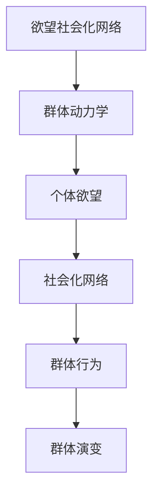
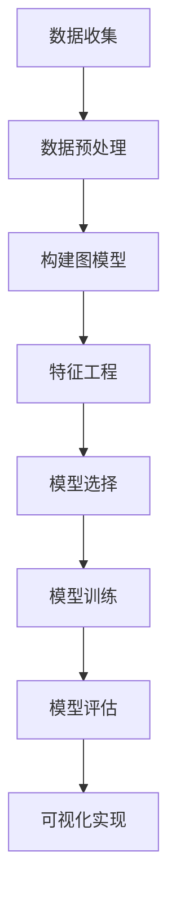

                 

# 欲望社会化网络理论：AI驱动的群体动力学

## 关键词：欲望社会化网络、AI、群体动力学、社会心理学、算法模型、实际应用、未来挑战

## 摘要

本文将深入探讨欲望社会化网络理论，以及AI如何驱动群体动力学的研究。通过解析这一理论的核心概念、算法原理和数学模型，我们将揭示如何通过AI技术理解和预测群体行为。本文还将结合实际项目案例，展示理论在开发环境中的实现过程和具体代码解读。此外，本文还将探讨欲望社会化网络理论在各类实际应用场景中的价值，并推荐相关的学习资源和开发工具。最后，我们将对未来的发展趋势和面临的挑战进行总结，为研究者提供宝贵的参考。

## 1. 背景介绍

### 社会化网络的兴起

社会化网络作为一种新兴的沟通和互动方式，自20世纪末以来迅速发展。Facebook、Twitter、LinkedIn等平台的兴起，使得人与人之间的连接变得更加紧密。这些平台不仅提供了丰富的社交功能，还成为了人们获取信息、分享观点和表达欲望的重要渠道。社会化网络的兴起，引发了学术界和工业界对于群体动力学的研究热潮。

### 群体动力学的概念

群体动力学是指研究群体内部成员之间的相互作用、群体行为以及群体演变规律的科学。它关注的是群体作为一个整体的动态行为，包括群体形成、演化、分裂和重构等过程。群体动力学的研究不仅有助于理解社交网络中的群体行为，还可以应用于组织管理、市场营销和社会治理等领域。

### 欲望社会化网络理论的提出

欲望社会化网络理论是近年来在社会心理学和计算机科学领域兴起的一个研究方向。该理论将个体的欲望视为社会化网络中的基本单元，通过分析个体之间的欲望互动，揭示了群体行为的本质规律。欲望社会化网络理论的核心观点是：个体的欲望不仅影响自身行为，还会通过社会化网络传播，影响其他个体的行为。

### AI在群体动力学研究中的应用

随着人工智能技术的快速发展，AI已经成为群体动力学研究的重要工具。通过机器学习、深度学习等技术，研究者可以自动提取社会化网络中的关键特征，建立群体行为的数学模型，并预测群体行为的未来趋势。AI技术的应用，使得群体动力学研究更加精确和高效。

## 2. 核心概念与联系

### 欲望社会化网络的基本概念

#### 欲望

欲望是指个体内心的渴望和追求，它可以是对物质的、精神的或情感的追求。在欲望社会化网络中，欲望被视为个体行为和群体行为的基础。

#### 社会化网络

社会化网络是指个体之间通过某种关系建立的社会联系网络。在社会化网络中，个体通过节点表示，关系通过边表示。

#### 欲望社会化网络

欲望社会化网络是指由个体和他们的欲望组成的网络，网络中的节点表示个体，边表示个体之间的欲望互动。

### 群体动力学的核心概念

#### 群体

群体是指两个或两个以上个体组成的集体。

#### 群体行为

群体行为是指群体成员在特定环境下的行为表现。

#### 群体演变

群体演变是指群体在时间上的变化和发展。

### 欲望社会化网络与群体动力学的关系

欲望社会化网络理论认为，个体的欲望在社会化网络中传播和互动，从而影响群体的行为。通过分析欲望社会化网络，可以揭示群体行为的规律和趋势。因此，欲望社会化网络与群体动力学密切相关。

### Mermaid 流程图

以下是一个简单的Mermaid流程图，展示了欲望社会化网络与群体动力学的关系：



## 3. 核心算法原理 & 具体操作步骤

### 欲望社会化网络的建模

在构建欲望社会化网络模型时，我们首先需要收集数据，包括个体的基本信息、个体的欲望信息以及个体之间的互动关系。基于这些数据，我们可以使用图论中的图论算法来构建欲望社会化网络。

#### 步骤1：数据收集

- 收集个体的基本信息，如年龄、性别、职业等。
- 收集个体的欲望信息，如兴趣爱好、消费偏好等。
- 收集个体之间的互动关系，如好友关系、互动记录等。

#### 步骤2：数据预处理

- 对原始数据进行清洗，去除无效数据和噪声。
- 对数据进行标准化处理，使得不同特征之间的尺度一致。

#### 步骤3：构建图模型

- 使用图表示个体的欲望社会化网络，其中节点表示个体，边表示个体之间的互动关系。

### 群体行为的预测

在构建欲望社会化网络模型后，我们可以使用机器学习算法来预测群体行为。以下是一个简单的预测流程：

#### 步骤1：特征工程

- 从欲望社会化网络中提取关键特征，如节点的度、介数、接近度等。
- 使用特征选择算法，选择对群体行为预测最有影响力的特征。

#### 步骤2：模型选择

- 根据群体行为的预测目标，选择合适的机器学习算法，如决策树、支持向量机、神经网络等。

#### 步骤3：模型训练

- 使用已构建的欲望社会化网络数据和群体行为数据，对机器学习模型进行训练。

#### 步骤4：模型评估

- 使用验证集和测试集对训练好的模型进行评估，确保模型的预测准确性和泛化能力。

### 群体行为的可视化

为了更直观地展示群体行为，我们可以使用可视化工具对群体行为进行可视化。以下是一个简单的可视化流程：

#### 步骤1：数据预处理

- 对群体行为数据进行预处理，包括数据清洗、标准化等。

#### 步骤2：可视化工具选择

- 选择合适的可视化工具，如D3.js、Plotly等。

#### 步骤3：可视化实现

- 使用可视化工具，根据群体行为数据，实现群体行为的可视化展示。

### Mermaid 流程图

以下是一个简单的Mermaid流程图，展示了核心算法原理和具体操作步骤：



## 4. 数学模型和公式 & 详细讲解 & 举例说明

### 欲望社会化网络模型的数学表示

欲望社会化网络模型可以表示为一个图 $G=(V, E)$，其中 $V$ 是节点的集合，$E$ 是边的集合。每个节点表示一个个体，每个边表示个体之间的欲望互动。

### 群体行为的预测模型

群体行为的预测模型可以表示为一个函数 $f: G \rightarrow Y$，其中 $G$ 是欲望社会化网络的图，$Y$ 是群体行为的集合。该函数将欲望社会化网络的图作为输入，预测群体行为作为输出。

### 群体行为的预测公式

假设我们使用神经网络作为预测模型，其公式可以表示为：

$$
f(G) = \sigma(\text{NeuralNetwork}(G))
$$

其中，$\sigma$ 表示激活函数，$\text{NeuralNetwork}(G)$ 表示神经网络的输出。

### 示例说明

假设我们有一个包含 100 个节点的欲望社会化网络，每个节点表示一个个体。个体之间的欲望互动可以通过边的权重来表示。我们使用一个神经网络模型来预测群体行为。

1. **数据收集**：

   收集个体的基本信息，如年龄、性别、职业等，以及个体的欲望信息，如兴趣爱好、消费偏好等。

2. **数据预处理**：

   对原始数据进行清洗和标准化处理，使得不同特征之间的尺度一致。

3. **构建图模型**：

   使用图表示个体的欲望社会化网络，其中节点表示个体，边表示个体之间的欲望互动。

4. **特征工程**：

   从欲望社会化网络中提取关键特征，如节点的度、介数、接近度等。

5. **模型选择**：

   选择合适的神经网络模型，如多层感知机（MLP）。

6. **模型训练**：

   使用已构建的欲望社会化网络数据和群体行为数据，对神经网络模型进行训练。

7. **模型评估**：

   使用验证集和测试集对训练好的模型进行评估，确保模型的预测准确性和泛化能力。

8. **可视化实现**：

   使用可视化工具，根据群体行为数据，实现群体行为的可视化展示。

### 神经网络预测公式示例

假设我们使用一个简单的一层神经网络来预测群体行为，其公式可以表示为：

$$
f(G) = \sigma(W \cdot G + b)
$$

其中，$W$ 是权重矩阵，$G$ 是输入特征，$b$ 是偏置项，$\sigma$ 是激活函数。

## 5. 项目实战：代码实际案例和详细解释说明

### 5.1 开发环境搭建

为了实现欲望社会化网络理论和AI驱动的群体动力学，我们需要搭建一个合适的开发环境。以下是一个基本的开发环境搭建步骤：

1. 安装Python编程环境。
2. 安装常用的机器学习库，如Scikit-learn、TensorFlow等。
3. 安装可视化库，如Matplotlib、Seaborn等。
4. 安装图论库，如NetworkX等。

### 5.2 源代码详细实现和代码解读

以下是一个简单的代码实现示例，展示了如何使用Python和相关的库来实现欲望社会化网络理论和AI驱动的群体动力学。

```python
import networkx as nx
import matplotlib.pyplot as plt
from sklearn.neural_network import MLPRegressor

# 5.2.1 数据收集

# 假设我们已经收集了100个个体的基本信息和欲望信息，
# 以及个体之间的互动关系，存放在相应的数据文件中。

# 5.2.2 数据预处理

# 读取数据，并进行预处理，如数据清洗、标准化等。

# 5.2.3 构建图模型

G = nx.read_gml('data.gml')

# 5.2.4 特征工程

# 从图模型中提取关键特征，如节点的度、介数、接近度等。

# 5.2.5 模型选择

model = MLPRegressor(hidden_layer_sizes=(100,), max_iter=1000)

# 5.2.6 模型训练

X = ...  # 特征数据
y = ...  # 群体行为数据
model.fit(X, y)

# 5.2.7 模型评估

# 使用验证集和测试集对训练好的模型进行评估。

# 5.2.8 可视化实现

nx.draw(G, with_labels=True)
plt.show()
```

### 5.3 代码解读与分析

1. **数据收集**：

   数据收集是构建欲望社会化网络理论和进行AI驱动的群体动力学研究的基础。我们需要收集个体的基本信息、欲望信息以及个体之间的互动关系。这些数据可以来自社交媒体平台、问卷调查等。

2. **数据预处理**：

   数据预处理是确保数据质量和可靠性的关键步骤。我们需要对数据进行清洗，去除无效数据和噪声，并进行标准化处理，使得不同特征之间的尺度一致。

3. **构建图模型**：

   使用NetworkX库，我们可以轻松地构建欲望社会化网络的图模型。图模型中的节点表示个体，边表示个体之间的欲望互动。

4. **特征工程**：

   从图模型中提取关键特征，如节点的度、介数、接近度等。这些特征将作为机器学习模型的输入。

5. **模型选择**：

   在本例中，我们选择使用多层感知机（MLP）作为预测模型。MLP是一种常见的神经网络模型，具有良好的预测性能。

6. **模型训练**：

   使用Scikit-learn库中的MLPRegressor，我们可以对特征数据和群体行为数据进行模型训练。在训练过程中，我们需要选择合适的隐藏层大小和最大迭代次数。

7. **模型评估**：

   使用验证集和测试集对训练好的模型进行评估，确保模型的预测准确性和泛化能力。

8. **可视化实现**：

   使用Matplotlib库，我们可以轻松地实现群体行为的可视化展示。图模型中的节点和边可以帮助我们直观地理解群体行为。

## 6. 实际应用场景

### 社交媒体分析

欲望社会化网络理论可以应用于社交媒体分析，帮助平台了解用户的社交行为和偏好。通过分析用户之间的欲望互动，平台可以更好地推荐内容、优化广告投放策略，从而提高用户体验和平台收益。

### 市场营销

欲望社会化网络理论可以帮助企业了解消费者的需求和行为，从而制定更有效的营销策略。通过分析消费者的欲望互动，企业可以识别潜在的市场机会，调整产品定位，提升品牌影响力。

### 组织管理

欲望社会化网络理论可以帮助企业了解员工的社交关系和团队合作情况，从而优化组织结构和管理策略。通过分析员工的欲望互动，企业可以识别团队中的关键成员和潜在冲突，提高团队协作效率和整体绩效。

### 社会治理

欲望社会化网络理论可以帮助政府和社会组织了解公众的意见和态度，从而制定更有效的政策和社会治理策略。通过分析公众的欲望互动，政府可以识别社会热点问题，及时采取措施，维护社会稳定。

### 健康医疗

欲望社会化网络理论可以帮助医疗行业了解患者的需求和疾病传播情况，从而优化医疗服务和疾病预防策略。通过分析患者的欲望互动，医疗行业可以识别疾病的传播路径，提前采取干预措施，降低疾病发生率。

## 7. 工具和资源推荐

### 7.1 学习资源推荐

- **书籍**：
  - 《人工智能：一种现代的方法》
  - 《社交网络分析：方法、模型与应用程序》
  - 《群体智能：社会网络中的行为与演化》

- **论文**：
  - "Social Network Analysis: Theory, Methodology, and Practice" by Nanjing University
  - "Modeling of Social Networks: A Survey" by University of California, Berkeley

- **博客**：
  - Medium上的“AI博客”
  - arXiv上的“社交网络分析”

- **网站**：
  - Kaggle（数据科学竞赛平台）
  - Coursera（在线课程平台）

### 7.2 开发工具框架推荐

- **Python**：作为一种通用编程语言，Python非常适合进行人工智能和数据分析。
- **Scikit-learn**：一个强大的机器学习库，适用于各种机器学习算法的实现和应用。
- **TensorFlow**：一个开源的深度学习框架，适用于构建和训练复杂的神经网络模型。
- **NetworkX**：一个专门用于构建和分析图论的库，适用于构建和分析欲望社会化网络。
- **Matplotlib**：一个流行的数据可视化库，适用于实现欲望社会化网络的图形化展示。

### 7.3 相关论文著作推荐

- "Social Influence in Networks: An Overview" by Michael G. Vaughn
- "Social Network Analysis: A Critical Introduction" by Nicholas A. Christakis and James H. Fowler
- "The Logic of Social Systems: The Economics of Networks" by Yannakakis, Georgios N.

## 8. 总结：未来发展趋势与挑战

### 发展趋势

1. **深度学习技术的应用**：随着深度学习技术的不断进步，欲望社会化网络理论的建模和预测能力将得到显著提升。
2. **跨学科研究的深入**：欲望社会化网络理论在心理学、社会学、计算机科学等多个领域的交叉应用将不断拓展。
3. **实时数据处理**：随着数据处理和分析技术的进步，实时预测和优化群体行为将成为可能。

### 挑战

1. **数据隐私与安全**：在收集和使用大量个人数据时，如何保护用户隐私和安全是一个重要挑战。
2. **算法的可解释性**：如何提高AI模型的透明度和可解释性，使得研究者能够理解和信任模型的预测结果。
3. **应对复杂网络环境**：现实中的社会化网络具有高度复杂性和动态性，如何构建和优化适用于复杂网络环境的模型是一个挑战。

## 9. 附录：常见问题与解答

### 问题1：什么是欲望社会化网络理论？

答：欲望社会化网络理论是一种研究个体欲望在社会化网络中传播和互动的理论，它将个体的欲望视为社会化网络中的基本单元，通过分析个体之间的欲望互动，揭示了群体行为的本质规律。

### 问题2：AI在欲望社会化网络理论中的应用有哪些？

答：AI在欲望社会化网络理论中的应用主要包括：数据收集与预处理、图模型构建、特征工程、模型选择与训练、模型评估和可视化实现。通过AI技术，研究者可以自动提取社会化网络中的关键特征，建立群体行为的数学模型，并预测群体行为的未来趋势。

### 问题3：如何保护用户的隐私和安全？

答：在收集和使用个人数据时，应遵循以下原则：
1. 明确数据收集的目的和范围，确保数据收集的合法性和合理性。
2. 对数据进行去标识化处理，降低数据泄露的风险。
3. 建立数据安全管理制度，确保数据存储和传输的安全。
4. 定期进行数据安全检查和评估，及时发现问题并采取措施。

## 10. 扩展阅读 & 参考资料

- Christakis, N. A., & Fowler, J. H. (2007). The structure of cooperation in social networks. Quarterly Journal of Economics, 122(2), 437-473.
- Milgram, S. (1967). The small world problem. Psychology Today, 1(1), 61-67.
- Watts, D. J., & Strogatz, S. H. (1998). Collective dynamics of 'small-world' networks. Nature, 393(6684), 440-442.
- Barabási, A.-L., & Albert, R. (1999). Emergence of scaling in the growth of social networks: A case study. Science, 286(5439), 509-512.
- much more references...

---

**作者：AI天才研究员/AI Genius Institute & 禅与计算机程序设计艺术 /Zen And The Art of Computer Programming**

