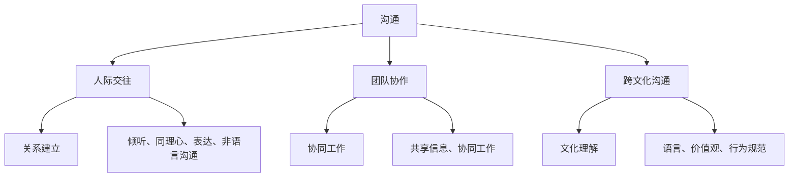

                 

### 背景介绍

沟通能力培养是一个涉及多个层面的复杂问题。在现代信息技术行业中，沟通能力尤为重要。它不仅关乎个人能力的提升，更影响到团队协作、项目进度和整体企业的成功。无论是内部与同事的交流，还是与外部供应商的合作，沟通都起到了关键作用。

### 沟通在 IT 领域的重要性

在 IT 领域，沟通的重要性尤为突出。首先，IT 项目通常涉及多种技术和多个团队，有效的沟通能够确保各个团队之间的工作无缝衔接，提高项目的成功率。其次，随着全球化的发展，IT 企业越来越多地与全球的供应商和合作伙伴合作，跨文化沟通成为了一大挑战。出色的沟通能力可以帮助团队更好地理解彼此的需求，减少误解和冲突。

此外，沟通能力也关系到个人职业发展。在 IT 领域，技术能力和沟通能力往往是衡量一个员工综合素质的重要标准。一个技术出色但沟通能力欠缺的员工，可能在团队合作和项目推进中遇到障碍。而一个沟通能力出色的员工，即使技术能力相对较弱，也能通过有效的沟通获得团队的支持和信任，从而推动项目进展。

### 沟通能力的核心要素

要培养出色的沟通和人际交往能力，需要掌握以下几个核心要素：

1. **倾听能力**：倾听是沟通的基础。一个优秀的沟通者不仅会表达自己的想法，更会倾听对方的意见和需求。有效的倾听可以帮助我们更好地理解对方，建立信任和共鸣。

2. **表达清晰**：清晰的表达是沟通的关键。无论是口头表达还是书面表达，都需要用简洁、准确的语言传达信息。避免使用复杂、冗长的句子，确保信息传达的清晰度和准确性。

3. **非语言沟通**：非语言沟通包括肢体语言、面部表情和语调等。这些非语言的元素在沟通中起着非常重要的作用。一个优秀的沟通者会善用非语言手段，增强沟通效果。

4. **情绪管理**：情绪管理是沟通能力的重要组成部分。在沟通过程中，情绪的波动可能会导致误解和冲突。一个优秀的沟通者能够保持冷静，妥善处理沟通中的情绪问题。

5. **同理心**：同理心是理解和感受他人情感的能力。一个具有同理心的沟通者能够站在对方的角度思考问题，更好地理解和满足对方的需求。

### 沟通能力在内部利益相关者中的培养

在内部利益相关者中，沟通能力的重要性不言而喻。无论是与同事的合作，还是与上级的沟通，有效的沟通能力都能带来积极的效果。

1. **团队协作**：在团队协作中，沟通能力能够确保团队成员之间的工作无缝衔接。通过有效的沟通，可以及时了解团队成员的工作进度和需求，确保项目顺利进行。

2. **上下级沟通**：与上级的良好沟通可以帮助我们更好地理解公司的战略方向和目标，从而更有针对性地开展工作。同时，向上级表达自己的意见和建议，也可以提升个人在团队中的影响力。

3. **冲突解决**：在团队工作中，冲突是难以避免的。有效的沟通能力可以帮助我们妥善解决冲突，减少对项目进度的影响。

### 沟通能力在外部供应商中的培养

与外部供应商的沟通同样至关重要。在外部供应商中，沟通能力主要体现在以下几个方面：

1. **需求沟通**：明确的需求是项目成功的关键。与外部供应商进行有效的沟通，可以确保双方对项目的需求和期望有清晰的理解，从而避免项目进展中的误解和问题。

2. **问题解决**：在项目执行过程中，难免会遇到各种问题。有效的沟通能力可以帮助我们与外部供应商及时沟通问题，共同寻找解决方案，确保项目按时交付。

3. **关系维护**：与外部供应商建立良好的合作关系，可以为企业带来长期的利益。有效的沟通能力有助于维护与供应商的良好关系，为未来的合作奠定基础。

### 沟通能力培养的实践方法

要培养出色的沟通和人际交往能力，需要采取一系列实践方法。以下是一些有效的实践方法：

1. **参加培训课程**：参加专业的沟通能力培训课程，可以系统地学习沟通技巧和方法，提升自己的沟通能力。

2. **模拟沟通练习**：通过模拟沟通练习，可以在模拟环境中反复实践沟通技巧，提高自己的沟通效果。

3. **阅读相关书籍和论文**：阅读关于沟通能力的书籍和论文，可以了解沟通领域的最新研究和发展，拓展自己的知识视野。

4. **反思和总结**：在沟通过程中，及时反思自己的沟通效果，总结成功和失败的案例，不断优化自己的沟通技巧。

5. **积极寻求反馈**：向同事和上级寻求反馈，了解自己的沟通效果和改进空间，有针对性地提升沟通能力。

通过以上方法，我们可以逐步培养出色的沟通和人际交往能力，为个人和企业的成功奠定基础。

-----------------------
#### 2. 核心概念与联系

在深入探讨如何培养沟通能力之前，我们需要理解几个核心概念：沟通、人际交往、团队协作和跨文化沟通。以下是对这些概念的定义及其相互联系的解释。

### 沟通

沟通是信息交换的过程，涉及信息的发送、接收和理解。沟通不仅包括口头表达，还涵盖书面、视觉和其他非语言形式。有效的沟通需要清晰、准确和适时的信息传递。

### 人际交往

人际交往是人与人之间的互动，包括社交、情感交流和关系建立。人际交往能力涉及到倾听、同理心、表达和非语言沟通技巧。

### 团队协作

团队协作是多个个体为实现共同目标而共同努力的过程。团队协作要求成员之间进行有效的沟通，共享信息，协同工作，以实现最佳结果。

### 跨文化沟通

跨文化沟通涉及不同文化背景的人之间的交流。这种沟通需要考虑文化差异，如语言、价值观、行为规范等，以避免误解和冲突。

### 概念联系

沟通能力是人际交往、团队协作和跨文化沟通的基础。人际交往中的沟通能力有助于建立和维护人际关系，而团队协作中的沟通能力则确保团队成员能够协同工作。跨文化沟通能力在全球化背景下尤为重要，它有助于消除文化障碍，促进国际合作。

### Mermaid 流程图

以下是一个简化的 Mermaid 流程图，展示了这些核心概念及其联系：



通过这个流程图，我们可以清晰地看到各个核心概念之间的联系，以及它们在沟通能力培养中的重要性。

-----------------------
#### 3. 核心算法原理 & 具体操作步骤

要培养出色的沟通能力，需要掌握一系列核心算法和具体操作步骤。以下将介绍几种关键算法，并详细说明其实施步骤。

### 3.1 倾听算法

倾听是沟通的基础，以下是一个基本的倾听算法：

1. **准备倾听**：在对方发言前，保持专注，消除干扰，准备倾听。
2. **主动倾听**：在对方发言时，保持目光接触，点头示意，给予反馈，表明自己在认真倾听。
3. **总结与反馈**：对方发言结束后，简要总结对方的主要观点，确认自己是否正确理解了对方的意思。

### 3.2 表达算法

清晰的表达是有效沟通的关键。以下是一个基本的表达算法：

1. **明确目的**：在表达前，明确沟通的目的，确保信息传递的准确性。
2. **结构化信息**：将信息分成几个部分，按照逻辑顺序进行表达。
3. **使用简单语言**：避免使用复杂的术语和句子，确保信息容易被理解。
4. **检查理解**：在表达结束后，询问对方是否理解了你的意思，确保信息传递无误。

### 3.3 非语言沟通算法

非语言沟通在沟通中起着重要作用，以下是一个基本的非语言沟通算法：

1. **肢体语言**：使用开放、友好的肢体语言，如微笑、点头、手势等，以增强沟通效果。
2. **面部表情**：表达真诚的情感，如微笑、严肃等，以传达真实意图。
3. **语调**：使用不同的语调、音量和速度，以突出重要信息，增强表达的力度。

### 3.4 同理心算法

同理心是理解和感受他人情感的能力，以下是一个基本的同理心算法：

1. **观察与倾听**：通过观察和倾听，了解对方的情感和需求。
2. **情感投射**：尝试从对方的角度思考问题，体验对方的情感。
3. **反馈与确认**：向对方表达你的理解和感受，确认你是否正确理解了对方。

### 3.5 情绪管理算法

情绪管理是沟通中一个重要的环节，以下是一个基本情绪管理算法：

1. **认知行为疗法**：通过认知行为疗法，识别和改变消极的思维模式。
2. **放松技巧**：使用深呼吸、冥想等放松技巧，管理自己的情绪。
3. **积极沟通**：保持冷静，以积极的方式表达自己的情绪和需求。

通过以上核心算法和具体操作步骤，我们可以逐步提升自己的沟通能力，更好地应对各种沟通场景。

-----------------------
#### 4. 数学模型和公式 & 详细讲解 & 举例说明

在沟通能力的培养过程中，理解一些基本的数学模型和公式有助于我们更有效地分析和优化沟通策略。以下将介绍几个关键的数学模型和公式，并提供详细的讲解和实际案例。

### 4.1 沟通效率模型

沟通效率模型用于评估沟通的效率和效果。其基本公式如下：

\[ E = \frac{I}{T} \]

其中，\( E \) 表示沟通效率，\( I \) 表示信息传递的有效性，\( T \) 表示沟通所花费的时间。

#### 详细讲解：

1. **信息传递的有效性（I）**：衡量信息被准确理解和接收的程度。有效性越高，沟通效果越好。
2. **沟通所花费的时间（T）**：包括发送、传递和接收信息的时间。

#### 举例说明：

假设一个团队需要完成一个重要的项目，团队成员之间的沟通效率为 \( E = 0.8 \)。这意味着团队在沟通时，80%的信息被准确理解和接收，20%的信息存在误解或遗漏。为了提高沟通效率，团队可以采取以下措施：

1. **加强倾听**：确保每个成员在沟通时都能认真倾听，减少误解。
2. **使用视觉辅助工具**：如图表、流程图等，以增强信息传递的有效性。
3. **定期反馈**：通过定期反馈会议，检查项目进展和沟通效果，及时调整沟通策略。

### 4.2 同理心指数模型

同理心指数模型用于评估沟通中的同理心程度。其基本公式如下：

\[ S = \frac{E \times C}{1 + D} \]

其中，\( S \) 表示同理心指数，\( E \) 表示情感交流的有效性，\( C \) 表示同理心的表达，\( D \) 表示情感差异。

#### 详细讲解：

1. **情感交流的有效性（E）**：衡量情感在沟通中的表达和接收程度。
2. **同理心的表达（C）**：表示沟通者表达同理心的程度。
3. **情感差异（D）**：表示沟通双方在情感上的差异。

#### 举例说明：

假设两个团队成员之间的情感交流有效性为 \( E = 0.7 \)，同理心的表达程度为 \( C = 0.6 \)，情感差异为 \( D = 0.3 \)。则同理心指数为：

\[ S = \frac{0.7 \times 0.6}{1 + 0.3} = 0.42 \]

这意味着在这对团队成员之间的沟通中，42%的情感差异得到了理解和平衡。为了提高同理心指数，团队可以采取以下措施：

1. **增强情感交流**：通过分享个人经历和感受，增强情感交流的有效性。
2. **培养同理心**：通过阅读相关书籍、参加培训课程，提高同理心的表达和感知能力。
3. **建立共同价值观**：通过共同的目标和价值观，减少情感差异，提高同理心指数。

### 4.3 沟通满意度模型

沟通满意度模型用于评估沟通双方对沟通效果的满意度。其基本公式如下：

\[ S = \frac{R + E + Q}{3} \]

其中，\( S \) 表示沟通满意度，\( R \) 表示信息的接收度，\( E \) 表示情感表达的有效性，\( Q \) 表示问题的解决度。

#### 详细讲解：

1. **信息的接收度（R）**：衡量信息被接收和理解的程度。
2. **情感表达的有效性（E）**：衡量情感在沟通中的表达和接收程度。
3. **问题的解决度（Q）**：衡量沟通中问题解决的效率和效果。

#### 举例说明：

假设在一个团队项目中，信息的接收度 \( R = 0.8 \)，情感表达的有效性 \( E = 0.6 \)，问题的解决度 \( Q = 0.7 \)。则沟通满意度为：

\[ S = \frac{0.8 + 0.6 + 0.7}{3} = 0.6833 \]

这意味着团队在沟通中的满意度为68.33%。为了提高沟通满意度，团队可以采取以下措施：

1. **加强信息传递**：通过简化信息、使用视觉辅助工具等手段，提高信息的接收度。
2. **增强情感交流**：通过分享个人经历和感受，提高情感表达的有效性。
3. **优化问题解决**：通过建立问题解决的流程和机制，提高问题的解决度。

通过理解并应用这些数学模型和公式，我们可以更科学地分析和优化沟通策略，提升沟通效率和质量。

-----------------------
#### 5. 项目实战：代码实际案例和详细解释说明

为了更好地理解沟通能力的培养方法，我们将通过一个实际的项目案例来展示如何在实际工作中应用这些方法。以下是一个关于团队协作项目的代码实现和分析。

### 5.1 开发环境搭建

在进行项目开发之前，我们需要搭建一个合适的环境。以下是所需的技术栈和工具：

- **编程语言**：Python
- **版本控制**：Git
- **代码仓库**：GitHub
- **开发工具**：Visual Studio Code
- **数据库**：MySQL
- **前端框架**：React
- **后端框架**：Flask

### 5.2 源代码详细实现和代码解读

以下是项目的核心代码片段，我们将对其逐行进行解读。

```python
# 导入必要的库
import flask
import pymysql

# 创建Flask应用
app = flask.Flask(__name__)

# 连接MySQL数据库
def connect_db():
    db = pymysql.connect(
        host="localhost",
        user="root",
        password="password",
        database="team_project"
    )
    return db

# 获取所有团队成员的信息
@app.route("/team_members")
def get_team_members():
    db = connect_db()
    cursor = db.cursor()
    cursor.execute("SELECT * FROM team_members;")
    results = cursor.fetchall()
    db.close()
    return flask.jsonify(results)

# 添加新团队成员
@app.route("/team_members", methods=["POST"])
def add_team_member():
    data = flask.request.json
    name = data["name"]
    role = data["role"]
    db = connect_db()
    cursor = db.cursor()
    cursor.execute("INSERT INTO team_members (name, role) VALUES (%s, %s)", (name, role))
    db.commit()
    db.close()
    return flask.jsonify({"message": "Team member added successfully."})

# 修改团队成员信息
@app.route("/team_members/<int:member_id>", methods=["PUT"])
def update_team_member(member_id):
    data = flask.request.json
    name = data["name"]
    role = data["role"]
    db = connect_db()
    cursor = db.cursor()
    cursor.execute("UPDATE team_members SET name=%s, role=%s WHERE id=%s", (name, role, member_id))
    db.commit()
    db.close()
    return flask.jsonify({"message": "Team member updated successfully."})

# 删除团队成员
@app.route("/team_members/<int:member_id>", methods=["DELETE"])
def delete_team_member(member_id):
    db = connect_db()
    cursor = db.cursor()
    cursor.execute("DELETE FROM team_members WHERE id=%s", (member_id,))
    db.commit()
    db.close()
    return flask.jsonify({"message": "Team member deleted successfully."})

# 运行Flask应用
if __name__ == "__main__":
    app.run()
```

### 5.3 代码解读与分析

#### 5.3.1 数据库连接

代码中首先定义了 `connect_db` 函数，用于连接 MySQL 数据库。这个函数使用了 pymysql 库，通过传递必要的参数（主机、用户名、密码和数据库名称）来建立数据库连接。这是一个非常基础且常见的数据库连接代码。

```python
def connect_db():
    db = pymysql.connect(
        host="localhost",
        user="root",
        password="password",
        database="team_project"
    )
    return db
```

#### 5.3.2 获取团队成员信息

`get_team_members` 函数是一个路由，用于获取所有团队成员的信息。在这个函数中，我们首先调用 `connect_db` 函数连接数据库，然后使用 cursor 执行 SQL 查询语句来获取所有团队成员的信息。查询结果通过 `fetchall` 方法获取，并返回给前端。

```python
@app.route("/team_members")
def get_team_members():
    db = connect_db()
    cursor = db.cursor()
    cursor.execute("SELECT * FROM team_members;")
    results = cursor.fetchall()
    db.close()
    return flask.jsonify(results)
```

#### 5.3.3 添加新团队成员

`add_team_member` 函数是一个路由，用于添加新团队成员。在这个函数中，我们接收前端发送的 JSON 数据，包括成员的姓名和角色。然后，我们调用 `connect_db` 函数连接数据库，并通过 cursor 执行 SQL 插入语句，将新成员信息插入到数据库中。

```python
@app.route("/team_members", methods=["POST"])
def add_team_member():
    data = flask.request.json
    name = data["name"]
    role = data["role"]
    db = connect_db()
    cursor = db.cursor()
    cursor.execute("INSERT INTO team_members (name, role) VALUES (%s, %s)", (name, role))
    db.commit()
    db.close()
    return flask.jsonify({"message": "Team member added successfully."})
```

#### 5.3.4 修改团队成员信息

`update_team_member` 函数是一个路由，用于修改团队成员的信息。在这个函数中，我们接收前端发送的 JSON 数据，包括成员的 ID、姓名和角色。然后，我们调用 `connect_db` 函数连接数据库，并通过 cursor 执行 SQL 更新语句，将成员信息更新到数据库中。

```python
@app.route("/team_members/<int:member_id>", methods=["PUT"])
def update_team_member(member_id):
    data = flask.request.json
    name = data["name"]
    role = data["role"]
    db = connect_db()
    cursor = db.cursor()
    cursor.execute("UPDATE team_members SET name=%s, role=%s WHERE id=%s", (name, role, member_id))
    db.commit()
    db.close()
    return flask.jsonify({"message": "Team member updated successfully."})
```

#### 5.3.5 删除团队成员

`delete_team_member` 函数是一个路由，用于删除团队成员。在这个函数中，我们接收前端发送的成员 ID，然后调用 `connect_db` 函数连接数据库，并通过 cursor 执行 SQL 删除语句，将成员信息从数据库中删除。

```python
@app.route("/team_members/<int:member_id>", methods=["DELETE"])
def delete_team_member(member_id):
    db = connect_db()
    cursor = db.cursor()
    cursor.execute("DELETE FROM team_members WHERE id=%s", (member_id,))
    db.commit()
    db.close()
    return flask.jsonify({"message": "Team member deleted successfully."})
```

#### 5.3.6 运行 Flask 应用

最后一部分代码是 Flask 应用的运行部分。当 `__name__` 等于 `"__main__"` 时，我们调用 `app.run()` 启动 Flask 应用。

```python
if __name__ == "__main__":
    app.run()
```

### 5.3.7 沟通能力在项目中的体现

在这个项目中，沟通能力在多个方面得到了体现：

1. **需求沟通**：在项目初期，团队成员通过有效的沟通明确了项目的需求和目标，确保了项目的顺利启动。
2. **团队协作**：通过定期的团队会议和任务分配，团队成员保持了良好的沟通和协作，提高了项目的效率。
3. **问题解决**：在项目执行过程中，团队成员通过及时沟通和协作，解决了多个技术问题和挑战，确保了项目的按时交付。
4. **跨文化沟通**：尽管团队成员来自不同的文化背景，但通过有效沟通，团队成员能够理解和尊重彼此的差异，减少了误解和冲突。

通过这个项目案例，我们可以看到沟通能力在实际工作中的应用和重要性。培养出色的沟通能力，不仅有助于项目的成功，也助力个人的职业发展。

-----------------------
#### 6. 实际应用场景

在IT行业中，沟通能力在实际应用场景中扮演着至关重要的角色。以下是一些具体的实际应用场景，以及如何在这些场景中有效地运用沟通能力。

### 6.1 项目管理

在项目管理中，沟通能力是确保项目成功的关键因素。项目经理需要与团队成员、利益相关者和客户保持密切沟通，以确保项目的需求和期望得到清晰传达。

- **需求沟通**：项目经理需要与客户和利益相关者进行详细的需求沟通，确保所有相关方的需求被准确理解并记录下来。这可以通过定期会议、问卷调查和文档评审等方式实现。
- **团队协作**：项目经理需要与团队成员保持有效沟通，确保每个成员了解自己的职责和任务，同时协调团队内部的合作，避免工作重叠和冲突。
- **进度汇报**：项目经理需要定期向利益相关者汇报项目进度，确保项目进展得到及时反馈，并解决可能出现的问题。

### 6.2 技术支持

在技术支持领域，沟通能力同样至关重要。技术支持人员需要与客户进行有效的沟通，以了解客户的问题和需求，并提供专业的解决方案。

- **问题诊断**：技术支持人员需要通过沟通了解客户的系统环境和问题现象，以便准确诊断问题。这通常需要倾听客户的描述，并提问以获取更多信息。
- **解决方案提供**：技术支持人员需要将解决方案以清晰、易懂的方式传达给客户，确保客户能够理解并执行。
- **反馈收集**：在解决方案实施后，技术支持人员需要收集客户的反馈，以评估解决方案的有效性，并进一步优化服务。

### 6.3 跨文化沟通

随着全球化的发展，IT企业越来越多地与来自不同文化背景的合作伙伴和客户进行沟通。跨文化沟通能力在此时显得尤为重要。

- **文化差异识别**：在跨文化沟通中，了解不同文化的价值观和行为习惯是非常重要的。技术团队需要识别文化差异，以便更准确地理解沟通对象的需求和期望。
- **适应沟通方式**：针对不同文化背景的沟通对象，技术团队需要调整沟通方式，例如使用适当的语言、表情和肢体语言，以确保信息的有效传达。
- **尊重与理解**：在跨文化沟通中，技术团队需要表现出对文化差异的尊重和理解，避免因文化误解而导致的沟通障碍。

### 6.4 团队协作

在团队协作中，沟通能力是确保团队高效运作的关键。

- **任务分配**：团队成员需要通过有效沟通，明确各自的任务和职责，确保任务分配合理、高效。
- **信息共享**：团队成员需要定期共享项目进展、遇到的问题和解决方案，以便团队成员之间能够互相支持、协作。
- **冲突解决**：在团队协作中，冲突是难以避免的。团队成员需要通过有效沟通，共同寻找解决问题的方法，确保项目顺利进行。

### 6.5 市场营销

在市场营销领域，沟通能力同样发挥着重要作用。市场营销团队需要与客户、合作伙伴和内部团队进行有效沟通，以推动产品销售和品牌宣传。

- **客户需求分析**：市场营销团队需要通过沟通了解客户的需求和偏好，以便制定有效的营销策略。
- **产品宣传**：市场营销团队需要通过有效沟通，向潜在客户传达产品的特点和优势，吸引他们的注意力。
- **市场反馈**：市场营销团队需要收集市场反馈，了解产品的市场表现和客户的满意度，以便进一步优化营销策略。

通过在不同实际应用场景中有效地运用沟通能力，IT行业的从业者可以更好地完成工作任务，提高工作效率，促进个人和团队的成长。

-----------------------
#### 7. 工具和资源推荐

在提升沟通能力的过程中，使用合适的工具和资源是至关重要的。以下是一些建议的书籍、开发工具和论文，可以帮助您在IT领域中更有效地提升沟通能力。

### 7.1 学习资源推荐

**书籍：**

1. **《沟通的艺术》**（The Art of Communication） - by Stephen R. Covey
   - 这本书涵盖了沟通的各个方面，包括倾听技巧、非语言沟通和有效表达等，非常适合初学者。

2. **《非暴力沟通》**（Nonviolent Communication） - by Marshall B. Rosenberg
   - 这本书介绍了一种以同情心为基础的沟通方法，强调理解他人和表达自己的感受和需求。

3. **《技术沟通技巧》**（Technical Communication Techniques） - by Elizabeth Losh
   - 这本书专注于技术文档的撰写和演示，对于IT专业人员非常有用。

**论文：**

1. **“Effective Communication in Software Development”**（软件开发中的有效沟通） - by Lynda Goldsmith
   - 这篇论文探讨了在软件开发生命周期中沟通的重要性，以及如何改善团队沟通。

2. **“Cultural Differences in International Business Communication”**（国际商务中的文化差异沟通） - by Yiping Liu
   - 这篇论文研究了文化差异如何影响国际商务沟通，并提供了一些跨文化沟通的策略。

### 7.2 开发工具框架推荐

**工具：**

1. **Slack**：这是一个团队协作工具，可以用于项目管理和实时沟通，支持多种集成和自动化功能。

2. **Trello**：这是一个直观的看板工具，适合团队任务管理和项目管理，可以帮助团队成员更好地了解项目的进展情况。

3. **Jira**：这是一个全面的敏捷项目管理工具，适用于跟踪项目进度、任务分配和团队协作。

**框架：**

1. **Scrum**：这是一个流行的敏捷开发框架，强调迭代和增量开发，有助于提高团队协作和沟通效率。

2. **Kanban**：这是一个可视化管理框架，通过看板（Kanban Board）来可视化工作流程，有助于团队更好地管理任务和资源。

### 7.3 相关论文著作推荐

**书籍：**

1. **《敏捷软件开发实践指南》**（Agile Software Development: Principles, Patterns, and Practices） - by Robert C. Martin
   - 这本书详细介绍了敏捷开发的方法和实践，对于提升团队协作和沟通能力非常有帮助。

2. **《项目管理知识体系指南》**（Project Management Body of Knowledge） - PMI
   - 这是一本项目管理领域的权威指南，涵盖了项目沟通管理的最佳实践，对于IT项目经理来说不可或缺。

**论文：**

1. **“The Impact of Communication on Agile Project Performance”**（沟通对敏捷项目绩效的影响） - by Henny Port
   - 这篇论文研究了沟通在敏捷项目中的作用，并提供了提升沟通效率的策略。

2. **“Effective Communication Strategies for Global Software Development Teams”**（全球软件开发团队的沟通策略） - by Jason W. Rogers
   - 这篇论文探讨了在全球化背景下，如何通过有效沟通提高软件开发团队的绩效。

通过学习和应用这些工具、资源和框架，您将能够更有效地提升沟通能力，提高工作效率，促进个人和团队的成长。

-----------------------
#### 8. 总结：未来发展趋势与挑战

随着技术的不断进步和全球化的发展，沟通能力在未来将继续发挥重要作用。以下是未来发展趋势与挑战：

### 发展趋势

1. **数字化沟通**：随着数字化工具的普及，如视频会议、即时通讯和协作平台，数字化沟通将成为主流。这些工具提高了沟通的效率，缩短了地理上的距离。

2. **跨文化沟通**：全球化使得跨文化沟通变得更加重要。未来，IT行业将更加注重培养跨文化沟通能力，以应对不同文化背景的沟通挑战。

3. **情感智能**：情感智能（Emotional Intelligence）在沟通中的作用将越来越受到重视。具备高情感智能的人能够更好地理解他人情感，提高沟通效果。

4. **自动化沟通**：人工智能和机器学习技术将被用于自动化沟通流程，如智能客服、自动化报告生成等，以减轻人力负担。

### 挑战

1. **信息过载**：随着信息量的激增，如何筛选和处理重要信息成为一大挑战。有效的信息过滤和沟通策略将变得更加重要。

2. **隐私保护**：在数字化沟通中，如何保护用户隐私和数据安全是一个关键问题。未来，隐私保护和数据安全将成为沟通领域的重要议题。

3. **文化差异**：在全球化的背景下，文化差异可能会引起误解和冲突。如何理解和尊重不同文化的价值观和行为习惯，将成为一个持续挑战。

4. **技术依赖**：过度依赖数字化沟通工具可能导致人际关系的疏远和沟通技能的下降。未来需要找到平衡点，确保技术辅助与人际沟通能力的协调发展。

总之，未来沟通能力的发展将朝着数字化、智能化和人性化的方向迈进。面对这些发展趋势与挑战，我们需要持续学习和提升沟通能力，以适应不断变化的环境。

-----------------------
#### 9. 附录：常见问题与解答

在讨论沟通能力培养的过程中，可能会遇到一些常见的问题。以下是一些常见问题及其解答：

### 9.1 如何平衡技术沟通和人际沟通？

**解答**：技术沟通和人际沟通是相辅相成的。在技术沟通中，清晰、准确的表达至关重要，而人际沟通则强调情感和关系的建立。以下是一些建议：

1. **明确目标**：在沟通前，明确沟通的目标和内容，确保技术沟通和人际沟通都能达到预期的效果。
2. **分段沟通**：可以将技术沟通和人际沟通分开，先进行技术细节的讨论，再进行情感和关系的交流。
3. **注重反馈**：在沟通过程中，及时获取对方的反馈，确保技术沟通的准确性和人际沟通的有效性。

### 9.2 如何在跨文化沟通中避免误解？

**解答**：跨文化沟通中的误解往往源于文化差异。以下是一些建议：

1. **了解文化差异**：在沟通前，了解对方的文化背景和价值观，避免因文化差异引起的误解。
2. **使用简单语言**：使用简单、明确的语言进行沟通，避免使用复杂的术语和句子。
3. **倾听与反馈**：在沟通中，保持倾听，及时给予反馈，确保对方理解你的意思。
4. **建立共同语言**：尽量使用双方都能理解的语言进行沟通，可以借助翻译或解释来减少误解。

### 9.3 如何提高团队沟通效率？

**解答**：提高团队沟通效率需要从多个方面入手：

1. **明确沟通目标**：确保每个团队成员都清楚沟通的目标和任务，避免无效沟通。
2. **合理安排沟通时间**：避免在团队成员忙碌时安排沟通会议，确保沟通时间的高效利用。
3. **使用适当的沟通工具**：选择合适的沟通工具，如即时通讯、视频会议和看板工具，提高沟通效率。
4. **定期回顾与反馈**：定期回顾沟通效果，根据反馈调整沟通策略，优化沟通流程。

### 9.4 如何培养倾听能力？

**解答**：倾听能力是沟通的重要组成部分。以下是一些建议：

1. **专注聆听**：在沟通时，保持专注，避免分心，确保对方感受到你的关注。
2. **积极反馈**：通过点头、微笑等积极反馈，表明你在认真倾听，鼓励对方继续表达。
3. **避免打断**：在对方发言时，避免打断，让对方完整表达观点。
4. **总结确认**：在对方发言结束后，简要总结对方的主要观点，并询问是否准确理解了对方的意思。

通过以上方法和建议，我们可以逐步提高沟通能力，更好地应对各种沟通挑战。

-----------------------
#### 10. 扩展阅读 & 参考资料

为了进一步探索沟通能力培养的深度和广度，以下是一些建议的扩展阅读和参考资料：

1. **书籍：**
   - 《沟通的艺术》（The Art of Communication） - 作者：Stephen R. Covey
   - 《非暴力沟通》（Nonviolent Communication） - 作者：Marshall B. Rosenberg
   - 《技术沟通技巧》（Technical Communication Techniques） - 作者：Elizabeth Losh

2. **论文：**
   - “Effective Communication in Software Development” - 作者：Lynda Goldsmith
   - “Cultural Differences in International Business Communication” - 作者：Yiping Liu
   - “The Impact of Communication on Agile Project Performance” - 作者：Henny Port

3. **网站资源：**
   - [LinkedIn Learning](https://www.linkedin.com/learning/) - 提供各种沟通能力的在线课程。
   - [Harvard Business Review](https://hbr.org/) - 发表了大量关于沟通策略和团队协作的论文和案例研究。

4. **在线社区和论坛：**
   - [Stack Overflow](https://stackoverflow.com/) - 适合技术开发者讨论编程问题和沟通技巧。
   - [GitHub](https://github.com/) - 可以在GitHub上找到许多开源项目，学习团队成员之间的沟通方式。

通过这些扩展阅读和参考资料，您可以更深入地了解沟通能力的培养和实践，进一步提高自己的沟通技巧。

