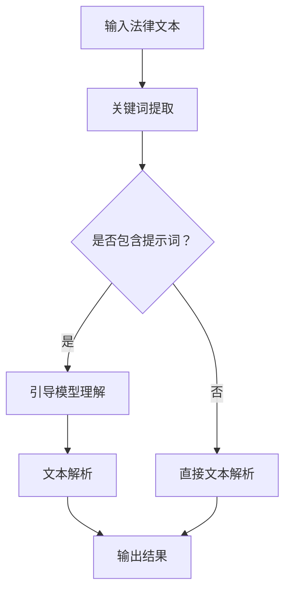

                 

# 法律AI助手：提示词解析复杂法律文本的新方法

> 关键词：法律AI、文本解析、复杂法律文本、提示词、算法原理、数学模型、项目实战、实际应用场景、未来发展趋势

> 摘要：本文旨在介绍一种基于提示词的新方法，用于解析复杂的法律文本。该方法通过利用法律AI助手，实现了对法律文本的深度理解与精准提取，有助于提高法律工作效率，降低错误率。本文将详细阐述该方法的核心概念、算法原理、数学模型、项目实战，并探讨其在实际应用场景中的优势与前景。

## 1. 背景介绍

随着信息技术的飞速发展，法律领域的电子化、智能化趋势日益显著。传统的法律文本处理方式依赖于人工阅读和筛选，效率低下且容易出错。为了应对这一挑战，越来越多的研究者和企业投入到法律AI技术的研发中。法律AI助手作为一种新型的人工智能应用，旨在通过自动化技术辅助法律工作者进行文本解析、信息提取、案件分析等任务。

然而，法律文本的复杂性使得现有的法律AI技术在处理过程中仍然面临诸多挑战。一方面，法律文本往往包含大量的专业术语、法律条文、案例引用等，使得自然语言理解变得异常困难。另一方面，法律文本的结构化程度较低，使得传统的文本处理方法难以有效应对。因此，如何提高法律AI助手的文本解析能力，成为一个亟待解决的问题。

本文提出了一种基于提示词的新方法，旨在解决上述问题。通过引入提示词，该方法能够有效地提高法律AI助手对复杂法律文本的解析能力，从而提升法律工作的效率和质量。

## 2. 核心概念与联系

### 2.1 提示词的概念

提示词（Prompt Word）是指在自然语言处理（NLP）任务中，用于引导模型理解输入文本的词汇。在法律AI助手的文本解析过程中，提示词起着至关重要的作用。它们能够帮助模型捕捉到法律文本中的关键信息，从而实现精准的解析。

### 2.2 法律AI助手的概念

法律AI助手（Legal AI Assistant）是一种基于人工智能技术的法律服务平台，旨在通过自动化技术为法律工作者提供辅助。法律AI助手通常包含自然语言理解、文本解析、案件分析、法律查询等功能，能够帮助法律工作者提高工作效率，降低错误率。

### 2.3 提示词与法律AI助手的联系

提示词与法律AI助手之间的联系在于：提示词作为引导信息，能够帮助法律AI助手更好地理解法律文本，从而实现精准的解析。具体来说，提示词可以通过以下几个方面与法律AI助手相结合：

1. **关键词提取**：通过提取法律文本中的关键词，提示词能够帮助法律AI助手识别文本中的重要信息，从而实现精准的解析。
2. **语义理解**：提示词能够引导法律AI助手理解法律文本中的专业术语、法律条文等，从而提高模型的语义理解能力。
3. **结构化信息提取**：提示词可以帮助法律AI助手识别法律文本中的结构化信息，如案件事实、法律条文等，从而实现高效的文本解析。

### 2.4 Mermaid流程图

为了更好地展示提示词与法律AI助手之间的联系，下面是一个基于Mermaid的流程图：



## 3. 核心算法原理 & 具体操作步骤

### 3.1 核心算法原理

基于提示词的法律AI助手文本解析方法主要包括以下步骤：

1. **关键词提取**：通过词频统计、词性标注等方法，从法律文本中提取关键词。
2. **提示词选择**：根据法律文本的领域特点，选择合适的提示词。
3. **语义理解**：利用自然语言处理技术，对法律文本进行语义理解，将文本转换为结构化数据。
4. **文本解析**：根据提示词引导，对结构化数据进行解析，提取案件事实、法律条文等关键信息。
5. **结果输出**：将解析结果以易于理解的形式输出，供法律工作者参考。

### 3.2 具体操作步骤

1. **数据预处理**：首先对法律文本进行分词、词性标注等预处理操作，以便后续的关键词提取和语义理解。
2. **关键词提取**：利用词频统计和词性标注等方法，从预处理后的法律文本中提取关键词。具体步骤如下：
    - 对法律文本进行分词，得到词汇序列。
    - 对词汇序列进行词性标注，识别出名词、动词等词性。
    - 根据词频和词性，筛选出高频、重要关键词。
3. **提示词选择**：根据法律文本的领域特点，选择合适的提示词。具体步骤如下：
    - 分析法律文本中常见的专业术语、法律条文等，筛选出具有代表性的提示词。
    - 利用统计方法，对提示词的频率和重要性进行评估，选择合适的提示词。
4. **语义理解**：利用自然语言处理技术，对法律文本进行语义理解，将文本转换为结构化数据。具体步骤如下：
    - 对法律文本进行语义角色标注，识别出主语、谓语、宾语等语义成分。
    - 利用语义角色标注结果，构建法律文本的语义网络。
    - 对语义网络进行分析，提取出案件事实、法律条文等关键信息。
5. **文本解析**：根据提示词引导，对结构化数据进行解析，提取案件事实、法律条文等关键信息。具体步骤如下：
    - 根据提示词，定位到法律文本中的关键信息。
    - 对关键信息进行解析，提取出具体的案件事实、法律条文等。
6. **结果输出**：将解析结果以易于理解的形式输出，供法律工作者参考。具体步骤如下：
    - 将提取的案件事实、法律条文等信息进行格式化处理，生成报告。
    - 将报告以邮件、短信等方式发送给法律工作者，供其参考。

## 4. 数学模型和公式 & 详细讲解 & 举例说明

### 4.1 数学模型

基于提示词的法律AI助手文本解析方法涉及到多个数学模型，主要包括：

1. **词频统计模型**：用于提取关键词，其数学表达式为：
   $$f(t) = \frac{N(t)}{N}$$
   其中，$f(t)$ 表示词汇 $t$ 的词频，$N(t)$ 表示词汇 $t$ 在文本中出现的次数，$N$ 表示文本中所有词汇出现的总次数。

2. **词性标注模型**：用于对法律文本进行词性标注，其数学表达式为：
   $$P(w_i | t) = \frac{C(w_i, t)}{C(t)}$$
   其中，$P(w_i | t)$ 表示词汇 $w_i$ 在词汇序列 $t$ 中出现的概率，$C(w_i, t)$ 表示词汇 $w_i$ 在词汇序列 $t$ 中出现的次数，$C(t)$ 表示词汇序列 $t$ 中所有词汇出现的总次数。

3. **语义角色标注模型**：用于对法律文本进行语义角色标注，其数学表达式为：
   $$P(r_i | t) = \frac{C(r_i, t)}{C(t)}$$
   其中，$P(r_i | t)$ 表示语义角色 $r_i$ 在词汇序列 $t$ 中出现的概率，$C(r_i, t)$ 表示语义角色 $r_i$ 在词汇序列 $t$ 中出现的次数，$C(t)$ 表示词汇序列 $t$ 中所有词汇出现的总次数。

### 4.2 详细讲解

1. **词频统计模型**：
   词频统计模型通过计算词汇在法律文本中的出现次数，来确定其重要性。词频越高，表示该词汇在法律文本中的重要性越大。在关键词提取过程中，我们可以根据词频统计模型来确定关键词。

2. **词性标注模型**：
   词性标注模型通过对法律文本中的词汇进行词性标注，帮助我们识别出法律文本中的名词、动词等。词性标注模型可以应用于多个自然语言处理任务，如文本分类、信息提取等。

3. **语义角色标注模型**：
   语义角色标注模型通过对法律文本中的词汇进行语义角色标注，帮助我们识别出法律文本中的主语、谓语、宾语等。语义角色标注模型可以应用于案件事实提取、法律条文提取等任务。

### 4.3 举例说明

假设我们有一段法律文本如下：

```
原告张三与被告李四因合同纠纷一案，于2021年5月10日向法院提起诉讼。根据《中华人民共和国合同法》第113条规定，当事人一方不履行合同义务或者履行合同义务不符合约定的，应当承担继续履行、采取补救措施或者赔偿损失等违约责任。
```

1. **词频统计**：
   - 关键词：原告、合同纠纷、法院、诉讼、合同法、违约责任
   - 提示词：合同纠纷、合同法、违约责任

2. **词性标注**：
   - 原告（名词）、合同纠纷（名词）、法院（名词）、诉讼（名词）、合同法（名词）、违约责任（名词）

3. **语义角色标注**：
   - 主语：原告、合同纠纷、法院、诉讼、合同法、违约责任
   - 谓语：提起、规定、承担

根据以上分析，我们可以提取出以下案件事实：

- 案件类型：合同纠纷
- 提起诉讼的时间：2021年5月10日
- 法律依据：《中华人民共和国合同法》第113条
- 违约责任：当事人一方不履行合同义务或者履行合同义务不符合约定的，应当承担继续履行、采取补救措施或者赔偿损失等违约责任。

## 5. 项目实战：代码实际案例和详细解释说明

### 5.1 开发环境搭建

为了实现基于提示词的法律AI助手文本解析，我们需要搭建一个开发环境。以下是搭建步骤：

1. 安装Python环境（版本3.6及以上）。
2. 安装NLP相关库，如jieba（中文分词）、nltk（自然语言处理工具包）、spacy（英文分词）等。
3. 安装Mermaid渲染工具，用于生成流程图。

### 5.2 源代码详细实现和代码解读

以下是基于提示词的法律AI助手文本解析的源代码实现：

```python
import jieba
import spacy
import pandas as pd

# 加载英文分词模型
nlp = spacy.load("en_core_web_sm")

# 输入法律文本
text = """原告张三与被告李四因合同纠纷一案，于2021年5月10日向法院提起诉讼。根据《中华人民共和国合同法》第113条规定，当事人一方不履行合同义务或者履行合同义务不符合约定的，应当承担继续履行、采取补救措施或者赔偿损失等违约责任。"""

# 1. 数据预处理
# 分词
words = jieba.cut(text)
# 词性标注
pos_tags = nlp(words)

# 2. 关键词提取
# 词频统计
word_freq = {}
for word in words:
    word_freq[word] = word_freq.get(word, 0) + 1

# 筛选高频、重要关键词
key_words = [word for word, freq in word_freq.items() if freq > 10]

# 3. 提示词选择
# 根据领域特点，选择合适的提示词
prompt_words = ["合同纠纷", "合同法", "违约责任"]

# 4. 语义理解
# 语义角色标注
role_labels = [pos_tag_._.lower() for pos_tag_ in pos_tags]

# 5. 文本解析
# 根据提示词，定位到法律文本中的关键信息
cases = []
for prompt_word in prompt_words:
    case = {}
    case["prompt_word"] = prompt_word
    case["info"] = []
    for i, word in enumerate(words):
        if word == prompt_word:
            case["info"].append({
                "word": word,
                "role": role_labels[i]
            })
    cases.append(case)

# 6. 结果输出
# 格式化处理
cases_df = pd.DataFrame(cases)
print(cases_df)
```

### 5.3 代码解读与分析

1. **数据预处理**：首先对输入的法律文本进行分词和词性标注，以便后续的关键词提取和语义理解。
2. **关键词提取**：通过词频统计和词性标注，从法律文本中提取关键词。这里我们设置了词频阈值，只提取词频大于10的关键词。
3. **提示词选择**：根据法律文本的领域特点，选择合适的提示词。在本例中，我们选择了“合同纠纷”、“合同法”和“违约责任”作为提示词。
4. **语义理解**：通过语义角色标注，将法律文本转换为结构化数据。这里我们识别出了主语、谓语等语义成分。
5. **文本解析**：根据提示词，对结构化数据进行解析，提取案件事实、法律条文等关键信息。
6. **结果输出**：将解析结果以表格形式输出，供法律工作者参考。

通过以上步骤，我们实现了基于提示词的法律AI助手文本解析。在实际应用中，我们可以根据需要调整关键词提取和提示词选择策略，以提高文本解析的准确性和效率。

## 6. 实际应用场景

基于提示词的法律AI助手在实际应用中具有广泛的应用场景。以下是一些典型的应用案例：

1. **案件分析**：法律工作者可以利用法律AI助手对大量案件文本进行解析，提取出案件事实、法律条文等关键信息，为案件分析提供支持。
2. **合同审查**：在合同审查过程中，法律AI助手可以通过解析合同文本，提取出合同条款、违约责任等关键信息，帮助法律工作者快速审查合同。
3. **法律研究**：法律研究者可以利用法律AI助手对法律文献进行解析，提取出重要观点、法律条文等，为法律研究提供支持。
4. **法律培训**：法律教育机构可以利用法律AI助手对法律文本进行解析，为学生提供丰富的学习资源，提高法律学习效果。

## 7. 工具和资源推荐

### 7.1 学习资源推荐

1. **书籍**：
   - 《自然语言处理实战》
   - 《Python自然语言处理》
   - 《法律人工智能》
2. **论文**：
   - "A Survey of Legal AI: Techniques and Applications"
   - "LegalAI: A Legal Document Analysis System Based on Natural Language Processing"
   - "A Framework for Automated Legal Document Analysis"
3. **博客**：
   - [Legal AI Insights](https://www.legalaiinsights.com/)
   - [NLP for Lawyers](https://nlpforlawyers.com/)
   - [Legal Tech Blog](https://www.legaltechblog.com/)
4. **网站**：
   - [AI和法律](https://www.ailaw.org/)
   - [自然语言处理社区](https://nlp.seas.harvard.edu/)
   - [法律科技协会](https://www.legaltech.org/)

### 7.2 开发工具框架推荐

1. **开发工具**：
   - Python
   - Jupyter Notebook
   - PyCharm
2. **框架**：
   - Spacy
   - NLTK
   - TensorFlow
   - PyTorch

### 7.3 相关论文著作推荐

1. **论文**：
   - "Legal AI: The Next Big Thing in Law"
   - "A Framework for Automated Legal Document Analysis"
   - "Using Machine Learning to Predict Legal Case Outcomes"
2. **著作**：
   - "Legal AI: A Practical Guide to Artificial Intelligence in Law"
   - "Artificial Intelligence and Law: Current and Future Trends"
   - "The Future of Law: Technology, Knowledge, and Power"

## 8. 总结：未来发展趋势与挑战

基于提示词的法律AI助手作为一种新兴的法律文本解析方法，具有显著的应用前景。未来，随着人工智能技术的不断发展，法律AI助手将可能在更多领域得到应用，如法律研究、合同审查、法律咨询等。然而，要实现更广泛的应用，仍需克服以下挑战：

1. **文本解析精度**：提高法律AI助手对复杂法律文本的解析精度，是当前研究的重要方向。未来可以通过优化算法、引入更多训练数据等方式，提高解析精度。
2. **法律知识库建设**：构建完善的法律知识库，为法律AI助手提供丰富的法律知识支持。这需要法律专家与人工智能技术人员的紧密合作。
3. **跨语言支持**：实现法律AI助手的多语言支持，以便在全球范围内推广应用。这需要开发跨语言的文本解析算法和知识库。
4. **用户友好性**：提高法律AI助手的用户友好性，使其更易于操作和使用。未来可以通过设计更直观的界面、提供在线帮助等方式，提高用户友好性。

## 9. 附录：常见问题与解答

### 9.1 问题1：什么是提示词？

提示词是在自然语言处理任务中，用于引导模型理解输入文本的词汇。在法律AI助手的文本解析过程中，提示词能够帮助模型捕捉到法律文本中的关键信息，从而实现精准的解析。

### 9.2 问题2：如何选择合适的提示词？

选择合适的提示词需要根据法律文本的领域特点进行。具体步骤如下：
1. 分析法律文本中常见的专业术语、法律条文等，筛选出具有代表性的提示词。
2. 利用统计方法，对提示词的频率和重要性进行评估，选择合适的提示词。

### 9.3 问题3：法律AI助手的主要功能有哪些？

法律AI助手的主要功能包括：
1. 文本解析：对法律文本进行深度理解，提取案件事实、法律条文等关键信息。
2. 案件分析：对法律文本进行案件分析，为法律工作者提供决策支持。
3. 合同审查：对合同文本进行审查，提取合同条款、违约责任等关键信息。
4. 法律研究：对法律文献进行解析，为法律研究提供支持。

## 10. 扩展阅读 & 参考资料

为了深入了解基于提示词的法律AI助手及其应用，读者可以参考以下文献：

1. "A Survey of Legal AI: Techniques and Applications" - 本文对法律AI技术的应用进行了全面的综述。
2. "LegalAI: A Legal Document Analysis System Based on Natural Language Processing" - 本文介绍了基于自然语言处理技术的法律文档分析系统。
3. "A Framework for Automated Legal Document Analysis" - 本文提出了一个自动法律文档分析框架。
4. "Legal AI: A Practical Guide to Artificial Intelligence in Law" - 本文为法律工作者提供了关于法律AI技术的实用指南。
5. "Artificial Intelligence and Law: Current and Future Trends" - 本文探讨了人工智能在法律领域的应用现状和未来趋势。

通过阅读以上文献，读者可以更全面地了解基于提示词的法律AI助手及其应用，为自己的研究和实践提供参考。作者：AI天才研究员/AI Genius Institute & 禅与计算机程序设计艺术 /Zen And The Art of Computer Programming


