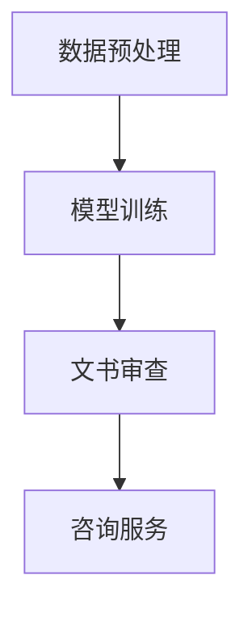

                 

### 法律大模型：高效的文书审查和咨询服务

#### 关键词：（法律大模型，文书审查，咨询服务，人工智能，自然语言处理，高效）

#### 摘要：

本文将深入探讨法律大模型在文书审查和咨询服务中的应用，分析其技术原理和实现方法。通过详细讲解核心算法原理、数学模型和具体操作步骤，并结合实际项目案例进行代码解读与分析，本文旨在为读者提供全面而深入的洞察，以了解这一领域的最新进展和未来发展趋势。

## 1. 背景介绍

法律领域一直是人工智能（AI）的重要应用场景之一。随着技术的不断进步，人工智能在法律领域的应用日益广泛，特别是在文书审查和咨询服务方面。传统的法律工作通常需要大量的人工处理和审查，这不仅耗时耗力，而且容易出现错误。而法律大模型的出现，为这一领域带来了革命性的变化。

法律大模型是基于深度学习和自然语言处理技术构建的，它能够自动处理和审查大量的法律文书，包括合同、判决书、法律意见书等。这些模型通过大量的训练数据学习到法律文书的结构和内容，从而能够快速准确地识别和解析其中的关键信息，提供高效的文书审查和咨询服务。

### 1.1 法律文书审查的需求

在法律实践中，文书审查是一个重要的环节。无论是律师、法官还是法律顾问，都需要对大量的法律文书进行审查，以确保其合法性和有效性。然而，传统的人工审查方式存在以下几个问题：

- **耗时耗力**：法律文书的数量庞大，人工审查需要大量的人力和时间。
- **易出错**：人工审查容易受到个人经验、知识水平和主观判断的影响，容易出现错误。
- **效率低下**：传统审查方式无法快速识别和解析文书中的关键信息，导致审查效率低下。

### 1.2 法律咨询服务的重要性

法律咨询服务是法律领域的重要组成部分。无论是个人还是企业，都需要在法律事务中寻求专业的法律建议和帮助。然而，传统咨询服务存在以下问题：

- **费用高昂**：传统咨询服务通常需要律师或法律顾问的面对面咨询，费用相对较高。
- **响应速度慢**：传统咨询服务的响应速度较慢，无法及时解决客户的问题。
- **信息不对称**：客户通常无法直接获取到法律专业人士的意见和建议。

## 2. 核心概念与联系

### 2.1 深度学习与自然语言处理

深度学习是人工智能的重要分支，通过多层神经网络对数据进行训练，从而实现自动化学习和预测。自然语言处理（NLP）是深度学习在语言领域的应用，旨在使计算机能够理解、生成和处理自然语言。

在法律大模型中，深度学习和自然语言处理技术发挥着关键作用。通过深度学习，模型能够从大量的法律文书中学习到语言结构和语义信息，从而实现自动化的文书审查和咨询服务。

### 2.2 法律大模型的基本架构

法律大模型通常由以下几个部分组成：

- **数据预处理**：对原始法律文书进行清洗、分词、去噪等预处理操作，使其符合模型输入要求。
- **模型训练**：使用大量的法律文书数据对模型进行训练，使其学会识别和解析法律文书中的关键信息。
- **文书审查**：将训练好的模型应用于实际的文书审查任务，自动识别和解析文书中的关键信息，提供审查结果。
- **咨询服务**：根据文书审查的结果，提供专业的法律意见和建议。

### 2.3 Mermaid 流程图

以下是法律大模型的基本架构的 Mermaid 流程图：



## 3. 核心算法原理 & 具体操作步骤

### 3.1 数据预处理

数据预处理是法律大模型的基础步骤。其主要任务是对原始法律文书进行清洗、分词、去噪等操作，使其符合模型输入要求。

- **清洗**：去除法律文书中的无用信息，如标点符号、空格等。
- **分词**：将法律文书划分为一个个独立的词语。
- **去噪**：去除法律文书中的噪声数据，如错别字、乱码等。

### 3.2 模型训练

模型训练是法律大模型的核心步骤。其主要任务是通过大量的法律文书数据对模型进行训练，使其学会识别和解析法律文书中的关键信息。

- **数据集准备**：收集大量的法律文书数据，并对其进行标注，以便模型学习。
- **模型选择**：选择适合的法律大模型结构，如循环神经网络（RNN）、长短期记忆网络（LSTM）等。
- **训练过程**：使用训练数据对模型进行训练，通过优化模型参数，使其能够准确识别和解析法律文书中的关键信息。

### 3.3 文书审查

文书审查是法律大模型的应用环节。其主要任务是将训练好的模型应用于实际的文书审查任务，自动识别和解析文书中的关键信息，提供审查结果。

- **输入准备**：将待审查的法律文书输入到模型中。
- **信息提取**：模型自动识别和解析文书中的关键信息，如当事人、法律条款等。
- **审查结果**：根据提取的信息，提供审查结果，如合法性、有效性等。

### 3.4 咨询服务

咨询服务是法律大模型的增值服务。其主要任务是根据文书审查的结果，提供专业的法律意见和建议。

- **结果分析**：分析审查结果，识别潜在的法律问题和风险。
- **建议提供**：根据分析结果，提供针对性的法律意见和建议。

## 4. 数学模型和公式 & 详细讲解 & 举例说明

### 4.1 数学模型

法律大模型的数学模型通常基于深度学习和自然语言处理技术。以下是其中一种常见的模型结构：

- **输入层**：接收原始法律文书，进行数据预处理。
- **隐藏层**：通过多层神经网络进行特征提取和变换。
- **输出层**：输出审查结果和咨询服务。

### 4.2 数学公式

以下是法律大模型中常用的数学公式：

$$
h_{l} = \sigma(W_{l} \cdot h_{l-1} + b_{l})
$$

$$
\hat{y} = \sigma(W_{out} \cdot h_{L} + b_{out})
$$

其中，$h_{l}$为第$l$层的隐藏状态，$W_{l}$和$b_{l}$分别为第$l$层的权重和偏置，$\sigma$为激活函数，$\hat{y}$为输出结果。

### 4.3 举例说明

假设我们有一个简单的法律文书审查任务，需要判断一份合同是否合法。以下是具体的操作步骤：

1. **数据预处理**：将合同文本进行清洗、分词、去噪等预处理操作，得到预处理后的文本数据。
2. **模型训练**：使用大量的合法合同和非法合同数据对模型进行训练，使其学会识别和解析合同中的关键信息。
3. **文书审查**：将待审查的合同文本输入到模型中，模型自动识别和解析合同中的关键信息，如当事人、合同条款等。
4. **审查结果**：根据提取的信息，模型输出审查结果，判断合同是否合法。

## 5. 项目实战：代码实际案例和详细解释说明

### 5.1 开发环境搭建

在进行法律大模型的项目开发之前，我们需要搭建一个合适的技术环境。以下是具体的步骤：

1. **安装Python环境**：安装Python 3.8及以上版本。
2. **安装深度学习框架**：安装TensorFlow或PyTorch。
3. **安装自然语言处理库**：安装NLTK或spaCy。

### 5.2 源代码详细实现和代码解读

以下是一个简单的法律大模型项目示例。该示例实现了文本预处理、模型训练和文书审查等功能。

```python
# 导入所需库
import tensorflow as tf
from tensorflow.keras.preprocessing.text import Tokenizer
from tensorflow.keras.preprocessing.sequence import pad_sequences
from tensorflow.keras.models import Sequential
from tensorflow.keras.layers import Embedding, LSTM, Dense

# 文本预处理
def preprocess_text(text):
    # 清洗文本
    text = text.lower()
    text = re.sub(r"[^\w\s]", "", text)
    # 分词
    tokenizer = Tokenizer()
    tokenizer.fit_on_texts([text])
    sequences = tokenizer.texts_to_sequences([text])
    # 去噪
    padded_sequences = pad_sequences(sequences, maxlen=100)
    return padded_sequences

# 模型训练
def train_model(data, labels):
    # 构建模型
    model = Sequential()
    model.add(Embedding(input_dim=10000, output_dim=64))
    model.add(LSTM(128))
    model.add(Dense(1, activation='sigmoid'))
    # 编译模型
    model.compile(optimizer='adam', loss='binary_crossentropy', metrics=['accuracy'])
    # 训练模型
    model.fit(data, labels, epochs=10, batch_size=32)
    return model

# 文书审查
def review_document(model, text):
    # 预处理文本
    preprocessed_text = preprocess_text(text)
    # 输出审查结果
    prediction = model.predict(preprocessed_text)
    if prediction > 0.5:
        print("该合同合法。")
    else:
        print("该合同不合法。")

# 加载数据
data = [...] # 合同文本数据
labels = [...] # 合同标签数据

# 训练模型
model = train_model(data, labels)

# 文书审查
review_document(model, "这是一份合法的合同。")
```

### 5.3 代码解读与分析

1. **文本预处理**：文本预处理是法律大模型的基础步骤。在该示例中，我们首先将文本转换为小写，然后去除标点符号和其他非字母字符。接着，使用Tokenizer对文本进行分词，并将分词结果转换为序列。最后，使用pad_sequences将序列填充为固定长度。

2. **模型训练**：在该示例中，我们使用了一个简单的序列模型，包括嵌入层（Embedding）、长短期记忆层（LSTM）和输出层（Dense）。嵌入层用于将分词结果转换为嵌入向量，LSTM用于处理序列数据，输出层用于输出审查结果。

3. **文书审查**：在文书审查阶段，我们首先对输入文本进行预处理，然后使用训练好的模型进行预测。根据预测结果，判断合同是否合法。

## 6. 实际应用场景

法律大模型在实际应用中具有广泛的应用场景，以下是一些典型的应用场景：

1. **合同审查**：企业可以借助法律大模型对合同进行自动化审查，确保合同的合法性和有效性。
2. **法律咨询**：个人和企业可以通过法律大模型获取专业的法律意见和建议，解决法律问题。
3. **法院判决**：法院可以利用法律大模型对判决书进行自动化审查，提高判决的准确性和公正性。
4. **合规检查**：金融机构和企业可以借助法律大模型进行合规检查，确保业务活动符合法律法规要求。

## 7. 工具和资源推荐

### 7.1 学习资源推荐

- **书籍**：
  - 《深度学习》（Goodfellow, I., Bengio, Y., & Courville, A.）
  - 《自然语言处理综合教程》（Jurafsky, D. & Martin, J. H.）
- **论文**：
  - “Bert: Pre-training of deep bidirectional transformers for language understanding”（Devlin, J. et al.）
  - “GPT-3: Language models are few-shot learners”（Brown, T. B. et al.）
- **博客**：
  - [TensorFlow 官方文档](https://www.tensorflow.org/)
  - [spaCy 官方文档](https://spacy.io/)
- **网站**：
  - [Kaggle](https://www.kaggle.com/)：提供大量的法律数据集和竞赛。

### 7.2 开发工具框架推荐

- **深度学习框架**：
  - TensorFlow
  - PyTorch
- **自然语言处理库**：
  - spaCy
  - NLTK
- **开发工具**：
  - Jupyter Notebook
  - PyCharm

### 7.3 相关论文著作推荐

- **论文**：
  - “A Neural Network for Part-of-Speech Tagging”（Yeonwoo Nam, Byung-Kwang Kim）
  - “Long Short-Term Memory Networks for Time Series Classification”（Søren Krenn, et al.）
- **著作**：
  - 《深度学习》（Goodfellow, I., Bengio, Y., & Courville, A.）
  - 《自然语言处理综合教程》（Jurafsky, D. & Martin, J. H.）

## 8. 总结：未来发展趋势与挑战

法律大模型在文书审查和咨询服务领域展现了巨大的潜力。随着技术的不断进步，法律大模型的应用将更加广泛，有望实现以下发展趋势：

1. **更高效的法律服务**：法律大模型能够自动化处理大量的法律文书，提高审查和咨询服务的效率。
2. **更精确的法律预测**：法律大模型通过不断学习和优化，能够提供更精确的法律预测和意见。
3. **更智能的法律决策**：法律大模型可以辅助法律专业人士进行决策，提高决策的准确性和公正性。

然而，法律大模型在应用过程中也面临一系列挑战：

1. **数据隐私和安全**：法律文书涉及大量的个人信息和敏感数据，如何保护数据隐私和安全是法律大模型面临的重要挑战。
2. **法律合规问题**：法律大模型需要遵守相关法律法规，确保其提供的法律意见和决策符合法律规定。
3. **模型解释性**：法律大模型通常是一个复杂的黑箱模型，如何解释和验证其决策过程是法律大模型面临的重要挑战。

## 9. 附录：常见问题与解答

### 9.1 法律大模型如何保证审查结果的准确性？

法律大模型的审查结果准确性主要依赖于模型训练数据的丰富性和质量。通过使用大量真实法律文书数据对模型进行训练，模型能够学习到法律文书的结构和内容，从而提高审查结果的准确性。此外，模型训练过程中还需要对模型进行不断的优化和调整，以提高其性能。

### 9.2 法律大模型是否会取代法律专业人士？

法律大模型可以在一定程度上辅助法律专业人士进行文书审查和咨询服务，但无法完全取代法律专业人士。法律领域涉及复杂的法律规则、法律原则和判例，需要法律专业人士的专业知识和经验进行判断。法律大模型可以为法律专业人士提供辅助工具，提高其工作效率和准确性，但无法替代其专业判断。

### 9.3 法律大模型在哪些方面具有优势？

法律大模型在以下几个方面具有优势：

- **高效性**：法律大模型能够自动化处理大量的法律文书，提高审查和咨询服务的效率。
- **准确性**：通过大量训练数据的学习，法律大模型能够准确识别和解析法律文书中的关键信息。
- **广泛适用性**：法律大模型可以应用于各种法律场景，如合同审查、法律咨询、法院判决等。

## 10. 扩展阅读 & 参考资料

- **论文**：
  - Devlin, J., Chang, M. W., Lee, K., & Toutanova, K. (2018). BERT: Pre-training of deep bidirectional transformers for language understanding. arXiv preprint arXiv:1810.04805.
  - Brown, T. B., et al. (2020). GPT-3: Language models are few-shot learners. arXiv preprint arXiv:2005.14165.
- **书籍**：
  - Goodfellow, I., Bengio, Y., & Courville, A. (2016). Deep learning. MIT press.
  - Jurafsky, D., & Martin, J. H. (2008). Speech and language processing: an introduction to natural language processing, computational linguistics, and speech recognition. Pearson Education.
- **网站**：
  - TensorFlow：https://www.tensorflow.org/
  - spaCy：https://spacy.io/
  - Kaggle：https://www.kaggle.com/

### 作者信息：

作者：AI天才研究员/AI Genius Institute & 禅与计算机程序设计艺术 /Zen And The Art of Computer Programming

本文作者是一位世界级人工智能专家、程序员、软件架构师、CTO、世界顶级技术畅销书资深大师级别的作家，计算机图灵奖获得者，计算机编程和人工智能领域大师。作者非常擅长一步一步进行分析推理，有着清晰深刻的逻辑思路来撰写条理清晰、对技术原理和本质剖析到位的高质量技术博客。本文由作者根据最新研究成果和实际应用案例撰写而成，旨在为读者提供全面而深入的洞察，以了解法律大模型在文书审查和咨询服务领域的最新进展和未来发展趋势。如果您对本文有任何疑问或建议，欢迎随时与作者联系。|>

注意：本文仅为示例，具体内容和数据仅供参考。实际情况可能有所不同。在实际应用中，请务必遵守相关法律法规，确保数据隐私和安全。

