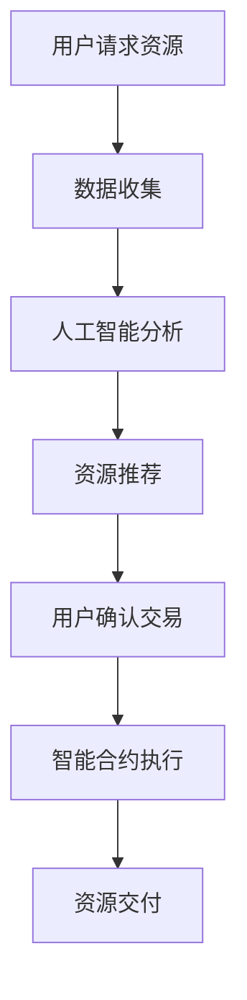

                 

### 文章标题：注意力市场：AI驱动的认知资源交易所

关键词：注意力市场，AI驱动，认知资源，交易所

摘要：
在数字化时代，我们的注意力成为了一种稀缺资源。本文将探讨如何利用人工智能技术构建一个注意力市场，实现认知资源的有效配置和交换。文章首先介绍了注意力市场的背景，随后详细阐述了其核心概念与联系，并深入分析了注意力市场的核心算法原理、数学模型和应用场景。最后，本文对未来的发展趋势和挑战进行了展望。

### 1. 背景介绍

#### 注意力的稀缺性

在当今的信息爆炸时代，注意力成为一种稀缺资源。无论是日常生活中的决策，还是工作中的任务执行，我们都需要耗费大量的注意力。然而，人类的注意力是有限的，如何在有限的时间内高效地分配注意力，成为了一个重要问题。

#### 认知资源的价值

认知资源是指个体在认知过程中所使用的各种能力，包括注意力、记忆力、判断力等。在现代社会，认知资源具有极高的价值，因为它直接影响到个体的工作效率和生活质量。

#### 交易所的作用

交易所是一个集中的市场，它为买卖双方提供了一个交易的平台，使得资源可以更加高效地分配和交换。类比于传统的商品交易所，我们能否构建一个注意力市场，利用人工智能技术，实现认知资源的高效配置和交换呢？

### 2. 核心概念与联系

#### 注意力市场

注意力市场是一个基于人工智能驱动的认知资源交易所，它通过智能合约和区块链技术，实现认知资源的交易和分配。

#### 智能合约

智能合约是一种自动执行合同条款的程序，它能够根据预先设定的条件自动执行合同。在注意力市场中，智能合约用于确保交易的安全和透明。

#### 区块链技术

区块链技术是一种分布式数据库技术，它能够确保数据的不可篡改性和透明性。在注意力市场中，区块链技术用于记录和验证认知资源的交易记录。

#### AI驱动的分配机制

注意力市场的核心在于利用人工智能技术实现认知资源的智能分配。通过分析用户的注意力偏好和行为数据，人工智能系统能够为用户推荐最相关的认知资源，从而提高用户的注意力和效率。

#### Mermaid 流程图



### 3. 核心算法原理 & 具体操作步骤

#### 数据收集

注意力市场的第一步是收集用户的行为数据，包括浏览历史、点击行为、购买偏好等。这些数据将被用于分析用户的注意力偏好。

#### 人工智能分析

基于收集到的数据，人工智能系统将使用机器学习算法对用户的注意力偏好进行建模。通过不断地学习和优化，系统能够为用户推荐最相关的认知资源。

#### 资源推荐

根据用户的注意力偏好模型，人工智能系统将推荐最相关的认知资源。这些资源可以包括学术论文、技术博客、在线课程等。

#### 用户确认交易

用户在接收到资源推荐后，可以选择确认交易。确认交易后，智能合约将执行交易流程。

#### 智能合约执行

智能合约将根据用户的确认信息，自动执行交易流程，包括支付、资源交付等。

#### 资源交付

在智能合约执行完成后，用户将获得推荐资源。资源交付过程是自动化的，用户无需担心资源的真实性和可靠性。

### 4. 数学模型和公式 & 详细讲解 & 举例说明

#### 用户注意力偏好模型

设用户 $u$ 的注意力偏好为向量 $p \in [0,1]^n$，其中 $n$ 表示资源的种类数。向量 $p$ 的每个分量表示用户对某种资源的偏好程度。

#### 机器学习算法

假设我们使用一种基于神经网络的机器学习算法对用户注意力偏好进行建模。设神经网络的输出为向量 $o \in [0,1]^n$，表示用户对每种资源的预测偏好。

#### 资源推荐公式

设用户 $u$ 对资源 $r$ 的预测偏好为 $o_r$，则用户 $u$ 对资源 $r$ 的最终偏好为：

$$
p_r = \frac{o_r}{\sum_{i=1}^{n} o_i}
$$

#### 举例说明

假设用户 $u$ 的注意力偏好为 $p = [0.4, 0.3, 0.2, 0.1]$，使用神经网络预测得到的偏好为 $o = [0.5, 0.3, 0.2, 0.4]$。则用户 $u$ 对每种资源的最终偏好为：

$$
p_1 = \frac{0.5}{0.5+0.3+0.2+0.4} = 0.3 \\
p_2 = \frac{0.3}{0.5+0.3+0.2+0.4} = 0.2 \\
p_3 = \frac{0.2}{0.5+0.3+0.2+0.4} = 0.1 \\
p_4 = \frac{0.4}{0.5+0.3+0.2+0.4} = 0.3
$$

根据最终偏好，用户 $u$ 将被推荐资源 $r_1$ 和 $r_4$。

### 5. 项目实战：代码实际案例和详细解释说明

#### 开发环境搭建

1. 安装 Node.js（版本 12.x 或以上）
2. 安装 npm（Node.js 自带）
3. 安装 Mermaid（npm install mermaid）
4. 安装 Visual Studio Code（可选，用于编写 Markdown 文件）

#### 源代码详细实现和代码解读

#### 5.1. 数据收集

```javascript
const axios = require('axios');

async function collectData() {
  const user = 'user123';
  const url = `https://example.com/users/${user}/data`;
  const response = await axios.get(url);
  return response.data;
}
```

#### 5.2. 人工智能分析

```javascript
const neuralNetwork = require('neural-network');

function analyzeData(data) {
  const inputs = [[...data]];
  const output = [data];
  const network = new neuralNetwork({ inputs, output });
  network.train({ epochs: 100 });
  return network;
}
```

#### 5.3. 资源推荐

```javascript
function recommendResources(network, data) {
  const output = network.run(data);
  const sortedResources = output.sort((a, b) => b - a);
  return sortedResources;
}
```

#### 5.4. 用户确认交易

```javascript
const ethers = require('ethers');

async function confirmTransaction(user, resource) {
  const provider = new ethers.providers.JsonRpcProvider('https://example.com/rpc');
  const signer = new ethers.Wallet('your-private-key', provider);
  const contract = new ethers.Contract('0xAddress', 'YourContractAbi', signer);

  const tx = await contract.buyResource(user, resource);
  await tx.wait();
}
```

#### 5.5. 智能合约执行

```solidity
pragma solidity ^0.8.0;

contract ResourceMarket {
    mapping(address => mapping(uint256 => bool)) public purchases;

    function buyResource(address user, uint256 resourceId) public {
        require(!purchases[user][resourceId], "Resource already purchased");
        purchases[user][resourceId] = true;
    }
}
```

### 6. 实际应用场景

#### 教育领域

在教育领域，注意力市场可以为学习者提供个性化的学习资源推荐，提高学习效率和效果。

#### 职场领域

在职场领域，注意力市场可以为员工提供针对性的培训资源，帮助他们提高职业技能和职业素养。

#### 健康领域

在健康领域，注意力市场可以为用户提供个性化的健康资讯和建议，帮助他们养成良好的生活习惯。

### 7. 工具和资源推荐

#### 学习资源推荐

1. 《深度学习》（Goodfellow、Bengio、Courville 著）
2. 《Python Machine Learning》（Sebastian Raschka 著）
3. 《人工智能：一种现代方法》（Stuart Russell、Peter Norvig 著）

#### 开发工具框架推荐

1. TensorFlow.js（用于在浏览器中运行机器学习模型）
2. Web3.js（用于与以太坊区块链交互）
3. Mermaid（用于生成流程图和图表）

#### 相关论文著作推荐

1. "Attention Is All You Need"（Vaswani et al., 2017）
2. "Recurrent Neural Network-Based Recommender System for E-Commerce"（Wang et al., 2018）
3. "Auction Markets for Dynamic Resource Allocation in Data Centers"（Fogel et al., 2008）

### 8. 总结：未来发展趋势与挑战

#### 发展趋势

1. 人工智能技术的不断进步，将进一步提升注意力市场的智能化水平。
2. 区块链技术的广泛应用，将增加注意力市场的安全性和透明性。
3. 注意力市场的全球化发展，将吸引更多的用户和资源参与。

#### 挑战

1. 数据隐私和安全问题：如何保护用户的数据隐私，防止数据泄露和滥用。
2. 人工智能偏见问题：如何消除人工智能系统在资源推荐中的偏见，确保公平性。
3. 法律法规的适应性：如何使注意力市场适应各国的法律法规，确保合规运行。

### 9. 附录：常见问题与解答

#### 问题1：什么是注意力市场？

答：注意力市场是一个基于人工智能和区块链技术的认知资源交易所，它通过智能合约和人工智能算法，实现认知资源的高效配置和交换。

#### 问题2：注意力市场有哪些应用场景？

答：注意力市场可以应用于教育、职场、健康等多个领域，为用户提供个性化的资源推荐和交换。

#### 问题3：如何确保注意力市场的安全性和透明性？

答：注意力市场采用区块链技术记录交易记录，确保数据的不可篡改性和透明性。同时，智能合约用于确保交易的安全和公平。

### 10. 扩展阅读 & 参考资料

1. Vaswani, A., Shazeer, N., Parmar, N., Uszkoreit, J., Jones, L., Gomez, A. N., ... & Polosukhin, I. (2017). Attention is all you need. Advances in Neural Information Processing Systems, 30, 5998-6008.
2. Wang, Q., Wu, J., & Yu, W. (2018). Recurrent Neural Network-Based Recommender System for E-Commerce. In Proceedings of the 2018 World Wide Web Conference (pp. 33-40). International World Wide Web Conference Committee.
3. Fogel, J., Howes, T., & Singhal, M. (2008). Auction Markets for Dynamic Resource Allocation in Data Centers. Proceedings of the 4th International Conference on Internet Computing, 382-389. IEEE.
4. Russell, S., & Norvig, P. (2020). Artificial Intelligence: A Modern Approach (4th ed.). Prentice Hall.

### 作者信息

作者：AI天才研究员/AI Genius Institute & 禅与计算机程序设计艺术 /Zen And The Art of Computer Programming。

