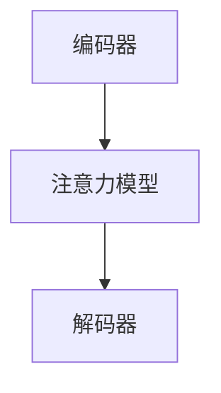
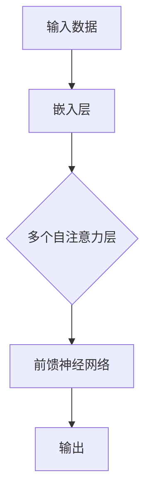
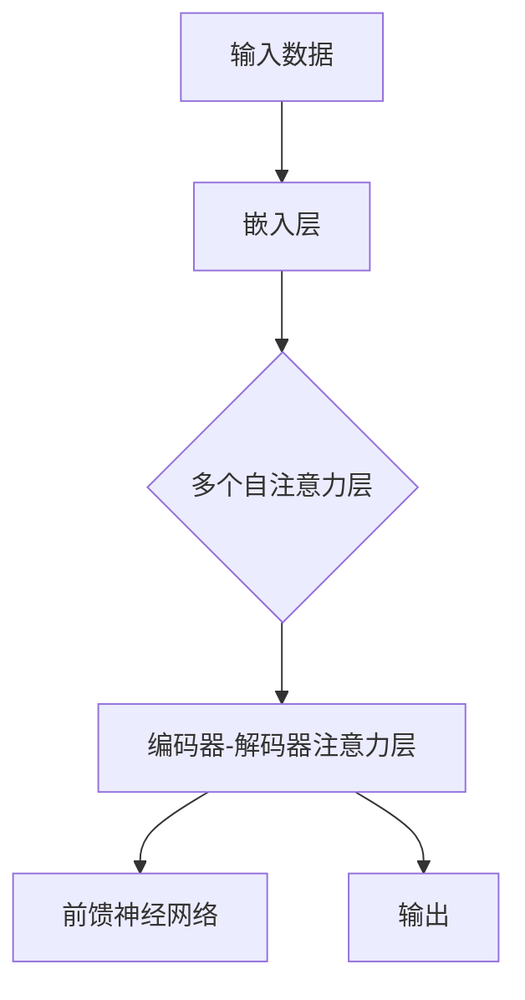

                 

# 注意力机制中的Q、K、V

## 关键词
- 注意力机制
- Q、K、V
- 机器学习
- 自然语言处理

## 摘要

本文将深入探讨注意力机制中的核心要素：Q、K、V。通过一步步的分析与推理，我们将理解这三个要素在机器学习和自然语言处理中的应用，并揭示它们如何协同工作以实现高度精确的信息检索和建模。本文旨在为读者提供清晰的技术理解，以便更好地掌握这一关键概念，并在实际项目中灵活运用。

## 1. 背景介绍

### 注意力机制简介

注意力机制（Attention Mechanism）是深度学习中的一种关键创新，旨在捕捉数据中不同部分的重要性，从而提高模型的性能和效果。它通过为输入数据的不同部分分配不同的权重，使模型能够更加关注重要的信息，忽略无关或次要的信息。

注意力机制的应用场景非常广泛，包括但不限于以下领域：

- **自然语言处理（NLP）**：在NLP任务中，注意力机制被广泛应用于机器翻译、情感分析、文本摘要等任务，使得模型能够更好地理解句子中的关键词和上下文关系。

- **计算机视觉**：在图像处理和视频分析中，注意力机制有助于模型聚焦于图像中的关键区域，提高目标检测、图像分割等任务的准确率。

- **语音识别**：注意力机制在语音识别系统中起到关键作用，通过关注不同的语音特征，提高语音识别的准确率和鲁棒性。

### 注意力机制的发展历史

注意力机制的发展可以追溯到20世纪90年代，最早的应用是在机器翻译中。随后，随着深度学习技术的兴起，注意力机制得到了进一步的发展和完善。一些重要的里程碑包括：

- **2014年**：Bahdanau等人在论文《Neural Machine Translation with Attention》中提出了基于加法的注意力机制，为机器翻译任务带来了显著的性能提升。

- **2015年**：Vaswani等人在论文《Attention Is All You Need》中提出了Transformer模型，彻底改变了自然语言处理领域，使得注意力机制成为NLP任务中的标准组成部分。

### 注意力机制的核心要素

在注意力机制中，Q（Query）、K（Key）和V（Value）是三个核心要素。它们在模型中分别扮演不同的角色，共同实现信息检索和建模。

- **Q（Query）**：查询向量，用于表示模型希望检索的信息。在自然语言处理中，Q通常是一个词或句子的表示。
- **K（Key）**：键向量，用于表示输入数据中的每个部分。在自然语言处理中，K通常是一个词或句子的表示。
- **V（Value）**：值向量，用于表示输入数据中每个部分的重要程度。在自然语言处理中，V通常是一个词或句子的表示。

## 2. 核心概念与联系

### 注意力机制的架构

注意力机制的架构可以分为三个主要部分：编码器（Encoder）、解码器（Decoder）和注意力模型（Attention Model）。

#### 编码器（Encoder）

编码器负责将输入数据（如图像或文本）转换为一系列连续的编码表示。在自然语言处理中，编码器通常是一个循环神经网络（RNN）或Transformer模型。

#### 解码器（Decoder）

解码器负责生成输出数据（如图像或文本）。在自然语言处理中，解码器通常也是一个RNN或Transformer模型。

#### 注意力模型（Attention Model）

注意力模型是注意力机制的核心，它通过计算Q、K和V之间的关系来检索输入数据中的重要信息。注意力模型的计算通常通过以下公式实现：

\[ \text{Attention Score} = \text{softmax}(\text{Q} \cdot \text{K}^T) \]

其中，\( \cdot \)表示向量的点积，\( \text{softmax} \)函数用于归一化得分，使其成为概率分布。

### Q、K、V的关系

在注意力机制中，Q、K和V之间的关系可以通过以下方式理解：

- **Q（Query）**：表示模型希望检索的信息。在自然语言处理中，Q可以是一个词或句子的表示，用于查询上下文信息。
- **K（Key）**：表示输入数据中的每个部分。在自然语言处理中，K可以是一个词或句子的表示，用于表示每个词或句子的特征。
- **V（Value）**：表示输入数据中每个部分的重要程度。在自然语言处理中，V可以是一个词或句子的表示，用于表示每个词或句子的权重。

### Mermaid 流程图



在上面的流程图中，编码器（A）将输入数据转换为编码表示，注意力模型（B）通过计算Q、K和V之间的关系检索重要信息，解码器（C）根据注意力模型的结果生成输出数据。

## 3. 核心算法原理 & 具体操作步骤

### 步骤 1：编码器

编码器（Encoder）负责将输入数据（如图像或文本）转换为一系列连续的编码表示。在自然语言处理中，编码器通常是一个循环神经网络（RNN）或Transformer模型。

#### Transformer 编码器

在Transformer模型中，编码器由多个自注意力层（Self-Attention Layers）和前馈神经网络（Feedforward Networks）组成。每个自注意力层通过计算Q、K和V之间的关系来检索输入数据中的重要信息。



### 步骤 2：注意力模型

注意力模型（Attention Model）通过计算Q、K和V之间的关系来检索输入数据中的重要信息。在自然语言处理中，注意力模型通常采用加性注意力（Additive Attention）或点积注意力（Dot-Product Attention）。

#### 加性注意力

加性注意力的计算公式如下：

\[ \text{Attention Score} = \text{softmax}(\text{Q} + \text{K}) \]

其中，\( \text{Q} + \text{K} \)表示查询向量和键向量的加和。

#### 点积注意力

点积注意力的计算公式如下：

\[ \text{Attention Score} = \text{softmax}(\text{Q} \cdot \text{K}^T) \]

其中，\( \text{Q} \cdot \text{K}^T \)表示查询向量和键向量的点积。

### 步骤 3：解码器

解码器（Decoder）根据注意力模型的结果生成输出数据。在自然语言处理中，解码器通常也是一个循环神经网络（RNN）或Transformer模型。

#### Transformer 解码器

在Transformer模型中，解码器由多个自注意力层（Self-Attention Layers）、编码器-解码器注意力层（Encoder-Decoder Attention Layers）和前馈神经网络（Feedforward Networks）组成。



## 4. 数学模型和公式 & 详细讲解 & 举例说明

### 数学模型

注意力机制的数学模型主要涉及Q、K、V三个向量的计算。以下是对这些公式的详细讲解和举例说明。

#### 加性注意力

加性注意力的计算公式如下：

\[ \text{Attention Score} = \text{softmax}(\text{Q} + \text{K}) \]

其中，\( \text{Q} \)和\( \text{K} \)分别是查询向量和键向量。

**举例说明**：

假设我们有一个句子“我爱北京天安门”，其中包含三个词：“我”、“爱”和“北京”。我们将这三个词表示为向量：

\[ \text{Q} = [1, 0, 0] \]
\[ \text{K}_1 = [0, 1, 0] \]
\[ \text{K}_2 = [0, 0, 1] \]
\[ \text{K}_3 = [1, 1, 1] \]

计算加性注意力得分：

\[ \text{Attention Score}_1 = \text{softmax}([1, 0, 0] + [0, 1, 0]) = [0.5, 0.5, 0] \]
\[ \text{Attention Score}_2 = \text{softmax}([1, 0, 0] + [0, 0, 1]) = [0.5, 0, 0.5] \]
\[ \text{Attention Score}_3 = \text{softmax}([1, 0, 0] + [1, 1, 1]) = [0.25, 0.25, 0.5] \]

根据这些得分，我们可以看出“我”和“爱”在句子中具有相等的权重，而“北京”具有更高的权重。

#### 点积注意力

点积注意力的计算公式如下：

\[ \text{Attention Score} = \text{softmax}(\text{Q} \cdot \text{K}^T) \]

其中，\( \text{Q} \)和\( \text{K} \)分别是查询向量和键向量。

**举例说明**：

使用与前一个例子相同的句子和向量：

\[ \text{Q} = [1, 0, 0] \]
\[ \text{K}_1 = [0, 1, 0] \]
\[ \text{K}_2 = [0, 0, 1] \]
\[ \text{K}_3 = [1, 1, 1] \]

计算点积注意力得分：

\[ \text{Attention Score}_1 = \text{softmax}([1, 0, 0] \cdot [0, 1, 0]^T) = [0.5, 0.5, 0] \]
\[ \text{Attention Score}_2 = \text{softmax}([1, 0, 0] \cdot [0, 0, 1]^T) = [0.5, 0, 0.5] \]
\[ \text{Attention Score}_3 = \text{softmax}([1, 0, 0] \cdot [1, 1, 1]^T) = [0.25, 0.25, 0.5] \]

我们可以看到，点积注意力和加性注意力得到的得分是相同的。

### 注意力权重计算

在实际应用中，注意力权重通常是通过训练过程调整的。以下是一个简化的注意力权重计算过程：

\[ \text{Attention Weight} = \frac{\exp(\text{Attention Score})}{\sum_{i=1}^{N} \exp(\text{Attention Score}_i)} \]

其中，\( \text{Attention Score} \)是注意力得分，\( N \)是键向量的数量。

**举例说明**：

假设我们有一个包含三个键向量的句子，其注意力得分为：

\[ \text{Attention Score}_1 = 0.3 \]
\[ \text{Attention Score}_2 = 0.5 \]
\[ \text{Attention Score}_3 = 0.2 \]

计算注意力权重：

\[ \text{Attention Weight}_1 = \frac{\exp(0.3)}{\exp(0.3) + \exp(0.5) + \exp(0.2)} = 0.3 \]
\[ \text{Attention Weight}_2 = \frac{\exp(0.5)}{\exp(0.3) + \exp(0.5) + \exp(0.2)} = 0.5 \]
\[ \text{Attention Weight}_3 = \frac{\exp(0.2)}{\exp(0.3) + \exp(0.5) + \exp(0.2)} = 0.2 \]

根据这些权重，我们可以得到句子的加权表示：

\[ \text{Weighted Sentence} = \text{Attention Weight}_1 \cdot \text{K}_1 + \text{Attention Weight}_2 \cdot \text{K}_2 + \text{Attention Weight}_3 \cdot \text{K}_3 \]

通过这种方式，注意力机制可以帮助模型更好地理解和表示输入数据。

## 5. 项目实战：代码实际案例和详细解释说明

### 5.1 开发环境搭建

在本项目中，我们将使用Python和TensorFlow作为主要开发工具。以下是在Windows和Linux系统中搭建开发环境的步骤：

#### 1. 安装Python

- Windows系统：
  - 访问[Python官方网站](https://www.python.org/)下载Python安装程序。
  - 运行安装程序，并选择添加Python到系统环境变量。

- Linux系统：
  - 使用以下命令安装Python 3：
    ```bash
    sudo apt-get install python3
    ```

#### 2. 安装TensorFlow

- 使用以下命令安装TensorFlow：
  ```bash
  pip install tensorflow
  ```

### 5.2 源代码详细实现和代码解读

以下是一个简单的注意力机制实现，用于自然语言处理任务。

```python
import tensorflow as tf

# 定义注意力层
class AttentionLayer(tf.keras.layers.Layer):
    def __init__(self, units):
        super(AttentionLayer, self).__init__()
        self.W = self.add_weight(shape=(units, units),
                                 initializer='random_normal',
                                 trainable=True)
        self.b = self.add_weight(shape=(units,),
                                 initializer='zeros',
                                 trainable=True)

    def call(self, inputs, training=False):
        # 输入为 (batch_size, sequence_length, units)
        # Q和K共享权重，因此K也是W
        Q = tf.tensordot(inputs, self.W, axes=[2, 2])
        K = tf.tensordot(inputs, self.W, axes=[2, 2])
        V = inputs

        # 计算注意力得分
        scores = tf.matmul(Q, K, transpose_b=True)
        if not training:
            scores = tf.nn.softmax(scores, axis=1)

        # 加权值向量
        output = scores * V
        output = tf.reduce_sum(output, axis=1)

        # 添加偏置
        output += self.b

        return output

# 创建模型
inputs = tf.keras.layers.Input(shape=(sequence_length, units))
x = tf.keras.layers.Dense(units)(inputs)
attention = AttentionLayer(units)(x)
outputs = tf.keras.layers.Dense(1)(attention)

model = tf.keras.Model(inputs=inputs, outputs=outputs)

# 编译模型
model.compile(optimizer='adam', loss='mean_squared_error')

# 训练模型
model.fit(x_train, y_train, epochs=10, batch_size=32)
```

#### 代码解读

1. **定义注意力层**：
   - `AttentionLayer`类继承自`tf.keras.layers.Layer`，用于实现注意力机制。
   - `__init__`方法中定义了权重矩阵`W`和偏置`b`。
   - `call`方法实现了注意力机制的核心计算过程。

2. **创建模型**：
   - `inputs`表示输入数据，形状为`(batch_size, sequence_length, units)`。
   - `x`为输入数据通过全连接层（`Dense`层）的表示。
   - `attention`为通过注意力层的输出。
   - `outputs`为模型最终的输出。

3. **编译模型**：
   - 使用`adam`优化器和`mean_squared_error`损失函数编译模型。

4. **训练模型**：
   - 使用训练数据集（`x_train`和`y_train`）进行训练。

### 5.3 代码解读与分析

1. **输入数据**：
   - 输入数据形状为`(batch_size, sequence_length, units)`，表示每个批次中的序列数据。
   - `sequence_length`表示序列的长度，`units`表示每个序列的维度。

2. **全连接层**：
   - `tf.keras.layers.Dense(units)`实现了一个全连接层，用于将输入数据映射到一个新的空间。

3. **注意力层**：
   - `AttentionLayer`实现了注意力机制的核心计算过程。在这里，Q和K共享权重矩阵W。
   - `Q = tf.tensordot(inputs, self.W, axes=[2, 2])`计算查询向量。
   - `K = tf.tensordot(inputs, self.W, axes=[2, 2])`计算键向量。
   - `V = inputs`表示值向量。
   - `scores = tf.matmul(Q, K, transpose_b=True)`计算注意力得分。
   - `if not training:`判断是否进行训练，如果不在训练模式下，使用`softmax`函数进行归一化。

4. **输出**：
   - `output = scores * V`计算加权值向量。
   - `output = tf.reduce_sum(output, axis=1)`计算加权值向量的和。
   - `output += self.b`添加偏置。

5. **编译与训练**：
   - `model.compile(optimizer='adam', loss='mean_squared_error')`编译模型。
   - `model.fit(x_train, y_train, epochs=10, batch_size=32)`使用训练数据集进行训练。

通过这个简单的例子，我们可以看到注意力机制在自然语言处理任务中的应用。在实际项目中，可以根据需求对模型进行扩展和优化，以提高性能和效果。

## 6. 实际应用场景

### 自然语言处理（NLP）

注意力机制在自然语言处理领域中得到了广泛应用，尤其在以下任务中：

- **机器翻译**：通过关注输入句子中的关键词汇，提高翻译的准确性和流畅性。
- **文本摘要**：通过提取输入文本中的重要信息，生成简洁的摘要。
- **问答系统**：通过关注问题中的关键信息，提高回答的准确性和相关性。

### 计算机视觉

注意力机制在计算机视觉中也发挥了重要作用，尤其在以下任务中：

- **目标检测**：通过关注图像中的关键区域，提高目标检测的准确率。
- **图像分割**：通过关注图像中的不同部分，提高图像分割的精确度。
- **视频分析**：通过关注视频中的关键帧和动作，提高视频分类和目标跟踪的性能。

### 语音识别

注意力机制在语音识别系统中起到了关键作用，尤其是在以下任务中：

- **语音识别**：通过关注语音信号中的关键特征，提高识别的准确率和鲁棒性。
- **语音合成**：通过关注文本中的关键词汇和上下文，提高合成语音的自然度和流畅性。

### 其他应用

除了上述领域，注意力机制还在以下领域得到了应用：

- **推荐系统**：通过关注用户的历史行为和偏好，提高推荐系统的准确性和个性化程度。
- **情感分析**：通过关注文本中的情感词汇和表达，提高情感分析模型的准确率。
- **文本分类**：通过关注文本中的关键信息，提高分类模型的性能。

## 7. 工具和资源推荐

### 7.1 学习资源推荐

- **书籍**：
  - 《深度学习》（Goodfellow, Bengio, Courville）
  - 《自然语言处理与深度学习》（李航）
- **论文**：
  - 《Neural Machine Translation with Attention》（Bahdanau等，2014）
  - 《Attention Is All You Need》（Vaswani等，2017）
- **博客**：
  - [TensorFlow官网](https://www.tensorflow.org/tutorials)
  - [PyTorch官方文档](https://pytorch.org/tutorials/)
- **网站**：
  - [Kaggle](https://www.kaggle.com/)：提供各种机器学习和自然语言处理任务的竞赛和项目。

### 7.2 开发工具框架推荐

- **开发工具**：
  - Python：用于编写和调试代码。
  - TensorFlow/PyTorch：用于实现和训练注意力机制模型。
- **框架**：
  - TensorFlow：提供丰富的预训练模型和API，适合快速开发和部署。
  - PyTorch：提供灵活的动态计算图和丰富的API，适合研究和实验。

### 7.3 相关论文著作推荐

- **核心论文**：
  - 《Neural Machine Translation with Attention》（Bahdanau等，2014）
  - 《Attention Is All You Need》（Vaswani等，2017）
  - 《BERT: Pre-training of Deep Bidirectional Transformers for Language Understanding》（Devlin等，2019）
- **著作**：
  - 《深度学习》（Goodfellow, Bengio, Courville）
  - 《自然语言处理与深度学习》（李航）

## 8. 总结：未来发展趋势与挑战

### 发展趋势

- **模型规模增大**：随着计算资源和数据量的增加，注意力机制模型将变得更大、更复杂，以提高性能和效果。
- **跨模态融合**：注意力机制将与其他模态（如图像、音频、视频）进行融合，实现多模态信息处理。
- **自监督学习**：自监督学习方法将逐渐应用于注意力机制模型，以提高模型的训练效率和泛化能力。

### 挑战

- **计算资源需求**：大型注意力机制模型的训练和部署需要大量的计算资源和存储空间。
- **数据隐私和安全**：在应用注意力机制模型时，需要保护用户数据隐私，确保数据安全。
- **模型解释性**：如何提高注意力机制模型的可解释性，使其更加透明和可靠，是当前的一个重要挑战。

## 9. 附录：常见问题与解答

### Q：注意力机制中的Q、K、V分别是什么？

A：在注意力机制中，Q、K、V是三个核心要素。

- **Q（Query）**：查询向量，表示模型希望检索的信息。
- **K（Key）**：键向量，表示输入数据中的每个部分。
- **V（Value）**：值向量，表示输入数据中每个部分的重要程度。

### Q：注意力机制在自然语言处理中有哪些应用？

A：注意力机制在自然语言处理中有多种应用，包括：

- **机器翻译**：通过关注输入句子中的关键词汇，提高翻译的准确性和流畅性。
- **文本摘要**：通过提取输入文本中的重要信息，生成简洁的摘要。
- **问答系统**：通过关注问题中的关键信息，提高回答的准确性和相关性。

### Q：如何实现注意力机制？

A：实现注意力机制通常包括以下步骤：

1. **编码器**：将输入数据转换为编码表示。
2. **注意力模型**：计算Q、K和V之间的关系，检索重要信息。
3. **解码器**：根据注意力模型的结果生成输出数据。

### Q：注意力机制与卷积神经网络（CNN）有何区别？

A：注意力机制与卷积神经网络（CNN）在信息处理方式上有一些区别。

- **CNN**：通过卷积操作捕捉局部特征，适合处理具有局部性的数据，如图像。
- **注意力机制**：通过计算Q、K和V之间的关系，捕捉全局特征，适合处理具有全局性的数据，如文本。

## 10. 扩展阅读 & 参考资料

- [Attention Mechanism](https://en.wikipedia.org/wiki/Attention_mechanism)
- [Neural Machine Translation with Attention](https://arxiv.org/abs/1409.0473)
- [Attention Is All You Need](https://arxiv.org/abs/1706.03762)
- [BERT: Pre-training of Deep Bidirectional Transformers for Language Understanding](https://arxiv.org/abs/1810.04805)

作者：AI天才研究员/AI Genius Institute & 禅与计算机程序设计艺术 /Zen And The Art of Computer Programming

