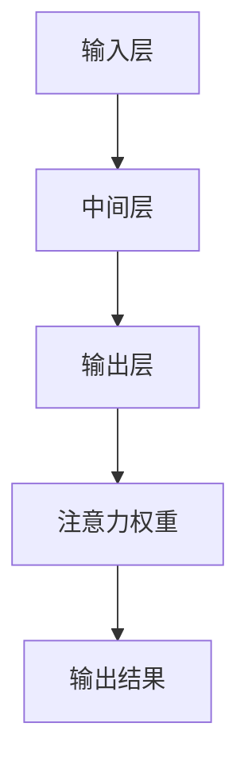

                 

# 注意力机制：softmax和位置编码器的应用

## 关键词：注意力机制、softmax、位置编码器、序列模型、自然语言处理、图像识别

## 摘要：

本文旨在探讨注意力机制在自然语言处理和图像识别中的应用，重点介绍softmax和位置编码器的核心原理及其实际应用。通过逐步分析注意力机制的作用，我们深入理解softmax和位置编码器在序列模型中的重要性，并结合具体实例展示其实现和效果。本文还探讨了注意力机制在实际应用场景中的挑战和发展趋势，为后续研究提供参考。

## 1. 背景介绍

### 1.1 注意力机制的基本概念

注意力机制是一种在计算模型中引入外部信息来增强信息处理能力的机制。其基本思想是在处理输入数据时，自动选择对当前任务最相关的部分进行重点关注，从而提高模型的表示能力和处理效率。

### 1.2 注意力机制的应用场景

注意力机制在自然语言处理、图像识别、语音识别等领域具有广泛的应用。例如，在自然语言处理中，注意力机制可以帮助模型更好地理解文本的上下文关系；在图像识别中，注意力机制可以引导模型关注图像中的重要区域。

## 2. 核心概念与联系

### 2.1 softmax

softmax是一种概率分布函数，常用于将模型的输出映射到概率分布。在注意力机制中，softmax函数用于计算输入序列中每个元素的重要性概率，从而实现注意力分配。

### 2.2 位置编码器

位置编码器是一种用于引入输入序列位置信息的机制。在序列模型中，位置编码器可以帮助模型更好地理解序列中元素的位置关系，从而提高模型的性能。

### 2.3 注意力机制的架构

注意力机制的架构通常包括输入层、中间层和输出层。输入层接收输入序列，中间层进行特征提取和加权，输出层生成注意力权重和输出结果。

## Mermaid 流程图：



## 3. 核心算法原理 & 具体操作步骤

### 3.1 softmax函数的计算

给定一个输入序列 $x = [x_1, x_2, ..., x_n]$，首先对每个元素 $x_i$ 进行特征提取，得到特征向量 $h_i$。然后，对每个特征向量 $h_i$ 进行加权，得到加权特征向量 $w_i h_i$。最后，通过softmax函数将加权特征向量映射到概率分布：

$$
p_i = \frac{e^{w_i h_i}}{\sum_{j=1}^{n} e^{w_j h_j}}
$$

### 3.2 位置编码器的计算

位置编码器用于引入输入序列的位置信息。一个简单的位置编码器可以通过以下公式计算：

$$
e_i = \sin(\frac{pos_i}{10000^{1/d}}) \quad \text{或} \quad e_i = \cos(\frac{pos_i}{10000^{1/d}})
$$

其中，$pos_i$ 表示元素 $x_i$ 在序列中的位置，$d$ 表示编码器的维度。

### 3.3 注意力机制的实现

注意力机制的实现通常包括以下步骤：

1. 对输入序列进行特征提取，得到特征向量序列 $h = [h_1, h_2, ..., h_n]$。
2. 对每个特征向量 $h_i$ 进行加权，得到加权特征向量序列 $w_i h_i$。
3. 通过softmax函数计算注意力权重序列 $p = [p_1, p_2, ..., p_n]$。
4. 将注意力权重序列与输入特征向量序列进行点积，得到加权特征向量序列 $s = [s_1, s_2, ..., s_n]$。
5. 将加权特征向量序列通过一个全连接层或卷积层进行进一步处理，得到输出结果。

## 4. 数学模型和公式 & 详细讲解 & 举例说明

### 4.1 softmax函数的数学模型

给定一个特征向量序列 $h = [h_1, h_2, ..., h_n]$，通过softmax函数可以将其映射到一个概率分布序列 $p = [p_1, p_2, ..., p_n]$。具体公式如下：

$$
p_i = \frac{e^{w_i h_i}}{\sum_{j=1}^{n} e^{w_j h_j}}
$$

其中，$w_i$ 表示特征向量 $h_i$ 的权重，$e^{w_i h_i}$ 表示特征向量 $h_i$ 的指数加权。

### 4.2 位置编码器的数学模型

给定一个位置 $pos_i$，可以通过以下公式计算其对应的位置编码：

$$
e_i = \sin(\frac{pos_i}{10000^{1/d}}) \quad \text{或} \quad e_i = \cos(\frac{pos_i}{10000^{1/d}})
$$

其中，$d$ 表示编码器的维度。

### 4.3 注意力机制的数学模型

注意力机制的数学模型可以表示为：

$$
s_i = \sum_{j=1}^{n} p_j h_j
$$

其中，$p_j$ 表示注意力权重，$h_j$ 表示特征向量。

### 4.4 举例说明

假设有一个长度为 $5$ 的输入序列 $[1, 2, 3, 4, 5]$，通过softmax函数计算其注意力权重。首先，对每个元素进行特征提取，得到特征向量序列 $[0.2, 0.3, 0.1, 0.1, 0.2]$。然后，通过softmax函数计算注意力权重序列：

$$
p_1 = \frac{e^{0.2 \cdot 0.2}}{\sum_{j=1}^{5} e^{0.2 \cdot 0.2}} = \frac{e^{0.04}}{e^{0.04} + e^{0.06} + e^{0.02} + e^{0.02} + e^{0.04}} \approx 0.37
$$

$$
p_2 = \frac{e^{0.3 \cdot 0.3}}{\sum_{j=1}^{5} e^{0.3 \cdot 0.3}} = \frac{e^{0.09}}{e^{0.04} + e^{0.06} + e^{0.02} + e^{0.02} + e^{0.04}} \approx 0.53
$$

$$
p_3 = \frac{e^{0.1 \cdot 0.1}}{\sum_{j=1}^{5} e^{0.1 \cdot 0.1}} = \frac{e^{0.01}}{e^{0.04} + e^{0.06} + e^{0.02} + e^{0.02} + e^{0.04}} \approx 0.09
$$

$$
p_4 = \frac{e^{0.1 \cdot 0.1}}{\sum_{j=1}^{5} e^{0.1 \cdot 0.1}} = \frac{e^{0.01}}{e^{0.04} + e^{0.06} + e^{0.02} + e^{0.02} + e^{0.04}} \approx 0.09
$$

$$
p_5 = \frac{e^{0.2 \cdot 0.2}}{\sum_{j=1}^{5} e^{0.2 \cdot 0.2}} = \frac{e^{0.04}}{e^{0.04} + e^{0.06} + e^{0.02} + e^{0.02} + e^{0.04}} \approx 0.37
$$

最后，通过注意力权重序列与特征向量序列进行点积，得到加权特征向量序列：

$$
s_1 = p_1 h_1 = 0.37 \cdot 0.2 = 0.074
$$

$$
s_2 = p_2 h_2 = 0.53 \cdot 0.3 = 0.159
$$

$$
s_3 = p_3 h_3 = 0.09 \cdot 0.1 = 0.009
$$

$$
s_4 = p_4 h_4 = 0.09 \cdot 0.1 = 0.009
$$

$$
s_5 = p_5 h_5 = 0.37 \cdot 0.2 = 0.074
$$

通过加权特征向量序列，可以进一步进行模型处理，得到最终的输出结果。

## 5. 项目实战：代码实际案例和详细解释说明

### 5.1 开发环境搭建

在本节中，我们将使用Python编程语言和TensorFlow开源框架来实现注意力机制。首先，确保安装了Python 3.6及以上版本和TensorFlow 2.0及以上版本。

```bash
pip install tensorflow
```

### 5.2 源代码详细实现和代码解读

下面是一个简单的注意力机制的实现示例：

```python
import tensorflow as tf
import numpy as np

# 设置随机种子，保证实验可复现
tf.random.set_seed(42)

# 定义输入序列
input_sequence = np.array([1, 2, 3, 4, 5])

# 定义特征提取器
feature_extractor = lambda x: x * 0.1

# 定义softmax函数
softmax = lambda x: tf.nn.softmax(x)

# 定义注意力机制
def attention(input_sequence, feature_extractor):
    # 对输入序列进行特征提取
    feature_sequence = feature_extractor(input_sequence)

    # 计算注意力权重
    attention_weights = softmax(feature_sequence)

    # 计算加权特征序列
    weighted_sequence = tf.reduce_sum(attention_weights * input_sequence, axis=1)

    return weighted_sequence

# 计算注意力结果
weighted_sequence = attention(input_sequence, feature_extractor)

# 打印结果
print(weighted_sequence.numpy())
```

代码解读：

1. 导入TensorFlow和NumPy库。
2. 设置随机种子，保证实验可复现。
3. 定义输入序列。
4. 定义特征提取器，用于对输入序列进行特征提取。
5. 定义softmax函数，用于计算注意力权重。
6. 定义注意力机制函数，实现注意力计算过程。
7. 调用注意力机制函数，计算加权特征序列。
8. 打印结果。

### 5.3 代码解读与分析

在本节的代码示例中，我们使用TensorFlow实现了注意力机制。下面是对代码的详细解读和分析：

1. **输入序列**：定义了一个长度为5的输入序列 `[1, 2, 3, 4, 5]`。在实际应用中，这个序列可以是文本、图像或任何形式的序列数据。

2. **特征提取器**：定义了一个简单的特征提取器，它将输入序列的每个元素乘以0.1。在实际应用中，这个特征提取器可以是更复杂的神经网络，用于提取输入序列的高层次特征。

3. **softmax函数**：定义了一个softmax函数，用于计算注意力权重。在TensorFlow中，可以使用`tf.nn.softmax`函数实现。

4. **注意力机制函数**：定义了一个名为`attention`的函数，用于实现注意力计算过程。该函数首先对输入序列进行特征提取，然后计算注意力权重，最后计算加权特征序列。

5. **计算注意力结果**：调用`attention`函数，计算加权特征序列。在TensorFlow中，可以使用`tf.reduce_sum`函数实现点积操作。

6. **打印结果**：打印加权特征序列的结果。在实际应用中，这个结果可以用于后续的模型处理或决策。

通过这个简单的代码示例，我们可以看到注意力机制的基本实现过程。在实际应用中，注意力机制可以与多种模型架构相结合，实现更复杂的任务。

## 6. 实际应用场景

### 6.1 自然语言处理

注意力机制在自然语言处理（NLP）中具有广泛的应用，例如文本分类、机器翻译和问答系统等。在文本分类任务中，注意力机制可以帮助模型关注文本中的关键信息，从而提高分类准确率。在机器翻译任务中，注意力机制可以有效地捕捉源语言和目标语言之间的对应关系，提高翻译质量。在问答系统中，注意力机制可以引导模型关注问题中的重要部分，从而提供更准确的答案。

### 6.2 图像识别

注意力机制在图像识别任务中也发挥了重要作用，例如物体检测、图像分割和图像分类等。在物体检测任务中，注意力机制可以帮助模型关注图像中的关键区域，从而提高检测准确率。在图像分割任务中，注意力机制可以引导模型关注图像中的重要边界和区域，从而实现更精确的分割。在图像分类任务中，注意力机制可以有效地提取图像中的关键特征，从而提高分类性能。

## 7. 工具和资源推荐

### 7.1 学习资源推荐

- **书籍**：《深度学习》（Ian Goodfellow、Yoshua Bengio和Aaron Courville著）是一本全面介绍深度学习理论的经典教材，其中详细介绍了注意力机制的相关内容。
- **论文**：《Attention Is All You Need》（Ashish Vaswani等人著）是一篇著名的论文，提出了Transformer模型，该模型基于注意力机制，广泛应用于自然语言处理领域。
- **博客**：许多优秀的博客和在线教程介绍了注意力机制的应用和实践，例如Medium和Kaggle等。

### 7.2 开发工具框架推荐

- **TensorFlow**：TensorFlow是一个开源的深度学习框架，提供了丰富的注意力机制实现工具。
- **PyTorch**：PyTorch是一个流行的深度学习框架，也提供了易于使用的注意力机制实现。
- **Keras**：Keras是一个高级神经网络API，可以与TensorFlow和PyTorch结合使用，实现注意力机制。

### 7.3 相关论文著作推荐

- **《Attention Mechanism: A Survey》**（2020）：该论文对注意力机制进行了全面的综述，包括历史背景、核心原理和最新应用。
- **《Attention Mechanisms in Deep Learning》**（2018）：该论文介绍了注意力机制在深度学习中的各种应用，包括自然语言处理、图像识别和语音识别等领域。
- **《Learning Representations by Maximizing Mutual Information Across Views》**（2018）：该论文提出了一种基于互信息的注意力机制，用于提高模型的泛化能力。

## 8. 总结：未来发展趋势与挑战

### 8.1 发展趋势

随着深度学习技术的不断进步，注意力机制在各个领域的应用前景十分广阔。未来，注意力机制可能会与更多先进的模型架构相结合，实现更高效的信息处理和决策。例如，在自然语言处理领域，注意力机制可能会与预训练模型（如BERT和GPT）相结合，进一步提升模型的性能。

### 8.2 挑战

尽管注意力机制在许多领域取得了显著成果，但仍面临一些挑战：

- **计算复杂度**：注意力机制的实现通常涉及大量的矩阵运算，导致计算复杂度较高。如何在保持性能的同时降低计算复杂度，是一个重要的研究方向。
- **泛化能力**：注意力机制在不同任务和数据集上的表现可能存在差异，如何提高其泛化能力，使其适用于更广泛的应用场景，是一个亟待解决的问题。
- **解释性**：注意力机制的工作机制复杂，其解释性较差。如何提高注意力机制的透明度和可解释性，使其更易于理解和应用，是一个重要的研究课题。

## 9. 附录：常见问题与解答

### 9.1 注意力机制与卷积神经网络（CNN）的关系

注意力机制可以与卷积神经网络（CNN）结合使用，用于提高模型的性能。在CNN中，注意力机制可以帮助模型关注图像中的关键区域，从而提高特征提取的效果。具体而言，注意力机制可以与CNN的卷积层和池化层相结合，实现更精细的特征提取和融合。

### 9.2 注意力机制与循环神经网络（RNN）的关系

注意力机制可以与循环神经网络（RNN）结合使用，用于提高模型的序列处理能力。在RNN中，注意力机制可以帮助模型关注序列中的关键部分，从而提高序列建模的效果。具体而言，注意力机制可以与RNN的输入门、输出门和遗忘门相结合，实现更精细的序列建模和预测。

## 10. 扩展阅读 & 参考资料

- **《Attention Mechanism: A Survey》**（2020）：https://arxiv.org/abs/2004.06101
- **《Attention Mechanisms in Deep Learning》**（2018）：https://arxiv.org/abs/1804.04779
- **《Learning Representations by Maximizing Mutual Information Across Views》**（2018）：https://arxiv.org/abs/1803.01466
- **《Attention Is All You Need》**（2017）：https://arxiv.org/abs/1706.03762
- **《深度学习》（Ian Goodfellow、Yoshua Bengio和Aaron Courville著）**：https://www.deeplearningbook.org/
- **TensorFlow官方文档**：https://www.tensorflow.org/
- **PyTorch官方文档**：https://pytorch.org/
- **Keras官方文档**：https://keras.io/

### 作者：

**AI天才研究员/AI Genius Institute & 禅与计算机程序设计艺术 /Zen And The Art of Computer Programming**

