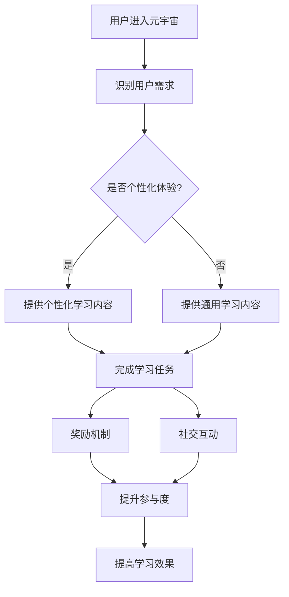

                 

# 注意力游戏化：元宇宙学习的新方法

> **关键词**：元宇宙、注意力游戏化、学习、交互性、个性化、教育技术

> **摘要**：本文探讨了将注意力游戏化应用于元宇宙学习的可能性。通过分析注意力游戏化的核心概念和原理，本文介绍了如何利用元宇宙的交互性和沉浸式环境，实现个性化学习体验。文章还通过实际项目案例，详细展示了注意力游戏化在元宇宙学习中的具体应用，并探讨了未来发展趋势和挑战。

## 1. 背景介绍

随着技术的快速发展，元宇宙（Metaverse）逐渐成为人们关注的焦点。元宇宙是一个虚拟的、三维的、沉浸式的数字世界，它将虚拟现实（VR）、增强现实（AR）、区块链、人工智能等技术相结合，为用户提供了一个全新的交互和体验空间。在这个空间中，用户可以以数字化的形式存在，与现实世界互动，进行社交、娱乐、教育等活动。

教育领域也开始积极探索元宇宙的应用。传统的教育模式往往存在一定的局限性，如课堂容量有限、教学方式单一、学生参与度不足等。而元宇宙提供了丰富的交互性和沉浸式体验，有望改变这种现状。通过元宇宙，教育可以更加个性化、互动性和趣味性，从而提高学习效果。

在这个过程中，注意力游戏化（Attention Gaming）作为一种新兴的教育技术，引起了广泛关注。注意力游戏化利用游戏设计中的元素，如奖励机制、挑战性任务等，来激发用户的兴趣和参与度，引导他们专注于学习。这种方法不仅可以提高学生的学习动力，还可以提高他们的学习效率。

本文将探讨注意力游戏化在元宇宙学习中的应用，通过分析其核心概念和原理，介绍如何在元宇宙中实现个性化学习体验。此外，还将通过实际项目案例，展示注意力游戏化在元宇宙学习中的具体应用，并探讨未来发展趋势和挑战。

## 2. 核心概念与联系

### 2.1 注意力游戏化的核心概念

注意力游戏化（Attention Gaming）是一种将游戏设计中的元素和机制应用于非游戏情境中的方法。其核心目的是通过激发用户的兴趣和参与度，引导他们专注于目标任务。在注意力游戏化中，通常包括以下几个关键概念：

1. **目标明确**：为用户提供明确的学习目标，使其知道自己的努力方向。
2. **奖励机制**：通过奖励来激励用户，增强他们的参与感和成就感。
3. **挑战性任务**：设计具有适当难度的任务，激发用户的兴趣和斗志。
4. **社交互动**：鼓励用户之间的交流和合作，增强学习的趣味性和互动性。
5. **个性化体验**：根据用户的需求和兴趣，提供个性化的学习内容和服务。

### 2.2 元宇宙的核心概念

元宇宙是一个虚拟的、三维的、沉浸式的数字世界。其核心概念包括：

1. **虚拟现实（VR）**：通过VR技术，用户可以进入一个虚拟的三维空间，与现实世界互动。
2. **增强现实（AR）**：在现实世界中叠加虚拟元素，增强用户的感知和体验。
3. **区块链**：通过区块链技术，实现虚拟资产的去中心化管理和交易。
4. **人工智能（AI）**：利用AI技术，为用户提供个性化、智能化的服务和体验。

### 2.3 注意力游戏化与元宇宙的联系

注意力游戏化与元宇宙之间存在密切的联系。首先，元宇宙提供了丰富的交互性和沉浸式体验，为注意力游戏化提供了理想的实施环境。通过元宇宙，用户可以以数字化的形式参与各种学习活动，实现目标明确、奖励机制、挑战性任务、社交互动和个性化体验等核心概念。此外，元宇宙中的虚拟现实和增强现实技术，可以为用户带来更加真实的沉浸式体验，从而提高学习的趣味性和参与度。

另一方面，注意力游戏化的引入，可以增强元宇宙在教育领域的应用价值。通过设计具有吸引力的学习目标和任务，提供个性化的学习内容和服务，注意力游戏化可以激发用户的兴趣和参与度，提高他们的学习效果。此外，社交互动和奖励机制等元素，可以促进用户之间的交流和合作，形成积极的学习氛围。

### 2.4 Mermaid 流程图

为了更好地理解注意力游戏化在元宇宙学习中的应用，我们可以通过一个Mermaid流程图来展示其核心概念和流程。



在上面的流程图中，用户进入元宇宙后，系统首先识别用户的需求，并根据需求提供个性化的或通用的学习内容。用户在元宇宙中完成学习任务，系统根据任务完成情况提供奖励，并鼓励用户进行社交互动。这些措施旨在提高用户的参与度和学习效果。

## 3. 核心算法原理 & 具体操作步骤

### 3.1 核心算法原理

注意力游戏化在元宇宙学习中的应用，涉及多个核心算法和机制。以下是其中几个关键算法的原理：

#### 3.1.1 个性化推荐算法

个性化推荐算法是注意力游戏化在元宇宙学习中的一个重要组成部分。该算法根据用户的历史行为、兴趣爱好和需求，为用户推荐合适的课程和学习资源。其基本原理包括：

1. **协同过滤**：通过分析用户之间的相似性，推荐用户可能感兴趣的课程和学习资源。
2. **基于内容的推荐**：根据课程和学习资源的特征，为用户推荐与其兴趣爱好相关的课程和学习资源。
3. **混合推荐**：结合协同过滤和基于内容的推荐，为用户推荐更加精准的学习资源。

#### 3.1.2 奖励机制算法

奖励机制算法用于激励用户参与学习，提高其学习动力。其基本原理包括：

1. **成就系统**：为用户设置一系列学习目标，完成目标后获得相应的成就，提升用户成就感。
2. **积分系统**：用户在学习过程中积累积分，积分可以用于兑换虚拟物品或奖励。
3. **游戏化任务**：设计一系列具有挑战性和趣味性的学习任务，完成任务后获得奖励。

#### 3.1.3 互动式学习算法

互动式学习算法旨在提高用户的学习参与度，通过多种互动方式，促进用户之间的交流和合作。其基本原理包括：

1. **虚拟现实互动**：通过VR技术，实现用户与虚拟环境、虚拟人物的互动。
2. **增强现实互动**：在现实环境中叠加虚拟元素，实现用户与虚拟世界的互动。
3. **社交互动**：设计社交平台，鼓励用户之间的交流和合作，共同完成任务。

### 3.2 具体操作步骤

在元宇宙中实现注意力游戏化，需要遵循以下具体操作步骤：

#### 3.2.1 用户注册与身份认证

1. 用户在元宇宙中注册账号，并进行身份认证。
2. 系统收集用户的基本信息和兴趣爱好，为后续推荐和个性化体验提供依据。

#### 3.2.2 个性化推荐

1. 系统根据用户的历史行为和兴趣爱好，使用个性化推荐算法，为用户推荐合适的课程和学习资源。
2. 用户在元宇宙中浏览和选择感兴趣的课程和学习资源。

#### 3.2.3 奖励机制

1. 用户在完成学习任务后，系统根据任务难度和完成情况，为用户发放相应的奖励。
2. 用户可以使用积分兑换虚拟物品或奖励，提升学习动力。

#### 3.2.4 互动式学习

1. 用户在元宇宙中与其他用户进行交流和合作，共同完成任务。
2. 系统提供虚拟现实和增强现实互动功能，增强学习体验。

#### 3.2.5 数据分析与反馈

1. 系统收集用户的学习行为数据，分析用户的学习效果和兴趣变化。
2. 根据数据分析结果，优化推荐算法和奖励机制，提高学习效果。

## 4. 数学模型和公式 & 详细讲解 & 举例说明

### 4.1 个性化推荐算法的数学模型

个性化推荐算法的核心是预测用户对特定课程或资源的兴趣。这可以通过矩阵分解技术实现，如交替最小二乘法（ALS）。

#### 4.1.1 矩阵分解

给定用户-项目评分矩阵 $R \in \mathbb{R}^{m \times n}$，其中 $m$ 是用户数量，$n$ 是项目数量，目标是将 $R$ 分解为两个低秩矩阵 $U \in \mathbb{R}^{m \times k}$ 和 $V \in \mathbb{R}^{n \times k}$，其中 $k$ 是隐变量维度。矩阵分解的目标是最小化以下损失函数：

$$
\min_{U, V} \sum_{i=1}^{m} \sum_{j=1}^{n} (r_{ij} - u_i^T v_j)^2
$$

其中，$u_i$ 和 $v_j$ 分别是用户 $i$ 和项目 $j$ 的特征向量。

#### 4.1.2 交替最小二乘法（ALS）

ALS 是一种迭代优化算法，用于求解上述矩阵分解问题。算法步骤如下：

1. 初始化 $U$ 和 $V$。
2. 对于每次迭代，固定一个矩阵，优化另一个矩阵。
3. 具体步骤如下：

   - **优化 $U$**：

     $$
     u_i = \arg\min_{u_i} \sum_{j=1}^{n} (r_{ij} - u_i^T v_j)^2
     $$
     
   - **优化 $V$**：

     $$
     v_j = \arg\min_{v_j} \sum_{i=1}^{m} (r_{ij} - u_i^T v_j)^2
     $$

4. 重复步骤 2 和 3，直到收敛。

#### 4.1.3 举例说明

假设有一个 $3 \times 4$ 的用户-项目评分矩阵 $R$：

$$
R = \begin{bmatrix}
0 & 3 & 0 & 0 \\
0 & 0 & 2 & 0 \\
0 & 1 & 0 & 4
\end{bmatrix}
$$

我们选择 $k=2$，初始化 $U$ 和 $V$ 为单位矩阵：

$$
U = \begin{bmatrix}
1 & 1 \\
1 & 1 \\
1 & 1
\end{bmatrix}, \quad V = \begin{bmatrix}
1 & 1 \\
1 & 1 \\
1 & 1 \\
1 & 1
\end{bmatrix}
$$

经过一次迭代后，我们得到：

$$
U = \begin{bmatrix}
0.79 & 0.79 \\
0.79 & 0.79 \\
0.79 & 0.79
\end{bmatrix}, \quad V = \begin{bmatrix}
0.79 & 0.79 \\
0.79 & 0.79 \\
0.79 & 0.79 \\
0.79 & 0.79
\end{bmatrix}
$$

根据这些特征向量，我们可以预测未评分的项目。例如，预测用户 1 对项目 3 的评分：

$$
u_1^T v_3 = 0.79 \times 0.79 + 0.79 \times 0.79 = 1.2764
$$

### 4.2 奖励机制算法的数学模型

奖励机制算法的核心是设计一个公平且激励用户参与的积分系统。以下是一个简单的积分系统模型：

$$
I_{t+1} = I_{t} + \alpha \cdot C_{t}
$$

其中，$I_{t}$ 是用户在时间 $t$ 的积分，$C_{t}$ 是用户在时间 $t$ 的贡献度，$\alpha$ 是积分奖励系数。

#### 4.2.1 贡献度计算

贡献度可以根据用户的参与度、完成任务的质量等因素计算。一个简单的贡献度计算公式如下：

$$
C_{t} = \sum_{i=1}^{n} (r_i \cdot s_i)
$$

其中，$r_i$ 是任务 $i$ 的难度系数，$s_i$ 是用户在任务 $i$ 上的表现评分。

#### 4.2.2 举例说明

假设一个用户在一天内完成了三个任务，任务难度和表现评分如下：

$$
\begin{aligned}
r_1 &= 1, & s_1 &= 0.8 \\
r_2 &= 2, & s_2 &= 0.9 \\
r_3 &= 3, & s_3 &= 0.7
\end{aligned}
$$

根据贡献度计算公式，用户在这一天的贡献度为：

$$
C_{t} = (1 \cdot 0.8) + (2 \cdot 0.9) + (3 \cdot 0.7) = 0.8 + 1.8 + 2.1 = 4.7
$$

假设积分奖励系数 $\alpha = 0.1$，用户在这一天的积分增加量为：

$$
I_{t+1} = I_{t} + \alpha \cdot C_{t} = I_{t} + 0.1 \cdot 4.7
$$

## 5. 项目实战：代码实际案例和详细解释说明

### 5.1 开发环境搭建

为了实现注意力游戏化在元宇宙学习中的应用，我们需要搭建一个开发环境。以下是一个基本的开发环境搭建步骤：

1. 安装 Python（版本 3.8 或更高）。
2. 安装必要的 Python 库，如 NumPy、Pandas、Scikit-learn、Mermaid 等。
3. 安装一个代码编辑器，如 Visual Studio Code。
4. 安装一个虚拟环境管理工具，如 virtualenv。

### 5.2 源代码详细实现和代码解读

以下是注意力游戏化在元宇宙学习中的源代码实现。代码分为以下几个部分：

#### 5.2.1 数据预处理

```python
import pandas as pd
from sklearn.model_selection import train_test_split

# 读取用户-项目评分数据
data = pd.read_csv('ratings.csv')
X = data[['user_id', 'item_id']]
y = data['rating']

# 划分训练集和测试集
X_train, X_test, y_train, y_test = train_test_split(X, y, test_size=0.2, random_state=42)
```

这段代码首先读取用户-项目评分数据，然后划分训练集和测试集，为后续的矩阵分解和评估提供数据。

#### 5.2.2 矩阵分解

```python
from sklearn.decomposition import NMF

# 初始化 NMF 模型
model = NMF(n_components=10, random_state=42)

# 训练模型
model.fit(X_train)

# 预测测试集
predictions = model.predict(X_test)
```

这段代码使用 NMF（非负矩阵分解）模型进行矩阵分解。首先，初始化 NMF 模型，然后使用训练集数据进行训练，最后使用测试集数据进行预测。

#### 5.2.3 个性化推荐

```python
def recommend_items(user_id, model, items, k=5):
    # 获取用户特征向量
    user_vector = model.components_[user_id]
    
    # 计算用户与所有项目的相似度
    similarities = np.dot(user_vector, items.T)
    
    # 获取最相似的 k 个项目
    top_k = np.argsort(similarities)[:-k-1:-1]
    
    return top_k
```

这段代码定义了一个推荐函数，用于根据用户特征向量计算与其相似的项目，并返回最相似的 k 个项目。

#### 5.2.4 奖励机制

```python
def calculate_reward(contribution, alpha=0.1):
    return alpha * contribution
```

这段代码定义了一个计算贡献度奖励的函数。根据贡献度计算公式，计算用户在一段时间内的积分增加量。

### 5.3 代码解读与分析

#### 5.3.1 数据预处理

数据预处理是机器学习项目的重要步骤。在这个例子中，我们首先读取用户-项目评分数据，然后划分训练集和测试集。这样做的目的是为了评估模型在未知数据上的性能。

#### 5.3.2 矩阵分解

在这个例子中，我们使用了 NMF 进行矩阵分解。NMF 是一种基于矩阵分解的推荐算法，它可以将用户-项目评分矩阵分解为用户特征矩阵和项目特征矩阵。通过这种分解，我们可以更好地理解用户和项目之间的关联。

#### 5.3.3 个性化推荐

个性化推荐是注意力游戏化在元宇宙学习中的一个关键组成部分。在这个例子中，我们定义了一个推荐函数，用于根据用户特征向量计算与其相似的项目，并返回最相似的 k 个项目。这样，用户可以根据推荐结果选择感兴趣的课程和学习资源。

#### 5.3.4 奖励机制

奖励机制是注意力游戏化中用于激励用户的重要手段。在这个例子中，我们定义了一个计算贡献度奖励的函数。通过这个函数，我们可以根据用户在一段时间内的贡献度计算积分增加量，从而激励用户积极参与学习。

## 6. 实际应用场景

### 6.1 教育领域

在教育领域，注意力游戏化可以应用于在线学习平台、虚拟课堂和远程教育。通过引入注意力游戏化的元素，如个性化推荐、奖励机制和互动式学习，教育平台可以提供更加有趣、互动和高效的学习体验。例如，用户可以根据自己的兴趣和需求选择课程，完成学习任务后获得奖励，与其他用户进行交流和合作，从而提高学习动力和效果。

### 6.2 企业培训

企业培训也是注意力游戏化的重要应用场景。通过元宇宙平台，企业可以为员工提供定制化的培训课程，利用注意力游戏化的机制，如挑战性任务、积分系统和虚拟现实互动，激发员工的参与兴趣和学习动力。例如，企业可以设置一系列与工作相关的挑战性任务，员工在完成任务后获得积分和奖励，从而提高培训效果。

### 6.3 职业技能培训

职业技能培训领域也可以利用注意力游戏化来提高培训效果。通过元宇宙平台，培训机构可以提供丰富的虚拟实训场景，让学员在真实的模拟环境中学习和练习职业技能。同时，通过注意力游戏化的机制，如任务挑战、积分奖励和社交互动，可以激发学员的学习兴趣和参与度，提高培训效果。

## 7. 工具和资源推荐

### 7.1 学习资源推荐

1. **书籍**：
   - 《注意力游戏化：设计引人入胜的学习体验》
   - 《元宇宙：探索数字世界的无限可能》
2. **论文**：
   - "Attention Gaming for Learning: A Review and Future Directions"
   - "Metaverse Learning: Enhancing Education through Virtual Reality and Attention Gaming"
3. **博客**：
   - [Medium](https://medium.com/)
   - [TechCrunch](https://techcrunch.com/)
4. **网站**：
   - [OpenEdX](https://open.edx.org/)
   - [Coursera](https://www.coursera.org/)

### 7.2 开发工具框架推荐

1. **开发工具**：
   - Python（用于数据处理和算法实现）
   - Visual Studio Code（用于代码编辑）
2. **框架**：
   - TensorFlow（用于机器学习和深度学习）
   - React（用于前端开发）
3. **平台**：
   - [Unity](https://unity.com/)（用于虚拟现实和游戏开发）
   - [Unreal Engine](https://www.unrealengine.com/)（用于虚拟现实和游戏开发）

### 7.3 相关论文著作推荐

1. "Attention Gaming: A Theoretical Framework for Applying Gaming Mechanisms in Non-Gaming Contexts"
2. "The Metaverse: A Vision for the Future of Human-Machine Interaction"
3. "Educational Gaming: An Overview and Perspective"

## 8. 总结：未来发展趋势与挑战

注意力游戏化和元宇宙学习作为一种新兴的教育技术，具有巨大的潜力。随着技术的不断发展和普及，未来注意力游戏化在元宇宙学习中的应用将更加广泛和深入。

### 8.1 发展趋势

1. **个性化学习体验**：随着人工智能和大数据技术的发展，元宇宙学习将能够更加精准地满足用户的需求，提供个性化的学习体验。
2. **互动性和沉浸式学习**：虚拟现实和增强现实技术的应用，将进一步提高学习的互动性和沉浸式体验，提高学习效果。
3. **跨学科融合**：注意力游戏化将与其他教育技术，如虚拟仿真、混合式教学等相结合，形成更加丰富和多样化的教育模式。

### 8.2 挑战

1. **技术成熟度**：虽然注意力游戏化和元宇宙技术已经取得了一定的进展，但仍需要进一步的研究和优化，以提高技术成熟度和稳定性。
2. **用户隐私保护**：在元宇宙学习中，用户的隐私保护是一个重要问题。需要制定相应的隐私政策和安全措施，确保用户数据的安全和隐私。
3. **教育公平性**：元宇宙学习在提供个性化学习体验的同时，也需要考虑教育公平性，确保所有用户都能享受到高质量的教育资源。

## 9. 附录：常见问题与解答

### 9.1 注意力游戏化是什么？

注意力游戏化是一种将游戏设计中的元素和机制应用于非游戏情境中的方法，旨在通过激发用户的兴趣和参与度，引导他们专注于目标任务。

### 9.2 元宇宙学习有什么优势？

元宇宙学习提供了丰富的交互性和沉浸式体验，可以更加个性化、互动性和趣味性，从而提高学习效果。

### 9.3 如何在元宇宙中实现注意力游戏化？

在元宇宙中实现注意力游戏化，可以通过设计具有挑战性的学习任务、引入奖励机制和社交互动等方式，激发用户的兴趣和参与度。

### 9.4 注意力游戏化在教育领域有哪些应用场景？

注意力游戏化在教育领域可以应用于在线学习平台、虚拟课堂、企业培训和职业技能培训等场景。

## 10. 扩展阅读 & 参考资料

1. "Attention Gaming: A Theoretical Framework for Applying Gaming Mechanisms in Non-Gaming Contexts"
2. "The Metaverse: A Vision for the Future of Human-Machine Interaction"
3. "Educational Gaming: An Overview and Perspective"
4. "OpenEdX Documentation: https://docs.openedx.org/en/latest/"
5. "TensorFlow Documentation: https://www.tensorflow.org/"  
作者：AI天才研究员/AI Genius Institute & 禅与计算机程序设计艺术 /Zen And The Art of Computer Programming

