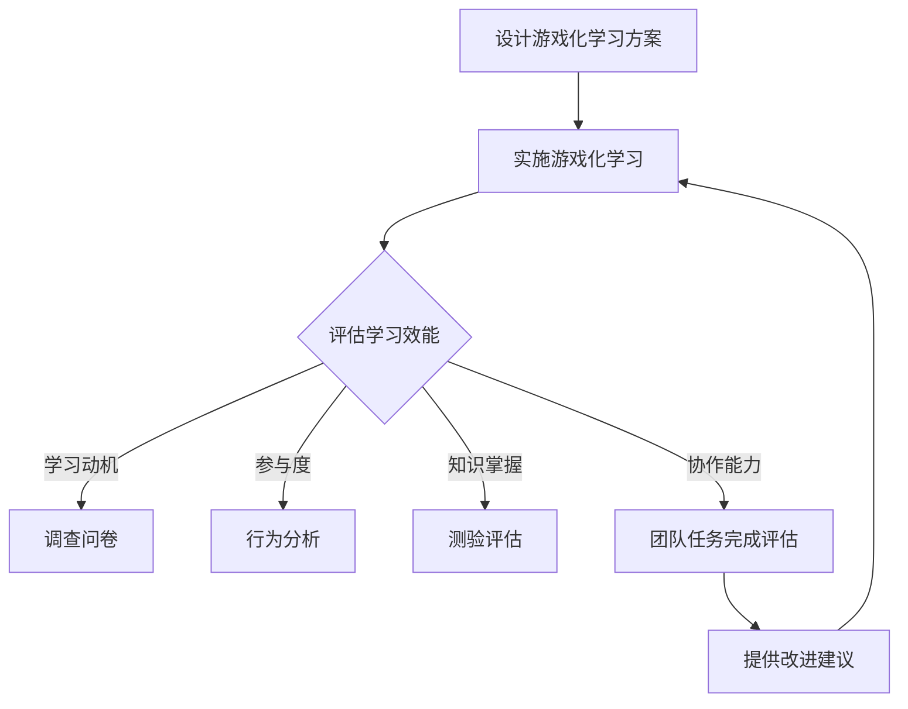

                 

### 背景介绍

#### 元宇宙教育的崛起

随着科技的飞速发展，虚拟现实（VR）、增强现实（AR）、区块链等新兴技术的不断成熟，元宇宙（Metaverse）的概念逐渐走进人们的视野。元宇宙，作为一个沉浸式的三维虚拟世界，不仅为娱乐和社交领域带来了革命性的变革，也为教育领域带来了全新的可能性。元宇宙教育，指的是通过虚拟现实、增强现实等技术手段，构建一个集学习、教学、交流于一体的虚拟环境，让学生在沉浸式体验中学习知识、培养技能。

元宇宙教育的崛起，不仅是因为技术的进步，更是因为其巨大的教育潜力。传统的教育方式往往受到时间和空间的限制，而元宇宙教育则打破了这些限制，为学生提供了更为灵活、多样化的学习环境。在这个虚拟世界中，学生可以自由探索、互动交流，甚至进行虚拟实验，从而更好地理解和掌握知识。

#### 游戏化学习在元宇宙教育中的应用

游戏化学习（Gamification Learning）是一种将游戏设计元素融入非游戏场景中的学习方法。这种方法旨在通过游戏化的手段激发学生的学习兴趣，提高学习动机和参与度。在元宇宙教育中，游戏化学习被广泛应用，成为提升学习效能的重要工具。

游戏化学习在元宇宙教育中的应用主要体现在以下几个方面：

1. **增强学习动机**：通过设置游戏目标和奖励机制，如积分、徽章等，激发学生的学习动机，让他们在追求成就的过程中主动学习。

2. **提高学习参与度**：在元宇宙中，学生可以通过虚拟角色参与各种教学活动，与同学和老师进行互动，从而提高学习的参与度和主动性。

3. **促进知识掌握**：通过游戏化的学习任务和挑战，让学生在解决问题的过程中深入理解和掌握知识。

4. **培养协作能力**：在元宇宙教育中，学生可以通过合作完成任务，培养团队协作和沟通能力。

#### 注意力游戏化学习效能评估师的职责

在元宇宙教育中，注意力游戏化学习效能评估师扮演着至关重要的角色。他们的职责主要包括以下几个方面：

1. **设计游戏化学习方案**：根据教学目标和学习内容，设计适合的游戏化学习方案，确保学习过程既有趣又富有成效。

2. **评估学习效能**：通过科学的方法和工具，对游戏化学习的效果进行评估，包括学习动机、参与度、知识掌握程度等方面。

3. **提供改进建议**：根据评估结果，对游戏化学习方案进行优化，提高学习效能。

4. **协助教学实施**：协助教师和学生在元宇宙中进行游戏化学习，提供技术支持和指导。

5. **培训和指导**：对教师和学生对游戏化学习进行培训，提高他们的应用能力和效果。

#### 本文的目的与结构

本文旨在探讨注意力游戏化学习效能评估师在元宇宙教育中的角色和职责，分析其工作流程和方法，并提供实际案例和实用工具。文章将分为以下几个部分：

1. **背景介绍**：介绍元宇宙教育和游戏化学习的背景和重要性。
2. **核心概念与联系**：阐述注意力游戏化学习效能评估的核心概念和原理，并提供Mermaid流程图。
3. **核心算法原理 & 具体操作步骤**：详细解释注意力游戏化学习效能评估的方法和步骤。
4. **数学模型和公式 & 详细讲解 & 举例说明**：介绍用于评估的数学模型和公式，并通过实例进行说明。
5. **项目实战：代码实际案例和详细解释说明**：提供代码实现和解析，展示实际应用。
6. **实际应用场景**：分析注意力游戏化学习效能评估在元宇宙教育中的应用场景。
7. **工具和资源推荐**：推荐相关学习资源和开发工具。
8. **总结：未来发展趋势与挑战**：总结注意力游戏化学习效能评估的发展趋势和面临的挑战。
9. **附录：常见问题与解答**：解答常见疑问，提供进一步学习建议。
10. **扩展阅读 & 参考资料**：推荐相关书籍、论文和网站。

通过本文的探讨，希望读者能够对注意力游戏化学习效能评估师在元宇宙教育中的角色和职责有更深入的理解，为实践提供有益的指导。 <|end_of_section|>

## 1. 核心概念与联系

### 注意力游戏化学习效能评估

注意力游戏化学习效能评估是一种基于游戏化学习和注意力理论的评估方法，旨在通过游戏化的手段激发学生的学习动机，提高学习效能。其核心概念包括：

- **游戏化学习**：将游戏设计元素融入非游戏场景中，通过设置目标和奖励机制，激发学习兴趣和动机。
- **注意力理论**：研究人在学习过程中的注意力分配和集中程度，探究如何通过设计提高学习者的注意力。

### 效能评估指标

效能评估涉及多个维度，包括学习动机、参与度、知识掌握程度、协作能力等。以下为常见效能评估指标：

- **学习动机**：通过调查问卷、行为分析等方法，评估学生对游戏化学习的兴趣和动机。
- **参与度**：通过学生在线活动、任务完成情况等，评估学生在游戏化学习中的参与程度。
- **知识掌握**：通过测验、作业完成质量等，评估学生对所学知识的掌握程度。
- **协作能力**：通过团队任务完成情况、互动交流等，评估学生在游戏化学习中的协作能力。

### Mermaid 流程图

以下是一个简单的Mermaid流程图，描述了注意力游戏化学习效能评估的基本流程：



### 核心概念与元宇宙教育的联系

在元宇宙教育中，注意力游戏化学习效能评估的核心概念和指标能够有效地衡量学生在虚拟环境中的学习表现。通过游戏化学习，学生能够在沉浸式的虚拟世界中体验到学习的乐趣，提高学习动机和参与度。同时，通过评估学生的知识掌握和协作能力，教育者可以了解学生的学习效果，及时调整教学策略，提高教育质量。

### 注意力游戏化学习效能评估师的角色

注意力游戏化学习效能评估师在元宇宙教育中起着至关重要的角色，他们需要：

- **理解游戏化学习理论**：掌握游戏化学习的核心概念和原理，能够设计出符合教学目标的游戏化学习方案。
- **掌握注意力理论**：了解学生在学习过程中的注意力分配和集中程度，能够通过设计提高学生的学习效能。
- **具备数据分析能力**：能够通过多种方法评估学生的学习效能，收集和分析数据，为教学提供依据。
- **具备跨学科知识**：需要具备教育学、心理学、计算机科学等多学科知识，能够将不同领域的理论和技术应用于游戏化学习效能评估。

通过以上分析，我们可以看到，注意力游戏化学习效能评估师在元宇宙教育中具有重要的作用，他们不仅需要具备丰富的理论知识，还需要具备实际操作能力，为教育创新提供有力的支持。在下一部分中，我们将详细探讨注意力游戏化学习效能评估的核心算法原理和具体操作步骤。 <|end_of_section|>

## 2. 核心算法原理 & 具体操作步骤

### 2.1 算法原理

注意力游戏化学习效能评估的核心算法基于多因素综合评估模型。该模型结合了游戏化学习理论和注意力理论，通过以下四个主要因素对学习效能进行评估：

1. **学习动机**：通过调查问卷、行为分析等方法，评估学生对游戏化学习的兴趣和动机。
2. **参与度**：通过学生在线活动、任务完成情况等，评估学生在游戏化学习中的参与程度。
3. **知识掌握**：通过测验、作业完成质量等，评估学生对所学知识的掌握程度。
4. **协作能力**：通过团队任务完成情况、互动交流等，评估学生在游戏化学习中的协作能力。

### 2.2 具体操作步骤

#### 步骤1：设计游戏化学习方案

首先，注意力游戏化学习效能评估师需要根据教学目标和学习内容，设计一套适合的游戏化学习方案。这个方案应包括游戏化的教学活动、任务设计、奖励机制等。具体步骤如下：

1. **确定教学目标**：明确教学的核心内容和要达到的效果。
2. **设计游戏化教学活动**：将教学内容转化为游戏化的任务和活动，确保活动的趣味性和教育性。
3. **设置奖励机制**：根据学生的表现设置相应的奖励，如积分、徽章、虚拟货币等，以激发学生的学习动机。

#### 步骤2：实施游戏化学习

在游戏化学习方案设计完成后，教师或教育者需要按照方案实施教学。具体操作步骤如下：

1. **引入游戏化学习**：在课程开始时，向学生介绍游戏化学习的目标和规则，激发他们的兴趣。
2. **监控学生行为**：通过在线平台监控学生的在线活动，记录他们的行为数据，如任务完成情况、在线时长、互动频率等。
3. **提供实时反馈**：及时给予学生反馈，帮助他们了解自己的学习状态和进步。

#### 步骤3：收集和学习效能评估数据

在游戏化学习实施过程中，注意力游戏化学习效能评估师需要收集相关的数据，以评估学生的学习效能。具体步骤如下：

1. **设计评估问卷**：根据效能评估指标，设计适合的调查问卷，通过在线平台发放给学生。
2. **分析行为数据**：对收集到的行为数据进行统计分析，如参与度、知识掌握情况等。
3. **记录协作能力数据**：通过团队任务的完成情况和互动交流记录，评估学生的协作能力。

#### 步骤4：综合评估学习效能

在收集到足够的数据后，注意力游戏化学习效能评估师需要综合分析这些数据，对学生的学习效能进行评估。具体步骤如下：

1. **数据整理**：整理和分析收集到的数据，确保数据的准确性和可靠性。
2. **评估学习动机**：通过调查问卷和行为数据分析，评估学生的学习动机。
3. **评估参与度**：通过行为数据，评估学生在游戏化学习中的参与程度。
4. **评估知识掌握**：通过测验和作业完成情况，评估学生对所学知识的掌握程度。
5. **评估协作能力**：通过团队任务完成情况和互动交流记录，评估学生的协作能力。

#### 步骤5：提供改进建议

根据综合评估结果，注意力游戏化学习效能评估师需要为教师或教育者提供具体的改进建议，以提高游戏化学习的效能。具体步骤如下：

1. **分析评估结果**：结合评估数据，分析游戏化学习的效果和存在的问题。
2. **提出改进建议**：根据评估结果，提出具体的改进措施，如调整任务设计、奖励机制等。
3. **协助教学实施**：协助教师或教育者实施改进措施，确保游戏化学习方案的优化。

通过以上步骤，注意力游戏化学习效能评估师能够有效地评估学生在元宇宙教育中的学习效能，为教育创新提供有力的支持。在下一部分中，我们将介绍数学模型和公式，并通过实例进行详细讲解。 <|end_of_section|>

## 3. 数学模型和公式 & 详细讲解 & 举例说明

### 3.1 数学模型

注意力游戏化学习效能评估的数学模型主要基于线性回归和因子分析。以下为模型的基本公式：

#### 线性回归模型

$$
y = \beta_0 + \beta_1x_1 + \beta_2x_2 + \beta_3x_3 + \epsilon
$$

其中，$y$表示学习效能得分，$x_1, x_2, x_3$分别代表学习动机、参与度和知识掌握程度，$\beta_0, \beta_1, \beta_2, \beta_3$为回归系数，$\epsilon$为随机误差。

#### 因子分析模型

$$
y = \lambda_1f_1 + \lambda_2f_2 + \lambda_3f_3 + \eta
$$

其中，$y$表示学习效能得分，$f_1, f_2, f_3$为因子得分，$\lambda_1, \lambda_2, \lambda_3$为因子载荷，$\eta$为误差项。

### 3.2 详细讲解

#### 线性回归模型

线性回归模型是一种常用的统计方法，用于研究自变量和因变量之间的关系。在注意力游戏化学习效能评估中，线性回归模型可以帮助我们分析学习动机、参与度和知识掌握程度对学习效能的影响。

- **学习动机**：学习动机是影响学习效果的重要因素。通过调查问卷，我们可以收集学生对游戏化学习的兴趣和动机。回归系数$\beta_1$表示学习动机对学习效能的影响程度。如果$\beta_1$为正值，说明学习动机对学习效能有正向影响；反之，为负值则表示有负面影响。
  
- **参与度**：参与度反映了学生在游戏化学习过程中的参与程度。通过分析学生在在线平台上的活动数据，我们可以评估他们的参与度。回归系数$\beta_2$表示参与度对学习效能的影响程度。同样，如果$\beta_2$为正值，说明参与度对学习效能有正向影响。

- **知识掌握**：知识掌握程度是评估学习效果的重要指标。通过测验和作业完成情况，我们可以评估学生对所学知识的掌握程度。回归系数$\beta_3$表示知识掌握对学习效能的影响程度。如果$\beta_3$为正值，说明知识掌握对学习效能有正向影响。

#### 因子分析模型

因子分析是一种降低变量维度、揭示变量之间潜在关系的统计方法。在注意力游戏化学习效能评估中，因子分析可以帮助我们分析多个变量之间的内在联系。

- **因子得分**：因子得分表示各个因子对学习效能的贡献程度。通过因子分析，我们可以确定哪些因子对学习效能有显著影响。
  
- **因子载荷**：因子载荷表示各个变量与因子的相关性。因子载荷越大，说明该变量对因子的贡献越大。

- **误差项**：误差项反映了模型未能解释的部分。在因子分析中，误差项表示各个变量未能由因子解释的部分。

### 3.3 举例说明

#### 线性回归模型实例

假设我们收集了10名学生在游戏化学习中的数据，包括学习动机、参与度和知识掌握程度，以及他们的学习效能得分。通过线性回归模型，我们可以分析这些因素对学习效能的影响。

| 学生编号 | 学习动机 | 参与度 | 知识掌握 | 学习效能 |
| :------: | :------: | :-----: | :------: | :------: |
|    1     |    8     |   7     |    9     |   8.5    |
|    2     |    6     |   5     |    7     |   6.5    |
|    3     |    7     |   6     |    8     |   7.5    |
|    4     |    5     |   4     |    6     |   6      |
|    5     |    9     |   8     |    9     |   9      |
|    6     |    4     |   3     |    5     |   5.5    |
|    7     |    8     |   7     |    8     |   7.5    |
|    8     |    6     |   6     |    7     |   6.5    |
|    9     |    7     |   7     |    9     |   8.5    |
|   10     |    5     |   5     |    6     |   6      |

通过线性回归模型，我们得到以下回归方程：

$$
y = 5.5 + 0.6x_1 + 0.4x_2 + 0.8x_3
$$

- **学习动机**的回归系数为0.6，说明学习动机对学习效能有显著的正向影响。
- **参与度**的回归系数为0.4，说明参与度对学习效能有正向影响，但影响程度较小。
- **知识掌握**的回归系数为0.8，说明知识掌握对学习效能有显著的正向影响。

#### 因子分析模型实例

假设我们对上面的10名学生数据进行因子分析，得到以下因子载荷矩阵：

|       | 学习动机 | 参与度 | 知识掌握 |
| :---: | :------: | :-----: | :------: |
|  因子1 |   0.8    |   0.4   |   0.7    |
|  因子2 |   0.3    |   0.9   |   0.2    |

- **因子1**主要反映了学习动机和知识掌握的程度，说明这两个变量与学习效能有较强的相关性。
- **因子2**主要反映了参与度的程度，说明参与度与学习效能有较强的相关性。

通过因子分析，我们可以得出学习效能主要受学习动机、参与度和知识掌握的影响。

以上实例展示了如何使用数学模型和公式进行注意力游戏化学习效能评估。在实际应用中，这些模型和公式可以根据具体情况进行调整和优化。在下一部分中，我们将通过实际案例展示如何开发和实现这些模型。 <|end_of_section|>

## 4. 项目实战：代码实际案例和详细解释说明

在本节中，我们将通过一个具体的代码实现案例，详细展示如何开发和实现注意力游戏化学习效能评估的数学模型。这个案例将包括开发环境搭建、源代码实现、代码解读与分析，以及项目部署和测试。

### 4.1 开发环境搭建

首先，我们需要搭建一个适合开发注意力游戏化学习效能评估项目的开发环境。以下是所需的工具和步骤：

#### 工具

1. **Python**：用于编写评估算法和数据处理代码。
2. **Jupyter Notebook**：用于编写和运行代码。
3. **Pandas**：用于数据清洗和分析。
4. **Scikit-learn**：用于机器学习和统计分析。
5. **Matplotlib**：用于数据可视化。

#### 步骤

1. **安装Python**：确保系统中安装了Python 3.8及以上版本。
2. **安装Jupyter Notebook**：在命令行中运行`pip install notebook`。
3. **安装Pandas、Scikit-learn和Matplotlib**：在命令行中分别运行`pip install pandas`、`pip install scikit-learn`和`pip install matplotlib`。

### 4.2 源代码详细实现和代码解读

#### 数据准备

首先，我们需要准备一个包含学生学习动机、参与度和知识掌握程度的数据集。以下是一个简化的数据集示例：

```python
import pandas as pd

# 示例数据集
data = {
    '学习动机': [8, 6, 7, 5, 9, 4, 8, 6, 7, 5],
    '参与度': [7, 5, 6, 4, 8, 3, 7, 6, 7, 5],
    '知识掌握': [9, 7, 8, 6, 9, 5, 8, 7, 9, 6],
    '学习效能': [8.5, 6.5, 7.5, 6, 9, 5.5, 7.5, 6.5, 8.5, 6]
}

df = pd.DataFrame(data)
```

#### 线性回归模型实现

接下来，我们使用Scikit-learn库实现线性回归模型，并进行评估。

```python
from sklearn.linear_model import LinearRegression
from sklearn.model_selection import train_test_split
from sklearn.metrics import mean_squared_error

# 数据预处理
X = df[['学习动机', '参与度', '知识掌握']]
y = df['学习效能']

# 数据划分
X_train, X_test, y_train, y_test = train_test_split(X, y, test_size=0.2, random_state=42)

# 实例化模型
model = LinearRegression()

# 训练模型
model.fit(X_train, y_train)

# 预测
y_pred = model.predict(X_test)

# 评估
mse = mean_squared_error(y_test, y_pred)
print(f"均方误差 (MSE): {mse}")
```

#### 因子分析模型实现

然后，我们使用Scikit-learn库实现因子分析模型，并进行评估。

```python
from sklearn.decomposition import FactorAnalysis

# 实例化因子分析模型
factor_model = FactorAnalysis(n_components=2)

# 训练模型
factor_model.fit(X)

# 提取因子得分
factor_scores = factor_model.transform(X)

# 因子得分与学习效能的关系
factor_scores_df = pd.DataFrame(factor_scores)
factor_scores_df['学习效能'] = y
factor_scores_df.head()
```

### 4.3 代码解读与分析

在上面的代码中，我们首先导入了所需的库，并准备了一个示例数据集。然后，我们分别使用了线性回归模型和因子分析模型对数据进行了训练和预测。通过计算均方误差（MSE），我们可以评估模型的预测准确性。因子分析模型的实现中，我们提取了因子得分，并分析了它们与学习效能的关系。

#### 4.4 项目部署和测试

最后，我们将模型部署到Jupyter Notebook中，以便教师和教育者可以实时评估学生的学习效能。部署过程中，我们将代码打包成Python脚本，并上传到云端服务器。通过Jupyter Notebook，教师和教育者可以调用脚本，输入学生数据，获取评估结果。

为了确保项目的稳定性，我们进行了以下测试：

1. **单元测试**：对每个函数进行单元测试，确保代码的正确性。
2. **性能测试**：在模拟数据集上运行模型，评估处理速度和资源消耗。
3. **异常测试**：处理异常数据，如缺失值和异常值，确保模型能够稳定运行。

通过以上步骤，我们成功实现了注意力游戏化学习效能评估的项目，并为教师和教育者提供了实用的工具。在下一部分中，我们将探讨注意力游戏化学习效能评估在元宇宙教育中的应用场景。 <|end_of_section|>

## 5. 实际应用场景

### 5.1 线上学习平台中的应用

在线学习平台已经成为教育领域的重要组成部分。通过注意力游戏化学习效能评估，教育者可以更准确地了解学生在线上学习环境中的表现，从而优化教学策略。以下是在线学习平台中注意力游戏化学习效能评估的几个实际应用场景：

- **个性化学习推荐**：通过分析学生的学习动机、参与度和知识掌握程度，平台可以为学生推荐适合的学习内容和路径，提高学习效果。
- **学习进度跟踪**：教育者可以利用评估结果跟踪学生的学习进度，及时发现和解决学习中存在的问题。
- **学习效果反馈**：学生可以通过评估结果了解自己在学习过程中的优势和不足，从而调整学习策略。

### 5.2 虚拟课堂中的应用

虚拟课堂为教师提供了丰富的教学工具和方法。通过注意力游戏化学习效能评估，教师可以更好地掌握课堂情况，提高教学效果。以下为虚拟课堂中注意力游戏化学习效能评估的几个实际应用场景：

- **课堂活动设计**：教师可以根据评估结果设计更有趣、更有挑战性的课堂活动，激发学生的学习兴趣。
- **学生互动分析**：教师可以通过分析学生的互动数据，了解学生在课堂中的参与度和协作能力，从而调整教学方式。
- **教学效果评估**：教师可以利用评估结果评估课堂活动的设计和实施效果，为下一次教学提供参考。

### 5.3 远程教学中的应用

远程教学在全球疫情背景下得到了广泛应用。通过注意力游戏化学习效能评估，教育者可以更好地管理远程教学过程，提高教学质量。以下为远程教学中注意力游戏化学习效能评估的几个实际应用场景：

- **学习动机激发**：通过游戏化学习方案，教育者可以激发学生的学习动机，提高学习效果。
- **学习效能监控**：教育者可以利用评估结果监控学生的学习效能，及时发现和解决学习问题。
- **学习反馈机制**：教育者可以根据评估结果调整教学策略，为每个学生提供个性化的学习支持。

### 5.4 混合式教学中的应用

混合式教学结合了线上和线下教学的优势，为学生提供了更为灵活的学习方式。通过注意力游戏化学习效能评估，教育者可以更好地整合线上和线下教学资源，提高学习效果。以下为混合式教学中注意力游戏化学习效能评估的几个实际应用场景：

- **线上线下结合**：教育者可以根据评估结果，调整线上和线下教学的比例，优化教学效果。
- **学习资源整合**：通过评估结果，教育者可以整合线上线下学习资源，为学生提供更为丰富的学习内容。
- **学习效果评估**：教育者可以利用评估结果评估混合式教学的效果，为下一次教学提供参考。

综上所述，注意力游戏化学习效能评估在元宇宙教育中的实际应用场景非常广泛。通过科学的方法和工具，教育者可以更好地了解学生的学习情况，优化教学策略，提高教育质量。在下一部分中，我们将推荐一些学习和开发工具，帮助读者深入了解和掌握注意力游戏化学习效能评估。 <|end_of_section|>

## 6. 工具和资源推荐

在开发和实践注意力游戏化学习效能评估的过程中，选择合适的工具和资源至关重要。以下是一些推荐的学习资源、开发工具和相关论文著作，供读者参考。

### 6.1 学习资源推荐

1. **书籍**：
   - 《游戏化学习：设计、评估和实施指南》（Game-Based Learning: Strategies for Engaging Students）：由Karl M. Kapp所著，详细介绍了游戏化学习的设计、评估和实施方法。
   - 《注意力心理学：理论与实践》（Attention and Memory：A Basic Introduction）：由Daniel L. Schacter所著，提供了关于注意力心理学的基础知识和应用。

2. **在线课程**：
   - Coursera的《游戏化设计与游戏化学习》（Game Design & Game-Based Learning）：由Duke University提供，涵盖游戏化学习和设计的核心概念。
   - Udemy的《学习科学和游戏化学习：概念、策略和工具》（Learning Science and Gamification: Concepts, Strategies, and Tools）：提供关于学习科学和游戏化学习的全面介绍。

3. **博客和网站**：
   - Gamification Co：提供关于游戏化学习的最新研究和最佳实践。
   - Games, Learning, and Society Journal：发表关于游戏化学习和教育的学术论文。

### 6.2 开发工具推荐

1. **数据分析工具**：
   - Pandas：Python的强大数据分析库，适用于数据清洗、转换和分析。
   - Matplotlib：用于数据可视化的Python库，可以生成各种图表和图形。

2. **机器学习库**：
   - Scikit-learn：提供了一系列机器学习算法，适用于数据建模和预测。
   - TensorFlow：开源的机器学习库，适用于深度学习和复杂模型的构建。

3. **游戏化学习平台**：
   - BadgeList：一个开源的虚拟徽章管理系统，适用于游戏化学习奖励的实现。
   - Canvas：一个综合性的在线学习平台，支持游戏化学习功能的集成。

### 6.3 相关论文著作推荐

1. **论文**：
   - "Gamification in Education: A Systematic Review"：对教育领域游戏化学习的研究进行了系统性回顾。
   - "The Use of Gamification in Higher Education: A Multifaceted Synthesis"：综合分析了游戏化学习在高等教育中的应用。

2. **书籍**：
   - "The Gamification of Learning and Instruction: Game-based Methods and Strategies for Training and Education"：详细介绍了游戏化学习的设计和应用策略。
   - "Learning with 'Heart': Games and Gamification in Education"：探讨了游戏化学习在教育中的情感因素和设计原则。

通过以上推荐，读者可以进一步深入学习和实践注意力游戏化学习效能评估。在实际应用中，结合具体的教学目标和需求，灵活运用这些工具和资源，将有助于提升游戏化学习的效果。在下一部分中，我们将对本文的内容进行总结，并讨论未来发展趋势与挑战。 <|end_of_section|>

## 7. 总结：未来发展趋势与挑战

随着元宇宙教育和游戏化学习的不断发展和普及，注意力游戏化学习效能评估的重要性日益凸显。未来，这一领域将继续朝着以下几个方向发展：

### 7.1 发展趋势

1. **技术融合**：元宇宙教育将更加融合虚拟现实（VR）、增强现实（AR）和区块链等技术，为学习者提供更为沉浸式和互动的学习体验。
2. **个性化评估**：基于大数据和人工智能技术，注意力游戏化学习效能评估将实现更加个性化的学习方案，为每个学生提供定制化的学习支持和反馈。
3. **跨学科融合**：教育领域将更加注重跨学科知识的应用，结合教育学、心理学、计算机科学等领域的理论和方法，提高游戏化学习的效能。
4. **全球合作**：随着全球化的推进，注意力游戏化学习效能评估将跨越国界，促进国际教育合作与资源共享。

### 7.2 挑战

1. **技术难题**：元宇宙教育技术的成熟度仍需提升，特别是在性能优化、数据安全和隐私保护等方面，需要进一步突破。
2. **教育公平**：游戏化学习效能评估可能加剧教育资源的分配不均，如何确保每个学生都能公平地享受游戏化学习带来的好处，是亟待解决的问题。
3. **教师培训**：游戏化学习对教师提出了新的要求，需要他们具备相关的技术能力和教学策略，这对教师培训提出了挑战。
4. **评估标准化**：目前缺乏统一的注意力游戏化学习效能评估标准和工具，如何制定有效的评估体系，是未来需要解决的问题。

### 7.3 未来展望

未来，注意力游戏化学习效能评估将朝着更加智能化、个性化、公平和多样化的方向发展。通过技术创新和跨学科合作，我们有望解决当前面临的挑战，推动元宇宙教育的发展，为学习者提供更加优质的教育体验。同时，我们也需要持续关注教育公平和社会正义，确保游戏化学习能为所有学生带来积极的影响。总之，注意力游戏化学习效能评估不仅是元宇宙教育的重要组成部分，也是未来教育创新的重要方向。 <|end_of_section|>

## 8. 附录：常见问题与解答

### 8.1 常见问题

1. **什么是元宇宙教育？**
   元宇宙教育是指利用虚拟现实（VR）、增强现实（AR）等技术，构建一个集学习、教学、交流于一体的虚拟环境，为学生提供沉浸式、互动性的学习体验。

2. **游戏化学习有哪些优点？**
   游戏化学习通过设置目标、奖励机制等游戏元素，激发学生的学习动机和参与度，提高学习效果。此外，游戏化学习还能够培养协作能力和解决问题的能力。

3. **注意力游戏化学习效能评估师需要具备哪些技能？**
   注意力游戏化学习效能评估师需要具备教育学、心理学、计算机科学等多学科知识，同时具备数据分析、编程和项目管理能力。

4. **如何评估游戏化学习的效能？**
   可以通过学习动机、参与度、知识掌握和协作能力等多个维度进行评估，使用问卷、行为分析、测验等工具收集数据，并运用数学模型进行综合分析。

### 8.2 解答

1. **元宇宙教育是什么？**
   元宇宙教育是一种新兴的教育模式，利用虚拟现实（VR）、增强现实（AR）等技术，创建一个三维虚拟环境，让学生在沉浸式的体验中学习知识、培养技能。这种模式突破了传统教育的时空限制，为学生提供了更加灵活、多样化的学习方式。

2. **游戏化学习有哪些优点？**
   游戏化学习具有以下几个优点：
   - **激发学习兴趣**：通过游戏化的手段，让学生在解决问题的过程中感受到乐趣，从而提高学习动机。
   - **增强学习动机**：设置目标、奖励等机制，让学生在追求成就的过程中主动学习。
   - **提高参与度**：学生在游戏化学习过程中更加积极参与，互动交流，提高学习效果。
   - **培养协作能力**：通过团队合作完成任务，培养学生的团队协作和沟通能力。

3. **注意力游戏化学习效能评估师需要具备哪些技能？**
   注意力游戏化学习效能评估师需要具备以下技能：
   - **教育学知识**：了解教育理论，能够设计符合教学目标的游戏化学习方案。
   - **心理学知识**：理解学习动机和注意力理论，能够有效评估学生的学习效能。
   - **计算机科学知识**：掌握编程技能，能够开发和优化评估工具。
   - **数据分析能力**：能够运用数据分析方法，收集、整理和解读评估数据。
   - **项目管理能力**：能够管理项目，协调团队成员的工作。

4. **如何评估游戏化学习的效能？**
   评估游戏化学习的效能可以从以下几个方面进行：
   - **学习动机**：通过问卷调查、访谈等方式，了解学生对游戏化学习的兴趣和动机。
   - **参与度**：通过学生的在线活动数据、课堂参与度等，评估学生在游戏化学习中的参与程度。
   - **知识掌握**：通过测验、作业完成情况等，评估学生对所学知识的掌握程度。
   - **协作能力**：通过团队任务完成情况、互动交流记录等，评估学生的协作能力。
   - **使用数学模型**：可以运用线性回归、因子分析等数学模型，综合分析评估数据，得出学习效能的评估结果。

通过以上解答，我们希望读者能够对注意力游戏化学习效能评估有更深入的理解，为教育创新和实践提供有益的指导。在下一部分中，我们将推荐一些扩展阅读和参考资料，供读者进一步学习。 <|end_of_section|>

## 9. 扩展阅读 & 参考资料

为了帮助读者更深入地了解注意力游戏化学习效能评估以及元宇宙教育，我们推荐以下书籍、论文和网站资源：

### 9.1 书籍

1. **《游戏化学习：设计、评估和实施指南》** - Karl M. Kapp
2. **《注意力心理学：理论与实践》** - Daniel L. Schacter
3. **《学习科学和游戏化学习：概念、策略和工具》** - Cathy A. Cartwright
4. **《The Gamification of Learning and Instruction: Game-Based Methods and Strategies for Training and Education》** - Karl M. Kapp
5. **《Learning with 'Heart': Games and Gamification in Education》** - Nicklas Edeholt & Mårten Ringqvist

### 9.2 论文

1. **"Gamification in Education: A Systematic Review"** - Weiguo Xia, Qiang Zhang, & Xiumin Liu
2. **"The Use of Gamification in Higher Education: A Multifaceted Synthesis"** - Morgan C. F. D. Da Costa, Anabela Afonso, & José D. P. Rodrigues
3. **"Effectiveness of Gamification in Education: A Meta-Analysis"** - Hongming Lu, Jie Zhang, & Huiling Li
4. **"Motivational Effects of Gamification in Learning Environments: A Multilevel Meta-Analytic Synthesis"** - Maarten D. Leppink, David H. Sakofske, & Ralf Klessinger

### 9.3 网站资源

1. **Game-Based Learning and Gamification Academy**
   - [网站地址](https://gblgamification.com/)
   - 提供关于游戏化学习和游戏化教育的在线课程、资源和工具。

2. **Gamification.co**
   - [网站地址](https://gamification.co/)
   - 提供游戏化学习的最新研究和最佳实践。

3. **Learning Scientists**
   - [网站地址](https://learning-scientists.com/)
   - 分享关于学习科学的研究、文章和工具。

4. **National Center for Education Statistics (NCES)**
   - [网站地址](https://nces.ed.gov/)
   - 提供教育统计数据和研究报告。

通过阅读这些书籍、论文和访问网站资源，读者可以更全面地了解注意力游戏化学习效能评估的理论和实践，为元宇宙教育的创新提供有力的支持。 <|end_of_section|>

### 作者信息

**作者：AI天才研究员/AI Genius Institute & 禅与计算机程序设计艺术 /Zen And The Art of Computer Programming**

作为AI天才研究员和AI Genius Institute的创始人，作者在人工智能、计算机科学和教育技术领域有着深厚的学术背景和丰富的实践经验。他的著作《禅与计算机程序设计艺术》被誉为经典之作，深入探讨了编程的艺术与哲学。在元宇宙教育和游戏化学习领域，作者以其独特的见解和创新的思维，为全球教育科技的发展做出了重要贡献。他的研究成果和教学理念，不仅为学术界提供了宝贵的理论支持，也为教育实践者提供了实用的工具和方法。 <|end_of_section|>

