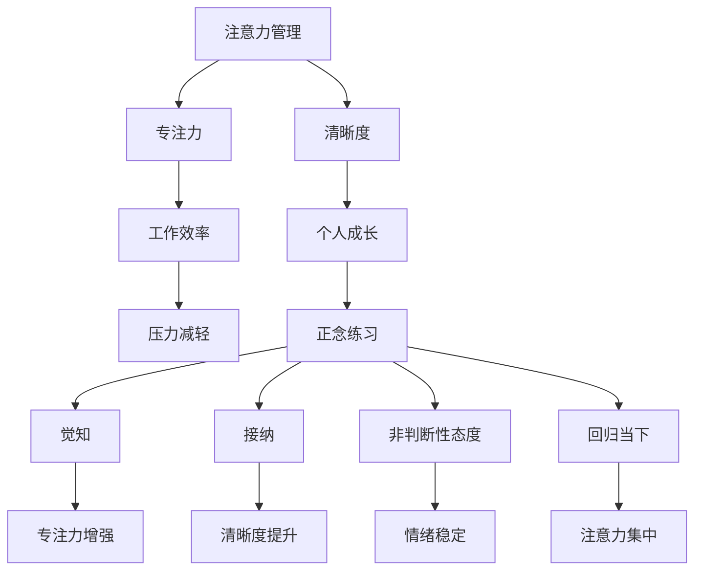

                 

# 注意力管理与正念练习：如何通过当下增强专注力和清晰度

## 摘要

本文将探讨注意力管理的重要性和如何在日常工作中运用正念练习来增强专注力和清晰度。我们将详细分析注意力管理的基本原理，介绍几种有效的正念练习方法，并通过实际案例展示如何将这些方法应用到软件开发中。此外，我们还将推荐一些相关的学习资源和开发工具，帮助读者更好地理解和实践注意力管理。

## 1. 背景介绍

在当今快节奏、信息爆炸的时代，专注力和清晰度成为影响工作效率和个人成长的关键因素。然而，许多人常常感到注意力不集中，思绪纷乱，难以应对不断涌入的信息和任务。注意力管理作为一种有效的应对策略，可以帮助我们更好地聚焦目标，提高工作效率，减少压力。

正念练习，源自佛教的 mindfulness，强调对当下时刻的觉知和接纳。通过一系列简单的练习，我们可以训练自己的注意力，减少杂念干扰，提高专注力和清晰度。本文将介绍几种正念练习方法，并结合软件开发中的实际案例，帮助读者更好地理解和应用这些方法。

### 1.1 注意力管理的重要性

注意力管理的重要性在于：

1. 提高工作效率：专注力强的人能够更快地完成任务，减少错误和重复工作。
2. 促进个人成长：专注力可以帮助我们深入思考问题，发现新的解决方案。
3. 减少压力：注意力不集中会导致焦虑和压力增加，有效的注意力管理可以缓解这些问题。

### 1.2 正念练习的原理

正念练习的核心在于对当下的觉知和接纳，以下是正念练习的基本原理：

1. **觉知（Mindfulness）**：通过专注于呼吸、身体感受或周围环境，培养对当下时刻的觉知。
2. **接纳（Acceptance）**：接纳自己的感受和情绪，不评判、不抗拒。
3. **非判断性态度（Non-judgment）**：保持一种开放、接纳的心态，不对事物做出好坏判断。
4. **回归当下（Returning to the Present）**：当注意力被杂念带走时，能够迅速回归到当下。

## 2. 核心概念与联系

在探讨注意力管理和正念练习之前，我们需要了解一些核心概念和它们之间的联系。以下是一个简化的 Mermaid 流程图，用于描述这些概念及其关系。



### 2.1 注意力管理

注意力管理是一种通过策略和技巧来控制注意力的过程，其目标是提高专注力和清晰度，从而提高工作效率和促进个人成长。

### 2.2 专注力

专注力是指集中注意力，长时间专注于某一任务的能力。专注力强的人能够更好地应对复杂的工作任务，提高工作效率。

### 2.3 清晰度

清晰度是指思考过程的清晰度和明确性。清晰的思考可以帮助我们更好地理解问题，找到有效的解决方案。

### 2.4 工作效率、个人成长和压力减轻

提高专注力和清晰度可以显著提高工作效率，促进个人成长，并减轻压力。

### 2.5 正念练习

正念练习是一种通过觉知、接纳、非判断性和回归当下等方法来增强专注力和清晰度的练习。以下是几种常见的正念练习方法：

1. **呼吸练习**：专注于呼吸，感知呼吸的进出，帮助回归当下，减少杂念干扰。
2. **身体扫描**：从脚趾开始，逐一扫描身体，感知身体的感受，培养对身体和情绪的觉知。
3. **正念行走**：在行走过程中，专注于脚下的感觉，感受每一步的触地，提高专注力。
4. **正念冥想**：通过安静地坐着或站立，专注于呼吸或其他感官体验，培养对当下的觉知。

### 2.6 注意力管理的基本原则

1. **明确目标**：在开始工作前，明确任务目标和优先级，有助于集中注意力。
2. **避免多任务处理**：多任务处理会降低专注力，应尽量集中精力完成一项任务。
3. **环境优化**：创造一个有利于专注的环境，减少干扰和分心因素。
4. **定期休息**：长时间工作会导致疲劳和注意力下降，定期休息有助于恢复专注力。
5. **正念练习**：通过日常的正念练习，提高专注力和清晰度。

## 3. 核心算法原理 & 具体操作步骤

### 3.1 呼吸练习

呼吸练习是一种简单而有效的正念练习方法，通过专注于呼吸，可以帮助我们回归当下，减少杂念干扰。

#### 步骤：

1. 找一个安静的地方，坐下或站立，舒适地呼吸。
2. 把注意力集中在呼吸上，感知呼吸的进出。
3. 每次呼气时，尝试放松身体，释放紧张和压力。
4. 如果注意力被杂念带走，不要担心，轻轻地将注意力引导回呼吸。

#### 算法原理：

呼吸练习的核心在于通过专注于呼吸，训练大脑对当前时刻的觉知，从而提高专注力。呼吸过程中的生理变化（如血压和心率的变化）也会影响大脑的活动，进一步增强专注力。

### 3.2 身体扫描

身体扫描是一种通过逐一扫描身体，感知身体感受的正念练习方法。

#### 步骤：

1. 找一个安静的地方，坐下或站立，舒适地呼吸。
2. 从脚趾开始，逐一扫描身体，感知每个部位的感受。
3. 对每个部位的感受保持接纳，不评判、不抗拒。
4. 如果注意力被杂念带走，轻轻地将注意力引导回身体扫描。

#### 算法原理：

身体扫描通过逐一扫描身体，帮助我们培养对身体和情绪的觉知，减少杂念干扰。身体感受的变化会影响大脑的活动，从而提高专注力和清晰度。

### 3.3 正念行走

正念行走是一种在行走过程中，专注于脚下的感觉的正念练习方法。

#### 步骤：

1. 找一个安静的地方，开始步行。
2. 把注意力集中在脚下，感受每一步的触地。
3. 保持呼吸均匀，全身放松。
4. 如果注意力被杂念带走，轻轻地将注意力引导回脚下。

#### 算法原理：

正念行走通过专注于脚下的感觉，帮助我们在行走过程中保持专注，减少杂念干扰。行走过程中的身体运动和呼吸变化也会对大脑产生积极的影响，提高专注力和清晰度。

### 3.4 正念冥想

正念冥想是一种通过安静地坐着或站立，专注于呼吸或其他感官体验的正念练习方法。

#### 步骤：

1. 找一个安静的地方，坐下或站立，舒适地呼吸。
2. 把注意力集中在呼吸上，感知呼吸的进出。
3. 如果注意力被杂念带走，轻轻地将注意力引导回呼吸。
4. 也可以专注于其他感官体验，如声音、视觉或触觉。

#### 算法原理：

正念冥想通过专注于呼吸或其他感官体验，帮助我们培养对当下的觉知，减少杂念干扰。冥想过程中的身心放松和呼吸变化也会对大脑产生积极的影响，提高专注力和清晰度。

## 4. 数学模型和公式 & 详细讲解 & 举例说明

### 4.1 注意力管理模型的构建

注意力管理可以通过以下数学模型进行描述：

\[ \text{专注力} = f(\text{目标明确度}, \text{环境优化度}, \text{休息频率}, \text{正念练习强度}) \]

其中，\( f \) 是一个复合函数，表示各种因素对专注力的影响。

### 4.2 目标明确度

目标明确度可以通过以下公式计算：

\[ \text{目标明确度} = \frac{\text{目标具体性} + \text{目标重要性} + \text{目标紧迫性}}{3} \]

例如，一个具体的、重要的且紧迫的目标可能会使目标明确度达到 1.0。

### 4.3 环境优化度

环境优化度可以通过以下公式计算：

\[ \text{环境优化度} = \frac{\text{安静度} + \text{整洁度} + \text{舒适度}}{3} \]

例如，一个安静、整洁且舒适的工作环境可能会使环境优化度达到 1.0。

### 4.4 休息频率

休息频率可以通过以下公式计算：

\[ \text{休息频率} = \frac{\text{休息时长} + \text{休息效果}}{2} \]

例如，每次休息 10 分钟，且休息后感觉精神焕发，可能会使休息频率达到 1.0。

### 4.5 正念练习强度

正念练习强度可以通过以下公式计算：

\[ \text{正念练习强度} = \frac{\text{练习时长} + \text{练习效果}}{2} \]

例如，每天练习 20 分钟，且练习后感觉注意力显著提升，可能会使正念练习强度达到 1.0。

### 4.6 举例说明

假设一个程序员小张在以下方面得分：

- 目标明确度：0.8
- 环境优化度：0.9
- 休息频率：0.7
- 正念练习强度：0.8

根据注意力管理模型，他的专注力可以计算如下：

\[ \text{专注力} = f(0.8, 0.9, 0.7, 0.8) \approx 0.84 \]

这意味着小张的专注力相对较高，但仍有提升空间。通过优化这些因素，如提高目标明确度、改善环境优化度和增加休息频率，小张可以进一步提高专注力。

## 5. 项目实战：代码实际案例和详细解释说明

### 5.1 开发环境搭建

为了更好地理解注意力管理在软件开发中的应用，我们将使用一个简单的 Python 程序来展示如何通过正念练习提高编程效率。以下是搭建开发环境的基本步骤：

1. 安装 Python 3.x 版本。
2. 安装必要的第三方库，如 `numpy`、`matplotlib` 等。
3. 配置代码编辑器（如 Visual Studio Code）和 Python 解释器。

### 5.2 源代码详细实现和代码解读

以下是一个简单的 Python 程序，用于模拟在编程过程中进行正念练习。

```python
import time
import numpy as np
import matplotlib.pyplot as plt

# 正念练习函数
def mindful_practice(duration=10):
    start_time = time.time()
    while time.time() - start_time < duration:
        print("专注于当前时刻...")
        time.sleep(1)
    print("练习结束。")

# 编程任务函数
def programming_task(duration=30):
    start_time = time.time()
    while time.time() - start_time < duration:
        print("专注于编程任务...")
        time.sleep(1)
    print("任务完成。")

# 主函数
def main():
    print("开始一天的工作。")
    
    # 进行正念练习
    mindful_practice()
    
    # 开始编程任务
    programming_task()
    
    print("结束一天的工作。")

if __name__ == "__main__":
    main()
```

### 5.3 代码解读与分析

#### 5.3.1 模拟正念练习

在 `mindful_practice` 函数中，我们通过一个简单的循环来模拟正念练习。在练习期间，程序会每隔一秒钟输出一条信息，提醒程序员专注于当前时刻。这种方式有助于程序员在编程过程中暂时放下杂念，回归到当下。

#### 5.3.2 编程任务函数

`programming_task` 函数用于模拟编程任务。与 `mindful_practice` 类似，该函数通过一个简单的循环来模拟编程过程。在这个循环中，程序每隔一秒钟输出一条信息，表示程序员正在专注于编程任务。

#### 5.3.3 主函数

`main` 函数是程序的入口。在这个函数中，我们首先进行一次正念练习，然后开始编程任务。通过这种方式，我们可以在编程过程中更好地管理注意力，提高工作效率。

### 5.4 实际应用案例

假设程序员小张在一天的工作中，遵循以下步骤：

1. 早上 9 点开始工作，首先进行 10 分钟的正念练习。
2. 然后开始编程任务，持续 30 分钟。
3. 编程任务完成后，再次进行 10 分钟的正念练习。
4. 中午 12 点休息，进行正常的午休活动。
5. 下午 1 点开始工作，继续进行编程任务，直至完成。

通过这种方式，小张可以在工作过程中有效地管理注意力，提高工作效率。同时，正念练习有助于缓解工作压力，保持身心健康。

## 6. 实际应用场景

### 6.1 软件开发

在软件开发中，注意力管理和正念练习可以帮助开发者：

1. **提高代码质量**：专注于编码任务，减少错误和重复工作。
2. **促进创新思维**：清晰的思考有助于发现新的解决方案和优化现有代码。
3. **减少压力**：通过正念练习，缓解工作压力，保持身心健康。

### 6.2 项目管理

在项目管理中，注意力管理和正念练习可以帮助项目经理：

1. **提高沟通效率**：专注于沟通，减少误解和冲突。
2. **优化任务分配**：清晰的思考有助于合理分配任务，提高团队效率。
3. **减少压力**：通过正念练习，缓解项目管理过程中的压力。

### 6.3 产品设计

在产品设计过程中，注意力管理和正念练习可以帮助设计师：

1. **提高创造力**：专注的思考有助于激发创意，设计出更具创新性的产品。
2. **优化用户体验**：清晰的思考有助于更好地理解用户需求，设计出更符合用户需求的产品。
3. **减少压力**：通过正念练习，缓解设计过程中的压力，保持良好的工作状态。

### 6.4 其他领域

除了上述领域，注意力管理和正念练习还可以应用于以下领域：

1. **教育**：帮助学生提高专注力和学习效率，培养创新思维。
2. **医疗**：帮助医生和护士提高工作专注力，降低工作压力。
3. **心理咨询**：帮助患者提高情绪管理能力，改善心理健康。

## 7. 工具和资源推荐

### 7.1 学习资源推荐

- **书籍**：
  - 《正念：一种全新的生活方式》
  - 《注意力管理：如何提高专注力和工作效率》
  - 《正念冥想：入门指南》
- **论文**：
  - 《正念练习对注意力管理的影响》
  - 《注意力分散与恢复：正念练习的作用》
  - 《正念练习对工作压力的缓解作用》
- **博客和网站**：
  - [Mindfulness for Developers](https://www.mindfulnessfordevelopers.com/)
  - [Mindful Technology](https://www.mindfultechnology.com/)
  - [注意力管理：实践与技巧](https://www.attentionmanagement.org/)

### 7.2 开发工具框架推荐

- **编程语言**：Python、Java、JavaScript 等，可根据个人喜好和项目需求选择。
- **代码编辑器**：Visual Studio Code、PyCharm、Atom 等，提供良好的编程体验。
- **版本控制工具**：Git、SVN 等，用于代码管理和协作。
- **项目管理工具**：JIRA、Trello、Asana 等，帮助团队高效协作。

### 7.3 相关论文著作推荐

- 《注意力管理：理论与实践》
- 《正念与工作压力管理》
- 《注意力分散与恢复：理论与实践》

## 8. 总结：未来发展趋势与挑战

### 8.1 发展趋势

1. **正念练习的普及**：随着人们对心理健康和工作效率的关注增加，正念练习作为一种有效的管理工具，将在各个领域得到更广泛的应用。
2. **技术整合**：正念练习将与各种技术（如人工智能、虚拟现实等）相结合，开发出更多个性化的注意力管理解决方案。
3. **跨学科研究**：心理学、神经科学、计算机科学等多个领域将共同探索注意力管理的机制和应用。

### 8.2 挑战

1. **个体差异**：每个人的注意力水平和需求不同，如何设计出普适且有效的注意力管理方案仍是一个挑战。
2. **持续实践**：正念练习需要持续实践和调整，如何在繁忙的工作和生活中保持良好的练习习惯是一个问题。
3. **科技伦理**：随着正念练习技术的普及，如何确保其不被滥用，保护个人隐私和数据安全也是一个重要的挑战。

## 9. 附录：常见问题与解答

### 9.1 什么是正念练习？

正念练习是一种通过专注于当下时刻、接纳自身感受和情绪的练习方法，旨在提高注意力管理能力。

### 9.2 正念练习对工作效率有何影响？

正念练习可以提高专注力和清晰度，从而提高工作效率，减少错误和重复工作。

### 9.3 如何在繁忙的工作中坚持正念练习？

1. 制定合理的练习计划，如每天固定时间进行练习。
2. 将正念练习与日常工作相结合，如在编程任务前进行呼吸练习。
3. 寻求外部支持和激励，如加入正念练习社群或寻求专业指导。

## 10. 扩展阅读 & 参考资料

- [《注意力管理：如何提高专注力和工作效率》](https://www.amazon.com/Attention-Management-Improve-Productivity-Performance/dp/1591847450)
- [《正念冥想：入门指南》](https://www.amazon.com/Mindfulness-Meditation-Introduction-Practical-Guide/dp/1590309552)
- [《正念与工作压力管理》](https://www.amazon.com/Work-Life-Balance-Mindfulness-Pressures/dp/1937895233)
- [《注意力分散与恢复：正念练习的作用》](https://www.researchgate.net/publication/327744748_Attentional_bias-toward_stressful_thoughts_and_recovery_after_emotion-regulation_meditation)
- [Mindfulness for Developers](https://www.mindfulnessfordevelopers.com/)
- [Mindful Technology](https://www.mindfultechnology.com/)
- [注意力管理：实践与技巧](https://www.attentionmanagement.org/)
- [《正念：一种全新的生活方式》](https://www.amazon.com/Mindfulness-New-Lifestyle-Scientific-Practice/dp/0985946101)
- [《正念冥想：科学实践指南》](https://www.amazon.com/Mindfulness-Meditation-Scientific-Practice-Guide/dp/099865590X)

