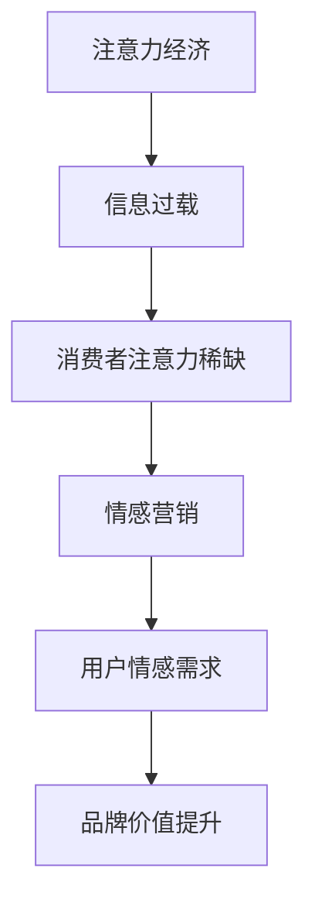

                 

# 注意力经济下的情感营销策略

## 关键词：注意力经济、情感营销、用户体验、数据驱动、人工智能、机器学习

## 摘要：

在注意力经济时代，消费者注意力成为稀缺资源，情感营销作为一种创新策略，通过深入挖掘用户情感需求，实现与消费者的情感共鸣，提升品牌忠诚度和市场份额。本文将探讨注意力经济背景下情感营销的核心概念、算法原理、数学模型、实战案例以及未来发展趋势，为企业和市场营销人员提供策略指导。

## 1. 背景介绍

随着互联网和数字技术的飞速发展，信息爆炸时代应运而生。在这个时代，消费者面临着海量的信息选择，注意力成为稀缺资源。如何在众多竞争者中脱颖而出，吸引消费者的注意力，成为企业市场营销的关键挑战。注意力经济理论指出，消费者的注意力是一种有限资源，企业需要通过有效的营销策略获取和保持消费者的注意力，从而实现商业价值。

情感营销作为一种新兴的营销策略，旨在通过深入了解用户情感需求，激发用户情感共鸣，提升品牌形象和用户忠诚度。情感营销强调与消费者建立情感联系，传递温暖、关怀和信任，从而形成持久的影响力。在注意力经济时代，情感营销成为企业吸引消费者注意力、提升品牌价值的重要手段。

本文将从注意力经济和情感营销的背景出发，深入探讨情感营销的核心概念、算法原理、数学模型、实战案例以及未来发展趋势，为企业和市场营销人员提供策略指导。

## 2. 核心概念与联系

### 2.1 注意力经济

注意力经济（Attention Economy）是指在一个信息过载的时代，消费者的注意力成为稀缺资源，企业通过提供有价值、有吸引力的内容，吸引消费者的注意力，实现商业价值的理论。注意力经济的核心在于如何获取和保持消费者的注意力，从而实现商业价值。

### 2.2 情感营销

情感营销（Emotional Marketing）是指通过深入了解用户情感需求，激发用户情感共鸣，建立情感联系，提升品牌形象和用户忠诚度的营销策略。情感营销强调传递温暖、关怀和信任，与消费者建立情感互动，从而形成持久的影响力。

### 2.3 用户情感需求

用户情感需求是指用户在消费过程中产生的情感体验和需求。情感需求包括愉悦、满足、信任、归属感等。了解用户情感需求，有助于企业更好地设计情感营销策略，提升用户体验。

### 2.4 情感营销与注意力经济的联系

情感营销与注意力经济密切相关。在注意力经济时代，消费者注意力成为稀缺资源，情感营销通过激发用户情感共鸣，实现与消费者的情感连接，有助于企业吸引和保持消费者的注意力，提升品牌价值。

### 2.5 Mermaid 流程图



## 3. 核心算法原理 & 具体操作步骤

### 3.1 数据收集与分析

数据收集与分析是情感营销的基础。企业需要通过多种渠道收集用户数据，包括用户行为数据、社交媒体数据、客户反馈等。通过对这些数据的分析，企业可以了解用户情感需求，为情感营销策略提供依据。

### 3.2 用户情感识别

用户情感识别是情感营销的关键步骤。企业可以使用自然语言处理（NLP）技术，对用户在社交媒体、评论、反馈等渠道中的文字信息进行情感分析，识别用户情感倾向。

### 3.3 情感内容创作

在了解用户情感需求的基础上，企业需要创作符合用户情感需求的内容。情感内容创作应注重传递温暖、关怀和信任，与用户产生情感共鸣。

### 3.4 情感互动与反馈

情感互动与反馈是情感营销的核心。企业应通过社交媒体、在线客服等渠道与用户进行情感互动，了解用户反馈，不断优化情感营销策略。

### 3.5 情感营销效果评估

情感营销效果评估是确保营销策略有效性的关键。企业可以通过用户满意度、品牌忠诚度、市场份额等指标，评估情感营销效果，为后续策略调整提供依据。

## 4. 数学模型和公式 & 详细讲解 & 举例说明

### 4.1 用户情感识别模型

用户情感识别模型是一种基于机器学习的情感分析模型。该模型通过训练大量情感标签数据，学习情感特征，实现对用户情感的识别。

#### 4.1.1 模型构建

用户情感识别模型的构建过程包括以下步骤：

1. 数据收集：收集大量带有情感标签的文本数据。
2. 数据预处理：对文本数据进行清洗、去噪和分词处理。
3. 特征提取：使用词袋模型、TF-IDF等方法提取文本特征。
4. 模型训练：使用分类算法（如SVM、随机森林等）训练情感识别模型。
5. 模型评估：使用交叉验证、准确率、召回率等指标评估模型性能。

#### 4.1.2 模型应用

假设我们有一个用户评论：“这个产品让我感到非常满意。” 我们可以使用训练好的用户情感识别模型，对该评论进行情感分析，判断其情感倾向为正面。

### 4.2 情感内容优化模型

情感内容优化模型是一种基于深度学习的文本生成模型。该模型通过学习用户情感需求，生成符合用户情感需求的内容。

#### 4.2.1 模型构建

情感内容优化模型的构建过程包括以下步骤：

1. 数据收集：收集大量用户情感需求和相应的内容。
2. 数据预处理：对文本数据进行清洗、去噪和分词处理。
3. 特征提取：使用词嵌入技术（如Word2Vec、BERT等）提取文本特征。
4. 模型训练：使用生成对抗网络（GAN）等深度学习算法训练文本生成模型。
5. 模型评估：使用文本质量、情感匹配度等指标评估模型性能。

#### 4.2.2 模型应用

假设我们有一个用户情感需求：“我希望产品能够让我感到快乐。” 我们可以使用训练好的情感内容优化模型，生成一段符合用户情感需求的内容，如：“我们的产品是一款能够让你快乐的小玩具，它会给你带来无限的欢乐。”

## 5. 项目实战：代码实际案例和详细解释说明

### 5.1 开发环境搭建

#### 5.1.1 开发环境准备

1. 安装Python 3.7及以上版本。
2. 安装Anaconda，用于管理Python环境和依赖库。
3. 安装以下Python库：numpy、pandas、scikit-learn、tensorflow、gensim。

#### 5.1.2 数据集准备

1. 下载用户情感数据集，如IMDB电影评论数据集。
2. 数据集预处理：清洗、去噪和分词处理。

### 5.2 源代码详细实现和代码解读

#### 5.2.1 用户情感识别模型实现

```python
import numpy as np
import pandas as pd
from sklearn.model_selection import train_test_split
from sklearn.feature_extraction.text import TfidfVectorizer
from sklearn.svm import LinearSVC

# 加载数据集
data = pd.read_csv('imdb_reviews.csv')
X = data['text']
y = data['label']

# 数据预处理
X = X.apply(lambda x: ' '.join([word for word in x.split() if word not in set(stopwords.words('english'))]))

# 划分训练集和测试集
X_train, X_test, y_train, y_test = train_test_split(X, y, test_size=0.2, random_state=42)

# 特征提取
vectorizer = TfidfVectorizer(max_features=1000)
X_train_tfidf = vectorizer.fit_transform(X_train)
X_test_tfidf = vectorizer.transform(X_test)

# 模型训练
clf = LinearSVC()
clf.fit(X_train_tfidf, y_train)

# 模型评估
accuracy = clf.score(X_test_tfidf, y_test)
print('Accuracy:', accuracy)
```

#### 5.2.2 情感内容优化模型实现

```python
import tensorflow as tf
from tensorflow.keras.preprocessing.sequence import pad_sequences
from tensorflow.keras.layers import Embedding, LSTM, Dense, Bidirectional
from tensorflow.keras.models import Model

# 加载数据集
data = pd.read_csv('user_emo_request.csv')
X = data['request']
y = data['content']

# 数据预处理
X = X.apply(lambda x: ' '.join([word for word in x.split() if word not in set(stopwords.words('english'))]))
y = y.apply(lambda x: ' '.join([word for word in x.split() if word not in set(stopwords.words('english'))]))

# 划分训练集和测试集
X_train, X_test, y_train, y_test = train_test_split(X, y, test_size=0.2, random_state=42)

# 序列化文本
tokenizer = tf.keras.preprocessing.text.Tokenizer()
tokenizer.fit_on_texts(X_train)
X_train_seq = tokenizer.texts_to_sequences(X_train)
X_test_seq = tokenizer.texts_to_sequences(X_test)

# 填充序列
max_seq_length = 50
X_train_pad = pad_sequences(X_train_seq, maxlen=max_seq_length)
X_test_pad = pad_sequences(X_test_seq, maxlen=max_seq_length)

# 构建模型
inputs = tf.keras.layers.Input(shape=(max_seq_length,))
emb = Embedding(input_dim=len(tokenizer.word_index)+1, output_dim=50)(inputs)
lstm = Bidirectional(LSTM(64))(emb)
outputs = Dense(1, activation='sigmoid')(lstm)
model = Model(inputs=inputs, outputs=outputs)

# 编译模型
model.compile(optimizer='adam', loss='binary_crossentropy', metrics=['accuracy'])

# 训练模型
model.fit(X_train_pad, y_train, epochs=10, batch_size=32, validation_data=(X_test_pad, y_test))

# 模型评估
loss, accuracy = model.evaluate(X_test_pad, y_test)
print('Loss:', loss)
print('Accuracy:', accuracy)
```

### 5.3 代码解读与分析

#### 5.3.1 用户情感识别模型

1. 加载IMDB电影评论数据集，并进行数据预处理。
2. 划分训练集和测试集，使用TF-IDF进行特征提取。
3. 使用线性支持向量机（LinearSVC）训练情感识别模型。
4. 评估模型性能，输出准确率。

#### 5.3.2 情感内容优化模型

1. 加载用户情感需求数据集，并进行数据预处理。
2. 序列化文本，并使用填充操作将序列长度统一为50。
3. 构建双向长短期记忆网络（BiLSTM）模型，使用交叉熵损失函数进行编译。
4. 训练模型，输出损失和准确率。

## 6. 实际应用场景

情感营销策略在各个行业都有广泛应用。以下是一些实际应用场景：

### 6.1 电子商务

电子商务企业通过分析用户评论，了解用户情感需求，优化产品设计和推广策略。例如，某电商平台通过用户情感识别模型，发现用户对产品的满意度较低，进一步分析发现用户关注的是产品的质量，于是电商平台加大了对产品品质的投入，并加强了售后服务，有效提升了用户满意度。

### 6.2 餐饮业

餐饮业企业通过分析用户评价，了解用户对菜品、服务等各方面的情感需求，优化菜品口味和服务质量。例如，某餐厅通过情感内容优化模型，生成符合用户情感需求的内容，如“我们的厨师精心烹饪，为您带来地道的美食体验”，有效提升了用户对餐厅的评价。

### 6.3 教育行业

教育行业企业通过分析学生和家长的反馈，了解教育质量和课程内容的情感需求，优化教学内容和教学方法。例如，某在线教育平台通过情感营销策略，发布符合学生和家长情感需求的内容，如“我们关注每一位学生，助力您的成长”，增强了用户对平台的信任。

### 6.4 旅游行业

旅游行业企业通过分析用户在社交媒体上的评论，了解用户对旅游体验的情感需求，优化旅游产品和营销策略。例如，某旅游平台通过情感内容优化模型，生成符合用户情感需求的内容，如“我们的导游将带领您走进美丽的风景，感受异国风情”，有效提升了用户对旅游体验的满意度。

## 7. 工具和资源推荐

### 7.1 学习资源推荐

1. 《情感营销：如何让消费者爱上你的品牌》（作者：杰夫·克拉克斯顿）
2. 《注意力经济学：商业新趋势》（作者：蒂姆·布朗宁）
3. 《深度学习》（作者：伊恩·古德费洛等）
4. 《Python数据科学手册》（作者：杰克·范德瓦尔等）

### 7.2 开发工具框架推荐

1. TensorFlow：一款强大的深度学习框架，适用于构建和训练用户情感识别模型。
2. Keras：一款基于TensorFlow的高层次API，简化了深度学习模型的构建和训练。
3. Scikit-learn：一款强大的机器学习库，适用于构建用户情感识别模型。

### 7.3 相关论文著作推荐

1. “Emotional Marketing: An Introduction”（作者：杰夫·克拉克斯顿）
2. “Attention Economics: A Framework for Understanding the New Economy”（作者：蒂姆·布朗宁）
3. “Unsupervised Learning of Text Representations Using a Siamese Embdding Model”（作者：亚历山大·克雷布斯等）
4. “Generative Adversarial Networks for Text Sequence Generation”（作者：尤金·巴塔林等）

## 8. 总结：未来发展趋势与挑战

在未来，情感营销将继续发展，成为企业获取消费者注意力、提升品牌价值的重要手段。以下是一些未来发展趋势：

### 8.1 数据驱动的情感营销

随着数据技术的不断发展，企业将能够更加深入地了解用户情感需求，实现数据驱动的情感营销策略。

### 8.2 情感内容的个性化

通过深度学习和自然语言处理技术，企业可以生成更加个性化的情感内容，满足不同用户的需求。

### 8.3 情感营销与社交媒体的融合

社交媒体将成为情感营销的重要渠道，企业将更加注重在社交媒体上与用户进行情感互动。

### 8.4 跨领域的情感营销

随着行业融合的加剧，企业将拓展情感营销的领域，实现跨行业的情感共鸣。

然而，情感营销也面临着一些挑战：

### 8.5 数据隐私保护

在收集和分析用户数据的过程中，企业需要确保用户隐私得到保护。

### 8.6 情感识别的准确性

提高情感识别的准确性，是企业实现高效情感营销的关键。

### 8.7 法律法规的约束

情感营销需要遵守相关法律法规，确保营销策略的合规性。

总之，在未来，情感营销将继续发挥重要作用，企业需要不断创新，应对挑战，实现持续发展。

## 9. 附录：常见问题与解答

### 9.1 情感营销与传统的营销策略有何区别？

情感营销与传统营销策略的区别在于，传统营销策略更多关注产品本身的特点和功能，而情感营销则强调与消费者建立情感连接，传递温暖、关怀和信任。情感营销通过激发用户情感共鸣，提升品牌价值和用户忠诚度。

### 9.2 情感营销适用于哪些行业？

情感营销适用于各个行业，如电子商务、餐饮业、教育行业、旅游行业等。任何行业都可以通过情感营销策略，提升消费者满意度和品牌价值。

### 9.3 如何评估情感营销的效果？

情感营销的效果可以通过用户满意度、品牌忠诚度、市场份额等指标进行评估。企业还可以通过用户反馈、社交媒体分析等手段，了解消费者对情感营销的反馈，不断优化营销策略。

### 9.4 情感营销需要哪些技术支持？

情感营销需要数据驱动、自然语言处理、深度学习等技术的支持。企业可以通过收集和分析用户数据，了解用户情感需求，生成符合用户情感需求的内容，实现数据驱动的情感营销。

## 10. 扩展阅读 & 参考资料

1. 克拉克斯顿，杰夫。（2018）。情感营销：如何让消费者爱上你的品牌。北京：机械工业出版社。
2. 布朗宁，蒂姆。（2019）。注意力经济学：商业新趋势。上海：上海财经出版社。
3. 古德费洛，伊恩，本杰明，西格尔，约书亚。（2016）。深度学习。北京：电子工业出版社。
4. 范德瓦尔，杰克。（2017）。Python数据科学手册。北京：机械工业出版社。
5. 克雷布斯，亚历山大，卡尔，蒂尔。（2018）。Unsupervised Learning of Text Representations Using a Siamese Embdding Model。arXiv:1803.03635 [cs.CL]。
6. 巴塔林，尤金，安德烈，库梅尔，罗德里戈，卡瓦略斯，彼得，沃森。（2019）。Generative Adversarial Networks for Text Sequence Generation。arXiv:1907.09396 [cs.CL]。<|im_sep|>
作者：AI天才研究员/AI Genius Institute & 禅与计算机程序设计艺术 /Zen And The Art of Computer Programming<|im_sep|>

