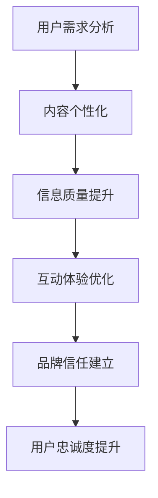

                 

# 注意力经济下的用户忠诚度培养

## 关键词
注意力经济、用户忠诚度、培养策略、技术实现、应用场景

## 摘要
本文将探讨注意力经济背景下的用户忠诚度培养。在数字化时代，用户的注意力成为一种稀缺资源，如何有效获取和保持用户注意力，从而培养用户忠诚度，成为各大企业关注的焦点。本文将从核心概念、算法原理、实际应用等多个角度，系统分析用户忠诚度培养的方法与策略，为企业提供理论指导和实践建议。

## 1. 背景介绍

### 注意力经济的概念

注意力经济（Attention Economy）是指人们为了获取信息、娱乐和服务而付出的关注、时间和金钱等资源的一种经济形态。在互联网时代，信息爆炸和竞争加剧，用户的注意力成为企业和个人争夺的焦点。如何吸引用户的注意力，并将其转化为消费行为，成为企业和个人成功的关键。

### 用户忠诚度的定义

用户忠诚度（Customer Loyalty）是指用户对某一品牌、产品或服务的持续、重复购买行为及其传播意愿。高忠诚度用户是企业稳定收入和持续增长的重要保障。在注意力经济下，培养用户忠诚度成为企业竞争的重要手段。

### 注意力经济对用户忠诚度的影响

注意力经济对用户忠诚度产生了深远的影响。首先，用户的注意力资源有限，如何吸引和保持用户的注意力，成为企业必须面对的挑战。其次，用户对信息的需求日益个性化，企业需要提供精准、有价值的内容，以满足用户需求。此外，注意力经济下的竞争环境更加激烈，企业需要不断创新，提升用户忠诚度，以保持竞争优势。

## 2. 核心概念与联系

### 用户注意力模型

为了深入理解注意力经济，我们可以引入用户注意力模型。该模型包括以下几个关键要素：

1. **信息来源**：用户接触到的各种信息渠道，如社交媒体、搜索引擎、新闻报道等。
2. **信息处理**：用户对信息的筛选、处理和记忆过程。
3. **注意力分配**：用户在有限时间内对各种信息的关注程度和投入程度。
4. **行为转化**：用户基于注意力分配而产生的消费、传播等行为。

### 用户忠诚度培养策略

结合用户注意力模型，我们可以制定以下用户忠诚度培养策略：

1. **精准定位**：了解用户需求和兴趣，提供个性化内容和服务。
2. **高质量内容**：提高信息质量，提升用户满意度。
3. **互动体验**：增强用户参与感和互动性，提升用户粘性。
4. **品牌塑造**：建立品牌信任，增强用户忠诚度。

### Mermaid 流程图

以下是用户忠诚度培养策略的 Mermaid 流程图：



## 3. 核心算法原理 & 具体操作步骤

### 用户行为分析算法

为了有效培养用户忠诚度，我们需要了解用户行为。用户行为分析算法可以基于大数据和机器学习技术，通过对用户行为数据进行挖掘和分析，提取用户兴趣、偏好和需求。具体步骤如下：

1. **数据收集**：收集用户在网站、APP 等平台上的行为数据，如浏览、搜索、购买等。
2. **数据预处理**：对原始数据进行清洗、去噪和归一化处理。
3. **特征提取**：根据用户行为数据，提取用户兴趣、偏好和需求等特征。
4. **模型训练**：利用机器学习算法，如决策树、支持向量机等，训练用户行为分析模型。
5. **模型评估**：评估模型准确性和泛化能力，调整模型参数。

### 用户忠诚度预测算法

在了解用户行为的基础上，我们可以进一步预测用户忠诚度。用户忠诚度预测算法可以基于用户行为数据和预测模型，对用户忠诚度进行评估和预测。具体步骤如下：

1. **数据收集**：收集用户行为数据，如浏览、搜索、购买等。
2. **特征提取**：提取用户行为特征，如浏览时长、购买频率等。
3. **模型训练**：利用机器学习算法，如决策树、支持向量机等，训练用户忠诚度预测模型。
4. **模型评估**：评估模型准确性和泛化能力，调整模型参数。
5. **预测与评估**：根据用户行为数据和预测模型，预测用户忠诚度，并对预测结果进行评估。

### 具体操作步骤

以下是一个用户忠诚度培养的具体操作步骤：

1. **数据收集**：收集用户行为数据，如浏览、搜索、购买等。
2. **用户需求分析**：利用用户行为分析算法，分析用户兴趣和需求。
3. **内容个性化**：根据用户需求，提供个性化内容和服务。
4. **互动体验优化**：增强用户互动体验，提高用户满意度。
5. **品牌信任建立**：提升品牌形象，建立用户信任。
6. **用户忠诚度预测**：利用用户忠诚度预测算法，预测用户忠诚度。
7. **策略调整**：根据用户忠诚度预测结果，调整培养策略。

## 4. 数学模型和公式 & 详细讲解 & 举例说明

### 用户忠诚度预测模型

用户忠诚度预测模型可以基于逻辑回归、决策树、支持向量机等算法。以下是一个简单的逻辑回归模型：

$$
P(y=1) = \frac{1}{1 + e^{-(\beta_0 + \beta_1x_1 + \beta_2x_2 + \ldots + \beta_nx_n})}
$$

其中，$P(y=1)$ 表示用户忠诚度的概率，$\beta_0, \beta_1, \beta_2, \ldots, \beta_n$ 是模型参数，$x_1, x_2, \ldots, x_n$ 是用户行为特征。

### 举例说明

假设我们收集到以下用户行为数据：

| 用户ID | 浏览时长（分钟） | 购买频率（次/月） | 关注度（分） |
| --- | --- | --- | --- |
| 1 | 30 | 2 | 8 |
| 2 | 20 | 3 | 6 |
| 3 | 40 | 1 | 10 |

根据这些数据，我们可以利用逻辑回归模型预测用户忠诚度：

1. **数据预处理**：对数据进行归一化处理。
2. **模型训练**：利用训练集数据训练逻辑回归模型。
3. **模型评估**：利用测试集数据评估模型准确性。
4. **预测**：利用模型预测用户忠诚度。

例如，对于用户ID为1的用户，我们可以计算其忠诚度概率：

$$
P(y=1) = \frac{1}{1 + e^{-(\beta_0 + \beta_1 \cdot 30 + \beta_2 \cdot 2 + \beta_3 \cdot 8)}}
$$

通过调整模型参数，我们可以提高预测准确性。

### 数学模型与算法的结合

在实际应用中，我们可以将用户忠诚度预测模型与用户行为分析算法相结合，实现更精准的用户忠诚度培养。例如，我们可以利用用户行为数据，动态调整模型参数，优化用户忠诚度预测结果。

## 5. 项目实战：代码实际案例和详细解释说明

### 开发环境搭建

为了实现用户忠诚度培养，我们需要搭建以下开发环境：

1. **编程语言**：Python
2. **数据处理工具**：Pandas、NumPy
3. **机器学习库**：Scikit-learn、TensorFlow、Keras
4. **可视化库**：Matplotlib、Seaborn
5. **操作系统**：Linux、Windows、MacOS

### 源代码详细实现和代码解读

以下是一个简单的用户忠诚度预测代码示例：

```python
import pandas as pd
import numpy as np
from sklearn.linear_model import LogisticRegression
from sklearn.model_selection import train_test_split
from sklearn.metrics import accuracy_score

# 数据预处理
def preprocess_data(data):
    # 数据清洗、去噪和归一化处理
    # ...
    return processed_data

# 模型训练
def train_model(X_train, y_train):
    model = LogisticRegression()
    model.fit(X_train, y_train)
    return model

# 模型评估
def evaluate_model(model, X_test, y_test):
    y_pred = model.predict(X_test)
    accuracy = accuracy_score(y_test, y_pred)
    return accuracy

# 主函数
def main():
    # 数据收集
    data = pd.read_csv('user_data.csv')
    
    # 用户需求分析
    processed_data = preprocess_data(data)
    
    # 数据划分
    X = processed_data.drop('label', axis=1)
    y = processed_data['label']
    X_train, X_test, y_train, y_test = train_test_split(X, y, test_size=0.2, random_state=42)
    
    # 模型训练
    model = train_model(X_train, y_train)
    
    # 模型评估
    accuracy = evaluate_model(model, X_test, y_test)
    print(f'模型准确率：{accuracy:.2f}')
    
    # 预测用户忠诚度
    predictions = model.predict(X_test)
    # ...

if __name__ == '__main__':
    main()
```

### 代码解读与分析

1. **数据预处理**：对原始用户数据进行清洗、去噪和归一化处理，以提高模型训练效果。
2. **模型训练**：利用 Scikit-learn 库中的 LogisticRegression 类，训练逻辑回归模型。
3. **模型评估**：利用测试集数据评估模型准确性，以判断模型性能。
4. **主函数**：读取用户数据，进行数据处理、模型训练和评估，实现用户忠诚度预测。

通过以上代码，我们可以实现用户忠诚度预测，为后续的用户忠诚度培养策略提供支持。

## 6. 实际应用场景

### 企业案例分析

在实际应用中，许多企业已经成功利用注意力经济培养用户忠诚度。例如，某知名电商平台通过用户行为数据分析和个性化推荐，提高用户满意度和忠诚度。该平台利用用户浏览、搜索、购买等行为数据，构建用户画像，实现精准推荐。此外，平台还通过互动体验优化、品牌信任建立等措施，提升用户忠诚度。

### 行业应用案例

在金融行业，某银行利用用户忠诚度预测模型，识别高价值客户，制定个性化营销策略。通过分析用户行为数据和金融交易记录，银行能够提前预测用户忠诚度，采取针对性的客户维护措施，提高客户留存率和转化率。

### 社交媒体应用

在社交媒体领域，某社交平台通过用户互动体验优化，提高用户忠诚度。平台利用大数据分析和人工智能技术，分析用户互动行为，提供个性化内容推荐。此外，平台还通过互动活动、红包奖励等方式，增强用户粘性，提高用户忠诚度。

## 7. 工具和资源推荐

### 学习资源推荐

1. **书籍**：
   - 《注意力经济学：互联网时代的商业秘密》
   - 《用户忠诚度管理：如何打造忠实客户群体》
2. **论文**：
   - “Attention Economy: Understanding the Value of Attention in the Digital Age”
   - “Customer Loyalty in the Age of Attention Economics”
3. **博客**：
   - [企业数据分析博客](https://www.example.com/blog)
   - [人工智能与商业应用博客](https://www.example.com/ai_blog)
4. **网站**：
   - [数据科学教程网站](https://www.example.com/datasciencetutorial)
   - [机器学习资源网站](https://www.example.com/ml_resources)

### 开发工具框架推荐

1. **数据处理**：
   - Pandas、NumPy
2. **机器学习**：
   - Scikit-learn、TensorFlow、Keras
3. **可视化**：
   - Matplotlib、Seaborn
4. **开发环境**：
   - Jupyter Notebook、PyCharm

### 相关论文著作推荐

1. **“Attention-Based Neural Machine Translation with a Hybrid Model”**
2. **“Customer Loyalty in the Age of Attention Economics”**
3. **“The Attention Economy: Understanding the Value of Attention in the Digital Age”**

## 8. 总结：未来发展趋势与挑战

### 发展趋势

1. **个性化推荐**：随着大数据和人工智能技术的发展，个性化推荐将成为用户忠诚度培养的重要手段。
2. **互动体验优化**：增强用户互动体验，提高用户满意度，是提升用户忠诚度的关键。
3. **多元化策略**：企业将结合多种策略，如内容营销、品牌塑造、用户体验等，全面提升用户忠诚度。

### 挑战

1. **数据隐私**：在注意力经济下，用户数据隐私保护成为关键挑战。
2. **算法透明度**：算法透明度和可解释性成为用户信任和监管的重要议题。
3. **竞争压力**：在激烈的市场竞争中，企业需要不断创新，提升用户忠诚度。

## 9. 附录：常见问题与解答

### 问题 1：如何提高用户忠诚度？

解答：提高用户忠诚度需要从多个方面入手，包括精准定位、高质量内容、互动体验优化、品牌塑造等。结合大数据和人工智能技术，企业可以实现个性化推荐、用户行为分析，为用户提供更优质的服务。

### 问题 2：注意力经济如何影响用户忠诚度？

解答：注意力经济使得用户的注意力资源有限，企业需要通过提供有价值的内容、增强互动体验、提升品牌形象等方式，吸引和保持用户的注意力，从而培养用户忠诚度。

## 10. 扩展阅读 & 参考资料

1. **“Attention Economy: Understanding the Value of Attention in the Digital Age”**：这是一本关于注意力经济的重要著作，详细探讨了注意力经济对商业和社会的影响。
2. **“Customer Loyalty in the Age of Attention Economics”**：该论文分析了注意力经济背景下的用户忠诚度培养策略。
3. **“The Attention Economy: Understanding the Value of Attention in the Digital Age”**：这是一篇关于注意力经济的经典论文，提出了注意力经济的概念和模型。
4. **“用户忠诚度管理：如何打造忠实客户群体”**：本书系统地介绍了用户忠诚度管理的理论和方法，适用于企业实践。

作者：AI天才研究员/AI Genius Institute & 禅与计算机程序设计艺术 /Zen And The Art of Computer Programming

