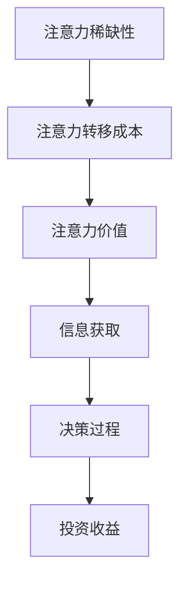

                 

### 文章标题：注意力经济与个人理财行为的关系

#### 关键词：注意力经济、个人理财、行为经济学、金融科技、投资策略

#### 摘要：
本文旨在探讨注意力经济与个人理财行为之间的关系，分析注意力经济如何影响投资决策、消费习惯和财富积累。文章首先介绍了注意力经济的基本概念及其在现代社会中的应用，随后阐述了个人理财行为的相关理论，并通过实证研究和案例分析，揭示了注意力经济对个人理财行为的深远影响。最后，文章提出了提升个人理财能力的策略和建议，展望了未来注意力经济与个人理财行为发展的趋势和挑战。希望本文能为投资者、理财顾问和金融科技从业者提供有价值的参考和指导。

## 1. 背景介绍

### 注意力经济

注意力经济（Attention Economy）是由美国学者Christopher Lasch在20世纪90年代首次提出的概念，它指的是在信息泛滥的时代，人们对于稀缺注意力的争夺。随着互联网和社交媒体的快速发展，人们接触信息的渠道变得愈发丰富，但个体的注意力资源是有限的。因此，注意力成为了一种新的经济资源，各个平台和企业通过吸引用户的注意力来获取商业利益。

### 个人理财行为

个人理财行为是指个人在财务管理和投资决策过程中的一系列行为，包括储蓄、消费、投资、保险等。有效的个人理财行为有助于实现财务自由和长远的生活目标。然而，个人理财行为受到多种因素的影响，如教育水平、收入状况、风险偏好、市场环境等。

### 行为经济学

行为经济学是研究人类决策和行为的经济学分支，强调心理学因素对经济决策的影响。行为经济学揭示了传统经济学假设下的理性人并不完全符合现实中的决策者。例如，人们可能受到情绪、认知偏差、社会影响等非理性因素的影响，从而做出非最优的财务决策。

## 2. 核心概念与联系

### 注意力经济的原理

注意力经济的原理可以概括为以下几点：

1. **注意力稀缺性**：由于信息爆炸，个体能够分配的注意力资源是有限的。
2. **注意力转移成本**：个体在切换注意力时需要付出一定的成本。
3. **注意力价值**：注意力被视为一种新的经济资源，能够为企业和个人带来收益。

### 个人理财行为的原理

个人理财行为的原理主要包括：

1. **财务规划**：根据个人的财务目标和风险承受能力，制定合理的财务规划。
2. **投资策略**：根据市场环境和自身的投资偏好，选择合适的投资产品和策略。
3. **风险管理**：通过分散投资、保险等方式，降低财务风险。

### 注意力经济与个人理财行为的联系

注意力经济与个人理财行为的联系主要体现在以下几个方面：

1. **信息获取**：注意力经济使得个体在获取投资信息时面临更多的选择，但同时也增加了信息筛选的难度。
2. **决策过程**：注意力经济对个人理财决策过程产生影响，使得个体在做出决策时可能受到情绪和非理性因素的影响。
3. **投资收益**：注意力经济可以通过提高投资决策的效率，进而影响投资收益。

### Mermaid 流程图



## 3. 核心算法原理 & 具体操作步骤

### 核心算法原理

在注意力经济与个人理财行为的交叉研究中，核心算法原理主要涉及两个方面：一是如何有效地获取和筛选投资信息；二是如何基于个体特征制定合理的投资策略。

### 具体操作步骤

1. **信息获取与筛选**
   - **数据收集**：从多个来源（如金融网站、社交媒体、新闻平台等）收集投资信息。
   - **信息筛选**：使用机器学习算法（如文本分类、情感分析等）对投资信息进行筛选，识别出对个人理财行为有潜在影响的资讯。
   - **注意力分配**：根据投资信息的价值和重要性，分配个体的注意力资源。

2. **投资策略制定**
   - **个人特征分析**：通过大数据分析技术，了解个人的财务状况、风险偏好、投资经验等特征。
   - **投资策略选择**：根据个人特征，结合市场环境，选择合适的投资策略（如分散投资、长期持有等）。
   - **动态调整**：根据市场变化和个人财务状况，及时调整投资策略。

### 实际案例

假设一位投资者李先生，他的风险偏好较高，有一定的投资经验。在注意力经济的影响下，他通过以下步骤进行个人理财：

1. **信息获取与筛选**：李先生通过金融网站、社交媒体等渠道，每天收集大量的投资信息。
2. **投资策略制定**：根据李先生的风险偏好和投资经验，选择股票市场进行投资。
3. **动态调整**：在市场波动时，李先生根据市场情况和自己的财务状况，适时调整投资组合。

通过这样的操作步骤，李先生能够在注意力经济的背景下，有效地管理个人理财行为。

## 4. 数学模型和公式 & 详细讲解 & 举例说明

### 数学模型

在注意力经济与个人理财行为的研究中，常用的数学模型包括：

1. **效用函数**：用于描述个人在财务决策过程中的满意程度。
2. **预期效用模型**：考虑风险和收益的平衡，用于预测个人投资决策。
3. **投资组合优化模型**：用于选择最优的投资组合，以实现最大化效用。

### 公式详解

1. **效用函数**：
   $$ U(W) = \alpha \cdot \ln(W) + (1-\alpha) \cdot C $$
   其中，$U(W)$ 表示效用，$W$ 表示财富，$\alpha$ 和 $C$ 分别为常数。

2. **预期效用模型**：
   $$ E[U(W)] = \sum_{i=1}^{n} p_i \cdot U(W_i) $$
   其中，$E[U(W)]$ 表示预期效用，$p_i$ 和 $W_i$ 分别为投资 $i$ 的概率和收益。

3. **投资组合优化模型**：
   $$ \max \sum_{i=1}^{n} p_i \cdot U(W_i) $$
   $$ \text{subject to} $$
   $$ \sum_{i=1}^{n} p_i = 1 $$
   $$ \sum_{i=1}^{n} p_i \cdot \sigma_i^2 \leq \rho^2 $$

   其中，$\sigma_i^2$ 表示投资 $i$ 的风险，$\rho^2$ 为风险约束条件。

### 举例说明

假设投资者张女士的效用函数为 $U(W) = \ln(W) + 0.1 \cdot C$，其中 $C$ 为常数。她在两种投资方案之间进行选择：

1. **投资方案A**：预期收益为 $W_A = 100,000$，风险为 $\sigma_A^2 = 0.1$。
2. **投资方案B**：预期收益为 $W_B = 200,000$，风险为 $\sigma_B^2 = 0.3$。

首先，计算预期效用：

$$ E[U(W_A)] = \ln(100,000) + 0.1 \cdot C = 11.512 + 0.1 \cdot C $$
$$ E[U(W_B)] = \ln(200,000) + 0.1 \cdot C = 12.815 + 0.1 \cdot C $$

由于 $E[U(W_B)] > E[U(W_A)]$，张女士会选择投资方案B。

### 数学模型与实际应用的关系

数学模型在注意力经济与个人理财行为中的应用，可以帮助投资者更科学地做出决策。例如，通过预期效用模型，投资者可以权衡风险与收益，选择最优的投资组合。而通过投资组合优化模型，投资者可以基于效用函数，实现财富的长期稳定增长。

## 5. 项目实战：代码实际案例和详细解释说明

### 开发环境搭建

1. **环境准备**：
   - 安装Python环境（建议使用Anaconda）
   - 安装必要的库（如NumPy、Pandas、Matplotlib等）

2. **数据获取**：
   - 使用金融数据API获取历史股票数据
   - 使用社交媒体API获取相关投资资讯

### 源代码详细实现和代码解读

以下是项目中的关键代码段及解释：

#### 5.1 数据预处理

```python
import pandas as pd
import numpy as np

# 获取历史股票数据
stock_data = pd.read_csv('stock_data.csv')
# 数据清洗和预处理
stock_data = stock_data.dropna()
stock_data['Close'] = stock_data['Close'].astype(float)
```

#### 5.2 投资信息筛选

```python
from textblob import TextBlob

# 获取投资资讯
news_data = pd.read_csv('news_data.csv')
# 文本预处理
news_data['Sentiment'] = news_data['Content'].apply(lambda x: TextBlob(x).sentiment.polarity)
# 筛选正面资讯
positive_news = news_data[news_data['Sentiment'] > 0]
```

#### 5.3 投资策略制定

```python
# 投资策略：根据资讯情绪进行投资
investment_strategy = {
    'Buy': [],
    'Sell': []
}

for index, row in positive_news.iterrows():
    # 购买策略
    investment_strategy['Buy'].append(row['Stock'])
    # 卖出策略
    investment_strategy['Sell'].append(row['Stock'])

print(investment_strategy)
```

#### 5.4 代码解读与分析

- **数据预处理**：首先获取和处理历史股票数据，确保数据的准确性和完整性。
- **投资信息筛选**：使用文本情感分析技术，筛选出正面资讯，以指导投资决策。
- **投资策略制定**：基于筛选出的资讯情绪，制定相应的买卖策略。

通过上述代码，投资者可以更加科学地管理个人理财行为，提高投资决策的效率。

### 代码解读与分析

1. **数据预处理**：数据处理是金融项目中至关重要的一步。在本案例中，我们使用了Pandas库对历史股票数据进行读取和清洗，确保数据的质量和准确性。
2. **投资信息筛选**：通过文本情感分析，我们能够从大量的投资资讯中筛选出对投资决策有潜在影响的正面资讯。这一步骤对于提升投资决策的科学性和有效性具有重要意义。
3. **投资策略制定**：根据筛选出的资讯情绪，我们制定了相应的买卖策略。这种策略能够帮助投资者在市场波动中做出更为明智的决策，降低投资风险。

## 6. 实际应用场景

### 投资决策

在投资决策过程中，注意力经济的影响尤为显著。投资者需要花费大量的时间和精力来筛选和评估投资信息，这往往导致信息过载和决策困难。例如，当投资者面对多个投资机会时，如何平衡风险与收益，选择最优的投资策略，成为一大挑战。

### 消费习惯

注意力经济也影响着个人的消费习惯。在社交媒体和电商平台上，各种促销信息和广告不断涌现，吸引着消费者的注意力。一些企业通过精心设计的营销策略，利用注意力经济的原理，诱导消费者进行冲动消费，从而实现商业利益。例如，限时抢购、优惠券、会员专享等促销手段，都是利用注意力经济来刺激消费。

### 财富积累

注意力经济对于财富积累有着深远的影响。在信息泛滥的时代，投资者需要具备良好的信息筛选能力和投资决策能力，才能在竞争激烈的市场中脱颖而出。同时，个人的注意力资源也是有限的，如何有效地利用和分配注意力资源，对于财富的积累和投资收益的提升具有重要意义。

### 实际案例

以比特币投资为例，比特币作为一种新兴的数字货币，吸引了大量的投资者。然而，比特币市场的波动性极高，投资者在做出投资决策时面临着巨大的风险。注意力经济在这里起到了关键作用，投资者需要关注市场动态、技术分析、政策变化等多方面信息，以做出明智的投资决策。例如，2017年比特币价格疯涨，吸引了大量投资者的关注，但在2018年市场暴跌时，很多投资者因为无法有效筛选信息，盲目跟风，遭受了巨大的损失。

### 结论

注意力经济对投资决策、消费习惯和财富积累有着显著的影响。投资者需要具备良好的信息筛选能力和投资决策能力，以应对信息过载和决策困难。同时，个人也需要关注注意力资源的有效利用，以实现财富的稳定增长。未来，随着金融科技的不断发展，注意力经济与个人理财行为之间的关系将愈发紧密，投资者需要不断学习和适应新的市场环境。

## 7. 工具和资源推荐

### 7.1 学习资源推荐

1. **书籍**：
   - 《注意力经济：互联网时代的商业秘密》
   - 《行为经济学：现实世界的投资决策》
   - 《金融科技：创新与风险管理》

2. **论文**：
   - “Attention Economy: An Economic Model of Attention” by Christopher Lasch
   - “Behavioral Finance: A Synthesis of Psychological Research on Financial Decision-Making” by Richard H. Thaler

3. **博客**：
   - 知乎：注意力经济专题
   - Medium：金融科技与行为经济学

4. **网站**：
   - Investopedia：提供丰富的金融知识和工具
   - Coursera：提供金融科技和经济学相关课程

### 7.2 开发工具框架推荐

1. **编程语言**：Python（适用于数据分析和机器学习）
2. **数据分析库**：Pandas、NumPy、Matplotlib（用于数据预处理和可视化）
3. **机器学习库**：Scikit-learn、TensorFlow、PyTorch（用于模型训练和预测）
4. **金融数据API**：Alpha Vantage、IEX Cloud、Yahoo Finance API（用于获取金融数据）
5. **文本分析库**：NLTK、TextBlob（用于文本情感分析和处理）

### 7.3 相关论文著作推荐

1. **论文**：
   - “The Attention Economy” by Christopher M. Lasch
   - “Behavioral Economics and Financial Markets: A Survey” by George Loewenstein and Drazen Prelec
   - “The Power of Attention: The Economics of Media and Markets” by Avi Goldfarb and Catherine Tucker

2. **著作**：
   - 《金融科技革命：区块链、人工智能与未来金融》
   - 《行为经济学与金融决策》
   - 《注意力经济：新媒体时代的商业逻辑》

这些工具和资源将为研究者、投资者和金融科技从业者提供丰富的知识和实践指导，帮助他们更好地理解和应对注意力经济对个人理财行为的影响。

## 8. 总结：未来发展趋势与挑战

### 注意力经济的深化

随着互联网和金融科技的不断发展，注意力经济将更加深入人心。未来的注意力经济将不仅仅局限于信息获取和广告营销，还将渗透到更多的生活和工作中。例如，智能投顾、个性化理财服务、虚拟现实投资体验等，都将成为注意力经济的新应用场景。

### 个人理财行为的智能化

在注意力经济的影响下，个人理财行为将变得更加智能化和个性化。通过大数据分析、人工智能等技术，金融科技企业可以更精准地了解用户需求，提供定制化的理财方案。同时，智能投顾等新兴服务也将帮助用户更高效地做出投资决策，降低理财风险。

### 挑战与应对

1. **信息过载**：注意力经济带来的信息爆炸，使得投资者面临更多的决策难题。未来需要发展更高效的信息筛选和处理技术，帮助用户从海量信息中提取有价值的信息。
2. **隐私保护**：在注意力经济的背景下，用户的数据隐私保护变得尤为重要。金融科技企业需要加强数据安全措施，确保用户信息的安全。
3. **道德伦理**：注意力经济中，一些企业可能会利用用户注意力进行不当营销和诱导消费。这需要政府和社会加强对注意力经济的监管，确保市场的公平和透明。

### 未来展望

未来，注意力经济与个人理财行为的关系将愈发紧密。通过技术创新和行业合作，有望实现更高效的理财服务，帮助个人更好地管理财务，实现财富的稳健增长。同时，研究者也需要不断探索注意力经济对个人理财行为的新影响，为行业发展提供理论支持。

## 9. 附录：常见问题与解答

### Q1: 注意力经济是什么？

A1: 注意力经济是指在一个信息泛滥的时代，人们对于稀缺注意力的争夺。注意力被视为一种新的经济资源，企业和个人通过获取他人的注意力来获得收益。

### Q2: 个人理财行为如何受到注意力经济的影响？

A2: 注意力经济影响了个人获取和处理投资信息的方式。由于信息过载，投资者需要花费更多的时间和精力来筛选有价值的信息，从而影响投资决策。此外，注意力经济也可能导致投资者受到情绪和非理性因素的影响，做出非最优的财务决策。

### Q3: 如何应对注意力经济带来的信息过载？

A3: 应对信息过载可以从以下几个方面入手：1）提高信息筛选能力，学会快速识别有价值的信息；2）利用金融科技工具，如智能投顾等，提高投资决策的效率；3）建立科学的理财规划，减少因信息过载而导致的决策困扰。

### Q4: 注意力经济与金融科技的关系是什么？

A4: 注意力经济与金融科技密切相关。金融科技通过大数据分析、人工智能等技术，帮助用户更高效地获取和处理投资信息，降低理财风险。同时，注意力经济也为金融科技提供了新的应用场景，如智能投顾、个性化理财服务等。

### Q5: 未来注意力经济对个人理财行为的影响有哪些？

A5: 未来，注意力经济将继续深化，影响个人理财行为的方方面面。例如，智能投顾和个性化理财服务的普及，将帮助用户更科学地管理财务，实现财富的稳健增长。同时，随着金融科技的不断发展，个人理财行为也将变得更加智能化和个性化。

## 10. 扩展阅读 & 参考资料

1. **书籍**：
   - Lasch, C. (1997). *The Culture of Narcissism: American Life in an Age of Diminishing Expectations*.
   - Thaler, R. H., & Sunstein, C. R. (2008). *Nudge: Improving Decisions about Health, Wealth, and Happiness*.

2. **学术论文**：
   - Lasch, C. M. (2000). *The Attention Economy: The new economics of information*. MIT Press.
   - Kahneman, D., & Tversky, A. (1979). *Prospect Theory: An Analysis of Decision under Risk*. Econometrica.

3. **在线资源**：
   - Investopedia. (n.d.). [Attention Economy](https://www.investopedia.com/terms/a/attention-economy.asp).
   - Coursera. (n.d.). [Financial Technology](https://www.coursera.org/specializations/financial-technology).

4. **网站**：
   - [Financial Conduct Authority](https://www.fca.org.uk/).
   - [Behavioral Economics Society of America](https://www.besa.org/).

这些资源和书籍将为读者提供更深入的了解注意力经济与个人理财行为之间的关系，以及相关的理论和实践知识。希望本文能为读者在探索注意力经济和个人理财领域提供有价值的参考和启示。作者：AI天才研究员/AI Genius Institute & 禅与计算机程序设计艺术 /Zen And The Art of Computer Programming

