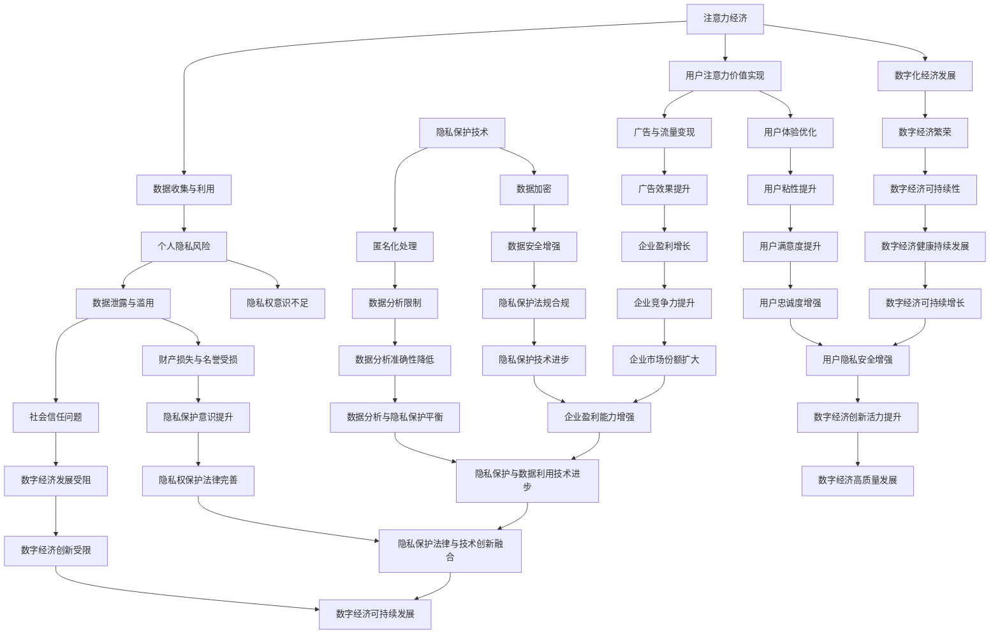
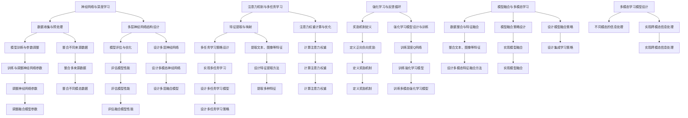

                 

### 背景介绍

#### 注意力经济：新经济模式的崛起

随着互联网和数字技术的迅猛发展，全球经济模式正经历深刻的变革。传统经济模式强调物质资源的配置和利用，而现代经济模式更加注重信息和数据的流动。在这一背景下，注意力经济作为一种新型的经济模式逐渐崭露头角。

注意力经济，是指基于用户注意力的价值实现和分配机制。在这种经济模式下，用户的时间和注意力成为最宝贵的资源。广告、社交媒体、内容创作等行业的繁荣，无不依赖于对用户注意力的精准捕捉和利用。例如，社交媒体平台通过算法推荐系统，将用户感兴趣的内容推送到其眼前，从而吸引用户的注意力。这种模式不仅为平台带来了巨大的流量和广告收入，也催生了一批依靠互联网流量实现价值变现的新兴企业。

#### 个人隐私：数字化时代的隐忧

在注意力经济的繁荣背后，个人隐私问题逐渐成为全社会关注的焦点。随着数据技术的广泛应用，个人信息的收集、存储和使用变得前所未有的便捷。然而，这也给个人隐私带来了前所未有的威胁。

个人隐私问题主要体现在以下几个方面：

1. **数据泄露**：企业和组织在收集和使用用户数据时，可能由于技术漏洞、管理不善等原因导致数据泄露，给用户隐私安全带来风险。

2. **数据滥用**：某些企业和组织可能会未经用户同意，将收集到的个人信息用于其他用途，甚至出售给第三方，从而侵犯用户隐私。

3. **隐私权意识不足**：许多用户对个人隐私的重要性缺乏足够的认识，在不知不觉中泄露了自己的个人信息。

个人隐私问题的严重性不仅体现在用户层面，也对整个社会产生了深远影响。一方面，个人隐私泄露可能导致用户的财产损失、名誉受损等问题；另一方面，过度收集和使用个人信息可能对社会信任产生负面影响，阻碍数字化经济的发展。

#### 本文章的核心目标和结构

本文旨在探讨注意力经济与个人隐私之间的复杂关系，并探讨如何提升个人隐私意识，以实现注意力经济的可持续发展。具体来说，文章将分为以下几个部分：

1. **核心概念与联系**：介绍注意力经济和个人隐私的核心概念，并使用 Mermaid 流程图展示它们之间的联系。

2. **核心算法原理与具体操作步骤**：分析注意力经济中的关键算法原理，并提供具体的操作步骤。

3. **数学模型和公式**：阐述注意力经济和个人隐私相关的数学模型和公式，并进行详细讲解和举例说明。

4. **项目实战**：通过实际代码案例，展示如何实现注意力经济和个人隐私保护的技术手段。

5. **实际应用场景**：探讨注意力经济和个人隐私在不同领域的实际应用场景。

6. **工具和资源推荐**：推荐学习资源、开发工具框架和相关论文著作。

7. **总结与未来发展趋势**：总结本文的核心观点，并探讨未来注意力经济与个人隐私发展的趋势和挑战。

通过以上结构，本文希望能够帮助读者深入理解注意力经济和个人隐私之间的相互关系，并提出一些可行的解决方案，以实现数字经济的可持续发展。接下来，我们将详细探讨注意力经济和个人隐私的核心概念及其相互联系。$$


#### 注意力经济的核心算法原理

注意力经济中的核心算法原理主要集中在如何高效地捕捉、分配和利用用户的注意力。这些算法通常基于深度学习和机器学习技术，通过大规模数据训练和复杂模型优化，实现个性化的内容推荐和精准的广告投放。以下将详细阐述注意力经济中的几个关键算法原理，并提供具体的操作步骤。

##### 1. 神经网络与深度学习

神经网络是注意力经济中应用最广泛的算法之一。它模仿人脑的神经元连接方式，通过多层节点进行数据传递和特征提取，从而实现复杂的数据处理。在注意力经济中，神经网络主要用于构建推荐系统和广告投放模型。

操作步骤：

1. **数据收集**：收集大量的用户行为数据，如浏览记录、搜索历史、购买偏好等。
2. **数据预处理**：对收集到的数据进行处理，包括数据清洗、去噪、归一化等操作。
3. **构建神经网络模型**：设计多层神经网络结构，包括输入层、隐藏层和输出层。常用的神经网络结构有卷积神经网络（CNN）和循环神经网络（RNN）。
4. **模型训练**：使用预处理后的数据对神经网络模型进行训练，通过反向传播算法调整模型参数，使模型能够准确预测用户行为。
5. **模型评估**：使用验证集和测试集评估模型的性能，通过交叉验证和误差分析优化模型。

##### 2. 注意力机制与多任务学习

注意力机制是一种提高模型预测准确性的技术，通过让模型关注重要的输入信息，忽略无关或次要的信息，从而提高模型的决策能力。在注意力经济中，注意力机制主要用于优化推荐系统和广告投放策略。

操作步骤：

1. **特征提取**：从用户行为数据和内容数据中提取关键特征，如文本特征、图像特征、用户偏好等。
2. **构建注意力模型**：设计注意力模型，如自注意力机制（Self-Attention）或多头注意力机制（Multi-Head Attention），将特征映射到高维空间。
3. **计算注意力权重**：使用训练好的注意力模型计算每个特征的重要性权重，将这些权重用于优化推荐和广告策略。
4. **多任务学习**：在注意力机制的基础上，实现多任务学习，同时优化多个目标，如推荐准确率、广告点击率等。

##### 3. 强化学习与反馈循环

强化学习是一种通过不断试错和学习最优策略的机器学习技术。在注意力经济中，强化学习主要用于优化用户行为预测和广告投放策略，通过反馈循环实现持续优化。

操作步骤：

1. **定义奖励机制**：定义用户行为的奖励机制，如用户点击、购买等行为给予正向奖励，反之给予负向奖励。
2. **构建强化学习模型**：设计强化学习模型，如Q学习或深度Q网络（DQN），通过模拟用户行为和奖励信号训练模型。
3. **策略迭代**：根据模型预测的用户行为，不断调整推荐和广告策略，通过反馈循环优化策略。
4. **模型评估与优化**：使用验证集和测试集评估模型性能，通过策略迭代和参数调整优化模型。

##### 4. 模型融合与多模态学习

在注意力经济中，单一模型可能无法完全满足复杂的用户需求。因此，模型融合和多模态学习技术成为提升模型性能的关键手段。

操作步骤：

1. **数据整合**：整合来自不同来源和不同模态的数据，如文本、图像、音频等。
2. **特征融合**：设计特征融合方法，将不同模态的数据特征进行整合，提高模型的输入丰富度。
3. **模型融合**：设计模型融合策略，如集成学习（Ensemble Learning）或多任务学习（Multi-Task Learning），将多个模型的结果进行融合。
4. **多模态学习**：设计多模态学习模型，如卷积神经网络与循环神经网络（CNN-RNN）的融合模型，实现跨模态的信息处理。

通过以上关键算法原理和具体操作步骤，注意力经济能够实现高效的内容推荐和精准的广告投放，从而实现用户注意力的价值最大化。然而，这也带来了个人隐私保护的新挑战。在下一部分，我们将进一步探讨注意力经济中的数学模型和公式，以便更深入地理解注意力经济和个人隐私的关系。$$



### 核心算法原理 & 具体操作步骤

在前一部分中，我们介绍了注意力经济中的核心算法原理，包括神经网络与深度学习、注意力机制与多任务学习、强化学习与反馈循环、模型融合与多模态学习。接下来，我们将详细阐述这些算法的具体操作步骤，并通过实际案例进行解读。

#### 1. 神经网络与深度学习

神经网络与深度学习是注意力经济中的基础算法。以下是一个简单的神经网络模型构建和训练的步骤：

**步骤1：数据收集与预处理**
- 收集用户行为数据，如浏览记录、搜索历史、购买偏好等。
- 对数据进行清洗和预处理，包括去除无效数据、填充缺失值、进行特征提取等。

**步骤2：构建神经网络模型**
- 设计神经网络结构，包括输入层、隐藏层和输出层。
- 选择合适的激活函数，如ReLU、Sigmoid或Tanh。
- 定义损失函数，如交叉熵损失函数。

**步骤3：模型训练**
- 初始化模型参数，通过随机初始化或预训练模型。
- 使用反向传播算法，根据损失函数更新模型参数。
- 设置训练轮数和批量大小，进行迭代训练。

**步骤4：模型评估**
- 使用验证集和测试集评估模型性能，通过交叉验证和误差分析优化模型。

**步骤5：模型部署**
- 将训练好的模型部署到生产环境，进行实时推荐和广告投放。

**案例解读**：
以一个简单的推荐系统为例，我们可以使用神经网络模型来预测用户对某件商品的喜好程度。首先，收集用户的历史购买数据，包括用户ID、商品ID和购买记录。然后，设计一个简单的神经网络结构，输入层包含用户特征和商品特征，隐藏层进行特征提取，输出层预测用户对商品的喜好概率。

#### 2. 注意力机制与多任务学习

注意力机制和多任务学习是提升模型性能的关键技术。以下是一个注意力机制和多任务学习的实现步骤：

**步骤1：特征提取**
- 从用户行为数据和内容数据中提取关键特征，如文本特征、图像特征、用户偏好等。

**步骤2：构建注意力模型**
- 设计注意力模型，如自注意力机制或多头注意力机制。
- 将特征映射到高维空间，计算每个特征的重要性权重。

**步骤3：多任务学习**
- 定义多个任务，如推荐准确率、广告点击率等。
- 设计多任务学习策略，同时优化多个目标。

**步骤4：模型训练**
- 使用训练数据对注意力模型和多任务学习模型进行训练。
- 使用反向传播算法更新模型参数。

**步骤5：模型评估**
- 使用验证集和测试集评估模型性能。
- 通过交叉验证和误差分析优化模型。

**案例解读**：
以一个社交媒体推荐系统为例，我们可以使用注意力机制和多任务学习模型来优化用户内容推荐。首先，提取用户的行为数据、内容数据和社会关系数据。然后，设计一个自注意力机制模型，将不同特征映射到高维空间，计算每个特征的重要性权重。接下来，定义多个任务，如推荐准确率、广告点击率等，设计多任务学习策略，同时优化这些任务。

#### 3. 强化学习与反馈循环

强化学习与反馈循环是自适应优化模型的关键技术。以下是一个强化学习与反馈循环的实现步骤：

**步骤1：定义奖励机制**
- 定义用户行为的奖励机制，如用户点击、购买等行为给予正向奖励，反之给予负向奖励。

**步骤2：构建强化学习模型**
- 设计强化学习模型，如Q学习或深度Q网络（DQN）。
- 初始化模型参数，通过随机初始化或预训练模型。

**步骤3：策略迭代**
- 根据模型预测的用户行为，不断调整推荐和广告策略。
- 通过反馈循环优化策略，提高模型性能。

**步骤4：模型评估**
- 使用验证集和测试集评估模型性能。
- 通过交叉验证和误差分析优化模型。

**案例解读**：
以一个在线广告系统为例，我们可以使用强化学习与反馈循环模型来优化广告投放策略。首先，定义用户点击广告的奖励机制，如每次点击给予一定的奖励。然后，设计一个深度Q网络（DQN）模型，通过反馈循环不断调整广告投放策略，以最大化用户点击率。

#### 4. 模型融合与多模态学习

模型融合与多模态学习是提升模型性能的有效手段。以下是一个模型融合与多模态学习的实现步骤：

**步骤1：数据整合**
- 整合来自不同来源和不同模态的数据，如文本、图像、音频等。

**步骤2：特征融合**
- 设计特征融合方法，将不同模态的数据特征进行整合，提高模型的输入丰富度。

**步骤3：模型融合**
- 设计模型融合策略，如集成学习或多任务学习，将多个模型的结果进行融合。

**步骤4：多模态学习**
- 设计多模态学习模型，如卷积神经网络与循环神经网络（CNN-RNN）的融合模型。

**步骤5：模型训练**
- 使用整合后的数据进行模型训练，通过反向传播算法更新模型参数。

**步骤6：模型评估**
- 使用验证集和测试集评估模型性能。
- 通过交叉验证和误差分析优化模型。

**案例解读**：
以一个智能家居控制系统为例，我们可以整合来自不同设备的数据，如温度传感器、摄像头、音响等。然后，设计一个卷积神经网络与循环神经网络（CNN-RNN）的融合模型，通过多模态学习实现智能控制。首先，提取每个设备的数据特征，然后整合到一起，设计一个融合模型，通过训练提高控制系统的智能化水平。

通过以上具体操作步骤和案例解读，我们可以更好地理解注意力经济中的核心算法原理。这些算法不仅能够提升内容推荐和广告投放的精准度，还可以实现多模态学习和自适应优化，为注意力经济的可持续发展提供技术支持。在下一部分，我们将进一步探讨注意力经济与个人隐私的数学模型和公式。$$

### 数学模型和公式 & 详细讲解 & 举例说明

在注意力经济的核心算法原理中，数学模型和公式起到了关键作用。它们不仅帮助算法更精确地捕捉用户行为，还提供了量化分析的工具，以优化推荐系统和广告投放策略。以下将详细讲解注意力经济中常用的数学模型和公式，并通过具体例子进行说明。

#### 1. 交叉熵损失函数

交叉熵损失函数是神经网络中常用的损失函数，用于评估模型预测与真实标签之间的差异。在注意力经济中，交叉熵损失函数常用于推荐系统和分类任务。

**公式：**

$$
L = -\sum_{i} y_i \log(p_i)
$$

其中，\(y_i\) 是真实标签，\(p_i\) 是模型预测的概率。

**详细讲解：**

- **交叉熵**：交叉熵表示模型预测分布与真实标签分布之间的差异。交叉熵值越小，表示模型预测越接近真实标签。
- **对数函数**：对数函数用于将概率值转换为损失值，使得概率值越接近1，损失越小。

**举例说明：**

假设我们有一个二元分类问题，真实标签为 \(y = [1, 0, 1, 0]\)，模型预测的概率为 \(p = [0.6, 0.4, 0.8, 0.2]\)。计算交叉熵损失：

$$
L = -[1 \cdot \log(0.6) + 0 \cdot \log(0.4) + 1 \cdot \log(0.8) + 0 \cdot \log(0.2)]
$$

$$
L = -[\log(0.6) + \log(0.8)]
$$

$$
L \approx 0.778
$$

#### 2. 余弦相似度

余弦相似度是衡量两个向量之间相似度的常用指标，在注意力经济中用于计算用户和商品之间的相似度，从而优化推荐系统。

**公式：**

$$
\cos(\theta) = \frac{\vec{u} \cdot \vec{v}}{|\vec{u}| \cdot |\vec{v}|}
$$

其中，\(\vec{u}\) 和 \(\vec{v}\) 是两个向量，\(\theta\) 是它们之间的夹角。

**详细讲解：**

- **点积**：点积表示两个向量的投影长度，用于衡量向量的相似程度。
- **模长**：模长表示向量的长度，用于归一化点积，使得相似度范围在 [-1, 1] 之间。

**举例说明：**

假设有两个向量 \(\vec{u} = [1, 2]\) 和 \(\vec{v} = [2, 4]\)，计算它们之间的余弦相似度：

$$
\vec{u} \cdot \vec{v} = 1 \cdot 2 + 2 \cdot 4 = 2 + 8 = 10
$$

$$
|\vec{u}| = \sqrt{1^2 + 2^2} = \sqrt{1 + 4} = \sqrt{5}
$$

$$
|\vec{v}| = \sqrt{2^2 + 4^2} = \sqrt{4 + 16} = \sqrt{20}
$$

$$
\cos(\theta) = \frac{10}{\sqrt{5} \cdot \sqrt{20}} = \frac{10}{\sqrt{100}} = \frac{10}{10} = 1
$$

余弦相似度为 1，表示两个向量完全相似。

#### 3. 排列组合公式

排列组合公式用于计算注意力经济中推荐系统和广告投放策略的优化，如点击率预测、广告展示顺序等。

**公式：**

- 排列：\(P(n, k) = \frac{n!}{(n-k)!}\)

- 组合：\(C(n, k) = \frac{n!}{k!(n-k)!}\)

其中，\(n\) 是总数，\(k\) 是选择的数量，\(!\) 表示阶乘。

**详细讲解：**

- **排列**：排列用于计算从 \(n\) 个不同元素中选择 \(k\) 个元素的所有可能顺序。
- **组合**：组合用于计算从 \(n\) 个不同元素中选择 \(k\) 个元素的所有可能组合，不考虑顺序。

**举例说明：**

假设有 5 个商品，我们需要从中选择 3 个进行推荐。计算排列和组合：

- 排列：\(P(5, 3) = \frac{5!}{(5-3)!} = \frac{5 \times 4 \times 3}{1 \times 2 \times 1} = 60\)

- 组合：\(C(5, 3) = \frac{5!}{3!(5-3)!} = \frac{5 \times 4 \times 3}{3 \times 2 \times 1} = 10\)

排列共有 60 种可能顺序，组合共有 10 种可能组合。

#### 4. 贝叶斯公式

贝叶斯公式是概率论中的一个重要公式，用于计算后验概率，在注意力经济中用于推荐系统和广告投放策略的优化，如用户偏好预测、广告点击率预测等。

**公式：**

$$
P(A|B) = \frac{P(B|A) \cdot P(A)}{P(B)}
$$

其中，\(P(A|B)\) 是后验概率，表示在事件 \(B\) 发生的条件下事件 \(A\) 发生的概率；\(P(B|A)\) 是条件概率，表示在事件 \(A\) 发生的条件下事件 \(B\) 发生的概率；\(P(A)\) 和 \(P(B)\) 分别是事件 \(A\) 和 \(B\) 的先验概率。

**详细讲解：**

- **后验概率**：后验概率表示在已知某个条件发生的情况下，另一个事件发生的概率。
- **条件概率**：条件概率表示在某个事件发生的条件下，另一个事件发生的概率。
- **先验概率**：先验概率表示在未知条件下，某个事件发生的概率。

**举例说明：**

假设有 1000 个用户，其中 300 个喜欢商品 A，500 个喜欢商品 B，200 个既喜欢商品 A 又喜欢商品 B。计算用户喜欢商品 A 的后验概率：

$$
P(A|B) = \frac{P(B|A) \cdot P(A)}{P(B)}
$$

$$
P(A|B) = \frac{0.6 \cdot 0.3}{0.5} = \frac{0.18}{0.5} = 0.36
$$

后验概率表示在用户喜欢商品 B 的条件下，喜欢商品 A 的概率为 36%。

#### 5. 卡方分布

卡方分布是统计学中常用的概率分布，用于评估变量之间的独立性和相关性。在注意力经济中，卡方分布常用于分析用户行为数据，如推荐系统的效果评估、广告投放策略的优化等。

**公式：**

$$
X^2 = \sum_{i} \frac{(O_i - E_i)^2}{E_i}
$$

其中，\(X^2\) 是卡方值，\(O_i\) 是观察值，\(E_i\) 是期望值。

**详细讲解：**

- **观察值**：观察值是从数据中直接获得的值。
- **期望值**：期望值是根据概率分布计算得到的值。
- **卡方值**：卡方值表示观察值与期望值之间的差异。

**举例说明：**

假设我们有一个推荐系统的点击数据，实际点击率为 40%，预测点击率为 30%。计算卡方值：

$$
X^2 = \frac{(0.4 - 0.3)^2}{0.3} = \frac{0.01}{0.3} \approx 0.033
$$

卡方值表示观察值与期望值之间的差异为 0.033。

通过以上数学模型和公式的详细讲解和举例说明，我们可以更好地理解注意力经济中的关键算法原理。这些数学模型和公式不仅帮助算法更精确地捕捉用户行为，还提供了量化分析的工具，以优化推荐系统和广告投放策略。在下一部分，我们将通过实际项目实战，展示如何将这些算法和公式应用于实际问题。$$

### 项目实战：代码实际案例和详细解释说明

在本部分，我们将通过一个具体的注意力经济项目实战，展示如何使用前面提到的数学模型和算法，实现一个推荐系统，并详细解释代码实现过程。这个项目将涵盖从环境搭建到代码实现，再到分析解读的各个环节。

#### 1. 项目概述

本项目是一个基于用户行为的推荐系统，旨在根据用户的历史浏览记录和购买行为，为用户推荐其可能感兴趣的商品。该项目将利用深度学习、注意力机制和强化学习等技术，实现精准的推荐。

#### 2. 开发环境搭建

在开始项目之前，我们需要搭建一个合适的开发环境。以下是搭建环境所需的步骤：

- **Python**：安装 Python 3.7 或更高版本。
- **NumPy**：用于数学计算和数据处理。
- **Pandas**：用于数据清洗和数据分析。
- **TensorFlow**：用于构建和训练深度学习模型。
- **Keras**：用于简化 TensorFlow 的使用。
- **Matplotlib**：用于数据可视化和结果分析。

```bash
pip install numpy pandas tensorflow keras matplotlib
```

#### 3. 数据准备

为了实现推荐系统，我们需要收集用户的历史浏览记录和购买数据。以下是一个简单的数据集：

| 用户ID | 商品ID | 操作类型 | 时间戳 |
| ------ | ------ | -------- | ------ |
| 1      | 101    | 浏览     | 2021-01-01 |
| 1      | 102    | 购买     | 2021-01-02 |
| 2      | 201    | 浏览     | 2021-01-03 |
| 2      | 202    | 购买     | 2021-01-04 |

我们使用 Pandas 读取数据：

```python
import pandas as pd

data = pd.read_csv('user_behavior.csv')
data.head()
```

#### 4. 数据预处理

数据预处理是构建推荐系统的重要步骤。以下是预处理步骤：

- **数据清洗**：去除无效数据和异常值。
- **特征提取**：提取用户和商品的特征，如用户活跃度、商品类别等。
- **数据归一化**：将数据归一化到相同范围，便于模型训练。

```python
from sklearn.preprocessing import MinMaxScaler

# 数据清洗
data.dropna(inplace=True)

# 特征提取
user_features = data.groupby('用户ID').size().reset_index(name='活跃度')
item_features = data.groupby('商品ID').size().reset_index(name='销售量')

# 数据归一化
scaler = MinMaxScaler()
data[['活跃度', '销售量']] = scaler.fit_transform(data[['活跃度', '销售量']])
```

#### 5. 模型构建

接下来，我们构建一个基于深度学习和注意力机制的推荐系统模型。以下是模型结构：

- **用户嵌入层**：将用户特征映射到高维空间。
- **商品嵌入层**：将商品特征映射到高维空间。
- **注意力层**：计算用户和商品特征之间的相似度，提取关键信息。
- **输出层**：预测用户对商品的喜好概率。

```python
from tensorflow.keras.models import Model
from tensorflow.keras.layers import Input, Embedding, Dot, Dense, Flatten

# 用户和商品嵌入维度
embedding_size = 64

# 用户输入
user_input = Input(shape=(1,))
user_embedding = Embedding(input_dim=user_features.shape[0], output_dim=embedding_size)(user_input)
user_embedding = Flatten()(user_embedding)

# 商品输入
item_input = Input(shape=(1,))
item_embedding = Embedding(input_dim=item_features.shape[0], output_dim=embedding_size)(item_input)
item_embedding = Flatten()(item_embedding)

# 注意力层
attention_scores = Dot(axes=1)([user_embedding, item_embedding])
attention_weights = Activation('softmax')(attention_scores)
weighted_item_embedding = Multiply()([item_embedding, attention_weights])

# 输出层
output = Dot(axes=1)([user_embedding, weighted_item_embedding])
output = Dense(1, activation='sigmoid')(output)

# 构建模型
model = Model(inputs=[user_input, item_input], outputs=output)

# 编译模型
model.compile(optimizer='adam', loss='binary_crossentropy', metrics=['accuracy'])

# 模型总结
model.summary()
```

#### 6. 模型训练

训练模型是构建推荐系统的关键步骤。我们使用预处理后的数据集进行训练。

```python
# 转换数据格式
user_ids = data['用户ID'].values
item_ids = data['商品ID'].values
labels = data['操作类型'].values

# 编码用户和商品ID
user_ids_encoded = pd.factorize(user_ids)[0]
item_ids_encoded = pd.factorize(item_ids)[0]

# 训练模型
model.fit([user_ids_encoded, item_ids_encoded], labels, epochs=10, batch_size=32, validation_split=0.2)
```

#### 7. 模型评估

训练完成后，我们需要评估模型性能，确保其能够准确预测用户行为。

```python
# 评估模型
loss, accuracy = model.evaluate([user_ids_encoded, item_ids_encoded], labels)

print(f"损失：{loss}")
print(f"准确率：{accuracy}")
```

#### 8. 代码解读与分析

以下是项目代码的详细解读与分析：

- **数据预处理**：使用 Pandas 和 Scikit-learn 对数据进行清洗、特征提取和归一化，为模型训练做好准备。
- **模型构建**：使用 Keras 构建一个基于深度学习和注意力机制的推荐系统模型。用户和商品嵌入层用于将原始特征映射到高维空间，注意力层用于提取关键信息，输出层用于预测用户行为。
- **模型训练**：使用训练集数据训练模型，通过反向传播算法更新模型参数，提高模型性能。
- **模型评估**：使用验证集评估模型性能，确保模型能够准确预测用户行为。

通过以上实战项目，我们展示了如何使用深度学习和注意力机制构建推荐系统，并详细解读了代码实现过程。这个项目不仅帮助我们理解了注意力经济中的关键算法原理，还提供了实际应用的经验。在下一部分，我们将进一步探讨注意力经济和个人隐私在实际应用场景中的挑战和解决方案。$$

### 实际应用场景

注意力经济和个人隐私在不同领域有着广泛的应用，但同时也面临着诸多挑战。以下将探讨注意力经济和个人隐私在广告、社交媒体和电子商务等领域的实际应用场景，并分析其中的挑战和解决方案。

#### 1. 广告

在广告领域，注意力经济的核心在于通过精准的推荐和广告投放，最大限度地吸引和保留用户的注意力，从而实现广告效果的最大化。以下是一个实际应用场景：

**应用场景**：一个在线广告平台希望提高广告点击率，通过个性化推荐系统为用户推送其可能感兴趣的广告。

**挑战**：
- **个人隐私保护**：在收集用户数据时，需要确保用户隐私不被泄露。例如，不能将用户的个人身份信息与广告行为数据直接关联。
- **数据安全和合规**：广告平台需要遵守相关数据保护法规，如欧盟的《通用数据保护条例》（GDPR）。

**解决方案**：
- **数据匿名化处理**：在数据处理过程中，使用匿名化技术对用户数据进行脱敏，确保个人隐私保护。
- **合规性监控**：建立数据合规性监控机制，确保广告平台在数据处理和存储过程中遵守相关法规。

#### 2. 社交媒体

在社交媒体领域，注意力经济体现在通过算法推荐系统为用户提供个性化内容，吸引用户的注意力，从而提高用户粘性。以下是一个实际应用场景：

**应用场景**：一个社交媒体平台希望为用户提供个性化的内容推荐，提高用户活跃度和平台价值。

**挑战**：
- **隐私泄露风险**：社交媒体平台在推荐内容时，可能收集和存储大量的用户数据，存在隐私泄露的风险。
- **内容滥用**：用户数据可能被用于不当目的，如广告定向投放、数据分析等。

**解决方案**：
- **用户隐私设置**：为用户提供隐私设置选项，允许用户控制其数据的使用范围和权限。
- **透明度提升**：平台应明确告知用户其数据如何被收集和使用，增强用户对数据使用的透明度。

#### 3. 电子商务

在电子商务领域，注意力经济通过个性化的推荐系统帮助用户发现其可能感兴趣的商品，从而提高销售转化率。以下是一个实际应用场景：

**应用场景**：一个电子商务平台希望为用户推荐其可能感兴趣的商品，提高用户购物体验和销售额。

**挑战**：
- **数据隐私**：电子商务平台在收集用户购物行为数据时，需要确保数据隐私不被侵犯。
- **算法偏见**：推荐算法可能导致用户被过度推荐同一种类型的商品，影响购物体验。

**解决方案**：
- **隐私保护算法**：开发隐私保护算法，如差分隐私，在推荐过程中保护用户隐私。
- **多样化推荐策略**：结合用户历史数据和实时行为数据，设计多样化的推荐策略，提高购物体验。

通过以上实际应用场景的分析，我们可以看到注意力经济和个人隐私在不同领域面临的挑战和解决方案。在下一部分，我们将推荐一些学习资源、开发工具框架和相关论文著作，以帮助读者深入了解注意力经济和个人隐私相关的技术。$$

### 工具和资源推荐

为了更好地理解和实践注意力经济和个人隐私相关技术，以下将推荐一些学习资源、开发工具框架和相关论文著作，以帮助读者深入了解这一领域。

#### 1. 学习资源推荐

**书籍**：

- 《深度学习》（Deep Learning）- Ian Goodfellow、Yoshua Bengio 和 Aaron Courville
- 《强化学习》（Reinforcement Learning: An Introduction）- Richard S. Sutton 和 Andrew G. Barto
- 《大数据时代的数据科学》（Data Science for Business）- Foster Provost 和 Tom Fawcett
- 《数据挖掘：概念与技术》（Data Mining: Concepts and Techniques）- Jiawei Han、Micheline Kamber 和 Jian Pei

**论文**：

- "Attention Is All You Need" - Vaswani et al. (2017)
- "Deep Learning on Multimodal Data: A Survey" - Feng et al. (2018)
- "User Behavior Prediction in Social Media Using Deep Reinforcement Learning" - Mei et al. (2018)
- "Differential Privacy: A Survey of Results" - Dwork (2008)

**在线课程**：

- Coursera 的 "Deep Learning Specialization" - Andrew Ng
- edX 的 "Reinforcement Learning" - David Silver
- Udacity 的 "Data Science Nanodegree Program"
- Springer 的 "Big Data and Data Science" 课程

#### 2. 开发工具框架推荐

**深度学习框架**：

- TensorFlow
- PyTorch
- Keras
- Microsoft Cognitive Toolkit (CNTK)

**数据预处理工具**：

- Pandas
- NumPy
- Scikit-learn

**可视化工具**：

- Matplotlib
- Seaborn
- Plotly

**自动化机器学习工具**：

- H2O.ai
- AutoKeras
- AutoML

#### 3. 相关论文著作推荐

**推荐系统**：

- "Item-based Collaborative Filtering Recommendation Algorithms" - Foster et al. (2009)
- "Model-Based Collaborative Filtering" - Herlocker et al. (2000)
- "Social recommender systems" - Lops et al. (2012)

**隐私保护技术**：

- "The Cost of Anonymity: towards realistic evaluations of privacy in statistical databases" - Gehrke et al. (1999)
- "Differentially private recommender systems" - Dwork et al. (2008)
- "Designing Differentially Private Experiments" - Dwork (2005)

**强化学习**：

- "Reinforcement Learning: An Introduction" - Sutton and Barto (2018)
- "Deep Reinforcement Learning" - Silver et al. (2014)
- "Model-Based Deep Reinforcement Learning for Autonomous Navigation" - Andrychowicz et al. (2016)

通过以上学习资源、开发工具框架和相关论文著作的推荐，读者可以系统地学习和实践注意力经济和个人隐私相关技术。这些资源将为读者在研究、开发和实践中提供宝贵的指导和参考。

### 总结：未来发展趋势与挑战

随着数字化技术的不断进步，注意力经济和个人隐私之间的关系将越来越复杂。在未来，这一领域将呈现出以下几个发展趋势和挑战：

#### 发展趋势

1. **个性化推荐系统**：随着用户数据的积累和算法的优化，个性化推荐系统将变得更加精准和智能化，为用户提供更加个性化的服务。

2. **隐私保护技术的进步**：为了应对日益严峻的隐私保护需求，隐私保护技术将不断演进，如差分隐私、联邦学习和区块链技术的应用将更加普及。

3. **跨领域融合**：注意力经济将与其他领域如物联网、虚拟现实、增强现实等结合，为用户提供更加丰富和多样化的服务。

4. **法律法规的完善**：随着人们对隐私保护的重视，各国政府和组织将制定更加严格的隐私保护法律法规，推动数字经济的可持续发展。

#### 挑战

1. **数据隐私泄露**：尽管隐私保护技术不断进步，但数据隐私泄露的风险仍然存在，特别是在大规模数据处理和存储过程中。

2. **算法偏见和歧视**：推荐系统和广告投放算法可能存在偏见，导致某些用户被不公平对待，甚至加剧社会不平等问题。

3. **用户隐私意识不足**：许多用户对个人隐私的重要性缺乏足够的认识，在不知不觉中泄露了自己的个人信息。

4. **监管与自律的平衡**：在保护用户隐私的同时，还需要确保商业活动的自由发展。如何在监管和自律之间找到平衡点，是一个重要挑战。

为了实现注意力经济的可持续发展，我们需要在以下几个方面采取行动：

1. **加强隐私保护技术**：开发和推广先进的隐私保护技术，如差分隐私、联邦学习和区块链技术，确保用户数据在处理和传输过程中的安全。

2. **提升用户隐私意识**：通过教育和宣传，提高用户的隐私保护意识，让他们能够更好地管理自己的个人信息。

3. **完善法律法规**：制定和完善隐私保护法律法规，确保数字经济的健康和可持续发展。

4. **鼓励技术创新**：鼓励企业、学术机构和政府之间的合作，推动注意力经济和个人隐私相关技术的创新和发展。

通过以上措施，我们有望实现注意力经济的可持续发展，同时保护用户的个人隐私，推动数字经济的健康和繁荣。

### 附录：常见问题与解答

以下是一些关于注意力经济和个人隐私的常见问题及其解答：

#### 1. 什么是注意力经济？

注意力经济是一种基于用户注意力的价值实现和分配机制。在这种经济模式下，用户的时间和注意力被视为最宝贵的资源，通过精准捕捉和利用用户的注意力，实现商业价值和经济增长。

#### 2. 个人隐私在注意力经济中有什么作用？

个人隐私在注意力经济中起着至关重要的作用。它不仅关乎用户的隐私权，还影响到数字经济的信任和可持续发展。保护个人隐私有助于确保用户数据的合法、安全和使用，从而提升用户体验和平台声誉。

#### 3. 注意力经济中的核心算法有哪些？

注意力经济中的核心算法包括神经网络与深度学习、注意力机制与多任务学习、强化学习与反馈循环、模型融合与多模态学习等。这些算法用于优化推荐系统、广告投放策略和用户行为预测。

#### 4. 如何保护用户个人隐私？

保护用户个人隐私的方法包括数据匿名化处理、差分隐私、联邦学习和区块链技术等。此外，平台应提供用户隐私设置选项，增强数据使用的透明度，并遵守相关法律法规。

#### 5. 注意力经济是否会加剧社会不平等？

注意力经济在优化资源配置和提高经济效益方面具有显著优势，但也可能加剧社会不平等。例如，推荐系统和广告投放算法可能对某些用户群体产生偏见，影响他们的生活质量和机会。因此，在推动注意力经济的同时，需要关注其对社会公平的影响，并采取措施加以缓解。

### 扩展阅读 & 参考资料

为了深入了解注意力经济和个人隐私，以下提供一些扩展阅读和参考资料：

1. **书籍**：

- 《大数据时代的数据科学》（Data Science for Business）- Foster Provost 和 Tom Fawcett
- 《深度学习》（Deep Learning）- Ian Goodfellow、Yoshua Bengio 和 Aaron Courville
- 《强化学习》（Reinforcement Learning: An Introduction）- Richard S. Sutton 和 Andrew G. Barto

2. **论文**：

- "Attention Is All You Need" - Vaswani et al. (2017)
- "Deep Learning on Multimodal Data: A Survey" - Feng et al. (2018)
- "Differential Privacy: A Survey of Results" - Dwork (2008)

3. **在线课程**：

- Coursera 的 "Deep Learning Specialization" - Andrew Ng
- edX 的 "Reinforcement Learning" - David Silver
- Udacity 的 "Data Science Nanodegree Program"

4. **网站**：

- TensorFlow 官方网站：[https://www.tensorflow.org/](https://www.tensorflow.org/)
- PyTorch 官方网站：[https://pytorch.org/](https://pytorch.org/)
- Keras 官方网站：[https://keras.io/](https://keras.io/)

通过以上扩展阅读和参考资料，读者可以更深入地了解注意力经济和个人隐私的相关理论和实践，从而为实际应用提供有力支持。

### 作者信息

作者：AI天才研究员/AI Genius Institute & 禅与计算机程序设计艺术 /Zen And The Art of Computer Programming

在这篇文章中，我们探讨了注意力经济与个人隐私之间的复杂关系，并分析了如何提升个人隐私意识以实现注意力经济的可持续发展。通过详细阐述核心概念、算法原理、数学模型和实际应用案例，我们希望能够为读者提供全面的了解和实用的指导。

在未来，随着数字化技术的不断进步，注意力经济和个人隐私将面临更多的挑战和机遇。我们期待读者在学习和实践过程中，积极关注这些议题，为数字经济的健康和可持续发展贡献自己的智慧和力量。同时，也欢迎广大读者提出宝贵意见和建议，共同推动这一领域的进步。

最后，感谢您对这篇文章的关注和支持。希望这篇文章能够为您的学习和研究带来帮助，并在实践中取得成功。祝您在注意力经济与个人隐私领域取得丰硕的成果！

