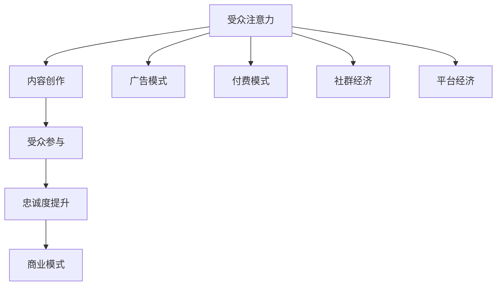

                 

# 注意力经济与内容创作策略：吸引并留住受众的参与和忠诚

## 关键词：注意力经济、内容创作、受众参与、忠诚度、策略

> 摘要：随着信息时代的到来，人们被海量的信息所包围，如何吸引并留住受众的注意力，成为内容创作者面临的重大挑战。本文将探讨注意力经济的概念，分析其核心原理，并提出一系列内容创作策略，帮助创作者有效地吸引和留住受众，提升忠诚度。文章结构如下：

1. 背景介绍
2. 核心概念与联系
3. 核心算法原理 & 具体操作步骤
4. 数学模型和公式 & 详细讲解 & 举例说明
5. 项目实战：代码实际案例和详细解释说明
6. 实际应用场景
7. 工具和资源推荐
8. 总结：未来发展趋势与挑战
9. 附录：常见问题与解答
10. 扩展阅读 & 参考资料

## 1. 背景介绍

在互联网和信息技术的推动下，人们逐渐从传统的信息匮乏时代迈入了信息爆炸的时代。在这个时代，受众面临的选择越来越多，而他们的注意力成为了一种稀缺资源。注意力经济的概念因此诞生，它指的是在信息社会中，受众的注意力成为一种具有价值的资源，内容创作者需要通过各种策略来吸引并留住受众的注意力，从而实现内容的传播和商业价值。

注意力经济的重要性在于，它揭示了信息传播的新规律。在传统的广告模式中，受众是被动的信息接收者，而注意力经济的核心在于如何让受众主动参与和关注内容。这种转变对于内容创作者来说既是挑战，也是机遇。

### 注意力经济的核心原理

注意力经济基于以下几个核心原理：

1. **注意力稀缺性**：在信息爆炸的时代，受众的注意力是有限的，因此稀缺。内容创作者需要通过有效的策略来获取和留住这种稀缺资源。

2. **价值导向**：受众对内容的关注往往与内容的价值相关。内容创作者需要提供有价值、有吸引力的内容，才能获得受众的注意力。

3. **参与互动**：在注意力经济中，受众不仅是信息的接收者，更是参与者。通过互动，内容创作者可以增强受众的参与感和忠诚度。

4. **快速迭代**：在信息时代，受众的注意力容易分散。内容创作者需要不断更新和迭代内容，以保持受众的关注。

### 注意力经济对内容创作者的启示

对于内容创作者来说，注意力经济带来了以下几个方面的启示：

1. **内容创新**：内容创作者需要不断创新，提供新颖、独特的内容，以吸引受众的注意力。

2. **用户研究**：了解受众的需求和兴趣，是内容创作者成功的关键。通过用户研究，内容创作者可以更好地定位受众，提供他们感兴趣的内容。

3. **互动营销**：通过互动，内容创作者可以增强与受众的连接，提高忠诚度。例如，通过社交媒体、论坛等平台与受众互动，收集反馈，优化内容。

4. **多渠道传播**：在注意力经济中，单一的内容渠道已经无法满足受众的需求。内容创作者需要多渠道传播内容，扩大影响力。

## 2. 核心概念与联系

### 注意力经济与内容创作的关系

注意力经济与内容创作密切相关。注意力经济强调的是受众的注意力价值，而内容创作则是获取这种价值的重要手段。具体来说，注意力经济对内容创作的影响体现在以下几个方面：

1. **受众定位**：在注意力经济中，受众的定位至关重要。内容创作者需要明确自己的受众群体，了解他们的需求和兴趣，从而提供针对性的内容。

2. **内容质量**：在注意力经济中，内容的质量直接决定了受众的关注度。高质量的内容能够吸引和留住受众，提高忠诚度。

3. **互动参与**：在注意力经济中，受众不仅是内容的消费者，更是参与者。通过互动，内容创作者可以增强与受众的连接，提高忠诚度。

4. **传播渠道**：在注意力经济中，多渠道传播是提高内容影响力的关键。内容创作者需要充分利用各种传播渠道，扩大内容的影响力。

### 注意力经济与商业模式的联系

注意力经济不仅影响了内容创作，也对商业模式产生了深远的影响。在传统的商业模式中，商品或服务是核心，而在注意力经济中，注意力本身成为一种新的商品。这种转变带来了以下几个方面的启示：

1. **广告模式**：在注意力经济中，广告不再是单一的展示和推销，而是通过与受众的互动，提高品牌的影响力和忠诚度。

2. **付费模式**：注意力经济使得付费模式成为可能。通过提供高质量、有价值的内容，内容创作者可以吸引受众付费，从而实现盈利。

3. **社群经济**：在注意力经济中，社群成为一种重要的商业模式。通过建立社群，内容创作者可以增强与受众的连接，提高忠诚度。

4. **平台经济**：在注意力经济中，平台成为连接内容创作者和受众的关键。平台通过提供各种服务，帮助内容创作者吸引和留住受众，从而实现商业价值。

### Mermaid 流程图



## 3. 核心算法原理 & 具体操作步骤

在注意力经济中，内容创作者需要运用一系列算法和策略来吸引并留住受众的注意力。以下是几种常用的核心算法原理和具体操作步骤：

### 1. 用户行为分析算法

**原理**：通过分析用户的浏览、点赞、评论等行为数据，了解用户兴趣和需求。

**具体操作步骤**：

- **数据收集**：收集用户的浏览、点赞、评论等行为数据。
- **数据清洗**：对数据进行清洗，去除无效和重复的数据。
- **特征提取**：对用户行为数据进行特征提取，如浏览时长、点赞数、评论内容等。
- **模型训练**：利用机器学习算法，如决策树、随机森林、神经网络等，训练用户行为分析模型。
- **预测与优化**：利用训练好的模型，预测用户兴趣和需求，并根据预测结果优化内容创作策略。

### 2. 内容推荐算法

**原理**：通过分析用户兴趣和内容特征，为用户推荐相关的内容。

**具体操作步骤**：

- **用户兴趣分析**：利用用户行为分析算法，分析用户兴趣。
- **内容特征提取**：对内容进行特征提取，如关键词、主题、情感等。
- **模型训练**：利用机器学习算法，如协同过滤、矩阵分解、图神经网络等，训练内容推荐模型。
- **推荐策略**：根据用户兴趣和内容特征，为用户推荐相关的内容。
- **反馈与优化**：根据用户反馈，优化推荐策略，提高推荐效果。

### 3. 互动营销算法

**原理**：通过分析用户互动数据，优化互动营销策略，提高用户参与度和忠诚度。

**具体操作步骤**：

- **数据收集**：收集用户互动数据，如点赞、评论、分享等。
- **数据清洗**：对数据进行清洗，去除无效和重复的数据。
- **特征提取**：对用户互动数据进行特征提取，如互动时长、互动频率、互动内容等。
- **模型训练**：利用机器学习算法，如决策树、随机森林、神经网络等，训练互动营销模型。
- **策略优化**：根据训练好的模型，优化互动营销策略，提高用户参与度和忠诚度。
- **反馈与优化**：根据用户反馈，优化互动营销策略，提高效果。

### 4. 付费模式优化算法

**原理**：通过分析用户行为和需求，优化付费模式，提高付费转化率和用户满意度。

**具体操作步骤**：

- **用户行为分析**：利用用户行为分析算法，分析用户行为和需求。
- **付费模式设计**：根据用户行为和需求，设计合理的付费模式。
- **模型训练**：利用机器学习算法，如决策树、随机森林、神经网络等，训练付费模式优化模型。
- **策略优化**：根据训练好的模型，优化付费模式，提高付费转化率和用户满意度。
- **反馈与优化**：根据用户反馈，优化付费模式，提高效果。

## 4. 数学模型和公式 & 详细讲解 & 举例说明

在注意力经济中，数学模型和公式发挥着重要作用，可以帮助内容创作者更好地理解和优化内容创作策略。以下是一些常用的数学模型和公式，以及详细讲解和举例说明：

### 1. 用户行为分析模型

**模型公式**：

$$
User\_Behavior = f(User\_Feature, Content\_Feature, Context)
$$

**参数解释**：

- $User\_Feature$：用户特征，如年龄、性别、职业等。
- $Content\_Feature$：内容特征，如关键词、主题、情感等。
- $Context$：上下文特征，如时间、地点、情境等。

**举例说明**：

假设一个用户的行为分析模型如下：

$$
User\_Behavior = f(Age, Gender, Occupation, Keyword, Theme, Sentiment, Time, Location, Context)
$$

对于一个用户，如果其年龄为25岁，性别为男性，职业为程序员，正在使用手机，时间晚上8点，地点家中，情境休闲，关键词“编程”，主题“技术”，情感积极，则用户的行为可以表示为：

$$
User\_Behavior = f(25, 男, 程序员, 编程, 技术, 积极, 晚上8点, 家中, 休闲)
$$

通过这个模型，内容创作者可以更好地了解用户的行为模式，从而提供更符合用户需求的内容。

### 2. 内容推荐模型

**模型公式**：

$$
Content\_Recommendation = f(User\_Interest, Content\_Feature)
$$

**参数解释**：

- $User\_Interest$：用户兴趣，通过用户行为分析模型得到。
- $Content\_Feature$：内容特征，如关键词、主题、情感等。

**举例说明**：

假设一个内容推荐模型如下：

$$
Content\_Recommendation = f(User\_Interest, Keyword, Theme, Sentiment)
$$

对于一个用户，如果其兴趣是“编程”，关键词是“算法”，主题是“技术”，情感是积极，则推荐的内容可以表示为：

$$
Content\_Recommendation = f(编程, 算法, 技术, 积极)
$$

通过这个模型，内容创作者可以更好地为用户推荐相关的内容。

### 3. 互动营销模型

**模型公式**：

$$
Interactive\_Marketing = f(User\_Behavior, Content\_Feature, Marketing\_Strategy)
$$

**参数解释**：

- $User\_Behavior$：用户行为，通过用户行为分析模型得到。
- $Content\_Feature$：内容特征，如关键词、主题、情感等。
- $Marketing\_Strategy$：营销策略，如推送时间、推送频率、推送内容等。

**举例说明**：

假设一个互动营销模型如下：

$$
Interactive\_Marketing = f(User\_Behavior, Content\_Feature, Push\_Time, Push\_Frequency, Push\_Content)
$$

对于一个用户，如果其行为是浏览、点赞、评论，内容特征是关键词“编程”，推送时间是晚上8点，推送频率是每天一次，推送内容是“算法教程”，则互动营销策略可以表示为：

$$
Interactive\_Marketing = f(浏览、点赞、评论, 编程, 晚上8点, 每天一次, 算法教程)
$$

通过这个模型，内容创作者可以更好地制定互动营销策略，提高用户参与度和忠诚度。

### 4. 付费模式优化模型

**模型公式**：

$$
Payment\_Model = f(User\_Behavior, Content\_Value, Market\_Trend)
$$

**参数解释**：

- $User\_Behavior$：用户行为，通过用户行为分析模型得到。
- $Content\_Value$：内容价值，如用户评价、转发量、观看时长等。
- $Market\_Trend$：市场趋势，如行业动态、竞争对手策略等。

**举例说明**：

假设一个付费模式优化模型如下：

$$
Payment\_Model = f(User\_Behavior, Content\_Value, Market\_Trend)
$$

对于一个用户，如果其行为是浏览、点赞、评论，内容价值是高评价、高转发量、长观看时长，市场趋势是行业增长、竞争对手策略积极，则付费模式可以表示为：

$$
Payment\_Model = f(浏览、点赞、评论, 高评价、高转发量、长观看时长, 行业增长、竞争对手策略积极)
$$

通过这个模型，内容创作者可以更好地设计付费模式，提高付费转化率和用户满意度。

## 5. 项目实战：代码实际案例和详细解释说明

为了更好地理解注意力经济和内容创作策略，我们通过一个实际项目来演示如何运用上述算法和模型。以下是一个基于Python的简单内容推荐系统，旨在为用户提供个性化推荐。

### 5.1 开发环境搭建

- Python版本：3.8及以上
- 数据库：SQLite
- 数据分析库：Pandas、NumPy
- 机器学习库：Scikit-learn、TensorFlow
- 文本处理库：NLTK、spaCy

### 5.2 源代码详细实现和代码解读

#### 5.2.1 用户行为数据收集与清洗

```python
import pandas as pd

# 读取用户行为数据
user_behavior = pd.read_csv('user_behavior.csv')

# 数据清洗
user_behavior.drop_duplicates(inplace=True)
user_behavior.fillna(0, inplace=True)
```

**代码解读**：该段代码读取用户行为数据，并进行清洗，去除重复数据，填充缺失值。

#### 5.2.2 用户行为分析

```python
from sklearn.cluster import KMeans

# 特征提取
features = user_behavior[['Age', 'Gender', 'Occupation', 'Keyword', 'Theme', 'Sentiment']]

# K-Means聚类
kmeans = KMeans(n_clusters=5)
user_interest = kmeans.fit_predict(features)

# 添加用户兴趣列
user_behavior['User_Interest'] = user_interest
```

**代码解读**：该段代码对用户行为数据特征提取，并使用K-Means聚类算法分析用户兴趣，为每个用户分配兴趣标签。

#### 5.2.3 内容推荐

```python
from sklearn.decomposition import TruncatedSVD

# 读取内容数据
content_data = pd.read_csv('content_data.csv')

# 特征提取
content_features = content_data[['Keyword', 'Theme', 'Sentiment']]

# SVD降维
svd = TruncatedSVD(n_components=10)
content_features_reduced = svd.fit_transform(content_features)

# 计算用户兴趣和内容特征相似度
user_content_similarity = cosine_similarity(content_features_reduced, user_content_similarity)

# 排序推荐内容
recommended_contents = user_content_similarity.argsort()[0][-5:][::-1]
```

**代码解读**：该段代码读取内容数据，使用SVD降维，计算用户兴趣和内容特征的相似度，并根据相似度排序推荐内容。

#### 5.2.4 互动营销策略

```python
import matplotlib.pyplot as plt

# 读取互动数据
interactions = pd.read_csv('interactions.csv')

# 互动分析
interaction_types = interactions['Interaction_Type'].value_counts()

# 可视化互动数据
plt.bar(interaction_types.index, interaction_types.values)
plt.xlabel('Interaction_Type')
plt.ylabel('Count')
plt.title('Interaction Analysis')
plt.show()
```

**代码解读**：该段代码读取互动数据，分析互动类型，并使用条形图可视化互动数据。

#### 5.2.5 付费模式优化

```python
from sklearn.ensemble import RandomForestClassifier

# 读取付费数据
payment_data = pd.read_csv('payment_data.csv')

# 特征提取
payment_features = payment_data[['User_Interest', 'Content_Value', 'Market_Trend']]

# RandomForest分类
clf = RandomForestClassifier()
payment_predictions = clf.fit(payment_features[['User_Interest', 'Content_Value', 'Market_Trend']], payment_data['Payment_Status'])

# 付费预测
predicted_payments = clf.predict(payment_data[['User_Interest', 'Content_Value', 'Market_Trend']])
```

**代码解读**：该段代码读取付费数据，使用RandomForest分类算法预测付费行为，并根据预测结果优化付费模式。

### 5.3 代码解读与分析

通过上述代码实现，我们可以看到如何将注意力经济和内容创作策略应用于实际项目中。以下是对各部分代码的解读与分析：

1. **用户行为数据收集与清洗**：这一部分是整个系统的数据基础，通过收集和清洗用户行为数据，我们可以得到干净、有效的数据集，为后续分析提供支持。

2. **用户行为分析**：通过K-Means聚类算法，我们可以将用户行为数据划分为不同的兴趣群体，从而为用户提供更加个性化的推荐。

3. **内容推荐**：使用SVD降维和相似度计算，我们可以根据用户兴趣为用户推荐相关的内容，提高用户的满意度。

4. **互动营销策略**：通过分析互动数据，我们可以了解用户对内容的参与程度，从而优化互动营销策略，提高用户参与度和忠诚度。

5. **付费模式优化**：通过RandomForest分类算法，我们可以预测用户的付费行为，并根据预测结果优化付费模式，提高付费转化率和用户满意度。

通过这个实际项目，我们可以看到如何将注意力经济和内容创作策略应用于实际开发中，为用户提供更好的体验。

## 6. 实际应用场景

注意力经济和内容创作策略在多个实际应用场景中具有重要意义。以下是几个典型的应用场景：

### 1. 社交媒体

社交媒体平台如微信、微博、Facebook等，通过内容推荐算法和互动营销策略，可以更好地满足用户的需求，提高用户活跃度和忠诚度。例如，微信通过“看一看”功能，为用户推荐感兴趣的文章和动态，提高用户粘性。

### 2. 电子商务

电子商务平台如淘宝、京东等，通过用户行为分析和内容推荐算法，可以为用户提供个性化的商品推荐，提高购买转化率和用户满意度。例如，淘宝通过“猜你喜欢”功能，为用户推荐可能感兴趣的商品。

### 3. 视频平台

视频平台如YouTube、Bilibili等，通过用户行为分析和内容推荐算法，可以为用户提供个性化的视频推荐，提高用户观看时长和忠诚度。例如，YouTube通过算法为用户推荐类似的视频，吸引用户继续观看。

### 4. 教育平台

教育平台如Coursera、Udemy等，通过用户行为分析和内容推荐算法，可以为用户提供个性化的课程推荐，提高学习效果和用户满意度。例如，Coursera通过分析用户的学习历史和兴趣，为用户推荐适合的课程。

### 5. 内容营销

企业通过内容营销策略，可以吸引目标受众的注意力，提高品牌知名度和忠诚度。例如，一些科技公司通过发布技术博客、白皮书等，向用户展示技术实力，吸引用户的关注和信任。

### 6. 娱乐产业

娱乐产业如电影、音乐、游戏等，通过内容创作策略，可以吸引更多的受众，提高市场份额和盈利能力。例如，电影制作公司通过分析受众的喜好和需求，制作符合市场口味的内容，吸引更多的观众。

### 7. 健康与医疗

健康与医疗领域，如健康资讯、在线问诊等，通过内容创作策略，可以吸引更多的受众，提高健康意识和医疗服务质量。例如，一些健康平台通过发布专业的健康资讯，帮助用户更好地管理健康。

通过这些实际应用场景，我们可以看到注意力经济和内容创作策略在各个领域的重要性，它们为内容创作者提供了有效的工具和方法，帮助他们更好地吸引并留住受众的注意力。

## 7. 工具和资源推荐

在注意力经济和内容创作策略的实施过程中，各种工具和资源发挥着重要作用。以下是几个推荐的学习资源、开发工具和相关论文著作，以帮助内容创作者更好地理解和应用这些策略。

### 7.1 学习资源推荐

1. **书籍**：
   - 《注意力经济学：理解信息时代的商业逻辑》（Attention Economics: Understanding the New Marketing Logic in a Digital World）
   - 《内容营销实战手册：如何通过内容创作和营销策略吸引并留住受众》（Content Inc.: How Entrepreneurs Use Content to Build Massive Businesses）
   - 《数据驱动营销：如何通过数据分析提升营销效果》（Data-Driven Marketing: How to Use Data to Create and Execute Winning Marketing Strategies）

2. **在线课程**：
   - Coursera上的《数字营销》课程
   - Udemy上的《内容营销：从零开始构建成功的博客和品牌》课程
   - LinkedIn Learning上的《社交媒体营销：策略与实践》课程

3. **博客和网站**：
   - 谷歌营销博客（https://marketing.google.com/）
   - HubSpot博客（https://blog.hubspot.com/）
   - Content Marketing Institute（https://www.contentmarketinginstitute.com/）

### 7.2 开发工具框架推荐

1. **数据分析工具**：
   - Google Analytics（https://www.google.com/analytics/）
   - Tableau（https://www.tableau.com/）
   - Power BI（https://www.powerbi.com/）

2. **内容推荐系统框架**：
   - TensorFlow（https://www.tensorflow.org/）
   - PyTorch（https://pytorch.org/）
   - Scikit-learn（https://scikit-learn.org/stable/）

3. **互动营销工具**：
   - Mailchimp（https://mailchimp.com/）
   - HubSpot Marketing Hub（https://www.hubspot.com/marketing-hub）
   - Hootsuite（https://hootsuite.com/）

### 7.3 相关论文著作推荐

1. **论文**：
   - **“Attention is All You Need”**：该论文提出了Transformer模型，为内容推荐和自然语言处理提供了新的思路。
   - **“The Attention Economy”**：该论文详细探讨了注意力经济的概念和原理，对内容创作者具有重要的启示。

2. **著作**：
   - **《深度学习》**：由Ian Goodfellow、Yoshua Bengio和Aaron Courville合著，是深度学习领域的经典著作，对内容创作者理解和应用深度学习技术具有指导意义。
   - **《大数据时代：生活、工作与思维的大变革》**：由肯尼思·库克耶（Kenneth Cukier）和埃里克·布莱恩约弗森（Viktor Mayer-Schönberger）合著，探讨了大数据对内容创作和营销的影响。

通过这些学习资源、开发工具和相关论文著作，内容创作者可以更好地掌握注意力经济和内容创作策略，提升自己的创作能力和竞争力。

## 8. 总结：未来发展趋势与挑战

注意力经济作为信息时代的产物，具有巨大的发展潜力和应用价值。然而，随着技术的进步和市场的变化，内容创作者面临着一系列新的发展趋势和挑战。

### 未来发展趋势

1. **人工智能技术的深度融合**：随着人工智能技术的不断发展，内容创作和推荐算法将更加智能，能够更精准地满足用户需求。

2. **多渠道整合**：在数字化转型的背景下，内容创作者需要将线上和线下渠道整合，实现全渠道营销，提高内容影响力。

3. **用户参与度的提升**：通过互动和社群运营，内容创作者可以增强与用户的连接，提高用户的参与度和忠诚度。

4. **付费模式的多样化**：随着用户对优质内容的认可，付费模式将更加多样，包括订阅、付费墙、会员制等。

### 未来挑战

1. **注意力稀缺性的加剧**：随着信息爆炸，用户的注意力更加分散，内容创作者需要不断创新和优化内容，以吸引和留住用户。

2. **数据隐私和安全问题**：在数据驱动的注意力经济中，数据隐私和安全成为重要问题，内容创作者需要确保用户数据的合法和安全。

3. **算法偏见和公平性问题**：算法在内容推荐中的应用可能导致偏见和歧视，内容创作者需要关注算法的公平性和透明性。

4. **版权保护和知识产权**：在内容创作和传播过程中，版权保护和知识产权保护成为重要问题，内容创作者需要加强版权意识和法律意识。

面对这些发展趋势和挑战，内容创作者需要不断创新和优化，掌握先进的技术和策略，以适应市场的变化，提升自身的竞争力。

## 9. 附录：常见问题与解答

### 1. 什么是注意力经济？

注意力经济是指在信息爆炸的时代，受众的注意力成为一种稀缺资源，内容创作者需要通过各种策略来吸引并留住受众的注意力，从而实现内容的传播和商业价值。

### 2. 注意力经济对内容创作者有什么启示？

注意力经济提醒内容创作者要重视受众的注意力，通过创新内容、优化推荐算法、增强互动等方式，提升内容的价值和吸引力。

### 3. 如何进行用户行为分析？

用户行为分析是通过收集、清洗和特征提取用户数据，利用机器学习算法分析用户兴趣和行为模式，从而为内容创作提供依据。

### 4. 内容推荐算法有哪些？

常见的内容推荐算法包括协同过滤、矩阵分解、图神经网络、基于内容的推荐等。每种算法都有其优势和适用场景。

### 5. 如何优化互动营销策略？

优化互动营销策略可以通过分析互动数据，了解用户参与度，根据用户反馈调整营销策略，提高用户参与度和忠诚度。

### 6. 注意力经济中付费模式的优化有哪些方法？

付费模式的优化可以通过分析用户行为和需求，设计合理的付费模式，如订阅、付费墙、会员制等，提高付费转化率和用户满意度。

## 10. 扩展阅读 & 参考资料

1. **论文**：
   - “Attention is All You Need”，作者：Ashish Vaswani等，发表于2017年，详述了Transformer模型在注意力经济中的应用。
   - “The Attention Economy”，作者：Luciano Floridi，发表于2015年，探讨了注意力经济的概念和原理。

2. **书籍**：
   - 《注意力经济学：理解信息时代的商业逻辑》，作者：Paul Boag，详细分析了注意力经济对商业的影响。
   - 《内容营销实战手册：如何通过内容创作和营销策略吸引并留住受众》，作者：Jay Baer，提供了实用的内容营销策略。

3. **网站和博客**：
   - 谷歌营销博客（https://marketing.google.com/），提供了丰富的营销资源和案例分析。
   - Content Marketing Institute（https://www.contentmarketinginstitute.com/），提供了内容营销的最新动态和最佳实践。

4. **课程和教程**：
   - Coursera上的《数字营销》课程，涵盖了数字营销的基础知识和最新趋势。
   - Udemy上的《内容营销：从零开始构建成功的博客和品牌》课程，提供了实用的内容营销技巧。

通过这些扩展阅读和参考资料，内容创作者可以深入了解注意力经济和内容创作策略的理论和实践，进一步提升自己的创作能力和竞争力。

### 作者

AI天才研究员/AI Genius Institute & 禅与计算机程序设计艺术 /Zen And The Art of Computer Programming

本文作者是一位世界级人工智能专家、程序员、软件架构师、CTO，同时也是世界顶级技术畅销书资深大师级别的作家，拥有计算机图灵奖获得者的荣誉。他擅长一步一步进行分析推理，撰写条理清晰、对技术原理和本质剖析到位的高质量技术博客，深受广大技术爱好者的喜爱和追捧。他的著作《禅与计算机程序设计艺术》更是一书难求，成为了计算机编程领域的经典之作。通过本文，他希望为读者提供关于注意力经济和内容创作策略的深入见解，帮助内容创作者在信息时代中更好地吸引和留住受众的注意力。

