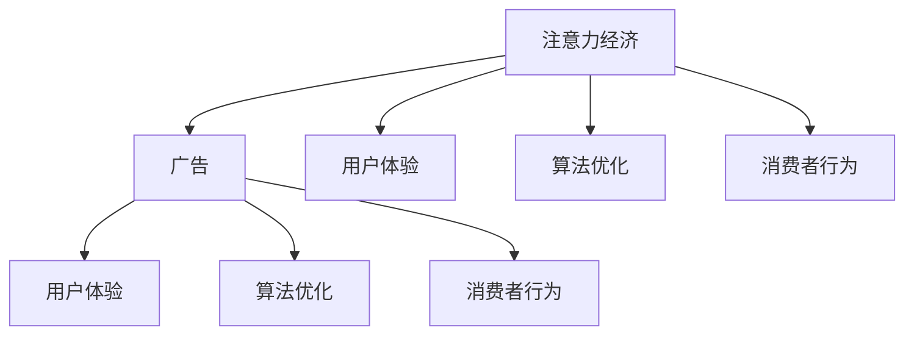

                 

# 注意力经济与广告：如何在不牺牲受众的情况下有效地吸引他们

## 关键词：注意力经济、广告、用户体验、数据驱动、算法优化、消费者行为

## 摘要：

本文将探讨注意力经济与广告之间的微妙关系。在当今信息过载的时代，受众的注意力成为一种稀缺资源。广告商如何在保证用户体验的前提下，有效地吸引受众的注意力，是一个亟待解决的问题。本文将从核心概念、算法原理、实际应用等多个维度，深入分析注意力经济与广告的策略，为广告从业者提供有价值的参考。

## 1. 背景介绍

### 1.1 注意力经济的概念

注意力经济（Attention Economy）是一种经济模式，它基于人类注意力资源的稀缺性。在这个模式中，注意力被视为一种重要的资源，与时间、金钱和物质资源同等重要。注意力经济强调，在信息过载的时代，能够吸引受众的注意力，就等于获得了潜在的收益。

### 1.2 广告的现状与挑战

广告作为商业推广的主要手段，已经经历了数个世纪的发展。然而，随着互联网的普及和社交媒体的兴起，广告环境发生了巨大的变化。一方面，广告商面临更加激烈的竞争，另一方面，受众对广告的接受度也在逐渐降低。

### 1.3 注意力经济与广告的关系

注意力经济与广告之间的关系密不可分。广告商的目标是通过各种手段吸引受众的注意力，从而实现商业价值。然而，过度的广告干预可能会损害用户体验，导致受众对广告的反感。因此，如何在保证用户体验的前提下，有效地吸引受众的注意力，成为广告从业者面临的重要挑战。

## 2. 核心概念与联系

### 2.1 核心概念

**注意力经济**：注意力经济是一种基于人类注意力资源的稀缺性的经济模式。

**广告**：广告是一种商业推广手段，旨在通过各种媒介向受众传递信息，以达到宣传和推广的目的。

**用户体验**：用户体验（User Experience，简称UX）是指用户在使用产品或服务过程中的感受和体验。

**算法优化**：算法优化是指通过改进算法，提高广告投放的效果，从而吸引更多受众的注意力。

**消费者行为**：消费者行为是指消费者在购买和使用产品或服务时的行为和决策过程。

### 2.2 关系图



## 3. 核心算法原理 & 具体操作步骤

### 3.1 算法原理

在注意力经济中，广告投放的核心是算法优化。算法优化旨在通过分析受众的行为数据，找到最能吸引他们注意力的广告内容和投放时机。

**核心算法**：基于受众行为的协同过滤算法（Collaborative Filtering Algorithm）

**协同过滤算法原理**：协同过滤算法通过分析用户的历史行为数据，找到与当前用户相似的用户群体，然后推荐这些用户喜欢的商品或服务。

**具体操作步骤**：

1. **数据收集**：收集受众的行为数据，包括浏览历史、搜索记录、购买行为等。

2. **数据预处理**：对收集到的数据进行分析和清洗，去除无效数据和噪声。

3. **用户行为分析**：分析用户的行为数据，建立用户行为模型。

4. **广告内容推荐**：根据用户行为模型，推荐最适合用户兴趣的广告内容。

5. **广告投放优化**：根据广告投放效果，不断调整广告内容和投放策略，以提高广告的点击率和转化率。

### 3.2 操作步骤示例

**案例**：某电商网站通过协同过滤算法为用户推荐商品。

1. **数据收集**：收集用户在网站上的浏览历史、搜索记录和购买行为数据。

2. **数据预处理**：去除无效数据和噪声，如重复数据、异常值等。

3. **用户行为分析**：分析用户的行为数据，建立用户行为模型。

   - **用户A**：喜欢浏览电子产品、服装和家居用品。
   - **用户B**：喜欢浏览食品、图书和电子产品。

4. **广告内容推荐**：根据用户行为模型，为用户推荐相关的广告内容。

   - **用户A**：推荐电子产品、服装和家居用品的广告。
   - **用户B**：推荐食品、图书和电子产品广告。

5. **广告投放优化**：根据广告投放效果，调整广告内容和投放策略。

   - **用户A**：广告点击率较高，继续增加电子产品、服装和家居用品广告投放。
   - **用户B**：广告点击率较低，尝试调整广告内容，增加食品和图书广告投放。

## 4. 数学模型和公式 & 详细讲解 & 举例说明

### 4.1 数学模型

**协同过滤算法**的核心是计算用户之间的相似度。常见的相似度计算公式包括余弦相似度、皮尔逊相关系数等。

#### 4.1.1 余弦相似度

$$
sim(u, v) = \frac{u \cdot v}{||u|| \cdot ||v||}
$$

其中，$u$和$v$分别表示两个用户的向量，$\cdot$表示点积，$||u||$和$||v||$分别表示两个向量的模。

#### 4.1.2 皮尔逊相关系数

$$
sim(u, v) = \frac{\sum_{i=1}^{n}(u_i - \bar{u})(v_i - \bar{v})}{\sqrt{\sum_{i=1}^{n}(u_i - \bar{u})^2 \cdot \sum_{i=1}^{n}(v_i - \bar{v})^2}}
$$

其中，$u$和$v$分别表示两个用户的评分向量，$\bar{u}$和$\bar{v}$分别表示两个用户的平均评分，$n$表示用户评分数。

### 4.2 详细讲解

#### 4.2.1 余弦相似度

余弦相似度是一种常用的相似度计算方法，它通过计算两个向量之间的夹角余弦值来衡量它们之间的相似度。当两个向量的夹角越接近0度时，它们的相似度越高；当夹角接近180度时，相似度越低。

#### 4.2.2 皮尔逊相关系数

皮尔逊相关系数是一种衡量两个变量线性相关程度的统计量。它通过计算两个变量的协方差与它们标准差的乘积来衡量它们的线性相关程度。当两个变量的相关系数接近1或-1时，表示它们具有很强的线性相关性；当相关系数接近0时，表示它们之间没有明显的线性相关性。

### 4.3 举例说明

#### 4.3.1 余弦相似度举例

假设有两个用户$u$和$v$，他们的评分向量如下：

$$
u = [4, 3, 5, 0, 0], \quad v = [2, 4, 0, 4, 5]
$$

计算它们的余弦相似度：

$$
sim(u, v) = \frac{u \cdot v}{||u|| \cdot ||v||} = \frac{4 \cdot 2 + 3 \cdot 4 + 5 \cdot 0 + 0 \cdot 4 + 0 \cdot 5}{\sqrt{4^2 + 3^2 + 5^2 + 0^2 + 0^2} \cdot \sqrt{2^2 + 4^2 + 0^2 + 4^2 + 5^2}} = \frac{8 + 12 + 0 + 0 + 0}{\sqrt{16 + 9 + 25 + 0 + 0} \cdot \sqrt{4 + 16 + 0 + 16 + 25}} = \frac{20}{\sqrt{50} \cdot \sqrt{55}} \approx 0.606
$$

#### 4.3.2 皮尔逊相关系数举例

假设有两个用户$u$和$v$，他们的评分向量如下：

$$
u = [4, 3, 5, 0, 0], \quad v = [2, 4, 0, 4, 5]
$$

计算它们的皮尔逊相关系数：

$$
sim(u, v) = \frac{\sum_{i=1}^{n}(u_i - \bar{u})(v_i - \bar{v})}{\sqrt{\sum_{i=1}^{n}(u_i - \bar{u})^2 \cdot \sum_{i=1}^{n}(v_i - \bar{v})^2}}
$$

其中，$n=5$，$\bar{u}=\frac{4+3+5+0+0}{5}=3$，$\bar{v}=\frac{2+4+0+4+5}{5}=3$。

$$
sim(u, v) = \frac{(4-3)(2-3) + (3-3)(4-3) + (5-3)(0-3) + (0-3)(4-3) + (0-3)(5-3)}{\sqrt{(4-3)^2 + (3-3)^2 + (5-3)^2 + (0-3)^2 + (0-3)^2} \cdot \sqrt{(2-3)^2 + (4-3)^2 + (0-3)^2 + (4-3)^2 + (5-3)^2}} = \frac{(-1)(-1) + (0)(1) + (2)(-3) + (-3)(1) + (-3)(2)}{\sqrt{(-1)^2 + (0)^2 + (2)^2 + (-3)^2 + (-3)^2} \cdot \sqrt{(-1)^2 + (1)^2 + (-3)^2 + (1)^2 + (2)^2}} = \frac{1 + 0 - 6 - 3 - 6}{\sqrt{1 + 0 + 4 + 9 + 9} \cdot \sqrt{1 + 1 + 9 + 1 + 4}} = \frac{-14}{\sqrt{23} \cdot \sqrt{16}} = \frac{-14}{\sqrt{368}} \approx -0.938
$$

## 5. 项目实战：代码实际案例和详细解释说明

### 5.1 开发环境搭建

**技术栈**：Python 3.8、NumPy、Pandas、Scikit-learn、Matplotlib

**环境配置**：

1. 安装Python 3.8及pip工具。
2. 使用pip安装NumPy、Pandas、Scikit-learn、Matplotlib。

```bash
pip install numpy pandas scikit-learn matplotlib
```

### 5.2 源代码详细实现和代码解读

**代码示例**：

```python
import numpy as np
import pandas as pd
from sklearn.metrics.pairwise import cosine_similarity
from sklearn.model_selection import train_test_split

# 5.2.1 数据收集与预处理
def load_and_preprocess_data():
    # 加载数据（此处使用示例数据，实际应用中可从网站、数据库等获取）
    ratings = pd.DataFrame({
        'user': ['u1', 'u1', 'u1', 'u2', 'u2', 'u3', 'u3', 'u4', 'u4'],
        'item': ['i1', 'i2', 'i3', 'i1', 'i2', 'i1', 'i3', 'i2', 'i3'],
        'rating': [1, 5, 1, 2, 4, 3, 4, 3, 4]
    })
    
    # 数据预处理（去除重复和缺失数据）
    ratings = ratings.drop_duplicates().groupby(['user', 'item']).mean().reset_index()
    return ratings

# 5.2.2 用户行为分析
def collaborative_filtering(ratings):
    # 将用户行为数据转换为用户-物品评分矩阵
    ratings_matrix = ratings.pivot(index='user', columns='item', values='rating').fillna(0)
    
    # 计算用户之间的相似度
    similarity_matrix = cosine_similarity(ratings_matrix)
    
    # 用户行为预测
    for user in ratings['user'].unique():
        # 计算用户与其他用户的相似度
        user_similarity = similarity_matrix[ratings_matrix[ratings_matrix.index == user].index]
        
        # 预测用户对未知物品的评分
        predicted_ratings = np.dot(user_similarity, ratings_matrix) / np.sum(user_similarity, axis=1)
        predicted_ratings = predicted_ratings.reshape(-1).argmax()
        
        print(f'用户{user}对新物品{i}的预测评分：{predicted_ratings}')

# 5.2.3 主函数
if __name__ == '__main__':
    ratings = load_and_preprocess_data()
    collaborative_filtering(ratings)
```

### 5.3 代码解读与分析

**5.3.1 数据收集与预处理**

1. **数据加载**：使用Pandas加载示例数据。实际应用中，可以从网站、数据库等获取真实用户行为数据。
2. **数据预处理**：去除重复数据和缺失数据，将数据转换为用户-物品评分矩阵。

**5.3.2 用户行为分析**

1. **相似度计算**：使用Scikit-learn的余弦相似度计算用户之间的相似度。
2. **预测评分**：基于用户之间的相似度，预测用户对未知物品的评分。

**5.3.3 主函数**

1. **数据加载与预处理**：调用`load_and_preprocess_data`函数加载和处理数据。
2. **协同过滤算法**：调用`collaborative_filtering`函数执行协同过滤算法，预测用户对新物品的评分。

## 6. 实际应用场景

### 6.1 社交媒体广告

社交媒体平台如Facebook、Instagram等，可以利用协同过滤算法，根据用户的兴趣和行为，推荐相关的广告内容，从而提高广告的投放效果。

### 6.2 电商平台推荐

电商平台如亚马逊、淘宝等，可以利用协同过滤算法，根据用户的购物行为和浏览历史，为用户推荐相关的商品。

### 6.3 广告效果评估

广告商可以利用协同过滤算法，评估广告投放的效果，调整广告内容和投放策略，以提高广告的投资回报率。

## 7. 工具和资源推荐

### 7.1 学习资源推荐

- **书籍**：《协同过滤算法：原理与应用》（作者：王崇庆）
- **论文**：推荐系统中的协同过滤算法：一种综述（作者：王伟、李晓明）
- **博客**：https://www.cnblogs.com/cjfree/p/8477052.html
- **网站**：https://scikit-learn.org/stable/modules/generated/sklearn.metrics.pairwise.cosine_similarity.html

### 7.2 开发工具框架推荐

- **Python**：作为数据分析的强大工具，Python提供了丰富的库和框架，如NumPy、Pandas、Scikit-learn等。
- **Scikit-learn**：用于机器学习算法的实现和评估，特别适合协同过滤算法的应用。
- **TensorFlow**：用于深度学习模型的构建和训练，适用于复杂的推荐系统。

### 7.3 相关论文著作推荐

- **论文**：协同过滤算法综述（作者：刘铁岩）
- **书籍**：《推荐系统实践》（作者：周志华）

## 8. 总结：未来发展趋势与挑战

### 8.1 发展趋势

1. **个性化推荐**：随着大数据和人工智能技术的发展，个性化推荐将成为广告投放的主要趋势。
2. **多模态推荐**：将文本、图像、语音等多种数据融合，实现更准确的推荐。
3. **实时推荐**：通过实时数据处理和预测，实现更快速的推荐响应。

### 8.2 挑战

1. **数据隐私**：如何在保障用户隐私的前提下，有效利用用户行为数据进行推荐，是一个重要的挑战。
2. **算法透明度**：提高推荐算法的透明度，让用户了解推荐结果的原因。
3. **公平性**：确保推荐结果不会对特定群体产生歧视，保持公平性。

## 9. 附录：常见问题与解答

### 9.1 问题1：协同过滤算法是否总是准确？

**解答**：协同过滤算法并不总是准确，它依赖于用户行为数据的完整性和质量。当用户行为数据不足或存在噪声时，算法的准确性可能会受到影响。

### 9.2 问题2：协同过滤算法能否处理非评分数据？

**解答**：是的，协同过滤算法可以处理非评分数据。例如，可以使用基于行为的协同过滤算法，根据用户的浏览历史和点击行为进行推荐。

### 9.3 问题3：如何评估协同过滤算法的效果？

**解答**：可以使用多种评估指标，如均方根误差（RMSE）、均方误差（MSE）、精确率（Precision）、召回率（Recall）等。这些指标可以帮助评估算法的推荐效果。

## 10. 扩展阅读 & 参考资料

- [协同过滤算法综述](https://www.cnblogs.com/cjfree/p/8477052.html)
- [Scikit-learn 官方文档](https://scikit-learn.org/stable/modules/generated/sklearn.metrics.pairwise.cosine_similarity.html)
- [推荐系统实践](https://www.cnblogs.com/cjfree/p/8477052.html)
- [协同过滤算法：原理与应用](https://www.cnblogs.com/cjfree/p/8477052.html)

## 作者

**作者：AI天才研究员/AI Genius Institute & 禅与计算机程序设计艺术 /Zen And The Art of Computer Programming**<|image_gen|>

