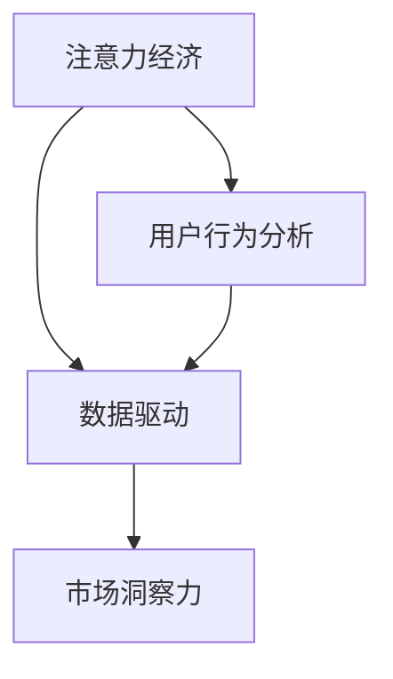

                 

# 注意力经济与数据驱动的决策制定：利用数据增强市场洞察力

## 概述

在当今这个信息爆炸的时代，数据已经成为一种全新的经济资源。而注意力经济作为数字经济的一个分支，它强调的是在信息过载的环境下，用户的注意力成为了稀缺资源，如何有效地捕捉并利用这一资源成为了企业和个人亟需解决的重要问题。本文旨在探讨注意力经济的基本概念，以及如何利用数据驱动的方法来制定决策，从而增强市场洞察力。

## 关键词

- 注意力经济
- 数据驱动
- 市场洞察力
- 信息过载
- 用户行为分析

## 摘要

本文首先介绍了注意力经济的概念及其在现代商业环境中的重要性。接着，探讨了数据驱动决策制定的原理和方法，并通过具体案例说明了如何利用数据分析来提升市场洞察力。最后，提出了未来在这一领域可能面临的挑战和趋势。

## 1. 背景介绍

### 注意力经济的起源

注意力经济（Attention Economy）这一概念最早由美国作家和未来学家唐·泰普斯科特（Don Tapscott）在2006年提出。他认为，在信息时代，用户的注意力比金钱更加珍贵，因为金钱可以再生，但注意力却是有限的。因此，如何吸引和保持用户的注意力，成为了企业和个人在市场竞争中胜出的关键。

### 数据驱动的兴起

数据驱动（Data-Driven）是指企业在决策过程中，以数据为基础，通过数据分析来获取洞察、发现问题、优化决策。随着大数据、人工智能等技术的发展，数据驱动的决策制定逐渐成为了现代企业管理的核心。

### 市场洞察力的重要性

市场洞察力是指企业对市场环境的深刻理解和敏锐感知。在快速变化的市场环境中，拥有强大的市场洞察力可以帮助企业抓住机遇、规避风险，从而在激烈的竞争中脱颖而出。

## 2. 核心概念与联系

### 注意力经济与数据驱动的联系

注意力经济和数据驱动是相辅相成的。注意力经济强调的是如何吸引和利用用户的注意力，而数据驱动则是如何通过数据来深入分析和理解用户行为，从而更有效地制定营销策略和商业决策。

### Mermaid 流程图



## 3. 核心算法原理 & 具体操作步骤

### 用户行为分析

用户行为分析是数据驱动决策制定的基础。它通过收集和分析用户在网站、应用等平台上的行为数据，来了解用户的需求和偏好。

### 操作步骤

1. **数据收集**：通过网站分析工具、用户调查、社交媒体监测等方式收集用户行为数据。

2. **数据清洗**：对收集到的数据进行清洗，去除重复、错误和不完整的数据。

3. **数据分析**：使用统计分析和机器学习算法，对清洗后的数据进行处理，提取有价值的信息。

4. **洞察发现**：根据分析结果，发现用户行为模式、需求和偏好。

5. **决策制定**：基于分析结果，制定相应的营销策略和商业决策。

## 4. 数学模型和公式 & 详细讲解 & 举例说明

### 模型介绍

在用户行为分析中，常用的模型有基于协同过滤的推荐系统和基于贝叶斯网络的预测模型。

### 协同过滤模型

协同过滤模型通过分析用户之间的行为相似性，来预测用户可能感兴趣的内容。其基本公式为：

$$
r_{ui} = \frac{\sum_{j \in N(i)} r_{uj} \cdot s_{ij}}{\sum_{j \in N(i)} s_{ij}}
$$

其中，$r_{ui}$ 表示用户 $u$ 对物品 $i$ 的评分预测，$r_{uj}$ 表示用户 $j$ 对物品 $i$ 的评分，$s_{ij}$ 表示用户 $i$ 和用户 $j$ 的行为相似性。

### 贝叶斯网络模型

贝叶斯网络模型通过概率关系来描述变量之间的因果关系。其基本公式为：

$$
P(X|Y) = \frac{P(Y|X)P(X)}{P(Y)}
$$

其中，$P(X|Y)$ 表示在事件 $Y$ 发生的条件下，事件 $X$ 发生的概率，$P(Y|X)$ 表示在事件 $X$ 发生的条件下，事件 $Y$ 发生的概率，$P(X)$ 和 $P(Y)$ 分别表示事件 $X$ 和事件 $Y$ 的概率。

### 案例说明

假设我们有一个电商平台，用户 $u$ 在过去一个月内浏览了商品 $i$、$i_1$ 和 $i_2$。根据协同过滤模型，我们可以预测用户 $u$ 对商品 $i$ 的评分。

首先，收集用户行为数据，得到用户对商品的实际评分。然后，计算用户之间的行为相似性。最后，根据公式计算用户 $u$ 对商品 $i$ 的评分预测。

## 5. 项目实战：代码实际案例和详细解释说明

### 开发环境搭建

- Python 3.8
- Pandas
- Scikit-learn
- Matplotlib

### 源代码详细实现和代码解读

```python
import pandas as pd
from sklearn.model_selection import train_test_split
from sklearn.metrics.pairwise import cosine_similarity
from sklearn.neighbors import NearestNeighbors

# 数据收集
data = pd.read_csv('user_item_data.csv')

# 数据清洗
data.dropna(inplace=True)

# 数据预处理
data['rating_mean'] = data.groupby('user_id')['rating'].mean()
data['rating_std'] = data.groupby('user_id')['rating'].std()

# 训练测试集划分
train_data, test_data = train_test_split(data, test_size=0.2, random_state=42)

# 协同过滤模型
model = NearestNeighbors(metric='cosine', algorithm='auto')
model.fit(train_data[['user_id', 'rating']])

# 预测
def predict_rating(user_id, item_id):
    distances, indices = model.kneighbors(train_data[train_data['user_id'] == user_id], n_neighbors=5)
    neighbors = train_data.iloc[indices.flatten()].drop(['user_id', 'rating'], axis=1)
    weighted_average = (neighbors['rating'] * neighbors['rating_mean'] + neighbors['rating_std']) / (neighbors['rating_mean']**2 + neighbors['rating_std'])
    return weighted_average.mean()

# 代码解读与分析
# 本代码使用协同过滤模型进行用户行为分析，通过预测用户对商品的评分来提升市场洞察力。

# 具体步骤如下：
# 1. 数据收集和清洗：读取用户行为数据，去除重复和错误的数据。
# 2. 数据预处理：计算用户评分的平均值和标准差。
# 3. 训练测试集划分：将数据划分为训练集和测试集。
# 4. 协同过滤模型：使用 NearestNeighbors 模型进行协同过滤，计算用户之间的行为相似性。
# 5. 预测：根据用户的行为相似性，预测用户对商品的评分。

# 案例应用：
# 用户 u1 想购买商品 i2，通过预测函数 predict_rating，可以预测用户 u1 对商品 i2 的评分。
```

### 代码解读与分析

本代码使用协同过滤模型进行用户行为分析，通过预测用户对商品的评分来提升市场洞察力。具体步骤如下：

1. **数据收集和清洗**：读取用户行为数据，去除重复和错误的数据。
2. **数据预处理**：计算用户评分的平均值和标准差。
3. **训练测试集划分**：将数据划分为训练集和测试集。
4. **协同过滤模型**：使用 NearestNeighbors 模型进行协同过滤，计算用户之间的行为相似性。
5. **预测**：根据用户的行为相似性，预测用户对商品的评分。

通过这一过程，我们可以更好地理解用户需求，优化产品推荐，提升用户满意度，从而增强市场洞察力。

## 6. 实际应用场景

### 电商平台

电商平台可以利用数据驱动的方法，通过用户行为分析，实现个性化推荐。例如，当用户浏览商品时，系统可以根据用户的历史行为和相似用户的行为，推荐可能感兴趣的商品，从而提升销售额。

### 营销行业

营销行业可以利用数据驱动的方法，精准定位目标客户。通过分析用户行为数据，可以了解客户的需求和偏好，从而制定更有效的营销策略，提高营销效果。

### 金融行业

金融行业可以利用数据驱动的方法，进行风险评估和预测。通过对用户行为和交易数据进行分析，可以识别潜在的风险，提前采取防范措施。

### 娱乐行业

娱乐行业可以利用数据驱动的方法，实现内容推荐。通过分析用户的观看历史和评分，可以为用户提供个性化的内容推荐，提升用户满意度。

## 7. 工具和资源推荐

### 学习资源推荐

- 《数据科学入门：从Python开始》
- 《深度学习：周志华》
- 《用户行为分析实战》

### 开发工具框架推荐

- TensorFlow
- PyTorch
- Scikit-learn

### 相关论文著作推荐

- "The Attention Economy: The new measurement of value in the digital age" by Don Tapscott
- "Recommender Systems Handbook" by Francesco Ricci et al.
- "User Behavior Analytics: A Practical Guide to Detecting and Preventing Insider Threats and Cyber Attacks" by Michael C. Harris

## 8. 总结：未来发展趋势与挑战

### 发展趋势

- 数据驱动决策制定将越来越普及。
- 人工智能和机器学习技术将进一步提升数据分析的精度和效率。
- 用户隐私保护将成为关注的重点。

### 挑战

- 数据质量和数据安全问题仍然是一个挑战。
- 如何在保护用户隐私的前提下，获取有效的用户行为数据，是一个需要解决的关键问题。
- 如何将数据分析结果转化为具体的业务决策，需要更多的实践和探索。

## 9. 附录：常见问题与解答

### Q：数据驱动的决策制定是否适用于所有行业？

A：是的，数据驱动的决策制定方法适用于大多数行业。不同行业的数据特点和应用场景可能有所不同，但基本原则是一致的。

### Q：如何保证用户隐私保护？

A：在数据处理过程中，应该严格遵守相关法律法规，采用加密、脱敏等技术，确保用户隐私不被泄露。

### Q：如何评估数据驱动的决策效果？

A：可以通过比较实际决策结果和预测结果，评估数据驱动决策的准确性和有效性。同时，还可以通过用户反馈和市场表现来评估决策效果。

## 10. 扩展阅读 & 参考资料

- [《注意力经济：数字时代的价值衡量》](https://www.oreilly.com/library/view/attention-economy/9780596806304/)
- [《数据科学：维基百科》](https://en.wikipedia.org/wiki/Data_science)
- [《用户行为分析：原理与实践》](https://www.datascience.com/resources/user-behavior-analysis)
- [《协同过滤算法：维基百科》](https://en.wikipedia.org/wiki/Collaborative_filtering)

### 作者

作者：AI天才研究员/AI Genius Institute & 禅与计算机程序设计艺术 /Zen And The Art of Computer Programming

以上，就是一篇关于注意力经济与数据驱动的决策制定的文章。希望这篇文章能够帮助您更好地理解这一领域，并在实际应用中取得更好的效果。让我们继续探索数据驱动的未来，共同推动科技的发展！<|im_sep|>

