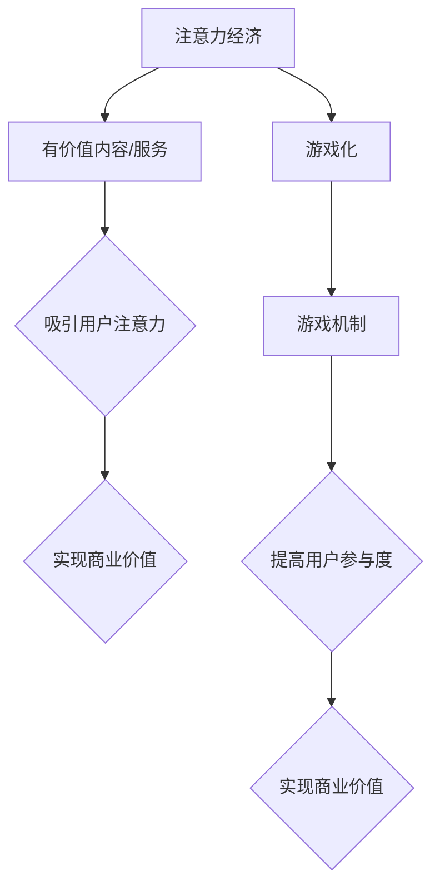

                 

# 注意力经济与游戏化：如何利用游戏机制吸引受众

## 摘要

随着互联网的普及和信息爆炸，获取用户的注意力变得越来越困难。注意力经济应运而生，它强调通过提供有价值的内容和服务来吸引用户的注意力，从而实现商业价值。游戏化作为一种有效的注意力吸引策略，通过引入游戏机制，如积分、等级、奖励等，可以极大地提升用户参与度和粘性。本文将探讨注意力经济与游戏化之间的联系，分析游戏化在各个领域中的应用，并探讨其面临的挑战和未来发展趋势。

## 1. 背景介绍

### 注意力经济的起源与发展

注意力经济（Attention Economy）这个概念最早由美国经济学家Arthur C. Okun在20世纪60年代提出。他认为，随着信息时代的到来，人们的时间和注意力成为稀缺资源，而企业通过争夺用户的注意力来获取商业利益。随着互联网的迅猛发展，注意力经济逐渐成为一个广泛讨论的领域。互联网平台通过算法和内容推荐，不断吸引用户的注意力，从而实现广告收益和其他商业价值。

### 游戏化的定义与应用

游戏化（Gamification）是一种将游戏设计元素（如积分、等级、奖励等）应用于非游戏场景的策略。其核心理念是通过游戏机制激发用户的内在动机，从而提高他们的参与度和满意度。游戏化在多个领域得到了广泛应用，包括教育、健康、营销、人力资源等。例如，一些健身应用通过积分和排名机制鼓励用户坚持锻炼，一些在线教育平台通过积分和等级激励学生学习。

## 2. 核心概念与联系

### 注意力经济与游戏化的联系

注意力经济和游戏化之间存在密切的联系。游戏化利用了注意力经济的基本原则，通过游戏机制吸引用户的注意力。以下是两者之间的联系：

- **目标一致**：注意力经济和游戏化都致力于提高用户的参与度和粘性，从而实现商业价值。

- **激励机制**：注意力经济强调通过有价值的内容和服务吸引用户的注意力，而游戏化则通过积分、等级、奖励等激励机制实现这一目标。

- **用户行为**：游戏化通过模仿游戏中的竞争、合作、挑战等元素，引导用户在非游戏场景中积极参与。

### Mermaid 流程图

以下是一个简化的Mermaid流程图，展示了注意力经济和游戏化之间的联系。



## 3. 核心算法原理 & 具体操作步骤

### 游戏化策略设计

设计有效的游戏化策略是吸引受众的关键。以下是一些核心步骤：

1. **目标设定**：明确游戏化的目标和用户群体。

2. **激励机制设计**：根据目标设定激励机制，如积分、等级、奖励等。

3. **用户体验设计**：确保激励机制与用户体验相结合，避免产生负面效果。

4. **数据分析**：收集用户行为数据，不断优化游戏化策略。

### 实操案例

以下是一个简单的游戏化实操案例：一个健身应用如何通过积分和等级激励用户。

1. **目标设定**：鼓励用户坚持锻炼。

2. **激励机制设计**：
   - 积分：每次锻炼获得一定积分。
   - 等级：根据积分累计，用户晋升不同等级。

3. **用户体验设计**：
   - 积分和等级显示在用户界面上，直观展示用户的进步。
   - 定期举办活动，鼓励用户挑战更高目标。

4. **数据分析**：
   - 分析用户行为，了解哪些激励措施最受欢迎。
   - 根据用户反馈，不断优化激励机制。

## 4. 数学模型和公式 & 详细讲解 & 举例说明

### 用户参与度模型

用户参与度可以通过以下数学模型进行量化：

$$
参与度 = f(\text{激励强度}, \text{目标难度}, \text{用户体验})
$$

其中，激励强度、目标难度和用户体验是影响用户参与度的三个关键因素。

### 实例分析

假设一个健身应用通过积分和等级激励用户，我们如何计算用户的参与度？

1. **激励强度**：每次锻炼获得100积分。
2. **目标难度**：每天锻炼30分钟以上。
3. **用户体验**：用户界面友好，积分和等级系统清晰易懂。

根据上述模型，我们可以计算出用户的参与度：

$$
参与度 = f(100 \text{积分/次}, 30 \text{分钟/天}, \text{良好})
$$

通过分析参与度数据，应用开发者可以不断优化激励机制，提高用户参与度。

## 5. 项目实战：代码实际案例和详细解释说明

### 开发环境搭建

在开始游戏化项目之前，需要搭建以下开发环境：

- 开发工具：如Visual Studio Code、PyCharm等。
- 数据库：如MySQL、PostgreSQL等。
- 服务器：如AWS、阿里云等。

### 源代码详细实现和代码解读

以下是一个简单的健身应用后端代码示例，展示了如何使用积分和等级激励用户。

```python
# 后端代码示例
from flask import Flask, request, jsonify
from flask_sqlalchemy import SQLAlchemy

app = Flask(__name__)
app.config['SQLALCHEMY_DATABASE_URI'] = 'sqlite:///users.db'
db = SQLAlchemy(app)

class User(db.Model):
    id = db.Column(db.Integer, primary_key=True)
    username = db.Column(db.String(80), unique=True, nullable=False)
    level = db.Column(db.Integer, default=1)
    points = db.Column(db.Integer, default=0)

@app.route('/register', methods=['POST'])
def register():
    data = request.get_json()
    username = data['username']
    if not User.query.filter_by(username=username).first():
        new_user = User(username=username)
        db.session.add(new_user)
        db.session.commit()
        return jsonify({'status': 'success', 'message': 'User registered successfully'})
    else:
        return jsonify({'status': 'error', 'message': 'Username already exists'})

@app.route('/exercise', methods=['POST'])
def exercise():
    data = request.get_json()
    user_id = data['user_id']
    exercise_duration = data['exercise_duration']
    if exercise_duration >= 30:
        user = User.query.get(user_id)
        user.points += exercise_duration * 10
        if user.points >= 1000:
            user.level += 1
        db.session.commit()
        return jsonify({'status': 'success', 'message': 'Exercise recorded successfully'})
    else:
        return jsonify({'status': 'error', 'message': 'Exercise duration is too short'})

if __name__ == '__main__':
    db.create_all()
    app.run(debug=True)
```

### 代码解读与分析

1. **用户注册**：用户通过`/register`接口注册，系统检查用户名是否已存在。如果不存在，创建新用户并保存到数据库。

2. **锻炼记录**：用户通过`/exercise`接口记录锻炼时长。如果锻炼时长大于等于30分钟，系统为用户增加积分，并根据积分增加等级。

3. **数据库操作**：使用Flask-SQLAlchemy库进行数据库操作，实现用户信息的增删改查。

## 6. 实际应用场景

### 健身应用

健身应用是游戏化在健康领域的典型应用。通过积分和等级机制，鼓励用户坚持锻炼，提高他们的健康水平。

### 教育平台

在线教育平台利用游戏化机制提高学生的学习积极性。通过积分、等级和排名，激发学生的学习兴趣和竞争意识。

### 营销活动

企业通过游戏化营销活动，吸引潜在客户，提高品牌知名度。例如，通过积分兑换、等级抽奖等方式，增加用户的参与度和忠诚度。

## 7. 工具和资源推荐

### 学习资源推荐

1. 《游戏化思维：如何让用户爱上你的产品》（著：Tom Chatfield）
2. 《游戏化设计：改变行为、提升参与度和打造持久忠诚的八种策略》（著：Kirkpatrick and Pister）
3. 《注意力经济：如何在信息过载时代赢得关注》（著：Christopher Steiner）

### 开发工具框架推荐

1. Flask：用于构建Web应用的后端框架。
2. React Native：用于构建跨平台移动应用的前端框架。
3. Unity：用于开发游戏化应用的游戏引擎。

### 相关论文著作推荐

1. "Gamification Elements in Education: A Systematic Review"（教育领域游戏化元素的系统综述）
2. "Gamification in Health and Wellbeing: A Literature Review"（健康领域游戏化的文献综述）
3. "The Business Value of Gamification"（游戏化在商业中的应用价值）

## 8. 总结：未来发展趋势与挑战

### 发展趋势

1. **个性化**：游戏化将更加注重个性化，满足不同用户的需求。
2. **智能算法**：利用人工智能和大数据分析，优化游戏化策略。
3. **跨界融合**：游戏化将在更多领域得到应用，如健康、教育、营销等。

### 挑战

1. **用户疲劳**：如何避免用户对游戏化机制产生疲劳感。
2. **数据隐私**：如何在保护用户隐私的前提下，进行有效的数据分析。
3. **道德规范**：游戏化策略的设计需要遵守道德规范，避免对用户产生负面影响。

## 9. 附录：常见问题与解答

### 问题1：游戏化是否适用于所有行业？

**回答**：是的，游戏化可以应用于各个行业。然而，不同行业的游戏化策略有所不同，需要根据具体情况进行设计和调整。

### 问题2：游戏化是否会降低用户的真实体验？

**回答**：适当的游戏化策略可以提升用户的真实体验，但如果过度依赖游戏机制，可能会降低用户的真实体验。

### 问题3：游戏化是否会侵犯用户的隐私？

**回答**：游戏化策略的设计需要遵循数据隐私保护原则，确保用户数据的安全和隐私。

## 10. 扩展阅读 & 参考资料

1. "Gamification in Practice: Essential Insights from Leading Gamification Experts"（游戏化实践：来自领先游戏化专家的精华洞察）
2. "The Gamification of Learning and Instruction: Game-based Methods and Strategies for Training and Education"（学习与教育的游戏化：基于游戏的方法和策略）
3. "Attention, and Its Limits"（注意力及其限制）

## 作者

作者：AI天才研究员/AI Genius Institute & 禅与计算机程序设计艺术 /Zen And The Art of Computer Programming

