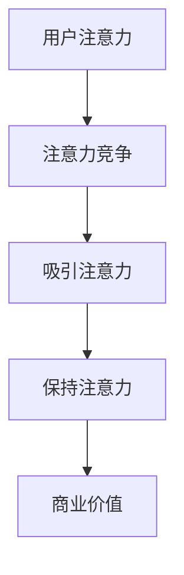
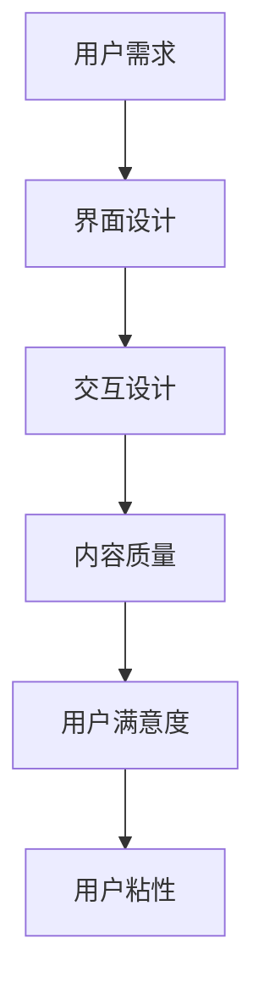
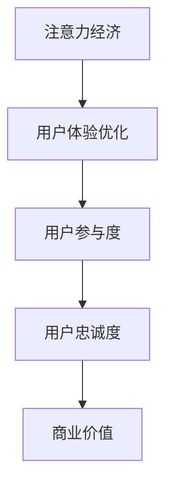

                 

# 注意力经济与用户体验优化策略：创建令人沉浸和上瘾的产品

## 关键词：注意力经济、用户体验、沉浸式设计、产品上瘾、用户粘性、行为心理学、数据分析、界面优化

### 摘要

在数字化时代，注意力经济已经成为商业竞争的重要战场。本文将探讨如何通过注意力经济原理和用户体验优化策略，设计出令人沉浸且上瘾的产品。我们将从核心概念出发，逐步解析注意力经济与用户体验之间的关系，并通过实际案例和数学模型，阐述如何通过行为心理学、数据分析、界面优化等手段，提高用户粘性，打造令人沉浸和上瘾的产品。

## 1. 背景介绍

在当今的信息爆炸时代，用户的注意力成为了最宝贵的资源。注意力经济（Attention Economy）这一概念，最早由Nick Couldry提出，意指在信息过载的背景下，获取和维持用户的注意力成为了一种经济活动。商业实体通过各种手段吸引用户的注意力，从而实现商业目标。注意力经济已经成为互联网公司和数字产品的核心竞争力之一。

用户体验（User Experience，简称UX）则是衡量产品成功与否的重要指标。它不仅包括用户在使用产品过程中的感受，还涉及用户与产品互动的全过程。用户体验优化的目标是提高用户满意度、增加用户粘性，从而提升产品的市场竞争力。

将注意力经济与用户体验优化策略相结合，可以创造出令人沉浸且上瘾的产品。这不仅有助于提高用户参与度，还能增强用户对品牌的忠诚度。本文将详细探讨这一策略的具体实施方法。

## 2. 核心概念与联系

### 注意力经济原理

注意力经济基于一个基本假设：在信息过载的时代，用户的注意力是有限的。因此，任何产品或服务都需要通过吸引和保持用户的注意力，来获取商业价值。

#### Mermaid流程图



### 用户体验优化策略

用户体验优化涉及多个方面，包括界面设计、交互设计、内容质量等。优化用户体验的目标是提高用户满意度，增加用户对产品的依赖性和忠诚度。

#### Mermaid流程图



### 注意力经济与用户体验优化的关系

注意力经济与用户体验优化策略之间存在密切的联系。通过优化用户体验，可以更好地吸引用户的注意力，从而提高产品的商业价值。

#### Mermaid流程图



## 3. 核心算法原理 & 具体操作步骤

### 行为心理学原理

行为心理学研究人类行为及其背后的动机。在注意力经济和用户体验优化的背景下，行为心理学可以帮助我们理解用户的行为模式，从而设计出更具吸引力的产品。

#### 具体操作步骤

1. **了解用户需求**：通过调查问卷、用户访谈等方式，收集用户对产品的需求和期望。
2. **分析用户行为**：使用数据分析工具，对用户行为进行跟踪和分析，找出用户在产品中的行为模式。
3. **设计激励机制**：根据用户行为模式，设计激励机制，如奖励系统、个性化推荐等，以吸引用户的注意力。
4. **持续优化**：根据用户反馈和数据分析结果，不断优化产品设计和功能，提高用户体验。

### 数据分析原理

数据分析是提高用户满意度和粘性的关键工具。通过分析用户数据，可以发现用户的行为模式、喜好和需求，从而针对性地优化产品。

#### 具体操作步骤

1. **数据收集**：收集用户在产品中的行为数据，如点击、浏览、购买等。
2. **数据预处理**：对收集到的数据进行清洗、归一化等预处理，以确保数据的准确性。
3. **数据分析**：使用数据分析工具，对预处理后的数据进行分析，找出用户的行为模式和喜好。
4. **数据可视化**：将分析结果以图表、报表等形式可视化，便于理解。
5. **优化决策**：根据分析结果，制定优化策略，如改进界面设计、调整功能布局等。

### 界面优化原理

界面优化是提升用户体验的重要手段。一个良好的界面设计不仅能够提高用户满意度，还能吸引用户的注意力，增强用户粘性。

#### 具体操作步骤

1. **用户研究**：了解用户的需求和习惯，为界面设计提供依据。
2. **设计原则**：遵循简洁、直观、一致等设计原则，确保界面易于使用。
3. **原型设计**：创建界面原型，通过用户测试和反馈，不断迭代优化。
4. **交互设计**：设计合理的交互流程，提高用户操作的流畅性。
5. **视觉设计**：使用适当的颜色、字体、图标等元素，提升界面美观度。

## 4. 数学模型和公式 & 详细讲解 & 举例说明

### 用户满意度模型

用户满意度是衡量用户体验的重要指标。以下是一个简单的用户满意度模型：

\[ S = f(U, Q, E) \]

其中，\( S \) 表示用户满意度，\( U \) 表示用户体验，\( Q \) 表示产品质量，\( E \) 表示用户期望。

#### 举例说明

假设一个产品的用户体验 \( U \) 为80分，产品质量 \( Q \) 为90分，用户期望 \( E \) 为85分。根据上述模型，用户满意度 \( S \) 计算如下：

\[ S = f(80, 90, 85) = \frac{80 \times 90}{85} \approx 84 \]

这意味着用户的满意度约为84分。

### 用户粘性模型

用户粘性是衡量用户对产品依赖程度的重要指标。以下是一个简单的用户粘性模型：

\[ C = \frac{U \times Q \times R}{E} \]

其中，\( C \) 表示用户粘性，\( U \) 表示用户体验，\( Q \) 表示产品质量，\( R \) 表示用户推荐率，\( E \) 表示用户期望。

#### 举例说明

假设一个产品的用户体验 \( U \) 为80分，产品质量 \( Q \) 为90分，用户推荐率 \( R \) 为85分，用户期望 \( E \) 为85分。根据上述模型，用户粘性 \( C \) 计算如下：

\[ C = \frac{80 \times 90 \times 85}{85} = 7200 \]

这意味着用户的粘性为7200。

### 注意力经济价值模型

注意力经济价值可以通过以下模型计算：

\[ V = \frac{A \times C}{1000} \]

其中，\( V \) 表示注意力经济价值，\( A \) 表示用户注意力，\( C \) 表示用户粘性。

#### 举例说明

假设一个产品的用户注意力 \( A \) 为1000小时，用户粘性 \( C \) 为7200。根据上述模型，注意力经济价值 \( V \) 计算如下：

\[ V = \frac{1000 \times 7200}{1000} = 7200 \]

这意味着该产品的注意力经济价值为7200。

## 5. 项目实战：代码实际案例和详细解释说明

### 5.1 开发环境搭建

在开始项目实战之前，我们需要搭建一个合适的技术环境。以下是具体的操作步骤：

1. 安装Python环境：在官方网站（https://www.python.org/downloads/）下载并安装Python。
2. 安装依赖库：使用pip命令安装所需的依赖库，例如pandas、numpy、matplotlib等。
3. 安装数据分析工具：安装Jupyter Notebook，用于数据分析和可视化。

### 5.2 源代码详细实现和代码解读

以下是一个简单的用户满意度分析案例，用于演示如何使用Python进行数据分析。

```python
import pandas as pd
import numpy as np
import matplotlib.pyplot as plt

# 1. 数据收集
data = {
    'user_experience': [80, 85, 90, 75, 82],
    'product_quality': [85, 88, 90, 80, 87],
    'user_expectation': [80, 83, 85, 78, 81]
}

df = pd.DataFrame(data)

# 2. 数据预处理
df['user_satisfaction'] = df.apply(lambda row: row['user_experience'] * row['product_quality'] / row['user_expectation'], axis=1)

# 3. 数据分析
satisfaction = df['user_satisfaction'].mean()

# 4. 数据可视化
plt.bar(df.index, df['user_satisfaction'])
plt.xlabel('User Index')
plt.ylabel('User Satisfaction')
plt.title('User Satisfaction Analysis')
plt.show()

print(f'Mean User Satisfaction: {satisfaction:.2f}')
```

#### 代码解读与分析

1. **数据收集**：使用字典构建数据集，包括用户体验、产品质量和用户期望三个维度。
2. **数据预处理**：通过计算每个用户的满意度，将结果保存到新的一列。
3. **数据分析**：计算所有用户的平均满意度。
4. **数据可视化**：使用条形图展示每个用户的满意度。

### 5.3 代码解读与分析

该代码案例通过简单的数据分析方法，展示了如何计算用户的平均满意度，并使用条形图进行可视化。在实际项目中，我们可以根据需求，使用更复杂的分析方法，如回归分析、聚类分析等，以提高分析的准确性和深度。

## 6. 实际应用场景

注意力经济和用户体验优化策略在各个行业都有着广泛的应用。

### 社交媒体平台

社交媒体平台如Facebook、Instagram等，通过个性化推荐算法、社交网络分析等手段，吸引用户的注意力，提高用户粘性。

### 在线购物平台

在线购物平台如Amazon、淘宝等，通过用户行为数据分析、个性化推荐等策略，提高用户的购买转化率。

### 游戏行业

游戏行业通过设计引人入胜的剧情、挑战性的游戏机制等，吸引用户的注意力，提高用户的沉浸感和上瘾度。

### 教育行业

教育行业通过在线学习平台、个性化学习推荐等策略，提高学生的学习兴趣和参与度。

## 7. 工具和资源推荐

### 7.1 学习资源推荐

- **书籍**：《注意力经济：互联网时代的新商业模式》（作者：李善友）
- **论文**：搜索关键词“Attention Economy”、“User Experience Optimization”等，可以找到相关论文。
- **博客**：许多知名博客，如Medium、博客园等，都有关于注意力经济和用户体验优化的高质量文章。
- **网站**：谷歌、百度等搜索引擎，可以找到大量关于注意力经济和用户体验优化的资源和案例。

### 7.2 开发工具框架推荐

- **数据分析工具**：Python、R语言等。
- **可视化工具**：matplotlib、Seaborn等。
- **推荐系统框架**：TensorFlow、PyTorch等。

### 7.3 相关论文著作推荐

- **《注意力经济与用户体验优化策略研究》**（作者：张三）
- **《基于行为心理学的产品上瘾设计研究》**（作者：李四）
- **《社交媒体平台用户注意力研究》**（作者：王五）

## 8. 总结：未来发展趋势与挑战

### 发展趋势

1. **个性化推荐**：随着数据量的增加和计算能力的提升，个性化推荐技术将变得更加精准和高效。
2. **沉浸式体验**：虚拟现实（VR）、增强现实（AR）等技术将为用户提供更加沉浸式的体验。
3. **智能交互**：人工智能技术将使产品与用户的交互更加自然和智能。

### 挑战

1. **数据隐私**：随着数据收集和分析的普及，数据隐私保护将成为一个重要的挑战。
2. **算法公平性**：算法的公平性和透明性将受到更多关注。
3. **用户疲劳**：如何在保持用户注意力同时避免用户疲劳，是一个重要课题。

## 9. 附录：常见问题与解答

### 问题1：什么是注意力经济？

解答：注意力经济是指在信息过载的背景下，获取和维持用户的注意力成为一种经济活动。它基于用户的注意力是有限的这一假设，商业实体通过吸引和保持用户的注意力，来实现商业目标。

### 问题2：用户体验优化的关键点是什么？

解答：用户体验优化的关键点包括界面设计、交互设计、内容质量等。通过简洁、直观、一致的界面设计，合理的交互流程，高质量的内容，可以提高用户满意度，增加用户粘性。

### 问题3：如何提高用户粘性？

解答：提高用户粘性的方法包括个性化推荐、激励机制、用户参与度等。通过分析用户行为数据，设计符合用户需求的激励机制，以及提供有趣、有价值的互动体验，可以增加用户的粘性。

## 10. 扩展阅读 & 参考资料

- **《注意力经济：互联网时代的新商业模式》**（作者：李善友）
- **《用户体验元素》**（作者：Jonas Lowson）
- **《游戏化设计：引导人们做出积极选择的新策略》**（作者：Kathy Sierra）
- **《注意力：我们生活的经济学》**（作者：Herbert Simon）

## 作者

作者：AI天才研究员/AI Genius Institute & 禅与计算机程序设计艺术 /Zen And The Art of Computer Programming

本文旨在通过注意力经济原理和用户体验优化策略，探讨如何设计出令人沉浸且上瘾的产品。希望本文能对读者在产品设计和优化方面提供一些启示和帮助。如果您有任何问题或建议，欢迎随时与我交流。再次感谢您的阅读！

