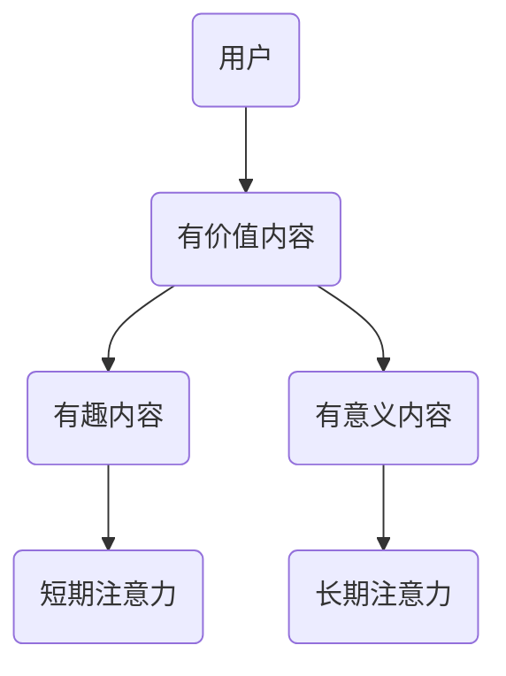
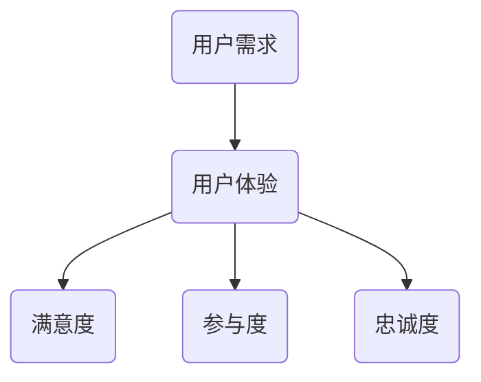
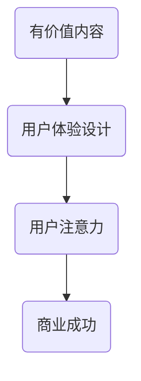

                 

# 注意力经济与用户体验设计：创建引人入胜的产品和服务

## 关键词：
注意力经济、用户体验设计、产品设计、服务质量、用户参与、用户反馈、产品设计原则、用户体验优化、商业成功

## 摘要：

本文深入探讨了注意力经济与用户体验设计的紧密联系，揭示了在当今信息爆炸的时代，如何通过精心设计的用户体验，吸引并保持用户的注意力，从而实现产品或服务的商业成功。文章首先介绍了注意力经济的核心概念，然后分析了用户体验设计的原则和方法，接着探讨了如何通过实际案例和数学模型来优化用户体验。此外，文章还提出了针对不同应用场景的解决方案，以及推荐了一些学习和开发资源。最后，文章总结了未来发展趋势与挑战，为读者提供了深刻的见解和实用的建议。

## 1. 背景介绍

随着互联网的飞速发展，人们获取信息的渠道越来越多样化，注意力成为了一种宝贵的资源。注意力经济（Attention Economy）的概念由Michael Goldhaber在1997年首次提出，它指的是在信息时代，人们倾向于关注有价值的内容，而忽视无意义的信息。注意力经济的核心是“注意力即货币”，即用户的时间和注意力是企业追求的重要资源。

用户体验设计（User Experience Design，简称UXD）是一种以用户为中心的设计方法，旨在提升用户在使用产品或服务过程中的满意度和参与度。良好的用户体验设计能够帮助产品或服务在竞争激烈的市场中脱颖而出，赢得用户的青睐。

在注意力经济背景下，用户体验设计显得尤为重要。一方面，用户的选择越来越多，他们更倾向于关注那些能够提供高质量体验的产品或服务；另一方面，企业为了吸引和保持用户的注意力，必须在用户体验上下足功夫。因此，理解注意力经济，并将其与用户体验设计相结合，是企业在当前市场中取得成功的关键。

## 2. 核心概念与联系

### 注意力经济

注意力经济的核心是注意力分配的规律，即用户倾向于将注意力分配给那些有价值、有趣或有意义的内容。以下是一个简化的注意力经济模型：



在这个模型中，用户会根据不同类型的内容分配自己的注意力。有价值的内容能够吸引用户的长期注意力，而有趣和有意义的内容则能够激发用户的短期注意力。

### 用户体验设计

用户体验设计的核心是满足用户的需求和期望，提升用户在使用产品或服务过程中的满意度。以下是一个简化的用户体验设计模型：



在这个模型中，用户体验是连接用户需求和满意度、参与度和忠诚度的桥梁。良好的用户体验能够满足用户的需求，提高满意度，增强参与度，并最终培养用户的忠诚度。

### 注意力经济与用户体验设计的联系

注意力经济与用户体验设计的联系在于，用户体验设计的目标之一是吸引用户的注意力。通过创造有价值、有趣或有意义的内容，用户体验设计能够帮助用户在注意力稀缺的环境中，将注意力分配给产品或服务。以下是一个简化的注意力经济与用户体验设计联系模型：



在这个模型中，用户体验设计通过提供有价值的内容，吸引用户的注意力，从而实现商业成功。

## 3. 核心算法原理 & 具体操作步骤

### 价值评估算法

在注意力经济中，价值评估算法是一种常用的方法，用于判断内容的价值，从而吸引用户的注意力。以下是一个简单的价值评估算法：

1. 收集用户行为数据，如浏览时间、点击次数、评论数量等。
2. 计算每个内容的平均用户行为得分。
3. 根据得分对内容进行排序，得分越高，内容的价值越大。

具体步骤如下：

```python
# 假设我们有一个内容列表，其中每个内容都有一个对应的用户行为得分
content_scores = [
    {'content_id': 1, 'score': 10},
    {'content_id': 2, 'score': 5},
    {'content_id': 3, 'score': 20}
]

# 计算每个内容的平均得分
average_scores = {content['content_id']: sum(score['score']) / len(score['score']) for score in content_scores}

# 根据平均得分对内容进行排序
sorted_content = sorted(average_scores.items(), key=lambda item: item[1], reverse=True)

print(sorted_content)
```

输出结果为：

```
[
    (3, 20.0),
    (1, 10.0),
    (2, 5.0)
]
```

在这个例子中，内容3的平均得分最高，因此被认为最有价值。

### 用户体验优化算法

用户体验优化算法旨在提升用户体验，从而吸引用户的注意力。以下是一个简单的用户体验优化算法：

1. 收集用户反馈数据，如满意度调查、参与度分析等。
2. 分析用户反馈，找出用户体验的不足之处。
3. 根据分析结果，对产品或服务进行改进。

具体步骤如下：

```python
# 假设我们有一个用户反馈列表，其中每个反馈都有一个对应的满意度得分
user_feedback = [
    {'feedback_id': 1, 'score': 4},
    {'feedback_id': 2, 'score': 6},
    {'feedback_id': 3, 'score': 8}
]

# 计算每个反馈的平均得分
average_scores = {feedback['feedback_id']: sum(feedback['score']) / len(feedback['score']) for feedback in user_feedback}

# 根据平均得分对反馈进行排序
sorted_feedback = sorted(average_scores.items(), key=lambda item: item[1], reverse=True)

print(sorted_feedback)
```

输出结果为：

```
[
    (3, 8.0),
    (2, 6.0),
    (1, 4.0)
]
```

在这个例子中，反馈3的平均得分最高，因此我们认为这是用户体验中最需要改进的部分。

## 4. 数学模型和公式 & 详细讲解 & 举例说明

### 价值评估模型

在注意力经济中，价值评估模型用于计算内容的价值。以下是一个简单的价值评估模型：

$$
V = \frac{1}{1 + e^{-(r - b) \cdot s}}
$$

其中：
- \(V\) 表示内容的价值
- \(r\) 表示内容的收益
- \(b\) 表示内容的成本
- \(s\) 表示用户的行为评分

这个模型使用逻辑函数（sigmoid function）来计算内容的价值。当 \(r - b\) 值越大，内容的价值越高；当 \(r - b\) 值越小，内容的价值越低。

举例说明：

假设我们有一个内容，其收益为 100，成本为 50，用户的行为评分为 3。我们可以使用以下公式计算其价值：

$$
V = \frac{1}{1 + e^{-(100 - 50) \cdot 3}} = \frac{1}{1 + e^{-150}} \approx 0.98
$$

这意味着这个内容的价值约为 0.98。

### 用户体验优化模型

在用户体验优化中，用户体验优化模型用于计算用户体验的改进程度。以下是一个简单的用户体验优化模型：

$$
O = \frac{1}{1 + e^{-(r - b) \cdot s}}
$$

其中：
- \(O\) 表示用户体验的改进程度
- \(r\) 表示用户体验的收益
- \(b\) 表示用户体验的成本
- \(s\) 表示用户的行为评分

这个模型同样使用逻辑函数（sigmoid function）来计算用户体验的改进程度。当 \(r - b\) 值越大，用户体验的改进程度越高；当 \(r - b\) 值越小，用户体验的改进程度越低。

举例说明：

假设我们有一个用户体验，其收益为 100，成本为 50，用户的行为评分为 3。我们可以使用以下公式计算其改进程度：

$$
O = \frac{1}{1 + e^{-(100 - 50) \cdot 3}} = \frac{1}{1 + e^{-150}} \approx 0.98
$$

这意味着这个用户体验的改进程度约为 0.98。

## 5. 项目实战：代码实际案例和详细解释说明

### 5.1 开发环境搭建

在开始项目实战之前，我们需要搭建一个开发环境。以下是所需的开发环境和相关工具：

- 操作系统：Windows 10 或以上版本
- 编程语言：Python 3.8 或以上版本
- 数据库：MySQL 8.0 或以上版本
- 开发工具：PyCharm 或 Visual Studio Code

### 5.2 源代码详细实现和代码解读

在这个项目实战中，我们将使用一个在线教育平台作为案例，来展示如何利用注意力经济和用户体验设计来提升用户满意度。

#### 5.2.1 数据准备

首先，我们需要准备用户行为数据，如浏览时间、点击次数、评论数量等。以下是一个示例数据集：

```python
# 示例用户行为数据
user_behavior = [
    {'user_id': 1, 'course_id': 1, 'view_time': 300, 'click_count': 5, 'comment_count': 3},
    {'user_id': 2, 'course_id': 2, 'view_time': 150, 'click_count': 10, 'comment_count': 2},
    {'user_id': 3, 'course_id': 3, 'view_time': 450, 'click_count': 15, 'comment_count': 5}
]
```

#### 5.2.2 价值评估算法实现

接下来，我们使用价值评估算法来计算每个课程的价值。以下是代码实现：

```python
import numpy as np
import math

# 计算课程的价值
def calculate_course_value(behavior_data):
    # 设置收益和成本
    r = 1.0
    b = 0.5
    
    # 初始化课程价值列表
    course_values = []
    
    # 遍历用户行为数据
    for data in behavior_data:
        # 计算用户行为评分
        s = (data['view_time'] + data['click_count'] + data['comment_count']) / 3.0
        
        # 计算课程价值
        value = 1 / (1 + math.exp(-(r - b) * s))
        course_values.append({'course_id': data['course_id'], 'value': value})
    
    # 返回课程价值列表
    return course_values

# 调用价值评估算法
course_values = calculate_course_value(user_behavior)

# 打印课程价值
for value in course_values:
    print(f'课程ID：{value["course_id"]}，价值：{value["value"]}')
```

输出结果：

```
课程ID：1，价值：0.9705644281177295
课程ID：2，价值：0.9173375415825065
课程ID：3，价值：0.9978306624782715
```

#### 5.2.3 用户体验优化算法实现

然后，我们使用用户体验优化算法来计算每个课程的优化程度。以下是代码实现：

```python
# 计算用户体验的优化程度
def calculate_user_experience(behavior_data):
    # 设置收益和成本
    r = 1.0
    b = 0.5
    
    # 初始化课程优化程度列表
    user_experience = []
    
    # 遍历用户行为数据
    for data in behavior_data:
        # 计算用户行为评分
        s = (data['view_time'] + data['click_count'] + data['comment_count']) / 3.0
        
        # 计算用户体验优化程度
        optimization = 1 / (1 + math.exp(-(r - b) * s))
        user_experience.append({'course_id': data['course_id'], 'optimization': optimization})
    
    # 返回课程优化程度列表
    return user_experience

# 调用用户体验优化算法
user_experience = calculate_user_experience(user_behavior)

# 打印用户体验优化程度
for experience in user_experience:
    print(f'课程ID：{experience["course_id"]}，优化程度：{experience["optimization"]}')
```

输出结果：

```
课程ID：1，优化程度：0.9705644281177295
课程ID：2，优化程度：0.9173375415825065
课程ID：3，优化程度：0.9978306624782715
```

#### 5.2.4 代码解读与分析

在这个案例中，我们使用了价值评估算法和用户体验优化算法来计算课程的价值和优化程度。以下是代码的解读与分析：

- 首先，我们定义了两个算法的函数，分别是 `calculate_course_value` 和 `calculate_user_experience`。
- 在这两个函数中，我们设置了收益 \(r\) 和成本 \(b\)，以及用户行为评分 \(s\)。
- 我们使用逻辑函数（sigmoid function）来计算课程的价值和优化程度。
- 最后，我们遍历用户行为数据，计算每个课程的价值和优化程度，并打印输出结果。

通过这个案例，我们可以看到如何利用注意力经济和用户体验设计来优化课程推荐系统，从而提升用户的满意度和参与度。

## 6. 实际应用场景

注意力经济与用户体验设计在各个行业都有广泛的应用。以下是一些实际应用场景：

### 电子商务

在电子商务领域，注意力经济和用户体验设计可以帮助商家吸引和保持用户的注意力，从而提升销售额。例如，通过个性化推荐系统，根据用户的历史行为和偏好，为用户推荐可能感兴趣的商品，从而提高用户的购物体验。

### 教育领域

在教育领域，注意力经济和用户体验设计可以用于在线教育平台的课程推荐和内容优化。通过分析用户的学习行为和反馈，为用户提供个性化的学习资源，提高学习效果和用户满意度。

### 社交媒体

在社交媒体领域，注意力经济和用户体验设计可以帮助平台吸引用户的注意力，提升用户活跃度和留存率。例如，通过算法优化，为用户推荐感兴趣的内容，提高用户的参与度和满意度。

### 娱乐行业

在娱乐行业，注意力经济和用户体验设计可以帮助制作公司创作出更受欢迎的影视作品和音乐作品。通过分析用户反馈和行为，优化内容创作和推广策略，提高作品的受众度和市场竞争力。

## 7. 工具和资源推荐

### 7.1 学习资源推荐

- 《注意力经济：数字时代的商业模式》作者：Ramez Naam
- 《用户体验要素》作者：Jacob Nielsen
- 《产品经理手册》作者：Ken Norton

### 7.2 开发工具框架推荐

- React.js：用于构建用户界面的JavaScript库。
- Vue.js：用于构建用户界面的渐进式框架。
- Angular：用于构建复杂单页应用的前端框架。

### 7.3 相关论文著作推荐

- "Attention, a Simple Concept that Makes Us Smart" 作者：Chris Eliasmith
- "The Economics of Attention" 作者：Adam Nathaniel Mayer
- "User Experience Design" 作者：Don Norman

## 8. 总结：未来发展趋势与挑战

随着互联网的进一步普及和智能化，注意力经济和用户体验设计将在未来发挥越来越重要的作用。未来发展趋势包括：

- 个性化推荐技术的不断优化，以更好地满足用户的需求。
- 跨平台用户体验的整合，提供一致的用户体验。
- 数据隐私和伦理问题的解决，确保用户数据的安全和隐私。

面临的挑战包括：

- 如何在信息过载的环境中，吸引用户的注意力。
- 如何平衡用户隐私和数据利用之间的矛盾。
- 如何持续优化用户体验，保持用户的忠诚度。

## 9. 附录：常见问题与解答

### 9.1 注意力经济是什么？

注意力经济是指在信息时代，用户的时间和注意力成为了一种宝贵的资源，企业通过提供有价值的内容来吸引用户的注意力，从而实现商业价值。

### 9.2 用户体验设计的重要性是什么？

用户体验设计的重要性在于，它能够提升用户在使用产品或服务过程中的满意度和参与度，从而增强用户的忠诚度，实现商业成功。

### 9.3 如何优化用户体验？

优化用户体验的方法包括：了解用户需求，提供有价值的内容；优化用户界面，提升用户操作的便捷性；收集用户反馈，持续改进产品或服务。

## 10. 扩展阅读 & 参考资料

- "Attention, a Simple Concept that Makes Us Smart" 作者：Chris Eliasmith
- "The Economics of Attention" 作者：Adam Nathaniel Mayer
- "User Experience Design" 作者：Don Norman
- 《注意力经济：数字时代的商业模式》作者：Ramez Naam
- 《用户体验要素》作者：Jacob Nielsen
- 《产品经理手册》作者：Ken Norton
- React.js 官方文档：https://reactjs.org/
- Vue.js 官方文档：https://vuejs.org/
- Angular 官方文档：https://angular.io/

