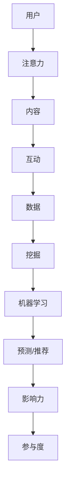

                 

# 注意力经济与社交媒体分析：了解受众参与度和影响力的洞察力

> **关键词：** 注意力经济、社交媒体分析、受众参与度、影响力、数据挖掘、算法、机器学习、预测模型、案例分析

> **摘要：** 本文将深入探讨注意力经济在社交媒体环境中的应用，分析受众参与度和影响力的测量方法，结合实际案例，探讨如何通过数据挖掘和机器学习技术提升社交媒体内容的影响力和受众参与度。文章旨在为企业和个人提供实践指导，以更好地理解和利用社交媒体的潜力。

## 1. 背景介绍

在数字时代，社交媒体已经成为人们日常生活的重要组成部分。无论是个人用户还是企业，都在社交媒体平台上积极互动，试图吸引更多关注，提升品牌影响力。然而，随着社交媒体平台的爆炸式增长和用户基数的扩大，如何有效地吸引并保持受众的关注成为了一个关键问题。这就是注意力经济的诞生背景。

### 注意力经济的定义

注意力经济（Attention Economy）是指在一个信息过载的环境中，个体通过集中注意力来选择他们感兴趣的内容或产品的一种经济形态。在这个经济体系中，注意力被视为一种稀缺资源，而能够吸引注意力的内容或产品则具有价值。

### 社交媒体与注意力经济的联系

社交媒体平台，如Facebook、Twitter、Instagram等，都是注意力经济的重要战场。这些平台通过算法推荐和用户互动，不断吸引用户的注意力。对于企业和个人来说，如何在海量的信息中脱颖而出，吸引目标受众的注意力，是提高品牌知名度和用户参与度的关键。

## 2. 核心概念与联系

在探讨注意力经济和社交媒体分析时，需要理解以下几个核心概念：

### 受众参与度

受众参与度是指用户在社交媒体平台上对内容的互动程度，包括点赞、评论、分享、转发等。高参与度意味着内容吸引了用户的注意力，并激发了他们的兴趣和互动欲望。

### 影响力

影响力是指一个用户或品牌在社交媒体上吸引他人注意力和影响他人行为的能力。高影响力的用户或品牌往往能够带动大量用户参与和互动，从而提升整体的关注度和参与度。

### 数据挖掘

数据挖掘是从大量数据中提取有价值信息的过程，包括用户行为数据、内容数据等。通过数据挖掘，可以分析用户偏好、内容趋势等，为提升受众参与度和影响力提供依据。

### 机器学习

机器学习是一种人工智能技术，通过训练模型来预测或分类数据。在社交媒体分析中，机器学习可以用于用户行为预测、内容推荐等，从而提高内容的影响力和受众参与度。

### Mermaid 流程图

下面是一个简单的 Mermaid 流程图，展示了注意力经济与社交媒体分析的核心概念和联系：



## 3. 核心算法原理 & 具体操作步骤

在了解核心概念后，我们需要探讨如何通过算法原理和具体操作步骤来提升受众参与度和影响力。

### 3.1 数据收集

首先，需要收集用户在社交媒体平台上的行为数据，包括点赞、评论、转发等。这些数据可以通过API接口或第三方数据分析工具获取。

### 3.2 数据预处理

收集到的数据通常包含噪声和不完整的信息，需要进行数据清洗和预处理。这包括数据去重、填补缺失值、格式转换等步骤。

### 3.3 特征工程

特征工程是数据挖掘中至关重要的一步，通过提取和构造有用的特征，可以提高模型的预测准确性。在社交媒体分析中，特征可能包括用户年龄、性别、地理位置、兴趣爱好等。

### 3.4 模型训练

使用机器学习算法，如决策树、随机森林、神经网络等，对预处理后的数据集进行训练。训练目标是预测用户的参与度或内容的影响力。

### 3.5 模型评估

通过交叉验证、ROC曲线、AUC等评估指标，对训练好的模型进行评估，确保模型的预测性能。

### 3.6 模型部署

将评估好的模型部署到生产环境中，实时分析用户行为和内容表现，提供个性化的推荐和预测。

## 4. 数学模型和公式 & 详细讲解 & 举例说明

在社交媒体分析中，数学模型和公式扮演着关键角色，以下是一些常用的模型和公式的详细讲解和举例说明。

### 4.1 受众参与度预测模型

一个简单的受众参与度预测模型可以使用线性回归来实现。线性回归模型的基本公式为：

\[ Y = \beta_0 + \beta_1X \]

其中，\( Y \) 是受众参与度（如点赞数），\( X \) 是特征向量（如用户年龄、性别、地理位置等），\( \beta_0 \) 和 \( \beta_1 \) 是模型参数。

### 4.2 影响力计算模型

影响力计算可以使用PageRank算法。PageRank的基本公式为：

\[ PR(A) = (1-d) + d \frac{PR(T1) + PR(T2) + ... + PR(Tn)}{N(A)} \]

其中，\( PR(A) \) 是节点A的影响力分数，\( d \) 是阻尼系数，\( PR(T1), PR(T2), ..., PR(Tn) \) 是指向节点A的节点的PageRank分数，\( N(A) \) 是指向节点A的节点数。

### 4.3 案例说明

假设我们有一个社交媒体平台，用户行为数据包括点赞数、评论数、转发数等。我们希望预测一个新发布的帖子在未来1小时内的参与度。

首先，我们收集过去一周内类似帖子的数据，并提取特征，如用户平均年龄、性别比例、地理位置分布等。然后，使用线性回归模型进行训练，预测新帖子的参与度。

假设我们得到的线性回归模型公式为：

\[ Y = 10 + 0.5X_1 + 0.3X_2 \]

其中，\( X_1 \) 是用户平均年龄，\( X_2 \) 是性别比例。如果新帖子的用户平均年龄为25岁，性别比例为男性60%，则预测的参与度约为：

\[ Y = 10 + 0.5 \times 25 + 0.3 \times 0.6 = 19 \]

这意味着新帖子在未来1小时内可能获得大约19个参与度（如点赞、评论、转发）。

## 5. 项目实战：代码实际案例和详细解释说明

在本节中，我们将通过一个实际的代码案例，展示如何使用Python和机器学习库（如Scikit-learn）进行社交媒体分析。

### 5.1 开发环境搭建

确保安装以下软件和库：

- Python 3.8或更高版本
- Scikit-learn
- Pandas
- Numpy
- Matplotlib

使用以下命令安装所需的库：

```bash
pip install scikit-learn pandas numpy matplotlib
```

### 5.2 源代码详细实现和代码解读

下面是一个简单的Python代码案例，用于预测社交媒体帖子的参与度。

```python
import pandas as pd
from sklearn.model_selection import train_test_split
from sklearn.linear_model import LinearRegression
from sklearn.metrics import mean_squared_error

# 5.2.1 数据准备
# 加载和预处理数据
data = pd.read_csv('social_media_data.csv')
data.head()

# 特征工程
data['gender_ratio'] = data['male_count'] / (data['male_count'] + data['female_count'])
data.head()

# 分割特征和标签
X = data[['age', 'gender_ratio']]
y = data['likes']

# 5.2.2 数据划分
# 划分训练集和测试集
X_train, X_test, y_train, y_test = train_test_split(X, y, test_size=0.2, random_state=42)

# 5.2.3 模型训练
# 创建线性回归模型并训练
model = LinearRegression()
model.fit(X_train, y_train)

# 5.2.4 模型评估
# 评估模型性能
y_pred = model.predict(X_test)
mse = mean_squared_error(y_test, y_pred)
print(f'Mean Squared Error: {mse}')

# 5.2.5 模型应用
# 预测新帖子的参与度
new_data = pd.DataFrame([[25, 0.6]])
new_likes = model.predict(new_data)
print(f'Predicted likes: {new_likes[0]}')
```

### 5.3 代码解读与分析

- **数据准备**：使用Pandas库读取CSV文件，并进行数据预处理，如特征工程。
- **特征和标签分离**：将数据集分割为特征（X）和标签（y），用于模型训练。
- **数据划分**：使用Scikit-learn库的`train_test_split`函数将数据集划分为训练集和测试集。
- **模型训练**：创建线性回归模型，并使用`fit`方法进行训练。
- **模型评估**：使用`mean_squared_error`函数评估模型性能。
- **模型应用**：使用训练好的模型预测新帖子的参与度。

通过这个案例，我们可以看到如何使用Python和Scikit-learn库进行社交媒体分析，预测帖子的参与度。

## 6. 实际应用场景

注意力经济和社交媒体分析在多个实际应用场景中发挥着重要作用，以下是几个典型的例子：

### 6.1 品牌营销

企业可以通过社交媒体分析了解目标受众的偏好和行为模式，制定更精准的营销策略。例如，通过分析用户在社交媒体上的互动数据，企业可以识别出具有高影响力的用户，并与其合作进行品牌推广。

### 6.2 社交媒体广告

广告商可以利用注意力经济原理，通过算法推荐和用户行为分析，提高广告的投放效果。例如，基于用户的兴趣和行为，推荐相关广告，从而提高点击率和转化率。

### 6.3 社交媒体内容创作

内容创作者可以通过分析用户反馈和参与度数据，优化内容创作策略。例如，通过分析热门话题和用户互动数据，创作者可以确定哪些类型的内容更受用户欢迎，从而提高内容的吸引力。

### 6.4 社交媒体风险管理

企业可以通过社交媒体分析监测品牌声誉和负面评论，及时采取应对措施。例如，通过监测社交媒体上的负面评论和趋势，企业可以及时发现潜在的风险，并采取措施减轻影响。

## 7. 工具和资源推荐

为了更好地进行注意力经济和社交媒体分析，以下是一些推荐的工具和资源：

### 7.1 学习资源推荐

- **书籍**：《大数据时代》、《机器学习》、《Python机器学习》
- **论文**：《社交媒体中的用户行为分析》、《注意力经济与信息过载》
- **博客**：KDNuggets、Analytics Vidhya、Medium上的相关技术博客
- **网站**：LinkedIn、Twitter、Facebook的数据分析页面

### 7.2 开发工具框架推荐

- **数据分析工具**：Pandas、NumPy、Matplotlib、Seaborn
- **机器学习库**：Scikit-learn、TensorFlow、PyTorch
- **数据可视化工具**：D3.js、Plotly、Matplotlib
- **API接口**：Facebook Graph API、Twitter API、LinkedIn API

### 7.3 相关论文著作推荐

- **论文**：Kreysa et al. (2017), "Attention Economy and Social Media: A Survey"
- **著作**：Bruns, A. (2011), "The Networked Self: Identity, Community, and Culture on Social Networking Sites"
- **论文**：Karger, D., & Sherman, J. (2008), "Analyzing social media: Learning from the last decade of weblogs and search"

## 8. 总结：未来发展趋势与挑战

随着社交媒体的持续发展，注意力经济将面临新的机遇和挑战。未来发展趋势包括：

- **个性化推荐**：基于用户行为和兴趣的个性化推荐将变得更加精准，提高用户参与度。
- **深度学习应用**：深度学习技术在社交媒体分析中的应用将更加广泛，提升模型的预测准确性。
- **隐私保护**：随着数据隐私问题的日益重视，如何在保护用户隐私的同时进行有效分析将成为重要挑战。

## 9. 附录：常见问题与解答

### 9.1 什么是注意力经济？

注意力经济是指在一个信息过载的环境中，个体通过集中注意力来选择他们感兴趣的内容或产品的一种经济形态。在这个经济体系中，注意力被视为一种稀缺资源。

### 9.2 社交媒体分析的关键指标有哪些？

社交媒体分析的关键指标包括受众参与度（如点赞、评论、转发）、影响力（如关注者数、互动率）、和内容效果（如阅读量、观看量）。

### 9.3 如何提升社交媒体内容的参与度？

提升社交媒体内容参与度的方法包括优化内容质量、使用吸引人的标题、利用互动元素（如投票、问答）、和结合热点话题。

## 10. 扩展阅读 & 参考资料

- Bruns, A. (2011). *The Networked Self: Identity, Community, and Culture on Social Networking Sites*. Polity Press.
- Karger, D., & Sherman, J. (2008). "Analyzing social media: Learning from the last decade of weblogs and search". Proceedings of the SIGKDD Conference on Knowledge Discovery and Data Mining.
- Kreysa, J., et al. (2017). "Attention Economy and Social Media: A Survey". IEEE Access.
- Silverman, B. (2016). "Understanding the Attention Economy: How to Attract and Retain the Minds of Today's Consumers". LinkedIn Learning.
- Vosoughi, S., Roy, D., & Aral, S. (2018). "The spread of true and false news online". Science.

