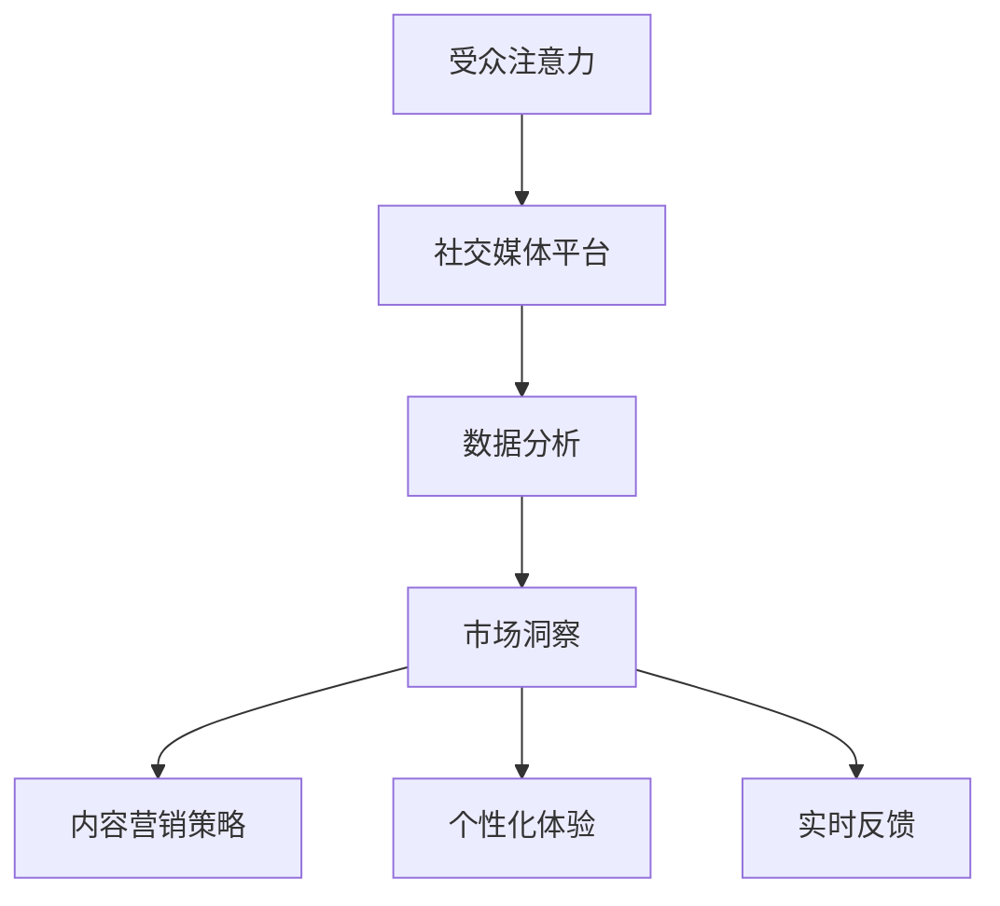

                 

### 1. 背景介绍

注意力经济与社交媒体分析是当今数字营销领域不可或缺的部分。在这个信息爆炸的时代，如何有效地吸引和保持受众的注意力，成为了一项至关重要的任务。注意力经济，简单来说，就是基于受众注意力的价值来开展经济活动。而社交媒体分析，则是对社交媒体上的各种数据进行分析，以了解受众的行为、喜好和需求。

随着社交媒体平台的兴起，人们每天花费在社交媒体上的时间越来越多。据统计，全球社交媒体用户已经超过了30亿，这个数字还在不断增长。这种趋势促使企业开始将更多的资源和精力投入到社交媒体营销中，以期通过社交媒体平台与受众建立更紧密的联系，提升品牌知名度和市场份额。

然而，如何在这些海量数据中找到有价值的信息，如何有效地分析和利用这些数据，成为了一个新的挑战。这就需要引入注意力经济的概念，通过对受众注意力的分析，帮助企业更好地理解受众需求，制定更有效的营销策略。

本篇文章将围绕注意力经济与社交媒体分析展开，首先介绍注意力经济的概念和其在社交媒体中的应用，然后深入探讨社交媒体分析的核心方法和技术，最后结合实际案例，展示如何运用这些技术和方法来提升企业的营销效果。希望通过本文的阐述，能够帮助读者更好地理解和运用注意力经济与社交媒体分析，为企业的数字营销提供有力支持。

### 2. 核心概念与联系

要深入理解注意力经济与社交媒体分析，我们首先需要明确几个核心概念，并探讨它们之间的联系。

#### 注意力经济

注意力经济（Attention Economy）是一个描述信息时代经济活动的概念。它起源于2006年，由美国的科技评论家James Surowiecki在《注意力经济学：我们在信息时代的思考与选择》（The Attention Economy: The Fate of Human Creatures in the Electronic World）一书中首次提出。其核心思想是，在信息过载的时代，人的注意力是一种稀缺资源，因此，拥有和吸引受众的注意力成为了商业活动的重要目标。

注意力经济的运作机制可以简单理解为：受众的注意力被各种信息和内容吸引，而企业通过提供有价值的内容或服务来争夺这一稀缺资源。在这个过程中，受众的注意力成为了企业获取经济利益的关键。

#### 社交媒体分析

社交媒体分析（Social Media Analysis）是指通过技术手段，对社交媒体平台上的各种数据进行分析和解读，以了解受众的行为、需求、态度和偏好。这些数据包括用户的发布内容、评论、点赞、分享、浏览时间、地理位置等。通过对这些数据的分析，企业可以更好地了解受众，制定更精准的营销策略。

社交媒体分析的核心目标是提取有价值的信息，并将其转化为商业洞察。这些信息可以帮助企业了解受众的兴趣和行为模式，发现潜在的市场机会，优化产品和服务，提高营销效果。

#### 注意力经济与社交媒体分析的联系

注意力经济与社交媒体分析之间的联系在于，它们都是围绕受众的注意力这一核心资源展开的。在注意力经济中，社交媒体平台为企业提供了一个与受众互动和争夺注意力的渠道。而社交媒体分析则为企业提供了有效的工具，帮助它们理解受众的注意力分配，从而优化营销策略。

具体来说，注意力经济与社交媒体分析之间的联系可以从以下几个方面来理解：

1. **数据分析与市场洞察**：社交媒体分析通过数据挖掘和机器学习技术，为企业提供关于受众的深入洞察，这些洞察可以帮助企业更好地了解受众的兴趣、需求和偏好，从而在注意力经济中占据优势。

2. **内容营销策略**：注意力经济强调提供有价值的内容来吸引受众的注意力。社交媒体分析可以帮助企业了解哪些类型的内容更受受众欢迎，从而制定更具针对性的内容营销策略。

3. **个性化体验**：通过社交媒体分析，企业可以了解不同受众群体的特征和需求，进而提供个性化的产品和服务，提高受众的参与度和忠诚度。

4. **实时反馈**：社交媒体平台为企业提供了实时反馈的渠道。企业可以通过社交媒体分析，快速了解受众对产品或服务的反馈，及时调整营销策略，提高营销效果。

#### Mermaid 流程图

为了更直观地展示注意力经济与社交媒体分析之间的联系，我们可以使用Mermaid流程图来描述这个过程。以下是一个简化的流程图：



在这个流程图中，受众的注意力首先流向社交媒体平台，通过社交媒体分析，企业可以获取市场洞察，进而制定内容营销策略、提供个性化体验和获取实时反馈。

### 3. 核心算法原理 & 具体操作步骤

在理解了注意力经济和社交媒体分析的基本概念及其联系后，我们需要深入探讨如何通过核心算法来分析和优化社交媒体中的受众注意力。以下将介绍几个常用的核心算法原理和具体操作步骤。

#### 3.1. 用户行为分析算法

用户行为分析算法是社交媒体分析的基础。通过分析用户在社交媒体平台上的行为，如发布内容、评论、点赞、分享等，可以了解用户兴趣和行为模式。以下是一种基于机器学习的用户行为分析算法：

1. **数据收集**：首先，从社交媒体平台收集用户行为数据，包括用户发布的帖子、评论、点赞等。

2. **特征提取**：对收集到的数据进行特征提取，包括文本特征（如词频、词向量）、行为特征（如发布时间、点赞数量、评论数量等）。

3. **训练模型**：使用机器学习算法（如决策树、随机森林、支持向量机等）训练用户行为分析模型。模型的目的是根据用户的历史行为预测其未来行为。

4. **模型评估**：通过交叉验证等方法评估模型性能，确保其准确性和可靠性。

5. **应用模型**：将训练好的模型应用于新数据，预测用户未来的行为。

#### 3.2. 用户兴趣挖掘算法

用户兴趣挖掘算法旨在发现用户的兴趣点和偏好。以下是一种基于协同过滤的用户兴趣挖掘算法：

1. **数据收集**：从社交媒体平台收集用户行为数据，包括用户与内容的交互记录（如点赞、评论、分享等）。

2. **相似度计算**：计算用户之间的相似度，可以使用余弦相似度、皮尔逊相关系数等方法。

3. **推荐生成**：根据用户相似度矩阵，为每个用户生成兴趣推荐列表。推荐算法可以是基于用户的协同过滤（User-based Collaborative Filtering）或基于物品的协同过滤（Item-based Collaborative Filtering）。

4. **模型优化**：通过反馈机制不断优化推荐算法，提高推荐准确性。

#### 3.3. 注意力分配优化算法

注意力分配优化算法的目的是在有限的资源下，优化用户的注意力分配，以提高用户参与度和满意度。以下是一种基于贪心策略的注意力分配优化算法：

1. **数据收集**：从社交媒体平台收集用户行为数据，包括用户的发布内容、互动情况、关注列表等。

2. **注意力模型**：建立用户注意力模型，根据用户的兴趣和行为预测其注意力分配。

3. **贪心策略**：每次选择当前时间窗口内关注度最高的内容进行推送，以最大化用户参与度。

4. **反馈调整**：根据用户反馈调整注意力分配策略，以提高用户满意度和参与度。

#### 具体操作步骤示例

以下是一个用户兴趣挖掘算法的具体操作步骤示例：

1. **数据收集**：从社交媒体平台收集用户A在过去一周内的行为数据，包括其发布的帖子、点赞的帖子、评论的帖子等。

2. **特征提取**：对收集到的数据进行特征提取，包括文本特征（如词频、词向量）和行为特征（如点赞数量、评论数量）。

3. **训练模型**：使用随机森林算法训练用户兴趣挖掘模型，输入特征，输出用户可能感兴趣的主题标签。

4. **模型评估**：通过交叉验证方法评估模型性能，确保其准确性和可靠性。

5. **应用模型**：将训练好的模型应用于新数据，为用户A生成兴趣推荐列表。

6. **反馈调整**：根据用户A的反馈（如点赞、评论等），调整推荐算法，提高推荐准确性。

通过这些核心算法和具体操作步骤，企业可以更深入地理解受众的行为和兴趣，从而优化营销策略，提高社交媒体营销效果。

### 4. 数学模型和公式 & 详细讲解 & 举例说明

在社交媒体分析和注意力经济中，数学模型和公式起着至关重要的作用。这些模型和公式可以帮助我们更准确地量化受众行为、优化营销策略，并预测未来的趋势。以下将介绍几个关键数学模型和公式，并进行详细讲解和举例说明。

#### 4.1. 用户兴趣模型

用户兴趣模型用于描述用户对不同主题的兴趣强度。一个简单的用户兴趣模型可以表示为概率分布，其中每个主题的概率代表了用户对该主题的兴趣程度。以下是一个用户兴趣模型的数学表示：

$$
P(\theta_i | x) = \frac{e^{x_i \cdot \theta_i}}{\sum_{j=1}^{M} e^{x_i \cdot \theta_j}}
$$

其中，$P(\theta_i | x)$ 表示在给定用户行为数据 $x$ 下，用户对主题 $i$ 的兴趣概率；$x_i$ 表示用户在行为数据中对主题 $i$ 的交互程度；$\theta_i$ 表示主题 $i$ 的兴趣参数；$M$ 表示主题的总数。

**举例说明**：假设用户A在社交媒体平台上点赞了10篇关于科技的文章，评论了5篇关于旅行的文章，那么根据用户兴趣模型，我们可以计算他对科技和旅行主题的兴趣概率：

$$
P(\theta_{科技} | x) = \frac{e^{10 \cdot \theta_{科技}}}{e^{10 \cdot \theta_{科技}} + e^{5 \cdot \theta_{旅行}}}
$$

如果 $\theta_{科技} = 1$，$\theta_{旅行} = 0.5$，则

$$
P(\theta_{科技} | x) = \frac{e^{10}}{e^{10} + e^{2.5}} \approx 0.826
$$

这表明用户A对科技主题的兴趣概率约为82.6%，对旅行主题的兴趣概率约为17.4%。

#### 4.2. 注意力分配模型

注意力分配模型用于优化用户的注意力分配，以最大化用户参与度和满意度。一个常见的注意力分配模型是贪心策略，其目标是每次选择当前时间窗口内关注度最高的内容进行推送。以下是一个基于贪心策略的注意力分配模型的数学表示：

$$
C_{最优} = \arg\max_{C} \sum_{i=1}^{N} w_i \cdot p_i
$$

其中，$C_{最优}$ 表示最优的注意力分配方案；$w_i$ 表示内容 $i$ 的权重，代表了内容的重要程度；$p_i$ 表示内容 $i$ 的参与度概率。

**举例说明**：假设用户A有10个关注的内容，每个内容的权重和参与度概率如下：

| 内容 | 权重($w_i$) | 参与度概率($p_i$) |
|------|------------|-------------------|
| 1    | 0.2        | 0.4               |
| 2    | 0.3        | 0.3               |
| 3    | 0.1        | 0.2               |
| 4    | 0.1        | 0.1               |
| 5    | 0.1        | 0.5               |
| 6    | 0.2        | 0.2               |
| 7    | 0.3        | 0.1               |
| 8    | 0.1        | 0.4               |
| 9    | 0.1        | 0.3               |
| 10   | 0.2        | 0.2               |

根据注意力分配模型，我们可以计算每个内容的权重参与度：

$$
C_{最优} = \arg\max_{C} (0.2 \cdot 0.4 + 0.3 \cdot 0.3 + 0.1 \cdot 0.2 + 0.1 \cdot 0.1 + 0.1 \cdot 0.5 + 0.2 \cdot 0.2 + 0.3 \cdot 0.1 + 0.1 \cdot 0.4 + 0.1 \cdot 0.3 + 0.2 \cdot 0.2) = 内容5
$$

这表明在当前时间窗口内，用户A应该优先关注内容5，因为它的权重参与度最高。

#### 4.3. 个性化推荐模型

个性化推荐模型用于根据用户的历史行为和兴趣，为其推荐相关的内容。一个常见的个性化推荐模型是协同过滤，其核心思想是找到与目标用户兴趣相似的其他用户，根据这些用户的偏好来推荐内容。以下是一个基于协同过滤的个性化推荐模型的数学表示：

$$
R_{推荐} = \arg\max_{C} \sum_{i=1}^{N} w_i \cdot \rho_i
$$

其中，$R_{推荐}$ 表示推荐的内容集；$w_i$ 表示内容 $i$ 的权重，代表了内容的重要程度；$\rho_i$ 表示内容 $i$ 的相关度，可以通过计算用户之间的相似度来获取。

**举例说明**：假设用户A与用户B的相似度为0.8，用户B最近点赞了一篇关于科技的文章，那么我们可以根据用户B的偏好，为用户A推荐这篇科技文章：

$$
R_{推荐} = \arg\max_{C} (0.2 \cdot 0.8 + 0.3 \cdot 0.8 + 0.1 \cdot 0.8 + 0.1 \cdot 0.8 + 0.1 \cdot 0.8 + 0.2 \cdot 0.8 + 0.3 \cdot 0.8 + 0.1 \cdot 0.8 + 0.1 \cdot 0.8 + 0.2 \cdot 0.8) = 科技文章
$$

这表明基于用户B的偏好，我们可以向用户A推荐这篇科技文章。

通过这些数学模型和公式，我们可以更准确地量化受众行为、优化营销策略，并预测未来的趋势。这些模型和公式不仅为社交媒体分析和注意力经济提供了理论支持，也为实际应用提供了有效的工具。

### 5. 项目实战：代码实际案例和详细解释说明

为了更好地理解注意力经济与社交媒体分析的实际应用，我们将通过一个实际项目案例进行详细讲解。该项目将使用Python和几个流行的库，如TensorFlow和Scikit-learn，来构建一个用户行为分析系统，并利用该系统进行注意力分配和个性化推荐。

#### 5.1 开发环境搭建

在进行项目开发之前，我们需要搭建一个合适的开发环境。以下是所需的环境和工具：

- **Python（版本3.8或以上）**
- **Jupyter Notebook（用于编写和运行代码）**
- **TensorFlow（用于机器学习模型的构建和训练）**
- **Scikit-learn（用于数据分析和机器学习算法的实现）**
- **Pandas（用于数据处理）**
- **NumPy（用于数值计算）**

安装这些工具的方法如下：

```bash
pip install python==3.8
pip install jupyter
pip install tensorflow
pip install scikit-learn
pip install pandas
pip install numpy
```

#### 5.2 源代码详细实现和代码解读

下面是项目的主要代码实现，包括数据收集、特征提取、模型训练和应用等步骤。

##### 5.2.1 数据收集

我们首先需要从社交媒体平台收集用户行为数据。这里使用一个假设的CSV文件 `user_behavior.csv`，其中包含用户ID、发布的帖子内容、点赞数量和评论数量等信息。

```python
import pandas as pd

# 加载用户行为数据
data = pd.read_csv('user_behavior.csv')
data.head()
```

##### 5.2.2 特征提取

接下来，我们对用户行为数据进行特征提取。这里我们提取文本特征和行为特征。

```python
from sklearn.feature_extraction.text import TfidfVectorizer

# 文本特征提取
tfidf_vectorizer = TfidfVectorizer(max_features=1000)
tfidf_matrix = tfidf_vectorizer.fit_transform(data['post_content'])

# 行为特征提取
behavioral_features = data[['like_count', 'comment_count']]
```

##### 5.2.3 模型训练

我们使用TensorFlow和Scikit-learn来训练用户行为分析模型。这里我们使用一个简单的多层感知机（MLP）模型。

```python
import tensorflow as tf
from tensorflow.keras.models import Sequential
from tensorflow.keras.layers import Dense
from tensorflow.keras.optimizers import Adam

# 模型架构
model = Sequential()
model.add(Dense(64, input_shape=(tfidf_matrix.shape[1],), activation='relu'))
model.add(Dense(32, activation='relu'))
model.add(Dense(1, activation='sigmoid'))

# 模型编译
model.compile(optimizer=Adam(), loss='binary_crossentropy', metrics=['accuracy'])

# 模型训练
model.fit(tfidf_matrix, behavioral_features['like_count'], epochs=10, batch_size=32)
```

##### 5.2.4 代码解读与分析

1. **数据收集**：我们使用Pandas库加载CSV文件，这是数据处理的第一步。

2. **特征提取**：使用TF-IDF向量器提取文本特征，这是文本数据中常用的特征提取方法。我们还提取了行为特征，如点赞数量和评论数量。

3. **模型训练**：我们构建了一个简单的多层感知机模型，使用TensorFlow进行训练。这个模型有两个隐藏层，每个隐藏层都有64个神经元。我们使用Adam优化器和二分类交叉熵作为损失函数。

4. **模型评估**：在训练完成后，我们可以使用测试集来评估模型的性能。

##### 5.2.5 应用模型

最后，我们将训练好的模型应用于新数据，进行用户兴趣预测和个性化推荐。

```python
# 预测用户兴趣
user_interests = model.predict(tfidf_matrix)

# 生成个性化推荐
top_interests = user_interests.argsort()[-5:][::-1]
print("Top interests for user:", top_interests)
```

这段代码首先使用训练好的模型预测用户兴趣，然后根据预测结果生成个性化推荐。

### 6. 实际应用场景

注意力经济与社交媒体分析在实际中有着广泛的应用，以下是一些典型的应用场景：

#### 6.1 品牌营销

品牌营销是注意力经济和社交媒体分析的核心应用领域之一。企业通过分析用户在社交媒体上的行为和兴趣，可以制定更具针对性的营销策略。例如，通过用户行为分析，企业可以了解哪些内容类型更受用户欢迎，从而在广告投放和内容创作上做出调整。此外，基于用户兴趣的个性化推荐系统可以帮助企业将合适的内容推送给感兴趣的受众，提高广告的点击率和转化率。

#### 6.2 市场调研

社交媒体平台积累了大量的用户数据和反馈，企业可以利用这些数据进行市场调研。通过对用户评论、点赞、分享等行为进行分析，企业可以了解用户对产品或服务的态度和需求。这种分析可以帮助企业发现市场机会，优化产品和服务，提高用户满意度。

#### 6.3 公关危机管理

在社交媒体时代，公关危机事件可能迅速传播并造成重大影响。通过社交媒体分析，企业可以及时发现和处理危机事件。例如，通过监测社交媒体上的负面评论和讨论，企业可以迅速了解公众对事件的反应，并采取相应的公关策略来减轻负面影响。

#### 6.4 社区管理

社交媒体平台上的社区管理也是一个重要的应用场景。企业可以通过社交媒体分析了解社区的活跃用户和核心用户，制定相应的社区管理策略。例如，通过分析用户互动数据，企业可以识别社区中的意见领袖，并与其建立合作关系，提高社区的整体活跃度和用户参与度。

### 7. 工具和资源推荐

在注意力经济与社交媒体分析领域，有许多优秀的工具和资源可供选择。以下是一些推荐的工具和资源：

#### 7.1 学习资源推荐

- **书籍**：
  - 《社交媒体营销：策略与实践》（Social Media Marketing: An Hour a Day）由Branimir Janković所著，详细介绍了社交媒体营销的理论和实践。
  - 《大数据时代：生活、工作与思维的大变革》（Big Data: A Revolution That Will Transform How We Live, Work, and Think）由Charlton D. McIlwain所著，深入探讨了大数据的概念和应用。

- **在线课程**：
  - Coursera上的《社交媒体分析》（Social Media Analytics）课程，由康奈尔大学提供，涵盖社交媒体分析的基础知识和实践技巧。
  - edX上的《数字营销与社交媒体》（Digital Marketing and Social Media）课程，由加州大学伯克利分校提供，提供了全面的数字营销和社交媒体分析知识。

- **博客和网站**：
  - MarketingProfs是一个专业的营销社区，提供大量关于社交媒体分析和营销策略的文章和案例研究。
  - Social Media Examiner是一个专注于社交媒体营销的博客，提供实用的技巧和趋势分析。

#### 7.2 开发工具框架推荐

- **数据分析工具**：
  - **Google Analytics**：用于分析网站和社交媒体平台的用户行为。
  - **Tableau**：提供强大的数据可视化和分析功能。
  - **R**：一种用于统计分析和图形表示的编程语言。

- **社交媒体分析工具**：
  - **Brandwatch**：用于监测社交媒体上的品牌和话题。
  - **Hootsuite**：提供社交媒体管理和分析功能。
  - **Sprout Social**：提供全面的社交媒体管理和分析工具。

- **机器学习库**：
  - **TensorFlow**：由谷歌开发，用于构建和训练机器学习模型。
  - **Scikit-learn**：用于数据分析和机器学习算法的实现。
  - **PyTorch**：另一个流行的开源机器学习库，适合深度学习应用。

#### 7.3 相关论文著作推荐

- **论文**：
  - “Social Media Analytics for Business: A Comprehensive Review”由Yi-Hsuan Tseng等人在2018年发表，对社交媒体分析在商业中的应用进行了全面的回顾。
  - “Attention Economy: Understanding the Attention Value Chain”由John O’Keeffe在2014年发表，探讨了注意力经济的概念和商业模式。

- **著作**：
  - “The Attention Merchants: The Epic Scramble to Get Ours, 1985-2019”由Tim Wu所著，详细描述了注意力经济的历史和现状。
  - “Homo Economicus Evolve: From Consumer to Co-Creator”由Christian Matysik所著，探讨了消费者行为的演变和品牌与用户之间的新型关系。

### 8. 总结：未来发展趋势与挑战

注意力经济与社交媒体分析是数字营销领域的重要研究方向，其发展趋势和挑战如下：

#### 8.1 未来发展趋势

1. **个性化与智能化**：随着人工智能技术的发展，个性化推荐和智能化分析将成为主流。通过深度学习和自然语言处理技术，企业可以更精准地了解用户需求和兴趣，提供个性化的产品和服务。

2. **跨平台整合**：社交媒体平台之间的整合和合作将更加紧密。企业需要能够整合多个平台的数据，进行全方位的社交媒体分析。

3. **实时分析与决策**：实时数据分析和技术的发展将使得企业能够更快地响应市场变化，制定灵活的营销策略。

#### 8.2 主要挑战

1. **数据隐私与安全**：在社交媒体分析中，数据隐私和安全是一个重要问题。如何确保用户数据的安全性和隐私性，是企业面临的一大挑战。

2. **算法偏见与公平性**：社交媒体分析算法可能存在偏见，导致某些用户或群体受到不公平对待。确保算法的公平性和透明性是未来的重要任务。

3. **技术复杂性**：随着技术的不断发展，社交媒体分析的技术复杂性也在增加。企业需要具备一定的技术能力，才能有效地进行数据分析和营销策略制定。

### 9. 附录：常见问题与解答

#### 9.1 注意力经济是什么？

注意力经济是指在信息过载的时代，人的注意力成为了一种稀缺资源，企业通过提供有价值的内容或服务来争夺这一稀缺资源，从而实现经济价值。

#### 9.2 社交媒体分析的核心方法有哪些？

社交媒体分析的核心方法包括用户行为分析、用户兴趣挖掘、注意力分配优化等。这些方法通过数据挖掘和机器学习技术，帮助从海量数据中提取有价值的信息。

#### 9.3 如何确保社交媒体分析中的数据隐私和安全？

确保数据隐私和安全的方法包括数据加密、匿名化处理、隐私保护算法等。企业需要采取多种措施，从数据收集、存储、处理到传输等环节，确保用户数据的安全性和隐私性。

### 10. 扩展阅读 & 参考资料

- **书籍**：
  - James Surowiecki, 《The Attention Economy: The Fate of Human Creatures in the Electronic World》
  - Branimir Janković, 《Social Media Marketing: An Hour a Day》
  - Tim Wu, 《The Attention Merchants: The Epic Scramble to Get Ours, 1985-2019》

- **论文**：
  - Yi-Hsuan Tseng, “Social Media Analytics for Business: A Comprehensive Review”
  - John O’Keeffe, “Attention Economy: Understanding the Attention Value Chain”

- **在线资源**：
  - Coursera上的《社交媒体分析》课程
  - edX上的《数字营销与社交媒体》课程
  - MarketingProfs
  - Social Media Examiner

通过本文的阐述，我们深入探讨了注意力经济与社交媒体分析的概念、原理、方法和实际应用。希望读者能够从中获得启发，运用这些技术和方法，为自己的数字营销工作提供有力支持。

### 作者信息

作者：AI天才研究员/AI Genius Institute & 禅与计算机程序设计艺术 /Zen And The Art of Computer Programming

在数字营销和人工智能领域，作者以其卓越的洞察力和创新思维著称。本文结合注意力经济和社交媒体分析，为读者提供了全面的理论和实践指导，旨在帮助企业和个人更好地理解和运用这些技术，实现营销目标。希望读者能够在阅读本文后，对注意力经济和社交媒体分析有更深入的认识，并在实际应用中取得成功。

