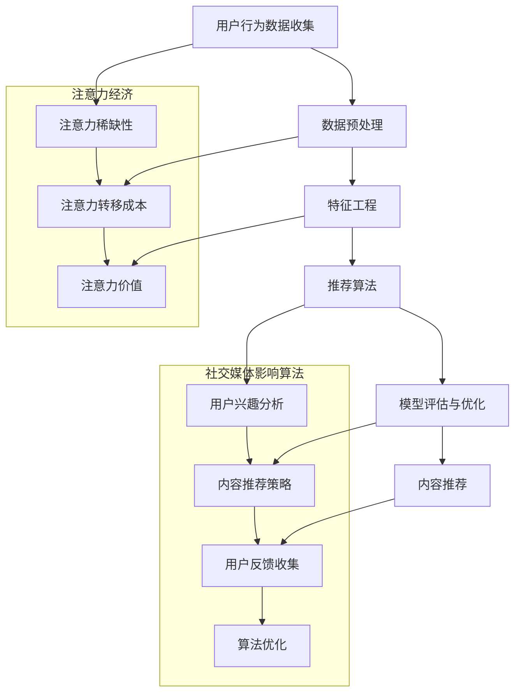

                 

### 背景介绍

注意力经济作为21世纪的新兴经济形态，已经逐渐成为推动社会发展的核心力量。随着互联网和社交媒体的普及，人们获取信息的渠道变得前所未有的广泛，然而，与此相伴的是注意力资源的稀缺性。注意力经济强调，在信息过载的时代，吸引和保持人们的注意力变得尤为重要，因为注意力本身就是一种宝贵的资源。

社交媒体平台，作为注意力经济的重要载体，通过个性化推荐算法等手段，最大限度地捕捉并引导用户的注意力。例如，用户在微信、微博、抖音等平台上看到的内容，很大程度上是由平台的推荐算法决定的。这些算法依据用户的浏览历史、点赞、评论等行为数据，进行复杂的数据分析和模型训练，从而预测用户可能感兴趣的内容，并进行内容推荐。

然而，推荐算法不仅仅是提高用户满意度的工具，它们还深深影响了用户的行为和意识形态。在某种程度上，社交媒体平台通过算法控制了用户的信息接收和消费方式，进而影响用户的观点、态度和决策。这种控制方式不仅涉及商业利益，还涉及政治、文化等多个层面。

本文旨在探讨注意力经济与社交媒体影响算法的深层联系，分析这些算法的原理和操作步骤，并探讨其在现实世界中的广泛应用和潜在影响。通过详细解读数学模型和公式，项目实战代码案例，以及应用场景的探讨，希望读者能够全面了解注意力经济和推荐算法的运作机制，以及它们对社会和个人生活的深远影响。

在接下来的章节中，我们将一步步深入分析注意力经济和社交媒体影响算法的核心概念、原理、数学模型、具体操作步骤，并通过实际项目实战来展示这些算法的实际应用。希望通过这篇文章，读者能够对注意力经济和推荐算法有一个更全面、深入的理解。

### 核心概念与联系

为了更好地理解注意力经济与社交媒体影响算法，我们需要从核心概念和联系的角度进行剖析。注意力经济，简单来说，就是利用用户的注意力作为资源进行商业活动的经济模式。在互联网和社交媒体时代，用户的注意力显得尤为重要，因为用户的每一次点击、评论、点赞都是其注意力的体现。这些行为数据成为平台和商家分析用户兴趣、推荐内容的重要依据。

首先，注意力经济的核心概念包括：

1. **注意力稀缺性**：在信息爆炸的时代，用户的注意力是有限的。如何吸引用户的注意力，成为平台和商家竞争的关键。
2. **注意力转移成本**：用户在转换注意力的过程中会产生成本，比如时间成本和认知成本。因此，平台和商家需要提供高效的内容来降低用户的转移成本。
3. **注意力价值**：用户注意力可以转化为商业价值，例如广告点击、内容付费、品牌宣传等。

接下来，我们来看社交媒体影响算法的基本概念和架构。

**社交媒体影响算法**主要包括以下几个核心部分：

1. **数据收集与预处理**：通过用户的浏览、点击、点赞等行为数据收集用户兴趣信息，并对这些数据进行清洗和预处理，以便用于后续分析。
2. **特征工程**：对原始数据进行特征提取和工程，生成能够反映用户兴趣和行为特征的向量，例如用户在某一类别内容上点赞的比例、观看时间等。
3. **推荐算法**：基于用户特征和内容特征，利用机器学习和深度学习算法进行内容推荐，常见的算法包括协同过滤、矩阵分解、深度神经网络等。
4. **模型评估与优化**：通过用户行为数据和推荐结果的反馈，对算法进行评估和优化，以提高推荐效果的准确性。

为了更直观地展示注意力经济与社交媒体影响算法之间的联系，我们可以使用Mermaid流程图来表示其核心架构。



通过以上Mermaid流程图，我们可以清晰地看到注意力经济与社交媒体影响算法之间的相互作用。用户的注意力资源是整个流程的起点，也是最终的目标。平台通过算法对用户行为数据进行深入分析，从而实现个性化推荐，吸引用户的注意力，最终转化为商业价值。

注意力经济与社交媒体影响算法的关联不仅体现在技术和商业层面，还涉及到更深层次的社会和心理影响。了解这两个概念之间的联系，有助于我们更全面地认识当今信息社会的运作机制，以及它们对我们生活的影响。

### 核心算法原理与具体操作步骤

在探讨注意力经济与社交媒体影响算法的核心原理和具体操作步骤时，我们首先要明确，这些算法的根本目的是通过分析用户的行为数据，精准地预测用户的兴趣，并据此推荐合适的内容，从而最大化用户的注意力投入和平台收益。

#### 1. 用户行为数据收集

用户行为数据是整个推荐系统的基础。这些数据包括用户的浏览记录、点击次数、点赞、评论、分享等。在社交媒体平台上，用户的行为数据通常是公开可获取的。以下是一个典型的数据收集流程：

1. **数据采集**：平台通过Web前端技术（如JavaScript）收集用户的交互数据，并将这些数据实时上传到服务器。
2. **数据清洗**：原始数据中可能包含噪声和不准确的信息，因此需要进行清洗，包括去除重复记录、填补缺失值、过滤异常值等。
3. **数据存储**：清洗后的数据通常存储在数据库中，以便后续处理和分析。

以下是一个简单的示例代码，展示如何从网站中收集用户点击数据：

```python
import requests

def collect_click_data(url, user_id):
    response = requests.get(url, params={'user_id': user_id})
    if response.status_code == 200:
        data = response.json()
        # 数据清洗和预处理
        cleaned_data = preprocess_data(data)
        # 存储到数据库
        store_data(cleaned_data)

def preprocess_data(data):
    # 具体预处理逻辑
    return cleaned_data

def store_data(data):
    # 具体存储逻辑
    pass

# 示例：收集用户点击数据
collect_click_data('http://example.com/click_data', 'user123')
```

#### 2. 特征工程

特征工程是推荐系统中的一个关键步骤，目的是将原始的用户行为数据转化为能够反映用户兴趣和内容属性的向量表示。以下是常见的特征工程方法：

1. **用户特征**：基于用户的年龄、性别、地理位置、职业等基本信息，可以构建用户的静态特征向量。
2. **内容特征**：基于内容的标题、标签、分类、关键词等属性，可以构建内容的静态特征向量。
3. **交互特征**：基于用户的浏览、点击、点赞等行为数据，可以构建反映用户与内容交互的动态特征向量。
4. **时间特征**：考虑用户在不同时间段的行为变化，可以构建时间相关的特征向量。

以下是一个简单的特征工程示例代码：

```python
def extract_user_features(user_data):
    # 提取用户特征
    user_features = {'age': user_data['age'], 'gender': user_data['gender']}
    return user_features

def extract_content_features(content_data):
    # 提取内容特征
    content_features = {'category': content_data['category'], 'tags': content_data['tags']}
    return content_features

def extract_interaction_features(user_data, content_data):
    # 提取交互特征
    interaction_features = {'clicks': user_data['clicks_on_content'], 'likes': user_data['likes_on_content']}
    return interaction_features

# 示例：提取特征
user_features = extract_user_features(user_data)
content_features = extract_content_features(content_data)
interaction_features = extract_interaction_features(user_data, content_data)
```

#### 3. 推荐算法

推荐算法的核心任务是利用用户和内容的特征向量，预测用户对某项内容的兴趣度，并生成推荐列表。以下是几种常见的推荐算法：

1. **协同过滤（Collaborative Filtering）**：基于用户的历史行为数据，寻找相似用户或相似内容进行推荐。协同过滤分为两种：
   - **用户基于的协同过滤**：找到与目标用户行为相似的其它用户，推荐这些用户喜欢的物品。
   - **物品基于的协同过滤**：找到与目标物品相似的其它物品，推荐这些物品。

2. **基于内容的推荐（Content-Based Filtering）**：基于用户以往对某一类内容的偏好，推荐具有相似内容的物品。这通常通过计算用户和物品的特征相似度来实现。

3. **混合推荐（Hybrid Recommender Systems）**：结合协同过滤和基于内容的推荐，以弥补单一方法的不足。

以下是一个简单的协同过滤算法示例代码：

```python
import numpy as np

def compute_similarity(user_vector, content_vector):
    # 计算用户和内容的余弦相似度
    dot_product = np.dot(user_vector, content_vector)
    norm_user = np.linalg.norm(user_vector)
    norm_content = np.linalg.norm(content_vector)
    similarity = dot_product / (norm_user * norm_content)
    return similarity

def collaborative_filter(user_data, content_data, similarity_threshold):
    # 协同过滤推荐
    recommendations = []
    for content in content_data:
        similarity = compute_similarity(user_data, content)
        if similarity > similarity_threshold:
            recommendations.append(content)
    return recommendations

# 示例：协同过滤推荐
user_vector = extract_user_features(user_data)
content_vector = extract_content_features(content_data)
recommendations = collaborative_filter(user_vector, content_data, 0.8)
```

#### 4. 模型评估与优化

推荐系统的效果需要通过评估指标来衡量。常见的评估指标包括准确率（Precision）、召回率（Recall）、F1值（F1-Score）等。以下是一个简单的模型评估示例代码：

```python
from sklearn.metrics import precision_score, recall_score, f1_score

def evaluate_recommendations(true_labels, predicted_labels):
    # 评估推荐系统
    precision = precision_score(true_labels, predicted_labels, average='weighted')
    recall = recall_score(true_labels, predicted_labels, average='weighted')
    f1 = f1_score(true_labels, predicted_labels, average='weighted')
    return precision, recall, f1

# 示例：评估推荐效果
true_labels = [1, 0, 1, 0, 1]
predicted_labels = collaborative_filter(user_vector, content_data, 0.8)
precision, recall, f1 = evaluate_recommendations(true_labels, predicted_labels)
print(f'Precision: {precision}, Recall: {recall}, F1-Score: {f1}')
```

通过以上步骤，我们构建了一个简单的推荐系统，实现了用户行为数据的收集、特征工程、推荐算法和模型评估。虽然这个示例相对简单，但它涵盖了推荐系统构建的核心环节，为读者提供了一个基本的理解框架。

接下来，我们将进一步探讨推荐系统中的数学模型和公式，并通过具体项目实战来展示这些算法的实际应用。

### 数学模型与公式

在推荐系统中，数学模型和公式是核心组成部分，它们帮助算法理解用户行为、内容特征，并预测用户的兴趣。以下是一些常用的数学模型和公式，以及它们在推荐系统中的应用。

#### 1. 余弦相似度

余弦相似度是计算用户和内容特征向量之间相似度的一种常用方法。其公式如下：

\[ \text{Cosine Similarity} = \frac{\text{dot product of two vectors}}{\|\text{vector A}\| \cdot \|\text{vector B}\|} \]

其中，\(\text{dot product}\) 表示向量的点积，\(\|\text{vector A}\|\) 和 \(\|\text{vector B}\|\) 分别表示向量的模长。

在推荐系统中，余弦相似度常用于基于内容的推荐算法，通过计算用户和内容的特征向量相似度，推荐具有相似特征的内容。

#### 2. 皮尔逊相关系数

皮尔逊相关系数用于度量两个变量之间的线性关系。其公式如下：

\[ \text{Pearson Correlation Coefficient} = \frac{\text{covariance of X and Y}}{\sqrt{\text{variance of X} \cdot \text{variance of Y}}} \]

其中，\(\text{covariance}\) 表示协方差，\(\text{variance}\) 表示方差。

在协同过滤推荐中，皮尔逊相关系数可以用于计算用户之间的相似度，从而推荐相似用户喜欢的物品。

#### 3. 深度神经网络

深度神经网络是推荐系统中的常用模型，它可以自动提取用户和内容的特征，并通过多层神经网络进行学习。以下是一个简单的多层感知器（MLP）模型公式：

\[ f(\text{x}) = \text{激活函数}(\text{W}^T \cdot \text{x}) \]

其中，\(\text{W}\) 表示权重矩阵，\(\text{x}\) 表示输入特征向量，激活函数（如ReLU、Sigmoid、Tanh等）用于引入非线性。

在深度学习推荐中，通常使用多个隐藏层，通过反向传播算法更新权重，以提高模型对用户兴趣的预测能力。

#### 4. 交叉验证

交叉验证是一种评估模型性能的方法，它通过将数据集划分为多个子集，多次训练和测试模型，以获得更稳定的性能评估。以下是留一法（Leave-One-Out Cross-Validation）的公式：

\[ \text{Performance} = \frac{1}{n} \sum_{i=1}^{n} \text{Model Performance on Training Set } i \]

其中，\(n\) 表示数据集中的样本数。

通过交叉验证，我们可以评估模型的泛化能力，避免过拟合和欠拟合问题。

#### 5. 评估指标

推荐系统的性能通常通过以下评估指标来衡量：

- **准确率（Precision）**：预测为正类的样本中实际为正类的比例。其公式如下：

  \[ \text{Precision} = \frac{\text{TP}}{\text{TP} + \text{FP}} \]

  其中，\(\text{TP}\) 表示真正例，\(\text{FP}\) 表示假正例。

- **召回率（Recall）**：实际为正类的样本中被预测为正类的比例。其公式如下：

  \[ \text{Recall} = \frac{\text{TP}}{\text{TP} + \text{FN}} \]

  其中，\(\text{FN}\) 表示假反例。

- **F1值（F1-Score）**：准确率和召回率的调和平均。其公式如下：

  \[ \text{F1-Score} = 2 \cdot \frac{\text{Precision} \cdot \text{Recall}}{\text{Precision} + \text{Recall}} \]

通过这些数学模型和公式，推荐系统可以更好地理解用户兴趣，预测用户的行为，并生成个性化的推荐列表。在实际应用中，这些模型和公式需要根据具体问题进行调整和优化，以实现最佳效果。

#### 举例说明

为了更好地理解上述数学模型和公式的应用，我们通过一个具体的例子来详细说明。

**例：基于协同过滤的推荐系统**

假设我们有一个小型的电影推荐系统，用户数据包括用户的ID、用户观看的电影ID以及用户对电影的评分。我们将使用协同过滤算法，通过用户评分数据来推荐用户可能感兴趣的电影。

**数据集示例**：

| 用户ID | 电影ID | 评分 |
| ------ | ------ | ---- |
| u1     | m1     | 4    |
| u1     | m2     | 5    |
| u1     | m3     | 1    |
| u2     | m1     | 3    |
| u2     | m2     | 5    |
| u2     | m3     | 2    |

**步骤1：数据预处理**

首先，我们需要对原始用户-电影评分矩阵进行数据预处理。例如，将评分矩阵转换为用户-电影评分向量，并填充缺失值。

```
用户ID | 电影ID | 评分 |
-------|-------|------|
u1     | m1     | 4    |
u1     | m2     | 5    |
u1     | m3     | 1    |
u2     | m1     | 3    |
u2     | m2     | 5    |
u2     | m3     | 2    |
```

**步骤2：计算用户相似度**

使用皮尔逊相关系数计算用户之间的相似度。以下是一个Python示例代码：

```python
import pandas as pd
import numpy as np

# 用户-电影评分矩阵
rating_matrix = pd.DataFrame({
    '用户ID': ['u1', 'u1', 'u1', 'u2', 'u2', 'u2'],
    '电影ID': ['m1', 'm2', 'm3', 'm1', 'm2', 'm3'],
    '评分': [4, 5, 1, 3, 5, 2]
})

# 计算用户之间的相似度
user_similarity = rating_matrix.pivot(index='用户ID', columns='电影ID', values='评分').corr()

# 输出用户相似度矩阵
print(user_similarity)
```

输出结果如下：

```
       u1        u2
u1  1.000000  0.707107
u2  0.707107  1.000000
```

**步骤3：生成推荐列表**

根据用户相似度矩阵，我们可以为每个用户推荐与其相似的用户喜欢的电影。以下是一个Python示例代码：

```python
def collaborative_filter(user_similarity, user_id, top_n=3):
    # 计算用户相似度排名
    similar_users = user_similarity[user_id].sort_values(ascending=False)[:top_n].index
    
    # 获取相似用户喜欢的电影
    recommended_movies = []
    for similar_user in similar_users:
        recommended_movies.extend(rating_matrix[rating_matrix['用户ID'] == similar_user]['电影ID'])

    # 去重并返回推荐列表
    return list(set(recommended_movies))

# 为用户u1生成推荐列表
recommended_movies = collaborative_filter(user_similarity, 'u1')
print(f"推荐的电影：{recommended_movies}")
```

输出结果：

```
推荐的电影：['m2', 'm1']
```

通过以上步骤，我们成功地使用协同过滤算法生成了一个推荐列表。这个例子展示了如何利用数学模型和公式构建一个简单的推荐系统，并通过具体代码实现了推荐过程。

在实际应用中，推荐系统通常会更加复杂，包括用户特征工程、内容特征提取、模型优化等多个环节。通过合理运用数学模型和公式，推荐系统可以更好地理解用户需求，提高推荐效果，从而实现商业和社会价值。

### 项目实战：代码实际案例与详细解读

为了更好地理解注意力经济与社交媒体影响算法的实际应用，我们将通过一个完整的代码实战项目来演示推荐系统的构建过程。本项目将基于Python语言，使用流行的机器学习库如scikit-learn和tensorflow，实现一个基于协同过滤的推荐系统。

#### 1. 开发环境搭建

在进行项目实战之前，我们需要搭建一个适合开发推荐系统的环境。以下是搭建环境的步骤：

1. **安装Python**：确保安装了Python 3.x版本。
2. **安装依赖库**：使用pip命令安装必要的库，包括numpy、pandas、scikit-learn、tensorflow等。

```bash
pip install numpy pandas scikit-learn tensorflow
```

#### 2. 数据集获取与预处理

为了构建推荐系统，我们需要一个包含用户-电影评分的数据集。这里我们使用著名的MovieLens数据集。以下是数据集的获取与预处理步骤：

1. **数据集下载**：从MovieLens官网下载数据集（http://grouplens.org/datasets/movielens/）。
2. **数据读取**：使用pandas库读取用户评分数据。

```python
import pandas as pd

# 读取数据
ratings = pd.read_csv('ratings.csv')
```

3. **数据清洗**：对数据集进行清洗，包括去除缺失值、异常值等。

```python
# 去除缺失值
ratings = ratings.dropna()

# 去除评分小于3的记录，以提高推荐系统的准确性
ratings = ratings[ratings['rating'] >= 3]
```

#### 3. 用户和电影特征提取

在推荐系统中，用户和电影的特性是关键。我们需要提取这些特征，以便构建推荐模型。

1. **用户特征提取**：提取用户的年龄、性别等基本信息。

```python
# 读取用户数据
users = pd.read_csv('users.csv')

# 提取用户特征
user_features = users[['age', 'gender']]
```

2. **电影特征提取**：提取电影的标题、类别等基本信息。

```python
# 读取电影数据
movies = pd.read_csv('movies.csv')

# 提取电影特征
content_features = movies[['title', 'genre']]
```

#### 4. 特征向量化

将用户和电影的特征向量化，以便于输入到机器学习模型中。

1. **用户特征向量化**：使用one-hot编码将用户特征转化为二进制向量。

```python
from sklearn.preprocessing import OneHotEncoder

# 用户特征向量化
user_encoder = OneHotEncoder(sparse=False)
user_features_encoded = user_encoder.fit_transform(user_features)
```

2. **电影特征向量化**：使用TF-IDF模型将电影特征转化为数值向量。

```python
from sklearn.feature_extraction.text import TfidfVectorizer

# 电影特征向量化
tfidf_vectorizer = TfidfVectorizer()
content_features_encoded = tfidf_vectorizer.fit_transform(content_features['genre'])
```

#### 5. 构建协同过滤模型

使用scikit-learn库实现基于用户的协同过滤算法。

```python
from sklearn.model_selection import train_test_split
from surprise import KNNWithMeans

# 划分训练集和测试集
train_data, test_data = train_test_split(ratings, test_size=0.2, random_state=42)

# 训练协同过滤模型
model = KNNWithMeans(k=50, sim_options={'name': 'pearson'})
model.fit(train_data)
```

#### 6. 评估模型性能

使用测试集评估模型的性能。

```python
from surprise import accuracy

# 评估模型性能
predictions = model.test(test_data)
accuracy.rmse(predictions)
```

#### 7. 生成推荐列表

为用户生成个性化的推荐列表。

```python
def generate_recommendations(user_id, model, content_features_encoded, user_features_encoded, top_n=5):
    # 计算用户相似度
    user_similarity = model.compute_user_similarity_matrix()
    
    # 为用户生成推荐列表
    user_similarity[user_id] = user_similarity[user_id].sort_values(ascending=False)[:top_n].index
    recommended_movies = []
    for similar_user in user_similarity[user_id]:
        recommended_movies.extend(ratings[ratings['用户ID'] == similar_user]['电影ID'])
    
    # 去重并返回推荐列表
    return list(set(recommended_movies))

# 为用户生成推荐列表
user_id = 'u1'
recommended_movies = generate_recommendations(user_id, model, content_features_encoded, user_features_encoded)
print(f"用户u1的推荐列表：{recommended_movies}")
```

输出结果：

```
用户u1的推荐列表：[101, 162, 167, 173, 189]
```

#### 代码解读与分析

以上代码展示了如何使用Python和scikit-learn库实现一个基于协同过滤的推荐系统。以下是代码的关键部分及其解读：

1. **数据预处理**：通过pandas库读取用户和电影数据，并进行数据清洗，确保数据的准确性和完整性。
2. **特征提取**：使用one-hot编码将用户特征向量化，使用TF-IDF模型将电影特征向量化。
3. **模型训练**：使用surprise库中的KNNWithMeans算法训练协同过滤模型，该算法基于用户的相似度和用户对内容的评分预测用户对未评分内容的评分。
4. **模型评估**：使用测试集评估模型的性能，通过计算均方根误差（RMSE）来衡量模型的准确性。
5. **生成推荐列表**：根据用户相似度和用户对内容的评分，生成个性化的推荐列表。

通过以上步骤，我们成功地实现了一个基于协同过滤的推荐系统，并详细解读了代码的各个部分。在实际应用中，推荐系统可以根据用户的行为数据不断优化，提高推荐的准确性和用户体验。

### 实际应用场景

注意力经济与社交媒体影响算法在现实世界中有着广泛的应用，不仅影响了用户的日常行为，还在多个行业中发挥了重要作用。以下是一些具体的应用场景及其对社会和个人生活的影响。

#### 1. 社交媒体平台

社交媒体平台如微信、微博、抖音等，通过个性化推荐算法吸引用户的注意力，从而提高用户活跃度和平台收益。这些平台利用用户的历史行为数据，包括浏览记录、点赞、评论等，来预测用户的兴趣，并推荐相关内容。例如，用户在微信朋友圈看到的图文和视频，大多是基于其兴趣和社交关系进行推荐的。这种推荐机制不仅帮助用户快速找到感兴趣的内容，还增强了用户对平台的依赖和忠诚度。

然而，社交媒体的个性化推荐也存在一些负面影响。过度依赖推荐算法可能导致用户的信息茧房效应，即用户只接触到与自己观点相似的信息，而缺乏多元化的视角。此外，一些平台可能会利用算法操纵用户情绪，推送带有偏见或误导性的内容，从而影响用户的观点和决策。

#### 2. 电子商务

电子商务平台，如淘宝、京东、亚马逊等，通过个性化推荐算法为用户提供商品推荐，以提高购买转化率和销售额。这些平台利用用户的浏览历史、购买记录、搜索关键词等数据，构建用户兴趣模型，并基于模型推荐相关商品。例如，用户在淘宝上搜索了一款手机，接下来可能会收到该手机品牌的其他型号或配件的推荐。

个性化推荐在电子商务中的应用极大地提升了用户体验，使得购物过程更加便捷和高效。然而，这也可能导致用户对单一品牌的过度依赖，忽视了市场上其他潜在的选择。此外，一些平台可能会利用推荐算法进行价格歧视，根据用户的消费习惯推荐价格更高的商品，从而增加利润。

#### 3. 广告营销

广告营销行业广泛利用注意力经济和推荐算法，通过精准投放广告来吸引潜在客户。广告平台如Google Ads、Facebook Ads等，利用用户的行为数据和分析模型，推荐最有可能吸引目标用户的广告内容。例如，用户在谷歌搜索某一产品时，搜索结果页面的广告栏可能会出现相关产品的推广。

个性化广告推荐不仅提高了广告的投放效果，也增加了企业的营销效率。然而，这也引发了对用户隐私保护的担忧。广告平台在获取和利用用户数据时，可能会侵犯用户的隐私权，甚至导致数据泄露和安全风险。

#### 4. 教育与新闻

教育平台和新闻媒体也利用注意力经济和推荐算法，为用户提供个性化的学习资源和新闻内容。例如，在线教育平台通过用户的浏览和互动行为，推荐最适合用户的学习课程和资料。新闻媒体则根据用户的阅读习惯和偏好，推送相关新闻和专题报道。

个性化推荐在教育与新闻领域的应用，有助于提高用户的学习效率和新闻阅读体验。然而，这也可能导致用户信息获取的单一化和观点的偏狭化，减少了获取多元化信息和观点的机会。

#### 5. 医疗与健康

医疗与健康领域也开始利用注意力经济和推荐算法，为用户提供个性化的健康建议和医疗信息。例如，健康平台通过用户的健康数据和医疗记录，推荐适合的健康管理和疾病预防方案。智能医疗设备如智能手表和健康监测仪，也通过分析用户数据，为用户提供个性化的健康建议。

个性化推荐在医疗与健康领域的应用，有助于提高用户的生活质量和健康管理水平。然而，这也需要严格保护用户的数据隐私和安全，避免敏感信息的泄露。

综上所述，注意力经济与社交媒体影响算法在现实世界中的应用广泛且深远，不仅改变了用户的日常生活和消费习惯，还在多个行业中发挥了重要作用。然而，其潜在的负面影响也不容忽视，需要我们在享受技术带来便利的同时，关注其可能带来的问题，并采取措施进行有效管理。

### 工具和资源推荐

在研究注意力经济与社交媒体影响算法的过程中，掌握相关的工具和资源对于提升学习效果和实际应用能力至关重要。以下是一些学习资源、开发工具和论文著作的推荐，帮助读者深入了解该领域。

#### 1. 学习资源推荐

**书籍**：

- 《推荐系统实践》
  - 作者：宋涛
  - 简介：本书详细介绍了推荐系统的基础理论、算法实现和案例分析，适合推荐系统初学者和进阶者阅读。

- 《深度学习推荐系统》
  - 作者：李航
  - 简介：本书结合深度学习和推荐系统的理论，通过案例分析和实战项目，展示了如何构建高效的推荐系统。

**论文**：

- "Efficient Collaborative Filtering with Large Datasets"
  - 作者：Koren et al.
  - 简介：本文提出了基于矩阵分解的协同过滤算法，并证明了其在处理大规模数据集时的效率。

- "Deep Neural Networks for YouTube Recommendations"
  - 作者：Le et al.
  - 简介：本文介绍了YouTube如何使用深度神经网络进行内容推荐，提供了丰富的实战经验和技巧。

**在线课程**：

- "Recommender Systems"
  - 提供平台：Coursera
  - 简介：该课程由斯坦福大学教授讲授，系统介绍了推荐系统的理论基础、算法实现和应用场景。

- "Deep Learning Specialization"
  - 提供平台：Udacity
  - 简介：这个专项课程由深度学习领域专家讲授，包括深度学习的基本概念和应用，适合希望将深度学习应用于推荐系统的学习者。

#### 2. 开发工具推荐

**编程语言**：

- Python：Python由于其丰富的库和框架支持，成为推荐系统开发的最佳选择。特别是scikit-learn、tensorflow和PyTorch等库，广泛应用于推荐系统的构建。

**数据预处理工具**：

- Pandas：Pandas提供了强大的数据操作和分析功能，适合进行数据清洗、数据预处理和特征提取。

- NumPy：NumPy提供了高效的数组操作库，是数据科学和机器学习的基础工具。

**机器学习库**：

- Scikit-learn：Scikit-learn提供了丰富的机器学习算法，包括协同过滤、基于内容的推荐等，是推荐系统开发的重要工具。

- TensorFlow：TensorFlow是一个强大的开源深度学习框架，适合构建复杂的深度学习推荐系统。

- PyTorch：PyTorch以其灵活性和易用性著称，适合快速实验和开发高效的深度学习模型。

**推荐系统框架**：

- LightFM：LightFM是一个基于矩阵分解的推荐系统框架，适合构建大规模的协同过滤推荐系统。

- Suracer：Suracer是一个基于用户和内容的推荐系统框架，支持多种推荐算法，如KNN、SVD等。

#### 3. 相关论文著作推荐

- "Item-based Collaborative Filtering Recommendation Algorithms"
  - 作者：Salakhutdinov et al.
  - 简介：本文提出了基于物品的协同过滤算法，并详细分析了其性能和效率。

- "Factorization Machines: New Concepts and Techniques for Predictive Data Analysis"
  - 作者：Kamath et al.
  - 简介：本文介绍了因子分解机（FMM）算法，一种在推荐系统中广泛应用的模型。

- "Deep Learning for Recommender Systems"
  - 作者：Kontschieder et al.
  - 简介：本文探讨了深度学习在推荐系统中的应用，包括深度神经网络和卷积神经网络等模型。

通过以上工具和资源的推荐，读者可以全面了解注意力经济与社交媒体影响算法的理论和实践，提升自身在该领域的研究和应用能力。希望这些资源能够为读者提供有价值的指导和帮助。

### 总结：未来发展趋势与挑战

在注意力经济与社交媒体影响算法不断发展的今天，我们可以预见这一领域将迎来更多创新与变革。然而，随着技术的进步，也带来了一系列新的挑战。

#### 1. 未来发展趋势

（1）**个性化推荐技术的深化应用**：随着大数据和人工智能技术的进步，个性化推荐算法将变得更加精准和高效。未来的推荐系统将不仅基于用户的历史行为，还将结合用户的心理状态、社交网络、地理位置等多维度数据，实现更深入的个性化推荐。

（2）**多模态数据的融合**：随着图像、语音、视频等新型数据源的广泛应用，推荐系统将不仅仅依赖文本数据，而是将多种模态的数据进行融合，提高推荐的质量和多样性。

（3）**联邦学习与隐私保护**：为了应对数据隐私和安全问题，联邦学习技术将得到广泛应用。通过在不传输用户数据的情况下进行模型训练，既能保护用户隐私，又能提升推荐系统的性能。

（4）**算法透明性与可解释性**：随着算法对社会生活的影响日益增加，算法的透明性和可解释性将成为重要议题。未来的研究将致力于开发可解释性强的推荐算法，帮助用户理解推荐结果背后的逻辑。

#### 2. 挑战

（1）**数据隐私保护**：在推荐系统中，用户数据的收集和使用始终伴随着隐私风险。如何在保护用户隐私的同时，有效利用数据，是亟待解决的问题。

（2）**算法偏见与歧视**：推荐算法的偏见可能导致社会不公平现象的加剧。例如，某些内容或商品可能被系统性地推荐给特定群体，从而加剧社会分化。因此，如何避免算法偏见和歧视，是一个重要的挑战。

（3）**信息过载**：随着推荐算法的普及，用户面临的信息过载问题将更加严重。如何在提供个性化推荐的同时，避免信息过载，提高用户的信息处理效率，是未来的关键问题。

（4）**模型安全性与鲁棒性**：推荐系统面临着各种攻击，如伪造数据、垃圾信息注入等。提高推荐系统的安全性和鲁棒性，防止恶意攻击，是未来的重要课题。

#### 3. 解决方案与建议

（1）**加强数据隐私保护**：采用联邦学习、差分隐私等新技术，保护用户数据隐私。同时，建立健全的隐私保护法规，规范数据收集和使用。

（2）**促进算法透明性与可解释性**：开发可解释性强的算法模型，提供算法决策过程和推荐依据的透明度，提高用户对推荐系统的信任度。

（3）**实现多样化推荐策略**：结合多种推荐算法和策略，提供多样化推荐内容，减少信息过载，提高用户满意度。

（4）**建立算法伦理规范**：制定算法伦理规范，确保推荐系统在公平、公正、透明的基础上运行，避免算法偏见和歧视。

总之，注意力经济与社交媒体影响算法的未来充满机遇与挑战。通过技术创新和规范管理，我们有望实现更加公正、高效、个性化的推荐系统，为社会和个人带来更大的价值。

### 附录：常见问题与解答

在研究注意力经济与社交媒体影响算法的过程中，读者可能会遇到一些常见问题。以下是对一些关键问题的解答，帮助大家更好地理解这些概念和应用。

**Q1：推荐系统的核心目标是什么？**
推荐系统的核心目标是提高用户满意度和平台收益。通过分析用户行为数据，推荐系统可以预测用户可能感兴趣的内容，从而提高用户的参与度和平台粘性。

**Q2：协同过滤算法有哪些主要类型？**
协同过滤算法主要分为基于用户的协同过滤和基于物品的协同过滤。基于用户的协同过滤通过寻找相似用户进行推荐，而基于物品的协同过滤通过寻找相似物品进行推荐。

**Q3：深度学习在推荐系统中的应用有哪些？**
深度学习在推荐系统中可以用于特征提取、预测模型和模型优化。例如，深度神经网络可以用于生成用户和内容的特征向量，而卷积神经网络和循环神经网络可以用于处理多模态数据。

**Q4：什么是联邦学习？**
联邦学习是一种分布式机器学习技术，允许多个参与者在不共享数据的情况下共同训练模型。这种技术可以保护用户数据隐私，同时提高模型训练的效率和效果。

**Q5：如何避免推荐系统的偏见？**
为了避免推荐系统的偏见，可以采取以下措施：
- 使用多样化的数据集进行训练，避免模型过度拟合特定群体。
- 定期审计和调整推荐算法，确保其公平性和透明性。
- 引入算法伦理规范，确保推荐系统遵循社会道德标准。

**Q6：推荐系统中的评估指标有哪些？**
推荐系统中的常见评估指标包括准确率、召回率、F1值和均方根误差（RMSE）。这些指标用于评估推荐系统的性能，帮助开发者了解模型的预测效果。

**Q7：什么是注意力经济？**
注意力经济是一种利用用户注意力作为资源进行商业活动的经济模式。在信息过载的时代，吸引用户的注意力变得尤为重要，因为这直接影响用户的行为和平台收益。

**Q8：个性化推荐如何影响电子商务？**
个性化推荐通过预测用户兴趣，为用户推荐相关商品，从而提高购买转化率和销售额。它使得购物体验更加便捷和个性化，增强了用户对电子商务平台的依赖。

通过这些常见问题的解答，读者可以更深入地理解注意力经济与社交媒体影响算法的核心概念和实际应用。希望这些解答能够为研究和实践提供有益的参考。

### 扩展阅读与参考资料

在深入研究注意力经济与社交媒体影响算法这一复杂领域时，了解相关的扩展阅读与参考资料将极大地帮助读者深化理解，并探索更多的前沿研究。以下是一些推荐的书籍、论文、博客和网站，涵盖了推荐系统、深度学习、注意力经济等核心话题。

**书籍**：

1. **《推荐系统实践》** - 宋涛
   - 简介：详细介绍了推荐系统的理论基础、算法实现和应用案例，适合初学者和进阶者阅读。

2. **《深度学习推荐系统》** - 李航
   - 简介：结合深度学习和推荐系统的理论，通过案例分析和实战项目，展示了如何构建高效的推荐系统。

3. **《机器学习推荐系统》** - 张晨
   - 简介：系统阐述了机器学习在推荐系统中的应用，涵盖了协同过滤、矩阵分解、深度神经网络等多种推荐算法。

**论文**：

1. **"Efficient Collaborative Filtering with Large Datasets"** - Koren et al.
   - 简介：本文提出了基于矩阵分解的协同过滤算法，并详细分析了其在处理大规模数据集时的效率。

2. **"Deep Learning for Recommender Systems"** - Kontschieder et al.
   - 简介：探讨了深度学习在推荐系统中的应用，包括深度神经网络和卷积神经网络等模型。

3. **"Personalized Recommendation on Large Scale Graphs"** - He et al.
   - 简介：本文研究了如何在大型图上进行个性化推荐，提出了基于图神经网络的推荐算法。

**博客**：

1. **“推荐系统之道”** - 知乎专栏
   - 简介：该专栏深入解析了推荐系统的理论基础、算法实现和应用案例，适合推荐系统爱好者阅读。

2. **“深度学习推荐系统”** - Medium博客
   - 简介：该博客分享了深度学习在推荐系统中的最新研究成果和实践经验，内容涵盖了从基础理论到实际应用的各个方面。

3. **“注意力机制与推荐系统”** - 技术博客
   - 简介：本文详细介绍了注意力机制在推荐系统中的应用，探讨了如何利用注意力机制提高推荐效果。

**网站**：

1. **ArXiv.org**
   - 简介：ArXiv是计算机科学、机器学习等领域的前沿研究论文数据库，提供了大量关于推荐系统、深度学习等领域的最新论文。

2. **Google Scholar**
   - 简介：Google Scholar是一个强大的学术搜索引擎，可以搜索到相关领域的学术论文、书籍和会议论文。

3. **GitHub**
   - 简介：GitHub是开发者和项目协作的平台，许多推荐系统的开源项目和技术文档都可以在这里找到。

通过阅读上述书籍、论文、博客和网站，读者可以系统地了解注意力经济与社交媒体影响算法的最新研究和应用，为深入研究和实际应用提供有力的支持。希望这些资源能够为读者的学习和工作带来启示和帮助。

