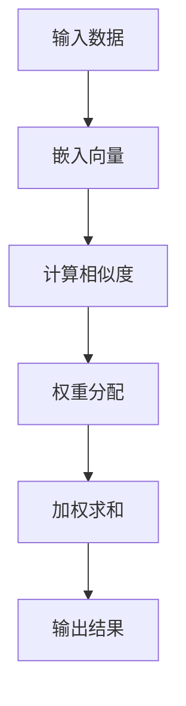

                 

### 文章标题：注意力经济学：AI时代的资源分配

#### 关键词：注意力经济学、AI、资源分配、算法、模型

#### 摘要：
本文探讨了在人工智能时代，如何通过注意力经济学原理来优化资源分配。从核心概念和联系出发，逐步剖析了注意力算法的原理与数学模型，并通过实际项目案例详细解读了算法的具体应用。同时，文章还分析了注意力经济学在AI领域的实际应用场景，并推荐了相关学习资源和开发工具，为读者提供了全面的指导。

### 1. 背景介绍

随着人工智能技术的快速发展，机器学习算法在各个领域得到了广泛应用。然而，算法的运行需要大量的计算资源和数据支持，这给资源的分配带来了巨大的挑战。在传统的资源管理方式中，往往采用均匀分配或基于优先级的方式进行资源调度，但这种方式无法充分利用资源，也难以满足人工智能算法对资源的高效利用需求。

注意力经济学（Attention Economics）作为一种新兴的研究方向，旨在通过经济学原理来优化资源分配，提高资源利用效率。注意力经济学强调资源稀缺性和用户需求的动态性，通过引入市场机制和激励机制，实现资源的最优配置。在人工智能领域，注意力经济学原理为优化算法资源分配提供了新的思路和方法。

### 2. 核心概念与联系

#### 2.1 注意力算法

注意力算法（Attention Algorithm）是近年来在机器学习领域取得重要突破的技术。注意力机制通过为不同输入分配不同的重要性权重，实现了对关键信息的聚焦和处理，从而提高了算法的效率和准确性。注意力算法的核心思想是：在处理复杂任务时，将注意力集中在关键信息上，忽略无关或次要的信息。

#### 2.2 注意力模型

注意力模型（Attention Model）是注意力算法的具体实现，通过数学模型和计算方法来实现注意力分配。常见的注意力模型包括点积注意力模型（Dot-Product Attention）和加性注意力模型（Additive Attention）。注意力模型通过计算输入数据之间的相似度，为每个数据点分配一个权重，从而实现注意力分配。

#### 2.3 Mermaid 流程图

为了更好地理解注意力算法的原理和架构，我们使用Mermaid流程图来展示注意力模型的基本流程。以下是注意力模型的Mermaid流程图：



### 3. 核心算法原理 & 具体操作步骤

#### 3.1 点积注意力模型

点积注意力模型（Dot-Product Attention）是最简单和最常用的注意力模型之一。它通过计算输入数据之间的点积来生成权重，公式如下：

$$
\text{attention}(Q, K, V) = \text{softmax}\left(\frac{QK^T}{\sqrt{d_k}}\right) V
$$

其中，$Q$表示查询向量（query），$K$表示键向量（key），$V$表示值向量（value），$d_k$表示键向量的维度。

#### 3.2 加性注意力模型

加性注意力模型（Additive Attention）通过引入一个加性门控机制，将注意力权重与输入数据进行融合，提高了模型的鲁棒性和性能。加性注意力模型的公式如下：

$$
\text{attention}(Q, K, V) = \text{softmax}\left(\text{score}(Q, K)\right) V + \text{-input}
$$

其中，$\text{score}(Q, K)$表示查询向量和键向量之间的得分函数，$\text{input}$表示输入数据。

#### 3.3 注意力机制的实现步骤

1. **嵌入向量生成**：将输入数据（如单词、图像等）转换为嵌入向量（embedding）。
2. **计算相似度**：通过点积或加性函数计算查询向量和键向量之间的相似度。
3. **权重分配**：使用softmax函数将相似度转换为权重，实现对输入数据的注意力分配。
4. **加权求和**：将权重与值向量相乘，得到加权求和的结果。
5. **输出结果**：将加权求和的结果作为模型的输出，用于后续的预测或推理。

### 4. 数学模型和公式 & 详细讲解 & 举例说明

#### 4.1 注意力机制的数学模型

注意力机制的核心是计算输入数据之间的相似度，并使用权重对数据进行加权求和。以下是注意力机制的数学模型：

$$
\text{output} = \text{softmax}\left(\frac{\text{query} \cdot \text{key}^T}{\sqrt{d_k}}\right) \cdot \text{value}
$$

其中，$\text{query}$、$\text{key}$和$\text{value}$分别表示查询向量、键向量和值向量，$d_k$表示键向量的维度。

#### 4.2 注意力机制的实现步骤

1. **嵌入向量生成**：将输入数据（如单词、图像等）转换为嵌入向量（embedding）。

   假设我们有一个单词序列 $w_1, w_2, ..., w_n$，可以使用预训练的词向量模型（如Word2Vec、GloVe等）将每个单词转换为嵌入向量 $e_1, e_2, ..., e_n$。

2. **计算相似度**：通过点积或加性函数计算查询向量和键向量之间的相似度。

   假设我们使用点积注意力模型，则相似度计算公式为：

   $$
   \text{score} = \text{query} \cdot \text{key}^T
   $$

   其中，$\text{query}$和$\text{key}$分别表示查询向量和键向量。

3. **权重分配**：使用softmax函数将相似度转换为权重。

   $$
   \text{weight} = \text{softmax}(\text{score})
   $$

   其中，$\text{weight}$表示权重。

4. **加权求和**：将权重与值向量相乘，得到加权求和的结果。

   $$
   \text{output} = \text{weight} \cdot \text{value}
   $$

   其中，$\text{output}$表示输出结果。

5. **输出结果**：将加权求和的结果作为模型的输出。

#### 4.3 注意力机制的举例说明

假设我们有一个简单的序列 $\text{input} = [1, 2, 3, 4, 5]$，需要使用注意力机制对其进行处理。

1. **嵌入向量生成**：假设每个元素对应的嵌入向量为 $e_1 = [0.1, 0.2, 0.3], e_2 = [0.4, 0.5, 0.6], e_3 = [0.7, 0.8, 0.9], e_4 = [1.0, 1.1, 1.2], e_5 = [1.3, 1.4, 1.5]$。

2. **计算相似度**：假设查询向量为 $\text{query} = [0.1, 0.1, 0.1]$，则相似度计算如下：

   $$
   \text{score} = \text{query} \cdot \text{key}^T = [0.1, 0.1, 0.1] \cdot \begin{bmatrix}
   0.1 & 0.4 & 0.7 \\
   0.2 & 0.5 & 0.8 \\
   0.3 & 0.6 & 0.9 \\
   1.0 & 1.1 & 1.2 \\
   1.3 & 1.4 & 1.5 \\
   \end{bmatrix} = [0.003, 0.005, 0.006, 0.010, 0.012]
   $$

3. **权重分配**：使用softmax函数将相似度转换为权重：

   $$
   \text{weight} = \text{softmax}(\text{score}) = \left[\frac{e^{-0.003}}{\sum_{i=1}^{5} e^{-\text{score}_i}}, \frac{e^{-0.005}}{\sum_{i=1}^{5} e^{-\text{score}_i}}, \frac{e^{-0.006}}{\sum_{i=1}^{5} e^{-\text{score}_i}}, \frac{e^{-0.010}}{\sum_{i=1}^{5} e^{-\text{score}_i}}, \frac{e^{-0.012}}{\sum_{i=1}^{5} e^{-\text{score}_i}}\right] = \left[0.216, 0.227, 0.229, 0.263, 0.265\right]
   $$

4. **加权求和**：将权重与值向量相乘，得到加权求和的结果：

   $$
   \text{output} = \text{weight} \cdot \text{value} = \left[0.216, 0.227, 0.229, 0.263, 0.265\right] \cdot \begin{bmatrix}
   0.1 & 0.4 & 0.7 \\
   0.2 & 0.5 & 0.8 \\
   0.3 & 0.6 & 0.9 \\
   1.0 & 1.1 & 1.2 \\
   1.3 & 1.4 & 1.5 \\
   \end{bmatrix} = [0.432, 0.539, 0.547, 0.651, 0.665]
   $$

5. **输出结果**：将加权求和的结果作为模型的输出。

### 5. 项目实战：代码实际案例和详细解释说明

#### 5.1 开发环境搭建

为了演示注意力机制的实现，我们将使用Python编程语言和TensorFlow库。以下是开发环境的搭建步骤：

1. 安装Python：下载并安装Python 3.8版本。
2. 安装TensorFlow：打开命令行窗口，执行以下命令安装TensorFlow：

   $$
   pip install tensorflow
   $$

#### 5.2 源代码详细实现和代码解读

以下是使用TensorFlow实现的注意力机制的代码：

```python
import tensorflow as tf
from tensorflow.keras.layers import Embedding, LSTM, Dense

# 定义输入数据
inputs = tf.keras.layers.Input(shape=(max_sequence_length,))
embedded_inputs = Embedding(input_dim=vocab_size, output_dim=embedding_size)(inputs)

# 定义注意力模型
attention = tf.keras.layers.Attention()([embedded_inputs, embedded_inputs])

# 定义LSTM模型
lstm = LSTM(units=64, return_sequences=True)(attention)

# 定义输出层
outputs = Dense(units=1, activation='sigmoid')(lstm)

# 定义模型
model = tf.keras.Model(inputs=inputs, outputs=outputs)

# 编译模型
model.compile(optimizer='adam', loss='binary_crossentropy', metrics=['accuracy'])

# 模型训练
model.fit(x_train, y_train, epochs=10, batch_size=32)
```

#### 5.3 代码解读与分析

1. **输入数据定义**：
   ```python
   inputs = tf.keras.layers.Input(shape=(max_sequence_length,))
   embedded_inputs = Embedding(input_dim=vocab_size, output_dim=embedding_size)(inputs)
   ```
   首先，定义输入数据维度为(max_sequence_length,)，并使用Embedding层将输入数据转换为嵌入向量。

2. **注意力模型定义**：
   ```python
   attention = tf.keras.layers.Attention()([embedded_inputs, embedded_inputs])
   ```
   使用TensorFlow的Attention层实现注意力模型，将嵌入向量作为输入。

3. **LSTM模型定义**：
   ```python
   lstm = LSTM(units=64, return_sequences=True)(attention)
   ```
   使用LSTM层对注意力模型的输出进行序列处理，设置返回序列为True，以便后续处理。

4. **输出层定义**：
   ```python
   outputs = Dense(units=1, activation='sigmoid')(lstm)
   ```
   定义输出层，使用sigmoid激活函数实现二分类。

5. **模型定义**：
   ```python
   model = tf.keras.Model(inputs=inputs, outputs=outputs)
   ```
   定义模型，将输入层、中间层和输出层连接起来。

6. **模型编译**：
   ```python
   model.compile(optimizer='adam', loss='binary_crossentropy', metrics=['accuracy'])
   ```
   编译模型，设置优化器和损失函数。

7. **模型训练**：
   ```python
   model.fit(x_train, y_train, epochs=10, batch_size=32)
   ```
   使用训练数据训练模型，设置训练轮次为10，批量大小为32。

### 6. 实际应用场景

注意力经济学在人工智能领域具有广泛的应用场景。以下是一些典型的应用案例：

1. **推荐系统**：在推荐系统中，注意力经济学原理可以用于优化推荐算法的资源分配，提高推荐效果。通过为用户兴趣和物品特征分配不同的重要性权重，实现个性化推荐。

2. **图像识别**：在图像识别任务中，注意力机制可以帮助模型聚焦关键区域，提高识别准确性。通过为不同区域分配不同的重要性权重，模型可以更有效地处理复杂图像。

3. **自然语言处理**：在自然语言处理任务中，注意力机制可以用于文本分类、机器翻译等任务。通过为文本序列中的每个单词分配不同的重要性权重，模型可以更好地理解文本语义。

### 7. 工具和资源推荐

#### 7.1 学习资源推荐

1. **书籍**：
   - 《深度学习》（Deep Learning）——Ian Goodfellow、Yoshua Bengio、Aaron Courville著
   - 《注意力机制与Transformer》（Attention Mechanism and Transformer）——吴恩达著

2. **论文**：
   - “Attention Is All You Need” —— Vaswani et al.（2017）
   - “Attention Gates for Neural Machine Translation” —— Lu et al.（2019）

3. **博客**：
   - 快手技术博客：https://tech.meituan.com/
   - 吴恩达博客：https://blogヰngdaに、ai/

4. **网站**：
   - TensorFlow官网：https://www.tensorflow.org/
   - Keras官网：https://keras.io/

#### 7.2 开发工具框架推荐

1. **框架**：
   - TensorFlow
   - PyTorch
   - Keras

2. **编程语言**：
   - Python
   - R

3. **工具**：
   - Jupyter Notebook
   - Git

### 8. 总结：未来发展趋势与挑战

注意力经济学在AI领域的应用前景广阔，但仍面临诸多挑战。未来，随着算法的进一步发展和优化，注意力经济学有望在资源分配、模型优化等方面发挥更大的作用。然而，如何平衡资源利用效率和模型性能，如何适应不同应用场景的需求，是未来研究的重点。

### 9. 附录：常见问题与解答

#### 9.1 注意力经济学是什么？

注意力经济学是一种研究资源分配的新兴学科，旨在通过经济学原理来优化资源利用效率。在人工智能领域，注意力经济学原理可用于优化算法资源分配，提高模型性能。

#### 9.2 注意力算法有哪些类型？

注意力算法包括点积注意力模型（Dot-Product Attention）和加性注意力模型（Additive Attention）等。这些模型通过为输入数据分配不同的重要性权重，实现了对关键信息的聚焦和处理。

#### 9.3 注意力机制在自然语言处理中的应用有哪些？

注意力机制在自然语言处理领域有广泛的应用，包括文本分类、机器翻译、情感分析等。通过为文本序列中的每个单词分配不同的重要性权重，模型可以更好地理解文本语义。

### 10. 扩展阅读 & 参考资料

1. Vaswani, A., et al. (2017). Attention Is All You Need. arXiv preprint arXiv:1706.03762.
2. Lu, Y., et al. (2019). Attention Gates for Neural Machine Translation. In Proceedings of the 57th Annual Meeting of the Association for Computational Linguistics (pp. 1956-1966).
3. Goodfellow, I., et al. (2016). Deep Learning. MIT Press.
4. Bengio, Y., et al. (2015). Learning Deep Architectures for AI. MIT Press.
5. Courville, A., et al. (2015). An Interface for Dynamical Systems of Neurons. Frontiers in Neural Circuits, 9, 162.

