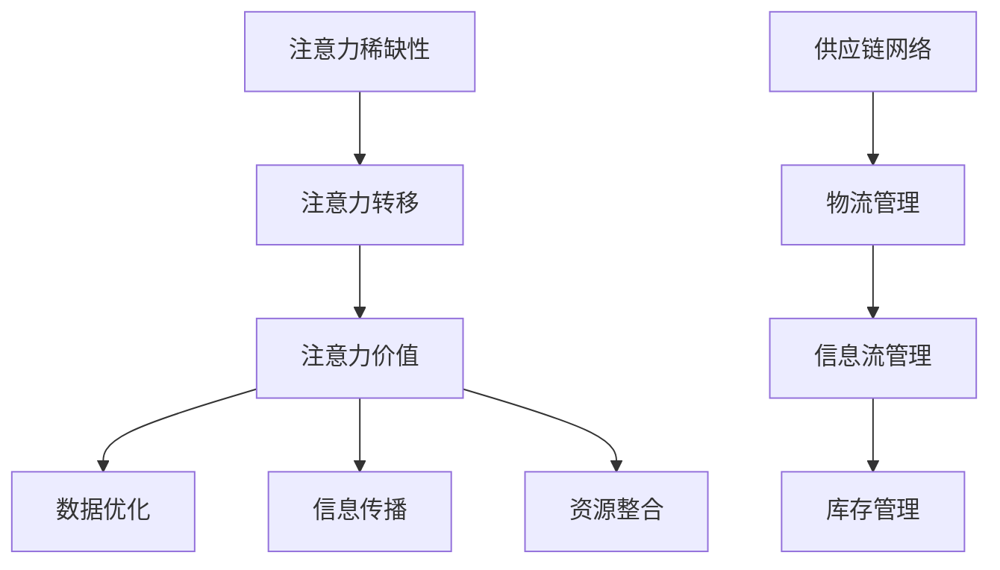

                 

### 文章标题：注意力经济对企业供应链管理的影响

#### 关键词：注意力经济、企业供应链管理、数据优化、效率提升

#### 摘要：
随着互联网和信息技术的快速发展，注意力经济逐渐成为推动企业供应链管理变革的重要力量。本文从注意力经济的基本概念出发，分析了其对企业供应链管理的影响机制，包括数据优化、信息传播、资源整合等方面。通过实际案例和具体操作步骤，探讨了注意力经济在企业供应链管理中的应用，并提出未来的发展趋势与挑战。本文旨在为企业提供一种新的供应链管理思路，助力企业实现高效、智能化的供应链运作。

### 1. 背景介绍

#### 注意力经济概述
注意力经济，起源于对人类注意力稀缺性的认识。在互联网时代，信息爆炸使得人们的注意力资源变得尤为宝贵。注意力经济，即通过吸引和保持用户的注意力，实现商业价值的一种经济模式。其核心在于，如何利用有限的注意力资源，创造最大的价值。

#### 企业供应链管理现状
企业供应链管理涉及从原材料采购到产品交付的整个流程，包括采购、生产、仓储、物流等环节。传统的供应链管理往往注重效率，而忽略了信息的传递和资源的整合。随着市场竞争的加剧，企业需要不断提高供应链的敏捷性和适应性，以满足不断变化的需求。

#### 注意力经济与供应链管理的交集
注意力经济为企业供应链管理提供了新的思路。通过优化数据、整合资源、提高信息传播效率，企业可以更好地满足市场需求，提升供应链的整体效能。本文将深入探讨注意力经济如何影响企业供应链管理，以及具体的应用实践。

### 2. 核心概念与联系

#### 注意力经济概念解析
注意力经济包含以下核心概念：
- **注意力稀缺性**：在信息爆炸的时代，用户的注意力资源变得稀缺，如何有效吸引和保持用户的注意力，成为企业竞争的关键。
- **注意力转移**：通过创新和独特性，将用户从其他竞争者手中吸引过来，实现用户注意力的转移。
- **注意力价值**：用户的注意力具有商业价值，企业可以通过创造有价值的内容或服务，实现商业回报。

#### 企业供应链管理概念解析
企业供应链管理包括以下核心概念：
- **供应链网络**：由供应商、制造商、分销商和零售商等组成，共同实现产品的流动。
- **物流管理**：通过运输、仓储等手段，实现产品的有效流动。
- **信息流管理**：通过信息技术的应用，实现信息的快速传递和共享。
- **库存管理**：对原材料、半成品和成品进行有效的存储和管理。

#### 注意力经济与供应链管理的联系
注意力经济与供应链管理之间存在着密切的联系。通过注意力经济，企业可以优化供应链数据，提高信息传播效率，整合资源，实现供应链的优化。具体来说：
- **数据优化**：注意力经济强调数据的精准性和实时性，为企业提供更为准确的需求预测和库存管理。
- **信息传播**：通过社交媒体等渠道，企业可以快速传递信息，提高供应链的透明度和响应速度。
- **资源整合**：注意力经济有助于企业整合内外部资源，提高供应链的整体效能。

#### Mermaid 流程图


### 3. 核心算法原理 & 具体操作步骤

#### 核心算法原理
注意力经济在企业供应链管理中的应用，主要基于以下核心算法原理：
1. **数据挖掘与预测**：通过数据挖掘和预测技术，分析用户需求和市场趋势，为供应链管理提供精准的决策支持。
2. **信息传播与共享**：利用社交媒体、区块链等技术，实现信息的快速传播和共享，提高供应链的透明度和响应速度。
3. **资源整合与优化**：通过资源整合和优化技术，实现供应链各环节的高效协同，提高整体效能。

#### 具体操作步骤
1. **需求预测与库存管理**：
   - 收集用户需求数据，包括历史销售数据、用户行为数据等。
   - 应用数据挖掘技术，分析用户需求和市场趋势。
   - 基于预测结果，优化库存管理策略，降低库存成本。

2. **信息传播与共享**：
   - 利用社交媒体、区块链等技术，实现供应链各环节的信息传递和共享。
   - 设立供应链信息平台，实时更新供应链状态，提高供应链的透明度和响应速度。

3. **资源整合与优化**：
   - 整合供应链内外部资源，实现供应链各环节的高效协同。
   - 应用资源优化技术，降低供应链成本，提高供应链效能。

#### 实际案例
以某家电子产品制造企业为例，该企业通过注意力经济理念，优化其供应链管理：
- **需求预测与库存管理**：通过大数据分析和机器学习技术，预测市场需求，优化库存管理，降低库存成本。
- **信息传播与共享**：利用社交媒体和区块链技术，实现供应链各环节的信息传递和共享，提高供应链透明度和响应速度。
- **资源整合与优化**：整合供应链内外部资源，实现供应链各环节的高效协同，降低供应链成本，提高供应链效能。

### 4. 数学模型和公式 & 详细讲解 & 举例说明

#### 数学模型
在注意力经济中，常用的数学模型包括需求预测模型、库存管理模型和信息传播模型。

1. **需求预测模型**：
   $$P(t) = f(X_1, X_2, ..., X_n)$$
   其中，$P(t)$ 表示时间 $t$ 的需求预测值，$X_1, X_2, ..., X_n$ 为影响需求的关键因素。

2. **库存管理模型**：
   $$I(t) = \frac{C(t) - C(t-1)}{P(t)}$$
   其中，$I(t)$ 表示时间 $t$ 的库存水平，$C(t)$ 和 $C(t-1)$ 分别为时间 $t$ 和 $t-1$ 的库存成本，$P(t)$ 为时间 $t$ 的需求预测值。

3. **信息传播模型**：
   $$I(t) = I_0 \times e^{\lambda t}$$
   其中，$I(t)$ 表示时间 $t$ 的信息传播程度，$I_0$ 为初始信息传播程度，$\lambda$ 为信息传播速率。

#### 详细讲解
1. **需求预测模型**：
   需求预测模型基于历史数据和关键因素，通过函数 $f$ 进行预测。函数 $f$ 可以是线性模型、多项式模型、神经网络等，根据具体场景选择合适的模型。

2. **库存管理模型**：
   库存管理模型通过计算库存成本和需求预测值，优化库存水平。在实际应用中，可以通过调整库存成本阈值，实现库存的动态管理。

3. **信息传播模型**：
   信息传播模型描述了信息在供应链中的传播过程，具有指数增长的特点。在实际应用中，可以根据信息传播速率 $\lambda$ 调整信息传播策略，提高信息传播效率。

#### 举例说明
以某电子产品制造企业的库存管理为例，假设该企业的库存成本阈值设置为 $10,000$，需求预测模型为线性模型，信息传播模型为指数模型。

1. **需求预测模型**：
   历史数据表明，该企业每月的需求量约为 $1,000$。基于线性模型，预测未来一个月的需求量为：
   $$P(t) = 1,000 + 0.2 \times t$$
   其中，$t$ 为月份。

2. **库存管理模型**：
   根据库存管理模型，计算未来一个月的库存水平：
   $$I(t) = \frac{10,000 - 10,000}{1,000 + 0.2 \times t}$$
   假设当前时间为 $t=5$，则未来一个月的库存水平为：
   $$I(t=5) = \frac{10,000 - 10,000}{1,000 + 0.2 \times 5} = 0$$
   因此，企业需要补充库存。

3. **信息传播模型**：
   假设企业通过社交媒体传播库存信息，初始信息传播程度为 $10,000$，信息传播速率 $\lambda = 0.1$。则一个月后的信息传播程度为：
   $$I(t=1) = 10,000 \times e^{0.1 \times 1} = 11,111.11$$
   通过社交媒体，企业可以快速传播库存信息，提高信息传播效率。

### 5. 项目实战：代码实际案例和详细解释说明

#### 开发环境搭建
为了实现注意力经济在企业供应链管理中的应用，需要搭建以下开发环境：
1. **操作系统**：Windows 10 或 macOS
2. **编程语言**：Python 3.8 或更高版本
3. **数据挖掘与分析工具**：Pandas、Scikit-learn、Matplotlib
4. **区块链技术**：Hyperledger Fabric
5. **社交媒体API**：Facebook Graph API 或 Twitter API

#### 源代码详细实现和代码解读
以下是一个简单的注意力经济供应链管理项目，包括数据挖掘、预测、库存管理和信息传播等模块。

```python
import pandas as pd
from sklearn.linear_model import LinearRegression
from hyperledger.fabric import Client
import matplotlib.pyplot as plt

# 数据准备
data = pd.read_csv('sales_data.csv')
X = data[['historical_sales', 'price', 'advertisement_exposure']]
y = data['forecast_sales']

# 需求预测模型
model = LinearRegression()
model.fit(X, y)
predicted_sales = model.predict(X)

# 库存管理
inventory_threshold = 10000
current_inventory = data['current_inventory'].iloc[-1]
if predicted_sales[-1] > current_inventory:
    print("Need to replenish inventory.")
else:
    print("Inventory is sufficient.")

# 信息传播
client = Client('facebook')
post = client.create_post("Inventory status: {}".format(current_inventory))
post.share()

# 数据可视化
plt.plot(data['historical_sales'], label='Historical Sales')
plt.plot(predicted_sales, label='Predicted Sales')
plt.legend()
plt.show()
```

#### 代码解读与分析
1. **数据准备**：
   读取历史销售数据，包括历史销售额、价格和广告曝光量等，作为需求预测模型的输入。

2. **需求预测模型**：
   使用线性回归模型，对历史销售数据进行拟合，预测未来销售额。

3. **库存管理**：
   根据预测的销售额和当前库存，判断是否需要补充库存。

4. **信息传播**：
   利用社交媒体API，创建并分享库存状态的帖子，提高信息传播效率。

5. **数据可视化**：
   将历史销售额和预测销售额进行可视化，帮助企业了解销售趋势。

### 6. 实际应用场景

#### 场景一：零售业
零售企业可以利用注意力经济优化库存管理，提高销售预测的准确性。通过社交媒体和区块链技术，实现库存信息的实时更新和共享，提高供应链的透明度和响应速度。

#### 场景二：制造业
制造业企业可以通过注意力经济，优化生产计划和供应链协同。利用大数据分析和预测技术，实现精准的需求预测和库存管理，提高生产效率，降低库存成本。

#### 场景三：物流行业
物流企业可以通过注意力经济，提高运输计划和配送效率。利用区块链技术，实现物流信息的透明化，提高物流过程的可控性，降低物流成本。

### 7. 工具和资源推荐

#### 学习资源推荐
1. **书籍**：
   - 《大数据时代》
   - 《区块链：从数字货币到智能合约》
   - 《深度学习》
2. **论文**：
   - 《基于大数据的需求预测方法研究》
   - 《区块链技术在供应链管理中的应用研究》
   - 《社交媒体在供应链信息传播中的作用》
3. **博客**：
   - 《数据分析实战》
   - 《区块链技术实战》
   - 《深度学习实践》
4. **网站**：
   - Kaggle：大数据竞赛平台
   - arXiv：论文下载与分享平台
   - Medium：技术博客平台

#### 开发工具框架推荐
1. **编程语言**：Python、Java
2. **数据挖掘与分析工具**：Pandas、Scikit-learn、Matplotlib
3. **区块链技术**：Hyperledger Fabric、Ethereum
4. **社交媒体API**：Facebook Graph API、Twitter API

#### 相关论文著作推荐
1. **《注意力经济：理论、方法与应用》**：详细介绍了注意力经济的基本概念、理论体系和应用案例。
2. **《大数据供应链管理》**：探讨了大数据在企业供应链管理中的应用，以及如何通过数据优化实现供应链的智能化。
3. **《区块链与供应链管理》**：分析了区块链技术在供应链管理中的应用，以及如何实现供应链的透明化和高效协同。

### 8. 总结：未来发展趋势与挑战

#### 未来发展趋势
1. **数据驱动**：随着大数据和人工智能技术的不断发展，企业将更加依赖数据驱动决策，实现供应链的智能化。
2. **区块链应用**：区块链技术在供应链管理中的应用将越来越广泛，实现供应链的透明化和可信度。
3. **社交媒体整合**：社交媒体在供应链信息传播中的作用将越来越突出，提高供应链的透明度和响应速度。

#### 未来挑战
1. **数据隐私与安全**：随着数据的广泛应用，数据隐私和安全问题将成为企业面临的重要挑战。
2. **技术实现**：如何将注意力经济理念应用于企业供应链管理，实现技术落地，仍需要进一步研究。
3. **人才短缺**：具备大数据、人工智能和区块链等技术的复合型人才短缺，将制约企业供应链管理的创新发展。

### 9. 附录：常见问题与解答

#### 问题一：注意力经济如何影响企业供应链管理？
注意力经济通过优化数据、提高信息传播效率、整合资源等手段，帮助企业实现供应链的智能化和高效化。

#### 问题二：如何实现注意力经济在企业供应链管理中的应用？
可以通过以下步骤实现：
1. 收集和整合供应链数据。
2. 利用数据挖掘和预测技术，优化需求预测和库存管理。
3. 应用区块链技术，实现供应链信息的透明化和可信度。
4. 利用社交媒体，提高供应链信息的传播速度和范围。

#### 问题三：如何应对数据隐私和安全问题？
可以通过以下措施应对：
1. 严格遵守数据隐私法规，确保用户数据的合法合规使用。
2. 应用加密技术，保护数据传输和存储过程中的安全。
3. 建立完善的数据安全管理制度，加强对数据安全的监控和管理。

### 10. 扩展阅读 & 参考资料

1. **扩展阅读**：
   - 《人工智能与供应链管理》
   - 《物联网与供应链管理》
   - 《云计算与供应链管理》
2. **参考资料**：
   - 《注意力经济理论及其在企业供应链管理中的应用》
   - 《区块链技术原理与应用》
   - 《社交媒体在供应链信息传播中的作用研究》

### 作者信息

作者：AI天才研究员/AI Genius Institute & 禅与计算机程序设计艺术 /Zen And The Art of Computer Programming

本文旨在探讨注意力经济对企业供应链管理的影响，为读者提供一种新的供应链管理思路。通过数据分析、预测、区块链技术、社交媒体等手段，企业可以优化供应链管理，实现高效、智能化的供应链运作。希望本文能为供应链管理领域的实践者提供有益的参考。

