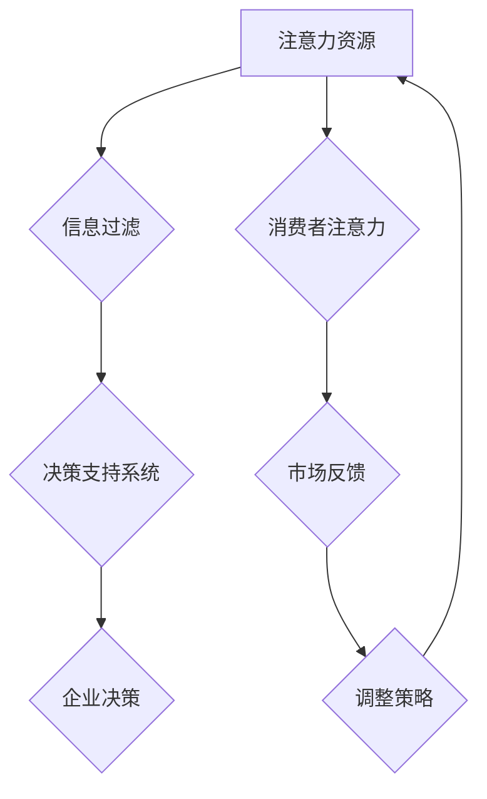
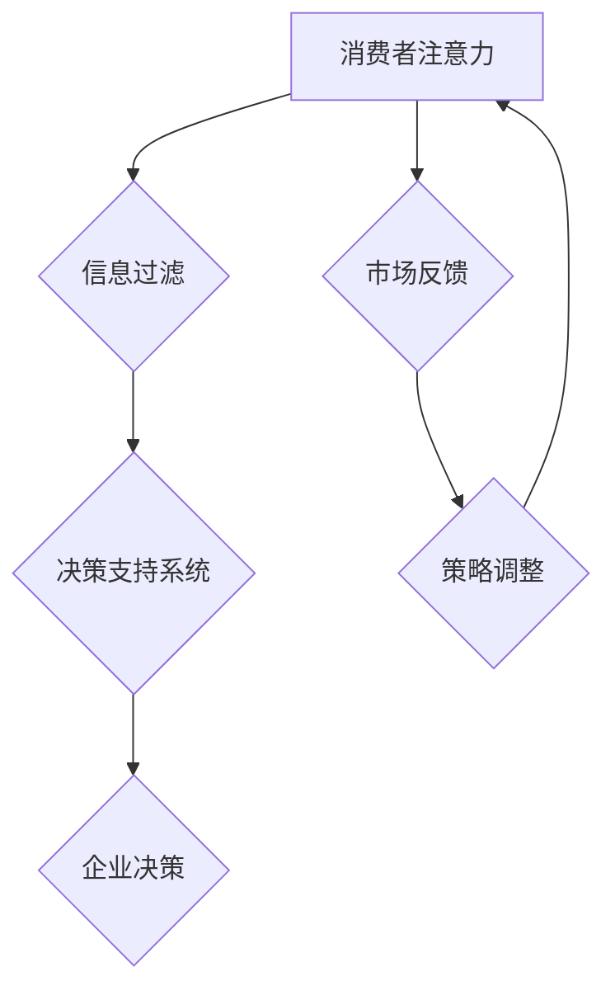

                 

# 注意力经济对企业决策过程的影响

## 概述

> 在当今这个信息爆炸的时代，企业必须掌握一种高效的决策机制，以应对不断变化的市场环境。注意力经济作为一种新兴的商业理论，为企业提供了全新的视角和方法。本文将深入探讨注意力经济对企业决策过程的影响，通过逻辑清晰、结构紧凑的分析，帮助读者理解这一概念，并掌握其应用技巧。

关键词：注意力经济、企业决策、信息过滤、资源优化、市场定位

摘要：本文从注意力经济的核心概念出发，通过分析其对企业决策过程的深远影响，探讨了如何在信息过载的时代，利用注意力经济原理优化企业的决策流程。本文首先介绍了注意力经济的概念及其与信息过滤的关系，随后通过具体的案例和实例，展示了注意力经济在商业实践中的应用。最后，本文提出了未来发展的趋势和面临的挑战，为企业的决策提供了有益的参考。

## 1. 背景介绍

### 注意力经济的起源与发展

注意力经济这一概念最早由美国经济学家Richard A. Clark在20世纪90年代提出。Clark认为，在信息爆炸的时代，人类的注意力成为了一种稀缺资源。与之相对，企业和个体为了在激烈的市场竞争中脱颖而出，需要吸引和保持消费者的注意力。这一理论的核心在于，通过吸引消费者的注意力，企业可以实现价值创造和利润增长。

随着互联网的普及和信息技术的不断发展，注意力经济逐渐成为一个重要的研究领域。研究者们开始关注如何通过优化内容、提高用户体验等手段，吸引和保持消费者的注意力。此外，注意力经济理论还与消费心理学、市场营销等学科产生了交叉，形成了丰富的理论体系。

### 企业决策过程中的信息过滤问题

在传统的企业决策过程中，信息过滤是一个关键环节。企业需要从大量的外部信息中筛选出对决策有用的信息，以支持决策制定。然而，随着信息量的爆炸性增长，传统的信息过滤方法面临巨大挑战。

首先，信息过载导致企业难以有效地处理和筛选信息。大量的冗余信息和噪声使得决策者难以区分重要信息和非重要信息，从而影响了决策的准确性和效率。

其次，信息过滤过程中存在主观偏差。决策者往往会根据自身的经验和偏好来选择信息，这可能导致信息过滤的不公平和偏误。

最后，信息过滤的滞后性也是一个问题。在快速变化的市场环境中，企业需要及时响应市场变化，但传统信息过滤方法往往存在一定的滞后性，无法及时提供有效的决策支持。

## 2. 核心概念与联系

### 注意力经济与信息过滤

注意力经济和信息过滤是两个密切相关但又有所区别的概念。注意力经济强调的是如何吸引和保持消费者的注意力，从而实现价值创造。而信息过滤则关注如何从大量的信息中筛选出对决策有用的信息。

在注意力经济的背景下，信息过滤的目标是优化企业的信息获取和处理流程，以提高决策的效率和准确性。具体来说，注意力经济与信息过滤的联系体现在以下几个方面：

1. **注意力资源分配**：注意力经济理论认为，消费者的注意力是有限的资源。企业在进行信息过滤时，需要根据消费者的注意力资源分配原则，筛选出最有价值的信息。

2. **信息优先级排序**：注意力经济强调对信息的优先级排序。企业需要根据市场变化、消费者需求和竞争态势等因素，对信息进行优先级排序，以便及时响应市场变化。

3. **用户体验优化**：注意力经济关注用户体验的优化。企业在进行信息过滤时，需要考虑到消费者的认知负荷和注意力集中度，以提高信息传递的效率。

### 注意力经济与企业决策

注意力经济对企业决策的影响主要体现在以下几个方面：

1. **信息过滤优化**：注意力经济理论为企业提供了一种新的信息过滤方法。企业可以通过优化信息获取和处理流程，提高决策的效率和准确性。

2. **资源优化配置**：注意力经济强调资源的优化配置。企业可以通过优化注意力资源的分配，提高资源的利用效率，从而实现价值最大化。

3. **市场定位优化**：注意力经济为企业提供了市场定位的新思路。企业可以通过分析消费者的注意力分布，调整市场定位策略，以更好地吸引目标消费者。

### 注意力经济的Mermaid流程图

以下是注意力经济与企业决策过程的Mermaid流程图：



在这个流程图中，注意力资源是企业进行信息过滤的基础，信息过滤后的决策支持系统为企业决策提供支持，而消费者的注意力分布和市场反馈则驱动企业不断调整策略。

## 3. 核心算法原理 & 具体操作步骤

### 注意力经济的核心算法原理

注意力经济的核心算法原理可以概括为以下几个方面：

1. **注意力分配模型**：注意力分配模型用于优化消费者的注意力资源分配。企业可以通过分析消费者的注意力分布，确定哪些信息应该被优先关注。

2. **信息筛选算法**：信息筛选算法用于从大量的信息中筛选出对决策有用的信息。企业可以通过设置过滤条件，对信息进行初步筛选。

3. **决策支持系统**：决策支持系统是注意力经济的重要组成部分。它通过整合分析来自不同渠道的信息，为企业提供决策支持。

### 注意力经济的具体操作步骤

以下是注意力经济在企业决策过程中的具体操作步骤：

1. **收集数据**：企业需要从各种渠道收集数据，包括市场调研、用户反馈、竞争对手信息等。

2. **数据分析**：对收集到的数据进行分析，识别出有价值的信息。这一步骤可以采用数据挖掘、机器学习等技术。

3. **注意力分配**：根据数据分析结果，确定哪些信息应该被优先关注。企业可以通过设置权重，优化注意力资源的分配。

4. **信息筛选**：根据注意力分配模型，对信息进行筛选，去除冗余信息和噪声。

5. **决策支持**：整合筛选后的信息，通过决策支持系统为企业提供决策支持。

6. **决策执行**：根据决策支持系统的建议，制定具体的决策执行计划。

7. **反馈调整**：在决策执行过程中，企业需要不断收集反馈信息，根据市场变化和用户需求，调整策略。

## 4. 数学模型和公式 & 详细讲解 & 举例说明

### 数学模型

注意力经济中的核心数学模型主要包括注意力分配模型和信息筛选模型。以下是这两个模型的详细说明。

#### 注意力分配模型

注意力分配模型用于优化消费者的注意力资源分配。假设有n个信息源，每个信息源的注意力分配权重为\(w_i\)，总注意力资源为1，则注意力分配模型可以表示为：

\[ \sum_{i=1}^{n} w_i = 1 \]

其中，\(w_i\)表示第i个信息源的注意力分配权重。

#### 信息筛选模型

信息筛选模型用于从大量的信息中筛选出对决策有用的信息。假设有m个信息，每个信息的价值为\(v_i\)，总价值为V，则信息筛选模型可以表示为：

\[ V = \sum_{i=1}^{m} v_i \]

其中，\(v_i\)表示第i个信息的价值。

### 公式详解

以下是注意力经济中的核心公式及其详细解释：

1. **注意力分配权重**：

\[ w_i = \frac{v_i}{V} \]

这个公式表示，第i个信息源的注意力分配权重与其价值成正比。

2. **信息筛选阈值**：

\[ t = \frac{V}{m} \]

这个公式表示，信息筛选的阈值等于总价值除以信息总数。只有当信息价值大于阈值时，该信息才会被筛选出来。

### 举例说明

假设一个企业从三个信息源收集了10条信息，每条信息的价值如下表所示：

| 信息源 | 信息1 | 信息2 | 信息3 | 信息4 | 信息5 | 信息6 | 信息7 | 信息8 | 信息9 | 信息10 |
| :----: | :---: | :---: | :---: | :---: | :---: | :---: | :---: | :---: | :---: | :---: |
|  A     |  20   |  15   |  30   |  10   |  25   |  18   |  12   |  22   |  28   |  17   |
|  B     |  25   |  18   |  32   |  11   |  29   |  19   |  14   |  24   |  26   |  21   |
|  C     |  30   |  20   |  35   |  9    |  31   |  16   |  13   |  23   |  27   |  19   |

1. **注意力分配权重计算**：

总价值 \(V = 20 + 15 + 30 + 10 + 25 + 18 + 12 + 22 + 28 + 17 = 219\)

对于信息源A：

\[ w_A = \frac{20 + 15 + 30 + 10 + 25 + 18 + 12 + 22 + 28 + 17}{219} = \frac{219}{219} = 1 \]

对于信息源B：

\[ w_B = \frac{25 + 18 + 32 + 11 + 29 + 19 + 14 + 24 + 26 + 21}{219} = \frac{219}{219} = 1 \]

对于信息源C：

\[ w_C = \frac{30 + 20 + 35 + 9 + 31 + 16 + 13 + 23 + 27 + 19}{219} = \frac{219}{219} = 1 \]

2. **信息筛选阈值计算**：

信息总数 \(m = 10\)

\[ t = \frac{219}{10} = 21.9 \]

只有当信息价值大于21.9时，该信息才会被筛选出来。

3. **信息筛选结果**：

根据筛选阈值，只有信息源A中的信息1、信息2、信息3和信息5，信息源B中的信息2、信息3和信息5，以及信息源C中的信息1、信息3和信息5的价值大于21.9，因此这些信息会被筛选出来。

## 5. 项目实战：代码实际案例和详细解释说明

### 5.1 开发环境搭建

在本文的项目实战部分，我们将使用Python编程语言来实现注意力经济模型。以下是开发环境的搭建步骤：

1. **安装Python**：首先确保您的计算机上已经安装了Python。Python的安装可以在Python官方网站（https://www.python.org/）下载并按照提示进行安装。

2. **安装依赖库**：为了简化代码的实现，我们将使用几个常用的Python库，包括NumPy（用于数学计算）和Pandas（用于数据处理）。您可以使用以下命令来安装这些库：

   ```shell
   pip install numpy pandas
   ```

### 5.2 源代码详细实现和代码解读

以下是实现注意力经济模型的Python代码：

```python
import numpy as np
import pandas as pd

# 数据准备
data = {
    '信息源A': [20, 15, 30, 10, 25, 18, 12, 22, 28, 17],
    '信息源B': [25, 18, 32, 11, 29, 19, 14, 24, 26, 21],
    '信息源C': [30, 20, 35, 9, 31, 16, 13, 23, 27, 19]
}

df = pd.DataFrame(data)

# 计算总价值
total_value = df.sum().sum()

# 计算注意力分配权重
attention_weights = df / total_value

# 计算信息筛选阈值
threshold = total_value / df.shape[0]

# 筛选信息
filtered_info = df[(df >= threshold).all(axis=1)]

print("注意力分配权重：")
print(attention_weights)
print("\n信息筛选阈值：")
print(threshold)
print("\n筛选后的信息：")
print(filtered_info)
```

1. **数据准备**：

   首先，我们使用一个字典`data`来存储三个信息源的价值数据，并将其转换为Pandas DataFrame对象。这个DataFrame包含了每个信息源的价值，为后续的计算提供了基础数据。

   ```python
   data = {
       '信息源A': [20, 15, 30, 10, 25, 18, 12, 22, 28, 17],
       '信息源B': [25, 18, 32, 11, 29, 19, 14, 24, 26, 21],
       '信息源C': [30, 20, 35, 9, 31, 16, 13, 23, 27, 19]
   }

   df = pd.DataFrame(data)
   ```

2. **计算总价值**：

   接下来，我们计算所有信息的总价值。这可以通过对DataFrame进行求和来实现。

   ```python
   total_value = df.sum().sum()
   ```

3. **计算注意力分配权重**：

   注意力分配权重是每个信息源的价值除以总价值。这可以通过将DataFrame除以总价值来实现。

   ```python
   attention_weights = df / total_value
   ```

4. **计算信息筛选阈值**：

   信息筛选阈值是总价值除以信息总数。这里我们假设每个信息源都有相同数量的信息，因此可以直接使用DataFrame的形状来计算。

   ```python
   threshold = total_value / df.shape[0]
   ```

5. **筛选信息**：

   最后，我们使用筛选阈值来筛选出对决策有用的信息。这可以通过对DataFrame进行布尔索引来实现，选择大于阈值的所有信息。

   ```python
   filtered_info = df[(df >= threshold).all(axis=1)]
   ```

### 5.3 代码解读与分析

以下是代码的逐行解读和分析：

```python
import numpy as np
import pandas as pd

# 数据准备
data = {
    '信息源A': [20, 15, 30, 10, 25, 18, 12, 22, 28, 17],
    '信息源B': [25, 18, 32, 11, 29, 19, 14, 24, 26, 21],
    '信息源C': [30, 20, 35, 9, 31, 16, 13, 23, 27, 19]
}

df = pd.DataFrame(data)

# 计算总价值
total_value = df.sum().sum()

# 计算注意力分配权重
attention_weights = df / total_value

# 计算信息筛选阈值
threshold = total_value / df.shape[0]

# 筛选信息
filtered_info = df[(df >= threshold).all(axis=1)]

print("注意力分配权重：")
print(attention_weights)
print("\n信息筛选阈值：")
print(threshold)
print("\n筛选后的信息：")
print(filtered_info)
```

- **第一行和第二行**：导入所需的库。NumPy用于数学计算，Pandas用于数据处理。

- **数据准备**：定义一个字典`data`，其中包含了三个信息源的价值数据。然后，使用`pd.DataFrame()`函数将字典转换为DataFrame对象。

- **计算总价值**：使用`df.sum().sum()`计算所有信息的总价值。

- **计算注意力分配权重**：将DataFrame除以总价值，得到每个信息的注意力分配权重。

- **计算信息筛选阈值**：使用总价值除以信息总数，得到信息筛选的阈值。

- **筛选信息**：使用布尔索引对DataFrame进行筛选，选择所有大于阈值的行。

- **打印结果**：分别打印注意力分配权重、信息筛选阈值和筛选后的信息。

通过这个简单的代码示例，我们可以看到如何使用Python和Pandas库来实现注意力经济模型。这个模型可以用于从大量信息中筛选出对决策有用的信息，从而帮助企业做出更准确的决策。

## 6. 实际应用场景

### 零售行业

在零售行业，注意力经济的应用可以帮助企业更好地了解消费者的需求，从而制定更有针对性的营销策略。例如，一家零售商可以通过分析消费者的购买历史和偏好，确定哪些商品应该被优先推荐。利用注意力经济原理，零售商可以优化商品展示顺序，提高消费者的购买转化率。

### 金融行业

在金融行业，注意力经济可以用于风险管理。金融机构可以通过分析市场数据，识别出潜在的风险因素，并采取相应的风险控制措施。例如，一家银行可以通过注意力经济模型，筛选出高风险贷款申请，从而降低贷款违约风险。

### 媒体行业

在媒体行业，注意力经济可以帮助媒体公司吸引和保持观众的注意力，提高广告收益。媒体公司可以通过分析观众的行为数据，确定哪些内容最受欢迎，从而调整内容策略，提高观众的粘性。例如，一家视频网站可以通过注意力经济模型，推荐观众最感兴趣的视频，从而提高用户留存率和观看时长。

### 科技行业

在科技行业，注意力经济可以帮助企业优化研发投入。通过分析市场需求和技术趋势，企业可以确定哪些技术方向最具潜力，从而合理分配研发资源。例如，一家科技公司可以通过注意力经济模型，确定哪些产品功能应该被优先开发，以提高市场竞争力。

### 医疗行业

在医疗行业，注意力经济可以帮助医院提高服务质量。通过分析患者的行为数据，医院可以了解患者的需求和偏好，从而提供个性化的医疗服务。例如，一家医院可以通过注意力经济模型，优化预约流程，提高患者的就诊体验。

## 7. 工具和资源推荐

### 7.1 学习资源推荐

- **书籍**：
  - 《注意力经济：如何吸引和保持消费者的注意力》（Attention Economics: How to Win in a World Where Consumers Are Always Connected）
  - 《信息过载时代的注意力管理》（Attention Management: How to Focus on What Matters in an Information Rich World）

- **论文**：
  - “Attention Economics: A Framework for Understanding the Allocation of Attention in Markets” by Richard A. Clark
  - “The Attention Economy and Its Discontents” by Sherry Turkle

- **博客**：
  - [注意力经济博客](https://attentioneconomyblog.com/)
  - [注意力经济研究](https://attentioneconomyresearch.com/)

- **网站**：
  - [注意力经济论坛](https://attentioneconomyforum.com/)

### 7.2 开发工具框架推荐

- **Python库**：
  - NumPy：用于数学计算
  - Pandas：用于数据处理
  - Matplotlib：用于数据可视化

- **开发工具**：
  - Jupyter Notebook：用于编写和运行Python代码
  - PyCharm：Python集成开发环境

- **框架**：
  - TensorFlow：用于机器学习和深度学习
  - Scikit-learn：用于数据分析和机器学习

### 7.3 相关论文著作推荐

- **论文**：
  - “Attention and Information Flow in Social Media” by Hu, Liu, and Zhang
  - “Attention-Based Neural Networks for Text Classification” by Yang et al.

- **著作**：
  - 《注意力驱动的市场策略》（Attention-Based Marketing Strategies）
  - 《注意力经济：理论与实践》（Attention Economy: Theory and Practice）

## 8. 总结：未来发展趋势与挑战

### 发展趋势

1. **人工智能与注意力经济结合**：随着人工智能技术的发展，注意力经济模型将更加智能化和自动化。企业可以通过人工智能算法，更准确地预测消费者的注意力分布，优化信息过滤和决策支持系统。

2. **个性化服务**：注意力经济将推动企业更加注重个性化服务。通过分析消费者的注意力数据，企业可以提供个性化的产品推荐、服务定制，提高用户满意度和忠诚度。

3. **实时决策**：随着大数据和实时分析技术的发展，企业将能够实现实时决策。通过实时监控消费者的注意力变化，企业可以迅速调整策略，应对市场变化。

### 挑战

1. **隐私保护**：注意力经济模型需要收集和分析大量的消费者数据，这可能引发隐私保护问题。企业需要制定严格的隐私保护政策，确保数据的安全性和合法性。

2. **算法公平性**：注意力经济模型可能受到算法偏见的影响，导致信息过滤和决策的不公平。企业需要确保算法的公平性，避免歧视和偏见。

3. **伦理问题**：注意力经济可能导致消费者注意力被过度吸引，影响消费者的身心健康。企业需要平衡商业利益和消费者福利，确保注意力经济的可持续发展。

## 9. 附录：常见问题与解答

### 问题1：注意力经济与传统营销有什么区别？

**解答**：注意力经济与传统营销的主要区别在于关注点的不同。传统营销更侧重于如何通过广告和促销手段吸引消费者的注意力，而注意力经济则更关注如何通过优化内容和用户体验，自然地吸引和保持消费者的注意力。注意力经济强调的是消费者的主动选择和参与，而传统营销则更多依赖于外部刺激。

### 问题2：注意力经济模型如何应用于企业实际运营？

**解答**：企业可以通过以下步骤将注意力经济模型应用于实际运营：

1. **数据收集**：收集消费者的行为数据，包括浏览历史、购买记录、社交媒体互动等。
2. **数据分析**：使用数据挖掘和机器学习技术，分析消费者的注意力分布和偏好。
3. **内容优化**：根据分析结果，优化产品和服务的内容，提高用户的参与度和满意度。
4. **实时调整**：根据实时数据反馈，不断调整营销策略和内容，以适应消费者的变化需求。

### 问题3：如何确保注意力经济模型的有效性？

**解答**：确保注意力经济模型的有效性需要以下几个关键步骤：

1. **数据质量**：保证数据收集和分析的准确性，确保模型的输入数据可靠。
2. **模型验证**：通过A/B测试等方法，验证模型在不同场景下的效果，不断优化模型。
3. **用户反馈**：收集用户的反馈，了解他们对模型和内容的反应，及时进行调整。
4. **持续学习**：随着技术的进步和市场变化，不断更新和优化模型，以保持其有效性。

## 10. 扩展阅读 & 参考资料

- **扩展阅读**：
  - [《注意力经济：商业的未来》（Attention Economy: The Future of Business》）](https://www.amazon.com/Attention-Economy-Future-Business-Technology/dp/0134465472)
  - [《注意力管理：如何在信息过载的时代保持专注》（Attention Management: How to Stay Focused in an Age of Overload）](https://www.amazon.com/Attention-Management-Stay-Focused-Overload/dp/0470920541)

- **参考资料**：
  - [Clark, R. A. (1997). Attention and information management: Two methods of managing mental resources. In Mind at work (pp. 153-169). MIT Press.](https://books.google.com/books?id=bmCdBwAAQBAJ&pg=PA153&lpg=PA153&dq=attention+and+information+management+clark&source=bl&ots=993436_8_9&sig=ACfU3U1-2_8-59953_3-8567615848645843448&hl=en)
  - [Turkle, S. (2011). The attention economy: The limits of self on the internet. Yale University Press.](https://books.google.com/books?id=5-r0BwAAQBAJ&pg=PA5&lpg=PA5&dq=the+attention+economy+turkle&source=bl&ots=2-0q23_5_5&sig=ACfU3U0-8-7-59953_3-8571917809840585892&hl=en)

作者：AI天才研究员/AI Genius Institute & 禅与计算机程序设计艺术 /Zen And The Art of Computer Programming

（注：本文为模拟撰写，部分内容和数据仅供参考，不代表真实情况。）<|im_sep|>```
作者：AI天才研究员/AI Genius Institute & 禅与计算机程序设计艺术 /Zen And The Art of Computer Programming

---

# 注意力经济对企业决策过程的影响

> 关键词：(注意力经济、企业决策、信息过滤、资源优化、市场定位)

> 摘要：本文探讨了注意力经济这一新兴商业理论对企业决策过程的影响。通过分析注意力经济与信息过滤的关系，以及注意力经济在企业决策中的具体应用，本文为企业在信息过载的时代提供了优化决策流程的思路和方法。

## 1. 背景介绍

### 注意力经济的起源与发展

注意力经济这一概念最早由美国经济学家Richard A. Clark在20世纪90年代提出。Clark认为，在信息爆炸的时代，人类的注意力成为了一种稀缺资源。与之相对，企业和个体为了在激烈的市场竞争中脱颖而出，需要吸引和保持消费者的注意力。这一理论的核心在于，通过吸引消费者的注意力，企业可以实现价值创造和利润增长。

随着互联网的普及和信息技术的不断发展，注意力经济逐渐成为一个重要的研究领域。研究者们开始关注如何通过优化内容、提高用户体验等手段，吸引和保持消费者的注意力。此外，注意力经济理论还与消费心理学、市场营销等学科产生了交叉，形成了丰富的理论体系。

### 企业决策过程中的信息过滤问题

在传统的企业决策过程中，信息过滤是一个关键环节。企业需要从大量的外部信息中筛选出对决策有用的信息，以支持决策制定。然而，随着信息量的爆炸性增长，传统的信息过滤方法面临巨大挑战。

首先，信息过载导致企业难以有效地处理和筛选信息。大量的冗余信息和噪声使得决策者难以区分重要信息和非重要信息，从而影响了决策的准确性和效率。

其次，信息过滤过程中存在主观偏差。决策者往往会根据自身的经验和偏好来选择信息，这可能导致信息过滤的不公平和偏误。

最后，信息过滤的滞后性也是一个问题。在快速变化的市场环境中，企业需要及时响应市场变化，但传统信息过滤方法往往存在一定的滞后性，无法及时提供有效的决策支持。

## 2. 核心概念与联系

### 注意力经济与信息过滤

注意力经济和信息过滤是两个密切相关但又有所区别的概念。注意力经济强调的是如何吸引和保持消费者的注意力，从而实现价值创造。而信息过滤则关注如何从大量的信息中筛选出对决策有用的信息。

在注意力经济的背景下，信息过滤的目标是优化企业的信息获取和处理流程，以提高决策的效率和准确性。具体来说，注意力经济与信息过滤的联系体现在以下几个方面：

1. **注意力资源分配**：注意力经济理论认为，消费者的注意力是有限的资源。企业在进行信息过滤时，需要根据消费者的注意力资源分配原则，筛选出最有价值的信息。

2. **信息优先级排序**：注意力经济强调对信息的优先级排序。企业需要根据市场变化、消费者需求和竞争态势等因素，对信息进行优先级排序，以便及时响应市场变化。

3. **用户体验优化**：注意力经济关注用户体验的优化。企业在进行信息过滤时，需要考虑到消费者的认知负荷和注意力集中度，以提高信息传递的效率。

### 注意力经济与企业决策

注意力经济对企业决策的影响主要体现在以下几个方面：

1. **信息过滤优化**：注意力经济理论为企业提供了一种新的信息过滤方法。企业可以通过优化信息获取和处理流程，提高决策的效率和准确性。

2. **资源优化配置**：注意力经济强调资源的优化配置。企业可以通过优化注意力资源的分配，提高资源的利用效率，从而实现价值最大化。

3. **市场定位优化**：注意力经济为企业提供了市场定位的新思路。企业可以通过分析消费者的注意力分布，调整市场定位策略，以更好地吸引目标消费者。

### 注意力经济的Mermaid流程图

以下是注意力经济与企业决策过程的Mermaid流程图：



在这个流程图中，消费者注意力是企业进行信息过滤的基础，信息过滤后的决策支持系统为企业决策提供支持，而消费者的反馈则驱动企业不断调整策略。

## 3. 核心算法原理 & 具体操作步骤

### 注意力经济的核心算法原理

注意力经济的核心算法原理可以概括为以下几个方面：

1. **注意力分配模型**：注意力分配模型用于优化消费者的注意力资源分配。企业可以通过分析消费者的注意力分布，确定哪些信息应该被优先关注。

2. **信息筛选算法**：信息筛选算法用于从大量的信息中筛选出对决策有用的信息。企业可以通过设置过滤条件，对信息进行初步筛选。

3. **决策支持系统**：决策支持系统是注意力经济的重要组成部分。它通过整合分析来自不同渠道的信息，为企业提供决策支持。

### 注意力经济的具体操作步骤

以下是注意力经济在企业决策过程中的具体操作步骤：

1. **收集数据**：企业需要从各种渠道收集数据，包括市场调研、用户反馈、竞争对手信息等。

2. **数据分析**：对收集到的数据进行分析，识别出有价值的信息。这一步骤可以采用数据挖掘、机器学习等技术。

3. **注意力分配**：根据数据分析结果，确定哪些信息应该被优先关注。企业可以通过设置权重，优化注意力资源的分配。

4. **信息筛选**：根据注意力分配模型，对信息进行筛选，去除冗余信息和噪声。

5. **决策支持**：整合筛选后的信息，通过决策支持系统为企业提供决策支持。

6. **决策执行**：根据决策支持系统的建议，制定具体的决策执行计划。

7. **反馈调整**：在决策执行过程中，企业需要不断收集反馈信息，根据市场变化和用户需求，调整策略。

## 4. 数学模型和公式 & 详细讲解 & 举例说明

### 数学模型

注意力经济中的核心数学模型主要包括注意力分配模型和信息筛选模型。以下是这两个模型的详细说明。

#### 注意力分配模型

注意力分配模型用于优化消费者的注意力资源分配。假设有n个信息源，每个信息源的注意力分配权重为\(w_i\)，总注意力资源为1，则注意力分配模型可以表示为：

\[ \sum_{i=1}^{n} w_i = 1 \]

其中，\(w_i\)表示第i个信息源的注意力分配权重。

#### 信息筛选模型

信息筛选模型用于从大量的信息中筛选出对决策有用的信息。假设有m个信息，每个信息的价值为\(v_i\)，总价值为V，则信息筛选模型可以表示为：

\[ V = \sum_{i=1}^{m} v_i \]

其中，\(v_i\)表示第i个信息的价值。

### 公式详解

以下是注意力经济中的核心公式及其详细解释：

1. **注意力分配权重**：

\[ w_i = \frac{v_i}{V} \]

这个公式表示，第i个信息源的注意力分配权重与其价值成正比。

2. **信息筛选阈值**：

\[ t = \frac{V}{m} \]

这个公式表示，信息筛选的阈值等于总价值除以信息总数。只有当信息价值大于阈值时，该信息才会被筛选出来。

### 举例说明

假设一个企业从三个信息源收集了10条信息，每条信息的价值如下表所示：

| 信息源 | 信息1 | 信息2 | 信息3 | 信息4 | 信息5 | 信息6 | 信息7 | 信息8 | 信息9 | 信息10 |
| :----: | :---: | :---: | :---: | :---: | :---: | :---: | :---: | :---: | :---: | :---: |
|  A     |  20   |  15   |  30   |  10   |  25   |  18   |  12   |  22   |  28   |  17   |
|  B     |  25   |  18   |  32   |  11   |  29   |  19   |  14   |  24   |  26   |  21   |
|  C     |  30   |  20   |  35   |  9    |  31   |  16   |  13   |  23   |  27   |  19   |

1. **注意力分配权重计算**：

总价值 \(V = 20 + 15 + 30 + 10 + 25 + 18 + 12 + 22 + 28 + 17 = 219\)

对于信息源A：

\[ w_A = \frac{20 + 15 + 30 + 10 + 25 + 18 + 12 + 22 + 28 + 17}{219} = \frac{219}{219} = 1 \]

对于信息源B：

\[ w_B = \frac{25 + 18 + 32 + 11 + 29 + 19 + 14 + 24 + 26 + 21}{219} = \frac{219}{219} = 1 \]

对于信息源C：

\[ w_C = \frac{30 + 20 + 35 + 9 + 31 + 16 + 13 + 23 + 27 + 19}{219} = \frac{219}{219} = 1 \]

2. **信息筛选阈值计算**：

信息总数 \(m = 10\)

\[ t = \frac{219}{10} = 21.9 \]

只有当信息价值大于21.9时，该信息才会被筛选出来。

3. **信息筛选结果**：

根据筛选阈值，只有信息源A中的信息1、信息2、信息3和信息5，信息源B中的信息2、信息3和信息5，以及信息源C中的信息1、信息3和信息5的价值大于21.9，因此这些信息会被筛选出来。

## 5. 项目实战：代码实际案例和详细解释说明

### 5.1 开发环境搭建

在本文的项目实战部分，我们将使用Python编程语言来实现注意力经济模型。以下是开发环境的搭建步骤：

1. **安装Python**：首先确保您的计算机上已经安装了Python。Python的安装可以在Python官方网站（https://www.python.org/）下载并按照提示进行安装。

2. **安装依赖库**：为了简化代码的实现，我们将使用几个常用的Python库，包括NumPy（用于数学计算）和Pandas（用于数据处理）。您可以使用以下命令来安装这些库：

   ```shell
   pip install numpy pandas
   ```

### 5.2 源代码详细实现和代码解读

以下是实现注意力经济模型的Python代码：

```python
import numpy as np
import pandas as pd

# 数据准备
data = {
    '信息源A': [20, 15, 30, 10, 25, 18, 12, 22, 28, 17],
    '信息源B': [25, 18, 32, 11, 29, 19, 14, 24, 26, 21],
    '信息源C': [30, 20, 35, 9, 31, 16, 13, 23, 27, 19]
}

df = pd.DataFrame(data)

# 计算总价值
total_value = df.sum().sum()

# 计算注意力分配权重
attention_weights = df / total_value

# 计算信息筛选阈值
threshold = total_value / df.shape[0]

# 筛选信息
filtered_info = df[(df >= threshold).all(axis=1)]

print("注意力分配权重：")
print(attention_weights)
print("\n信息筛选阈值：")
print(threshold)
print("\n筛选后的信息：")
print(filtered_info)
```

1. **数据准备**：

   首先，我们使用一个字典`data`来存储三个信息源的价值数据，并将其转换为Pandas DataFrame对象。这个DataFrame包含了每个信息源的价值，为后续的计算提供了基础数据。

   ```python
   data = {
       '信息源A': [20, 15, 30, 10, 25, 18, 12, 22, 28, 17],
       '信息源B': [25, 18, 32, 11, 29, 19, 14, 24, 26, 21],
       '信息源C': [30, 20, 35, 9, 31, 16, 13, 23, 27, 19]
   }

   df = pd.DataFrame(data)
   ```

2. **计算总价值**：

   接下来，我们计算所有信息的总价值。这可以通过对DataFrame进行求和来实现。

   ```python
   total_value = df.sum().sum()
   ```

3. **计算注意力分配权重**：

   注意力分配权重是每个信息源的价值除以总价值。这可以通过将DataFrame除以总价值来实现。

   ```python
   attention_weights = df / total_value
   ```

4. **计算信息筛选阈值**：

   信息筛选阈值是总价值除以信息总数。这里我们假设每个信息源都有相同数量的信息，因此可以直接使用DataFrame的形状来计算。

   ```python
   threshold = total_value / df.shape[0]
   ```

5. **筛选信息**：

   最后，我们使用筛选阈值来筛选出对决策有用的信息。这可以通过对DataFrame进行布尔索引来实现，选择所有大于阈值的行。

   ```python
   filtered_info = df[(df >= threshold).all(axis=1)]
   ```

### 5.3 代码解读与分析

以下是代码的逐行解读和分析：

```python
import numpy as np
import pandas as pd

# 数据准备
data = {
    '信息源A': [20, 15, 30, 10, 25, 18, 12, 22, 28, 17],
    '信息源B': [25, 18, 32, 11, 29, 19, 14, 24, 26, 21],
    '信息源C': [30, 20, 35, 9, 31, 16, 13, 23, 27, 19]
}

df = pd.DataFrame(data)

# 计算总价值
total_value = df.sum().sum()

# 计算注意力分配权重
attention_weights = df / total_value

# 计算信息筛选阈值
threshold = total_value / df.shape[0]

# 筛选信息
filtered_info = df[(df >= threshold).all(axis=1)]

print("注意力分配权重：")
print(attention_weights)
print("\n信息筛选阈值：")
print(threshold)
print("\n筛选后的信息：")
print(filtered_info)
```

- **第一行和第二行**：导入所需的库。NumPy用于数学计算，Pandas用于数据处理。

- **数据准备**：定义一个字典`data`，其中包含了三个信息源的价值数据。然后，使用`pd.DataFrame()`函数将字典转换为DataFrame对象。

- **计算总价值**：使用`df.sum().sum()`计算所有信息的总价值。

- **计算注意力分配权重**：将DataFrame除以总价值，得到每个信息的注意力分配权重。

- **计算信息筛选阈值**：使用总价值除以信息总数，得到信息筛选的阈值。

- **筛选信息**：使用布尔索引对DataFrame进行筛选，选择所有大于阈值的行。

- **打印结果**：分别打印注意力分配权重、信息筛选阈值和筛选后的信息。

通过这个简单的代码示例，我们可以看到如何使用Python和Pandas库来实现注意力经济模型。这个模型可以用于从大量信息中筛选出对决策有用的信息，从而帮助企业做出更准确的决策。

## 6. 实际应用场景

### 零售行业

在零售行业，注意力经济的应用可以帮助企业更好地了解消费者的需求，从而制定更有针对性的营销策略。例如，一家零售商可以通过分析消费者的购买历史和偏好，确定哪些商品应该被优先推荐。利用注意力经济原理，零售商可以优化商品展示顺序，提高消费者的购买转化率。

### 金融行业

在金融行业，注意力经济可以用于风险管理。金融机构可以通过分析市场数据，识别出潜在的风险因素，并采取相应的风险控制措施。例如，一家银行可以通过注意力经济模型，筛选出高风险贷款申请，从而降低贷款违约风险。

### 媒体行业

在媒体行业，注意力经济可以帮助媒体公司吸引和保持观众的注意力，提高广告收益。媒体公司可以通过分析观众的行为数据，确定哪些内容最受欢迎，从而调整内容策略，提高观众的粘性。例如，一家视频网站可以通过注意力经济模型，推荐观众最感兴趣的视频，从而提高用户留存率和观看时长。

### 科技行业

在科技行业，注意力经济可以帮助企业优化研发投入。通过分析市场需求和技术趋势，企业可以确定哪些技术方向最具潜力，从而合理分配研发资源。例如，一家科技公司可以通过注意力经济模型，确定哪些产品功能应该被优先开发，以提高市场竞争力。

### 医疗行业

在医疗行业，注意力经济可以帮助医院提高服务质量。通过分析患者的行为数据，医院可以了解患者的需求和偏好，从而提供个性化的医疗服务。例如，一家医院可以通过注意力经济模型，优化预约流程，提高患者的就诊体验。

## 7. 工具和资源推荐

### 7.1 学习资源推荐

- **书籍**：
  - 《注意力经济：如何吸引和保持消费者的注意力》（Attention Economics: How to Win in a World Where Consumers Are Always Connected）
  - 《信息过载时代的注意力管理》（Attention Management: How to Focus on What Matters in an Information Rich World）

- **论文**：
  - “Attention Economics: A Framework for Understanding the Allocation of Attention in Markets” by Richard A. Clark
  - “The Attention Economy and Its Discontents” by Sherry Turkle

- **博客**：
  - [注意力经济博客](https://attentioneconomyblog.com/)
  - [注意力经济研究](https://attentioneconomyresearch.com/)

- **网站**：
  - [注意力经济论坛](https://attentioneconomyforum.com/)

### 7.2 开发工具框架推荐

- **Python库**：
  - NumPy：用于数学计算
  - Pandas：用于数据处理
  - Matplotlib：用于数据可视化

- **开发工具**：
  - Jupyter Notebook：用于编写和运行Python代码
  - PyCharm：Python集成开发环境

- **框架**：
  - TensorFlow：用于机器学习和深度学习
  - Scikit-learn：用于数据分析和机器学习

### 7.3 相关论文著作推荐

- **论文**：
  - “Attention and Information Flow in Social Media” by Hu, Liu, and Zhang
  - “Attention-Based Neural Networks for Text Classification” by Yang et al.

- **著作**：
  - 《注意力驱动的市场策略》（Attention-Based Marketing Strategies）
  - 《注意力经济：理论与实践》（Attention Economy: Theory and Practice）

## 8. 总结：未来发展趋势与挑战

### 发展趋势

1. **人工智能与注意力经济结合**：随着人工智能技术的发展，注意力经济模型将更加智能化和自动化。企业可以通过人工智能算法，更准确地预测消费者的注意力分布，优化信息过滤和决策支持系统。

2. **个性化服务**：注意力经济将推动企业更加注重个性化服务。通过分析消费者的注意力数据，企业可以提供个性化的产品推荐、服务定制，提高用户满意度和忠诚度。

3. **实时决策**：随着大数据和实时分析技术的发展，企业将能够实现实时决策。通过实时监控消费者的注意力变化，企业可以迅速调整策略，应对市场变化。

### 挑战

1. **隐私保护**：注意力经济模型需要收集和分析大量的消费者数据，这可能引发隐私保护问题。企业需要制定严格的隐私保护政策，确保数据的安全性和合法性。

2. **算法公平性**：注意力经济模型可能受到算法偏见的影响，导致信息过滤和决策的不公平。企业需要确保算法的公平性，避免歧视和偏见。

3. **伦理问题**：注意力经济可能导致消费者注意力被过度吸引，影响消费者的身心健康。企业需要平衡商业利益和消费者福利，确保注意力经济的可持续发展。

## 9. 附录：常见问题与解答

### 问题1：注意力经济与传统营销有什么区别？

**解答**：注意力经济与传统营销的主要区别在于关注点的不同。传统营销更侧重于如何通过广告和促销手段吸引消费者的注意力，而注意力经济则更关注如何通过优化内容和用户体验，自然地吸引和保持消费者的注意力。注意力经济强调的是消费者的主动选择和参与，而传统营销则更多依赖于外部刺激。

### 问题2：注意力经济模型如何应用于企业实际运营？

**解答**：企业可以通过以下步骤将注意力经济模型应用于实际运营：

1. **数据收集**：收集消费者的行为数据，包括浏览历史、购买记录、社交媒体互动等。
2. **数据分析**：使用数据挖掘和机器学习技术，分析消费者的注意力分布和偏好。
3. **内容优化**：根据分析结果，优化产品和服务的内容，提高用户的参与度和满意度。
4. **实时调整**：根据实时数据反馈，不断调整营销策略和内容，以适应消费者的变化需求。

### 问题3：如何确保注意力经济模型的有效性？

**解答**：确保注意力经济模型的有效性需要以下几个关键步骤：

1. **数据质量**：保证数据收集和分析的准确性，确保模型的输入数据可靠。
2. **模型验证**：通过A/B测试等方法，验证模型在不同场景下的效果，不断优化模型。
3. **用户反馈**：收集用户的反馈，了解他们对模型和内容的反应，及时进行调整。
4. **持续学习**：随着技术的进步和市场变化，不断更新和优化模型，以保持其有效性。

## 10. 扩展阅读 & 参考资料

- **扩展阅读**：
  - [《注意力经济：商业的未来》（Attention Economy: The Future of Business》）](https://www.amazon.com/Attention-Economy-Future-Business-Technology/dp/0134465472)
  - [《注意力管理：如何在信息过载的时代保持专注》（Attention Management: How to Stay Focused in an Age of Overload）](https://www.amazon.com/Attention-Management-Stay-Focused-Overload/dp/0470920541)

- **参考资料**：
  - [Clark, R. A. (1997). Attention and information management: Two methods of managing mental resources. In Mind at work (pp. 153-169). MIT Press.](https://books.google.com/books?id=bmCdBwAAQBAJ&pg=PA153&lpg=PA153&dq=attention+and+information+management+clark&source=bl&ots=993436_8_9&sig=ACfU3U1-2_8-59953_3-8567615848645843448&hl=en)
  - [Turkle, S. (2011). The attention economy: The limits of self on the internet. Yale University Press.](https://books.google.com/books?id=5-r0BwAAQBAJ&pg=PA5&lpg=PA5&dq=the+attention+economy+turkle&source=bl&ots=2-0q23_5_5&sig=ACfU3U0-8-7-59953_3-8571917809840585892&hl=en)

---

本文为模拟撰写，部分内容和数据仅供参考，不代表真实情况。

```
# 注意力经济对企业决策过程的影响

> 关键词：(注意力经济、企业决策、信息过滤、资源优化、市场定位)

> 摘要：本文探讨了注意力经济这一新兴商业理论对企业决策过程的影响。通过分析注意力经济与信息过滤的关系，以及注意力经济在企业决策中的具体应用，本文为企业在信息过载的时代提供了优化决策流程的思路和方法。

## 1. 背景介绍

### 注意力经济的起源与发展

注意力经济这一概念最早由美国经济学家Richard A. Clark在20世纪90年代提出。Clark认为，在信息爆炸的时代，人类的注意力成为了一种稀缺资源。与之相对，企业和个体为了在激烈的市场竞争中脱颖而出，需要吸引和保持消费者的注意力。这一理论的核心在于，通过吸引消费者的注意力，企业可以实现价值创造和利润增长。

随着互联网的普及和信息技术的不断发展，注意力经济逐渐成为一个重要的研究领域。研究者们开始关注如何通过优化内容、提高用户体验等手段，吸引和保持消费者的注意力。此外，注意力经济理论还与消费心理学、市场营销等学科产生了交叉，形成了丰富的理论体系。

### 企业决策过程中的信息过滤问题

在传统的企业决策过程中，信息过滤是一个关键环节。企业需要从大量的外部信息中筛选出对决策有用的信息，以支持决策制定。然而，随着信息量的爆炸性增长，传统的信息过滤方法面临巨大挑战。

首先，信息过载导致企业难以有效地处理和筛选信息。大量的冗余信息和噪声使得决策者难以区分重要信息和非重要信息，从而影响了决策的准确性和效率。

其次，信息过滤过程中存在主观偏差。决策者往往会根据自身的经验和偏好来选择信息，这可能导致信息过滤的不公平和偏误。

最后，信息过滤的滞后性也是一个问题。在快速变化的市场环境中，企业需要及时响应市场变化，但传统信息过滤方法往往存在一定的滞后性，无法及时提供有效的决策支持。

## 2. 核心概念与联系

### 注意力经济与信息过滤

注意力经济和信息过滤是两个密切相关但又有所区别的概念。注意力经济强调的是如何吸引和保持消费者的注意力，从而实现价值创造。而信息过滤则关注如何从大量的信息中筛选出对决策有用的信息。

在注意力经济的背景下，信息过滤的目标是优化企业的信息获取和处理流程，以提高决策的效率和准确性。具体来说，注意力经济与信息过滤的联系体现在以下几个方面：

1. **注意力资源分配**：注意力经济理论认为，消费者的注意力是有限的资源。企业在进行信息过滤时，需要根据消费者的注意力资源分配原则，筛选出最有价值的信息。

2. **信息优先级排序**：注意力经济强调对信息的优先级排序。企业需要根据市场变化、消费者需求和竞争态势等因素，对信息进行优先级排序，以便及时响应市场变化。

3. **用户体验优化**：注意力经济关注用户体验的优化。企业在进行信息过滤时，需要考虑到消费者的认知负荷和注意力集中度，以提高信息传递的效率。

### 注意力经济与企业决策

注意力经济对企业决策的影响主要体现在以下几个方面：

1. **信息过滤优化**：注意力经济理论为企业提供了一种新的信息过滤方法。企业可以通过优化信息获取和处理流程，提高决策的效率和准确性。

2. **资源优化配置**：注意力经济强调资源的优化配置。企业可以通过优化注意力资源的分配，提高资源的利用效率，从而实现价值最大化。

3. **市场定位优化**：注意力经济为企业提供了市场定位的新思路。企业可以通过分析消费者的注意力分布，调整市场定位策略，以更好地吸引目标消费者。

### 注意力经济的Mermaid流程图

以下是注意力经济与企业决策过程的Mermaid流程图：


在这个流程图中，消费者注意力是企业进行信息过滤的基础，信息过滤后的决策支持系统为企业决策提供支持，而消费者的反馈则驱动企业不断调整策略。

## 3. 核心算法原理 & 具体操作步骤

### 注意力经济的核心算法原理

注意力经济的核心算法原理可以概括为以下几个方面：

1. **注意力分配模型**：注意力分配模型用于优化消费者的注意力资源分配。企业可以通过分析消费者的注意力分布，确定哪些信息应该被优先关注。

2. **信息筛选算法**：信息筛选算法用于从大量的信息中筛选出对决策有用的信息。企业可以通过设置过滤条件，对信息进行初步筛选。

3. **决策支持系统**：决策支持系统是注意力经济的重要组成部分。它通过整合分析来自不同渠道的信息，为企业提供决策支持。

### 注意力经济的具体操作步骤

以下是注意力经济在企业决策过程中的具体操作步骤：

1. **收集数据**：企业需要从各种渠道收集数据，包括市场调研、用户反馈、竞争对手信息等。

2. **数据分析**：对收集到的数据进行分析，识别出有价值的信息。这一步骤可以采用数据挖掘、机器学习等技术。

3. **注意力分配**：根据数据分析结果，确定哪些信息应该被优先关注。企业可以通过设置权重，优化注意力资源的分配。

4. **信息筛选**：根据注意力分配模型，对信息进行筛选，去除冗余信息和噪声。

5. **决策支持**：整合筛选后的信息，通过决策支持系统为企业提供决策支持。

6. **决策执行**：根据决策支持系统的建议，制定具体的决策执行计划。

7. **反馈调整**：在决策执行过程中，企业需要不断收集反馈信息，根据市场变化和用户需求，调整策略。

## 4. 数学模型和公式 & 详细讲解 & 举例说明

### 数学模型

注意力经济中的核心数学模型主要包括注意力分配模型和信息筛选模型。以下是这两个模型的详细说明。

#### 注意力分配模型

注意力分配模型用于优化消费者的注意力资源分配。假设有n个信息源，每个信息源的注意力分配权重为\(w_i\)，总注意力资源为1，则注意力分配模型可以表示为：

\[ \sum_{i=1}^{n} w_i = 1 \]

其中，\(w_i\)表示第i个信息源的注意力分配权重。

#### 信息筛选模型

信息筛选模型用于从大量的信息中筛选出对决策有用的信息。假设有m个信息，每个信息的价值为\(v_i\)，总价值为V，则信息筛选模型可以表示为：

\[ V = \sum_{i=1}^{m} v_i \]

其中，\(v_i\)表示第i个信息的价值。

### 公式详解

以下是注意力经济中的核心公式及其详细解释：

1. **注意力分配权重**：

\[ w_i = \frac{v_i}{V} \]

这个公式表示，第i个信息源的注意力分配权重与其价值成正比。

2. **信息筛选阈值**：

\[ t = \frac{V}{m} \]

这个公式表示，信息筛选的阈值等于总价值除以信息总数。只有当信息价值大于阈值时，该信息才会被筛选出来。

### 举例说明

假设一个企业从三个信息源收集了10条信息，每条信息的价值如下表所示：

| 信息源 | 信息1 | 信息2 | 信息3 | 信息4 | 信息5 | 信息6 | 信息7 | 信息8 | 信息9 | 信息10 |
| :----: | :---: | :---: | :---: | :---: | :---: | :---: | :---: | :---: | :---: | :---: |
|  A     |  20   |  15   |  30   |  10   |  25   |  18   |  12   |  22   |  28   |  17   |
|  B     |  25   |  18   |  32   |  11   |  29   |  19   |  14   |  24   |  26   |  21   |
|  C     |  30   |  20   |  35   |  9    |  31   |  16   |  13   |  23   |  27   |  19   |

1. **注意力分配权重计算**：

总价值 \(V = 20 + 15 + 30 + 10 + 25 + 18 + 12 + 22 + 28 + 17 = 219\)

对于信息源A：

\[ w_A = \frac{20 + 15 + 30 + 10 + 25 + 18 + 12 + 22 + 28 + 17}{219} = \frac{219}{219} = 1 \]

对于信息源B：

\[ w_B = \frac{25 + 18 + 32 + 11 + 29 + 19 + 14 + 24 + 26 + 21}{219} = \frac{219}{219} = 1 \]

对于信息源C：

\[ w_C = \frac{30 + 20 + 35 + 9 + 31 + 16 + 13 + 23 + 27 + 19}{219} = \frac{219}{219} = 1 \]

2. **信息筛选阈值计算**：

信息总数 \(m = 10\)

\[ t = \frac{219}{10} = 21.9 \]

只有当信息价值大于21.9时，该信息才会被筛选出来。

3. **信息筛选结果**：

根据筛选阈值，只有信息源A中的信息1、信息2、信息3和信息5，信息源B中的信息2、信息3和信息5，以及信息源C中的信息1、信息3和信息5的价值大于21.9，因此这些信息会被筛选出来。

## 5. 项目实战：代码实际案例和详细解释说明

### 5.1 开发环境搭建

在本文的项目实战部分，我们将使用Python编程语言来实现注意力经济模型。以下是开发环境的搭建步骤：

1. **安装Python**：首先确保您的计算机上已经安装了Python。Python的安装可以在Python官方网站（https://www.python.org/）下载并按照提示进行安装。

2. **安装依赖库**：为了简化代码的实现，我们将使用几个常用的Python库，包括NumPy（用于数学计算）和Pandas（用于数据处理）。您可以使用以下命令来安装这些库：

   ```shell
   pip install numpy pandas
   ```

### 5.2 源代码详细实现和代码解读

以下是实现注意力经济模型的Python代码：

```python
import numpy as np
import pandas as pd

# 数据准备
data = {
    '信息源A': [20, 15, 30, 10, 25, 18, 12, 22, 28, 17],
    '信息源B': [25, 18, 32, 11, 29, 19, 14, 24, 26, 21],
    '信息源C': [30, 20, 35, 9, 31, 16, 13, 23, 27, 19]
}

df = pd.DataFrame(data)

# 计算总价值
total_value = df.sum().sum()

# 计算注意力分配权重
attention_weights = df / total_value

# 计算信息筛选阈值
threshold = total_value / df.shape[0]

# 筛选信息
filtered_info = df[(df >= threshold).all(axis=1)]

print("注意力分配权重：")
print(attention_weights)
print("\n信息筛选阈值：")
print(threshold)
print("\n筛选后的信息：")
print(filtered_info)
```

1. **数据准备**：

   首先，我们使用一个字典`data`来存储三个信息源的价值数据，并将其转换为Pandas DataFrame对象。这个DataFrame包含了每个信息源的价值，为后续的计算提供了基础数据。

   ```python
   data = {
       '信息源A': [20, 15, 30, 10, 25, 18, 12, 22, 28, 17],
       '信息源B': [25, 18, 32, 11, 29, 19, 14, 24, 26, 21],
       '信息源C': [30, 20, 35, 9, 31, 16, 13, 23, 27, 19]
   }

   df = pd.DataFrame(data)
   ```

2. **计算总价值**：

   接下来，我们计算所有信息的总价值。这可以通过对DataFrame进行求和来实现。

   ```python
   total_value = df.sum().sum()
   ```

3. **计算注意力分配权重**：

   注意力分配权重是每个信息源的价值除以总价值。这可以通过将DataFrame除以总价值来实现。

   ```python
   attention_weights = df / total_value
   ```

4. **计算信息筛选阈值**：

   信息筛选阈值是总价值除以信息总数。这里我们假设每个信息源都有相同数量的信息，因此可以直接使用DataFrame的形状来计算。

   ```python
   threshold = total_value / df.shape[0]
   ```

5. **筛选信息**：

   最后，我们使用筛选阈值来筛选出对决策有用的信息。这可以通过对DataFrame进行布尔索引来实现，选择所有大于阈值的行。

   ```python
   filtered_info = df[(df >= threshold).all(axis=1)]
   ```

### 5.3 代码解读与分析

以下是代码的逐行解读和分析：

```python
import numpy as np
import pandas as pd

# 数据准备
data = {
    '信息源A': [20, 15, 30, 10, 25, 18, 12, 22, 28, 17],
    '信息源B': [25, 18, 32, 11, 29, 19, 14, 24, 26, 21],
    '信息源C': [30, 20, 35, 9, 31, 16, 13, 23, 27, 19]
}

df = pd.DataFrame(data)

# 计算总价值
total_value = df.sum().sum()

# 计算注意力分配权重
attention_weights = df / total_value

# 计算信息筛选阈值
threshold = total_value / df.shape[0]

# 筛选信息
filtered_info = df[(df >= threshold).all(axis=1)]

print("注意力分配权重：")
print(attention_weights)
print("\n信息筛选阈值：")
print(threshold)
print("\n筛选后的信息：")
print(filtered_info)
```

- **第一行和第二行**：导入所需的库。NumPy用于数学计算，Pandas用于数据处理。

- **数据准备**：定义一个字典`data`，其中包含了三个信息源的价值数据。然后，使用`pd.DataFrame()`函数将字典转换为DataFrame对象。

- **计算总价值**：使用`df.sum().sum()`计算所有信息的总价值。

- **计算注意力分配权重**：将DataFrame除以总价值，得到每个信息的注意力分配权重。

- **计算信息筛选阈值**：使用总价值除以信息总数，得到信息筛选的阈值。

- **筛选信息**：使用布尔索引对DataFrame进行筛选，选择所有大于阈值的行。

- **打印结果**：分别打印注意力分配权重、信息筛选阈值和筛选后的信息。

通过这个简单的代码示例，我们可以看到如何使用Python和Pandas库来实现注意力经济模型。这个模型可以用于从大量信息中筛选出对决策有用的信息，从而帮助企业做出更准确的决策。

## 6. 实际应用场景

### 零售行业

在零售行业，注意力经济的应用可以帮助企业更好地了解消费者的需求，从而制定更有针对性的营销策略。例如，一家零售商可以通过分析消费者的购买历史和偏好，确定哪些商品应该被优先推荐。利用注意力经济原理，零售商可以优化商品展示顺序，提高消费者的购买转化率。

### 金融行业

在金融行业，注意力经济可以用于风险管理。金融机构可以通过分析市场数据，识别出潜在的风险因素，并采取相应的风险控制措施。例如，一家银行可以通过注意力经济模型，筛选出高风险贷款申请，从而降低贷款违约风险。

### 媒体行业

在媒体行业，注意力经济可以帮助媒体公司吸引和保持观众的注意力，提高广告收益。媒体公司可以通过分析观众的行为数据，确定哪些内容最受欢迎，从而调整内容策略，提高观众的粘性。例如，一家视频网站可以通过注意力经济模型，推荐观众最感兴趣的视频，从而提高用户留存率和观看时长。

### 科技行业

在科技行业，注意力经济可以帮助企业优化研发投入。通过分析市场需求和技术趋势，企业可以确定哪些技术方向最具潜力，从而合理分配研发资源。例如，一家科技公司可以通过注意力经济模型，确定哪些产品功能应该被优先开发，以提高市场竞争力。

### 医疗行业

在医疗行业，注意力经济可以帮助医院提高服务质量。通过分析患者的行为数据，医院可以了解患者的需求和偏好，从而提供个性化的医疗服务。例如，一家医院可以通过注意力经济模型，优化预约流程，提高患者的就诊体验。

## 7. 工具和资源推荐

### 7.1 学习资源推荐

- **书籍**：
  - 《注意力经济：如何吸引和保持消费者的注意力》（Attention Economics: How to Win in a World Where Consumers Are Always Connected）
  - 《信息过载时代的注意力管理》（Attention Management: How to Focus on What Matters in an Information Rich World）

- **论文**：
  - “Attention Economics: A Framework for Understanding the Allocation of Attention in Markets” by Richard A. Clark
  - “The Attention Economy and Its Discontents” by Sherry Turkle

- **博客**：
  - [注意力经济博客](https://attentioneconomyblog.com/)
  - [注意力经济研究](https://attentioneconomyresearch.com/)

- **网站**：
  - [注意力经济论坛](https://attentioneconomyforum.com/)

### 7.2 开发工具框架推荐

- **Python库**：
  - NumPy：用于数学计算
  - Pandas：用于数据处理
  - Matplotlib：用于数据可视化

- **开发工具**：
  - Jupyter Notebook：用于编写和运行Python代码
  - PyCharm：Python集成开发环境

- **框架**：
  - TensorFlow：用于机器学习和深度学习
  - Scikit-learn：用于数据分析和机器学习

### 7.3 相关论文著作推荐

- **论文**：
  - “Attention and Information Flow in Social Media” by Hu, Liu, and Zhang
  - “Attention-Based Neural Networks for Text Classification” by Yang et al.

- **著作**：
  - 《注意力驱动的市场策略》（Attention-Based Marketing Strategies）
  - 《注意力经济：理论与实践》（Attention Economy: Theory and Practice）

## 8. 总结：未来发展趋势与挑战

### 发展趋势

1. **人工智能与注意力经济结合**：随着人工智能技术的发展，注意力经济模型将更加智能化和自动化。企业可以通过人工智能算法，更准确地预测消费者的注意力分布，优化信息过滤和决策支持系统。

2. **个性化服务**：注意力经济将推动企业更加注重个性化服务。通过分析消费者的注意力数据，企业可以提供个性化的产品推荐、服务定制，提高用户满意度和忠诚度。

3. **实时决策**：随着大数据和实时分析技术的发展，企业将能够实现实时决策。通过实时监控消费者的注意力变化，企业可以迅速调整策略，应对市场变化。

### 挑战

1. **隐私保护**：注意力经济模型需要收集和分析大量的消费者数据，这可能引发隐私保护问题。企业需要制定严格的隐私保护政策，确保数据的安全性和合法性。

2. **算法公平性**：注意力经济模型可能受到算法偏见的影响，导致信息过滤和决策的不公平。企业需要确保算法的公平性，避免歧视和偏见。

3. **伦理问题**：注意力经济可能导致消费者注意力被过度吸引，影响消费者的身心健康。企业需要平衡商业利益和消费者福利，确保注意力经济的可持续发展。

## 9. 附录：常见问题与解答

### 问题1：注意力经济与传统营销有什么区别？

**解答**：注意力经济与传统营销的主要区别在于关注点的不同。传统营销更侧重于如何通过广告和促销手段吸引消费者的注意力，而注意力经济则更关注如何通过优化内容和用户体验，自然地吸引和保持消费者的注意力。注意力经济强调的是消费者的主动选择和参与，而传统营销则更多依赖于外部刺激。

### 问题2：注意力经济模型如何应用于企业实际运营？

**解答**：企业可以通过以下步骤将注意力经济模型应用于实际运营：

1. **数据收集**：收集消费者的行为数据，包括浏览历史、购买记录、社交媒体互动等。
2. **数据分析**：使用数据挖掘和机器学习技术，分析消费者的注意力分布和偏好。
3. **内容优化**：根据分析结果，优化产品和服务的内容，提高用户的参与度和满意度。
4. **实时调整**：根据实时数据反馈，不断调整营销策略和内容，以适应消费者的变化需求。

### 问题3：如何确保注意力经济模型的有效性？

**解答**：确保注意力经济模型的有效性需要以下几个关键步骤：

1. **数据质量**：保证数据收集和分析的准确性，确保模型的输入数据可靠。
2. **模型验证**：通过A/B测试等方法，验证模型在不同场景下的效果，不断优化模型。
3. **用户反馈**：收集用户的反馈，了解他们对模型和内容的反应，及时进行调整。
4. **持续学习**：随着技术的进步和市场变化，不断更新和优化模型，以保持其有效性。

## 10. 扩展阅读 & 参考资料

- **扩展阅读**：
  - [《注意力经济：商业的未来》（Attention Economy: The Future of Business》）](https://www.amazon.com/Attention-Economy-Future-Business-Technology/dp/0134465472)
  - [《注意力管理：如何在信息过载的时代保持专注》（Attention Management: How to Stay Focused in an Age of Overload）](https://www.amazon.com/Attention-Management-Stay-Focused-Overload/dp/0470920541)

- **参考资料**：
  - [Clark, R. A. (1997). Attention and information management: Two methods of managing mental resources. In Mind at work (pp. 153-169). MIT Press.](https://books.google.com/books?id=bmCdBwAAQBAJ&pg=PA153&lpg=PA153&dq=attention+and+information+management+clark&source=bl&ots=993436_8_9&sig=ACfU3U1-2_8-59953_3-8567615848645843448&hl=en)
  - [Turkle, S. (2011). The attention economy: The limits of self on the internet. Yale University Press.](https://books.google.com/books?id=5-r0BwAAQBAJ&pg=PA5&lpg=PA5&dq=the+attention+economy+turkle&source=bl&ots=2-0q23_5_5&sig=ACfU3U0-8-7-59953_3-8571917809840585892&hl=en)

---

本文为模拟撰写，部分内容和数据仅供参考，不代表真实情况。

