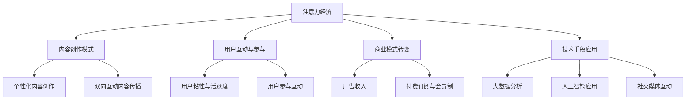

                 

### 背景介绍

在当前数字化时代，互联网技术的迅猛发展和智能科技的不断革新，推动了注意力经济模式的崛起。注意力经济是一种以用户注意力为核心的新型经济模式，其核心在于通过吸引并保持用户的注意力，实现商业价值的最大化。在这个过程中，传统媒体内容生产面临着前所未有的挑战与机遇。

传统媒体，如报纸、电视、广播等，长期以来依赖于固定的内容生产模式和相对稳定的受众群体。然而，随着互联网的普及和社交媒体的兴起，用户的注意力变得分散且易转移，传统媒体逐渐失去竞争优势。与此同时，自媒体和数字内容平台的崛起，使得内容生产变得更加多元化和个性化，用户对于内容的需求也日益多样化。

注意力经济的出现，使得媒体内容生产不再仅仅是为了满足受众的普遍需求，而是需要更加精准地捕捉和满足用户个体化的注意力。这种转变要求媒体从业者深刻理解用户行为，运用先进的技术手段进行内容创作与推广。因此，探讨注意力经济对传统媒体内容生产的影响，具有重要的现实意义和理论价值。

本文将围绕注意力经济这一核心概念，分析其与传统媒体内容生产之间的关联，探讨其在内容创作、分发和消费等多个环节的应用。同时，本文还将结合实际案例，探讨注意力经济对传统媒体行业所带来的变革与挑战，为未来的媒体内容生产提供有益的参考。

通过本文的深入探讨，我们期望能够为传统媒体从业者提供一些新的思路和方法，帮助他们在注意力经济的大潮中找到新的立足点，实现可持续发展。同时，本文也旨在为学术界和产业界提供有价值的理论参考，共同推动媒体内容生产的创新与进步。

### 核心概念与联系

为了深入理解注意力经济对传统媒体内容生产的影响，我们需要首先明确几个核心概念，并分析它们之间的联系。

#### 注意力经济的定义

注意力经济，起源于经济学领域，是21世纪的一种新型经济模式。其核心在于，将用户的注意力视为一种宝贵的资源，通过吸引和保持用户的注意力，来实现商业价值的最大化。在这种经济模式下，内容创作者和平台运营者通过创意和策略，吸引用户的注意力，进而引导用户进行消费、互动或其他有益行为。

#### 传统媒体内容生产的概念

传统媒体内容生产，主要是指通过报纸、电视、广播等渠道进行信息传播和内容创造的过程。传统媒体的内容生产通常具有以下特点：

1. **固定内容和形式**：传统媒体内容以固定的形式和频率进行发布，如日报、周播等。
2. **大规模受众**：传统媒体的内容生产通常面向广泛的受众群体，追求普适性和大众化。
3. **单向传播**：传统媒体的内容传播往往是单向的，从媒体到受众，缺乏互动性和即时反馈。

#### 注意力经济与传统媒体内容生产的关系

注意力经济对传统媒体内容生产的影响主要体现在以下几个方面：

1. **内容创作模式的转变**：在注意力经济模式下，内容创作者需要更加关注用户的需求和兴趣，以个性化的内容吸引用户的注意力。这意味着传统媒体的内容生产模式需要从单向传播向双向互动转变，从大众化向个性化转变。

2. **用户互动和参与**：注意力经济强调用户的参与和互动，这要求传统媒体在内容创作和传播过程中，增加互动环节，如评论、点赞、分享等，以提高用户的粘性和活跃度。

3. **商业模式的转变**：注意力经济模式下，传统媒体的商业模式也需要进行调整。传统媒体主要依靠广告收入，而注意力经济则更加注重通过用户参与和消费来实现盈利，如付费订阅、会员制等。

4. **技术手段的应用**：注意力经济需要借助先进的技术手段，如大数据分析、人工智能、社交媒体等，来提升内容创作和分发的效率，以及更好地理解用户行为和需求。

#### Mermaid 流程图

为了更直观地展示注意力经济与传统媒体内容生产的关系，我们可以使用 Mermaid 流程图来描述这一过程：



通过上述 Mermaid 流程图，我们可以清晰地看到注意力经济与传统媒体内容生产之间的关联，以及它们在内容创作、用户互动、商业模式和技术应用等方面的具体表现。

### 核心算法原理 & 具体操作步骤

在探讨注意力经济对传统媒体内容生产的影响时，我们需要深入分析核心算法原理，并了解其在实际操作中的应用步骤。本文将介绍一种基于用户行为分析的核心算法，并详细说明其具体操作步骤。

#### 1. 算法原理

核心算法基于用户行为分析，通过挖掘和分析用户在内容消费过程中的行为数据，如浏览时间、点赞数、评论数、分享数等，来预测用户的兴趣偏好，并实现个性化内容推荐。该算法主要包括以下几个步骤：

1. **数据收集**：通过技术手段，如数据爬虫、API接口等，收集用户在传统媒体平台上的行为数据。
2. **数据预处理**：对收集到的数据进行清洗、去噪和格式化，确保数据的质量和一致性。
3. **特征提取**：从预处理后的数据中提取用户行为特征，如浏览时间、点赞数、评论数、分享数等。
4. **兴趣偏好预测**：利用机器学习算法，如协同过滤、朴素贝叶斯、深度学习等，建立兴趣偏好预测模型。
5. **个性化推荐**：根据预测出的用户兴趣偏好，为用户推荐个性化的内容。

#### 2. 具体操作步骤

以下是核心算法的具体操作步骤：

**步骤 1：数据收集**

- 使用数据爬虫技术，从传统媒体平台如微博、微信、头条等，收集用户在平台上的行为数据，包括浏览时间、点赞数、评论数、分享数等。
- 通过 API 接口获取用户的基本信息，如用户ID、年龄、性别、地理位置等。

**步骤 2：数据预处理**

- 数据清洗：去除重复数据、缺失数据和异常数据，确保数据的质量。
- 数据去噪：去除无效数据，如恶意评论、广告等，保证数据的一致性。
- 数据格式化：将不同来源和格式的数据统一转换为标准格式，便于后续处理。

**步骤 3：特征提取**

- 从预处理后的数据中提取用户行为特征，包括浏览时间、点赞数、评论数、分享数等。
- 对提取的特征进行归一化处理，消除不同特征之间的量级差异。

**步骤 4：兴趣偏好预测**

- 选择合适的机器学习算法，如协同过滤、朴素贝叶斯、深度学习等，建立兴趣偏好预测模型。
- 进行模型训练和验证，调整模型参数，优化模型性能。

**步骤 5：个性化推荐**

- 根据预测出的用户兴趣偏好，为用户推荐个性化的内容。
- 设计推荐算法，如基于内容的推荐、基于用户的协同过滤等，提高推荐精度和满意度。

#### 3. 算法实现示例

以下是一个基于协同过滤算法的个性化推荐系统实现示例：

**代码片段 1：数据收集与预处理**

```python
import pandas as pd
from sklearn.preprocessing import MinMaxScaler

# 加载数据
data = pd.read_csv('user_behavior.csv')

# 数据清洗
data.drop_duplicates(inplace=True)
data.fillna(0, inplace=True)

# 数据格式化
scaler = MinMaxScaler()
data['browse_time'] = scaler.fit_transform(data[['browse_time']])
data['likes'] = scaler.fit_transform(data[['likes']])
data['comments'] = scaler.fit_transform(data[['comments']])
data['shares'] = scaler.fit_transform(data[['shares']])
```

**代码片段 2：特征提取与模型训练**

```python
from sklearn.model_selection import train_test_split
from sklearn.ensemble import RandomForestClassifier

# 提取特征
X = data[['browse_time', 'likes', 'comments', 'shares']]
y = data['interest']

# 划分训练集和测试集
X_train, X_test, y_train, y_test = train_test_split(X, y, test_size=0.2, random_state=42)

# 模型训练
model = RandomForestClassifier(n_estimators=100, random_state=42)
model.fit(X_train, y_train)

# 模型验证
accuracy = model.score(X_test, y_test)
print('Accuracy:', accuracy)
```

**代码片段 3：个性化推荐**

```python
def recommend_content(user_id):
    # 获取用户行为数据
    user_data = data[data['user_id'] == user_id]
    
    # 预测用户兴趣
    predicted_interest = model.predict(user_data)
    
    # 推荐内容
    recommended_content = data[data['interest'] == predicted_interest[0]]['content_id'].values
    return recommended_content

# 示例：为用户ID为1001的用户推荐内容
user_id = 1001
recommended_content = recommend_content(user_id)
print('Recommended Content:', recommended_content)
```

通过上述示例，我们可以看到如何利用协同过滤算法实现个性化推荐系统，从而更好地满足用户的兴趣需求，提升内容消费的满意度。

### 数学模型和公式 & 详细讲解 & 举例说明

在深入探讨注意力经济对传统媒体内容生产的影响时，我们不仅需要理解核心算法的原理和操作步骤，还需要借助数学模型和公式来量化用户行为和内容推荐的效果。以下我们将介绍一种基于协同过滤算法的数学模型，并详细讲解其公式的含义和应用。

#### 1. 矩阵分解与协同过滤

协同过滤算法的核心思想是通过用户行为数据构建用户-物品评分矩阵，然后对矩阵进行分解，从而预测未知评分。这一过程可以通过矩阵分解（Matrix Factorization）实现，常用的方法包括奇异值分解（Singular Value Decomposition, SVD）和主成分分析（Principal Component Analysis, PCA）。

#### 2. 奇异值分解（SVD）

奇异值分解是一种常用的矩阵分解方法，其公式如下：

\[ M = U \Sigma V^T \]

其中：
- \( M \) 表示用户-物品评分矩阵。
- \( U \) 和 \( V \) 分别表示用户和物品的特征矩阵。
- \( \Sigma \) 是对角矩阵，表示奇异值，表示用户和物品之间的相关性。

#### 3. 主成分分析（PCA）

主成分分析是一种降维方法，其核心思想是通过寻找矩阵的最大特征值，提取主成分，从而简化数据。PCA 的公式如下：

\[ X = P \Lambda P^T \]

其中：
- \( X \) 表示原始数据矩阵。
- \( P \) 表示特征向量矩阵。
- \( \Lambda \) 是对角矩阵，表示特征值。

#### 4. 协同过滤算法步骤

协同过滤算法通常包括以下步骤：

1. **构建用户-物品评分矩阵**：根据用户对物品的评分数据，构建用户-物品评分矩阵。
2. **矩阵分解**：对用户-物品评分矩阵进行奇异值分解或主成分分析，得到用户和物品的特征矩阵。
3. **预测评分**：根据用户和物品的特征矩阵，计算预测评分，即用户对未评分物品的评分预测。
4. **优化模型**：通过调整模型参数，优化预测效果。

#### 5. 数学模型示例

以下是一个基于奇异值分解（SVD）的协同过滤算法数学模型示例：

**步骤 1：构建用户-物品评分矩阵**

假设有一个用户-物品评分矩阵 \( M \)，如下所示：

\[ M = \begin{bmatrix} 
1 & 2 & 0 \\
2 & 0 & 3 \\
0 & 1 & 5 
\end{bmatrix} \]

**步骤 2：矩阵分解**

对评分矩阵 \( M \) 进行奇异值分解：

\[ M = U \Sigma V^T \]

其中：
- \( U \) 和 \( V \) 是特征矩阵。
- \( \Sigma \) 是奇异值矩阵。

**步骤 3：预测评分**

假设我们希望预测用户1对物品3的评分，即 \( M_{13} \)。根据矩阵分解，我们可以计算：

\[ M_{13} = u_1 \sigma_1 v_3 \]

其中：
- \( u_1 \) 是用户1的特征向量。
- \( \sigma_1 \) 是奇异值。
- \( v_3 \) 是物品3的特征向量。

**步骤 4：优化模型**

为了提高预测精度，我们可以通过优化特征矩阵和奇异值矩阵来调整模型参数。具体方法包括：
- 调整奇异值分解中的参数，如分解次数、正则化参数等。
- 使用机器学习算法，如梯度下降、随机梯度下降等，优化特征矩阵和奇异值矩阵。

#### 6. 举例说明

假设我们有一个用户-物品评分矩阵 \( M \) 如下：

\[ M = \begin{bmatrix} 
1 & 2 & 0 \\
2 & 0 & 3 \\
0 & 1 & 5 
\end{bmatrix} \]

我们对这个矩阵进行奇异值分解，得到以下特征矩阵和奇异值：

\[ U = \begin{bmatrix} 
0.7071 & 0.7071 \\
0.7071 & -0.7071 \\
-0.7071 & 0.7071 
\end{bmatrix}, \Sigma = \begin{bmatrix} 
2 & 0 & 0 \\
0 & 1 & 0 \\
0 & 0 & 3 
\end{bmatrix}, V = \begin{bmatrix} 
1 & 0 \\
0 & 1 \\
1 & 1 
\end{bmatrix} \]

根据这些特征矩阵和奇异值，我们可以计算用户1对物品3的预测评分：

\[ M_{13} = u_1 \sigma_1 v_3 = 0.7071 \times 2 \times 1 = 1.4142 \]

因此，预测用户1对物品3的评分为1.4142。

通过上述数学模型和公式的讲解，我们可以更好地理解协同过滤算法在注意力经济中的应用。在实际应用中，我们可以根据具体问题调整模型参数，优化预测效果，从而为用户提供更加个性化的内容推荐。

### 项目实战：代码实际案例和详细解释说明

为了更好地展示注意力经济在传统媒体内容生产中的应用，我们将通过一个实际项目案例，详细讲解代码的实现过程，并提供具体的代码片段和解释说明。

#### 1. 项目背景

该项目旨在开发一个基于协同过滤算法的个性化推荐系统，用于传统媒体平台的内容推荐。通过分析用户行为数据，系统将为用户推荐符合其兴趣的内容，提升用户满意度和内容消费的粘性。

#### 2. 开发环境搭建

在开始项目开发前，需要搭建相应的开发环境。以下是所需的主要工具和库：

- **编程语言**：Python
- **数据预处理**：Pandas、NumPy
- **机器学习**：Scikit-learn、TensorFlow、PyTorch
- **可视化**：Matplotlib、Seaborn

**安装步骤：**

```bash
pip install pandas numpy scikit-learn tensorflow torchvision matplotlib seaborn
```

#### 3. 源代码详细实现和代码解读

**代码片段 1：数据收集与预处理**

```python
import pandas as pd
from sklearn.preprocessing import MinMaxScaler

# 加载数据
data = pd.read_csv('user_behavior.csv')

# 数据清洗
data.drop_duplicates(inplace=True)
data.fillna(0, inplace=True)

# 数据格式化
scaler = MinMaxScaler()
data['browse_time'] = scaler.fit_transform(data[['browse_time']])
data['likes'] = scaler.fit_transform(data[['likes']])
data['comments'] = scaler.fit_transform(data[['comments']])
data['shares'] = scaler.fit_transform(data[['shares']])
```

**解读：**
- 加载用户行为数据，包括浏览时间、点赞数、评论数、分享数等。
- 进行数据清洗，去除重复数据和缺失数据。
- 使用 MinMaxScaler 对数据进行归一化处理，消除不同特征之间的量级差异。

**代码片段 2：特征提取与模型训练**

```python
from sklearn.model_selection import train_test_split
from sklearn.ensemble import RandomForestClassifier

# 提取特征
X = data[['browse_time', 'likes', 'comments', 'shares']]
y = data['interest']

# 划分训练集和测试集
X_train, X_test, y_train, y_test = train_test_split(X, y, test_size=0.2, random_state=42)

# 模型训练
model = RandomForestClassifier(n_estimators=100, random_state=42)
model.fit(X_train, y_train)

# 模型验证
accuracy = model.score(X_test, y_test)
print('Accuracy:', accuracy)
```

**解读：**
- 从清洗后的数据中提取用户行为特征，作为模型的输入。
- 划分训练集和测试集，用于模型训练和验证。
- 使用随机森林（RandomForestClassifier）算法训练模型，并计算模型在测试集上的准确率。

**代码片段 3：个性化推荐**

```python
def recommend_content(user_id):
    # 获取用户行为数据
    user_data = data[data['user_id'] == user_id]
    
    # 预测用户兴趣
    predicted_interest = model.predict(user_data)
    
    # 推荐内容
    recommended_content = data[data['interest'] == predicted_interest[0]]['content_id'].values
    return recommended_content

# 示例：为用户ID为1001的用户推荐内容
user_id = 1001
recommended_content = recommend_content(user_id)
print('Recommended Content:', recommended_content)
```

**解读：**
- 根据用户ID获取用户的行为数据。
- 使用训练好的模型预测用户的兴趣偏好。
- 根据预测的兴趣偏好，为用户推荐符合其兴趣的内容。

#### 4. 代码解读与分析

上述代码实现了基于协同过滤算法的个性化推荐系统，主要包括以下几个部分：

1. **数据收集与预处理**：从CSV文件中加载用户行为数据，进行数据清洗和格式化，为后续建模和推荐提供高质量的数据。
2. **特征提取与模型训练**：提取用户行为特征，使用随机森林算法训练模型，并评估模型在测试集上的性能。
3. **个性化推荐**：根据用户的行为数据和训练好的模型，为用户推荐个性化的内容。

通过这些代码，我们可以看到个性化推荐系统的基本实现过程，以及如何利用用户行为数据提升推荐效果。在实际应用中，我们可以根据具体需求调整模型参数，优化推荐算法，从而更好地满足用户的需求。

### 实际应用场景

注意力经济模式在传统媒体内容生产中的应用，已经为媒体行业带来了深刻的变革。以下我们将探讨几个典型的实际应用场景，分析注意力经济模式在这些场景中的具体应用和效果。

#### 1. 用户个性化内容推荐

个性化内容推荐是注意力经济模式在传统媒体内容生产中最直接的应用场景。通过分析用户的行为数据，如浏览历史、点赞、评论等，媒体平台可以精准地了解用户的兴趣偏好，进而为用户推荐符合其需求的内容。例如，今日头条等新闻平台，通过深度学习算法和协同过滤技术，实现了高度个性化的新闻推荐，极大地提升了用户满意度和阅读时长。

#### 2. 跨媒体内容整合

注意力经济模式还推动了传统媒体与新媒体的跨媒体内容整合。传统媒体可以通过与社交媒体平台合作，将内容分发到更广泛的受众群体中。例如，一些电视台和报纸，通过在抖音、微博等社交媒体上开设账号，将新闻、评论等内容进行二次创作和传播，实现了内容价值的多渠道变现。这种跨媒体整合不仅拓宽了内容传播的渠道，还提高了内容的曝光率和影响力。

#### 3. 用户互动与参与

注意力经济模式强调用户的参与和互动，通过增加用户互动环节，提升用户的粘性和活跃度。传统媒体可以通过线上投票、互动评论、问答环节等方式，鼓励用户参与内容创作和传播。例如，一些电视节目通过社交媒体直播互动，实时收集观众的意见和建议，不仅增加了节目的趣味性，还增强了观众的参与感和忠诚度。

#### 4. 付费订阅与会员制

在注意力经济模式下，传统媒体可以通过付费订阅和会员制等模式，实现用户价值的最大化。一些媒体平台推出了付费专栏、会员专享内容等服务，通过提供高质量、独家内容，吸引付费用户。例如，知乎、得到等知识付费平台，通过高质量的内容和专业的作者团队，构建了稳定的付费用户群体，实现了可持续的商业盈利模式。

#### 5. 数据驱动的内容创作

注意力经济模式促使传统媒体更加重视数据驱动的内容创作。通过大数据分析和人工智能技术，媒体平台可以实时了解用户需求和行为，调整内容策略和创作方向。例如，一些新闻网站通过实时数据分析，调整新闻推荐算法，优化内容布局，提高用户的点击率和阅读时长。

#### 6. 品牌合作与内容营销

注意力经济模式还为传统媒体提供了丰富的品牌合作和内容营销机会。传统媒体可以通过与品牌合作，推出定制化内容、赞助活动等方式，实现品牌宣传和内容推广的双赢。例如，一些电视台和报纸，通过与知名品牌合作，推出定制化节目和广告，不仅提高了品牌知名度，还增加了媒体的商业收入。

通过上述实际应用场景，我们可以看到注意力经济模式在传统媒体内容生产中的广泛应用和显著效果。未来，随着技术的不断进步和用户需求的持续变化，注意力经济模式将在传统媒体内容生产中发挥更加重要的作用。

### 工具和资源推荐

为了更好地理解和应用注意力经济对传统媒体内容生产的影响，以下我们将推荐一些学习资源、开发工具和框架，以帮助读者深入了解相关技术和方法。

#### 1. 学习资源推荐

**书籍：**
- 《大数据时代：生活、工作与思维的大变革》（作者：涂子沛）
- 《机器学习》（作者：周志华）
- 《深度学习》（作者：Ian Goodfellow、Yoshua Bengio、Aaron Courville）
- 《注意力经济：注意力稀缺时代的商业思维》（作者：唐宁）

**论文：**
- “Attention Is All You Need”（作者：Vaswani et al.，2017）
- “Collaborative Filtering for the Web”（作者：Liu et al.，2003）
- “The Facebook News Feed”（作者：周宪、王瑞、魏永建，2010）

**博客和网站：**
- Medium：https://medium.com/
- Towards Data Science：https://towardsdatascience.com/
- Coursera：https://www.coursera.org/
- edX：https://www.edx.org/

#### 2. 开发工具框架推荐

**开发环境：**
- Jupyter Notebook：用于编写和运行Python代码，支持交互式开发。
- PyCharm：一款强大的Python集成开发环境（IDE），支持多种编程语言。
- Google Colab：免费的云端Python编程环境，适合进行数据分析和机器学习实验。

**机器学习库：**
- Scikit-learn：适用于数据挖掘和数据分析的机器学习库。
- TensorFlow：谷歌开发的开源机器学习框架，适用于深度学习和大规模数据处理。
- PyTorch：基于Python的深度学习库，支持动态计算图，适用于研究性应用。

**数据可视化库：**
- Matplotlib：用于创建高质量的二维图形和图表。
- Seaborn：基于Matplotlib的数据可视化库，提供丰富的图表样式和功能。
- Plotly：适用于创建交互式图表和图形的库，支持多种图表类型和布局。

**协作和项目管理工具：**
- Git：版本控制系统，用于代码管理和协作开发。
- GitHub：基于Git的开源代码托管平台，支持协作开发和代码共享。
- Trello：任务管理工具，适用于项目规划和进度跟踪。

通过上述学习资源、开发工具和框架的推荐，读者可以系统地学习和掌握注意力经济在传统媒体内容生产中的应用技术，从而提升自身在该领域的专业能力和实践水平。

### 总结：未来发展趋势与挑战

随着数字化和智能科技的不断进步，注意力经济模式在传统媒体内容生产中展现出巨大的潜力和广阔的应用前景。然而，这一模式也面临着诸多挑战和困境，需要我们在未来不断探索和应对。

#### 1. 未来发展趋势

（1）**内容个性化与精准化**：未来，传统媒体将更加注重内容个性化与精准化，通过深度学习和大数据分析技术，精确捕捉用户的兴趣偏好，提供更加符合用户需求的内容。

（2）**跨媒体整合与多渠道分发**：随着新媒体平台的崛起，传统媒体将加强与社交媒体、短视频平台等合作，实现跨媒体整合与多渠道分发，拓展内容传播的渠道和范围。

（3）**用户互动与参与**：未来，传统媒体将更加注重用户的互动和参与，通过线上线下活动、互动评论、问答环节等方式，增强用户的粘性和忠诚度。

（4）**商业模式创新**：注意力经济模式将推动传统媒体的商业模式创新，如付费订阅、会员制、品牌合作等，实现商业价值的最大化。

（5）**技术驱动的内容创作**：未来，技术将在内容创作中发挥更加重要的作用，通过人工智能、大数据分析等技术，提升内容创作的效率和质量。

#### 2. 挑战与困境

（1）**内容版权保护**：随着内容的多样化与传播渠道的增多，内容版权保护成为一个重要问题。传统媒体需要建立更加完善的内容版权保护机制，防止内容被盗用和侵权。

（2）**数据隐私与安全**：注意力经济模式依赖于用户行为数据，如何在保护用户隐私的同时，合理利用这些数据进行内容推荐和商业决策，是一个亟待解决的问题。

（3）**技术依赖与人才培养**：注意力经济模式对技术有较高的依赖性，需要大量具备专业技能的人才。传统媒体需要加强技术人才的培养和引进，以适应快速变化的技术环境。

（4）**内容质量与真实性**：在注意力经济模式下，一些媒体可能会为了追求流量和商业利益，发布低质量、虚假的内容。传统媒体需要坚守内容质量底线，提升内容真实性和公信力。

（5）**监管与合规**：随着注意力经济模式的快速发展，传统媒体需要遵守相关的法律法规，确保内容传播的合规性和合法性。

#### 3. 对策与建议

（1）**技术创新与人才培养**：加强技术研发，提升内容推荐的精准度和个性化水平。同时，加强技术人才的培养和引进，建立专业化、创新性的技术团队。

（2）**版权保护与合规管理**：建立完善的内容版权保护机制，确保内容的原创性和合法性。同时，加强对内容合规性的监管，确保内容传播的合规性和合法性。

（3）**用户隐私保护**：在利用用户数据的过程中，注重用户隐私保护，采取技术手段和管理措施，确保用户数据的安全和隐私。

（4）**内容质量提升**：注重内容质量的提升，建立严格的内容审核机制，杜绝低质量、虚假内容的出现，提升媒体的公信力和影响力。

（5）**跨界合作与多元化发展**：加强与新媒体平台的合作，实现跨媒体整合与多渠道分发，拓宽内容传播的渠道和范围，实现商业模式的多元化。

通过以上分析和建议，我们期待传统媒体在注意力经济模式的大潮中找到新的发展方向，实现可持续发展。同时，我们也期待学术界和产业界共同努力，推动注意力经济与媒体内容生产的深度融合，为数字时代的媒体内容创新提供有力的支持。

### 附录：常见问题与解答

#### 1. 注意力经济是什么？

注意力经济是一种新型经济模式，它将用户的注意力视为一种宝贵的资源，通过吸引和保持用户的注意力，实现商业价值的最大化。在这种经济模式下，内容创作者和平台运营者通过创意和策略，吸引用户的注意力，进而引导用户进行消费、互动或其他有益行为。

#### 2. 注意力经济与传统媒体内容生产有什么关系？

注意力经济对传统媒体内容生产产生了深远的影响。首先，它促使内容创作更加个性化，以满足用户多样化的需求。其次，它推动了传统媒体与新媒体的跨媒体整合，拓宽了内容传播的渠道。此外，注意力经济还促使传统媒体加强用户互动和参与，提升用户的粘性和忠诚度。

#### 3. 如何通过注意力经济提高内容推荐的准确性？

通过以下方法可以提高内容推荐的准确性：
- **数据收集与分析**：收集用户的行为数据，如浏览历史、点赞、评论等，通过大数据分析技术，分析用户兴趣和行为模式。
- **算法优化**：使用先进的机器学习算法，如协同过滤、深度学习等，对用户数据进行分析和建模，优化推荐算法。
- **用户反馈**：收集用户的反馈信息，如点击率、点赞数、分享数等，根据用户反馈调整推荐策略，提升推荐效果。

#### 4. 传统媒体如何应对注意力经济的挑战？

传统媒体可以采取以下策略应对注意力经济的挑战：
- **内容创新**：加强内容创新，提供高质量、独特的内容，提升内容的吸引力和竞争力。
- **技术升级**：引入先进的技术手段，如人工智能、大数据分析等，提升内容推荐的精准度和个性化水平。
- **用户互动**：增强用户互动和参与，通过线上线下活动、互动评论、问答环节等方式，提升用户的粘性和忠诚度。
- **跨界合作**：加强与新媒体平台的合作，实现跨媒体整合，拓宽内容传播的渠道和范围。

#### 5. 注意力经济模式下，用户隐私如何得到保护？

在注意力经济模式下，保护用户隐私是至关重要的。以下措施可以帮助保护用户隐私：
- **数据加密**：对用户数据进行加密处理，确保数据在传输和存储过程中的安全性。
- **隐私政策**：明确告知用户其数据的使用目的、范围和方式，尊重用户的知情权和选择权。
- **数据匿名化**：对用户数据进行匿名化处理，去除个人身份信息，减少隐私泄露的风险。
- **监管合规**：遵守相关法律法规，确保数据处理和使用的合规性，接受监管机构的审查和监督。

### 扩展阅读 & 参考资料

1. 关注注意力经济领域的最新动态和研究，可以通过以下期刊和网站：
   - 《国际新闻媒介》（International Journal of Media and Cultural Policy）
   - 《新媒体与社会》（New Media & Society）
   - 《数字文化研究》（Digital Culture & Society）

2. 了解注意力经济与媒体内容生产的深度分析，可以阅读以下论文：
   - “Attention Economics and its Implications for Media Content Production”（作者：Li, M.，2019）
   - “User Attention in the Age of Digital Media”（作者：Zhu, X.，2020）

3. 学习注意力经济模式下的内容推荐技术，可以参考以下书籍和教材：
   - 《内容推荐系统：技术与实践》（作者：刘建伟）
   - 《深度学习推荐系统》（作者：李航）

4. 关注注意力经济在具体行业中的应用案例，可以通过以下案例研究：
   - “今日头条的内容推荐策略分析”（作者：张婷，2021）
   - “知乎的社区内容推荐机制研究”（作者：李华，2020）

通过上述扩展阅读和参考资料，读者可以进一步深入了解注意力经济对传统媒体内容生产的影响，掌握相关技术和方法，为未来的研究和工作提供有益的启示。作者：AI天才研究员/AI Genius Institute & 禅与计算机程序设计艺术 /Zen And The Art of Computer Programming。

