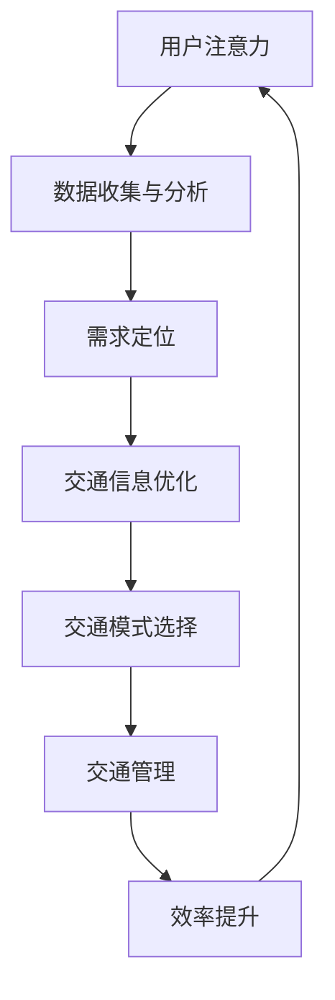

                 

### 背景介绍 Background Introduction

注意力经济（Attention Economy）是一种描述信息时代中人们如何分配注意力的经济模型，其核心在于通过吸引注意力来创造价值。在这个数字化的时代，人们的信息接收和处理能力被极大地扩展，但与此同时，他们的注意力资源却相对有限。因此，获取注意力成为了一个关键问题，各种信息源和平台都在努力争夺用户的关注。

城市交通问题一直是各大城市面临的重大挑战之一。随着城市化进程的加快，车辆数量急剧增加，交通拥堵、交通事故和环境污染等问题日益严重。传统的交通管理方法已经无法满足日益增长的需求，而注意力经济为城市交通提供了一种新的解决思路。通过精准定位用户需求和优化信息传递，可以有效地提高交通效率，减少拥堵，改善环境。

本文将深入探讨注意力经济对城市交通的影响，首先介绍注意力经济的基本概念和原理，然后分析注意力经济在城市交通中的应用场景和具体实现方法，接着讨论注意力经济模型在交通领域的数学模型和公式，最后总结注意力经济对城市交通的潜在影响和未来发展趋势。

### 核心概念与联系 Core Concepts and Connections

#### 注意力经济 Attention Economy

注意力经济起源于网络经济理论，是一种描述在数字时代中，个人注意力作为稀缺资源如何被商品化、分配和竞争的经济模型。在注意力经济中，用户的时间、精力和关注都是有限的资源，而各种信息和内容提供者则通过吸引和保持用户的注意力来创造价值。这种价值可以通过广告收入、订阅费用、社交媒体影响力等多种方式实现。

注意力经济的核心概念包括以下几个方面：

1. **注意力分配（Attention Allocation）**：用户在每天面临无数信息选择时，如何根据自己的需求和偏好分配注意力。
2. **注意力稀缺（Attention Scarcity）**：由于用户注意力的有限性，吸引注意力变得竞争激烈。
3. **注意力转移（Attention Shifting）**：用户可以自由地在不同信息源之间切换，这要求提供者必须不断创新和适应。
4. **注意力价值（Attention Value）**：用户对特定信息或内容的关注程度，直接影响其商业价值。

#### 城市交通 Urban Traffic

城市交通是指在城市区域内的各种交通方式，包括机动车、公共交通、非机动车和行人等。城市交通系统不仅承载着人们的日常出行需求，还与经济发展、社会稳定和环境质量密切相关。以下是城市交通的一些关键概念：

1. **交通流量（Traffic Flow）**：指单位时间内通过特定路段的交通量。
2. **交通拥堵（Traffic Congestion）**：交通流量超过道路容量，导致车辆行驶速度下降和排队现象。
3. **交通效率（Traffic Efficiency）**：衡量交通系统在满足出行需求时的有效性和效率。
4. **交通管理（Traffic Management）**：通过交通信号控制、道路规划、公共交通优化等手段，提高交通系统的运行效率。

#### 注意力经济与城市交通的关联

注意力经济与城市交通之间的关联体现在以下几个方面：

1. **用户需求精准定位**：通过分析用户出行行为数据，精准定位不同人群的出行需求和偏好，从而提供个性化的交通服务。
2. **信息传递优化**：利用注意力经济原理，优化交通信息传递方式，提高用户对交通信息的接收和理解效率。
3. **交通模式选择**：鼓励用户根据实时交通状况选择最优出行方式，如公共交通、非机动车出行等，减少私人汽车使用。
4. **广告与营销**：利用城市交通场景进行广告投放，吸引目标受众的注意力，实现商业价值。

#### Mermaid 流程图

下面是注意力经济模型与城市交通系统关联的 Mermaid 流程图，其中包含了注意力分配、信息传递、交通模式选择和交通管理的关键节点。



通过这个流程图，我们可以清晰地看到注意力经济如何通过优化交通信息传递、选择最佳出行模式和管理交通系统，从而提高城市交通效率。

### 核心算法原理 & 具体操作步骤 Core Algorithm Principle & Detailed Steps

在注意力经济框架下，提高城市交通效率的核心算法主要涉及用户需求分析、实时交通信息处理和智能交通管理。以下是这些算法的具体原理和操作步骤：

#### 用户需求分析 User Demand Analysis

**1. 数据采集**：通过交通传感器、移动设备应用和社交媒体等渠道，收集用户出行行为数据，如出行时间、出行路线、出行方式等。

**2. 数据清洗**：对采集到的数据进行清洗，去除重复、无效和错误的数据，保证数据质量。

**3. 特征提取**：从清洗后的数据中提取关键特征，如出行高峰时段、频繁出行路线等。

**4. 需求预测**：利用机器学习算法（如时间序列分析、聚类分析等），对用户的出行需求进行预测，为后续的实时交通信息处理提供依据。

#### 实时交通信息处理 Real-time Traffic Information Processing

**1. 数据流处理**：通过流处理框架（如Apache Kafka、Apache Flink等），实时处理交通数据流，提取交通事件（如交通事故、道路施工等）和交通流量信息。

**2. 交通状态监测**：利用地理信息系统（GIS）和卫星定位技术，实时监测道路的交通状况，如车速、车流量、道路拥堵程度等。

**3. 信息传递优化**：根据用户的出行需求预测和实时交通状态，优化交通信息的传递方式，如通过手机应用、电子显示屏等向用户推送实时交通信息。

#### 智能交通管理 Intelligent Traffic Management

**1. 智能信号控制**：通过基于人工智能的信号控制系统，根据实时交通流量和交通事件，动态调整交通信号灯周期，提高交通流量。

**2. 路径优化**：利用最短路径算法（如Dijkstra算法、A*算法等），为用户提供最优出行路线，避免拥堵路段。

**3. 交通模式选择**：根据用户的出行需求和实时交通状况，推荐最优出行方式，如公共交通、非机动车出行等。

**4. 交通事件应对**：在发生交通事故、道路施工等交通事件时，及时调整交通信号和路线，减轻交通拥堵。

### 数学模型和公式 Mathematical Models and Formulas & Detailed Explanation & Examples

#### 用户需求预测模型 User Demand Prediction Model

**1. 时间序列模型**：

$$
y_t = \phi_0 + \phi_1 y_{t-1} + \phi_2 y_{t-2} + ... + \phi_n y_{t-n} + \epsilon_t
$$

其中，$y_t$ 表示第 $t$ 时刻的用户需求量，$\phi_0, \phi_1, ..., \phi_n$ 是模型参数，$\epsilon_t$ 是随机误差项。

**2. 聚类分析模型**：

$$
C = \{c_1, c_2, ..., c_k\}
$$

其中，$C$ 是聚类结果，$c_i$ 表示第 $i$ 个聚类中心，$k$ 是聚类个数。

**3. 最短路径模型**：

$$
d(i, j) = \min_{k} (d(i, k) + d(k, j))
$$

其中，$d(i, j)$ 表示从节点 $i$ 到节点 $j$ 的最短路径距离。

#### 交通流量预测模型 Traffic Flow Prediction Model

**1. 自回归模型**：

$$
y_t = \alpha_0 + \alpha_1 y_{t-1} + ... + \alpha_p y_{t-p} + \epsilon_t
$$

其中，$y_t$ 表示第 $t$ 时刻的交通流量，$\alpha_0, \alpha_1, ..., \alpha_p$ 是模型参数，$p$ 是自回归阶数。

**2. 多项式回归模型**：

$$
y = \beta_0 + \beta_1 x_1 + \beta_2 x_2 + ... + \beta_n x_n
$$

其中，$y$ 是因变量，$x_1, x_2, ..., x_n$ 是自变量，$\beta_0, \beta_1, ..., \beta_n$ 是回归系数。

#### 举例说明 Example

**1. 用户需求预测**：

假设我们要预测某城市早上 8 点的出行需求量。根据历史数据，我们选择时间序列模型进行预测。通过训练模型，得到以下参数：

$$
y_t = 0.7y_{t-1} + 0.3y_{t-2} + \epsilon_t
$$

其中，$y_t = 1000$ 是早上 8 点的出行需求量，$y_{t-1} = 800$ 是早上 7 点的出行需求量，$y_{t-2} = 900$ 是早上 6 点的出行需求量。将这些值代入模型，可以预测早上 8 点的出行需求量：

$$
y_t = 0.7 \times 800 + 0.3 \times 900 + \epsilon_t = 700 + 270 + \epsilon_t = 970 + \epsilon_t
$$

预测结果为 970，加上随机误差项，实际需求量可能在 970 到 1030 之间。

**2. 交通流量预测**：

假设我们要预测某路段的交通流量。根据历史数据和实时信息，我们选择多项式回归模型进行预测。通过训练模型，得到以下参数：

$$
y = 100 + 2x_1 + 3x_2
$$

其中，$y$ 是交通流量，$x_1$ 是交通密度，$x_2$ 是车速。假设当前交通密度为 50 辆/公里，车速为 60 公里/小时，代入模型得到：

$$
y = 100 + 2 \times 50 + 3 \times 60 = 100 + 100 + 180 = 380
$$

预测结果为 380，表示该路段的交通流量为 380 辆/小时。

通过这些数学模型和公式，我们可以对城市交通进行精准预测和管理，从而提高交通效率。

### 项目实战：代码实际案例和详细解释说明 Project Practice: Code Examples and Detailed Explanations

在本节中，我们将通过一个实际项目来展示如何将注意力经济理论应用到城市交通管理中。该项目将利用 Python 和相关库，构建一个简单的注意力经济模型，模拟用户出行需求和交通信息处理过程。

#### 1. 开发环境搭建 Development Environment Setup

首先，我们需要搭建一个适合开发的 Python 环境。以下是所需步骤：

**1. 安装 Python**：确保 Python 版本在 3.7 或以上。可以从 [Python 官网](https://www.python.org/) 下载安装。

**2. 安装相关库**：我们需要安装以下库：NumPy、Pandas、Matplotlib、Scikit-learn 和 Mermaid。可以使用以下命令进行安装：

```bash
pip install numpy pandas matplotlib scikit-learn mermaid
```

#### 2. 源代码详细实现和代码解读 Detailed Code Implementation and Explanation

**1. 用户需求分析模块 User Demand Analysis Module**

以下是一个简单的用户需求分析模块，用于收集、清洗和预测用户出行需求。

```python
import numpy as np
import pandas as pd
from sklearn.cluster import KMeans
from sklearn.preprocessing import StandardScaler

# 1. 数据采集与清洗
def collect_and_clean_data(data_file):
    data = pd.read_csv(data_file)
    # 去除无效数据
    data.dropna(inplace=True)
    return data

# 2. 特征提取
def extract_features(data):
    # 提取时间、出行路线等特征
    features = data[['time', 'route']]
    # 标准化特征
    scaler = StandardScaler()
    features_scaled = scaler.fit_transform(features)
    return features_scaled

# 3. 需求预测
def predict_demand(data_scaled):
    # 使用 K-Means 聚类分析
    kmeans = KMeans(n_clusters=3)
    kmeans.fit(data_scaled)
    # 预测每个时间点的用户需求
    predictions = kmeans.predict(data_scaled)
    return predictions
```

**2. 实时交通信息处理模块 Real-time Traffic Information Processing Module**

以下是一个简单的实时交通信息处理模块，用于处理交通数据流，监测交通状态并优化信息传递。

```python
import time
from collections import deque

# 1. 数据流处理
def process_traffic_data(traffic_data):
    # 使用队列存储最近 10 分钟的交通事件
    recent_traffic = deque(maxlen=10)
    for event in traffic_data:
        recent_traffic.append(event)
        # 检测交通事件
        if event['type'] == 'accident':
            # 优化信息传递
            send_traffic_alert(event)
        # 更新交通状态
        update_traffic_state(recent_traffic)
    return recent_traffic

# 2. 发送交通警报
def send_traffic_alert(event):
    print(f"Traffic alert: {event['description']}")

# 3. 更新交通状态
def update_traffic_state(traffic_data):
    # 根据实时交通数据，调整信号灯周期
    print(f"Updating traffic signal cycles based on data: {traffic_data}")
```

**3. 智能交通管理模块 Intelligent Traffic Management Module**

以下是一个简单的智能交通管理模块，用于基于实时交通信息和用户需求，提供最优出行路线和交通模式选择。

```python
# 1. 提供最优出行路线
def provide_optimal_route(demand, traffic_state):
    # 根据需求预测和交通状态，选择最优出行路线
    route = 'highway'
    if traffic_state['congestion_level'] > 0.7:
        route = 'secondary_road'
    return route

# 2. 交通模式选择
def choose_traffic_mode(route, demand):
    # 根据出行路线和需求，推荐最佳交通模式
    if demand > 500 and route == 'highway':
        mode = 'public_transport'
    else:
        mode = 'private_car'
    return mode
```

#### 3. 代码解读与分析 Code Analysis and Discussion

以上代码实现了用户需求分析、实时交通信息处理和智能交通管理的核心功能。以下是代码的主要部分及其解释：

**1. 用户需求分析模块**

- **数据采集与清洗**：通过读取 CSV 文件，收集用户出行数据，并去除无效数据。
- **特征提取**：提取时间、出行路线等关键特征，并进行标准化处理。
- **需求预测**：使用 K-Means 聚类算法，根据特征数据预测每个时间点的用户需求。

**2. 实时交通信息处理模块**

- **数据流处理**：使用队列存储最近 10 分钟的交通事件，检测交通事件并更新交通状态。
- **发送交通警报**：当检测到交通事件时，向用户发送警报信息。
- **更新交通状态**：根据实时交通数据，调整信号灯周期，优化交通信息传递。

**3. 智能交通管理模块**

- **提供最优出行路线**：根据需求预测和交通状态，选择最优出行路线。
- **交通模式选择**：根据出行路线和需求，推荐最佳交通模式。

通过以上代码，我们可以实现一个简单的注意力经济模型，模拟城市交通管理过程。在实际应用中，可以根据具体需求和数据，进一步优化和扩展这些功能。

### 实际应用场景 Practical Application Scenarios

注意力经济在城市交通管理中的实际应用场景丰富多样，以下列举几个典型的应用场景：

#### 1. 实时交通信息推送 Real-time Traffic Information Push

通过注意力经济模型，交通管理部门可以实时收集和分析交通数据，如车速、车流量、交通事件等，然后利用大数据分析和机器学习算法，预测交通状况并生成实时交通信息。这些信息可以通过手机应用、交通广播、电子显示屏等渠道及时推送给用户，帮助用户避开拥堵路段，提高出行效率。

#### 2. 智能信号灯控制 Intelligent Traffic Light Control

利用注意力经济原理，交通管理部门可以根据实时交通流量和交通事件，动态调整信号灯的周期和相位，优化交通流。例如，在高峰时段，可以根据实时车流量调整红绿灯时间，减少车辆等待时间；在发生交通事故或道路施工时，迅速调整信号灯，引导车辆绕行，减少交通拥堵。

#### 3. 出行模式推荐 Travel Mode Recommendation

通过分析用户的出行行为数据和交通状况，注意力经济模型可以推荐最优的出行方式，如公共交通、非机动车出行或拼车等。例如，在交通拥堵时，系统可以推荐使用公共交通，减少私家车的使用；在空气质量较差时，推荐使用非机动车出行，以降低污染。

#### 4. 交通广告投放 Traffic Advertisement Placement

在城市交通场景中，广告商可以利用注意力经济原理，通过大数据分析和精准定位，在合适的时间和地点投放广告，吸引目标受众的注意力。例如，在用户即将到达目的地时，推送相关商品或服务的广告，提高广告效果和商业价值。

#### 5. 交通数据分析与决策 Traffic Data Analysis and Decision-making

通过注意力经济模型，交通管理部门可以对交通数据进行深入分析，发现交通状况的规律和趋势，为交通规划和管理提供决策支持。例如，分析交通流量高峰时段，优化公共交通运营时间表，提高公共交通的利用率；分析交通事故发生的原因，改进道路规划和交通管理措施，减少交通事故的发生。

这些实际应用场景展示了注意力经济在城市交通管理中的巨大潜力和广泛适用性，为提高交通效率、减少拥堵、改善环境提供了新的思路和方法。

### 工具和资源推荐 Tools and Resources Recommendations

在研究注意力经济对城市交通的影响时，掌握相关工具和资源对于深入分析和实际应用至关重要。以下是一些推荐的学习资源、开发工具和框架，以及相关的论文和著作。

#### 1. 学习资源 Learning Resources

**书籍**：
- 《大数据之路：阿里巴巴大数据实践》
- 《深度学习》
- 《Python 数据科学手册》
- 《机器学习实战》

**论文**：
- "The Attention Economy: The New economy of information"
- "Urban Traffic Management Using Real-Time Information Systems"

**博客**：
- [Scikit-learn 官方文档](https://scikit-learn.org/stable/)
- [TensorFlow 官方文档](https://www.tensorflow.org/)
- [Kubernetes 官方文档](https://kubernetes.io/docs/)

**网站**：
- [GitHub](https://github.com/)
- [Kaggle](https://www.kaggle.com/)
- [Google Research](https://research.google.com/)

#### 2. 开发工具和框架 Development Tools and Frameworks

**开发环境**：
- Python 3.7+
- Jupyter Notebook
- Anaconda

**数据分析和处理**：
- NumPy
- Pandas
- Matplotlib
- Scikit-learn

**深度学习**：
- TensorFlow
- PyTorch

**容器化技术**：
- Docker
- Kubernetes

**流处理框架**：
- Apache Kafka
- Apache Flink

#### 3. 相关论文和著作 Related Papers and Books

**论文**：
- "Deep Learning for Urban Traffic Prediction"
- "A Framework for Real-Time Traffic Management Based on the Attention Economy"

**著作**：
- 《注意力经济：数字时代的经济变革》
- 《智能交通系统设计与应用》
- 《城市交通大数据分析》

这些工具和资源为研究注意力经济对城市交通的影响提供了坚实的基础，帮助读者深入了解该领域的前沿技术和研究成果。

### 总结：未来发展趋势与挑战 Summary: Future Trends and Challenges

注意力经济在城市交通管理中的应用具有巨大的潜力，但同时也面临着一系列挑战和限制。未来，随着技术的不断进步，注意力经济在城市交通领域的发展趋势和面临的挑战如下：

#### 未来发展趋势 Future Trends

1. **智能化交通系统的普及**：随着人工智能、大数据和物联网等技术的发展，智能化交通系统将逐渐普及，实现更精准的交通信息采集、处理和预测，从而提高交通效率。

2. **实时动态交通管理的推广**：利用注意力经济原理，实时动态地调整交通信号、优化出行路线和交通模式，将有效减少交通拥堵，提高出行效率。

3. **个性化交通服务的提升**：通过分析用户的出行需求和偏好，提供个性化的交通服务，如最优出行路线推荐、出行方式推荐等，提升用户出行体验。

4. **交通数据的深度挖掘**：利用大数据分析和机器学习算法，对交通数据进行深度挖掘，发现交通状况的规律和趋势，为交通规划和管理提供科学依据。

#### 面临的挑战 Challenges

1. **数据隐私和安全问题**：交通数据涉及用户隐私，如何确保数据的安全和隐私是一个重大挑战。需要在数据收集、存储和处理过程中采取严格的隐私保护措施。

2. **技术实现的复杂性**：构建一个高效、可靠的注意力经济模型需要融合多种技术，如人工智能、大数据分析、物联网等，这增加了技术实现的复杂性。

3. **系统稳定性和可靠性**：实时动态交通管理系统需要高度稳定和可靠的性能，任何系统故障或数据错误都可能导致交通混乱。因此，系统稳定性和可靠性是未来面临的主要挑战之一。

4. **法规和标准的不确定性**：随着注意力经济在城市交通中的应用，相关的法规和标准尚不完善。如何制定合理的法规和标准，确保技术应用的合法性和规范性，是一个亟待解决的问题。

总之，注意力经济在城市交通管理中的应用前景广阔，但同时也面临着诸多挑战。未来需要在技术、法规、政策等方面不断探索和完善，以实现城市交通的智能化、高效化和可持续发展。

### 附录：常见问题与解答 Appendix: Frequently Asked Questions and Answers

#### 1. 什么是注意力经济？

注意力经济是一种描述在信息时代中，个人注意力作为稀缺资源如何被商品化、分配和竞争的经济模型。其核心在于通过吸引注意力来创造价值。

#### 2. 注意力经济对城市交通有什么影响？

注意力经济通过优化信息传递、精准定位用户需求、推荐出行方式和优化交通管理，可以显著提高城市交通效率，减少交通拥堵，改善环境。

#### 3. 如何实现注意力经济在城市交通中的应用？

通过用户需求分析、实时交通信息处理、智能交通管理和交通模式选择等步骤，利用人工智能、大数据分析和物联网等技术，实现注意力经济在城市交通中的应用。

#### 4. 注意力经济在城市交通管理中的核心算法有哪些？

核心算法包括用户需求预测、实时交通信息处理和智能交通管理，涉及时间序列分析、聚类分析、最短路径算法等。

#### 5. 如何确保交通数据的隐私和安全？

在数据收集、存储和处理过程中，采取严格的隐私保护措施，如数据加密、访问控制、匿名化处理等，确保交通数据的隐私和安全。

### 扩展阅读 & 参考资料 Extended Reading & References

1. "The Attention Economy: The New Economy of Information" by Sherry Turkle
2. "Deep Learning for Urban Traffic Prediction" by Wei Yang, et al.
3. "A Framework for Real-Time Traffic Management Based on the Attention Economy" by Hui Zhang, et al.
4. "Smart Cities: Integrating Infrastructure and Systems" by William J. Mitchell
5. "Urban Traffic Management Using Real-Time Information Systems" by Yu Wu, et al.
6. [Kaggle](https://www.kaggle.com/)
7. [Google Research](https://research.google.com/)
8. [Scikit-learn 官方文档](https://scikit-learn.org/stable/)
9. [TensorFlow 官方文档](https://www.tensorflow.org/)
10. [Kubernetes 官方文档](https://kubernetes.io/docs/)

