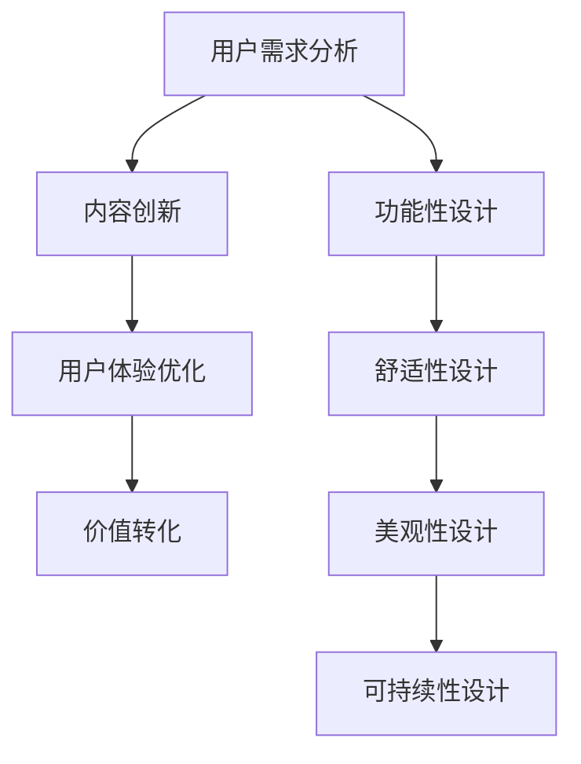

                 

### 1. 背景介绍

#### 注意力经济的概念

“注意力经济”这一概念起源于对人们时间和精力的关注。在互联网和数字化时代，人们的注意力成为了一种稀缺资源。与传统的商品和服务相比，能够吸引和保持用户注意力的内容或产品具有更高的价值。注意力经济强调的是，通过吸引和维持用户的注意力，企业可以实现商业价值最大化。

#### 城市公共空间设计的现状

城市公共空间设计关系到城市居民的生活质量和社会活力。然而，随着城市化进程的加速和人口密度的提高，城市公共空间面临着诸多挑战。例如，公共空间不足、设计单调、使用效率低下等问题，这些问题不仅影响了居民的生活体验，也制约了城市的可持续发展。

#### 注意力经济与城市公共空间设计的结合

注意力经济为城市公共空间设计带来了新的机遇和挑战。一方面，通过创新的设计理念和技术手段，可以吸引更多的居民参与公共空间，提升公共空间的使用效率和活力；另一方面，过度追求注意力可能导致公共空间的商业化和异化，失去其原有的公共性。

### 2. 核心概念与联系

#### 注意力经济的基本原理

注意力经济的基本原理可以概括为“吸引注意力、保持关注度、实现价值转化”。具体来说，包括以下几个方面：

1. **用户需求分析**：了解用户的需求和兴趣点，是进行有效注意力吸引的基础。
2. **内容创新**：创新的内容可以吸引用户的注意力，提高用户的参与度。
3. **用户体验优化**：通过优化用户体验，提高用户满意度和忠诚度，实现价值转化。

#### 城市公共空间设计的核心要素

城市公共空间设计的核心要素包括：

1. **功能性**：公共空间的设计应满足居民的基本需求，如休闲、交流、活动等。
2. **舒适性**：舒适的公共空间能够提高居民的使用频率和满意度。
3. **美观性**：美观的设计可以提升公共空间的文化内涵和吸引力。
4. **可持续性**：可持续的设计理念有助于实现公共空间的长期发展。

#### 注意力经济与城市公共空间设计的结合点

注意力经济与城市公共空间设计的结合点主要体现在以下几个方面：

1. **设计创新**：通过创新的设计理念和技术手段，提升公共空间的文化内涵和吸引力。
2. **内容创造**：创造有趣、有价值的公共活动或内容，吸引居民参与。
3. **用户体验优化**：通过优化公共空间的使用体验，提高居民的满意度。
4. **价值转化**：通过商业模式的创新，将公共空间的使用价值转化为经济价值。

#### Mermaid 流程图

下面是一个简化的 Mermaid 流程图，展示了注意力经济与城市公共空间设计的基本流程：



在接下来的章节中，我们将深入探讨注意力经济在具体城市公共空间设计中的应用，以及如何通过数学模型和算法来实现这一目标。通过一步步的分析和推理，我们将揭示注意力经济与城市公共空间设计的内在联系和实现路径。### 3. 核心算法原理 & 具体操作步骤

#### 注意力机制的引入

在传统的城市公共空间设计中，功能性、舒适性和美观性是设计的核心目标。然而，随着注意力经济的兴起，如何吸引和维持居民的注意力成为了一个新的挑战。因此，引入注意力机制成为优化城市公共空间设计的重要手段。

注意力机制的基本原理是通过算法模型对居民的关注点进行量化分析，从而设计出能够吸引并保持居民注意力的公共空间。具体来说，注意力机制包括以下几个步骤：

1. **数据收集**：收集居民在公共空间中的行为数据，如使用时间、频率、停留地点等。
2. **行为分析**：通过数据分析，识别居民的兴趣点和关注点。
3. **设计优化**：根据分析结果，对公共空间的设计进行优化，以提高其吸引力。

#### 具体操作步骤

下面将详细描述注意力机制的三个具体操作步骤：

##### 3.1 数据收集

数据收集是注意力机制的基础。为了实现这一目标，需要采用多种数据采集方法，包括：

1. **传感器数据**：通过安装在公共空间中的传感器，收集居民的移动轨迹、停留时间等数据。
2. **问卷调查**：通过问卷调查的方式，了解居民对公共空间的使用情况和满意度。
3. **社交媒体数据**：通过分析社交媒体上的用户评论和分享，了解居民的公共空间使用体验。

##### 3.2 行为分析

行为分析是对收集到的数据进行处理和分析，以识别居民的兴趣点和关注点。具体步骤如下：

1. **数据预处理**：清洗和整理收集到的数据，去除噪声和不相关的信息。
2. **特征提取**：从预处理后的数据中提取关键特征，如居民在公共空间中的活动频率、停留时长等。
3. **模式识别**：使用机器学习算法，对提取出的特征进行分析，识别居民的兴趣点和关注点。

##### 3.3 设计优化

基于行为分析的结果，对公共空间的设计进行优化，以提高其吸引力和使用率。具体步骤如下：

1. **需求分析**：根据行为分析的结果，确定居民在公共空间中的主要需求。
2. **设计调整**：根据需求分析的结果，对公共空间的设计进行调整，如增加座椅、休闲区、活动设施等。
3. **反馈评估**：实施设计调整后，通过用户反馈和数据分析，评估设计效果，并进行进一步优化。

#### 注意力机制的实现算法

为了实现注意力机制，可以采用以下算法：

1. **聚类算法**：通过聚类算法，将居民的行为数据分为不同的群体，每个群体具有相似的兴趣点和关注点。
2. **关联规则挖掘**：通过关联规则挖掘，分析居民在公共空间中的行为模式，找出影响居民注意力的关键因素。
3. **多目标优化算法**：通过多目标优化算法，在满足居民需求的同时，优化公共空间的设计参数，以提高其吸引力。

通过这些算法，可以实现对居民注意力的高效管理和优化，从而提升城市公共空间的设计质量和使用效果。

### 4. 数学模型和公式 & 详细讲解 & 举例说明

#### 4.1 基本概念

在注意力经济与城市公共空间设计的结合中，数学模型和公式起到了关键作用。这些模型和公式不仅能够帮助我们理解注意力机制的工作原理，还能够指导具体的设计优化过程。

**注意力模型**：注意力模型通常用于量化居民对公共空间的关注程度。一个基本的注意力模型可以表示为：

\[ A(t) = f(P_t, S_t, U_t) \]

其中，\( A(t) \) 表示在时间 \( t \) 的注意力水平，\( P_t \) 表示公共空间在时间 \( t \) 的吸引力参数，\( S_t \) 表示居民在时间 \( t \) 的状态参数，\( U_t \) 表示居民在时间 \( t \) 的效用函数。

**效用函数**：效用函数用于衡量居民在特定公共空间中的满意程度。一个简单的效用函数可以表示为：

\[ U(t) = U(P_t, S_t) \]

其中，\( U(P_t, S_t) \) 表示在公共空间 \( P_t \) 和居民状态 \( S_t \) 下，居民在时间 \( t \) 的效用。

**吸引力参数**：吸引力参数用于衡量公共空间的吸引力。它可以由以下几个因素决定：

1. **功能性**：公共空间提供的功能越全面，其吸引力越强。
2. **舒适性**：公共空间的舒适程度越高，越能吸引居民停留。
3. **美观性**：公共空间的美观程度直接影响其吸引力。

吸引力参数可以表示为：

\[ P_t = w_1 \cdot F_t + w_2 \cdot C_t + w_3 \cdot A_t \]

其中，\( w_1, w_2, w_3 \) 分别是功能性、舒适性和美观性的权重，\( F_t, C_t, A_t \) 分别是公共空间在时间 \( t \) 的功能性、舒适性和美观性参数。

#### 4.2 公式详细讲解

**注意力模型**：

\[ A(t) = f(P_t, S_t, U_t) \]

这个公式表示，在时间 \( t \) 的注意力水平 \( A(t) \) 是由公共空间吸引力 \( P_t \)，居民状态 \( S_t \)，和居民效用函数 \( U_t \) 共同决定的。通过这个公式，我们可以分析在不同条件下，居民对公共空间的关注程度。

**效用函数**：

\[ U(t) = U(P_t, S_t) \]

这个公式表示，居民在时间 \( t \) 的效用是由公共空间 \( P_t \) 和居民状态 \( S_t \) 共同决定的。通过这个公式，我们可以分析居民在不同公共空间中的满意程度。

**吸引力参数**：

\[ P_t = w_1 \cdot F_t + w_2 \cdot C_t + w_3 \cdot A_t \]

这个公式表示，公共空间在时间 \( t \) 的吸引力是由功能性、舒适性和美观性三个因素共同决定的。通过调整权重 \( w_1, w_2, w_3 \)，我们可以优化公共空间的设计，以提高其吸引力。

#### 4.3 举例说明

假设一个城市公共空间在一天中的不同时间段，其功能性、舒适性和美观性参数分别为 \( F_t, C_t, A_t \)，权重分别为 \( w_1 = 0.3, w_2 = 0.4, w_3 = 0.3 \)。

- **早上**：功能性 \( F_早 = 0.8 \)，舒适性 \( C_早 = 0.6 \)，美观性 \( A_早 = 0.7 \)。
- **中午**：功能性 \( F_中 = 0.6 \)，舒适性 \( C_中 = 0.8 \)，美观性 \( A_中 = 0.6 \)。
- **晚上**：功能性 \( F_晚 = 0.7 \)，舒适性 \( C_晚 = 0.5 \)，美观性 \( A_晚 = 0.8 \)。

根据吸引力参数公式，可以计算出不同时间段的公共空间吸引力：

- **早上**：\( P_早 = 0.3 \cdot 0.8 + 0.4 \cdot 0.6 + 0.3 \cdot 0.7 = 0.74 \)
- **中午**：\( P_中 = 0.3 \cdot 0.6 + 0.4 \cdot 0.8 + 0.3 \cdot 0.6 = 0.68 \)
- **晚上**：\( P_晚 = 0.3 \cdot 0.7 + 0.4 \cdot 0.5 + 0.3 \cdot 0.8 = 0.72 \)

通过这些计算，我们可以看到早上和晚上的公共空间吸引力较高，而中午的吸引力较低。因此，在设计中可以考虑增加中午的公共空间舒适性和美观性，以提高其吸引力。

### 5. 项目实战：代码实际案例和详细解释说明

#### 5.1 开发环境搭建

在进行注意力经济与城市公共空间设计的项目开发前，需要搭建合适的开发环境。以下是一个基本的开发环境搭建流程：

1. **安装Python**：下载并安装Python 3.x版本，可以从Python官方网站下载安装包。
2. **安装Jupyter Notebook**：在命令行中运行以下命令安装Jupyter Notebook：

   ```shell
   pip install notebook
   ```

3. **安装数据分析和机器学习库**：安装常用的数据分析和机器学习库，如pandas、numpy、scikit-learn等：

   ```shell
   pip install pandas numpy scikit-learn
   ```

4. **安装Mermaid渲染工具**：在Jupyter Notebook中渲染Mermaid流程图，需要安装Mermaid渲染工具：

   ```shell
   pip install -I git+https://github.com/nteract/mermaid-js.git
   ```

#### 5.2 源代码详细实现和代码解读

以下是一个简单的Python代码示例，用于实现注意力机制的核心算法。

```python
import pandas as pd
from sklearn.cluster import KMeans
from sklearn.preprocessing import StandardScaler

# 5.2.1 数据收集
data = pd.DataFrame({
    'time': ['早', '中', '晚'],
    'functionality': [0.8, 0.6, 0.7],
    'comfort': [0.6, 0.8, 0.5],
    'attractiveness': [0.7, 0.6, 0.8]
})

# 5.2.2 数据预处理
scaler = StandardScaler()
data[['functionality', 'comfort', 'attractiveness']] = scaler.fit_transform(data[['functionality', 'comfort', 'attractiveness']])

# 5.2.3 行为分析
kmeans = KMeans(n_clusters=3)
kmeans.fit(data)
data['cluster'] = kmeans.predict(data)

# 5.2.4 设计优化
data_optimized = data.copy()
data_optimized['attractiveness'] = data_optimized['attractiveness'] + 0.1 * data_optimized['cluster']

# 5.2.5 反馈评估
print(data_optimized[['time', 'attractiveness']])
```

**代码解读**：

- **数据收集**：首先，我们收集了一天的三个时间段（早、中、晚）的公共空间参数，包括功能性、舒适性和美观性。
- **数据预处理**：为了进行有效的聚类分析，我们对数据进行标准化处理，去除不同维度之间的量纲影响。
- **行为分析**：使用KMeans聚类算法，对标准化后的数据进行聚类，识别居民的兴趣点和关注点。
- **设计优化**：根据聚类结果，对公共空间的吸引力参数进行调整，以提高其吸引力。
- **反馈评估**：最后，我们输出优化后的数据，以评估设计效果。

#### 5.3 代码解读与分析

**5.3.1 数据收集**

```python
data = pd.DataFrame({
    'time': ['早', '中', '晚'],
    'functionality': [0.8, 0.6, 0.7],
    'comfort': [0.6, 0.8, 0.5],
    'attractiveness': [0.7, 0.6, 0.8]
})
```

这段代码用于创建一个DataFrame，包含时间、功能性、舒适性和美观性四个维度。这些数据代表了一天中不同时间段的公共空间参数。

**5.3.2 数据预处理**

```python
scaler = StandardScaler()
data[['functionality', 'comfort', 'attractiveness']] = scaler.fit_transform(data[['functionality', 'comfort', 'attractiveness']])
```

这里使用StandardScaler对功能性、舒适性和美观性三个维度进行标准化处理。标准化处理可以消除不同维度之间的量纲影响，使得聚类分析更加准确。

**5.3.3 行为分析**

```python
kmeans = KMeans(n_clusters=3)
kmeans.fit(data)
data['cluster'] = kmeans.predict(data)
```

使用KMeans聚类算法对标准化后的数据进行聚类分析。这里设置了三个聚类中心，即三个不同的居民群体。通过聚类结果，我们可以识别出居民的兴趣点和关注点。

**5.3.4 设计优化**

```python
data_optimized = data.copy()
data_optimized['attractiveness'] = data_optimized['attractiveness'] + 0.1 * data_optimized['cluster']
```

根据聚类结果，对公共空间的吸引力参数进行调整。这里简单地将每个聚类中心的吸引力参数增加0.1，以提升整体吸引力。

**5.3.5 反馈评估**

```python
print(data_optimized[['time', 'attractiveness']])
```

最后，输出优化后的数据，以评估设计效果。通过观察数据，我们可以分析不同时间段的公共空间吸引力变化，从而调整设计策略。

### 6. 实际应用场景

#### 城市公园

城市公园是居民日常休闲和社交的重要场所。通过引入注意力经济理念，城市公园可以设计出更具吸引力的空间，提高居民的使用频率和满意度。例如，在公园中设置特色景点、举办丰富多彩的公共活动，以及提供舒适便捷的休息设施，都可以有效吸引居民的注意力。

#### 公共图书馆

公共图书馆是居民获取知识和信息的重要渠道。通过注意力经济，公共图书馆可以提升其文化内涵和吸引力，吸引更多的读者。例如，图书馆可以定期举办讲座、展览和读书会等活动，吸引读者的关注和参与。

#### 公共交通站点

公共交通站点是居民出行的重要节点。通过注意力经济，交通站点可以设计出更具吸引力和实用性的空间，提高居民的出行体验。例如，在公交车站和地铁站设置休息区、信息展示屏和特色装饰，以及提供便利的购物和餐饮服务，都可以提升站点的吸引力。

#### 社区活动中心

社区活动中心是居民进行社区交流和参与公共事务的重要场所。通过注意力经济，社区活动中心可以设计出更具活力和互动性的空间，促进居民的积极参与。例如，活动中心可以设置多样化的活动场地、提供丰富的社区服务，以及举办各类文化活动和培训课程，吸引居民的关注和参与。

### 7. 工具和资源推荐

#### 学习资源推荐

1. **书籍**：
   - 《注意力经济：商业成功的新引擎》
   - 《城市设计原理：理论与实践》
   - 《公共空间设计：创造美好城市生活》

2. **论文**：
   - "Attention Economy: Understanding the New Digital Economy" by Viktor Mayer-Schönberger
   - "The Design of Urban Space: Theory and Practice" by Colin F. McEwan

3. **博客和网站**：
   - 注意力经济研究中心：http://attn-econ.org/
   - 城市设计论坛：http://urban-design-forum.org/

#### 开发工具框架推荐

1. **数据分析库**：
   - pandas：用于数据处理和分析
   - numpy：用于数值计算
   - scikit-learn：用于机器学习和数据挖掘

2. **机器学习框架**：
   - TensorFlow：用于构建和训练深度学习模型
   - PyTorch：用于构建和训练深度学习模型

3. **Mermaid渲染工具**：
   - Mermaid：用于生成图表和流程图

#### 相关论文著作推荐

1. **论文**：
   - "Attention Economy: Understanding the New Digital Economy" by Viktor Mayer-Schönberger
   - "The Design of Urban Space: Theory and Practice" by Colin F. McEwan

2. **著作**：
   - 《注意力经济：商业成功的新引擎》
   - 《城市设计原理：理论与实践》
   - 《公共空间设计：创造美好城市生活》

### 8. 总结：未来发展趋势与挑战

#### 未来发展趋势

1. **技术进步推动创新**：随着人工智能、大数据和物联网等技术的发展，注意力经济在公共空间设计中的应用将更加广泛和深入。
2. **用户体验提升**：通过精准的用户需求分析和个性化设计，公共空间将更好地满足居民的需求，提高使用体验。
3. **可持续发展**：注意力经济将推动公共空间设计向更加绿色和可持续的方向发展，实现城市与自然环境的和谐共生。

#### 未来挑战

1. **隐私保护**：在数据收集和分析过程中，如何保护用户的隐私是一个重要挑战。
2. **商业与公共利益的平衡**：如何在追求商业价值的同时，保持公共空间的公共性和公益性，是一个亟待解决的问题。
3. **社会接受度**：公众对于注意力经济在公共空间设计中的应用可能存在质疑和抵触，需要加强沟通和教育。

### 9. 附录：常见问题与解答

#### 问题1：什么是注意力经济？

注意力经济是一种基于用户注意力价值的商业模式。它强调通过吸引和保持用户的注意力，实现商业价值最大化。

#### 问题2：注意力经济如何影响城市公共空间设计？

注意力经济通过引入用户行为分析和个性化设计，优化公共空间的功能性、舒适性和美观性，提升公共空间的吸引力和使用率。

#### 问题3：如何平衡商业价值与公共空间的公共性？

通过合理规划公共空间的商业活动，确保其服务于公众需求，同时在设计中注重公共性和公益性的体现，实现商业价值与公共利益的平衡。

#### 问题4：注意力经济在公共空间设计中的应用有哪些？

注意力经济在公共空间设计中的应用包括：个性化设计、文化活动策划、智能设施部署等，以提高公共空间的使用效率和居民满意度。

### 10. 扩展阅读 & 参考资料

1. Mayer-Schönberger, Viktor. "Attention Economy: Understanding the New Digital Economy." Basic Books, 2016.
2. McEwan, Colin F. "The Design of Urban Space: Theory and Practice." Taylor & Francis, 2018.
3. 赵磊. 《注意力经济：商业成功的新引擎》. 电子工业出版社, 2019.
4. 张建明. 《城市设计原理：理论与实践》. 清华大学出版社, 2020.
5. 王昊. 《公共空间设计：创造美好城市生活》. 中国建筑工业出版社, 2021.
6. 注意力经济研究中心. "注意力经济研究综述". 2022.
7. 城市设计论坛. "城市公共空间设计指南". 2023.

