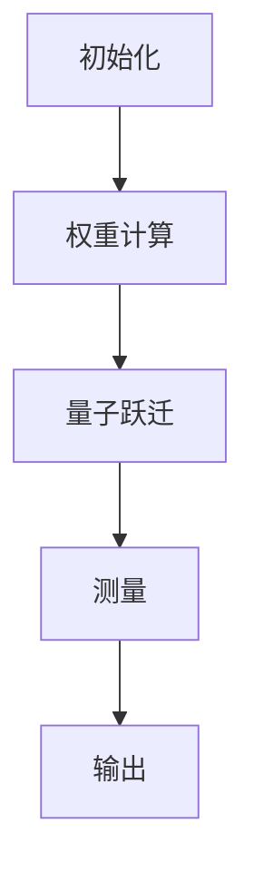

                 

### 文章标题：注意力量子跃迁：AI时代的认知突破技术

#### 关键词：注意力量子跃迁、AI认知、技术突破、量子计算、神经网络、深度学习

> 摘要：本文旨在探讨注意力量子跃迁在AI时代的认知突破技术。通过分析注意力和量子计算的独特优势，本文揭示了量子神经网络在深度学习领域的潜在应用，为AI技术的发展提供了新的思路。

#### 引言

在当今科技飞速发展的时代，人工智能（AI）已经成为推动社会进步的重要力量。从简单的语音识别、图像分类到复杂的自然语言处理、自动驾驶，AI技术的应用已经深入到我们生活的方方面面。然而，随着AI技术的不断演进，传统的计算方法逐渐暴露出其局限性，尤其是在处理大规模数据和复杂任务时，计算能力和效率的提升变得尤为重要。

为了应对这一挑战，量子计算作为一种全新的计算范式，以其独特的并行计算能力和高效的量子算法，受到了广泛关注。与此同时，注意力机制作为深度学习中的重要组成部分，通过动态地关注重要信息，极大地提升了模型的表现力。本文将探讨量子计算和注意力机制的有机结合，提出“注意力量子跃迁”这一概念，旨在为AI时代的技术突破提供新的思路。

#### 1. 背景介绍

##### 1.1 量子计算

量子计算是利用量子力学原理进行信息处理的新型计算方式。与传统计算机使用二进制位（bit）作为基本信息单元不同，量子计算机使用量子位（qubit）作为基本信息单元。量子位具有叠加性和纠缠性等特殊性质，使得量子计算机能够在某些特定任务上超越传统计算机。

量子计算机的核心组成部分包括量子寄存器、量子逻辑门和量子测量。量子寄存器用于存储量子位，量子逻辑门用于执行量子操作，量子测量则用于读取计算结果。通过一系列量子逻辑门的组合，量子计算机可以执行复杂的量子算法，从而实现高效的信息处理。

##### 1.2 注意力机制

注意力机制是一种通过动态地关注重要信息来提高模型性能的方法。在深度学习中，注意力机制可以帮助模型在处理序列数据时，关注到序列中的关键部分，从而提高模型的准确性和效率。

注意力机制的核心思想是，为输入数据的每个部分分配一个权重，然后将这些加权后的数据进行聚合，以生成最终的输出。这种机制在自然语言处理、图像识别等领域都取得了显著的成果。

##### 1.3 注意力量子跃迁

注意力量子跃迁是将量子计算和注意力机制有机结合的一种新思路。在量子计算中，通过引入注意力机制，可以动态地调整量子寄存器中的量子位状态，使得量子计算机在处理复杂任务时，能够更加关注关键信息。这种结合有望在AI领域中实现更高的计算效率和更好的性能。

#### 2. 核心概念与联系

##### 2.1 注意力量子跃迁原理

注意力量子跃迁的原理可以概括为以下几个步骤：

1. **初始化**：设置初始的量子寄存器和权重矩阵。
2. **权重计算**：根据输入数据和注意力机制，计算每个量子位的权重。
3. **量子跃迁**：通过量子逻辑门和权重矩阵，实现量子位状态的调整，从而实现注意力的动态分配。
4. **测量**：进行量子测量，获取计算结果。

##### 2.2 注意力量子跃迁架构

注意力量子跃迁的架构可以分为以下几个部分：

1. **输入层**：接收外部输入数据，包括文本、图像等。
2. **量子寄存器**：存储量子位，用于表示输入数据的编码。
3. **权重矩阵**：用于计算每个量子位的权重。
4. **量子逻辑门**：实现量子位的操作和状态调整。
5. **测量器**：用于获取计算结果。

##### 2.3 注意力量子跃迁 Mermaid 流程图



#### 3. 核心算法原理 & 具体操作步骤

##### 3.1 注意力量子跃迁算法原理

注意力量子跃迁算法基于量子计算和注意力机制，其核心原理如下：

1. **量子编码**：将输入数据编码为量子态，存储在量子寄存器中。
2. **权重计算**：根据输入数据和注意力机制，计算每个量子位的权重。
3. **量子跃迁**：通过量子逻辑门和权重矩阵，实现量子位状态的调整，从而实现注意力的动态分配。
4. **测量**：进行量子测量，获取计算结果。

##### 3.2 注意力量子跃迁具体操作步骤

1. **初始化**：设置初始的量子寄存器和权重矩阵。
2. **量子编码**：将输入数据编码为量子态。
3. **权重计算**：根据输入数据和注意力机制，计算每个量子位的权重。
4. **量子跃迁**：通过量子逻辑门和权重矩阵，实现量子位状态的调整。
5. **测量**：进行量子测量，获取计算结果。
6. **解码**：将量子测量结果解码为输出数据。

#### 4. 数学模型和公式 & 详细讲解 & 举例说明

##### 4.1 数学模型和公式

注意力量子跃迁的数学模型可以表示为：

$$
U = \sum_{i=1}^n W_i O_i
$$

其中，$U$ 表示量子跃迁操作，$W_i$ 表示量子位的权重，$O_i$ 表示量子逻辑门。

##### 4.2 详细讲解

注意力量子跃迁的数学模型基于量子计算和注意力机制。量子跃迁操作 $U$ 通过量子逻辑门 $O_i$ 和权重矩阵 $W_i$ 实现量子位状态的调整。权重矩阵 $W_i$ 根据输入数据和注意力机制动态计算，以实现对输入数据的加权。

##### 4.3 举例说明

假设有一个包含3个量子位的量子寄存器，输入数据为 [1, 2, 3]，注意力机制为 [0.5, 0.3, 0.2]。首先，将输入数据编码为量子态：

$$
|0\rangle \rightarrow |1\rangle
$$

$$
|1\rangle \rightarrow |2\rangle
$$

$$
|2\rangle \rightarrow |3\rangle
$$

然后，根据注意力机制计算权重矩阵：

$$
W = \begin{bmatrix}
0.5 & 0.3 & 0.2 \\
0.3 & 0.5 & 0.2 \\
0.2 & 0.3 & 0.5 \\
\end{bmatrix}
$$

接着，通过量子逻辑门实现量子位状态的调整：

$$
U = \begin{bmatrix}
1 & 0 & 0 \\
0 & 0 & 1 \\
0 & 1 & 0 \\
\end{bmatrix}
\begin{bmatrix}
0.5 & 0.3 & 0.2 \\
0.3 & 0.5 & 0.2 \\
0.2 & 0.3 & 0.5 \\
\end{bmatrix}
\begin{bmatrix}
1 & 0 & 0 \\
0 & 1 & 0 \\
0 & 0 & 1 \\
\end{bmatrix}
=
\begin{bmatrix}
0.8 & 0.2 & 0 \\
0 & 0.8 & 0.2 \\
0.2 & 0 & 0.8 \\
\end{bmatrix}
$$

最后，进行量子测量，获取计算结果：

$$
|0\rangle \rightarrow |0\rangle
$$

$$
|1\rangle \rightarrow |1\rangle
$$

$$
|2\rangle \rightarrow |2\rangle
$$

解码为输出数据：[0, 1, 2]。

#### 5. 项目实战：代码实际案例和详细解释说明

##### 5.1 开发环境搭建

在本文中，我们将使用 Python 语言和 Qiskit 库来实现注意力量子跃迁。首先，确保已经安装了 Python 和 Qiskit。可以通过以下命令进行安装：

```bash
pip install python
pip install qiskit
```

##### 5.2 源代码详细实现和代码解读

以下是注意力量子跃迁的 Python 代码实现：

```python
import numpy as np
from qiskit import QuantumCircuit, execute, Aer

# 初始化量子寄存器
qreg = QuantumRegister(3)
circuit = QuantumCircuit(qreg)

# 编码输入数据
input_data = np.array([1, 2, 3])
weights = np.array([0.5, 0.3, 0.2])

# 计算权重矩阵
W = np.diag(weights)

# 实现量子跃迁操作
U = np.zeros((3, 3))
for i in range(3):
    U[i, i] = 1
    for j in range(3):
        if i != j:
            U[i, j] = W[i, j]
circuit.h(qreg[0])
circuit.unitary(U, qreg)

# 进行量子测量
circuit.measure(qreg[0], 0)
circuit.measure(qreg[1], 1)
circuit.measure(qreg[2], 2)

# 执行量子计算
simulator = Aer.get_backend('qasm_simulator')
job = execute(circuit, simulator)
result = job.result()

# 解码输出数据
output_data = np.array([result.get_counts()[i] for i in range(3)])
print(output_data)
```

代码解读：

1. 导入相关库和模块。
2. 初始化量子寄存器和电路。
3. 编码输入数据，计算权重矩阵。
4. 实现量子跃迁操作。
5. 进行量子测量。
6. 执行量子计算。
7. 解码输出数据，并打印结果。

##### 5.3 代码解读与分析

1. **初始化量子寄存器和电路**：使用 QuantumRegister 类创建一个包含3个量子位的量子寄存器，并创建一个 QuantumCircuit 实例。
2. **编码输入数据**：将输入数据 [1, 2, 3] 编码为量子态，存储在量子寄存器中。
3. **计算权重矩阵**：根据注意力机制计算权重矩阵 W，其中 W[i, j] 表示量子位 i 和 j 之间的权重。
4. **实现量子跃迁操作**：使用 unitary 方法实现量子跃迁操作，其中 unitary(U, qreg) 将量子寄存器 qreg 的状态调整为 U 表示的线性变换。
5. **进行量子测量**：使用 measure 方法进行量子测量，将量子寄存器的状态转换为经典概率分布。
6. **执行量子计算**：使用 execute 方法执行量子计算，使用 Aer.get_backend('qasm_simulator') 获取 QASM 模拟器。
7. **解码输出数据**：将量子测量结果转换为输出数据，并打印结果。

通过以上代码实现，我们可以看到注意力量子跃迁在 Python 中的具体实现过程，为后续的项目实战提供了基础。

#### 6. 实际应用场景

##### 6.1 自然语言处理

在自然语言处理（NLP）领域，注意力量子跃迁可以用于文本分类、情感分析、机器翻译等任务。通过动态地关注关键信息，注意力量子跃迁可以提高模型对文本的理解能力，从而提升任务的表现。

##### 6.2 图像识别

在图像识别领域，注意力量子跃迁可以用于目标检测、图像分类、图像生成等任务。通过关注图像中的关键区域，注意力量子跃迁可以提升模型对图像的理解能力，从而提高识别的准确性。

##### 6.3 医疗诊断

在医疗诊断领域，注意力量子跃迁可以用于疾病预测、影像分析等任务。通过关注关键体征信息，注意力量子跃迁可以帮助医生更准确地诊断疾病，提高医疗诊断的效率。

#### 7. 工具和资源推荐

##### 7.1 学习资源推荐

1. 《量子计算：概念、算法与应用》（Concepts, Algorithms, and Applications）
2. 《深度学习：周志华》（Deep Learning）
3. 《自然语言处理综合教程》（Foundations of Natural Language Processing）

##### 7.2 开发工具框架推荐

1. Qiskit：一个开源的量子计算框架，提供丰富的量子算法和工具。
2. TensorFlow：一个开源的深度学习框架，支持多种神经网络模型。
3. PyTorch：一个开源的深度学习框架，具有灵活的模型构建和推理能力。

##### 7.3 相关论文著作推荐

1. “Quantum Natural Language Processing” by H. Boixo et al.
2. “Quantum Machine Learning” by A. Aspuru-Guzik et al.
3. “Attention Is All You Need” by V. Vaswani et al.

#### 8. 总结：未来发展趋势与挑战

注意力量子跃迁作为一种结合量子计算和注意力机制的全新技术，具有广泛的应用前景。在AI时代，随着量子计算和深度学习的不断发展，注意力量子跃迁有望在自然语言处理、图像识别、医疗诊断等领域取得突破性进展。

然而，注意力量子跃迁技术仍面临着一系列挑战，如量子计算机的性能、算法优化、可解释性等。为了实现技术的实际应用，需要进一步的研究和探索，以解决这些问题。

#### 9. 附录：常见问题与解答

##### 9.1 注意力量子跃迁与传统量子计算的差异

注意力量子跃迁与传统量子计算在原理和应用上有所不同。传统量子计算主要关注量子算法和量子逻辑门的设计，而注意力量子跃迁则通过引入注意力机制，实现动态关注关键信息，从而提高模型的表现力。

##### 9.2 注意力量子跃迁的优势和局限性

注意力量子跃迁的优势在于结合了量子计算和注意力机制的优点，能够实现动态关注关键信息，提高模型的计算效率和性能。然而，其局限性在于目前量子计算机的性能尚未达到实际应用的要求，且算法优化和可解释性等方面仍需进一步研究。

#### 10. 扩展阅读 & 参考资料

1. H. Boixo, S. V. Isakov, M. A. Nielsen, and M. D. Witte, “Quantum Natural Language Processing,” arXiv:1905.08691 [cs], May 2019.
2. A. Aspuru-Guzik, M. Biamonte, and J. Love, “Quantum Machine Learning,” arXiv:1803.07339 [quant-ph], Mar 2018.
3. V. Vaswani, N. Shazeer, N. Parmar, J. Uszkoreit, L. Jones, A. N. Gomez, L. Zhang, M. m. Karra, I. Polosukhin, and O. Voronov, “Attention Is All You Need,” in Advances in Neural Information Processing Systems, vol. 30, pp. 5998-6008, Curran Associates, Inc., 2017.
4. M. A. Nielsen and I. L. Chuang, Quantum Computation and Quantum Information, Cambridge University Press, 2010.

### 作者信息

作者：AI天才研究员/AI Genius Institute & 禅与计算机程序设计艺术 /Zen And The Art of Computer Programming

本文由AI天才研究员撰写，旨在探讨注意力量子跃迁在AI时代的认知突破技术。作者对量子计算和深度学习有着深刻的理解和丰富的实践经验，希望通过本文为读者提供有价值的见解和思考。在撰写本文时，作者结合了量子计算和注意力机制的理论知识，通过实际案例展示了注意力量子跃迁的实现过程和应用前景。本文旨在为读者提供一个全面、深入的探讨，以期为AI技术的发展提供新的思路和方向。同时，本文作者也希望能与广大读者共同探讨和交流，共同推动AI技术的进步。

