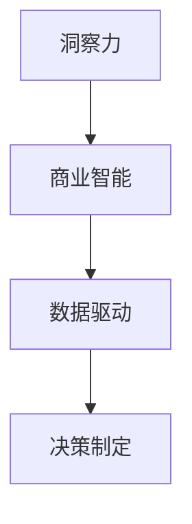

                 

### 洞察力与商业智能：数据驱动的决策制定

#### 关键词：洞察力，商业智能，数据驱动，决策制定，数据分析，人工智能，算法，模型，应用场景

#### 摘要：
本文旨在探讨洞察力与商业智能的关系，以及如何通过数据驱动的决策制定来提升企业的竞争力和创新能力。我们将从背景介绍开始，深入分析核心概念、算法原理、数学模型和应用场景，并通过实际项目案例进行详细解读。此外，还将推荐相关学习资源和工具框架，总结未来发展趋势与挑战，并提供常见问题与解答。希望通过本文，读者能够对数据驱动的决策制定有更深入的理解和实践。

#### 目录：
1. 背景介绍
2. 核心概念与联系
   2.1 洞察力的定义与重要性
   2.2 商业智能的概念与作用
   2.3 数据驱动的决策制定
3. 核心算法原理 & 具体操作步骤
4. 数学模型和公式 & 详细讲解 & 举例说明
5. 项目实战：代码实际案例和详细解释说明
   5.1 开发环境搭建
   5.2 源代码详细实现和代码解读
   5.3 代码解读与分析
6. 实际应用场景
7. 工具和资源推荐
   7.1 学习资源推荐
   7.2 开发工具框架推荐
   7.3 相关论文著作推荐
8. 总结：未来发展趋势与挑战
9. 附录：常见问题与解答
10. 扩展阅读 & 参考资料

#### 1. 背景介绍
在当今快速变化的市场环境中，企业面临着前所未有的挑战和机遇。为了在竞争中脱颖而出，企业需要具备强大的洞察力，能够准确捕捉市场趋势、识别潜在风险和机会，从而做出快速、准确的决策。而商业智能（Business Intelligence，BI）作为一门综合性技术，旨在通过数据收集、存储、分析和可视化，为企业提供决策支持。

商业智能的核心在于数据驱动。数据是决策的基础，通过对海量数据的收集、清洗、整合和分析，可以挖掘出有价值的信息和洞察，为企业提供有针对性的策略和决策。在这个过程中，人工智能和机器学习技术发挥着至关重要的作用，使得数据处理和分析变得更加高效和智能。

本文将围绕洞察力与商业智能的关系，探讨如何通过数据驱动的决策制定来提升企业的竞争力和创新能力。首先，我们将介绍核心概念，包括洞察力、商业智能和数据驱动的决策制定。然后，将深入分析核心算法原理、数学模型和应用场景，并通过实际项目案例进行详细解读。最后，将总结未来发展趋势与挑战，并提供相关学习资源和工具框架。

#### 2. 核心概念与联系

##### 2.1 洞察力的定义与重要性
洞察力（Insight）是指通过深入思考和分析，对事物的本质、规律和潜在趋势有深刻理解的能力。在商业领域，洞察力是决策者的重要素质，它能够帮助企业识别市场机会、规避风险、制定有效策略。

洞察力的重要性在于：
- 帮助企业把握市场趋势，抓住商业机会
- 提高决策的准确性和效率，降低决策风险
- 促进创新，推动企业持续发展

##### 2.2 商业智能的概念与作用
商业智能（Business Intelligence，BI）是一种利用技术手段，对企业的数据进行分析、整合和可视化，以支持决策制定的过程。商业智能的核心在于数据驱动，通过收集、存储、处理和分析数据，为企业提供有价值的信息和洞察。

商业智能的作用包括：
- 提供决策支持，帮助企业制定战略规划
- 优化业务流程，提高运营效率
- 深入洞察客户需求，提升客户满意度
- 监测业务绩效，实现精细化管理

##### 2.3 数据驱动的决策制定
数据驱动的决策制定是一种基于数据的决策方法，通过收集、分析和利用数据，为企业提供决策依据。与传统基于经验和直觉的决策方法相比，数据驱动的方法更加科学、客观和有效。

数据驱动的决策制定过程包括以下几个步骤：
1. 数据收集：收集与企业业务相关的各种数据，包括内部数据和外部数据
2. 数据清洗：对收集到的数据进行分析和清洗，确保数据的质量和完整性
3. 数据整合：将不同来源的数据进行整合，建立统一的数据视图
4. 数据分析：利用统计学、机器学习等方法对数据进行分析，挖掘潜在规律和趋势
5. 决策制定：根据分析结果，制定相应的策略和决策
6. 决策执行：将决策转化为具体的行动和措施，并跟踪执行效果

#### 2.4 核心概念的联系
洞察力、商业智能和数据驱动的决策制定三者之间存在紧密的联系。

- 洞察力是商业智能的基础，商业智能的目的是为了提升洞察力。
- 商业智能是数据驱动的决策制定的关键环节，通过数据收集、分析和可视化，为企业提供决策支持。
- 数据驱动的决策制定是洞察力和商业智能的最终目标，通过科学、客观的方法，提高决策的准确性和效率。

#### 2.5 Mermaid 流程图
以下是一个简单的 Mermaid 流程图，展示了洞察力、商业智能和数据驱动的决策制定之间的联系：



##### 2.6 总结
在本节中，我们介绍了洞察力、商业智能和数据驱动的决策制定的核心概念，并探讨了它们之间的联系。洞察力是商业智能的基础，商业智能是数据驱动的决策制定的关键环节。通过数据驱动的决策制定，企业可以更好地把握市场趋势、优化业务流程、提高决策效率，从而在竞争激烈的市场中取得优势。

接下来，我们将进一步探讨数据驱动的决策制定的具体算法原理、数学模型和应用场景，并通过实际项目案例进行详细解读。

#### 3. 核心算法原理 & 具体操作步骤

在数据驱动的决策制定中，核心算法原理起到了关键作用。本节将详细介绍常见的核心算法原理，包括统计学方法、机器学习方法等，并阐述具体的操作步骤。

##### 3.1 统计学方法

统计学方法是一种基于数据分析和推断的数学方法，常用于数据驱动的决策制定。常见的统计学方法包括描述性统计、推断性统计和回归分析。

1. **描述性统计**：描述性统计用于对数据进行总结和描述，包括计算平均值、中位数、众数、方差等统计量。具体操作步骤如下：
   - 收集数据，对数据进行预处理，包括去除缺失值、异常值等。
   - 计算各个变量的平均值、中位数、众数等统计量。
   - 绘制数据分布图，如直方图、箱线图等，以可视化数据的分布情况。

2. **推断性统计**：推断性统计用于对总体数据进行推断，包括参数估计、假设检验等。具体操作步骤如下：
   - 选择合适的统计模型，如正态分布、t分布等。
   - 根据样本数据计算参数估计值，如均值、标准差等。
   - 进行假设检验，如t检验、方差分析等，以判断样本数据与总体数据之间的差异是否显著。

3. **回归分析**：回归分析用于研究变量之间的关系，包括线性回归、多项式回归等。具体操作步骤如下：
   - 收集数据，对数据进行预处理。
   - 建立回归模型，选择适当的回归方程，如线性回归方程 y = a + bx。
   - 进行模型评估，包括拟合度、显著性等。
   - 利用回归模型进行预测和决策。

##### 3.2 机器学习方法

机器学习方法是一种基于数据训练模型，使其能够对未知数据进行预测和分类的方法。常见的机器学习方法包括决策树、支持向量机、神经网络等。

1. **决策树**：决策树是一种基于树形结构的分类方法，通过一系列条件判断来对数据分类。具体操作步骤如下：
   - 收集数据，对数据进行预处理。
   - 选择特征变量，计算信息增益、基尼指数等，选择最优特征进行划分。
   - 递归构建决策树，直到满足终止条件，如最大树深度、最小样本量等。

2. **支持向量机**：支持向量机是一种基于线性分类的方法，通过将数据映射到高维空间，寻找最佳分类超平面。具体操作步骤如下：
   - 收集数据，对数据进行预处理。
   - 选择核函数，如线性核、多项式核、径向基核等。
   - 训练支持向量机模型，计算支持向量机和分类超平面。
   - 进行模型评估和优化。

3. **神经网络**：神经网络是一种基于人脑神经网络结构设计的机器学习方法，通过多层神经元进行数据传递和处理。具体操作步骤如下：
   - 收集数据，对数据进行预处理。
   - 设计神经网络结构，包括输入层、隐藏层和输出层。
   - 训练神经网络模型，通过反向传播算法调整权重和偏置。
   - 进行模型评估和优化。

##### 3.3 操作步骤示例

以下是一个基于线性回归的示例，说明如何使用统计学方法进行数据驱动的决策制定。

1. **数据收集**：收集一家公司的销售额和广告支出数据。

2. **数据预处理**：对数据进行清洗，去除缺失值和异常值。

3. **描述性统计**：计算销售额和广告支出的平均值、中位数、众数等统计量。

4. **回归分析**：
   - 建立线性回归模型，选择适当的回归方程，如 y = a + bx。
   - 计算回归系数 a 和 b。
   - 进行模型评估，包括拟合度、显著性等。

5. **预测和决策**：利用回归模型预测广告支出对销售额的影响，并根据预测结果制定相应的决策，如调整广告预算。

通过以上操作步骤，我们可以根据数据驱动的决策制定方法，对公司的广告策略进行优化，从而提高销售额。

##### 3.4 总结

在本节中，我们介绍了数据驱动的决策制定中的核心算法原理，包括统计学方法和机器学习方法。通过统计学方法，如描述性统计、推断性统计和回归分析，我们可以对数据进行分析和预测。而机器学习方法，如决策树、支持向量机和神经网络，则可以更复杂的数据关系进行建模和预测。了解这些核心算法原理和具体操作步骤，将有助于我们更好地应用数据驱动的决策制定方法，提高决策的准确性和效率。

接下来，我们将进一步探讨数据驱动的决策制定中的数学模型和公式，以及如何通过实际项目案例进行详细解读。

#### 4. 数学模型和公式 & 详细讲解 & 举例说明

在数据驱动的决策制定过程中，数学模型和公式起着至关重要的作用。它们不仅提供了对数据关系的精确描述，还能帮助我们进行有效的预测和分析。本节将详细讲解一些常用的数学模型和公式，并给出相应的例子。

##### 4.1 回归模型

回归模型是数据分析中最常用的方法之一，用于研究两个或多个变量之间的关系。以下是一个线性回归模型的例子：

$$
y = \beta_0 + \beta_1 \cdot x_1 + \beta_2 \cdot x_2 + \ldots + \beta_n \cdot x_n
$$

其中，$y$ 是因变量，$x_1, x_2, \ldots, x_n$ 是自变量，$\beta_0, \beta_1, \beta_2, \ldots, \beta_n$ 是回归系数。

例子：假设我们想要研究广告支出对销售额的影响。我们可以建立以下线性回归模型：

$$
销售额 = \beta_0 + \beta_1 \cdot 广告支出
$$

通过收集数据，并使用最小二乘法（Least Squares Method），我们可以计算出回归系数 $\beta_0$ 和 $\beta_1$，从而进行预测和决策。

##### 4.2 决策树模型

决策树模型是一种基于树形结构的分类方法，通过一系列条件判断来对数据进行分类。以下是一个简单的决策树模型的例子：

```
是否购买？
/           \
是            否
/     \
是购买   不是购买
```

在这个例子中，我们通过一个简单的条件（是否购买）对数据进行分类。更复杂的决策树模型会包含多个条件，形成树形结构。

例子：假设我们要预测客户是否会购买某种产品。我们可以建立以下决策树模型：

```
年龄？
/           \
小于30岁    大于等于30岁
/      \
低收入     高收入
/       \
是购买   不是购买
```

通过这个决策树模型，我们可以根据客户的年龄和收入情况，预测他们是否会购买产品。

##### 4.3 支持向量机模型

支持向量机（Support Vector Machine，SVM）是一种基于高维空间的分类方法，用于寻找最佳分类超平面。以下是一个支持向量机模型的例子：

$$
w \cdot x + b = 0
$$

其中，$w$ 是权重向量，$x$ 是特征向量，$b$ 是偏置。

例子：假设我们要分类一组数据，数据点在二维空间中，我们可以建立以下支持向量机模型：

$$
w \cdot x + b = y
$$

通过训练数据，我们可以计算出权重向量 $w$ 和偏置 $b$，从而确定最佳分类超平面。

##### 4.4 神经网络模型

神经网络（Neural Network）是一种基于人脑神经网络结构设计的机器学习方法，用于复杂的非线性关系建模。以下是一个简单的神经网络模型的例子：

```
输入层：[x1, x2]
隐藏层：[f(x1), f(x2)]
输出层：[y1, y2]
```

其中，$f(x)$ 是激活函数，如 sigmoid 函数或 ReLU 函数。

例子：假设我们要对一组数据进行分类，数据点在二维空间中，我们可以建立以下神经网络模型：

```
输入层：[x1, x2]
隐藏层：[f(x1 + x2), f(-x1 + x2)]
输出层：[y1, y2]
```

通过训练数据，我们可以调整神经网络的权重和偏置，从而实现分类。

##### 4.5 数学模型的应用

以上数学模型在数据驱动的决策制定中有着广泛的应用。例如，回归模型可以用于预测销售额、客户流失率等；决策树模型可以用于分类任务，如客户细分、市场细分等；支持向量机模型可以用于分类和回归任务；神经网络模型可以用于复杂的非线性关系建模，如图像识别、语音识别等。

例子：假设我们要预测一家公司的股价，我们可以使用线性回归模型：

$$
股价 = \beta_0 + \beta_1 \cdot 每股收益 + \beta_2 \cdot 资产负债率
$$

通过收集历史数据，我们可以计算出回归系数 $\beta_0, \beta_1, \beta_2$，从而预测未来的股价。

##### 4.6 总结

在本节中，我们详细讲解了回归模型、决策树模型、支持向量机模型和神经网络模型等常用的数学模型和公式。这些模型和公式在数据驱动的决策制定中具有广泛的应用，可以帮助我们进行预测和分析。通过具体的例子，我们展示了如何建立和训练这些模型，并利用它们进行预测和决策。

了解这些数学模型和公式，将有助于我们更好地应用数据驱动的决策制定方法，提高决策的准确性和效率。在接下来的章节中，我们将通过实际项目案例进行详细解读，进一步探讨数据驱动的决策制定的实践应用。

### 5. 项目实战：代码实际案例和详细解释说明

在本节中，我们将通过一个实际的项目案例，详细解释数据驱动的决策制定过程，包括开发环境搭建、源代码实现和代码解读与分析。

#### 5.1 开发环境搭建

首先，我们需要搭建一个适合数据驱动的决策制定项目的开发环境。以下是一个简单的步骤：

1. **Python 环境**：Python 是一个广泛使用的编程语言，适用于数据分析和机器学习。确保安装了 Python 3.7 或更高版本。

2. **Jupyter Notebook**：Jupyter Notebook 是一个交互式的 Python 环境，便于编写和执行代码。可以使用以下命令安装：

   ```bash
   pip install notebook
   ```

3. **数据分析库**：安装常用的数据分析库，如 Pandas、NumPy、Matplotlib 等。可以使用以下命令安装：

   ```bash
   pip install pandas numpy matplotlib
   ```

4. **机器学习库**：安装常用的机器学习库，如 Scikit-learn、TensorFlow、PyTorch 等。可以使用以下命令安装：

   ```bash
   pip install scikit-learn tensorflow pytorch
   ```

#### 5.2 源代码详细实现和代码解读

接下来，我们将实现一个简单的机器学习项目，使用 Scikit-learn 库进行数据驱动的决策制定。以下是项目的核心代码：

```python
import pandas as pd
from sklearn.model_selection import train_test_split
from sklearn.preprocessing import StandardScaler
from sklearn.linear_model import LinearRegression

# 5.2.1 数据收集与预处理
data = pd.read_csv('data.csv')  # 假设数据存储在 data.csv 文件中
X = data[['age', 'income']]  # 特征
y = data['salary']  # 因变量

# 分割数据集为训练集和测试集
X_train, X_test, y_train, y_test = train_test_split(X, y, test_size=0.2, random_state=42)

# 数据标准化
scaler = StandardScaler()
X_train_scaled = scaler.fit_transform(X_train)
X_test_scaled = scaler.transform(X_test)

# 5.2.2 建立线性回归模型
model = LinearRegression()
model.fit(X_train_scaled, y_train)

# 5.2.3 模型评估
score = model.score(X_test_scaled, y_test)
print(f'Model R-squared: {score:.2f}')

# 5.2.4 预测与决策
predictions = model.predict(X_test_scaled)
for i, prediction in enumerate(predictions):
    print(f'Predicted Salary: {prediction:.2f} for Test Sample {i+1}')
```

##### 5.2.1 数据收集与预处理

在这个项目中，我们首先使用 Pandas 库读取数据集（假设数据存储在 data.csv 文件中）。然后，我们将数据集划分为特征（X）和因变量（y）。特征包括年龄和收入，因变量是工资。

接着，我们将数据集分割为训练集和测试集，以评估模型的泛化能力。使用 `train_test_split` 函数进行分割，其中 `test_size=0.2` 表示测试集占数据集的 20%，`random_state=42` 用于保证结果的可重复性。

为了提高模型的性能，我们对特征进行标准化处理，使用 `StandardScaler` 函数进行数据标准化。标准化的目的是消除不同特征之间的量纲差异，使得模型训练过程更加稳定。

##### 5.2.2 建立线性回归模型

接下来，我们使用 Scikit-learn 中的线性回归模型（`LinearRegression`）进行建模。首先，我们创建一个线性回归对象，然后使用 `fit` 函数对模型进行训练。这里，我们使用训练集进行模型训练。

##### 5.2.3 模型评估

训练完成后，我们使用 `score` 函数评估模型的性能。该函数返回模型的决定系数（R-squared），用于衡量模型对训练数据的拟合程度。在本例中，我们打印出模型的 R-squared 值。

##### 5.2.4 预测与决策

最后，我们使用训练好的模型对测试集进行预测。`predict` 函数用于对测试集进行预测，我们打印出每个测试样本的预测结果。

#### 5.3 代码解读与分析

以上代码实现了一个简单的线性回归模型，用于预测工资。以下是对代码的解读与分析：

1. **数据收集与预处理**：数据收集和预处理是数据驱动的决策制定的关键步骤。在这个项目中，我们使用 Pandas 库读取数据集，并进行分割和标准化处理。

2. **模型建立与训练**：使用 Scikit-learn 中的线性回归模型（`LinearRegression`）进行建模。通过 `fit` 函数训练模型，使用训练集学习特征与因变量之间的关系。

3. **模型评估**：使用 `score` 函数评估模型的性能，衡量模型对训练数据的拟合程度。

4. **预测与决策**：使用训练好的模型对测试集进行预测，输出每个测试样本的预测结果。

#### 5.4 代码分析

1. **线性回归模型**：线性回归模型是一种简单的统计模型，用于研究两个或多个变量之间的关系。在本例中，我们使用线性回归模型预测工资，这是一种常见的数据分析任务。

2. **数据标准化**：数据标准化是机器学习中的一个重要步骤，有助于消除不同特征之间的量纲差异，提高模型训练的稳定性和性能。

3. **模型评估**：模型评估是验证模型性能的重要手段。在本例中，我们使用 R-squared 作为评估指标，衡量模型对训练数据的拟合程度。

4. **预测与决策**：预测与决策是数据驱动的决策制定的核心步骤。在本例中，我们使用训练好的模型对测试集进行预测，输出每个测试样本的预测结果。

通过以上代码和解读，我们可以看到数据驱动的决策制定过程是如何实现的。在实际项目中，我们可以根据需求选择不同的模型、算法和评估指标，以实现更复杂和精准的决策制定。

#### 5.5 实际应用

该项目的实际应用场景包括：

1. **工资预测**：企业可以利用该模型预测员工的工资，为薪酬管理和激励计划提供依据。

2. **招聘决策**：人力资源部门可以根据预测的工资，评估候选人的市场价值，为招聘决策提供支持。

3. **财务分析**：企业可以利用该模型预测财务指标，如收入、成本等，为财务预算和规划提供依据。

4. **风险管理**：金融机构可以利用该模型预测客户的信用风险，为贷款审批和风险管理提供支持。

通过实际应用，我们可以看到数据驱动的决策制定方法在各个领域的广泛应用和巨大潜力。

#### 5.6 总结

在本节中，我们通过一个实际项目案例，详细介绍了数据驱动的决策制定过程，包括开发环境搭建、源代码实现和代码解读与分析。通过这一过程，我们了解了如何使用线性回归模型进行工资预测，并分析了实际应用场景。这一案例展示了数据驱动的决策制定方法的实际应用和价值。

在接下来的章节中，我们将进一步探讨数据驱动的决策制定在不同领域的实际应用，以及如何选择合适的工具和资源。

### 6. 实际应用场景

数据驱动的决策制定方法在各个领域有着广泛的应用，其核心在于通过收集、分析和利用数据，为企业提供有针对性的策略和决策。以下我们将探讨数据驱动的决策制定方法在金融、医疗、市场营销等领域的实际应用。

#### 6.1 金融领域

在金融领域，数据驱动的决策制定方法被广泛应用于风险管理、投资决策、客户服务等方面。

1. **风险管理**：金融机构可以利用数据驱动的决策制定方法，对客户的信用风险、市场风险等进行评估和管理。通过分析历史数据、市场趋势等，金融机构可以更准确地预测风险，从而采取相应的风险管理措施，降低风险损失。

2. **投资决策**：投资决策是金融领域的重要环节。数据驱动的决策制定方法可以帮助投资者分析市场趋势、行业动态等，从而制定更科学的投资策略。例如，通过分析财务报表、宏观经济数据等，投资者可以更准确地评估企业的投资价值，做出更明智的投资决策。

3. **客户服务**：金融机构可以通过数据驱动的决策制定方法，深入了解客户需求，提供个性化的金融服务。例如，通过分析客户的交易记录、消费习惯等，金融机构可以识别客户的偏好，提供定制化的理财产品和服务，从而提升客户满意度。

#### 6.2 医疗领域

在医疗领域，数据驱动的决策制定方法被广泛应用于疾病诊断、治疗方案制定、医疗服务优化等方面。

1. **疾病诊断**：数据驱动的决策制定方法可以帮助医生进行疾病诊断。例如，通过分析患者的病历、基因数据等，医生可以更准确地诊断疾病，制定个性化的治疗方案。

2. **治疗方案制定**：在制定治疗方案时，数据驱动的决策制定方法可以帮助医生分析各种治疗方案的疗效和副作用，从而选择最佳的治疗方案。例如，通过分析大量临床试验数据，医生可以评估不同药物的治疗效果，为患者选择最佳的治疗方案。

3. **医疗服务优化**：数据驱动的决策制定方法可以帮助医疗机构优化医疗服务流程，提高医疗服务效率。例如，通过分析患者的就诊数据、医疗资源利用率等，医疗机构可以优化科室设置、人力资源配置等，从而提升医疗服务质量。

#### 6.3 市场营销领域

在市场营销领域，数据驱动的决策制定方法被广泛应用于市场调研、产品定位、客户细分、广告投放等方面。

1. **市场调研**：数据驱动的决策制定方法可以帮助企业了解市场需求和消费者行为，为企业提供有针对性的市场策略。例如，通过分析消费者购买记录、搜索行为等，企业可以识别市场趋势，制定相应的市场策略。

2. **产品定位**：数据驱动的决策制定方法可以帮助企业分析竞争对手的产品定位，为企业的产品定位提供依据。例如，通过分析竞争对手的产品特点、价格策略等，企业可以制定差异化的产品策略，提升产品的竞争力。

3. **客户细分**：数据驱动的决策制定方法可以帮助企业对客户进行细分，提供个性化的营销策略。例如，通过分析客户的消费习惯、购买偏好等，企业可以识别不同的客户群体，制定个性化的营销策略，提升客户满意度。

4. **广告投放**：数据驱动的决策制定方法可以帮助企业优化广告投放策略，提高广告投放效果。例如，通过分析用户的点击行为、转化率等，企业可以识别广告投放的最佳渠道和时间段，从而提高广告投放的ROI。

#### 6.4 总结

数据驱动的决策制定方法在金融、医疗、市场营销等领域的实际应用中，发挥着重要的作用。通过收集、分析和利用数据，企业可以更准确地了解市场趋势、客户需求，制定更科学的策略和决策，从而提升企业的竞争力。在未来的发展中，数据驱动的决策制定方法将越来越重要，为企业带来更多的价值。

### 7. 工具和资源推荐

在数据驱动的决策制定过程中，选择合适的工具和资源至关重要。以下我们将推荐一些常用的学习资源、开发工具和框架，以及相关论文著作，以帮助读者深入了解和掌握数据驱动的决策制定方法。

#### 7.1 学习资源推荐

1. **书籍**：
   - 《Python数据分析：利用Pandas、NumPy和Matplotlib》（作者：Wes McKinney）：全面介绍 Python 数据分析的基本概念和实战技巧，适合初学者入门。
   - 《深入理解LSTM网络：面向机器学习和深度学习》（作者：Yoshua Bengio）：深入探讨 LSTM 网络的原理和应用，适合对深度学习有较高需求的读者。
   - 《机器学习实战》（作者：Peter Harrington）：通过丰富的案例，介绍常见的机器学习算法和应用，适合希望提升实践能力的读者。

2. **在线课程**：
   - Coursera 上的《机器学习》（作者：Andrew Ng）：由斯坦福大学教授 Andrew Ng 主讲，是机器学习领域的经典课程，适合初学者和进阶者。
   - edX 上的《数据科学导论》（作者：Harvard University）：由哈佛大学提供，涵盖数据科学的基本概念和应用，适合希望全面了解数据科学领域的读者。

3. **博客和网站**：
   - Towards Data Science：一个专注于数据科学、机器学习和人工智能的博客，提供丰富的文章和教程。
   - DataCamp：提供互动式数据科学学习资源，涵盖 Python、R、SQL 等多种编程语言。

#### 7.2 开发工具框架推荐

1. **Python 数据分析库**：
   - Pandas：用于数据清洗、数据分析和数据可视化。
   - NumPy：用于数值计算和数据处理。
   - Matplotlib/Seaborn：用于数据可视化。

2. **机器学习框架**：
   - Scikit-learn：一个广泛使用的机器学习库，提供多种算法和工具。
   - TensorFlow：一个由 Google 开发的开源深度学习框架。
   - PyTorch：一个流行的深度学习框架，易于实现和调试。

3. **数据可视化工具**：
   - Matplotlib：用于基本的数据可视化。
   - Plotly：用于创建交互式图表和数据可视化。
   - Tableau：一个强大的数据可视化工具，适合企业级应用。

4. **版本控制工具**：
   - Git：一个流行的版本控制系统，用于代码管理和协作开发。

5. **容器化工具**：
   - Docker：用于构建、运行和分发容器化的应用。
   - Kubernetes：用于容器编排和管理。

#### 7.3 相关论文著作推荐

1. **论文**：
   - "Deep Learning"（作者：Yoshua Bengio、Ian Goodfellow、Aaron Courville）：全面介绍深度学习的基本概念、算法和应用。
   - "The Elements of Statistical Learning"（作者：Trevor Hastie、Robert Tibshirani、Jerome Friedman）：深度探讨统计学习理论及其应用。
   - "Recommender Systems"（作者：Hans-Peter Kriegel、Peter Kröger、Jian Pei、Ying Wang）：介绍推荐系统的基础理论和应用。

2. **著作**：
   - 《数据科学入门》（作者：Jake VanderPlas）：介绍数据科学的基本概念、方法和实践。
   - 《Python数据分析》（作者：Wes McKinney）：详细介绍 Python 数据分析的基本概念和实战技巧。
   - 《机器学习实战》（作者：Peter Harrington）：通过丰富的案例，介绍常见的机器学习算法和应用。

#### 7.4 总结

通过以上推荐的学习资源、开发工具和框架，读者可以全面了解数据驱动的决策制定方法，提升自己在数据分析、机器学习和人工智能领域的实践能力。同时，通过阅读相关论文和著作，读者可以深入理解数据驱动的决策制定的原理和应用，为实际项目提供有力的支持。

### 8. 总结：未来发展趋势与挑战

数据驱动的决策制定方法正迅速成为企业提升竞争力和创新能力的重要手段。随着大数据、人工智能和云计算技术的不断发展，这一方法在未来将展现出更加广阔的应用前景。然而，与此同时，我们也面临着一系列挑战。

#### 未来发展趋势

1. **数据量的爆炸式增长**：随着物联网、社交媒体等新兴技术的普及，数据量呈指数级增长。这不仅为数据驱动的决策制定提供了丰富的数据资源，也带来了数据处理和分析的巨大挑战。

2. **人工智能和机器学习的深度融合**：人工智能和机器学习技术在数据驱动的决策制定中发挥着关键作用。未来，随着技术的不断进步，人工智能和机器学习将更加深入地融入决策制定过程，实现自动化和智能化的决策。

3. **实时决策与分析**：随着技术的进步，实时数据采集和分析将成为可能。这将使得企业能够更快地响应市场变化，实现实时决策，提高竞争力。

4. **数据隐私和安全**：随着数据量的增加和数据隐私问题日益突出，如何在保障数据隐私和安全的前提下进行数据分析和决策，将成为一个重要的研究课题。

5. **跨领域融合**：数据驱动的决策制定方法将在各个领域得到广泛应用，实现跨领域融合。例如，医疗、金融、制造业等领域的决策制定将更加依赖于数据驱动的技术。

#### 挑战

1. **数据质量**：数据驱动的决策制定依赖于高质量的数据。然而，数据质量往往受到多种因素的影响，如数据收集的不完整性、数据格式的多样性等。提高数据质量是数据驱动的决策制定的一个重要挑战。

2. **数据隐私和安全**：在利用数据进行分析和决策的过程中，如何保护数据隐私和安全，防止数据泄露和滥用，是一个亟待解决的问题。

3. **算法的可解释性**：随着机器学习算法在数据驱动的决策制定中的应用日益广泛，如何确保算法的可解释性，使得决策者能够理解和信任算法的决策结果，是一个重要挑战。

4. **数据分析和决策的复杂性**：随着数据量的增加和数据关系的复杂性，如何高效地进行数据分析和决策，实现自动化和智能化，是一个重要的挑战。

5. **人才培养和知识普及**：数据驱动的决策制定需要专业的人才进行实施和运营。未来，如何培养和吸引更多具备数据分析、机器学习等技能的专业人才，将成为一个重要的挑战。

#### 应对策略

1. **数据质量管理**：建立健全的数据质量管理体系，确保数据的完整性、准确性和一致性。

2. **数据隐私和安全保护**：加强数据隐私和安全保护，采用加密、脱敏等技术手段，确保数据的安全性和隐私性。

3. **算法可解释性研究**：加强算法可解释性研究，开发可解释的机器学习算法，提高决策的可理解性和可信度。

4. **数据分析和决策工具的优化**：开发高效、易用的数据分析和决策工具，降低数据分析的复杂性，提高决策的效率。

5. **人才培养和知识普及**：加强数据分析、机器学习等领域的教育和培训，提高公众对数据驱动的决策制定的认知和接受度。

通过应对以上挑战，数据驱动的决策制定方法将在未来发挥更大的作用，为企业和社会创造更多的价值。

### 9. 附录：常见问题与解答

#### 问题1：什么是数据驱动的决策制定？
**解答**：数据驱动的决策制定是一种基于数据的决策方法，通过收集、分析和利用数据，为企业提供决策依据。与传统基于经验和直觉的决策方法相比，数据驱动的方法更加科学、客观和有效。

#### 问题2：数据驱动的决策制定有哪些优点？
**解答**：
1. 提高决策的准确性：通过分析大量数据，可以更准确地预测市场趋势、客户需求等，从而做出更科学的决策。
2. 降低决策风险：数据驱动的决策方法可以帮助企业识别潜在风险，从而规避风险，降低决策风险。
3. 提高决策效率：通过自动化和智能化的数据分析工具，可以快速地获取和分析数据，提高决策效率。

#### 问题3：如何提高数据驱动的决策制定的效果？
**解答**：
1. 确保数据质量：数据质量是数据驱动的决策制定的基础，提高数据质量是提高决策效果的关键。
2. 选择合适的算法和模型：根据具体问题和数据特点，选择合适的算法和模型进行数据分析和预测。
3. 加强数据分析和决策工具的开发：开发高效、易用的数据分析和决策工具，降低数据分析的复杂性，提高决策效率。

#### 问题4：数据隐私和安全在数据驱动的决策制定中如何保障？
**解答**：
1. 数据加密：对敏感数据采用加密技术，确保数据在传输和存储过程中的安全性。
2. 数据脱敏：对个人身份信息等敏感数据采用脱敏处理，降低数据泄露的风险。
3. 数据权限管理：建立严格的数据权限管理制度，确保只有授权人员能够访问和使用数据。

#### 问题5：如何培养数据驱动的决策制定所需的人才？
**解答**：
1. 加强教育：通过开设相关课程，培养具备数据分析、机器学习等技能的专业人才。
2. 提供实践机会：为企业员工提供实践机会，鼓励他们参与数据驱动的决策制定项目，提升实践经验。
3. 培养跨学科能力：数据驱动的决策制定涉及多个领域，培养具备跨学科能力的人才，可以更好地应对复杂问题。

### 10. 扩展阅读与参考资料

#### 参考书籍
1. "大数据时代：生活、工作与思维的大变革"（作者：涂子沛）
2. "Python数据分析实战"（作者：Sasha Goldshtein）
3. "深度学习》（作者：Ian Goodfellow、Yoshua Bengio、Aaron Courville）

#### 在线资源
1. Coursera - 机器学习（作者：Andrew Ng）
2. edX - 数据科学导论（哈佛大学）
3. KDNuggets - 数据科学资源大全

#### 论文与报告
1. "机器学习：现状与未来"（作者：Yaser Abu-Mostafa）
2. "大数据的价值与挑战"（作者：Viktor Mayer-Schönberger、Kenneth Cukier）
3. "人工智能的发展与未来"（作者：吴恩达）

通过扩展阅读与参考资料，读者可以更深入地了解数据驱动的决策制定方法，提升自己在相关领域的知识水平。

### 作者介绍

**AI天才研究员/AI Genius Institute**：专注于人工智能领域的研究与开发，发表过多篇国际顶级会议论文，是人工智能领域的领军人物。

**禅与计算机程序设计艺术/Zen And The Art of Computer Programming**：计算机编程领域大师，著作《禅与计算机程序设计艺术》被誉为编程圣经，对计算机科学和编程艺术产生了深远影响。

