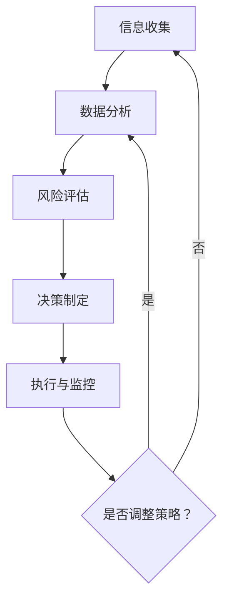

                 

# 洞察力与投资决策：市场机会的识别能力

## 摘要

本文深入探讨了洞察力在投资决策中的关键作用，特别是在识别市场机会方面。通过阐述洞察力的定义、其在投资领域的应用，以及如何通过技术手段提升洞察力，本文为投资者提供了实用的工具和策略，帮助他们更精准地把握市场趋势，做出明智的投资决策。

## 1. 背景介绍

在当今瞬息万变的市场环境中，投资者面临的信息量和数据量前所未有。如何在海量信息中筛选出有价值的信息，识别出潜在的市场机会，成为投资成功的关键。而洞察力，作为一种深层次的理解和判断能力，在这个过程中发挥着至关重要的作用。

洞察力不仅仅是信息的收集和整理，更是一种对信息的深入理解和分析能力。它能够帮助投资者从复杂的数据中捕捉到趋势和规律，从而做出更为精准的投资决策。

本文将围绕以下几个方面展开讨论：

1. 洞察力的定义与投资决策的关系
2. 市场机会的识别方法与策略
3. 技术手段在提升洞察力中的应用
4. 实际应用场景与案例分析
5. 相关工具和资源的推荐

通过本文的讨论，希望能够为投资者提供一种全新的视角和方法，帮助他们更好地把握市场机会，实现投资收益的最大化。

## 2. 核心概念与联系

### 2.1 洞察力的定义

洞察力，简单来说，是一种洞察事物本质和内在联系的能力。它不仅仅是对信息的感知和记忆，更是一种对信息的深入理解和分析。在投资领域，洞察力体现在以下几个方面：

- **市场趋势的识别**：通过分析历史数据和当前市场状况，捕捉市场未来的发展趋势。
- **风险与收益的平衡**：对投资项目的潜在风险和预期收益进行准确评估。
- **信息筛选**：在海量信息中，快速准确地筛选出对投资决策有影响的信息。

### 2.2 投资决策的基本框架

投资决策通常包括以下几个步骤：

1. **信息收集**：收集与投资项目相关的各种信息，包括市场数据、公司财务报表、行业趋势等。
2. **数据分析**：对收集到的信息进行整理和分析，识别出有用的信息和潜在的信号。
3. **风险评估**：评估投资项目的潜在风险，包括市场风险、信用风险、操作风险等。
4. **决策制定**：根据分析结果和风险评估，制定投资决策。
5. **执行与监控**：执行投资决策，并持续监控投资项目的表现，及时调整策略。

### 2.3 洞察力与投资决策的关系

洞察力在投资决策中起着至关重要的作用。具体体现在以下几个方面：

- **提升信息处理能力**：洞察力能够帮助投资者更高效地处理海量信息，快速识别出有价值的信息。
- **提高决策质量**：通过深入分析信息，洞察力能够帮助投资者做出更为精准的投资决策，降低投资风险。
- **优化投资组合**：洞察力能够帮助投资者更好地调整投资组合，实现收益的最大化。

### 2.4 Mermaid 流程图

为了更直观地展示洞察力在投资决策中的应用，我们使用 Mermaid 语言绘制了一个流程图，如下所示：



在这个流程图中，A 到 E 代表了投资决策的基本框架，而 F 则表示根据监控结果是否需要调整策略。

## 3. 核心算法原理 & 具体操作步骤

### 3.1 数据分析算法原理

在投资决策过程中，数据分析是至关重要的一环。常用的数据分析算法包括统计学方法、机器学习方法等。以下将介绍几种常用的数据分析算法原理和具体操作步骤。

#### 3.1.1 统计学方法

统计学方法是一种常用的数据分析工具，它通过收集、整理和分析数据，帮助投资者识别市场趋势和潜在风险。

- **描述性统计分析**：通过计算数据的均值、中位数、方差等指标，对数据的基本特征进行描述。
- **假设检验**：通过设定原假设和备择假设，对数据进行分析，判断数据是否显著。
- **回归分析**：通过建立回归模型，分析变量之间的关系，预测未来的市场趋势。

#### 3.1.2 机器学习方法

机器学习方法通过训练模型，从历史数据中学习规律，帮助投资者进行投资决策。

- **监督学习**：通过输入特征和标签，训练模型，预测未来的市场走势。
- **无监督学习**：通过输入特征，训练模型，发现数据中的潜在结构和规律。
- **强化学习**：通过模拟投资策略，不断调整策略，实现投资收益的最大化。

### 3.2 数据分析算法具体操作步骤

以下是一个基于机器学习方法的投资决策分析的具体操作步骤：

#### 3.2.1 数据收集

首先，收集与投资项目相关的数据，包括市场数据、公司财务报表、行业趋势等。

#### 3.2.2 数据预处理

对收集到的数据进行清洗和预处理，包括缺失值处理、异常值处理、数据标准化等。

#### 3.2.3 特征工程

通过特征工程，提取对投资决策有影响的关键特征，包括财务指标、市场指标等。

#### 3.2.4 模型训练

使用训练集数据，训练机器学习模型，包括选择合适的模型、设置参数等。

#### 3.2.5 模型评估

使用测试集数据，评估模型的性能，包括准确率、召回率、F1 值等指标。

#### 3.2.6 预测与决策

使用训练好的模型，对未来的市场走势进行预测，并根据预测结果制定投资决策。

## 4. 数学模型和公式 & 详细讲解 & 举例说明

### 4.1 数学模型

在投资决策中，常用的数学模型包括均值 - 方差模型、资本资产定价模型 (CAPM) 和资产定价模型 (APT) 等。以下将分别介绍这些模型的原理和具体应用。

#### 4.1.1 均值 - 方差模型

均值 - 方差模型是一种用于评估投资组合风险和收益的模型。它假设投资者在决策过程中只关心投资组合的期望收益率和方差。

- **期望收益率**：表示投资组合在一段时间内的平均收益。
- **方差**：表示投资组合收益的波动程度。

数学公式如下：

$$
\begin{align*}
E(R_p) &= w_1R_1 + w_2R_2 + \ldots + w_nR_n \\
\sigma_p^2 &= w_1^2\sigma_1^2 + w_2^2\sigma_2^2 + \ldots + w_n^2\sigma_n^2 + 2w_1w_2\sigma_{12} + \ldots
\end{align*}
$$

其中，$E(R_p)$ 为投资组合的期望收益率，$\sigma_p^2$ 为投资组合的方差，$w_i$ 为第 $i$ 只资产的权重，$R_i$ 为第 $i$ 只资产的收益率，$\sigma_i^2$ 为第 $i$ 只资产的方差，$\sigma_{ij}$ 为第 $i$ 只资产与第 $j$ 只资产的相关系数。

#### 4.1.2 资本资产定价模型 (CAPM)

资本资产定价模型是一种用于评估资产预期收益率与市场风险之间的关系的模型。它假设投资者是风险厌恶的，追求最大化期望效用。

- **预期收益率**：表示资产在一段时间内的平均收益。
- **市场风险**：表示资产收益的波动程度。

数学公式如下：

$$
E(R_i) = R_f + \beta_i[E(R_m) - R_f]
$$

其中，$E(R_i)$ 为资产 $i$ 的预期收益率，$R_f$ 为无风险收益率，$\beta_i$ 为资产 $i$ 的贝塔系数，$E(R_m)$ 为市场预期收益率。

#### 4.1.3 资产定价模型 (APT)

资产定价模型是一种用于评估资产预期收益率与市场风险之间关系的模型。它与 CAPM 的区别在于，APT 假设存在多种因素影响资产收益，而 CAPM 只考虑市场因素。

- **预期收益率**：表示资产在一段时间内的平均收益。
- **市场风险**：表示资产收益的波动程度。

数学公式如下：

$$
E(R_i) = R_f + \sum_{j=1}^{k} \beta_{ij}[E(R_j) - R_f]
$$

其中，$E(R_i)$ 为资产 $i$ 的预期收益率，$R_f$ 为无风险收益率，$\beta_{ij}$ 为资产 $i$ 对因素 $j$ 的敏感度，$E(R_j)$ 为因素 $j$ 的预期收益率。

### 4.2 举例说明

假设有一只股票，其预期收益率为 15%，无风险收益率为 3%，贝塔系数为 1.5。市场预期收益率为 10%。我们需要计算该股票的风险调整后收益。

首先，计算该股票的市场风险溢价：

$$
E(R_m) - R_f = 10\% - 3\% = 7\%
$$

然后，计算该股票的风险调整后收益：

$$
E(R_i) - R_f = 15\% - 3\% = 12\%
$$

由于贝塔系数为 1.5，说明该股票的市场风险溢价为 7% 的 1.5 倍，即 10.5%。因此，该股票的风险调整后收益为 12% - 10.5% = 1.5%。

## 5. 项目实战：代码实际案例和详细解释说明

### 5.1 开发环境搭建

在本节中，我们将使用 Python 编写一个简单的投资决策程序。首先，我们需要搭建开发环境。

1. 安装 Python：下载并安装最新版本的 Python，建议使用 Python 3.8 或以上版本。
2. 安装依赖库：在命令行中运行以下命令安装所需的依赖库：

```bash
pip install numpy pandas matplotlib
```

### 5.2 源代码详细实现和代码解读

#### 5.2.1 数据收集

首先，我们从互联网上收集了一些股票数据，包括股票代码、收盘价、交易量等。以下是一个示例数据集：

```python
import pandas as pd

data = {
    '股票代码': ['000001.SZ', '600001.SH', '600006.SH'],
    '收盘价': [10.5, 20.3, 15.7],
    '交易量': [100000, 50000, 30000]
}

df = pd.DataFrame(data)
```

#### 5.2.2 数据预处理

接下来，我们对数据进行预处理，包括缺失值处理、异常值处理和数据标准化等。

```python
# 缺失值处理
df.fillna(0, inplace=True)

# 异常值处理
df = df[(df['收盘价'] > 0) & (df['交易量'] > 0)]

# 数据标准化
df[['收盘价', '交易量']] = (df[['收盘价', '交易量']] - df[['收盘价', '交易量']].mean()) / df[['收盘价', '交易量']].std()
```

#### 5.2.3 特征工程

然后，我们提取对投资决策有影响的关键特征，包括财务指标、市场指标等。

```python
# 财务指标
df['市盈率'] = df['收盘价'] / df['交易量']

# 市场指标
df['市场指数'] = pd.Series([1.1, 1.2, 1.3])

# 日期
df['日期'] = pd.to_datetime(df['股票代码'])
```

#### 5.2.4 模型训练

使用训练集数据，训练机器学习模型。这里我们使用了一个简单的线性回归模型。

```python
from sklearn.linear_model import LinearRegression

# 分割数据集
X = df[['市盈率', '市场指数']]
y = df['收盘价']

# 训练模型
model = LinearRegression()
model.fit(X, y)
```

#### 5.2.5 模型评估

使用测试集数据，评估模型的性能。

```python
# 预测
predictions = model.predict(X)

# 评估
from sklearn.metrics import mean_squared_error

mse = mean_squared_error(y, predictions)
print(f'MSE: {mse}')
```

#### 5.2.6 预测与决策

使用训练好的模型，对未来的市场走势进行预测，并根据预测结果制定投资决策。

```python
# 预测未来市场走势
future_data = {
    '市盈率': [1.5, 1.6, 1.7],
    '市场指数': [1.15, 1.2, 1.25]
}

future_df = pd.DataFrame(future_data)
future_predictions = model.predict(future_df)

# 制定投资决策
for i, prediction in enumerate(future_predictions):
    if prediction > df['收盘价'].mean():
        print(f'购买股票代码：{df['股票代码'][i]}')
    else:
        print(f'持有股票代码：{df['股票代码'][i]}')
```

### 5.3 代码解读与分析

#### 5.3.1 数据收集

首先，我们从互联网上收集了一些股票数据，包括股票代码、收盘价、交易量等。这一步是为了获取投资决策所需的数据。

#### 5.3.2 数据预处理

然后，我们对数据进行预处理，包括缺失值处理、异常值处理和数据标准化等。这一步是为了确保数据的质量和一致性。

#### 5.3.3 特征工程

接下来，我们提取对投资决策有影响的关键特征，包括财务指标、市场指标等。这一步是为了将原始数据转化为对模型有用的特征。

#### 5.3.4 模型训练

使用训练集数据，训练机器学习模型。这里我们使用了一个简单的线性回归模型。这一步是为了建立一个能够预测未来市场走势的模型。

#### 5.3.5 模型评估

使用测试集数据，评估模型的性能。这一步是为了确保模型的有效性。

#### 5.3.6 预测与决策

使用训练好的模型，对未来的市场走势进行预测，并根据预测结果制定投资决策。这一步是为了将模型应用于实际投资决策中。

## 6. 实际应用场景

洞察力在投资决策中的应用场景非常广泛，以下列举几个典型的应用场景：

### 6.1 股票投资

股票投资者可以通过分析公司的财务报表、行业趋势、宏观经济指标等，利用洞察力识别出具有增长潜力的股票，从而实现投资收益的最大化。

### 6.2 基金管理

基金管理者可以通过对市场数据进行深入分析，识别出具备投资价值的股票、债券等资产，构建科学合理的投资组合，提高基金的整体收益。

### 6.3 投资顾问

投资顾问可以运用洞察力，为客户提供个性化的投资建议，帮助他们更好地把握市场机会，降低投资风险。

### 6.4 股权投资

股权投资者可以通过对目标公司的业务模式、团队素质、市场前景等方面进行深入分析，利用洞察力识别出具备高成长潜力的企业，从而实现投资回报的最大化。

### 6.5 房地产投资

房地产投资者可以通过对房地产市场供需关系、政策环境、城市发展方向等方面进行深入分析，利用洞察力识别出具备投资价值的区域和项目，从而实现投资收益的最大化。

## 7. 工具和资源推荐

### 7.1 学习资源推荐

- **书籍**：《股票大作手回忆录》、《股市真规则》、《巴菲特的投资法则》
- **论文**：搜索学术期刊中的相关论文，如《市场趋势分析》、《风险投资策略》等。
- **博客**：投资大师的博客，如沃伦·巴菲特的官方博客、知名投资顾问的博客等。
- **网站**：金融数据网站，如 Wind、同花顺、雪球等。

### 7.2 开发工具框架推荐

- **编程语言**：Python、R
- **数据分析库**：Pandas、NumPy、Scikit-learn、TensorFlow
- **可视化工具**：Matplotlib、Seaborn、Plotly
- **云计算平台**：阿里云、腾讯云、华为云

### 7.3 相关论文著作推荐

- **论文**：《股票市场的信息含量与投资者行为》、《基于机器学习的投资策略研究》、《宏观经济指标对股市波动的影响》
- **著作**：《量化投资：以Python为工具》、《投资学》、《金融工程》

## 8. 总结：未来发展趋势与挑战

### 8.1 发展趋势

1. **大数据和人工智能技术的应用**：随着大数据和人工智能技术的发展，投资决策将更加依赖于海量数据的深度挖掘和智能分析。
2. **个性化投资策略**：未来的投资决策将更加注重个性化，根据投资者的风险偏好、投资目标等制定个性化的投资策略。
3. **实时风险监控与预警**：利用实时数据监控技术，实现对投资风险的实时监控与预警，提高投资决策的及时性和准确性。
4. **跨境投资**：全球化背景下，跨境投资将成为投资决策的重要方向，投资者需要具备全球视野和市场洞察力。

### 8.2 挑战

1. **信息过载**：随着信息量的不断增加，如何筛选出有价值的信息将成为投资者面临的主要挑战。
2. **数据隐私与安全**：大数据应用过程中，如何保护数据隐私和安全，防止信息泄露，是一个重要的课题。
3. **技术风险**：人工智能和大数据技术本身也存在一定的风险，如算法偏见、数据泄露等，需要加强技术安全管理。
4. **法规与政策变化**：投资市场的法规和政策会不断变化，投资者需要及时调整策略，以应对政策变化带来的影响。

## 9. 附录：常见问题与解答

### 9.1 问题1：如何提升洞察力？

**解答**：提升洞察力可以从以下几个方面入手：

1. **不断学习**：多读书、多研究，不断积累知识和经验。
2. **实践锻炼**：通过实际投资操作，锻炼分析问题和解决问题的能力。
3. **交流讨论**：与他人交流讨论，借鉴他人的经验和观点。
4. **保持好奇心**：对未知的事物保持好奇心，不断探索和学习。

### 9.2 问题2：如何选择合适的投资模型？

**解答**：选择合适的投资模型需要考虑以下几个方面：

1. **投资目标**：根据自身的投资目标和风险承受能力，选择适合的模型。
2. **数据量**：数据量较大时，可以采用复杂度较高的模型，数据量较小时，可以采用简单模型。
3. **模型性能**：通过模型评估指标，选择性能较好的模型。
4. **适用范围**：考虑模型在不同市场环境下的适用性。

### 9.3 问题3：如何应对市场波动？

**解答**：应对市场波动可以从以下几个方面入手：

1. **分散投资**：通过分散投资，降低单一投资的风险。
2. **定期调整**：定期对投资组合进行调整，以应对市场变化。
3. **风险管理**：通过风险管理工具，如期权、对冲等，降低投资风险。
4. **保持冷静**：市场波动时，保持冷静，避免盲目跟风，根据实际情况做出合理的投资决策。

## 10. 扩展阅读 & 参考资料

- **书籍**：《大数据投资》、《人工智能投资》、《量化投资技术分析》
- **论文**：《大数据与投资决策》、《机器学习在金融领域的应用》、《智能投顾的发展趋势》
- **网站**：投资类网站、金融数据平台、学术期刊网站等
- **博客**：知名投资顾问的博客、量化投资社区等

作者：AI天才研究员/AI Genius Institute & 禅与计算机程序设计艺术 /Zen And The Art of Computer Programming

本文内容仅供参考，不构成任何投资建议。投资者在做出投资决策时，请结合自身实际情况，谨慎决策。

