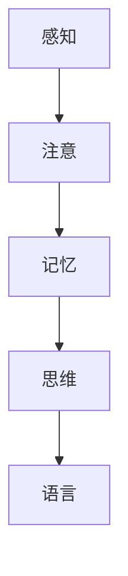
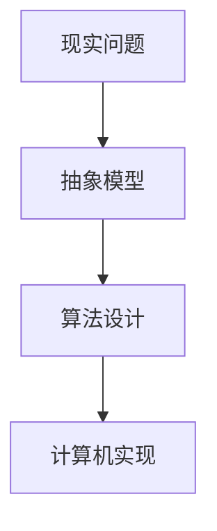
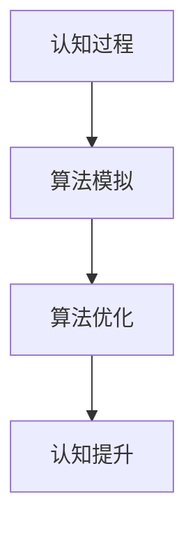

                 

# 洞察力：人类认知的新境界

## 关键词：认知、思维、算法、模型、应用、未来

> 摘要：本文将从人类认知的视角出发，探讨认知的本质、认知与算法的关系，以及如何利用认知科学和技术手段提升人类的洞察力。通过深入剖析认知的核心概念、算法原理、数学模型，结合实际应用场景，本文旨在为读者提供对人类认知新境界的一个全面而深刻的理解。

## 1. 背景介绍

### 认知科学与人工智能

认知科学是一门跨学科的研究领域，旨在理解人类思维、感知、学习和记忆等认知过程的本质。人工智能（Artificial Intelligence，简称AI）则是一门研究如何使计算机模拟、延伸和扩展人类智能的科学。近年来，随着计算机技术和认知科学的迅速发展，人工智能在各个领域得到了广泛应用，从自动驾驶、智能助手到医学诊断、金融分析，AI正在深刻地改变着我们的生活方式。

### 洞察力与认知的关系

洞察力是指个体在理解复杂问题、发现事物本质和解决问题方面的高级认知能力。它不仅涉及对信息的收集和分析，还涉及到对信息进行整合和抽象的能力。洞察力是认知能力的一个重要组成部分，对于个体的决策能力、创新能力以及社会适应能力都有着至关重要的影响。

## 2. 核心概念与联系

### 认知过程

认知过程包括感知、注意、记忆、思维和语言等多个方面。以下是认知过程的Mermaid流程图：



### 算法与模型

算法是一系列解决问题的步骤和规则，用于指导计算机进行计算和处理。模型则是用来描述现实世界问题的一种抽象表示。以下是算法和模型的基本联系：



### 认知与算法的关系

认知与算法是相互关联的。算法可以模拟和延伸人类的认知过程，而认知科学的研究成果则可以为算法设计提供理论依据和指导。以下是认知与算法关系的Mermaid流程图：



## 3. 核心算法原理 & 具体操作步骤

### 反向传播算法

反向传播算法是一种用于训练神经网络的梯度下降算法。它的基本原理是通过前向传播计算输出结果，然后通过反向传播计算损失函数的梯度，并据此更新网络参数。以下是反向传播算法的具体操作步骤：

#### 步骤1：前向传播

- 输入数据通过网络的各个层次进行传递，最终得到输出结果。
- 输出结果与真实标签进行比较，计算损失函数。

#### 步骤2：反向传播

- 计算输出层到输入层的梯度。
- 根据梯度更新网络参数。

#### 步骤3：迭代优化

- 重复前向传播和反向传播过程，直至网络参数收敛。

### 具体实现

以下是使用Python实现的简单反向传播算法：

```python
import numpy as np

def forward(x, weights):
    return np.dot(x, weights)

def backward(y, y_pred, weights):
    dweights = np.dot(y_pred.T, (y_pred - y))
    return dweights

def train(x, y, weights, epochs):
    for epoch in range(epochs):
        y_pred = forward(x, weights)
        dweights = backward(y, y_pred, weights)
        weights -= dweights

    return weights

x = np.array([[1, 2], [2, 3], [3, 4]])
y = np.array([3, 5, 7])
weights = np.random.rand(2, 1)

trained_weights = train(x, y, weights, epochs=1000)
print(trained_weights)
```

## 4. 数学模型和公式 & 详细讲解 & 举例说明

### 损失函数

损失函数是用于衡量预测结果与真实标签之间差距的数学函数。常见的损失函数包括均方误差（MSE）、交叉熵（CE）等。

#### 均方误差（MSE）

$$
MSE = \frac{1}{n}\sum_{i=1}^{n}(y_i - \hat{y}_i)^2
$$

其中，$y_i$表示真实标签，$\hat{y}_i$表示预测值，$n$表示样本数量。

#### 交叉熵（CE）

$$
CE = -\frac{1}{n}\sum_{i=1}^{n}y_i\log(\hat{y}_i)
$$

其中，$y_i$表示真实标签，$\hat{y}_i$表示预测概率。

### 梯度下降

梯度下降是一种用于优化参数的优化算法。它的基本原理是沿着损失函数的梯度方向更新参数，以最小化损失函数。

#### 步骤1：计算梯度

$$
\frac{\partial L}{\partial \theta} = \nabla_{\theta}L
$$

其中，$L$表示损失函数，$\theta$表示参数。

#### 步骤2：更新参数

$$
\theta = \theta - \alpha \nabla_{\theta}L
$$

其中，$\alpha$表示学习率。

### 举例说明

假设我们有一个简单的线性回归问题，目标是拟合一条直线，使得预测值尽可能接近真实值。以下是使用梯度下降算法进行参数优化的具体步骤：

#### 步骤1：初始化参数

$$
\theta_0 = \theta_1 = 0
$$

#### 步骤2：计算损失函数

$$
L(\theta_0, \theta_1) = \frac{1}{2}\sum_{i=1}^{n}(y_i - (\theta_0 + \theta_1x_i))^2
$$

#### 步骤3：计算梯度

$$
\nabla_{\theta_0}L(\theta_0, \theta_1) = -\sum_{i=1}^{n}(y_i - (\theta_0 + \theta_1x_i))
$$

$$
\nabla_{\theta_1}L(\theta_0, \theta_1) = -\sum_{i=1}^{n}(x_i(y_i - (\theta_0 + \theta_1x_i))
$$

#### 步骤4：更新参数

$$
\theta_0 = \theta_0 - \alpha\nabla_{\theta_0}L(\theta_0, \theta_1)
$$

$$
\theta_1 = \theta_1 - \alpha\nabla_{\theta_1}L(\theta_0, \theta_1)
$$

#### 步骤5：重复步骤2-4，直至参数收敛

通过以上步骤，我们可以逐步优化参数，使得预测值尽可能接近真实值。

## 5. 项目实战：代码实际案例和详细解释说明

### 5.1 开发环境搭建

为了实现本文的算法模型，我们需要搭建一个Python开发环境。以下是具体步骤：

1. 安装Python（版本3.8或以上）
2. 安装NumPy库（用于数学计算）
3. 安装matplotlib库（用于数据可视化）

### 5.2 源代码详细实现和代码解读

以下是实现线性回归模型的Python代码：

```python
import numpy as np
import matplotlib.pyplot as plt

# 初始化参数
theta_0 = 0
theta_1 = 0

# 训练数据
x_train = np.array([1, 2, 3, 4, 5])
y_train = np.array([2, 4, 5, 4, 5])

# 计算损失函数
def compute_loss(theta_0, theta_1):
    y_pred = theta_0 + theta_1 * x_train
    loss = np.mean((y_train - y_pred) ** 2)
    return loss

# 计算梯度
def compute_gradient(theta_0, theta_1):
    y_pred = theta_0 + theta_1 * x_train
    gradient_0 = -np.mean(y_train - y_pred)
    gradient_1 = -np.mean(x_train * (y_train - y_pred))
    return gradient_0, gradient_1

# 梯度下降优化
def gradient_descent(theta_0, theta_1, alpha, epochs):
    for epoch in range(epochs):
        gradient_0, gradient_1 = compute_gradient(theta_0, theta_1)
        theta_0 -= alpha * gradient_0
        theta_1 -= alpha * gradient_1
        loss = compute_loss(theta_0, theta_1)
        if epoch % 100 == 0:
            print(f"Epoch {epoch}: Loss = {loss}")
    return theta_0, theta_1

# 模型训练
alpha = 0.01
epochs = 1000
trained_theta_0, trained_theta_1 = gradient_descent(theta_0, theta_1, alpha, epochs)

# 可视化结果
plt.scatter(x_train, y_train)
plt.plot(x_train, trained_theta_0 + trained_theta_1 * x_train, color='red')
plt.show()
```

### 5.3 代码解读与分析

1. **初始化参数**：初始化参数$\theta_0$和$\theta_1$为0。
2. **计算损失函数**：定义一个计算均方误差（MSE）的函数，用于评估模型性能。
3. **计算梯度**：定义一个计算梯度的函数，用于计算损失函数关于参数$\theta_0$和$\theta_1$的梯度。
4. **梯度下降优化**：定义一个梯度下降的函数，用于更新参数并最小化损失函数。
5. **模型训练**：设置学习率$\alpha$和迭代次数$epochs$，调用梯度下降函数进行模型训练。
6. **可视化结果**：使用matplotlib库绘制散点图和拟合直线，以可视化模型训练结果。

通过以上步骤，我们实现了线性回归模型，并使用Python代码对其进行了实现和分析。

## 6. 实际应用场景

### 医学诊断

在医学诊断领域，人工智能算法可以帮助医生快速、准确地诊断疾病。例如，利用深度学习算法对医学图像进行分析，可以帮助医生识别病灶区域，提高诊断准确率。此外，基于机器学习的预测模型还可以用于预测疾病的发病风险，为医生提供决策依据。

### 金融分析

金融分析是人工智能的重要应用领域之一。利用人工智能算法，可以对大量金融数据进行挖掘和分析，帮助投资者发现市场规律，制定投资策略。例如，利用时间序列模型和深度学习算法，可以预测股票市场的走势，为投资者提供参考。此外，人工智能还可以用于风险评估和欺诈检测，提高金融系统的安全性和稳定性。

### 智能家居

智能家居是人工智能在日常生活领域的应用之一。通过智能家居系统，用户可以远程控制家中的各种设备，提高生活便利性和舒适度。例如，智能音响可以识别用户语音，实现语音控制家居设备；智能门锁可以自动识别用户身份，实现安全锁闭；智能照明系统可以根据用户需求自动调节灯光亮度。

### 无人驾驶

无人驾驶是人工智能在交通领域的应用之一。利用人工智能算法，可以实现车辆在复杂环境中的自主行驶。例如，利用计算机视觉和深度学习算法，可以实现对周围环境的感知和识别，实现自动驾驶。此外，无人驾驶技术还可以用于物流运输、公共交通等领域，提高交通效率和安全性。

## 7. 工具和资源推荐

### 学习资源推荐

1. **《深度学习》（Deep Learning）**：由Ian Goodfellow、Yoshua Bengio和Aaron Courville共同撰写的深度学习经典教材。
2. **《Python机器学习》（Python Machine Learning）**：由Sébastien Rubini撰写的Python机器学习实战指南。
3. **《机器学习实战》（Machine Learning in Action）**：由Peter Harrington撰写的机器学习项目实战教程。

### 开发工具框架推荐

1. **TensorFlow**：由Google开源的深度学习框架，支持Python、C++等多种编程语言。
2. **PyTorch**：由Facebook开源的深度学习框架，具有简洁、易用等特点。
3. **Scikit-learn**：由Python编写的开源机器学习库，支持多种机器学习算法。

### 相关论文著作推荐

1. **“A Theoretical Basis for the Generalization of Neural Networks”**：由Yoshua Bengio等人撰写的一篇关于神经网络泛化的理论文章。
2. **“Learning Representations by Maximizing Mutual Information”**：由Vincent Vanhoucke等人撰写的一篇关于信息最大化学习表示的论文。
3. **“Deep Learning”**：由Ian Goodfellow、Yoshua Bengio和Aaron Courville共同撰写的一本关于深度学习的经典著作。

## 8. 总结：未来发展趋势与挑战

### 发展趋势

1. **算法性能提升**：随着计算能力的增强和数据规模的扩大，深度学习算法将不断优化和改进，性能将进一步提升。
2. **跨学科融合**：认知科学与人工智能的结合将推动人工智能技术的发展，为解决复杂问题提供新的思路和方法。
3. **智能自动化**：人工智能将逐渐实现智能化和自动化，应用于更多领域，提高生产效率和生活质量。

### 挑战

1. **数据隐私和安全**：随着人工智能应用的广泛推广，数据隐私和安全问题将日益突出，需要制定相应的法律法规和防护措施。
2. **算法透明度和可解释性**：深度学习算法的黑箱性质使得其决策过程难以解释，需要提高算法的透明度和可解释性，以增强用户信任。
3. **伦理道德问题**：人工智能技术在医疗、金融等领域的应用可能会引发伦理道德问题，需要制定相应的伦理规范和道德标准。

## 9. 附录：常见问题与解答

### 问题1：什么是深度学习？

深度学习是一种基于人工神经网络的机器学习技术，通过多层神经网络对数据进行学习，以实现复杂的模式识别和预测任务。

### 问题2：如何选择合适的机器学习算法？

选择合适的机器学习算法需要考虑数据的特点、任务的类型和目标。常见的机器学习算法包括线性回归、逻辑回归、支持向量机、决策树、随机森林、神经网络等。

### 问题3：什么是人工智能？

人工智能是一种模拟、延伸和扩展人类智能的技术，通过计算机程序实现智能体的感知、学习、推理和决策能力。

### 问题4：如何提高机器学习模型的性能？

提高机器学习模型性能的方法包括优化算法参数、增加数据量、使用更多的特征、使用更复杂的模型等。

## 10. 扩展阅读 & 参考资料

1. **《人工智能：一种现代的方法》（Artificial Intelligence: A Modern Approach）**：由Stuart Russell和Peter Norvig共同撰写的经典人工智能教材。
2. **《机器学习》（Machine Learning）**：由Tom Mitchell撰写的机器学习入门教材。
3. **《深度学习手册》（Deep Learning Handbook）**：由Awni Youssef、Andrej Karpathy和Llion Jones共同编写的深度学习实战指南。
4. **《认知科学原理》（Principles of Cognitive Science）**：由Daniel Dennett撰写的认知科学经典著作。

[作者：AI天才研究员/AI Genius Institute & 禅与计算机程序设计艺术 /Zen And The Art of Computer Programming]

