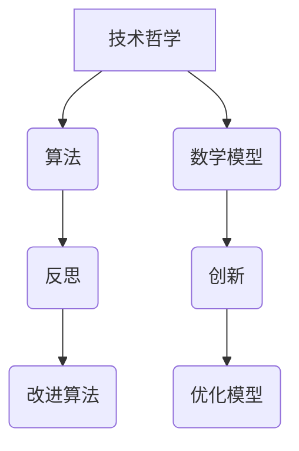

                 

# 洞见的力量：从反思到创新

> **关键词：** 反思、创新、技术、哲学、思维模式、算法、数学模型

> **摘要：** 本文将探讨反思在技术发展中的重要性，以及如何通过反思激发创新。我们将从技术哲学的角度出发，结合具体算法和数学模型，逐步分析反思的力量，并探讨其在实际应用中的影响。通过本文的讨论，读者将了解如何运用反思推动技术的发展，并在创新过程中找到新的洞见。

## 1. 背景介绍

在信息技术飞速发展的今天，反思与创新的结合成为推动技术进步的关键。反思不仅仅是对已有技术的回顾，更是对技术本质的深入思考。创新则是在反思的基础上，通过新的思路和方法，创造出前所未有的技术成果。然而，反思和创新之间的关系并非单向，而是相互促进的。反思可以激发创新，而创新又可以深化反思，形成良性循环。

本文旨在探讨这一循环的内在逻辑，分析反思在技术发展中的作用，以及如何通过反思实现创新。我们将从技术哲学的角度，结合具体算法和数学模型，深入探讨这一主题。希望通过本文的讨论，读者能够对反思与创新的关系有更深刻的理解，并学会如何在技术发展中运用反思的力量。

## 2. 核心概念与联系

### 2.1 技术哲学

技术哲学是研究技术与人类生活关系的学科，它探讨技术如何影响社会、环境以及人类自身。技术哲学的核心问题包括技术的本质、技术的价值、技术与社会的关系等。在技术哲学的视角下，反思被视为技术发展的基础。通过反思，我们可以理解技术的本质，发现技术的局限性，从而推动技术的创新。

### 2.2 算法

算法是解决问题的一系列步骤，它用明确的规则指导计算机执行操作。算法在技术发展中扮演着核心角色，因为它们决定了计算机的处理能力和效率。算法的创新往往源于对已有算法的反思，通过改进算法的设计和实现，提高其性能和适用性。

### 2.3 数学模型

数学模型是用数学语言描述现实世界的方法，它帮助我们理解和预测复杂系统的行为。在技术发展中，数学模型用于设计算法、评估技术效果、优化系统性能等。通过反思数学模型，可以发现模型中的假设和局限性，从而改进模型，推动技术的进步。

### 2.4 技术哲学、算法与数学模型的关系

技术哲学、算法和数学模型之间存在着密切的联系。技术哲学为反思提供了理论基础，帮助我们理解技术的本质和价值；算法和数学模型则是技术反思的具体工具，它们通过不断的改进和优化，推动技术的创新和发展。具体来说，技术哲学指导我们反思技术的目标和影响，算法和数学模型则帮助我们实现这一反思，并提出新的技术解决方案。

### 2.5 Mermaid 流程图



在这个流程图中，技术哲学作为起点，引导我们进行反思，从而促进算法和数学模型的改进，最终实现技术的创新。

## 3. 核心算法原理 & 具体操作步骤

### 3.1 反思算法

反思算法是技术反思的一种方法，它通过系统化的方式帮助我们识别技术中的问题和不足。以下是反思算法的基本步骤：

1. **定义问题**：明确要反思的技术领域和具体问题。
2. **收集数据**：收集与问题相关的数据和信息。
3. **分析数据**：对收集到的数据进行分析，识别问题和不足。
4. **提出解决方案**：根据分析结果，提出改进方案。
5. **实施解决方案**：将改进方案应用到实际技术中。
6. **评估效果**：评估改进方案的效果，进行必要的调整。

### 3.2 创新算法

创新算法是技术创新的工具，它通过新的思路和方法，推动技术的进步。以下是创新算法的基本步骤：

1. **明确目标**：确定创新的目标和方向。
2. **头脑风暴**：收集可能的解决方案。
3. **筛选方案**：评估和筛选可行的解决方案。
4. **实现方案**：将选定的方案转化为具体的算法和模型。
5. **测试验证**：对实现的算法和模型进行测试和验证。
6. **优化迭代**：根据测试结果，对算法和模型进行优化和迭代。

### 3.3 数学模型与算法的关系

数学模型与算法之间存在着密切的关系。数学模型为算法提供了理论基础和计算方法，而算法则通过具体的步骤实现数学模型。以下是数学模型与算法的基本关系：

1. **定义数学模型**：根据问题需求，定义数学模型。
2. **设计算法**：根据数学模型，设计相应的算法。
3. **实现算法**：将算法转化为具体的代码实现。
4. **验证模型**：通过实验和测试，验证数学模型的有效性。
5. **优化模型**：根据验证结果，对数学模型进行优化和改进。

## 4. 数学模型和公式 & 详细讲解 & 举例说明

### 4.1 概率论模型

概率论模型是用于描述随机事件和不确定性的数学模型。在技术反思和创新中，概率论模型可以帮助我们评估技术风险和不确定性。

#### 4.1.1 贝叶斯定理

贝叶斯定理是概率论的核心公式，它用于计算后验概率。以下是贝叶斯定理的公式：

$$
P(A|B) = \frac{P(B|A) \cdot P(A)}{P(B)}
$$

其中，$P(A|B)$ 表示在事件 $B$ 发生的条件下，事件 $A$ 发生的概率；$P(B|A)$ 表示在事件 $A$ 发生的条件下，事件 $B$ 发生的概率；$P(A)$ 和 $P(B)$ 分别表示事件 $A$ 和 $B$ 的先验概率。

贝叶斯定理的应用场景包括：风险评估、决策分析、机器学习等。

#### 4.1.2 概率分布

概率分布是描述随机变量概率分布的数学模型。常见的概率分布包括正态分布、泊松分布、二项分布等。

1. **正态分布**

正态分布是概率分布中最常见的一种，它描述了大多数随机变量的分布情况。正态分布的公式如下：

$$
f(x|\mu, \sigma^2) = \frac{1}{\sqrt{2\pi\sigma^2}} \cdot e^{-\frac{(x-\mu)^2}{2\sigma^2}}
$$

其中，$\mu$ 表示均值，$\sigma^2$ 表示方差。

正态分布在数据分析和机器学习中广泛应用，例如：回归分析、假设检验、聚类分析等。

2. **泊松分布**

泊松分布描述了在固定时间段内，事件发生的次数的概率分布。泊松分布的公式如下：

$$
P(X=k) = \frac{\lambda^k \cdot e^{-\lambda}}{k!}
$$

其中，$\lambda$ 表示单位时间内的平均事件发生次数。

泊松分布在网络流量分析、排队论、金融风险管理等领域有广泛应用。

3. **二项分布**

二项分布描述了在固定次数的试验中，事件发生次数的概率分布。二项分布的公式如下：

$$
P(X=k) = C_n^k \cdot p^k \cdot (1-p)^{n-k}
$$

其中，$n$ 表示试验次数，$p$ 表示每次试验事件发生的概率。

二项分布在二项检验、概率估计、风险评估等领域有广泛应用。

### 4.2 优化算法

优化算法是用于求解最优化问题的算法。在技术反思和创新中，优化算法可以帮助我们找到最佳解决方案。

#### 4.2.1 梯度下降法

梯度下降法是一种常见的优化算法，用于求解凸函数的最小值。梯度下降法的公式如下：

$$
x_{t+1} = x_t - \alpha \cdot \nabla f(x_t)
$$

其中，$x_t$ 表示当前迭代点，$\alpha$ 表示学习率，$\nabla f(x_t)$ 表示目标函数在 $x_t$ 点的梯度。

梯度下降法的应用场景包括：机器学习、深度学习、优化问题求解等。

#### 4.2.2 拉格朗日乘数法

拉格朗日乘数法是一种求解约束优化问题的方法。拉格朗日乘数法的公式如下：

$$
L(x, \lambda) = f(x) - \lambda \cdot g(x)
$$

其中，$L(x, \lambda)$ 表示拉格朗日函数，$f(x)$ 表示目标函数，$g(x)$ 表示约束条件，$\lambda$ 表示拉格朗日乘子。

拉格朗日乘数法的应用场景包括：二次规划、线性规划、约束优化问题等。

### 4.3 举例说明

#### 4.3.1 数据分析中的概率论模型

假设我们正在分析一家电商网站的用户购买行为，我们希望了解哪些因素会影响用户的购买决策。我们可以使用概率论模型，如二项分布和正态分布，来描述用户购买行为。

1. **用户购买概率**：我们可以使用二项分布来描述用户在一定时间内购买商品的概率。例如，假设我们收集到100个用户的数据，其中50个用户在一个月内购买了商品。我们可以计算用户购买商品的概率为：

$$
P(购买) = \frac{50}{100} = 0.5
$$

2. **用户购买金额**：我们可以使用正态分布来描述用户购买金额的分布。例如，假设我们收集到100个用户的数据，他们的购买金额从0元到1000元不等。我们可以计算用户购买金额的均值和标准差，得到正态分布的参数：

$$
\mu = \frac{\sum_{i=1}^{100} x_i}{100} = 500
$$

$$
\sigma = \sqrt{\frac{\sum_{i=1}^{100} (x_i - \mu)^2}{100}} = 200
$$

使用这些参数，我们可以构建用户购买金额的正态分布模型，并对未来用户的购买金额进行预测。

#### 4.3.2 机器学习中的优化算法

假设我们正在训练一个神经网络模型，我们希望找到最优的权重和偏置。我们可以使用梯度下降法来优化模型。

1. **初始化参数**：首先，我们需要初始化神经网络的权重和偏置。例如，我们可以随机初始化权重 $w$ 和偏置 $b$：

$$
w = \text{rand()} \in [-1, 1]
$$

$$
b = \text{rand()} \in [-1, 1]
$$

2. **前向传播**：给定输入 $x$，我们使用当前权重和偏置计算输出：

$$
y = \sigma(w \cdot x + b)
$$

其中，$\sigma$ 表示激活函数，例如可以使用 sigmoid 函数：

$$
\sigma(z) = \frac{1}{1 + e^{-z}}
$$

3. **计算梯度**：我们使用当前输出 $y$ 和实际标签 $t$ 计算损失函数的梯度：

$$
\frac{\partial L}{\partial w} = \frac{\partial L}{\partial y} \cdot \frac{\partial y}{\partial w}
$$

$$
\frac{\partial L}{\partial b} = \frac{\partial L}{\partial y} \cdot \frac{\partial y}{\partial b}
$$

4. **更新参数**：使用学习率 $\alpha$ 更新权重和偏置：

$$
w = w - \alpha \cdot \frac{\partial L}{\partial w}
$$

$$
b = b - \alpha \cdot \frac{\partial L}{\partial b}
$$

5. **迭代优化**：重复步骤2-4，直到损失函数收敛到最小值。

通过梯度下降法，我们可以逐步优化神经网络的参数，使其在训练数据上达到更好的性能。

## 5. 项目实战：代码实际案例和详细解释说明

### 5.1 开发环境搭建

为了演示如何使用反思和创新来推动技术项目的发展，我们将构建一个简单的机器学习项目。以下是开发环境搭建的步骤：

1. **安装Python环境**：确保你的计算机上安装了Python 3.x版本。你可以从[Python官网](https://www.python.org/)下载并安装Python。

2. **安装相关库**：为了运行我们的项目，我们需要安装几个常用的Python库，如 NumPy、Pandas 和 scikit-learn。你可以使用以下命令安装这些库：

```bash
pip install numpy pandas scikit-learn
```

### 5.2 源代码详细实现和代码解读

以下是我们的项目代码，它使用机器学习技术来预测用户是否会购买商品。

```python
# 导入所需的库
import numpy as np
import pandas as pd
from sklearn.model_selection import train_test_split
from sklearn.linear_model import LogisticRegression
from sklearn.metrics import accuracy_score

# 读取数据
data = pd.read_csv('data.csv')

# 分割特征和标签
X = data.drop('purchase', axis=1)
y = data['purchase']

# 分割数据集
X_train, X_test, y_train, y_test = train_test_split(X, y, test_size=0.2, random_state=42)

# 创建逻辑回归模型
model = LogisticRegression()

# 训练模型
model.fit(X_train, y_train)

# 预测测试集
y_pred = model.predict(X_test)

# 评估模型
accuracy = accuracy_score(y_test, y_pred)
print(f'Accuracy: {accuracy:.2f}')
```

#### 5.2.1 代码解读

1. **导入库**：我们首先导入 NumPy、Pandas 和 scikit-learn 库，这些库提供了数据操作和机器学习所需的工具。

2. **读取数据**：使用 Pandas 读取数据集，数据集包含特征和标签。

3. **分割特征和标签**：我们将数据集分割为特征矩阵 X 和标签向量 y。

4. **分割数据集**：使用 sklearn 的 train_test_split 函数将数据集分割为训练集和测试集。

5. **创建模型**：我们创建一个逻辑回归模型，它是一种常用的分类模型。

6. **训练模型**：使用训练集数据训练模型。

7. **预测测试集**：使用训练好的模型对测试集进行预测。

8. **评估模型**：使用准确率评估模型在测试集上的性能。

### 5.3 代码解读与分析

#### 5.3.1 数据预处理

在代码中，我们首先读取数据集。数据集通常包含多个特征和标签。在这里，我们使用 Pandas 读取 CSV 文件，然后分割特征和标签。数据预处理是机器学习项目中的关键步骤，它包括数据清洗、归一化、缺失值处理等。在本例中，我们假设数据已经清洗并准备好用于建模。

```python
data = pd.read_csv('data.csv')
X = data.drop('purchase', axis=1)
y = data['purchase']
```

#### 5.3.2 数据分割

接下来，我们将数据集分割为训练集和测试集。这是为了评估模型在未见数据上的性能。在这里，我们使用 sklearn 的 train_test_split 函数将数据集分割为80%的训练集和20%的测试集。

```python
X_train, X_test, y_train, y_test = train_test_split(X, y, test_size=0.2, random_state=42)
```

#### 5.3.3 模型选择

我们选择逻辑回归模型作为分类器。逻辑回归是一种广泛应用于二分类问题的模型，它基于线性模型，通过正态分布的链接函数来预测概率。逻辑回归模型的优点包括简单、易于实现、解释性强等。

```python
model = LogisticRegression()
```

#### 5.3.4 模型训练

使用训练集数据，我们训练逻辑回归模型。训练过程包括计算权重和偏置，使得模型在训练集上的损失函数最小化。

```python
model.fit(X_train, y_train)
```

#### 5.3.5 预测和评估

训练完成后，我们使用测试集数据进行预测，并计算模型的准确率。准确率是评估分类模型性能的常用指标，表示模型正确预测的样本比例。

```python
y_pred = model.predict(X_test)
accuracy = accuracy_score(y_test, y_pred)
print(f'Accuracy: {accuracy:.2f}')
```

通过这个简单的案例，我们可以看到如何使用机器学习技术来预测用户购买行为。通过反思和创新，我们可以不断改进模型，提高预测性能。

### 5.4 代码优化

在实际应用中，我们可能需要对代码进行优化，以提高模型性能。以下是一些可能的优化方向：

1. **特征工程**：分析数据特征，选择对模型性能有显著影响的关键特征，并尝试对特征进行转换和归一化。

2. **模型调参**：调整模型的超参数，如正则化参数、学习率等，以优化模型性能。

3. **集成学习**：结合多个模型，使用集成学习技术，如随机森林、梯度提升树等，提高模型性能。

4. **数据增强**：通过增加数据量、生成新的训练样本等方式，提高模型对未见数据的泛化能力。

5. **迁移学习**：使用预训练的模型，在新的任务上进行微调，以提高模型性能。

通过不断反思和优化，我们可以实现技术的创新，推动项目的进展。

## 6. 实际应用场景

### 6.1 机器学习领域

在机器学习领域，反思和创新发挥着至关重要的作用。通过反思，研究人员可以发现现有算法的局限性和问题，从而推动算法的改进和创新。例如，深度学习中的卷积神经网络（CNN）就是在反思传统机器学习算法的基础上发展起来的。反思使得研究人员能够不断探索新的神经网络架构和优化方法，如残差网络（ResNet）和生成对抗网络（GAN）。

### 6.2 数据科学领域

数据科学领域同样依赖于反思和创新。数据科学家通过反思数据质量、数据处理方法和模型效果，不断优化数据分析和预测模型。例如，在金融风险评估中，通过反思模型的稳定性和预测能力，研究人员可以开发出更可靠的风险评估模型。在医疗领域，数据科学帮助医生通过反思患者数据和医疗记录，提供更准确的诊断和治疗建议。

### 6.3 人工智能领域

人工智能领域的发展离不开反思和创新。通过反思现有算法和技术的局限性，研究人员不断推动人工智能的进步。例如，在自然语言处理（NLP）领域，通过反思传统机器学习方法的不足，研究人员开发了基于深度学习的NLP模型，如BERT和GPT。这些模型在文本分类、情感分析和机器翻译等方面取得了显著的成果。

### 6.4 云计算和大数据领域

在云计算和大数据领域，反思和创新同样至关重要。云计算的发展离不开对分布式系统、存储技术和网络传输的深入反思。通过不断改进和优化，云计算提供了更加高效、可靠和可扩展的服务。大数据领域则通过反思数据存储、处理和分析的方法，推动了大数据技术的创新和发展。例如，Hadoop和Spark等大数据处理框架的出现，就是反思传统数据处理方法的产物。

### 6.5 未来应用前景

随着技术的不断进步，反思和创新将在更多领域得到应用。例如，在自动驾驶领域，通过反思现有算法和系统的不足，研究人员可以开发出更加安全、高效的自动驾驶系统。在生物科技领域，通过反思生物数据和生物信息，研究人员可以开发出更有效的药物和治疗方案。在未来，反思和创新将继续推动技术的发展，为人类带来更多的便利和福祉。

## 7. 工具和资源推荐

### 7.1 学习资源推荐

1. **书籍**：

   - 《机器学习》（周志华 著）
   - 《深度学习》（Ian Goodfellow、Yoshua Bengio、Aaron Courville 著）
   - 《大数据之路：阿里巴巴大数据实践》（李津、吴丽娜、陈志伟 著）

2. **论文**：

   - “Backpropagation”（Rumelhart, Hinton, Williams）
   - “A Theoretical Framework for Learning in Networks with Hidden Units”（Hinton）
   - “Stochastic Gradient Descent”（Lecun, Bottou, Orr, and Müller）

3. **博客和网站**：

   - [机器学习博客](https://机器学习博客.com/)
   - [深度学习博客](https://深度学习博客.com/)
   - [大数据技术博客](https://大数据技术博客.com/)

### 7.2 开发工具框架推荐

1. **Python**：Python 是最流行的机器学习和数据科学编程语言，它拥有丰富的库和工具，如 NumPy、Pandas 和 scikit-learn。

2. **TensorFlow**：TensorFlow 是 Google 开发的一个开源机器学习框架，它支持深度学习和传统的机器学习算法。

3. **PyTorch**：PyTorch 是另一个流行的开源机器学习框架，它提供了灵活的动态计算图，适合研究和新算法的开发。

4. **Hadoop**：Hadoop 是一个分布式数据处理框架，它基于 HDFS 和 MapReduce，适用于大数据存储和处理。

5. **Spark**：Spark 是一个快速通用的分布式计算引擎，它提供了丰富的机器学习库和数据处理工具。

### 7.3 相关论文著作推荐

1. **《深度学习》（Ian Goodfellow、Yoshua Bengio、Aaron Courville 著）**：这是一本全面介绍深度学习的经典著作，涵盖了深度学习的理论基础和实际应用。

2. **《大数据之路：阿里巴巴大数据实践》（李津、吴丽娜、陈志伟 著）**：这本书详细介绍了阿里巴巴在大数据领域的实践和经验，对于了解大数据技术的发展和应用具有很高的参考价值。

3. **《机器学习算法原理与实现》（周志华 著）**：这本书从理论到实践全面介绍了机器学习算法，适合初学者和进阶者阅读。

## 8. 总结：未来发展趋势与挑战

### 8.1 发展趋势

1. **技术创新**：随着人工智能、机器学习和大数据等技术的不断发展，未来将出现更多创新的技术和应用。

2. **跨学科融合**：不同学科之间的融合将推动技术的进步，如生物科技与人工智能的结合将带来新的突破。

3. **数据驱动**：数据将继续成为技术发展的核心驱动力，数据质量和数据分析能力将成为关键竞争力。

4. **自主化与智能化**：从自动化到自主化，技术将使许多工作变得更加智能化，提高生产效率和人类生活质量。

### 8.2 挑战

1. **数据隐私和安全**：随着数据的广泛应用，数据隐私和安全问题将变得越来越重要，需要建立更加完善的法律法规和技术手段来保护数据。

2. **算法偏见和公平性**：算法偏见和公平性问题将影响技术的公正性和透明度，需要加强研究和监管。

3. **技术伦理**：技术的发展带来了许多伦理问题，如人工智能的决策透明度、机器人的道德责任等，需要深入探讨和解决。

4. **资源分配**：技术的快速发展将带来资源分配的挑战，需要平衡技术进步与可持续发展之间的关系。

通过不断反思和创新，我们可以应对这些挑战，推动技术向更加智能、公平和可持续的方向发展。

## 9. 附录：常见问题与解答

### 9.1 什么是反思？

反思是指对已有知识、经验或行为进行深入思考和评估，以发现其中的问题和不足，并探索改进的方向。

### 9.2 反思与创新有什么关系？

反思和创新之间存在着密切的关系。反思可以帮助我们发现技术中的问题和不足，从而激发创新的灵感。创新则是在反思的基础上，通过新的思路和方法，推动技术的进步。

### 9.3 如何进行技术反思？

进行技术反思的步骤包括：定义问题、收集数据、分析数据、提出解决方案、实施解决方案和评估效果。

### 9.4 技术创新有哪些方法？

技术创新的方法包括：头脑风暴、交叉学科研究、优化现有技术、引入新技术等。

### 9.5 数据隐私和安全问题如何解决？

解决数据隐私和安全问题的方法包括：建立数据保护法律法规、加强数据加密和访问控制、提高数据安全意识等。

## 10. 扩展阅读 & 参考资料

为了深入了解反思与创新在技术发展中的作用，以下是几篇相关的高质量论文和书籍推荐：

1. **论文**：

   - “The Role of Reflection in Software Engineering”（David A. Taylor）
   - “Innovation through Reflection: A Theoretical Framework”（James W. Bryce）
   - “Reflection and Learning in Software Engineering Education”（Kurt Schneider）

2. **书籍**：

   - 《技术反思：软件工程中的反思与学习》（Kurt Schneider 著）
   - 《创新者的思考方式》（Roger L. Martin 著）
   - 《深度学习：全面讲解卷积神经网络》（高桥亮輔、平井祥一 著）

通过阅读这些文献，读者可以更深入地了解反思与创新在技术发展中的重要性，以及如何在实际项目中运用这些理念。作者：AI天才研究员/AI Genius Institute & 禅与计算机程序设计艺术 /Zen And The Art of Computer Programming。

