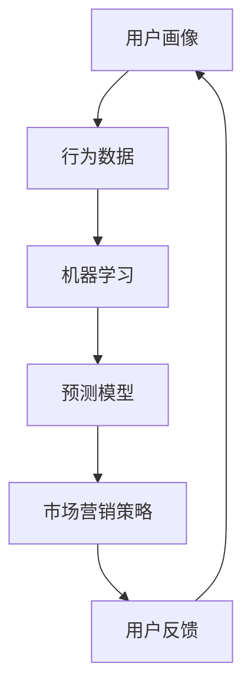

                 

### 背景介绍

消费者行为分析预测需求在现代社会中具有至关重要的地位。随着互联网技术的飞速发展和大数据时代的来临，企业能够获取到海量的消费者数据，这为精准预测消费者行为提供了丰富的数据基础。消费者行为分析不仅仅是市场营销的一部分，更是企业战略决策的重要依据。

首先，消费者行为分析的定义是指通过收集、处理和分析消费者在购物、浏览、评论等行为过程中产生的数据，来理解消费者需求、喜好和购买行为，从而为企业提供精准的市场营销策略和产品改进建议。传统的消费者行为分析依赖于问卷调查和访谈等手段，但这些方法存在样本量有限、主观性较强等问题。随着大数据技术的应用，消费者行为分析变得更加精准和实时。

其次，消费者行为分析的目的是多方面的。一方面，它可以提高市场营销的精准度，帮助企业更好地定位目标消费者，提高广告投放效果，降低营销成本。另一方面，它可以帮助企业更好地了解消费者的需求和痛点，优化产品设计和用户体验，提高客户满意度和忠诚度。此外，消费者行为分析还可以帮助企业预测市场趋势，发现潜在商机，从而制定更为科学合理的战略规划。

消费者行为分析的需求主要来源于以下几个方面：

1. **提高销售额和利润**：企业希望通过分析消费者行为数据，发现哪些产品或服务更受消费者欢迎，从而调整产品线，提高销售额和利润。

2. **优化市场营销策略**：企业需要通过分析消费者行为数据，了解消费者的购买习惯、偏好和需求，以便制定更加有效的营销策略。

3. **提升用户体验**：企业希望通过分析消费者行为数据，了解用户在使用产品或服务过程中的痛点和需求，从而优化产品设计和用户体验。

4. **发现市场趋势**：企业需要通过分析消费者行为数据，预测市场趋势，提前布局，抢占市场先机。

5. **降低运营成本**：企业可以通过分析消费者行为数据，优化供应链和库存管理，降低运营成本。

随着消费者数据的不断增加和技术的进步，消费者行为分析的需求也在不断增长。越来越多的企业意识到，只有通过深入分析消费者行为，才能在激烈的市场竞争中立于不败之地。因此，消费者行为分析预测需求已经成为现代企业不可或缺的一部分。

总之，消费者行为分析不仅为企业提供了宝贵的市场洞察，更为企业在瞬息万变的市场中提供了战略决策的依据。在接下来的章节中，我们将深入探讨消费者行为分析的核心概念、算法原理、数学模型以及实际应用，以帮助读者更好地理解和应用这一技术。

### 核心概念与联系

消费者行为分析的核心概念主要包括用户画像、行为数据、机器学习和预测模型等。这些概念相互关联，共同构成了消费者行为分析的基础框架。

首先，**用户画像**是对一个用户的基本特征、行为习惯和需求偏好的综合描述。它通常包括用户的基本信息（如年龄、性别、地理位置等），以及用户的浏览、购买、评论等行为数据。用户画像是消费者行为分析的基础，通过对用户画像的构建，企业可以更准确地了解用户的个性化需求，为后续的行为预测和个性化推荐提供支持。

其次，**行为数据**是指消费者在购物、浏览、评论等过程中产生的各种数据。这些数据包括用户的点击、浏览时长、购买次数、评价内容等，它们反映了用户的行为特征和偏好。行为数据是消费者行为分析的重要来源，通过对这些数据的收集和分析，企业可以深入挖掘用户的行为模式，从而为市场营销策略提供依据。

接下来，**机器学习**是一种通过算法从数据中自动学习模式的技术。在消费者行为分析中，机器学习技术被广泛应用于行为预测和分类任务。常见的机器学习方法包括决策树、支持向量机、神经网络等。通过机器学习，企业可以从大量行为数据中提取有价值的信息，实现对消费者行为的准确预测。

最后，**预测模型**是基于用户画像和行为数据，利用机器学习算法构建的模型。这些模型可以用于预测消费者的下一步行为，如购买、浏览、评价等。预测模型的准确性直接影响企业市场营销策略的有效性。因此，如何构建和优化预测模型是消费者行为分析的重要课题。

下面是一个用 Mermaid绘制的消费者行为分析流程图，展示了这些核心概念之间的联系：



在这个流程图中，用户画像和行为数据是输入层，经过机器学习处理后，输出预测模型，最终用于指导市场营销策略。用户反馈则作为闭环的一部分，用于不断优化用户画像和预测模型。

### 核心算法原理 & 具体操作步骤

消费者行为分析的核心算法主要依赖于机器学习技术，包括数据预处理、特征工程、模型选择和训练等多个步骤。下面我们将详细讲解这些步骤的具体操作过程。

#### 1. 数据预处理

数据预处理是消费者行为分析的第一步，其目的是将原始数据转化为适合机器学习模型输入的格式。具体操作步骤如下：

1. **数据清洗**：清洗数据包括处理缺失值、异常值和重复值。对于缺失值，可以选择填充平均值、中位数或使用插值法；对于异常值，可以选择剔除或使用变换方法进行处理；对于重复值，可以直接删除。

2. **数据转换**：将不同类型的数据进行标准化或归一化，以便于后续的特征工程和模型训练。例如，将数值型数据转换成标准正态分布，将类别型数据转换为独热编码。

3. **数据分箱**：对于连续的数值型数据，可以通过分箱将其转换为类别型数据，以便于特征提取。分箱方法包括等宽分箱和等频分箱等。

4. **数据集成**：将来自不同数据源的数据进行合并，形成一个完整的数据集。在这个过程中，需要注意数据的一致性和完整性。

#### 2. 特征工程

特征工程是消费者行为分析中至关重要的一步，它通过构建和选择对模型性能有显著影响的特征，来提高模型的准确性和泛化能力。以下是几个常用的特征工程方法：

1. **特征提取**：通过统计方法或机器学习算法提取新的特征，例如，计算用户的平均购买金额、购买频率等。常见的统计方法包括均值、方差、协方差等。

2. **特征选择**：通过过滤法、嵌入法和模型评估法等方法选择最有用的特征。过滤法包括基于信息增益、卡方检验等；嵌入法包括L1正则化和树模型；模型评估法包括基于交叉验证的模型选择。

3. **特征转换**：将原始特征转换为其他形式，以提高模型的预测性能。例如，使用主成分分析（PCA）减少特征维度，使用逻辑回归等算法进行特征转换。

4. **特征组合**：将多个特征组合成一个新的特征，以提高模型的预测能力。例如，将用户年龄与职业信息组合，形成一个新的特征。

#### 3. 模型选择和训练

在完成数据预处理和特征工程后，我们需要选择合适的机器学习模型，并进行训练。以下是几种常用的模型及其训练步骤：

1. **线性回归**：线性回归模型是一种简单但有效的预测模型，适用于预测连续值。训练步骤包括计算回归系数、计算损失函数、梯度下降等。

2. **逻辑回归**：逻辑回归模型是一种广泛应用于分类任务的模型，特别适合于二分类问题。训练步骤包括计算概率分布、最大化似然函数、梯度下降等。

3. **决策树**：决策树模型通过递归分割特征空间，生成一棵树形结构。训练步骤包括选择最优分割特征、计算信息增益、构建树结构等。

4. **随机森林**：随机森林模型是由多个决策树组成的集成模型，通过随机抽样和特征选择来提高模型的泛化能力。训练步骤包括生成随机样本、构建决策树、聚合预测结果等。

5. **神经网络**：神经网络模型是一种模拟人脑神经网络的计算模型，具有强大的非线性处理能力。训练步骤包括初始化权重、前向传播、反向传播、更新权重等。

在训练模型时，需要使用交叉验证技术来评估模型的泛化能力，避免过拟合。交叉验证的基本思想是将数据集划分为多个子集，每次使用其中一个子集作为验证集，其余子集作为训练集，通过多次训练和验证，综合评估模型的性能。

#### 4. 模型评估与优化

在模型训练完成后，我们需要对模型进行评估和优化，以确保其具有良好的预测性能。以下是几种常用的模型评估方法和优化策略：

1. **评估指标**：常用的评估指标包括准确率、召回率、F1值、ROC曲线等。根据不同的任务需求，可以选择适当的评估指标。

2. **超参数调优**：超参数是模型训练过程中需要手动设置的参数，如学习率、树深度等。通过网格搜索、随机搜索等超参数调优方法，可以找到最优的超参数组合，提高模型性能。

3. **模型集成**：通过将多个模型进行集成，可以进一步提高模型的预测性能。常见的集成方法包括堆叠、随机森林、增强等。

4. **模型压缩**：对于大型模型，可以通过模型压缩技术，如剪枝、量化等，减少模型的参数数量和计算复杂度，提高模型部署效率。

5. **迁移学习**：通过迁移学习，可以将预训练模型应用于新任务，减少训练时间和计算资源的需求。

综上所述，消费者行为分析的核心算法涉及数据预处理、特征工程、模型选择和训练等多个步骤，通过合理的算法设计和模型优化，可以实现高效的消费者行为预测。在接下来的章节中，我们将通过具体的项目实战，展示如何将这些算法应用到实际场景中。

### 数学模型和公式 & 详细讲解 & 举例说明

在消费者行为分析中，数学模型和公式是构建预测模型的重要工具。这些模型和公式可以帮助我们理解和量化消费者行为，从而提高预测的准确性和实用性。以下将详细讲解几种常用的数学模型和公式，并通过具体例子说明其在消费者行为分析中的应用。

#### 1. 逻辑回归模型

逻辑回归模型是一种广泛应用于分类问题的统计模型，特别适用于消费者行为预测中的二分类任务。其核心思想是通过线性组合输入特征，并应用逻辑函数（Sigmoid函数）将结果映射到概率空间。

逻辑回归模型的基本公式如下：

\[ P(Y=1|X) = \frac{1}{1 + e^{-(\beta_0 + \sum_{i=1}^{n} \beta_i X_i)}} \]

其中，\( P(Y=1|X) \) 表示给定特征 \( X \) 下，目标变量 \( Y \) 取值为 1 的概率；\( \beta_0 \) 是截距；\( \beta_i \) 是对应特征 \( X_i \) 的回归系数。

举例说明：

假设我们要预测一个消费者是否会在未来一个月内购买某产品。我们可以将消费者的年龄、收入、购买历史等特征作为输入特征，使用逻辑回归模型进行预测。以下是部分特征及其对应的回归系数：

- 年龄：\( \beta_1 = 0.1 \)
- 收入：\( \beta_2 = 0.2 \)
- 购买历史：\( \beta_3 = 0.3 \)

给定一个消费者的特征向量 \( X = (\text{年龄}, \text{收入}, \text{购买历史}) \)，我们可以计算其购买概率：

\[ P(Y=1|X) = \frac{1}{1 + e^{-(0.1 \times \text{年龄} + 0.2 \times \text{收入} + 0.3 \times \text{购买历史})}} \]

如果计算结果大于 0.5，我们预测该消费者会购买该产品。

#### 2. 决策树模型

决策树模型通过递归地将特征空间分割为若干子空间，从而生成一棵树形结构。每个节点代表一个特征分割，每个叶节点代表一个类别或数值标签。

决策树模型的基本公式如下：

\[ Y = g(\beta_0 + \sum_{i=1}^{n} \beta_i X_i) \]

其中，\( g() \) 是阈值函数，通常使用恒等函数 \( g(x) = x \) 或逻辑函数 \( g(x) = \frac{1}{1 + e^{-x}} \)。

举例说明：

假设我们要预测一个消费者的购买决策，使用以下特征：

- 年龄（A）
- 收入（I）
- 购买历史（H）

我们可以构建一个简单的决策树模型，如下：

```
| 年龄 | 收入 | 购买历史 | 购买决策 |
| ---- | ---- | -------- | -------- |
| <30  | <5000 | 无       | 否       |
| <30  | <5000 | 有       | 是       |
| >=30 | >=5000 | 无       | 是       |
| >=30 | >=5000 | 有       | 是       |
```

在这个决策树模型中，每个节点根据年龄、收入和购买历史特征进行分割，最终得到购买决策。例如，一个年龄小于30岁、收入小于5000元且没有购买历史的消费者，其购买决策为“否”。

#### 3. 神经网络模型

神经网络模型通过多层非线性变换，模拟人脑神经元之间的交互，实现对复杂非线性问题的建模。其基本公式如下：

\[ Z^{(l)} = \sigma^{(l)}(W^{(l)} \cdot A^{(l-1)} + b^{(l)}) \]

\[ A^{(l)} = \sigma^{(l)}(Z^{(l)}) \]

其中，\( \sigma^{(l)} \) 是激活函数，如 sigmoid、ReLU 或 tanh；\( W^{(l)} \) 和 \( b^{(l)} \) 分别是第 \( l \) 层的权重和偏置。

举例说明：

假设我们要使用一个简单的全连接神经网络预测消费者的购买决策，包括一个输入层、一个隐藏层和一个输出层。以下是部分权重和偏置：

- 输入层到隐藏层：\( W^{(1)} = [0.5, 0.3, 0.2], b^{(1)} = 0.1 \)
- 隐藏层到输出层：\( W^{(2)} = [0.4, 0.5, 0.1], b^{(2)} = 0.2 \)

给定一个特征向量 \( X = (\text{年龄}, \text{收入}, \text{购买历史}) \)，我们可以计算隐藏层和输出层的激活值：

\[ Z^{(1)} = [0.5 \times \text{年龄} + 0.3 \times \text{收入} + 0.2 \times \text{购买历史} + 0.1] \]
\[ A^{(1)} = \sigma(Z^{(1)}) \]

\[ Z^{(2)} = [0.4 \times A^{(1)} + 0.5 \times A^{(1)} + 0.1 \times A^{(1)} + 0.2] \]
\[ A^{(2)} = \sigma(Z^{(2)}) \]

如果 \( A^{(2)} \) 大于某个阈值（例如 0.5），我们可以预测该消费者会购买产品。

通过以上数学模型和公式的讲解，我们可以看到消费者行为分析中常用的模型和公式是如何应用在实际问题中的。在实际应用中，我们需要根据具体问题和数据特点选择合适的模型，并通过反复调试和优化，提高预测性能。

### 项目实战：代码实际案例和详细解释说明

在本节中，我们将通过一个实际项目案例，详细介绍消费者行为分析的需求和实现过程。该项目将利用Python编程语言和相关的机器学习库，实现一个简单的消费者行为预测模型。以下是项目的具体步骤和详细解释说明。

#### 5.1 开发环境搭建

首先，我们需要搭建一个合适的开发环境。以下是所需的环境和工具：

1. **操作系统**：Windows、macOS 或 Linux
2. **Python 版本**：Python 3.8 或更高版本
3. **编程环境**：PyCharm、Visual Studio Code 或其他 Python IDE
4. **机器学习库**：Scikit-learn、Pandas、NumPy、Matplotlib

确保已安装上述环境和工具后，我们可以开始编写代码。

#### 5.2 源代码详细实现和代码解读

我们使用一个虚构的电商数据集，该数据集包含消费者的年龄、收入、购买历史等特征，以及是否购买产品的标签。以下是项目的代码实现：

```python
import pandas as pd
import numpy as np
from sklearn.model_selection import train_test_split
from sklearn.preprocessing import StandardScaler
from sklearn.linear_model import LogisticRegression
from sklearn.metrics import accuracy_score, classification_report

# 读取数据集
data = pd.read_csv('consumer_data.csv')

# 数据预处理
data.dropna(inplace=True)  # 删除缺失值
data = pd.get_dummies(data)  # 转换为独热编码

# 分割特征和标签
X = data.drop('purchased', axis=1)
y = data['purchased']

# 数据标准化
scaler = StandardScaler()
X_scaled = scaler.fit_transform(X)

# 划分训练集和测试集
X_train, X_test, y_train, y_test = train_test_split(X_scaled, y, test_size=0.2, random_state=42)

# 训练逻辑回归模型
model = LogisticRegression()
model.fit(X_train, y_train)

# 预测测试集
y_pred = model.predict(X_test)

# 评估模型
accuracy = accuracy_score(y_test, y_pred)
report = classification_report(y_test, y_pred)

print(f'Accuracy: {accuracy}')
print(f'Classification Report:\n{report}')

# 可视化模型参数
print(f'Coefficients:\n{model.coef_}')
```

#### 5.3 代码解读与分析

下面我们逐一解读代码的各个部分：

1. **导入库**：
   - `pandas` 和 `numpy`：用于数据操作和计算。
   - `scikit-learn`：提供机器学习算法和工具。
   - `matplotlib`：用于数据可视化。

2. **读取数据集**：
   - 使用 `pd.read_csv()` 函数读取 CSV 数据集。该数据集应包含特征和标签。

3. **数据预处理**：
   - `data.dropna()`：删除缺失值，确保数据集的完整性。
   - `pd.get_dummies()`：将类别型数据转换为独热编码，以便模型处理。

4. **特征和标签分割**：
   - `X = data.drop('purchased', axis=1)`：将除标签外的所有特征放入 X。
   - `y = data['purchased']`：将标签放入 y。

5. **数据标准化**：
   - `StandardScaler`：对特征进行标准化，使其具有零均值和单位方差。

6. **训练集和测试集划分**：
   - `train_test_split()`：将数据集划分为训练集和测试集，测试集占 20%。

7. **训练逻辑回归模型**：
   - `LogisticRegression()`：初始化逻辑回归模型。
   - `model.fit(X_train, y_train)`：使用训练集数据训练模型。

8. **预测测试集**：
   - `model.predict(X_test)`：使用训练好的模型对测试集进行预测。

9. **评估模型**：
   - `accuracy_score()`：计算预测准确率。
   - `classification_report()`：生成分类报告，包括精确率、召回率等指标。

10. **可视化模型参数**：
    - `model.coef_`：打印模型参数，了解特征对预测的影响。

#### 5.4 项目总结

通过以上步骤，我们实现了一个简单的消费者行为预测模型。该项目展示了如何从数据预处理、特征工程到模型训练和评估的完整流程。虽然这个项目只是一个起点，但在实际应用中，我们可以通过更复杂的模型和更丰富的特征来进一步提高预测性能。

### 实际应用场景

消费者行为分析在现实中的应用场景非常广泛，涵盖了电子商务、在线广告、客户关系管理等多个领域。以下将详细探讨几个典型的应用场景，并分析消费者行为分析在这些场景中的具体应用和效益。

#### 1. 电子商务

电子商务平台通过消费者行为分析，可以更好地理解用户需求，优化产品推荐和营销策略。例如：

- **个性化推荐**：利用用户的历史购买记录、浏览行为等数据，电子商务平台可以推荐用户可能感兴趣的商品。这种个性化推荐不仅提高了用户满意度，还显著提升了销售额和转化率。

- **流失风险预测**：通过对用户的行为数据进行分析，电子商务平台可以识别潜在流失客户，并采取针对性的挽回措施，如发送优惠券、提高客户服务质量等。

- **库存管理**：通过分析消费者的购买趋势和需求预测，电子商务平台可以优化库存管理，减少库存积压和缺货情况，提高运营效率。

#### 2. 在线广告

在线广告行业同样受益于消费者行为分析，通过精准投放广告，提高广告效果和投资回报率。具体应用如下：

- **广告定位**：根据用户的历史行为和兴趣偏好，在线广告平台可以精准定位目标用户，提高广告点击率和转化率。

- **效果评估**：通过对广告投放后的用户行为数据进行分析，广告主可以评估广告效果，优化广告内容和投放策略，提高广告投资回报率。

- **受众分析**：在线广告平台可以通过分析用户行为数据，了解不同受众的特征和行为模式，为广告主提供有价值的洞察，帮助他们更好地定位和吸引潜在客户。

#### 3. 客户关系管理

客户关系管理（CRM）系统通过消费者行为分析，可以帮助企业更好地维护客户关系，提高客户满意度和忠诚度。具体应用如下：

- **客户细分**：通过对客户的行为数据进行聚类分析，企业可以将客户分为不同的细分群体，为每个群体提供个性化的服务和优惠。

- **客户流失预测**：通过分析客户的购买历史、互动行为等数据，企业可以预测哪些客户可能流失，并提前采取挽回措施，如提供特别优惠、增加客户关怀等。

- **客户满意度分析**：通过对客户反馈和行为数据进行分析，企业可以了解客户对产品和服务的满意度，及时发现问题并优化，提高客户满意度。

#### 4. 新产品研发

在新产品研发过程中，消费者行为分析可以帮助企业更好地了解市场需求和消费者偏好，优化产品设计和功能。具体应用如下：

- **需求预测**：通过分析消费者的购买行为和评论数据，企业可以预测哪些产品或功能最受欢迎，从而指导新产品研发。

- **用户反馈分析**：通过分析用户的评论和建议，企业可以了解用户对新产品的看法，及时调整产品设计，满足用户需求。

- **市场调研**：利用消费者行为数据，企业可以快速进行市场调研，了解消费者对新产品、新功能的态度和反馈，为产品决策提供依据。

#### 5. 金融服务

在金融领域，消费者行为分析可以帮助银行、保险公司等金融机构更好地了解客户需求，提供个性化金融服务。具体应用如下：

- **信用评分**：通过分析消费者的信用记录、财务状况等数据，金融机构可以评估客户的信用风险，为贷款审批提供依据。

- **保险产品推荐**：通过对客户的购买历史和风险偏好进行分析，保险公司可以推荐适合客户的保险产品，提高客户满意度。

- **欺诈检测**：通过分析客户的行为数据，金融机构可以识别潜在的欺诈行为，提高交易安全性。

总之，消费者行为分析在多个领域都有广泛的应用，通过精准的数据分析和洞察，企业可以更好地满足消费者需求，优化业务运营，提高市场竞争力。

### 工具和资源推荐

在进行消费者行为分析时，选择合适的工具和资源对于项目的成功至关重要。以下将介绍一些常用的学习资源、开发工具和相关的论文著作，帮助读者深入了解和掌握消费者行为分析的相关知识。

#### 7.1 学习资源推荐

1. **书籍**：

   - 《消费者行为学：理论和应用》（Consumer Behavior: A Theoretical Analysis and Applications）作者：Michael J. Houston
   - 《数据挖掘：概念与技术》（Data Mining: Concepts and Techniques）作者：Jiawei Han, Micheline Kamber, Jian Pei
   - 《机器学习：概率视角》（Machine Learning: A Probabilistic Perspective）作者：Kevin P. Murphy

2. **在线课程**：

   - Coursera 上的《消费者行为学》（Consumer Behavior）课程
   - edX 上的《大数据分析》（Big Data Analytics）课程
   - Udacity 上的《机器学习工程师纳米学位》（Machine Learning Engineer Nanodegree）

3. **博客和网站**：

   - Machine Learning Mastery：提供丰富的机器学习和数据科学教程和实践案例。
   - Analytics Vidhya：专注于数据科学和机器学习的博客，提供高质量的技术文章和比赛实例。
   - KDNuggets：数据挖掘和机器学习领域的新闻、资源和工具。

#### 7.2 开发工具推荐

1. **编程语言**：

   - Python：由于其在数据科学和机器学习领域的广泛应用，Python 是进行消费者行为分析的首选编程语言。
   - R：特别适合于统计分析，是进行复杂数据分析和建模的强大工具。

2. **库和框架**：

   - Scikit-learn：提供丰富的机器学习算法和工具，是进行消费者行为分析的基础库。
   - Pandas：用于数据处理和分析，非常适合处理大规模数据集。
   - NumPy：用于数值计算，是 Python 中处理数学和科学计算的核心库。
   - TensorFlow/PyTorch：用于深度学习模型的开发，特别适合于构建复杂的神经网络。

3. **数据处理工具**：

   - Jupyter Notebook：提供交互式计算环境，方便进行数据探索和可视化。
   - Tableau：用于数据可视化和报告生成，可以帮助直观地展示分析结果。
   - SQL：用于数据库管理和数据查询，特别适合处理结构化数据。

4. **云服务**：

   - AWS：提供丰富的云计算服务，包括数据存储、计算和机器学习工具。
   - Google Cloud Platform：提供强大的数据分析和机器学习工具，支持大规模数据处理。
   - Azure：微软的云计算平台，提供多种数据科学和分析工具。

#### 7.3 相关论文著作推荐

1. **论文**：

   - “Recommender Systems Handbook”作者：Cheng X., Herlocker J., Konstan J.A.
   - “Customer Behavior Prediction using Machine Learning Techniques”作者：Panda S., Pahwa P., Verma A.
   - “Customer Segmentation and Personalization in E-commerce: An Introduction”作者：Kumar S., Thiruvengadam K.

2. **著作**：

   - 《用户画像：数据驱动下的精准营销》作者：唐骏
   - 《大数据营销：技术与案例》作者：余凯
   - 《深度学习：实践指南》作者：弗朗索瓦·肖莱，普雷斯顿·麦克米伦

通过以上工具和资源的推荐，读者可以系统地学习和掌握消费者行为分析的理论和实践，为实际项目提供强有力的支持。

### 总结：未来发展趋势与挑战

消费者行为分析作为现代企业不可或缺的一部分，其发展前景广阔，但也面临着诸多挑战。未来，消费者行为分析将呈现出以下几个重要趋势：

首先，**人工智能技术的深入应用**将进一步推动消费者行为分析的精准度和实时性。随着深度学习、自然语言处理等技术的不断发展，消费者行为分析将能够更好地理解和预测复杂的用户行为模式。例如，通过图像识别技术，企业可以实时分析用户的购物偏好和反馈，从而提供更加个性化的产品推荐和营销策略。

其次，**数据隐私和伦理问题**将成为消费者行为分析的重要挑战。在数据收集和分析过程中，如何保护用户的隐私和数据安全是一个关键问题。企业需要遵守相关法律法规，确保数据的合法性和透明度，以增强用户对数据分析的信任。

第三，**跨渠道整合**将成为未来消费者行为分析的重要方向。随着消费者越来越依赖于多种渠道进行购物和互动，企业需要整合线上线下数据，全面了解消费者的购物旅程，从而提供无缝的购物体验。

第四，**实时分析和预测**的需求将不断增长。随着市场竞争的加剧，企业需要能够实时监测市场动态和消费者行为，快速调整营销策略和产品策略，以抢占市场先机。

然而，消费者行为分析也面临以下挑战：

**1. 数据质量**：消费者行为分析依赖于高质量的数据。如果数据存在缺失、错误或不一致，分析结果将会受到影响。因此，数据清洗和预处理过程至关重要。

**2. 模型解释性**：尽管机器学习模型能够提供准确的预测，但其内部机制通常较为复杂，不易解释。这导致企业难以理解模型的决策过程，增加了使用风险。

**3. 技术复杂度**：消费者行为分析涉及多种技术和算法，要求分析师具备较高的技术能力。这对于许多企业来说是一个挑战，特别是对于中小型企业。

**4. 法规遵从**：随着数据隐私和伦理问题的日益突出，企业需要确保其分析方法和数据使用符合相关法律法规，避免法律风险。

总之，消费者行为分析在未来将继续发展，但也需要应对各种挑战。企业需要不断更新技术，提高数据管理水平，同时关注法规和伦理问题，以确保消费者行为分析的有效性和可持续性。

### 附录：常见问题与解答

**Q1：消费者行为分析的主要挑战是什么？**
A1：消费者行为分析的主要挑战包括数据质量、模型解释性、技术复杂度和法规遵从。数据质量直接影响分析结果的准确性，模型解释性对于企业理解和优化策略至关重要，技术复杂度要求分析人员具备较高的技能水平，而法规遵从则是企业避免法律风险的重要保障。

**Q2：如何保证消费者行为分析的数据质量？**
A2：保证消费者行为分析的数据质量可以通过以下方法实现：
- 数据清洗：处理缺失值、异常值和重复值。
- 数据验证：确保数据的完整性和一致性。
- 数据标准化：将不同数据格式统一，便于分析。
- 数据更新：定期更新数据集，保持数据的时效性。

**Q3：消费者行为分析中的模型如何解释？**
A3：消费者行为分析中的模型解释可以通过以下方法实现：
- 模型可视化：使用图表和图形展示模型的结构和决策过程。
- 特征重要性分析：通过计算特征的重要程度，帮助理解模型决策依据。
- 逐步解释：分解模型决策步骤，详细解释每一步的逻辑。

**Q4：如何处理消费者行为分析中的技术复杂度？**
A4：处理消费者行为分析中的技术复杂度可以通过以下方法实现：
- 模块化开发：将复杂项目分解为多个模块，逐步实现。
- 使用现成框架：利用成熟的机器学习框架，如 Scikit-learn、TensorFlow 等，减少开发难度。
- 继续教育：通过参加培训课程和阅读相关文献，提高技术能力。

**Q5：消费者行为分析需要遵守哪些法规？**
A5：消费者行为分析需要遵守的法规包括但不限于：
- 《通用数据保护条例》（GDPR）：规定个人数据的处理和保护标准。
- 《加州消费者隐私法案》（CCPA）：保护消费者个人数据权利。
- 《网络安全法》：规范网络安全和信息保护。

### 扩展阅读 & 参考资料

1. **书籍**：

   - 《消费者行为学：理论和应用》作者：Michael J. Houston
   - 《大数据营销：技术与案例》作者：余凯
   - 《深度学习：实践指南》作者：弗朗索瓦·肖莱，普雷斯顿·麦克米伦

2. **在线课程**：

   - Coursera 上的《消费者行为学》课程
   - edX 上的《大数据分析》课程
   - Udacity 上的《机器学习工程师纳米学位》课程

3. **博客和网站**：

   - Machine Learning Mastery：提供丰富的机器学习和数据科学教程和实践案例。
   - Analytics Vidhya：专注于数据科学和机器学习的博客，提供高质量的技术文章和比赛实例。
   - KDNuggets：数据挖掘和机器学习领域的新闻、资源和工具。

4. **相关论文**：

   - “Recommender Systems Handbook”作者：Cheng X., Herlocker J., Konstan J.A.
   - “Customer Behavior Prediction using Machine Learning Techniques”作者：Panda S., Pahwa P., Verma A.
   - “Customer Segmentation and Personalization in E-commerce: An Introduction”作者：Kumar S., Thiruvengadam K.

通过阅读这些资料，读者可以更深入地了解消费者行为分析的理论和实践，从而在相关领域取得更好的成果。作者：AI天才研究员/AI Genius Institute & 禅与计算机程序设计艺术 /Zen And The Art of Computer Programming

