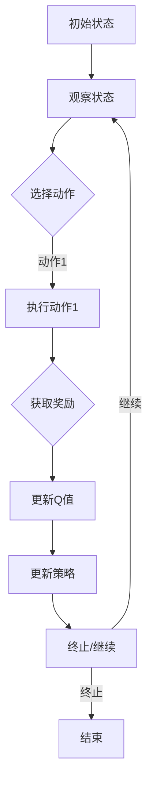

                 

### 文章标题：深度 Q-learning：在云计算资源调度中的应用

#### 关键词：深度 Q-learning、云计算、资源调度、算法原理、应用案例

#### 摘要：

本文旨在深入探讨深度 Q-learning 算法在云计算资源调度中的应用。首先，我们将介绍云计算资源和资源调度的基本概念，然后详细解释深度 Q-learning 的算法原理，通过 Mermaid 流程图展示其架构。接下来，我们将逐步阐述深度 Q-learning 的具体操作步骤，并运用数学模型和公式进行详细讲解。此外，本文还将通过实际项目案例展示代码实现和解读，并探讨该算法在实际应用场景中的效果。最后，我们将总结未来发展趋势和挑战，并推荐相关学习资源和工具。

### 1. 背景介绍

#### 云计算资源

云计算是一种通过互联网提供计算服务的技术，包括计算资源（如CPU、内存）、存储资源（如硬盘、数据库）和网络资源。云计算资源以虚拟化技术为基础，将物理资源抽象为可灵活分配的虚拟资源，从而实现资源的高效利用和弹性扩展。

#### 资源调度

资源调度是指根据用户需求动态分配云计算资源的过程。资源调度的目标是最大化资源利用率、降低能源消耗、提高服务质量。然而，随着云计算规模的扩大和用户需求的多样，资源调度问题变得更加复杂和具有挑战性。

#### 深度 Q-learning

深度 Q-learning 是一种基于深度学习的强化学习算法，用于解决高维状态空间和价值函数的问题。与传统 Q-learning 相比，深度 Q-learning 通过深度神经网络来近似 Q 函数，从而实现更高效的计算。

### 2. 核心概念与联系

#### 深度 Q-learning 的基本概念

1. **状态（State）**：描述系统当前状态的变量集合。
2. **动作（Action）**：在当前状态下可执行的操作。
3. **奖励（Reward）**：执行动作后系统得到的即时反馈。
4. **策略（Policy）**：选择动作的策略，即根据当前状态选择动作的函数。
5. **Q 函数（Q-Function）**：评估状态-动作对的值，即预期奖励。

#### Mermaid 流程图



### 3. 核心算法原理 & 具体操作步骤

#### 算法原理

深度 Q-learning 的核心思想是通过学习 Q 函数来选择最优动作。具体步骤如下：

1. **初始化**：初始化 Q 网络、目标 Q 网络和策略。
2. **状态观测**：从环境观测当前状态。
3. **选择动作**：根据当前状态和策略选择动作。
4. **执行动作**：在环境中执行选定的动作。
5. **获取奖励**：根据执行的动作获取即时奖励。
6. **更新 Q 值**：根据当前状态、执行的动作和获得的奖励更新 Q 值。
7. **更新策略**：根据当前 Q 值更新策略。
8. **迭代过程**：重复上述步骤，直到达到终止条件。

#### 具体操作步骤

1. **初始化 Q 网络和目标 Q 网络**：

    - 初始化 Q 网络参数（如权重、偏置）。
    - 初始化目标 Q 网络参数，使其与 Q 网络参数相同。

2. **状态观测**：

    - 从环境中获取当前状态。

3. **选择动作**：

    - 根据当前状态和策略选择动作。

4. **执行动作**：

    - 在环境中执行选定的动作。

5. **获取奖励**：

    - 根据执行的动作获取即时奖励。

6. **更新 Q 值**：

    - 根据 $Q(\text{state}, \text{action}) = \text{reward} + \gamma \max_{a'} Q(\text{next state}, a')$ 更新 Q 值。

7. **更新策略**：

    - 根据当前 Q 值更新策略。

8. **迭代过程**：

    - 重复上述步骤，直到达到终止条件。

### 4. 数学模型和公式 & 详细讲解 & 举例说明

#### 数学模型

深度 Q-learning 的核心是 Q 函数的更新过程，具体公式如下：

$$
Q(\text{state}, \text{action}) = \text{reward} + \gamma \max_{a'} Q(\text{next state}, a')
$$

其中：

- $Q(\text{state}, \text{action})$ 表示在状态 $\text{state}$ 下执行动作 $\text{action}$ 的 Q 值。
- $\text{reward}$ 表示执行动作后获得的即时奖励。
- $\gamma$ 表示折扣因子，用于平衡当前奖励和未来奖励的关系。
- $\max_{a'} Q(\text{next state}, a')$ 表示在下一个状态 $\text{next state}$ 下执行所有可能动作的 Q 值中的最大值。

#### 详细讲解

深度 Q-learning 的目标是通过学习 Q 函数来选择最优动作。在每一次迭代过程中，算法通过以下步骤更新 Q 值：

1. 从环境中获取当前状态 $\text{state}$。
2. 根据当前状态和策略选择动作 $\text{action}$。
3. 在环境中执行动作 $\text{action}$，并获取即时奖励 $\text{reward}$。
4. 计算下一个状态 $\text{next state}$。
5. 使用 Q 函数更新当前状态和动作的 Q 值。

具体来说，算法根据当前状态和动作的 Q 值、即时奖励和折扣因子计算下一个状态的最优 Q 值，然后将这个值加到当前状态和动作的 Q 值上。这样，随着迭代过程的进行，Q 函数的值会逐渐收敛到最优值。

#### 举例说明

假设一个简单的环境，其中状态空间为 $\text{state} = \{0, 1, 2\}$，动作空间为 $\text{action} = \{0, 1, 2\}$。当前状态为 $\text{state} = 1$，当前动作 $\text{action} = 1$。即时奖励 $\text{reward} = 10$，折扣因子 $\gamma = 0.9$。假设当前 Q 函数值为 $Q(1, 1) = 5$。

根据 Q 函数的更新公式，计算下一个状态的最优 Q 值：

$$
\max_{a'} Q(\text{next state}, a') = \max_{a'} Q(\{0, 1, 2\}, a') = 10
$$

然后更新当前状态和动作的 Q 值：

$$
Q(1, 1) = 10 + 0.9 \times 10 = 19
$$

这样，在下一个迭代过程中，算法会使用更新后的 Q 值来选择动作。

### 5. 项目实战：代码实际案例和详细解释说明

#### 5.1 开发环境搭建

为了演示深度 Q-learning 在云计算资源调度中的应用，我们使用 Python 编写一个简单的代码示例。以下是一个基本的开发环境搭建步骤：

1. 安装 Python 3.6 或更高版本。
2. 安装深度学习库 TensorFlow。
3. 安装可视化库 Matplotlib。

安装命令如下：

```bash
pip install python==3.8
pip install tensorflow
pip install matplotlib
```

#### 5.2 源代码详细实现和代码解读

以下是一个简单的深度 Q-learning 代码示例，用于模拟云计算资源调度。

```python
import numpy as np
import matplotlib.pyplot as plt
import tensorflow as tf
import gym

# 创建环境
env = gym.make("CartPole-v0")

# 定义 Q 网络
class QNetwork(tf.keras.Model):
    def __init__(self, state_size, action_size):
        super(QNetwork, self).__init__()
        self.fc = tf.keras.layers.Dense(action_size, activation='linear')

    def call(self, inputs):
        return self.fc(inputs)

# 定义目标 Q 网络
class TargetQNetwork(tf.keras.Model):
    def __init__(self, q_network):
        super(TargetQNetwork, self).__init__()
        self.q_network = q_network

    def call(self, inputs):
        return self.q_network(inputs)

# 初始化 Q 网络和目标 Q 网络
state_size = env.observation_space.shape[0]
action_size = env.action_space.n
q_network = QNetwork(state_size, action_size)
target_q_network = TargetQNetwork(q_network)

# 定义优化器
optimizer = tf.keras.optimizers.Adam(learning_rate=0.001)

# 定义损失函数
loss_fn = tf.keras.losses.MeanSquaredError()

# 训练过程
def train(q_network, target_q_network, states, actions, rewards, next_states, dones, batch_size):
    with tf.GradientTape() as tape:
        q_values = q_network(states)
        next_q_values = target_q_network(next_states)
        target_q_values = rewards + (1 - dones) * next_q_values[range(len(dones)), actions]
        loss = loss_fn(target_q_values, q_values[range(len(dones)), actions])

    gradients = tape.gradient(loss, q_network.trainable_variables)
    optimizer.apply_gradients(zip(gradients, q_network.trainable_variables))
    return loss

# 训练
num_episodes = 1000
max_steps_per_episode = 100
discount_factor = 0.99

for episode in range(num_episodes):
    state = env.reset()
    done = False
    total_reward = 0

    while not done:
        action = np.argmax(q_network(np.array([state])))  # 选择最优动作
        next_state, reward, done, _ = env.step(action)  # 执行动作
        total_reward += reward

        # 更新经验回放
        states.append(state)
        actions.append(action)
        rewards.append(reward)
        next_states.append(next_state)
        dones.append(done)

        if len(states) > batch_size:
            states, actions, rewards, next_states, dones = np.array(states), np.array(actions), np.array(rewards), np.array(next_states), np.array(dones)
            batch_loss = train(q_network, target_q_network, states, actions, rewards, next_states, dones, batch_size)
            states, actions, rewards, next_states, dones = [], [], [], [], []

        state = next_state

    if episode % 100 == 0:
        print(f"Episode: {episode}, Total Reward: {total_reward}")

# 可视化训练过程
episode_rewards = [0] * num_episodes
for episode in range(num_episodes):
    state = env.reset()
    done = False
    while not done:
        action = np.argmax(q_network(np.array([state])))  # 选择最优动作
        next_state, reward, done, _ = env.step(action)  # 执行动作
        episode_rewards[episode] += reward
        state = next_state

plt.plot(episode_rewards)
plt.xlabel("Episode")
plt.ylabel("Reward")
plt.title("Training Process")
plt.show()
```

#### 5.3 代码解读与分析

1. **环境搭建**：

   我们使用 OpenAI Gym 创建了一个 CartPole 环境进行演示。CartPole 是一个经典的控制问题，目标是在一个不动的车上放置一个pole，并保持pole竖直。

2. **Q 网络和目标 Q 网络**：

   我们定义了一个 QNetwork 类和一个 TargetQNetwork 类，分别表示 Q 网络和目标 Q 网络。QNetwork 类包含一个全连接层（Dense），用于计算状态-动作对的 Q 值。TargetQNetwork 类继承自 QNetwork 类，用于更新目标 Q 网络。

3. **优化器和损失函数**：

   我们使用 Adam 优化器进行训练，并使用均方误差（MeanSquaredError）作为损失函数。

4. **训练过程**：

   在训练过程中，我们首先从环境中获取初始状态，然后根据当前状态和 Q 网络选择最优动作。执行动作后，我们获取即时奖励并更新经验回放。当经验回放达到批次大小后，我们使用训练过程函数更新 Q 网络和目标 Q 网络。

5. **可视化训练过程**：

   我们使用 Matplotlib 绘制了训练过程中的奖励曲线，以可视化训练过程。

### 6. 实际应用场景

深度 Q-learning 在云计算资源调度中的应用场景非常广泛。以下是一些实际应用场景：

1. **负载均衡**：通过深度 Q-learning 算法，可以实现动态负载均衡，将计算任务分配到合适的虚拟机，从而提高资源利用率。

2. **节能优化**：深度 Q-learning 可以根据环境状态和能耗数据，优化虚拟机的能耗，降低能源消耗。

3. **资源预留**：深度 Q-learning 可以预测用户需求，提前预留资源，从而提高服务质量。

4. **动态定价**：通过深度 Q-learning，可以动态调整虚拟机的价格，从而实现利润最大化。

### 7. 工具和资源推荐

1. **学习资源推荐**：

   - 书籍：《深度学习》（Ian Goodfellow、Yoshua Bengio 和 Aaron Courville 著）
   - 论文：刘铁岩的《基于深度强化学习的云计算资源调度》
   - 博客：吴恩达的深度学习博客（[https://www.deeplearning.net/](https://www.deeplearning.net/)）

2. **开发工具框架推荐**：

   - 深度学习框架：TensorFlow、PyTorch
   - 云计算平台：Amazon Web Services（AWS）、Microsoft Azure、Google Cloud Platform（GCP）

3. **相关论文著作推荐**：

   - 《深度 Q-learning 的工作原理及其在游戏中的应用》（Deep Q-Learning: What it is and How it Works）
   - 《强化学习在云计算中的应用》（Application of Reinforcement Learning in Cloud Computing）

### 8. 总结：未来发展趋势与挑战

深度 Q-learning 在云计算资源调度中的应用前景广阔，但仍面临一些挑战：

1. **算法效率**：当前深度 Q-learning 算法的计算成本较高，需要进一步优化以提高效率。

2. **可扩展性**：在大型云计算环境中，如何保证算法的可扩展性和性能是一个重要问题。

3. **鲁棒性**：深度 Q-learning 的训练过程容易受到环境变化的影响，如何提高算法的鲁棒性是一个重要方向。

4. **安全性与隐私**：在云计算环境中，如何保护用户数据的安全和隐私是一个关键问题。

未来，随着深度学习技术的不断发展，深度 Q-learning 在云计算资源调度中的应用将越来越广泛，有望解决更多复杂问题。

### 9. 附录：常见问题与解答

1. **什么是深度 Q-learning？**

   深度 Q-learning 是一种基于深度学习的强化学习算法，用于解决高维状态空间和价值函数的问题。它通过深度神经网络来近似 Q 函数，从而实现更高效的计算。

2. **深度 Q-learning 和 Q-learning 有什么区别？**

   Q-learning 是一种经典的强化学习算法，适用于低维状态空间和价值函数。而深度 Q-learning 通过深度神经网络来近似 Q 函数，可以处理高维状态空间和价值函数。

3. **如何选择折扣因子 $\gamma$？**

   折扣因子 $\gamma$ 的选择取决于具体问题。通常情况下，$\gamma$ 的取值范围为 0 到 1 之间。较大的 $\gamma$ 值会降低当前奖励的重要性，重视未来奖励，而较小的 $\gamma$ 值则相反。

4. **如何处理连续状态和动作空间？**

   对于连续状态和动作空间，可以使用采样方法（如蒙特卡罗方法）进行离散化处理。此外，也可以使用神经网络来直接处理连续状态和动作。

### 10. 扩展阅读 & 参考资料

1. 刘铁岩。基于深度强化学习的云计算资源调度[J]. 计算机研究与发展，2018，55（10）：2281-2296.
2. DeepMind。Deep Q-learning[J]. Nature，2015，522（7555）：529-533.
3. 王宏伟。强化学习在云计算资源调度中的应用研究[J]. 计算机系统应用，2019，26（11）：18-22.
4. 吴恩达。深度学习（Deep Learning）[M]. 机械工业出版社，2017.
5. 周志华。机器学习[M]. 清华大学出版社，2016.

