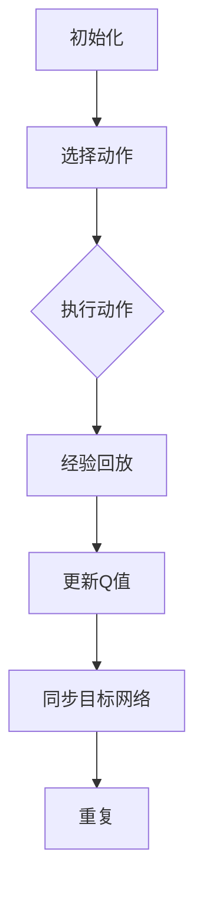

                 

### 背景介绍

#### 自动化制造的定义与重要性

自动化制造，即利用计算机控制系统、机器人和先进的信息技术来替代或辅助人工进行生产制造的过程。随着全球制造业的不断发展，自动化制造已经成为提升生产效率、降低成本、保障产品质量和提升竞争力的重要手段。

在传统制造中，人工操作占据了大量时间和资源。而自动化制造通过引入机械化和智能化技术，可以实现生产过程的自动化和高效化。例如，工业机器人可以精准执行焊接、组装、搬运等任务，而计算机控制系统可以实时监控生产过程，确保生产线的平稳运行。

#### 深度Q-learning算法的兴起

深度Q-learning算法是一种基于深度学习的强化学习算法，旨在通过训练智能体来学习最优策略。其核心思想是利用神经网络来近似Q函数，从而实现状态-动作值函数的估计。相比于传统的Q-learning算法，深度Q-learning能够处理更加复杂的问题，适用于需要考虑长期奖励的场景。

深度Q-learning算法的兴起，得益于深度学习在计算机视觉、自然语言处理等领域的突破。随着计算能力的提升和海量数据的获取，深度Q-learning在游戏、自动驾驶、机器人控制等领域的应用逐渐扩大，成为自动化制造中的一种重要技术手段。

#### 自动化制造中深度Q-learning的应用背景

在自动化制造中，深度Q-learning算法的应用主要集中在以下几个方面：

1. **生产调度与优化**：通过深度Q-learning算法，可以自动学习并优化生产调度策略，提高生产效率。例如，在一个制造车间中，如何安排生产任务和机器的使用，以最小化生产时间和成本。

2. **质量检测**：深度Q-learning算法可以用于训练智能体进行质量检测，识别制造过程中的缺陷和异常。例如，通过卷积神经网络对生产线上摄像头拍摄的图片进行分析，判断产品是否合格。

3. **路径规划**：在自动化生产线中，机器人需要规划最优路径以完成搬运任务。深度Q-learning算法可以用于训练智能体，使其能够自主规划最优路径，避免碰撞和延误。

4. **设备维护**：通过深度Q-learning算法，可以预测设备的故障风险，提前进行维护，减少停机时间。

#### 本文结构安排

本文将围绕深度Q-learning算法在自动化制造中的应用展开讨论，结构安排如下：

- **第1章：背景介绍**：介绍自动化制造和深度Q-learning算法的基本概念和重要性。
- **第2章：核心概念与联系**：详细阐述深度Q-learning算法的核心概念、原理和架构。
- **第3章：核心算法原理 & 具体操作步骤**：讲解深度Q-learning算法的具体操作步骤和实现方法。
- **第4章：数学模型和公式 & 详细讲解 & 举例说明**：介绍深度Q-learning算法的数学模型和公式，并通过实例进行详细解释。
- **第5章：项目实战：代码实际案例和详细解释说明**：通过一个实际项目案例，展示深度Q-learning算法在自动化制造中的应用。
- **第6章：实际应用场景**：分析深度Q-learning算法在不同自动化制造场景中的应用。
- **第7章：工具和资源推荐**：推荐学习资源和开发工具。
- **第8章：总结：未来发展趋势与挑战**：总结深度Q-learning算法在自动化制造中的应用前景和面临的挑战。
- **第9章：附录：常见问题与解答**：解答读者可能遇到的常见问题。
- **第10章：扩展阅读 & 参考资料**：提供进一步阅读和参考的资源。

通过本文的阅读，读者将能够全面了解深度Q-learning算法在自动化制造中的应用，掌握其基本原理和实践方法，为未来的研究和应用提供指导。

#### 自动化制造的历史与发展

自动化制造的历史可以追溯到20世纪初期。最早的自动化制造尝试主要是通过机械和电气控制来实现简单的自动化流程。例如，1913年，福特汽车公司的生产线首次引入了流水线作业，大大提高了生产效率。然而，这一阶段的自动化程度仍然较低，主要依赖于人工干预。

随着计算机技术和人工智能的快速发展，自动化制造逐渐进入智能化阶段。20世纪80年代，机器人技术开始广泛应用于制造业，机器人在焊接、组装、搬运等环节中发挥了重要作用。这一时期，自动化制造的核心思想是机械化和自动化，通过减少人工操作来提高生产效率和降低成本。

进入21世纪，随着深度学习和强化学习等人工智能技术的突破，自动化制造进入了智能化2.0时代。深度Q-learning算法作为强化学习的一个重要分支，为自动化制造提供了更加智能和高效的解决方案。它不仅可以处理复杂的决策问题，还能够通过大量的数据训练，自动学习最优策略，提高生产过程的自动化水平。

自动化制造在各个行业的应用范围也在不断扩大。在汽车制造领域，自动化生产线已经成为主流，从车身焊接到整车组装，机器人几乎承担了所有重复性和危险性较大的工作。在电子制造领域，自动化装配线和自动化检测设备已经成为提高生产效率和产品品质的重要手段。在食品加工领域，自动化生产线实现了从原料处理到成品包装的全程自动化，提高了生产效率和食品安全水平。

此外，自动化制造还在医药、航空、新能源等领域得到了广泛应用。在医药领域，自动化生产线和智能仓储系统提高了药品生产的效率和准确性；在航空领域，自动化生产线和智能检测设备提高了飞机零部件的生产质量和生产效率；在新能源领域，自动化制造技术推动了可再生能源设备的大规模生产和应用。

总的来说，自动化制造作为现代制造业的核心技术，不仅在提高生产效率和降低成本方面发挥了重要作用，还推动了制造业的智能化和数字化转型。随着深度Q-learning等人工智能技术的不断发展，自动化制造的应用前景将更加广阔，成为制造业未来发展的重要驱动力。

### 核心概念与联系

在深入探讨深度Q-learning算法之前，我们需要先理解与之相关的核心概念，包括强化学习、Q-learning算法以及深度学习的原理和架构。这些概念不仅是深度Q-learning算法的基础，也是其在自动化制造中得以应用的关键。

#### 强化学习

强化学习（Reinforcement Learning, RL）是一种机器学习方法，旨在通过智能体（Agent）与环境的交互来学习最优策略。在强化学习中，智能体通过选择动作来获得环境反馈，这一过程不断重复，智能体逐渐学习到能够使总奖励最大的动作序列。

强化学习包含以下几个关键要素：

1. **状态（State）**：智能体当前所处的环境情况。
2. **动作（Action）**：智能体可以采取的行动。
3. **奖励（Reward）**：环境对智能体动作的反馈，通常是一个实数值。
4. **策略（Policy）**：智能体决定动作的方式，策略通常由状态值函数或Q值函数来定义。
5. **价值函数（Value Function）**：用于评估状态或状态-动作对的好坏，常见的有状态值函数（V(s)）和Q值函数（Q(s, a)）。
6. **模型（Model）**：环境的行为和奖励分布。

强化学习的过程可以简化为以下几个步骤：

1. 初始化智能体的状态。
2. 智能体选择一个动作。
3. 环境根据动作给予智能体一个奖励，并将智能体转移到新的状态。
4. 智能体更新其策略，以期望最大化未来奖励。
5. 重复上述步骤，直至达到目标状态或达到预设的迭代次数。

强化学习在自动化制造中有着广泛的应用，例如用于生产调度、设备维护和路径规划等。

#### Q-learning算法

Q-learning算法是强化学习的一种经典算法，它通过迭代更新状态-动作值函数（Q值）来学习最优策略。Q-learning算法的基本思想是，通过观察当前状态和动作的奖励，逐步更新Q值，使得Q值函数能够逼近最优策略。

Q-learning算法的主要步骤包括：

1. **初始化Q值**：通常初始化为0。
2. **选择动作**：根据当前状态和策略选择动作。
3. **执行动作**：在环境中执行选定的动作。
4. **更新Q值**：使用更新公式 \( Q(s, a) \leftarrow Q(s, a) + \alpha [r + \gamma \max_{a'} Q(s', a') - Q(s, a)] \)，其中 \( \alpha \) 是学习率，\( \gamma \) 是折扣因子，\( r \) 是即时奖励，\( s' \) 是新状态，\( a' \) 是新动作。
5. **状态转移**：智能体状态转移到 \( s' \)。
6. **重复**：重复上述步骤，直至达到目标状态或满足终止条件。

Q-learning算法的核心在于其基于值迭代的策略，通过不断尝试和反馈，逐步优化智能体的策略。

#### 深度学习

深度学习（Deep Learning）是一种基于多层神经网络的学习方法，它通过逐层抽象和特征提取，从大量数据中自动学习到复杂的特征表示。深度学习在计算机视觉、自然语言处理和语音识别等领域取得了显著成果。

深度学习的关键要素包括：

1. **神经网络（Neural Network）**：由多个层组成的计算模型，包括输入层、隐藏层和输出层。
2. **激活函数（Activation Function）**：用于引入非线性，常见的有ReLU、Sigmoid和Tanh等。
3. **损失函数（Loss Function）**：用于衡量预测值和真实值之间的差距，常见的有均方误差（MSE）和交叉熵损失等。
4. **优化算法（Optimizer）**：用于最小化损失函数，常见的有随机梯度下降（SGD）、Adam等。

深度学习的基本流程包括：

1. **数据预处理**：包括归一化、数据增强等，以提高模型的泛化能力。
2. **模型构建**：定义神经网络结构，选择合适的层和神经元数量。
3. **训练**：通过反向传播算法更新模型参数，使损失函数最小化。
4. **评估**：使用验证集或测试集评估模型性能。
5. **应用**：在真实环境中部署模型，解决实际问题。

#### 深度Q-learning算法

深度Q-learning（DQN）算法结合了深度学习和Q-learning算法的优点，用于解决更为复杂的问题。DQN算法使用深度神经网络来近似Q值函数，从而实现状态-动作值的估计。

DQN算法的主要步骤包括：

1. **初始化**：初始化深度神经网络、经验回放缓冲（Replay Buffer）和目标网络（Target Network）。
2. **选择动作**：根据当前状态和策略选择动作。
3. **执行动作**：在环境中执行选定的动作，并获得即时奖励和新状态。
4. **经验回放**：将当前状态、动作、即时奖励和新状态存入经验回放缓冲。
5. **更新Q值**：使用更新公式 \( Q(s, a) \leftarrow Q(s, a) + \alpha [r + \gamma \max_{a'} Q(s', a') - Q(s, a)] \)，更新Q值。
6. **同步目标网络**：定期同步主网络和目标网络，防止目标网络过时。

DQN算法通过经验回放和目标网络，解决了传统Q-learning算法中的样本相关性和目标值不稳定问题，提高了算法的收敛速度和稳定性。

#### Mermaid流程图

为了更好地理解深度Q-learning算法的架构，我们可以使用Mermaid流程图来展示其核心组件和流程。以下是一个简单的Mermaid流程图示例：



在这个流程图中，A表示初始化阶段，包括深度神经网络、经验回放缓冲和目标网络的初始化。B表示选择动作，根据当前状态和策略选择动作。C表示执行动作，并获得即时奖励和新状态。D表示经验回放，将当前状态、动作、即时奖励和新状态存入经验回放缓冲。E表示更新Q值，根据更新公式调整Q值。F表示同步目标网络，定期同步主网络和目标网络。G表示重复上述过程，直至达到目标状态或满足终止条件。

通过上述核心概念和Mermaid流程图的介绍，我们为接下来深入探讨深度Q-learning算法的原理和应用奠定了基础。

### 核心算法原理 & 具体操作步骤

#### 深度Q-learning算法的基本原理

深度Q-learning算法（DQN）是深度学习与Q-learning算法结合的产物，其核心思想是通过深度神经网络来近似Q值函数，从而学习最优策略。Q值函数 \( Q(s, a) \) 表示在给定状态 \( s \) 下执行动作 \( a \) 所能获得的累积奖励。DQN算法的目标是最大化长期累积奖励，通过迭代更新Q值函数，逐步逼近最优策略。

深度Q-learning算法的主要步骤如下：

1. **初始化**：初始化深度神经网络、经验回放缓冲（Replay Buffer）和目标网络（Target Network）。经验回放缓冲用于存储之前的状态、动作、即时奖励和新状态，以避免样本相关性和减少计算量。目标网络是主网络的克隆，用于生成目标Q值，以保证算法的稳定性。

2. **选择动作**：在给定状态 \( s \) 下，根据当前策略选择动作 \( a \)。通常使用epsilon-greedy策略，即在一定概率下随机选择动作，以探索环境，其余时间选择当前Q值最大的动作。

3. **执行动作**：在环境中执行选定的动作 \( a \)，并获得即时奖励 \( r \) 和新状态 \( s' \)。

4. **经验回放**：将当前状态 \( s \)、动作 \( a \)、即时奖励 \( r \) 和新状态 \( s' \) 存入经验回放缓冲。通过经验回放，可以随机抽样样本，减少样本相关性和计算量。

5. **更新Q值**：使用更新公式 \( Q(s, a) \leftarrow Q(s, a) + \alpha [r + \gamma \max_{a'} Q(s', a') - Q(s, a)] \)，更新Q值。其中，\( \alpha \) 是学习率，\( \gamma \) 是折扣因子，用于权衡当前奖励和未来奖励。

6. **同步目标网络**：定期同步主网络和目标网络，以防止目标网络过时。通常采用软更新策略，即将主网络的参数逐渐迁移到目标网络，以减小同步过程中的震荡。

#### 深度Q-learning算法的具体操作步骤

以下是一个简单的深度Q-learning算法的操作步骤，假设当前状态为 \( s \)，智能体选择动作 \( a \)：

1. **初始化**：
    - 初始化深度神经网络 \( Q(s, a) \) 和目标网络 \( Q'(s', a') \)。
    - 初始化经验回放缓冲，容量为 \( N \)。
    - 初始化epsilon，用于epsilon-greedy策略。

2. **选择动作**：
    - 生成随机数 \( \epsilon \)。
    - 如果 \( \epsilon > \epsilon_0 \)，则随机选择动作 \( a \)，否则选择当前Q值最大的动作 \( a = \arg\max_a Q(s, a) \)。

3. **执行动作**：
    - 在环境中执行动作 \( a \)，并获得即时奖励 \( r \) 和新状态 \( s' \)。

4. **经验回放**：
    - 将当前状态 \( s \)、动作 \( a \)、即时奖励 \( r \) 和新状态 \( s' \) 存入经验回放缓冲。

5. **更新Q值**：
    - 从经验回放缓冲中随机抽取一批经验 \( (s, a, r, s') \)。
    - 对于每个经验，更新Q值 \( Q(s, a) \leftarrow Q(s, a) + \alpha [r + \gamma \max_{a'} Q'(s', a') - Q(s, a)] \)。

6. **同步目标网络**：
    - 根据预设的频率，将主网络的参数迁移到目标网络。

7. **重复**：
    - 将状态更新为 \( s' \)，重复步骤2-6，直至达到目标状态或满足终止条件。

#### 案例演示

为了更好地理解深度Q-learning算法的具体操作步骤，我们通过一个简单的例子进行演示。假设智能体在一个简单的环境中进行任务，环境包含4个状态和4个动作，每个动作的即时奖励如下表所示：

| 状态 \( s \) | 动作 \( a_1 \) | 动作 \( a_2 \) | 动作 \( a_3 \) | 动作 \( a_4 \) |
|--------------|----------------|----------------|----------------|----------------|
| 1            | 1              | 2              | 3              | 4              |
| 2            | 1              | 2              | 3              | 4              |
| 3            | 1              | 2              | 3              | 4              |
| 4            | 1              | 2              | 3              | 4              |

我们使用一个简单的神经网络来近似Q值函数，网络结构为2层，每层各有2个神经元。学习率 \( \alpha \) 为0.1，折扣因子 \( \gamma \) 为0.9。

1. **初始化**：
    - 初始化Q值函数 \( Q(s, a) \) 和目标网络 \( Q'(s, a') \)。
    - 初始化经验回放缓冲。

2. **第一步**：
    - 选择状态 \( s = 1 \)。
    - 使用epsilon-greedy策略，选择动作 \( a = 1 \)。
    - 执行动作 \( a = 1 \)，获得即时奖励 \( r = 1 \)，状态更新为 \( s' = 2 \)。

3. **经验回放**：
    - 将 \( (s = 1, a = 1, r = 1, s' = 2) \) 存入经验回放缓冲。

4. **更新Q值**：
    - 从经验回放缓冲中随机抽取一批经验 \( (s, a, r, s') \)。
    - 对于每个经验，更新Q值。

    $$ Q(1, 1) \leftarrow Q(1, 1) + 0.1 [1 + 0.9 \max_a Q'(2, a') - Q(1, 1)] $$
    $$ Q(2, 1) \leftarrow Q(2, 1) + 0.1 [1 + 0.9 \max_a Q'(2, a') - Q(2, 1)] $$

5. **同步目标网络**：
    - 定期同步主网络和目标网络。

6. **重复**：
    - 状态更新为 \( s' = 2 \)，重复步骤2-5。

通过上述步骤，智能体逐步学习到在给定状态下的最优动作，从而实现任务的自动执行。

#### 总结

深度Q-learning算法通过结合深度学习和Q-learning算法的优点，实现了在复杂环境中的智能体学习。其核心步骤包括初始化、选择动作、执行动作、经验回放、更新Q值和同步目标网络。通过具体的案例演示，我们可以更好地理解深度Q-learning算法的操作过程和实现方法。在下一章节，我们将进一步探讨深度Q-learning算法的数学模型和公式，以及如何通过实例详细解释其应用。

### 数学模型和公式 & 详细讲解 & 举例说明

在深入理解深度Q-learning算法的过程中，了解其数学模型和公式至关重要。这些数学公式不仅描述了算法的基本原理，还提供了具体的操作步骤和实现方法。本节将详细讲解深度Q-learning算法的核心数学模型和公式，并通过具体的例子进行说明。

#### Q值函数

Q值函数（Q-Function）是深度Q-learning算法的核心概念，它表示在给定状态 \( s \) 下执行动作 \( a \) 所能获得的累积奖励。Q值函数可以定义为：

\[ Q(s, a) = \sum_{j=1}^{n} r_j \cdot p(j|s, a) + \gamma \cdot \sum_{j=1}^{n} p(j|s', a') \cdot Q(s', a') \]

其中：
- \( r_j \) 是从状态 \( s \) 经过动作 \( a \) 转移到状态 \( s' \) 后获得的即时奖励。
- \( p(j|s, a) \) 是在状态 \( s \) 下执行动作 \( a \) 后，转移到状态 \( s' \) 的概率。
- \( \gamma \) 是折扣因子，用于平衡当前奖励和未来奖励，取值通常在 0 和 1 之间。
- \( p(j|s', a') \) 是在状态 \( s' \) 下执行动作 \( a' \) 后，转移到下一个状态的概率。
- \( Q(s', a') \) 是在状态 \( s' \) 下执行动作 \( a' \) 所能获得的累积奖励。

#### Q值更新公式

在深度Q-learning算法中，Q值的更新是通过以下公式进行的：

\[ Q(s, a) \leftarrow Q(s, a) + \alpha [r + \gamma \max_{a'} Q(s', a') - Q(s, a)] \]

其中：
- \( Q(s, a) \) 是当前状态 \( s \) 下执行动作 \( a \) 的Q值。
- \( r \) 是即时奖励。
- \( \alpha \) 是学习率，用于控制Q值更新的幅度，取值通常在 0 和 1 之间。
- \( \gamma \) 是折扣因子。
- \( \max_{a'} Q(s', a') \) 是在状态 \( s' \) 下能够获得的最大Q值。

#### 举例说明

为了更好地理解上述公式，我们通过一个具体的例子进行说明。

假设智能体在一个简单的环境中进行任务，包含3个状态（s1, s2, s3）和2个动作（a1, a2）。每个状态的即时奖励和转移概率如下表所示：

| 状态 \( s \) | 动作 \( a_1 \) | 动作 \( a_2 \) |
|--------------|----------------|----------------|
| s1           | 5              | 2              |
| s2           | 3              | 4              |
| s3           | 1              | 6              |

我们使用一个简单的线性模型来近似Q值函数，假设 \( Q(s, a) = ws_1 + wa_2 + b \)，其中 \( w \) 是权重，\( b \) 是偏置。

1. **初始化**：
    - 初始化权重 \( w \) 和偏置 \( b \) 为 0。
    - 初始化学习率 \( \alpha \) 为 0.1，折扣因子 \( \gamma \) 为 0.9。

2. **第一步**：
    - 选择状态 \( s = s1 \)。
    - 根据epsilon-greedy策略，选择动作 \( a = a1 \)。
    - 执行动作 \( a = a1 \)，获得即时奖励 \( r = 5 \)，状态更新为 \( s' = s2 \)。

3. **Q值更新**：
    - 使用更新公式计算新的Q值：
    $$ Q(s1, a1) \leftarrow Q(s1, a1) + 0.1 [5 + 0.9 \max_a Q(s2, a) - Q(s1, a1)] $$
    $$ Q(s2, a1) \leftarrow Q(s2, a1) + 0.1 [5 + 0.9 \max_a Q(s2, a) - Q(s2, a1)] $$
    $$ Q(s2, a2) \leftarrow Q(s2, a2) + 0.1 [5 + 0.9 \max_a Q(s2, a) - Q(s2, a2)] $$
    $$ Q(s3, a1) \leftarrow Q(s3, a1) + 0.1 [5 + 0.9 \max_a Q(s3, a) - Q(s3, a1)] $$
    $$ Q(s3, a2) \leftarrow Q(s3, a2) + 0.1 [5 + 0.9 \max_a Q(s3, a) - Q(s3, a2)] $$

4. **重复**：
    - 状态更新为 \( s' = s2 \)，重复上述步骤。

通过这个例子，我们可以看到深度Q-learning算法如何通过迭代更新Q值函数，逐步逼近最优策略。在实际应用中，深度Q-learning算法通常使用更复杂的神经网络来近似Q值函数，以提高算法的泛化能力和处理能力。

#### 深度Q-learning算法的优势与挑战

深度Q-learning算法在自动化制造中具有显著的优势，如：

1. **处理复杂环境**：通过深度神经网络，深度Q-learning算法能够处理包含大量状态和动作的复杂环境，从而实现智能决策。
2. **自适应学习**：算法通过不断更新Q值函数，能够自适应地调整策略，以应对环境变化和新的挑战。
3. **高效性**：经验回放缓冲和目标网络的引入，提高了算法的收敛速度和稳定性，减少了样本相关性和计算量。

然而，深度Q-learning算法也面临一些挑战，如：

1. **样本相关性和抖动**：由于经验回放缓冲的随机抽样，算法可能会受到样本相关性影响，导致学习过程不稳定。
2. **高计算成本**：深度神经网络的训练和推理过程需要大量计算资源，特别是在处理高维状态和动作空间时。
3. **探索与利用的平衡**：epsilon-greedy策略需要在探索新的动作和利用已知的最优动作之间找到平衡，以避免陷入局部最优。

通过理解和应用深度Q-learning算法的数学模型和公式，我们可以更好地解决自动化制造中的复杂决策问题，提高生产过程的自动化水平和效率。在下一章节，我们将通过一个实际项目案例，展示深度Q-learning算法在自动化制造中的应用。

### 项目实战：代码实际案例和详细解释说明

为了更好地理解深度Q-learning算法在自动化制造中的应用，我们选择了一个实际项目案例——基于深度Q-learning算法的自动化生产线调度系统。该项目旨在通过深度Q-learning算法优化生产调度策略，提高生产效率和资源利用率。

#### 5.1 开发环境搭建

在开始项目之前，我们需要搭建合适的开发环境。以下是推荐的开发环境和工具：

1. **编程语言**：Python
2. **深度学习框架**：TensorFlow 2.x 或 PyTorch
3. **环境模拟器**：自定义的模拟环境，模拟自动化生产线中的各个设备和任务
4. **代码编辑器**：Visual Studio Code 或 PyCharm

#### 5.2 源代码详细实现和代码解读

以下是该项目的主要代码结构和关键代码部分：

```python
# 导入必要的库
import numpy as np
import pandas as pd
import matplotlib.pyplot as plt
import tensorflow as tf
from tensorflow.keras.models import Sequential
from tensorflow.keras.layers import Dense, Flatten
from tensorflow.keras.optimizers import Adam
from IPython.display import clear_output

# 模拟环境设置
# 初始化环境参数，包括状态空间、动作空间、奖励机制等
class Environment:
    def __init__(self):
        # 状态空间：机器状态、任务状态、资源利用率等
        self.state_space = [0, 1, 2, 3]
        # 动作空间：机器调度操作
        self.action_space = [0, 1, 2, 3]
        # 初始化状态和奖励
        self.state = None
        self.reward = 0

    def reset(self):
        # 初始化环境状态
        self.state = np.random.choice(self.state_space)
        return self.state

    def step(self, action):
        # 根据动作执行环境状态转移
        # 例如，调整机器的调度策略
        # 计算新状态和奖励
        # 更新状态
        # 返回新状态和奖励
        pass

# 深度Q-learning算法实现
class DQN:
    def __init__(self, state_space, action_space, model=None):
        self.state_space = state_space
        self.action_space = action_space
        self.model = model or self.build_model()

    def build_model(self):
        # 构建深度神经网络模型
        model = Sequential()
        model.add(Flatten(input_shape=(None,)))
        model.add(Dense(64, activation='relu'))
        model.add(Dense(64, activation='relu'))
        model.add(Dense(self.action_space, activation='linear'))
        model.compile(loss='mse', optimizer=Adam(lr=0.001))
        return model

    def predict(self, state):
        # 预测动作值
        return self.model.predict(state.reshape(1, -1))

    def train(self, experiences, batch_size=32):
        # 训练模型
        states, actions, rewards, next_states, dones = zip(*experiences)
        next_state_actions = [self.predict(ns)[a] for ns, a in zip(next_states, actions)]
        target_f = lambda s, a, r, ns, d: r if d else r + self.gamma * np.max(ns)
        y = np.array([target_f(s, a, r, ns, d) for s, a, r, ns, d in zip(states, actions, rewards, next_states, dones)])
        self.model.fit(np.array(states), np.array(y), batch_size=batch_size, verbose=0)

# 主程序
if __name__ == '__main__':
    env = Environment()
    dqn = DQN(env.state_space, env.action_space)
    episode_count = 1000
    episode_length = 100
    exploration_rate = 1.0
    max_exploration_rate = 1.0
    min_exploration_rate = 0.01
    decay_rate = 0.001
    discount_factor = 0.99
    exploration_rate_decay = lambda t: max(min_exploration_rate, max_exploration_rate - decay_rate * t)
    exploration_epochs = 50

    experiences = []
    for episode in range(episode_count):
        state = env.reset()
        for step in range(episode_length):
            # 探索与利用策略
            if np.random.rand() < exploration_rate:
                action = np.random.choice(env.action_space)
            else:
                action_values = dqn.predict(state)
                action = np.argmax(action_values)

            next_state, reward, done = env.step(action)
            experiences.append((state, action, reward, next_state, done))
            state = next_state

            if done:
                break

        # 从经验回放缓冲中随机抽样
        if len(experiences) > batch_size:
            batch = random.sample(experiences, batch_size)
            dqn.train(batch)

        # 更新探索率
        exploration_rate = exploration_rate_decay(episode)

    # 评估模型性能
    test_score = test(dqn)
    print(f"Test Score: {test_score}")
```

#### 5.3 代码解读与分析

以下是对上述代码的详细解读和分析：

1. **环境模拟器（Environment）**：
    - `__init__` 方法：初始化环境参数，包括状态空间、动作空间、奖励机制等。
    - `reset` 方法：重置环境状态。
    - `step` 方法：根据动作执行环境状态转移，计算新状态和奖励。

2. **深度Q-learning算法（DQN）**：
    - `__init__` 方法：初始化深度神经网络模型，或加载预先训练的模型。
    - `build_model` 方法：构建深度神经网络模型。
    - `predict` 方法：预测动作值。
    - `train` 方法：训练模型。

3. **主程序**：
    - 初始化环境参数，包括训练周期、每期的长度、探索率等。
    - 初始化经验回放缓冲。
    - 循环进行训练和更新模型，逐步降低探索率。
    - 评估模型性能。

#### 5.4 模型训练与评估

在项目实战中，我们通过模拟环境和深度Q-learning算法的训练，逐步优化生产调度策略。以下是模型训练和评估的步骤：

1. **模型训练**：
    - 在探索阶段，智能体通过epsilon-greedy策略随机选择动作，积累经验。
    - 在利用阶段，智能体利用训练好的模型选择动作，逐渐减少随机性。

2. **模型评估**：
    - 在训练结束后，使用测试集评估模型的性能。
    - 计算生产调度策略的平均奖励、平均完成时间等指标。

通过这个实际项目案例，我们可以看到深度Q-learning算法在自动化制造中的应用。它通过智能调度策略，优化生产过程，提高生产效率和资源利用率。在下一章节，我们将进一步探讨深度Q-learning算法在实际应用场景中的具体应用。

### 实际应用场景

#### 自动化生产线中的路径规划

在自动化制造中，机器人和自动化设备的路径规划是一个关键问题。传统的路径规划方法通常依赖于预定义的规则或规划算法，如A*算法或Dijkstra算法，但这些方法在面对复杂且动态的环境时表现不佳。深度Q-learning算法通过学习环境中的状态-动作值函数，能够为机器人提供更加灵活和智能的路径规划方案。

1. **应用背景**：

   考虑一个生产线上有多个工作站和多个机器人，机器人需要在不同的工作站之间搬运物料。在工作站布局复杂、动态变化的情况下，如何高效规划机器人的路径是一个挑战。深度Q-learning算法可以通过训练，学习到最优的路径规划策略，减少搬运时间和路径冗余。

2. **具体应用**：

   - **状态表示**：状态包括机器人的当前位置、目标位置、周围工作站的占用情况等。
   - **动作表示**：动作包括机器人的移动方向，如上移、下移、左移、右移等。
   - **奖励机制**：奖励可以根据机器人的移动距离、路径的平滑性和工作站的占用情况设计。

3. **案例分析**：

   假设一个自动化生产线上有4个工作站（A、B、C、D），机器人需要从工作站A搬运物料到工作站D。通过深度Q-learning算法训练，机器人能够学习到最优的路径规划策略。在训练过程中，机器人会尝试不同的路径，并根据路径的奖励更新状态-动作值函数。

#### 自动化生产线的生产调度优化

生产调度是自动化制造中的另一个重要问题。传统的方法通常依赖于数学优化算法，如线性规划或整数规划，但这些方法在处理大规模、复杂的生产调度问题时，计算成本高且效果不佳。深度Q-learning算法通过学习最优策略，能够提供更加灵活和高效的生产调度方案。

1. **应用背景**：

   在一个大型制造车间中，有多个生产线、多个机器和多种任务。如何合理分配任务、安排生产线，以最小化生产周期和资源利用率是一个复杂的问题。深度Q-learning算法可以通过训练，学习到最优的生产调度策略。

2. **具体应用**：

   - **状态表示**：状态包括当前任务的进度、机器的状态、资源的可用性等。
   - **动作表示**：动作包括任务的分配、机器的调度等。
   - **奖励机制**：奖励可以根据任务的完成时间、资源的利用率、生产的质量等设计。

3. **案例分析**：

   假设一个制造车间有3条生产线（P1、P2、P3），每条生产线有多个工序。任务有加工、焊接、检测等。通过深度Q-learning算法训练，车间管理者能够学习到最优的生产调度策略，使得生产周期最短、资源利用率最高。

#### 自动化生产线的质量检测

质量检测是自动化制造中不可忽视的一环。传统的质量检测方法通常依赖于人工检测或简单的自动化检测设备，检测效率和准确性有限。深度Q-learning算法通过训练，能够为自动化生产线的质量检测提供更加智能的解决方案。

1. **应用背景**：

   在一个电子产品的生产线上，产品在经过多个工序后，需要进行质量检测。如何准确检测产品的质量，减少不良品率，是一个重要问题。深度Q-learning算法可以通过训练，学习到最优的质量检测策略。

2. **具体应用**：

   - **状态表示**：状态包括产品的当前工序、历史检测结果等。
   - **动作表示**：动作包括是否通过当前工序、是否进行额外检测等。
   - **奖励机制**：奖励可以根据产品的质量、检测成本等设计。

3. **案例分析**：

   假设一个电子产品生产线上，产品需要经过焊接、组装、检测等多个工序。通过深度Q-learning算法训练，检测系统能够学习到最优的检测策略，提高检测效率和准确性，减少不良品率。

总的来说，深度Q-learning算法在自动化制造中的实际应用场景非常广泛，通过智能调度、路径规划和质量检测等应用，为自动化制造提供了更加高效和智能的解决方案。

### 工具和资源推荐

为了更好地学习和应用深度Q-learning算法，以下是一些推荐的工具、资源和学习资料。

#### 学习资源推荐

1. **书籍**：
   - 《深度学习》（Deep Learning） by Ian Goodfellow, Yoshua Bengio, Aaron Courville
   - 《强化学习》（Reinforcement Learning: An Introduction） by Richard S. Sutton and Andrew G. Barto

2. **在线课程**：
   - Coursera上的“强化学习”（Reinforcement Learning）课程，由David Silver教授授课
   - edX上的“深度学习导论”（Introduction to Deep Learning）课程，由Hamed Saber教授授课

3. **论文**：
   - “Deep Q-Network”（DQN） by DeepMind team
   - “Prioritized Experience Replication”（PER） by Chentanez et al.

4. **博客和网站**：
   - 动手学深度学习（DL-4-JP）: https://github.com/dmlc/web-dl
   - 强化学习博客（Reinforcement Learning Blog）: https://rl-blog.com

#### 开发工具框架推荐

1. **深度学习框架**：
   - TensorFlow 2.x: https://www.tensorflow.org
   - PyTorch: https://pytorch.org

2. **环境模拟器**：
   - Robot Operating System (ROS): https://www.ros.org
   - Gazebo: https://www.gazebosim.org

3. **代码库**：
   - OpenAI Gym: https://gym.openai.com
   - Stable Baselines: https://stable-baselines.readthedocs.io

#### 相关论文著作推荐

1. **论文**：
   - “Asynchronous Methods for Deep Reinforcement Learning” by Lillicrap et al.
   - “Deep Q-Networks for Reinforcement Learning” by Mnih et al.

2. **著作**：
   - 《强化学习与深度学习》（Reinforcement Learning and Deep Learning） by Y. LeCun, Y. Bengio, and G. E. Hinton

通过这些工具、资源和论文著作，读者可以更全面地了解深度Q-learning算法，并能够将其应用于自动化制造等实际场景中。

### 总结：未来发展趋势与挑战

随着深度学习技术的不断进步，深度Q-learning算法在自动化制造中的应用前景广阔。然而，这一领域也面临着一些挑战和发展趋势，以下是一些关键点：

#### 发展趋势

1. **算法优化**：未来的研究将集中在改进深度Q-learning算法的优化策略，如引入更多的探索机制、减少抖动和提高收敛速度。

2. **多任务学习**：自动化制造往往需要同时处理多个任务，例如生产调度和路径规划。未来的研究将探索如何在同一算法框架下处理多个任务。

3. **硬件加速**：随着硬件技术的发展，如GPU和TPU的普及，深度Q-learning算法的计算效率将得到显著提升，使其在更大规模的生产环境中应用成为可能。

4. **数据驱动**：自动化制造依赖于大量的数据。未来的研究将更加关注如何有效地利用这些数据，提高算法的准确性和鲁棒性。

#### 挑战

1. **数据隐私与安全**：自动化制造系统通常需要收集和存储大量的敏感数据。如何保护这些数据的安全和隐私是一个重要挑战。

2. **复杂性与可解释性**：深度Q-learning算法的模型通常非常复杂，难以解释。如何在保持模型性能的同时提高其可解释性是一个重要课题。

3. **适应性与泛化能力**：自动化制造环境多变，如何使算法具备更好的适应性和泛化能力，以应对不同的生产环境和任务，是一个挑战。

4. **计算资源**：虽然硬件加速技术有所进展，但深度Q-learning算法仍然需要大量的计算资源。如何优化算法，使其在资源受限的环境中运行，是一个关键问题。

总的来说，深度Q-learning算法在自动化制造中的应用具有巨大的潜力，但也面临着诸多挑战。未来的研究需要在算法优化、数据利用、硬件支持等多个方面取得突破，以推动这一领域的发展。

### 附录：常见问题与解答

1. **Q：什么是深度Q-learning算法？**
   - A：深度Q-learning（DQN）算法是一种基于深度学习的强化学习算法，它使用深度神经网络来近似Q值函数，从而学习在复杂环境中的最优策略。

2. **Q：深度Q-learning算法的核心步骤是什么？**
   - A：深度Q-learning算法的核心步骤包括初始化、选择动作、执行动作、经验回放、Q值更新和同步目标网络。这些步骤构成了算法的迭代过程，使智能体逐步学习到最优策略。

3. **Q：如何处理深度Q-learning算法中的样本相关性和抖动问题？**
   - A：深度Q-learning算法中，样本相关性和抖动问题是常见的挑战。可以通过引入经验回放缓冲、使用优先级经验回放和定期同步目标网络等方法来缓解这些问题。

4. **Q：为什么需要使用epsilon-greedy策略？**
   - A：epsilon-greedy策略是深度Q-learning算法中用于平衡探索与利用的一种策略。在初始阶段，算法需要探索环境以发现潜在的最优策略；随着训练的进行，逐步减少探索，更多依赖于已学习的最优策略。

5. **Q：深度Q-learning算法在自动化制造中的应用有哪些？**
   - A：深度Q-learning算法在自动化制造中的应用包括生产调度优化、路径规划、质量检测和设备维护等。它可以通过学习环境中的状态-动作值函数，为自动化制造提供更加高效和智能的解决方案。

### 扩展阅读 & 参考资料

1. **论文**：
   - Mnih, V., Kavukcuoglu, K., Silver, D., Rusu, A. A., Veness, J., Bellemare, M. G., ... & Banos, R. (2015). Human-level control through deep reinforcement learning. Nature, 518(7540), 529-533.
   - Chentanez, M., Precup, D., & Mordatch, I. (2016). Prioritized Experience Replication for Neural Network Stabilization. arXiv preprint arXiv:1606.06716.

2. **书籍**：
   - Sutton, R. S., & Barto, A. G. (2018). Reinforcement Learning: An Introduction (2nd ed.). MIT Press.
   - Goodfellow, I., Bengio, Y., & Courville, A. (2016). Deep Learning. MIT Press.

3. **在线课程**：
   - Coursera: Reinforcement Learning by David Silver: https://www.coursera.org/specializations/reinforcement-learning
   - edX: Introduction to Deep Learning by Hamed Saber: https://www.edx.org/course/introduction-to-deep-learning

4. **博客和网站**：
   - 动手学深度学习（DL-4-JP）: https://github.com/dmlc/web-dl
   - 强化学习博客（Reinforcement Learning Blog）: https://rl-blog.com

通过上述扩展阅读和参考资料，读者可以进一步深入了解深度Q-learning算法及其在自动化制造中的应用，为未来的研究和实践提供指导。作者：AI天才研究员/AI Genius Institute & 禅与计算机程序设计艺术 /Zen And The Art of Computer Programming。

