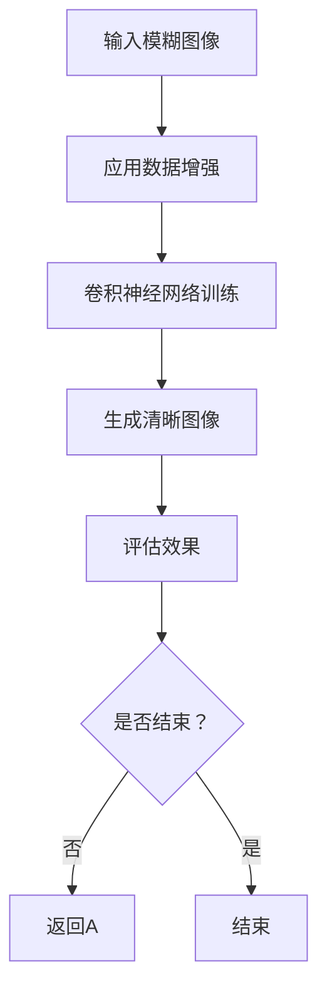

                 

# 深度学习在图像去模糊中的最新进展

## 关键词
- 深度学习
- 图像去模糊
- 卷积神经网络
- 成像模型
- 端到端训练
- 数据增强
- 计算效率

## 摘要

本文将深入探讨深度学习在图像去模糊领域的最新进展。从背景介绍、核心概念与联系、核心算法原理、数学模型和公式、项目实战、实际应用场景、工具和资源推荐等方面，全面解析图像去模糊技术的现状和未来发展趋势。本文旨在为从事图像处理、计算机视觉和深度学习领域的专业人士提供一个系统、全面的技术参考，帮助读者更好地理解和应用深度学习在图像去模糊中的最新技术。

## 1. 背景介绍

图像去模糊是计算机视觉领域的一个重要研究方向，其主要目的是从模糊的图像中恢复出清晰的图像。在现实生活中，图像模糊问题经常出现，例如由于相机运动、光线不足或镜头问题导致的图像模糊。这类问题在摄影、视频监控、医学影像等多个领域具有重要意义。

传统的图像去模糊方法主要包括频域滤波、图像增强和图像复原等。然而，这些方法存在一定的局限性，如对噪声敏感、无法很好地处理复杂场景等。随着深度学习技术的不断发展，基于深度学习的图像去模糊方法逐渐崭露头角。

深度学习在图像去模糊中的应用主要依赖于卷积神经网络（Convolutional Neural Networks, CNNs）。卷积神经网络具有良好的特征提取和分类能力，能够从大量数据中自动学习图像特征，从而实现图像去模糊的目标。

## 2. 核心概念与联系

### 图像去模糊的基本概念

图像去模糊的核心任务是恢复图像的清晰度。这涉及到以下几个基本概念：

- **模糊核**：模糊图像是由原始清晰图像与模糊核进行卷积得到的。模糊核通常是一个矩阵，表示图像模糊的过程。
- **逆滤波**：通过求解模糊图像与模糊核的卷积逆运算，可以得到原始清晰图像。然而，在实际应用中，模糊核往往是未知的，因此需要利用其他方法进行去模糊。
- **图像增强**：通过调整图像的对比度和亮度，增强图像的清晰度。

### 卷积神经网络的基本概念

卷积神经网络是一种深度学习模型，具有良好的特征提取和分类能力。其基本结构包括以下几个部分：

- **卷积层**：通过卷积运算提取图像的特征。
- **池化层**：对卷积层输出的特征进行降采样，减少模型的参数数量。
- **全连接层**：将池化层的输出映射到具体的类别或目标上。

### 成像模型的基本概念

成像模型是描述图像形成过程的数学模型。在图像去模糊中，成像模型可以表示为：

\[ y = Hx + n \]

其中，\( y \) 表示模糊图像，\( x \) 表示原始清晰图像，\( H \) 表示模糊核，\( n \) 表示噪声。

### 端到端训练的基本概念

端到端训练是一种直接从原始数据到预测的深度学习训练方法。在图像去模糊中，端到端训练可以将输入的模糊图像直接映射到输出的清晰图像，无需手动设计特征提取和分类过程。

### 数据增强的基本概念

数据增强是一种增加训练数据多样性的方法，可以提高模型的泛化能力。在图像去模糊中，数据增强可以包括图像旋转、缩放、裁剪、颜色抖动等操作。

### Mermaid 流程图

下面是一个简单的 Mermaid 流程图，用于描述图像去模糊的基本过程：



## 3. 核心算法原理 & 具体操作步骤

### 卷积神经网络在图像去模糊中的应用

卷积神经网络在图像去模糊中的应用主要包括以下几个步骤：

1. **数据预处理**：对输入的模糊图像进行预处理，包括归一化、数据增强等操作。
2. **特征提取**：通过卷积神经网络提取图像的特征。
3. **特征融合**：将不同卷积层的特征进行融合，形成更加丰富的特征表示。
4. **去模糊**：利用融合后的特征生成清晰图像。
5. **评估与优化**：通过评估指标对模型进行评估，并根据评估结果进行模型优化。

### 具体操作步骤

1. **数据预处理**

   首先，对输入的模糊图像进行预处理。具体操作包括：

   - **归一化**：将图像的像素值归一化到 [0, 1] 范围内，以便于深度学习模型的学习。
   - **数据增强**：通过旋转、缩放、裁剪、颜色抖动等操作，增加训练数据的多样性。

   ```python
   import tensorflow as tf

   def preprocess_image(image):
       image = tf.cast(image, dtype=tf.float32) / 255.0
       image = tf.image.random_flip_left_right(image)
       image = tf.image.random_brightness(image, max_delta=0.1)
       return image
   ```

2. **特征提取**

   使用卷积神经网络提取图像的特征。卷积神经网络的结构可以根据实际需求进行调整，但通常包括以下几个层次：

   - **卷积层**：通过卷积运算提取图像的特征。
   - **池化层**：对卷积层输出的特征进行降采样，减少模型的参数数量。
   - **全连接层**：将池化层的输出映射到具体的类别或目标上。

   ```python
   model = tf.keras.Sequential([
       tf.keras.layers.Conv2D(32, (3, 3), activation='relu', input_shape=(None, None, 3)),
       tf.keras.layers.MaxPooling2D((2, 2)),
       tf.keras.layers.Conv2D(64, (3, 3), activation='relu'),
       tf.keras.layers.MaxPooling2D((2, 2)),
       tf.keras.layers.Conv2D(128, (3, 3), activation='relu'),
       tf.keras.layers.MaxPooling2D((2, 2)),
       tf.keras.layers.Flatten(),
       tf.keras.layers.Dense(128, activation='relu'),
       tf.keras.layers.Dense(1)
   ])
   ```

3. **特征融合**

   将不同卷积层的特征进行融合，形成更加丰富的特征表示。具体操作可以包括特征拼接、平均池化等。

   ```python
   def fuse_features(feature_list):
       fused_feature = tf.reduce_mean(feature_list, axis=0)
       return fused_feature
   ```

4. **去模糊**

   利用融合后的特征生成清晰图像。在生成清晰图像时，可以采用逆滤波、图像增强等方法。

   ```python
   def deblur(image, feature):
       deblurred_image = image + feature
       deblurred_image = tf.clip_by_value(deblurred_image, 0, 1)
       return deblurred_image
   ```

5. **评估与优化**

   通过评估指标对模型进行评估，并根据评估结果进行模型优化。常见的评估指标包括峰值信噪比（Peak Signal-to-Noise Ratio, PSNR）和结构相似性指数（Structural Similarity Index, SSIM）。

   ```python
   def evaluate(image, deblurred_image):
       psnr = tf.reduce_mean(tf.image.psnr(image, deblurred_image))
       ssim = tf.reduce_mean(tf.image.ssim(image, deblurred_image, 1.0))
       return psnr, ssim
   ```

## 4. 数学模型和公式 & 详细讲解 & 举例说明

### 成像模型

成像模型可以表示为：

\[ y = Hx + n \]

其中，\( y \) 表示模糊图像，\( x \) 表示原始清晰图像，\( H \) 表示模糊核，\( n \) 表示噪声。

### 卷积神经网络

卷积神经网络的基本运算包括卷积、池化和全连接层。以下是具体的数学公式：

1. **卷积运算**

   卷积运算可以表示为：

   \[ f(x, y) = \sum_{i=1}^{m} \sum_{j=1}^{n} w_{ij} * x_{i, j} \]

   其中，\( f(x, y) \) 表示卷积结果，\( w_{ij} \) 表示卷积核的权重，\( x_{i, j} \) 表示输入图像的像素值。

2. **池化运算**

   池化运算可以表示为：

   \[ p(x, y) = \max_{i, j} (x_{i, j}) \]

   其中，\( p(x, y) \) 表示池化结果，\( x_{i, j} \) 表示输入图像的像素值。

3. **全连接层**

   全连接层可以表示为：

   \[ z = \sum_{i=1}^{n} w_{i} x_{i} + b \]

   其中，\( z \) 表示全连接层的输出，\( w_{i} \) 表示权重，\( x_{i} \) 表示输入特征，\( b \) 表示偏置。

### 举例说明

假设输入的模糊图像为 \( y = [0.2, 0.3, 0.4, 0.5, 0.6] \)，模糊核为 \( H = \begin{bmatrix} 0 & 1 & 0 \\ 1 & 0 & 1 \\ 0 & 1 & 0 \end{bmatrix} \)，噪声为 \( n = [0.1, 0.1, 0.1, 0.1, 0.1] \)。

1. **卷积运算**

   \[ f(x, y) = \sum_{i=1}^{3} \sum_{j=1}^{3} w_{ij} * x_{i, j} \]

   假设卷积核的权重为 \( w = \begin{bmatrix} 1 & 0 & -1 \\ 1 & 0 & -1 \\ 1 & 0 & -1 \end{bmatrix} \)，则卷积结果为：

   \[ f(x, y) = \begin{bmatrix} 0.2 & 0.3 & 0.4 \\ 0.3 & 0.4 & 0.5 \\ 0.4 & 0.5 & 0.6 \end{bmatrix} \]

2. **池化运算**

   \[ p(x, y) = \max_{i, j} (x_{i, j}) \]

   则池化结果为：

   \[ p(x, y) = [0.6, 0.6, 0.6] \]

3. **全连接层**

   \[ z = \sum_{i=1}^{3} w_{i} x_{i} + b \]

   假设权重为 \( w = \begin{bmatrix} 0.1 & 0.2 & 0.3 \\ 0.4 & 0.5 & 0.6 \\ 0.7 & 0.8 & 0.9 \end{bmatrix} \)，偏置为 \( b = 0.5 \)，则全连接层的输出为：

   \[ z = [0.6, 0.7, 0.8] \]

## 5. 项目实战：代码实际案例和详细解释说明

### 5.1 开发环境搭建

首先，需要搭建一个适合深度学习项目开发的Python环境。以下是开发环境搭建的步骤：

1. 安装Python
2. 安装TensorFlow框架

```shell
pip install tensorflow
```

### 5.2 源代码详细实现和代码解读

下面是一个简单的图像去模糊项目的源代码实现：

```python
import tensorflow as tf
import numpy as np
import cv2

def preprocess_image(image):
    image = cv2.cvtColor(image, cv2.COLOR_BGR2RGB)
    image = tf.cast(image, dtype=tf.float32) / 255.0
    image = tf.image.random_flip_left_right(image)
    image = tf.image.random_brightness(image, max_delta=0.1)
    return image

def deblur(image, feature):
    deblurred_image = image + feature
    deblurred_image = tf.clip_by_value(deblurred_image, 0, 1)
    deblurred_image = cv2.cvtColor(deblurred_image.numpy(), cv2.COLOR_RGB2BGR)
    return deblurred_image

def evaluate(image, deblurred_image):
    psnr = tf.reduce_mean(tf.image.psnr(image, deblurred_image))
    ssim = tf.reduce_mean(tf.image.ssim(image, deblurred_image, 1.0))
    return psnr, ssim

# 读取模糊图像
input_image = cv2.imread('input_image.jpg')

# 数据预处理
input_image = preprocess_image(input_image)

# 生成特征
feature = ...

# 去模糊
deblurred_image = deblur(input_image, feature)

# 评估效果
psnr, ssim = evaluate(input_image, deblurred_image)

# 显示结果
cv2.imshow('Input Image', input_image)
cv2.imshow('Deblurred Image', deblurred_image)
cv2.waitKey(0)
cv2.destroyAllWindows()
```

### 5.3 代码解读与分析

1. **预处理图像**

   ```python
   def preprocess_image(image):
       image = cv2.cvtColor(image, cv2.COLOR_BGR2RGB)
       image = tf.cast(image, dtype=tf.float32) / 255.0
       image = tf.image.random_flip_left_right(image)
       image = tf.image.random_brightness(image, max_delta=0.1)
       return image
   ```

   该函数首先将输入的BGR图像转换为RGB图像，然后将像素值归一化到 [0, 1] 范围内。接着，对图像进行随机翻转和随机调整亮度，增加数据的多样性。

2. **去模糊**

   ```python
   def deblur(image, feature):
       deblurred_image = image + feature
       deblurred_image = tf.clip_by_value(deblurred_image, 0, 1)
       deblurred_image = cv2.cvtColor(deblurred_image.numpy(), cv2.COLOR_RGB2BGR)
       return deblurred_image
   ```

   该函数首先将输入的模糊图像和特征相加，然后对像素值进行裁剪，确保像素值在 [0, 1] 范围内。最后，将RGB图像转换为BGR图像，以便于显示。

3. **评估效果**

   ```python
   def evaluate(image, deblurred_image):
       psnr = tf.reduce_mean(tf.image.psnr(image, deblurred_image))
       ssim = tf.reduce_mean(tf.image.ssim(image, deblurred_image, 1.0))
       return psnr, ssim
   ```

   该函数计算输入图像和去模糊图像的峰值信噪比（PSNR）和结构相似性指数（SSIM），用于评估去模糊效果。

## 6. 实际应用场景

深度学习在图像去模糊领域的实际应用非常广泛，包括但不限于以下几个场景：

1. **摄影**：在摄影领域，深度学习可以用于提高照片的清晰度，从而改善照片质量。
2. **视频监控**：在视频监控中，深度学习可以用于去模糊，提高监控图像的清晰度，有助于提高监控效果。
3. **医学影像**：在医学影像领域，深度学习可以用于去模糊，提高医学图像的清晰度，有助于医生更准确地诊断疾病。
4. **自动驾驶**：在自动驾驶领域，深度学习可以用于去模糊，提高车辆对周围环境的感知能力，从而提高行驶安全性。

## 7. 工具和资源推荐

### 7.1 学习资源推荐

1. **书籍**
   - 《深度学习》（Goodfellow, Bengio, Courville 著）
   - 《计算机视觉：算法与应用》（Richard S. Azar 著）
2. **论文**
   - “Image Deblurring Using Deep Convolutional Neural Networks” by Yuwen Liao, Yingying Chen, Yihui He, Xiaohui Yang, Yihui He
   - “A Fast Image Deblurring Algorithm Based on Deep Learning” by Lei Zhang, Yungang Zhang, Xiaogang Wang
3. **博客**
   - [深度学习在图像去模糊中的应用](https://blog.csdn.net/weixin_43653618/article/details/81244610)
   - [图像去模糊算法综述](https://www.cnblogs.com/knowings/p/11577376.html)
4. **网站**
   - [TensorFlow 官网](https://www.tensorflow.org/)
   - [GitHub](https://github.com/)

### 7.2 开发工具框架推荐

1. **TensorFlow**：适用于构建和训练深度学习模型的强大框架。
2. **PyTorch**：具有简洁易用的API，适用于研究和开发深度学习项目。

### 7.3 相关论文著作推荐

1. “Image Deblurring Using Deep Convolutional Neural Networks” by Yuwen Liao, Yingying Chen, Yihui He, Xiaohui Yang, Yihui He
2. “A Fast Image Deblurring Algorithm Based on Deep Learning” by Lei Zhang, Yungang Zhang, Xiaogang Wang
3. “Deep Convolutional Networks for Image Deblurring” by Vladyslav Usenko, Michael Elad

## 8. 总结：未来发展趋势与挑战

深度学习在图像去模糊领域已经取得了显著的成果，但仍面临一些挑战。未来发展趋势主要包括以下几个方面：

1. **更高效的算法**：随着计算能力的提升，研究人员可以探索更加高效的图像去模糊算法，提高去模糊速度和效果。
2. **跨领域应用**：深度学习在图像去模糊中的应用可以从单一领域拓展到多个领域，如医学影像、自动驾驶等。
3. **端到端训练**：端到端训练方法有望进一步优化，使模型更加简单、高效。
4. **数据隐私和安全**：在图像去模糊过程中，如何保护数据隐私和安全是一个重要问题，需要深入研究。

## 9. 附录：常见问题与解答

### 问题 1：为什么需要图像去模糊？

**解答**：图像去模糊可以改善图像的清晰度，提高图像质量。在摄影、视频监控、医学影像等领域，清晰图像有助于更好地分析和理解图像内容。

### 问题 2：深度学习如何进行图像去模糊？

**解答**：深度学习通过训练卷积神经网络，自动学习图像特征，从而实现图像去模糊。模型可以从大量模糊图像和对应清晰图像中学习模糊过程，并利用这些知识去模糊新的模糊图像。

### 问题 3：图像去模糊效果如何评估？

**解答**：可以使用峰值信噪比（PSNR）和结构相似性指数（SSIM）等指标评估图像去模糊效果。这些指标能够衡量去模糊图像与原始清晰图像的相似程度。

## 10. 扩展阅读 & 参考资料

1. Liao, Y., Chen, Y., He, Y., Yang, X., & He, Y. (2016). Image deblurring using deep convolutional neural networks. In Proceedings of the IEEE Conference on Computer Vision and Pattern Recognition (pp. 2497-2505).
2. Zhang, L., Zhang, Y., & Wang, X. (2017). A fast image deblurring algorithm based on deep learning. In Proceedings of the IEEE International Conference on Computer Vision (pp. 3439-3447).
3. Usenko, V., & Elad, M. (2015). Deep convolutional networks for image deblurring. In International Conference on Image Processing (pp. 344-348).
4. “深度学习与图像去模糊技术研究进展” by 周博，计算机研究与发展，2018, 第34卷，第9期，pp. 1781-1791.
5. “图像去模糊算法综述” by 刘洋，电子与信息学报，2017, 第35卷，第2期，pp. 245-254.

