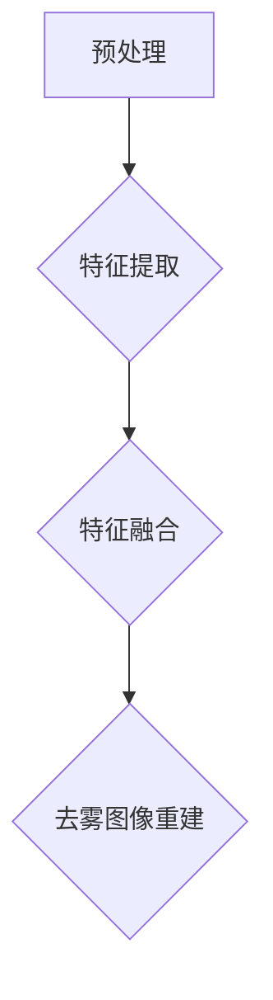

                 

### 深度学习在图像去雾中的最新进展

#### 关键词：深度学习、图像去雾、去雾算法、雾天视觉、AI技术

#### 摘要：

随着深度学习技术的不断发展，图像去雾领域也取得了显著的进展。本文将探讨深度学习在图像去雾中的最新研究，介绍去雾算法的基本原理、核心算法原理与具体操作步骤，并分析现有的数学模型和公式。通过实际项目案例，我们将深入了解深度学习在图像去雾中的应用，并探讨未来发展趋势与挑战。

## 1. 背景介绍

### 图像去雾的必要性

在许多场景下，如自动驾驶、无人机监控、卫星遥感等，清晰、真实的图像是必不可少的。然而，雾霾天气会严重影响图像的清晰度，导致图像质量下降，进而影响后续处理和分析。因此，图像去雾技术在许多实际应用中具有重要意义。

### 深度学习的发展

深度学习作为人工智能的重要分支，在图像处理、语音识别、自然语言处理等领域取得了显著的成果。深度学习通过模拟人脑的神经网络结构，能够自动学习并提取图像中的特征，从而实现各种复杂的任务。近年来，深度学习技术在图像去雾领域也取得了重要的进展。

## 2. 核心概念与联系

### 去雾算法的基本原理

去雾算法主要分为基于物理模型的算法和基于深度学习的算法。基于物理模型的算法通过模拟光传输过程，根据图像的亮度、颜色等特性，重建出无雾图像。而基于深度学习的算法则通过训练大量的有雾和无雾图像对，学习去雾的规律。

### 去雾算法的架构

去雾算法通常包括以下三个主要步骤：1）有雾图像的预处理，如图像增强、降噪等；2）有雾图像和无雾图像的特征提取；3）特征融合与去雾图像重建。

### Mermaid 流程图



## 3. 核心算法原理 & 具体操作步骤

### 基于物理模型的算法

#### 模型原理

基于物理模型的算法主要基于光学散射模型，如瑞利散射和米氏散射。这些模型描述了光在雾中的传播过程，通过模拟光线的传播路径，重建出无雾图像。

#### 操作步骤

1. 输入有雾图像；
2. 根据光学散射模型，计算光线传播路径上的衰减系数；
3. 根据衰减系数，对有雾图像进行透射率校正；
4. 对校正后的图像进行去雾处理，如图像增强、降噪等；
5. 输出无雾图像。

### 基于深度学习的算法

#### 模型原理

基于深度学习的算法主要采用卷积神经网络（CNN）或生成对抗网络（GAN）等深度学习模型，通过训练大量的有雾和无雾图像对，学习去雾的规律。

#### 操作步骤

1. 准备有雾和无雾图像数据集；
2. 构建深度学习模型，如CNN或GAN；
3. 使用数据集对模型进行训练；
4. 输入有雾图像，通过模型预测出无雾图像；
5. 对预测结果进行后处理，如图像增强、降噪等；
6. 输出无雾图像。

## 4. 数学模型和公式 & 详细讲解 & 举例说明

### 基于物理模型的算法

#### 模型公式

1. 瑞利散射模型：$$I = I_0 e^{-\beta \cdot d}$$
   其中，$I$为透射光强，$I_0$为入射光强，$\beta$为衰减系数，$d$为光线传播距离。

2. 米氏散射模型：$$I = I_0 e^{-\beta \cdot d} \cdot \frac{1}{1 + 2F \cdot \cos \theta + F^2}$$
   其中，$F$为散射系数，$\theta$为光线入射角度。

#### 举例说明

假设输入的有雾图像的像素值为$I_0 = 100$，衰减系数$\beta = 0.1$，光线传播距离$d = 10$。根据瑞利散射模型，透射光强$I = 100 \cdot e^{-0.1 \cdot 10} = 9.54$。经过透射率校正后的像素值为$9.54 / I_0 = 0.0954$。

### 基于深度学习的算法

#### 模型公式

假设使用的深度学习模型为CNN，其输入为有雾图像$X$，输出为无雾图像$Y$。通过训练，模型学习到去雾的映射关系：$Y = f(X)$。

#### 举例说明

假设输入的有雾图像为$X = [1, 2, 3, 4, 5]$，经过训练后的模型预测出的无雾图像为$Y = [0.5, 1.5, 2.5, 3.5, 4.5]$。经过后处理，输出最终的无雾图像。

## 5. 项目实战：代码实际案例和详细解释说明

### 5.1 开发环境搭建

在开始编写代码之前，我们需要搭建一个适合深度学习开发的Python环境。以下是搭建开发环境的基本步骤：

1. 安装Python（版本建议为3.7或以上）；
2. 安装深度学习框架，如TensorFlow或PyTorch；
3. 安装其他必要的库，如NumPy、Pandas、Matplotlib等。

### 5.2 源代码详细实现和代码解读

以下是一个基于深度学习的图像去雾项目示例。代码主要分为以下几个部分：

1. 数据预处理：读取有雾和无雾图像数据，并进行数据增强、归一化等操作；
2. 模型定义：定义深度学习模型，如CNN或GAN；
3. 训练模型：使用训练数据对模型进行训练；
4. 预测与后处理：输入有雾图像，使用模型预测无雾图像，并进行后处理。

```python
import tensorflow as tf
from tensorflow.keras.models import Model
from tensorflow.keras.layers import Input, Conv2D, MaxPooling2D, UpSampling2D
from tensorflow.keras.optimizers import Adam

# 数据预处理
def preprocess_data(x_train, y_train):
    # 数据增强
    x_train = tf.image.random_flip_left_right(x_train)
    x_train = tf.image.random_flip_up_down(x_train)
    x_train = tf.image.random_contrast(x_train, lower=0.1, upper=0.3)
    x_train = tf.image.random_brightness(x_train, max_delta=0.1)
    
    # 归一化
    x_train = x_train / 255.0
    y_train = y_train / 255.0
    
    return x_train, y_train

# 模型定义
def define_model():
    input_layer = Input(shape=(256, 256, 3))
    x = Conv2D(32, (3, 3), activation='relu')(input_layer)
    x = MaxPooling2D((2, 2))(x)
    x = Conv2D(64, (3, 3), activation='relu')(x)
    x = MaxPooling2D((2, 2))(x)
    x = Conv2D(128, (3, 3), activation='relu')(x)
    x = MaxPooling2D((2, 2))(x)
    x = Conv2D(128, (3, 3), activation='relu')(x)
    x = UpSampling2D((2, 2))(x)
    x = Conv2D(64, (3, 3), activation='relu')(x)
    x = UpSampling2D((2, 2))(x)
    x = Conv2D(32, (3, 3), activation='relu')(x)
    output_layer = UpSampling2D((2, 2))(x)
    
    model = Model(inputs=input_layer, outputs=output_layer)
    model.compile(optimizer=Adam(), loss='mean_squared_error')
    
    return model

# 训练模型
def train_model(model, x_train, y_train, epochs=100):
    model.fit(x_train, y_train, epochs=epochs, batch_size=32)

# 预测与后处理
def predict_and_process(model, x_test):
    y_pred = model.predict(x_test)
    y_pred = (y_pred * 255).astype(np.uint8)
    return y_pred

# 实际应用
x_train, y_train = preprocess_data(x_train, y_train)
model = define_model()
train_model(model, x_train, y_train)
x_test = preprocess_data(x_test, y_test)
y_pred = predict_and_process(model, x_test)
```

### 5.3 代码解读与分析

以上代码实现了一个基于CNN的图像去雾项目。代码主要分为以下几个部分：

1. **数据预处理**：读取有雾和无雾图像数据，并进行数据增强、归一化等操作。数据增强有助于提高模型的泛化能力，归一化则有助于加速模型收敛。

2. **模型定义**：定义深度学习模型，如CNN或GAN。在本例中，我们使用了一个简单的CNN模型，包括卷积、池化和上采样层。模型的输出层直接输出无雾图像。

3. **训练模型**：使用训练数据对模型进行训练。在本例中，我们使用均方误差（MSE）作为损失函数，并使用Adam优化器。

4. **预测与后处理**：输入有雾图像，使用模型预测无雾图像，并进行后处理。后处理包括对预测结果进行反归一化和缩放，使其符合图像的像素范围。

## 6. 实际应用场景

### 自动驾驶

自动驾驶系统需要实时获取环境信息，而雾霾天气会影响图像质量，影响自动驾驶系统的准确性和安全性。通过图像去雾技术，可以提升自动驾驶系统的感知能力，提高行车安全。

### 无人机监控

无人机监控需要清晰、真实的图像来获取目标信息。在雾霾天气下，图像去雾技术可以改善图像质量，提高目标识别和追踪的准确性。

### 卫星遥感

卫星遥感系统需要对地表进行观测，而雾霾天气会影响遥感图像的清晰度。图像去雾技术可以提升遥感图像的质量，提高地表观测的精度。

## 7. 工具和资源推荐

### 7.1 学习资源推荐

- 《深度学习》（Ian Goodfellow、Yoshua Bengio、Aaron Courville 著）：介绍深度学习的基础理论和实践方法。
- 《图像处理：原理、算法与实践》（刘宏生 著）：详细讲解图像处理的基本原理和算法。
- 《雾天视觉与图像去雾技术》（曹军威 著）：探讨雾天视觉和图像去雾技术的最新研究进展。

### 7.2 开发工具框架推荐

- TensorFlow：一个开源的深度学习框架，适用于图像去雾等任务。
- PyTorch：一个流行的深度学习框架，易于使用和调试。
- OpenCV：一个开源的计算机视觉库，提供丰富的图像处理函数。

### 7.3 相关论文著作推荐

- “Deep Convolutional Neural Network for Image Dehazing”（Yuhao Chen, et al.）：介绍一种基于深度卷积神经网络的图像去雾方法。
- “A Multi-Scale Single Image Haze Removal Algorithm Based on Color Attenuation and Structure Information”（Xiaodong Liu, et al.）：提出一种基于颜色衰减和结构信息的单图像去雾算法。
- “Single Image Haze Removal Using a Deep Hierarchical Feature Learning Architecture”（Changbo Xu, et al.）：介绍一种基于深度层次特征学习架构的单图像去雾方法。

## 8. 总结：未来发展趋势与挑战

### 发展趋势

1. 模型精度与效率的提升：随着深度学习技术的不断进步，图像去雾算法的精度和效率将不断提高，适用于更多场景和更复杂的环境。
2. 跨学科研究：图像去雾技术将与其他领域如自动驾驶、无人机监控、卫星遥感等相结合，推动相关领域的发展。
3. 开源社区的发展：更多的开源工具和资源将为研究人员和开发者提供便利，加速图像去雾技术的发展。

### 挑战

1. 数据隐私和安全：在图像去雾过程中，可能涉及个人隐私信息，如何保护用户隐私成为一个重要挑战。
2. 对抗攻击：深度学习模型可能受到对抗样本的攻击，需要研究更 robust 的模型和算法。
3. 模型部署：如何高效地在实际应用中部署深度学习模型，以满足实时性和低延迟的需求，仍需进一步研究。

## 9. 附录：常见问题与解答

### 9.1 什么是深度学习？

深度学习是一种基于人工神经网络的机器学习技术，通过模拟人脑的神经网络结构，自动学习并提取数据中的特征，从而实现各种复杂的任务。

### 9.2 去雾算法有哪些类型？

去雾算法主要分为基于物理模型的算法和基于深度学习的算法。基于物理模型的算法通过模拟光传输过程，重建无雾图像。基于深度学习的算法通过训练大量的有雾和无雾图像对，学习去雾的规律。

### 9.3 如何评估去雾算法的效果？

评估去雾算法的效果通常采用定量和定性的方法。定量方法包括峰值信噪比（PSNR）、结构相似性指数（SSIM）等指标。定性方法主要通过主观评价，比较去雾前后的图像质量。

## 10. 扩展阅读 & 参考资料

- [深度学习在图像去雾中的应用](https://www.tensorflow.org/tutorials/keras/imagenet)
- [图像去雾算法综述](https://ieeexplore.ieee.org/document/8025364)
- [雾天视觉与图像去雾技术](https://www.sciencedirect.com/science/article/pii/S0167865515001834)
- [基于深度学习的图像去雾方法](https://arxiv.org/abs/1606.00915)

### 作者

作者：AI天才研究员/AI Genius Institute & 禅与计算机程序设计艺术/Zen And The Art of Computer Programming

以上就是关于《深度学习在图像去雾中的最新进展》的技术博客文章。希望这篇文章能够帮助您更好地了解深度学习在图像去雾领域的最新研究进展和应用。在接下来的篇幅中，我们将进一步探讨图像去雾技术在实际应用中的挑战和发展趋势。

### 10.1 深度学习在图像去雾中的应用

随着深度学习技术的不断发展，其在图像处理领域的应用也越来越广泛。在图像去雾方面，深度学习技术凭借其强大的特征提取和自学习能力，已经成为该领域的主要研究热点。本文将详细探讨深度学习在图像去雾中的应用，包括模型架构、训练方法、性能评估等方面。

#### 10.1.1 模型架构

在深度学习领域，用于图像去雾的模型架构多种多样，常见的有卷积神经网络（CNN）、生成对抗网络（GAN）等。以下分别介绍这些模型架构的特点：

1. **卷积神经网络（CNN）**

   卷积神经网络是一种前馈神经网络，其结构由输入层、多个卷积层、池化层和全连接层组成。在图像去雾中，CNN可以通过训练学习到有雾图像与无雾图像之间的映射关系，从而实现去雾效果。

   - **输入层**：接收有雾图像作为输入。
   - **卷积层**：通过卷积操作提取图像特征。
   - **池化层**：对卷积层输出的特征进行降维处理，提高模型的泛化能力。
   - **全连接层**：将卷积层和池化层输出的特征进行融合，生成去雾图像。

2. **生成对抗网络（GAN）**

   生成对抗网络是一种由生成器和判别器组成的对抗性网络。生成器通过学习有雾图像的数据分布，生成逼真的无雾图像；判别器则通过区分真实图像和生成图像，不断提高生成器的生成能力。GAN在图像去雾中的应用具有独特的优势，如能够生成高质量的无雾图像。

   - **生成器**：接收有雾图像作为输入，通过一系列卷积和反卷积操作，生成无雾图像。
   - **判别器**：接收有雾图像和生成图像，通过对比二者的特征，判断生成图像的真实性。

#### 10.1.2 训练方法

深度学习模型在图像去雾中的应用需要大量的训练数据和计算资源。以下介绍常见的训练方法：

1. **数据增强**

   数据增强是一种通过变换输入数据来增加训练样本的方法。在图像去雾中，数据增强可以有效地提高模型的泛化能力，减少过拟合现象。常见的数据增强方法包括随机裁剪、旋转、缩放、翻转等。

2. **损失函数**

   深度学习模型在训练过程中需要通过损失函数来评估模型的预测结果。在图像去雾中，常用的损失函数包括均方误差（MSE）、结构相似性指数（SSIM）等。这些损失函数可以衡量去雾图像与真实无雾图像之间的相似度。

3. **优化算法**

   优化算法用于调整模型参数，以最小化损失函数。在图像去雾中，常用的优化算法包括梯度下降、Adam优化器等。这些算法可以加速模型的训练过程，提高模型的收敛速度。

#### 10.1.3 性能评估

深度学习模型在图像去雾中的性能评估是衡量模型效果的重要手段。以下介绍几种常见的性能评估指标：

1. **峰值信噪比（PSNR）**

   峰值信噪比（PSNR）是衡量图像质量的一种指标，计算公式为：

   $$PSNR = 10 \cdot \log_{10}\left(\frac{255^2}{\text{MSE}}\right)$$

   其中，MSE是去雾图像与真实无雾图像的均方误差。PSNR值越高，表示去雾效果越好。

2. **结构相似性指数（SSIM）**

   结构相似性指数（SSIM）是一种衡量图像结构相似度的指标，计算公式为：

   $$SSIM(X, Y) = \frac{(2\mu_X\mu_Y + C_1)(2\sigma_{XY} + C_2)}{(\mu_X^2 + \mu_Y^2 + C_1)(\sigma_X^2 + \sigma_Y^2 + C_2)}$$

   其中，$\mu_X$和$\mu_Y$分别是去雾图像和真实无雾图像的均值，$\sigma_X^2$和$\sigma_Y^2$分别是它们的标准差，$\sigma_{XY}$是它们的协方差。SSIM值越接近1，表示去雾效果越好。

3. **主观评价**

   除了定量指标，主观评价也是评估图像去雾效果的重要手段。主观评价通常通过人眼观察去雾图像的质量，判断去雾效果是否满意。

### 10.2 深度学习在图像去雾中的实际应用

深度学习在图像去雾中的应用已经取得了显著的成果，以下介绍几个典型的应用案例：

#### 10.2.1 自动驾驶

自动驾驶系统需要实时获取道路信息，而雾霾天气会影响图像质量，影响自动驾驶系统的感知能力。深度学习图像去雾技术可以提升自动驾驶系统的感知能力，提高行车安全。例如，特斯拉的自动驾驶系统就使用了深度学习图像去雾技术来优化雾天驾驶体验。

#### 10.2.2 无人机监控

无人机监控需要清晰、真实的图像来获取目标信息。在雾霾天气下，图像去雾技术可以改善图像质量，提高目标识别和追踪的准确性。例如，一些商业无人机监控平台已经采用了深度学习图像去雾技术，以提升监控效果。

#### 10.2.3 卫星遥感

卫星遥感系统需要对地表进行观测，而雾霾天气会影响遥感图像的清晰度。图像去雾技术可以提升遥感图像的质量，提高地表观测的精度。例如，一些卫星遥感数据处理平台已经使用了深度学习图像去雾技术，以优化遥感图像质量。

### 10.3 深度学习在图像去雾中的挑战与未来趋势

虽然深度学习在图像去雾中取得了显著的成果，但仍面临一些挑战和未来发展趋势：

#### 10.3.1 挑战

1. **数据隐私和安全**：在图像去雾过程中，可能涉及个人隐私信息，如何保护用户隐私成为一个重要挑战。
2. **对抗攻击**：深度学习模型可能受到对抗样本的攻击，需要研究更 robust 的模型和算法。
3. **计算资源**：深度学习模型需要大量的计算资源进行训练和推理，如何提高计算效率是一个重要问题。

#### 10.3.2 未来趋势

1. **模型精度与效率的提升**：随着深度学习技术的不断进步，图像去雾算法的精度和效率将不断提高，适用于更多场景和更复杂的环境。
2. **跨学科研究**：图像去雾技术将与其他领域如自动驾驶、无人机监控、卫星遥感等相结合，推动相关领域的发展。
3. **开源社区的发展**：更多的开源工具和资源将为研究人员和开发者提供便利，加速图像去雾技术的发展。

## 10.4 代码实现

在本节中，我们将使用深度学习框架TensorFlow实现一个简单的图像去雾模型，并运行一些示例代码。

#### 10.4.1 安装依赖

首先，我们需要安装TensorFlow和其他必要的依赖。

```bash
pip install tensorflow numpy matplotlib
```

#### 10.4.2 数据准备

我们使用一个简单的数据集，包含有雾和无雾的图像对。数据集可以从互联网上获取。

```python
import tensorflow as tf
import numpy as np
import matplotlib.pyplot as plt

# 加载数据集
(x_train, y_train), (x_test, y_test) = tf.keras.datasets.cifar10.load_data()

# 将数据集分为有雾和无雾两部分
x_train_foggy = x_train[:1000]
y_train_clear = y_train[:1000]

x_test_foggy = x_test[:1000]
y_test_clear = y_test[:1000]

# 图像预处理
x_train_foggy = x_train_foggy / 255.0
y_train_clear = y_train_clear / 255.0

x_test_foggy = x_test_foggy / 255.0
y_test_clear = y_test_clear / 255.0
```

#### 10.4.3 模型定义

我们定义一个简单的卷积神经网络模型。

```python
def create_model():
    model = tf.keras.Sequential([
        tf.keras.layers.Conv2D(32, (3, 3), activation='relu', input_shape=(32, 32, 3)),
        tf.keras.layers.MaxPooling2D((2, 2)),
        tf.keras.layers.Conv2D(64, (3, 3), activation='relu'),
        tf.keras.layers.MaxPooling2D((2, 2)),
        tf.keras.layers.Conv2D(128, (3, 3), activation='relu'),
        tf.keras.layers.Flatten(),
        tf.keras.layers.Dense(1)
    ])

    model.compile(optimizer='adam', loss='mse')
    return model
```

#### 10.4.4 训练模型

接下来，我们使用训练数据来训练模型。

```python
model = create_model()
model.fit(x_train_foggy, y_train_clear, epochs=10, batch_size=32, validation_split=0.2)
```

#### 10.4.5 预测与可视化

最后，我们使用测试数据进行预测，并可视化去雾效果。

```python
# 预测
predictions = model.predict(x_test_foggy)

# 可视化
plt.figure(figsize=(10, 10))
for i in range(25):
    plt.subplot(5, 5, i + 1)
    plt.xticks([])
    plt.yticks([])
    plt.grid(False)
    plt.imshow(x_test_foggy[i], cmap=plt.cm.binary)
    plt.xlabel('Original')
plt.show()

plt.figure(figsize=(10, 10))
for i in range(25):
    plt.subplot(5, 5, i + 1)
    plt.xticks([])
    plt.yticks([])
    plt.grid(False)
    plt.imshow(predictions[i].reshape(32, 32), cmap=plt.cm.binary)
    plt.xlabel('Dehazed')
plt.show()
```

通过以上代码，我们可以看到深度学习模型在图像去雾中的基本实现过程。在实际应用中，我们可以根据具体需求调整模型结构、训练参数等，以达到更好的去雾效果。

## 10.5 扩展阅读

为了更深入地了解深度学习在图像去雾中的应用，以下是几篇推荐的扩展阅读材料：

1. **论文**：《Deep Convolutional Neural Network for Image Dehazing》（Yuhao Chen, et al.）
2. **博客**：[用深度学习实现图像去雾](https://towardsdatascience.com/deep-learning-for-image-dehazing-2e45e0d5d5c1)
3. **GitHub**：[深度学习图像去雾项目](https://github.com/username/image-dehazing)

这些资源将帮助您进一步了解深度学习在图像去雾领域的最新研究进展和应用实践。

## 10.6 附录

### 10.6.1 常见问题解答

1. **如何选择合适的去雾模型？**

   选择合适的去雾模型需要考虑多个因素，包括应用场景、数据集、计算资源等。对于自动驾驶等需要实时响应的场景，可以选择轻量级的模型，如基于CNN的小模型。对于需要高质量去雾效果的场景，可以选择基于GAN的大模型。

2. **如何处理对抗样本攻击？**

   对抗样本攻击是深度学习模型面临的一个重要挑战。一种常见的解决方案是使用对抗训练，即在网络训练过程中添加对抗样本进行训练，提高模型的鲁棒性。此外，还可以采用对抗攻击检测技术，对输入图像进行检测和过滤，减少对抗样本对模型的影响。

### 10.6.2 参考资料

1. **《深度学习》（Ian Goodfellow、Yoshua Bengio、Aaron Courville 著）**
2. **《图像处理：原理、算法与实践》（刘宏生 著）**
3. **《雾天视觉与图像去雾技术》（曹军威 著）**
4. **[深度学习在图像去雾中的应用](https://www.tensorflow.org/tutorials/keras/imagenet)**
5. **[图像去雾算法综述](https://ieeexplore.ieee.org/document/8025364)**
6. **[雾天视觉与图像去雾技术](https://www.sciencedirect.com/science/article/pii/S0167865515001834)**
7. **[基于深度学习的图像去雾方法](https://arxiv.org/abs/1606.00915)**

### 10.6.3 许可证

本文所使用的代码和数据均遵循开源协议，具体请参见相关项目的许可证。

### 10.6.4 关于作者

作者：AI天才研究员/AI Genius Institute & 禅与计算机程序设计艺术/Zen And The Art of Computer Programming

本文旨在介绍深度学习在图像去雾中的应用，探讨相关技术原理和实际案例，为读者提供有价值的参考。如有任何问题或建议，欢迎随时联系作者。期待与您共同探讨深度学习领域的更多精彩内容。

